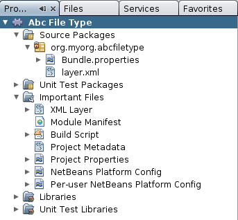
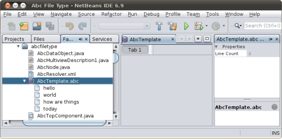

// 
//     Licensed to the Apache Software Foundation (ASF) under one
//     or more contributor license agreements.  See the NOTICE file
//     distributed with this work for additional information
//     regarding copyright ownership.  The ASF licenses this file
//     to you under the Apache License, Version 2.0 (the
//     "License"); you may not use this file except in compliance
//     with the License.  You may obtain a copy of the License at
// 
//       http://www.apache.org/licenses/LICENSE-2.0
// 
//     Unless required by applicable law or agreed to in writing,
//     software distributed under the License is distributed on an
//     "AS IS" BASIS, WITHOUT WARRANTIES OR CONDITIONS OF ANY
//     KIND, either express or implied.  See the License for the
//     specific language governing permissions and limitations
//     under the License.
//

= File Type Integration Tutorial
:jbake-type: platform_tutorial
:jbake-tags: tutorials 
:jbake-status: published
:syntax: true
:source-highlighter: pygments
:toc: left
:toc-title:
:icons: font
:experimental:
:description: File Type Integration Tutorial - Apache NetBeans
:keywords: Apache NetBeans Platform, Platform Tutorials, File Type Integration Tutorial

This tutorial shows you how to write a module that lets the IDE, or any other application built on the NetBeans Platform, recognize a new file type.

NOTE:  This document is applicable to NetBeans Platform 6.9 and above. If you are using an earlier version, see  link:68/nbm-filetype.html[the previous version of this document].

== Introduction to File Type Integration

File types that are recognized in the IDE have their own icons, menu items, and behavior. The "files" being shown are  ``FileObjects`` —wrappers around  ``java.io.File``  or, in the case of configuration files, typically wrappers around data stored in some other way, such as inside XML files in modules. What you actually _see_ are  ``Nodes`` , which provide functionality like actions and localized names to objects like files. In between  ``Nodes``  and  ``FileObjects``  are  ``DataObjects`` . A  ``DataObject``  is like a  ``FileObject`` , except that it knows what kind of file is being shown, and there are usually different types of  ``DataObject``  for files with different extensions and XML files with different namespaces. Each  ``DataObject``  is provided by a different module, each implementing support for one or more file types—for example, the Image module makes it possible to recognize and open  ``.gif``  and  ``.png``  files.

A module that recognizes a file type installs a  ``DataLoader`` —a factory for a file-type-specific  ``DataObject`` . When a folder is expanded, the IDE asks each known  ``DataLoader`` , "Do you know what this is?" The first one that says "Yes" creates the  ``DataObject``  for the file. In order to actually display something for each file, the system calls  ``DataObject.getNodeDelegate()``  for each  ``DataObject``  and the  ``Nodes``  are what you actually see in the IDE.

Below, the diagram on the left shows what each item mentioned above makes available:

image::images/filetype_diagram-dataobject2.png[]

In this tutorial, you create a module that installs a  ``DataLoader``  for imaginary "Abc" files ( ``.abc``  file extension). By default, a file with the "abc" extension is treated as any other file that the IDE does not recognize—it is treated as a text file and, as a result, the IDE provides the same functionality for Abc files as it does for text files. Once you have created the module, you will be shown how to enhance it with functionality that will be available to Abc files only. When you complete the development cycle, you can easily let others make use of your module—the IDE lets you create a binary that you can share with others, who can then install it through the Plugin Manager of their application.

== Creating the Module Project

In this section, we use a wizard to create the source structure that every NetBeans module requires. The source structure consists of certain folders in specific places and a set of files that are always needed. For example, every NetBeans module requires a  ``nbproject``  folder, which holds the project's metadata, and a  ``layer.xml``  file, for declarative registration of items such as toolbar buttons and windows.

[start=1]
1. Choose File > New Project (Ctrl-Shift-N). Under Categories, select NetBeans Modules. Under Projects, select Module and click Next.

[start=2]
1. 
In the Name and Location panel, type  ``AbcFileType``  in Project Name. Change the Project Location to any directory on your computer, such as  ``c:\mymodules`` . Leave the Standalone Module radiobutton selected. The panel should now look as follows:

image::images/filetype_69-projectwizard1.png[]

Click Next.

[start=3]
1. In the Basic Module Configuration panel, type  ``org.myorg.abcfiletype``  as the Code Name Base. Add spaces to the suggested Module Display Name, so that it is changed to  ``Abc File Type`` . Select the "Generate XML Layer" checkbox and leave the location of the localizing bundle and XML layer as they are, so that they will be stored in a package with the name  ``org/myorg/abcfiletype`` . The panel should now look as follows:

image::images/filetype_69-projectwizard2.png[]

[start=4]
1. Click Finish.

The IDE creates the  ``Abc File Type``  project. The project contains all of your sources and project metadata, such as the project's Ant build script. The project opens in the IDE. You can view its logical structure in the Projects window (Ctrl-1) and its file structure in the Files window (Ctrl-2). For example, the Projects window should now look as follows:

== Recognizing Abc Files

In this section, we use a wizard to create the classes necessary for recognizing Abc files as being distinct from all other files. As discussed at the start of this tutorial, we need a data object and a data loader, as well as a MIME type resolver, and registration entries in the  ``layer.xml``  file, to do so. The New File Type wizard will create all of these for us.

[start=1]
1. Right-click the project node and choose New > File Type.

[start=2]
1. In the File Recognition panel, do the following:
* Type  ``text/x-abc``  in the MIME Type edit box.
* Type  ``.abc .ABC``  in the by Filename Extension edit box.

The File Recognition panel should now look as follows:

image::images/filetype_69-filewizard1.png[]

Note the following about the fields in the File Recognition panel:

* *MIME Type.* Specifies the data object's unique MIME type.
* by
* *Filename Extension.* Specifies one or more file extensions that the IDE will recognize as belonging to the specified MIME type. The file extension can optionally be preceded by a dot. Separators are commas, spaces, or both. Therefore, all of the following are valid:
*  ``.abc,.def`` 
*  ``.abc .def`` 
*  ``abc def`` 
*  ``abc,.def ghi, .wow`` 

Let's imagine that Abc files be case-sensitive. For this reason, you specify _two_ MIME types in this tutorial— ``.abc``  and  ``.ABC`` .

* *XML Root Element.* Specifies a unique namespace that distinguishes the XML file type from all other XML file types. Since many XML files have the same extension ( ``xml`` ), the IDE distinguishes between XML files via their XML root elements. More specifically, the IDE can distinguish between namespaces and the first XML element in XML files. You can use this to, for example, distinguish between a JBoss deployment descriptor and a WebLogic deployment descriptor. Once you have made this distinction, you can ensure that menu items added to the JBoss deployment descriptor's contextual menu are not available to the WebLogic deployment descriptor. For an example, see the  link:nbm-palette-api2.html[NetBeans Component Palette Module Tutorial].

Click Next.

[start=3]
1. In the Name and Location panel, type  ``Abc``  as the Class Name Prefix and browse to any 16x16 pixel image file as the new file type's icon, as shown below.

image::images/filetype_69-filewizard2.png[]

*Note:* You can use any icon of a 16x16 pixel dimension. If you like, you can click on this one and save it locally, and then specify it in the wizard step above: 
image::images/filetype_Datasource.gif[]

[start=4]
1. Click Finish.

The Projects window should now look as follows:

image::images/filetype_69-projectswindow2.png[]

Each of the newly generated files is briefly introduced:

* *AbcDataObject.java.* Wraps a  ``FileObject`` . DataObjects are produced by DataLoaders. For more information, see  link:https://netbeans.apache.org/wiki/devfaqdataobject[What is a DataObject?].
* *AbcResolver.xml.* Maps the  ``.abc``  and  ``.ABC``  extensions to the MIME type. The  ``AbcDataLoader``  only recognizes the MIME type; it does not know about the file extension. That is the task of the MIME type resolver, which uses  link:https://bits.netbeans.org/dev/javadoc/org-openide-filesystems/org/openide/filesystems/doc-files/resolverDocumentation.html[these] rules to determine whether a file is recognized.
* *AbcTemplate.abc.* Provides the basis of a file template that is registered in the  ``layer.xml``  such that it will be installed in the New File dialog as a new template.
* *AbcDataObjectTest.java.* JUnit test class for the  ``DataObject`` .

In the  ``layer.xml``  file, you should see the following:

[source,xml]
----

<folder name="Loaders">
    <folder name="text">
        <folder name="x-abc">
            <folder name="Actions">
                <file name="org-openide-actions-CopyAction.shadow">
                    <attr name="originalFile" stringvalue="Actions/Edit/org-openide-actions-CopyAction.instance"/>
                    <attr name="position" intvalue="400"/>
                </file>
                <file name="org-openide-actions-CutAction.shadow">
                    <attr name="originalFile" stringvalue="Actions/Edit/org-openide-actions-CutAction.instance"/>
                    <attr name="position" intvalue="300"/>
                </file>
                <file name="org-openide-actions-DeleteAction.shadow">
                    <attr name="originalFile" stringvalue="Actions/Edit/org-openide-actions-DeleteAction.instance"/>
                    <attr name="position" intvalue="600"/>
                </file>
                <file name="org-openide-actions-FileSystemAction.shadow">
                    <attr name="originalFile" stringvalue="Actions/System/org-openide-actions-FileSystemAction.instance"/>
                    <attr name="position" intvalue="1100"/>
                </file>
                <file name="org-openide-actions-OpenAction.shadow">
                    <attr name="originalFile" stringvalue="Actions/System/org-openide-actions-OpenAction.instance"/>
                    <attr name="position" intvalue="100"/>
                </file>
                <file name="org-openide-actions-PropertiesAction.shadow">
                    <attr name="originalFile" stringvalue="Actions/System/org-openide-actions-PropertiesAction.instance"/>
                    <attr name="position" intvalue="1400"/>
                </file>
                <file name="org-openide-actions-RenameAction.shadow">
                    <attr name="originalFile" stringvalue="Actions/System/org-openide-actions-RenameAction.instance"/>
                    <attr name="position" intvalue="700"/>
                </file>
                <file name="org-openide-actions-SaveAsTemplateAction.shadow">
                    <attr name="originalFile" stringvalue="Actions/System/org-openide-actions-SaveAsTemplateAction.instance"/>
                    <attr name="position" intvalue="900"/>
                </file>
                <file name="org-openide-actions-ToolsAction.shadow">
                    <attr name="originalFile" stringvalue="Actions/System/org-openide-actions-ToolsAction.instance"/>
                    <attr name="position" intvalue="1300"/>
                </file>
                <file name="sep-1.instance">
                    <attr name="instanceClass" stringvalue="javax.swing.JSeparator"/>
                    <attr name="position" intvalue="200"/>
                </file>
                <file name="sep-2.instance">
                    <attr name="instanceClass" stringvalue="javax.swing.JSeparator"/>
                    <attr name="position" intvalue="500"/>
                </file>
                <file name="sep-3.instance">
                    <attr name="instanceClass" stringvalue="javax.swing.JSeparator"/>
                    <attr name="position" intvalue="800"/>
                </file>
                <file name="sep-4.instance">
                    <attr name="instanceClass" stringvalue="javax.swing.JSeparator"/>
                    <attr name="position" intvalue="1000"/>
                </file>
                <file name="sep-5.instance">
                    <attr name="instanceClass" stringvalue="javax.swing.JSeparator"/>
                    <attr name="position" intvalue="1200"/>
                </file>
            </folder>
            <folder name="Factories">
                <file name="AbcDataLoader.instance">
                    <attr name="SystemFileSystem.icon" urlvalue="nbresloc:/org/myorg/abcfiletype/Datasource.gif"/>
                    <attr name="dataObjectClass" stringvalue="org.myorg.abcfiletype.AbcDataObject"/>
                    <attr name="instanceCreate" methodvalue="org.openide.loaders.DataLoaderPool.factory"/>
                    <attr name="mimeType" stringvalue="text/x-abc"/>
                </file>
            </folder>
        </folder>
    </folder>
</folder>
<folder name="Services">
    <folder name="MIMEResolver">
        <file name="AbcResolver.xml" url="AbcResolver.xml">
            <attr name="displayName" bundlevalue="org.myorg.abcfiletype.Bundle#Services/MIMEResolver/AbcResolver.xml"/>
        </file>
    </folder>
</folder>
<folder name="Templates">
    <folder name="Other">
        <file name="AbcTemplate.abc" url="AbcTemplate.abc">
            <attr name="displayName" bundlevalue="org.myorg.abcfiletype.Bundle#Templates/Other/AbcTemplate.abc"/>
            <attr name="template" boolvalue="true"/>
        </file>
    </folder>
</folder>
----

== Installing and Trying Out the Functionality

Let's now install the module and then use the basic functionality we've created so far. The IDE uses an Ant build script to build and install your module. The build script is created for you when you create the project.

[start=1]
1. In the Projects window, right-click the  ``Abc File Type``  project and choose Run.

A new instance of the IDE starts, installing your module into itself.

[start=2]
1. Choose Window | Favorites and then browse to the "AbcTemplate.abc" file in your module source structure. Notice that the icon assigned to your file type is shown for your file and that you can open the file in the IDE's text editor:

image::images/filetype_69-run-module1.png[]

[start=3]
1. Next, let's use the IDE to create a new file of our template, using the template registered in the module. To get started, use the New Project dialog (Ctrl-Shift-N) to create any kind of application in the IDE.

[start=4]
1. 
Once you have a project, right-click the application node and choose New > Other. In the Other category, a template is available for working with the new file type:

image::images/filetype_69-run-module2.png[]

Complete the wizard and you will have created a template that can be used for starting off the user's work with the given file type.

If you want to provide default code via the template, add the code to the  ``AbcTemplate.abc``  file that the New File Type wizard created for you.

== Creating Features for Abc Files

Now that the NetBeans Platform is able to distinguish Abc files from all other types of files, it is time to add features specifically for these types of files. In this section, we add a menu item on the right-click contextual menu of the file's node in the explorer windows, such as in the Projects window, and we enable the file to open into a window, instead of into an editor.

=== Adding a Context-Sensitive Action

In this subsection, we use the New Action wizard to create a Java class that will perform an action for our file type. The wizard will also register the class in the  ``layer.xml``  file such that the user will be able to invoke the action from the right-click contextual menu of the file type's node in an explorer window.

[start=1]
1. Right-click the project node and choose New > Action.

[start=2]
1. 
In the Action Type panel, click Conditionally Enabled. Type  ``org.myorg.abcfiletype.AbcDataObject`` , which is the fully qualified name of the data object generated above by the New File Type wizard, as shown below:

image::images/filetype_69-action1.png[]

Click Next.

[start=3]
1. In the GUI Registration panel, select the 'File' category in the Category drop-down list. The Category drop-down list controls where an action is shown in the Keyboard Shortcuts editor in the IDE.

Next, Unselect Global Menu Item and then select File Type Contect Menu Item. In the Content Type drop-down list, select the MIME type you specified above in the New File Type wizard, as shown below:

image::images/filetype_69-action2.png[]

Notice that you can set the position of the menu item and that you can separate the menu item from the item before it and after it. Click Next.

[start=4]
1. In the Name and Location panel, type  ``MyAction``  as the Class Name and type  ``My Action``  as the Display Name. Optionally, provide an icon to be displayed.

image::images/filetype_69-action3.png[]

Click Finish and  ``MyAction.java``  is added to the  ``org.myorg.abcfiletype``  package.

[start=5]
1. In the Source Editor, add some code to the action's  ``actionPerformed``  method:

[source,java]
----

@Override
public void actionPerformed(ActionEvent ev) {
   FileObject f = context.getPrimaryFile();
   String displayName = FileUtil.getFileDisplayName(f);
   String msg = "I am " + displayName + ". Hear me roar!";
   NotifyDescriptor nd = new NotifyDescriptor.Message(msg);
   DialogDisplayer.getDefault().notify(nd);
}
----

Press Ctrl-Shift-I. The IDE automatically adds import statements to the top of the class.

Some code is still underlined in red, to indicate that not all of the required packages are on the classpath. Right-click the project node, choose Properties, and click Libraries in the Project Properties dialog box. Click add at the top of the Libraries pane and add the Dialogs API.

In the  ``MyAction.java``  class, press Ctrl-Shift-I again. The red underlining disappears because the IDE finds the required packages in the Dialogs API.

The code should now be as follows:

[source,java]
----

import java.awt.event.ActionListener;
import java.awt.event.ActionEvent;
import org.openide.DialogDisplayer;
import org.openide.NotifyDescriptor;
import org.openide.filesystems.FileObject;
import org.openide.filesystems.FileUtil;

public final class MyAction implements ActionListener {

    private final AbcDataObject context;

    public MyAction(AbcDataObject context) {
        this.context = context;
    }

    public void actionPerformed(ActionEvent ev) {
        FileObject f = context.getPrimaryFile();
        String displayName = FileUtil.getFileDisplayName(f);
        String msg = "I am " + displayName + ". Hear me roar!";
        NotifyDescriptor nd = new NotifyDescriptor.Message(msg);
        DialogDisplayer.getDefault().notify(nd);
    }

}
----

[start=6]
1. Open the  ``layer.xml``  file and notice that your Action has been registered in the "Loaders" folder, as follows:

[source,xml]
----

...
...
...
  <folder name="Loaders">
        <folder name="text">
            <folder name="x-abc">
                <folder name="Actions">
                    *<file name="org-myorg-abcfiletype-MyAction.shadow">
                        <attr name="originalFile" stringvalue="Actions/File/org-myorg-abcfiletype-MyAction.instance"/>
                        <attr name="position" intvalue="0"/>
                    </file>*
                    <file name="org-openide-actions-CopyAction.shadow">
                        <attr name="originalFile" stringvalue="Actions/Edit/org-openide-actions-CopyAction.instance"/>
                        <attr name="position" intvalue="400"/>
                    </file>
                    <file name="org-openide-actions-CutAction.shadow">
                        <attr name="originalFile" stringvalue="Actions/Edit/org-openide-actions-CutAction.instance"/>
                        <attr name="position" intvalue="300"/>
                    </file>
                    <file name="org-openide-actions-DeleteAction.shadow">
                        <attr name="originalFile" stringvalue="Actions/Edit/org-openide-actions-DeleteAction.instance"/>
                        <attr name="position" intvalue="600"/>
                    </file>
                    <file name="org-openide-actions-FileSystemAction.shadow">
                        <attr name="originalFile" stringvalue="Actions/System/org-openide-actions-FileSystemAction.instance"/>
                        <attr name="position" intvalue="1100"/>
                    </file>
                    <file name="org-openide-actions-OpenAction.shadow">
                        <attr name="originalFile" stringvalue="Actions/System/org-openide-actions-OpenAction.instance"/>
                        <attr name="position" intvalue="100"/>
                    </file>
                    ...
                    ...
                    ...
----

Notice that the "org-openide-actions-OpenAction.shadow" file is registered at position 100, while your new Action is registered at position 0. The Action in the first position is the Action known as the "default Action" and will be invoked when the file is created. Rather than invoking your new Action, it makes more sense to invoke the Open Action instead, whenever the file is created. Therefore, change the position in "org-openide-actions-OpenAction.shadow" to 0 and change your own Action's position to 100.

[start=7]
1. Run the module again, as you did in the previous section.

[start=8]
1. 
Create an Abc file, using the template shown in the previous section, and right-click the file's node in one of the explorer views, such as in the Projects window or Favorites window.

Notice that the Abc file has the icon you assigned to it in its module and that the list of actions defined in its  ``layer.xml``  file is available from the right-click contextual menu:

image::images/filetype_69-dummytemplate.png[]

[start=9]
1. Choose the new menu item, the Abc file's name and location are shown:

image::images/filetype_69-information.png[]

You now know how to create a new context-sensitive action that appears in the context menu of a file of the given type, in the Projects window, Files window or the Favorites window.

=== Opening the File into a Window

By default, when the user opens a file of the type that we have defined in this tutorial, the file will open into a text editor. However, it's more likely that you may want to create a custom editor. Some custom editors are for text editing, while others provide a visual representation of the underlying file. In the latter case, you want to let the user drag and drop widgets onto the visual representation of the underlying file. The first step in creating such a user interface is to let the user open the file into a window. This subsection shows you how to do that and points you to a tutorial you can follow for extending the window to include widgets from the NetBeans Visual Library.

[start=1]
1. Right-click the project node and choose New > Window Component. Set "editor" for Window Position and "Open on Application Start", as shown below:

image::images/filetype_69-topc-1.png[]

[start=2]
1. Click Next and type "Abc" as the Class Name Prefix:

image::images/filetype_69-topc-2.png[]

Click Finish.

[start=3]
1. Change the  ``DataObject``  to use  `` link:http://bits.netbeans.org/dev/javadoc/org-openide-loaders/org/openide/loaders/OpenSupport.html[OpenSupport]``  instead of DataEditorSupport, by changing the  ``DataObject's``  constructor as follows:

[source,java]
----

public AbcDataObject(FileObject pf, MultiFileLoader loader)
        throws DataObjectExistsException, IOException {

    super(pf, loader);
    CookieSet cookies = getCookieSet();
    *//cookies.add((Node.Cookie) DataEditorSupport.create(this, getPrimaryEntry(), cookies));
    cookies.add((Node.Cookie) new AbcOpenSupport(getPrimaryEntry()));*
              
}
----

[start=4]
1. Create the  `` link:http://bits.netbeans.org/dev/javadoc/org-openide-loaders/org/openide/loaders/OpenSupport.html[OpenSupport]``  class:

[source,java]
----

class AbcOpenSupport extends OpenSupport implements OpenCookie, CloseCookie {

    public AbcOpenSupport(AbcDataObject.Entry entry) {
        super(entry);
    }

    protected CloneableTopComponent createCloneableTopComponent() {
        AbcDataObject dobj = (AbcDataObject) entry.getDataObject();
        AbcTopComponent tc = new AbcTopComponent();
        tc.setDisplayName(dobj.getName());
        return tc;
    }
 
}
----

Tweak the TopComponent to extend CloneableTopComponent, instead of TopComponent.

Run the module again and then, when an Abc file is opened, the  ``OpenSupport``  class handles the opening, such that it opens the file into the  ``TopComponent``  instead of the basic editor that  ``DataEditorSupport``  provides:

image::images/filetype_69-topc-3.png[]

The  link:https://netbeans.apache.org/tutorials/nbm-visual_library.html[NetBeans Visual Library Tutorial] provides an example of what you can do to develop the TopComponent further such that it will visually display the content of a file that corresponds to the file type defined in this tutorial.

=== Creating a Multiview Window

Now that we are able to open a file into a window, let's make the window more interesting. We'll create a multiview window. The first tab of a multiview window is typically used to display a visual representation of the file, while the second tab typically shows the source view. More than two tabs can also be provided, each tab providing further levels of detail about the opened file.

[start=1]
1. Right-click the project node and choose Properties. In the Project Properties dialog, choose Libraries, and click Add. Set a dependency on " link:http://bits.netbeans.org/dev/javadoc/org-netbeans-core-multiview/overview-summary.html[MultiView Windows]". Click OK and then click OK again to exit the Project Properties dialog.

[start=2]
1. For each tab that you want to create in the multiview window, create a class that implements  `` link:http://bits.netbeans.org/dev/javadoc/org-netbeans-core-multiview/org/netbeans/core/spi/multiview/MultiViewDescription.html[MultiViewDescription]``  and  ``Serializable`` .

For purposes of this tutorial, start by creating a class called  ``AbcMultiviewDescription1`` , implementing the specified classes:

[source,java]
----

public class AbcMultiviewDescription1 implements MultiViewDescription, Serializable {

    public int getPersistenceType() {
        throw new UnsupportedOperationException("Not supported yet.");
    }

    public String getDisplayName() {
        throw new UnsupportedOperationException("Not supported yet.");
    }

    public Image getIcon() {
        throw new UnsupportedOperationException("Not supported yet.");
    }

    public HelpCtx getHelpCtx() {
        throw new UnsupportedOperationException("Not supported yet.");
    }

    public String preferredID() {
        throw new UnsupportedOperationException("Not supported yet.");
    }

    public MultiViewElement createElement() {
        throw new UnsupportedOperationException("Not supported yet.");
    }

}
----

In the  ``AbcMultiviewDescription1``  class above, the method  ``createElement()``  returns a MultiViewElement. What you want to return here is your  ``TopComponent`` , which we will do in the next step.

[start=3]
1. Rewrite the class signature of the  ``TopComponent`` . To provide a multiview element for the description in the previous step, we need to implement  `` link:http://bits.netbeans.org/dev/javadoc/org-netbeans-core-multiview/org/netbeans/core/spi/multiview/MultiViewElement.html[MultiViewElement]`` :

[source,java]
----

public final class AbcTopComponent extends CloneableTopComponent implements MultiViewElement {
----

[start=4]
1. In the  ``TopComponent`` , you now need to delete (or comment out) the methods  ``findInstance()`` ,  ``getPersistenceType()`` ,  ``writeProperties()`` ,  ``readProperties()`` , ,  ``readPropertiesImpl()``  and  ``preferredID()``  because these methods are handled by the  ``MultiViewElement`` . Also remove the @ConvertAsProperties annotation at the top of the TopComponent, since serialization will also need to be handled via the  ``MultiViewElement``  implementation.

Don't worry about any remaining red underline markings; these will be resolved in the next step in this tutorial.

[start=5]
1. For the moment, provide very simple implementations of each of the required methods. Start by defining a new  ``JToolbar``  at the top of the  ``TopComponent``  class:

[source,java]
----

private JToolBar toolbar = new JToolBar();
----

Next, implement the methods as follows, in the  ``TopComponent`` :

[source,java]
----

    public JComponent getVisualRepresentation() {
        return this;
    }

    public JComponent getToolbarRepresentation() {
        return toolbar;
    }

    public void setMultiViewCallback(MultiViewElementCallback arg0) {
    }

    public CloseOperationState canCloseElement() {
        return null;
    }

    public Action[] getActions() {
        return new Action[]{};
    }

    public Lookup getLookup() {
        return Lookups.singleton(this);
    }

    public void componentShowing() {
    }

    public void componentHidden() {
    }

    public void componentActivated() {
    }

    public void componentDeactivated() {
    }

    public UndoRedo getUndoRedo() {
        return UndoRedo.NONE;
    }
----

[start=6]
1. Now you can redefine the  ``AbcMultiviewDescription1``  as follows:

[source,java]
----

public class AbcMultiviewDescription1 implements MultiViewDescription, Serializable {

    public int getPersistenceType() {
        return TopComponent.PERSISTENCE_ALWAYS;
    }

    public String getDisplayName() {
        return "Tab 1";
    }

    public Image getIcon() {
        return ImageUtilities.loadImage("/org/myorg/abcfiletype/Datasource.gif");
    }

    public HelpCtx getHelpCtx() {
        return null;
    }

    public String preferredID() {
       return "AbcMultiviewDescription1";
    }

    public MultiViewElement createElement() {
        return new AbcTopComponent();
    }

}
----

[start=7]
1. Change the  ``createCloneableTopComponent``  method in the  ``OpenSupport``  class to open your  ``TopComponent``  via the  ``MultiViewDescription``  class you created above:

[source,java]
----

protected CloneableTopComponent createCloneableTopComponent() {

    // Create an array of multiview descriptors:
    AbcMultiviewDescription1 firstTab = new AbcMultiviewDescription1();
    MultiViewDescription[] descriptionArray = { firstTab };

    // Create the multiview window:
    CloneableTopComponent tc = MultiViewFactory.createCloneableMultiView(descriptionArray, firstTab,  null);
    tc.setDisplayName(entry.getDataObject().getName());
    return tc;

}
----

The second argument in  ``MultiViewFactory.createCloneableMultiView``  determines which of the tabs is open by default. Here it is  ``firstTab`` , the tab defined by  ``AbcMultiViewDescription1`` .

[start=8]
1. Install and open the file again. Now you have a multiview window with one tab:

image::images/filetype_69-mvdeployed.png[]

You now have a single tab in a multiview window. For each additional tab, create a new  ``MultiviewDescription``  class, with a new  ``TopComponent`` , and then instantiate the  ``MultiViewDescription``  class in the  ``OpenSupport``  extension class, as shown above.

== Parsing the File

A  ``DataObject``  is like a  ``FileObject`` , except that it knows what kind of file is being shown. The "New File Type" wizard created a  ``DataObject``  for our file type, so let's now use it to parse the underlying file and expose its content as new nodes in the explorer views, e.g., the Projects window, Files window, and the Favorites window.

For background to this section and complete details on support for nodes on the NetBeans Platform, see  link:https://netbeans.apache.org/tutorials/nbm-nodesapi2.html[NetBeans Nodes API Tutorial].

[start=1]
1. Open the  ``AbcDataObject``  class and notice this method:

[source,java]
----

@Override
protected Node createNodeDelegate() {
    return new DataNode(this, Children.LEAF, getLookup());
}
----

The method above provides a default Node for the underlying file. The default Node has no child nodes, which is evident by the "Children.LEAF" parameter that you see above.

Instead of passing in "Children.LEAF", use the  ``ChildFactory``  class to create new child nodes of our Node class:

[source,java]
----

@Override
protected Node createNodeDelegate() {
    return new DataNode(
            this,
            *Children.create(new AbcChildFactory(this), true),*
            getLookup());
}
----

[start=2]
1. Define the  ``ChildFactory``  as follows:

[source,java]
----

private static class AbcChildFactory extends ChildFactory<String> {

    private final AbcDataObject dObj;

    public AbcChildFactory(AbcDataObject dObj) {
        this.dObj = dObj;
    }

    @Override
    protected boolean createKeys(List list) {
        FileObject fObj = dObj.getPrimaryFile();
        try {
            List<String> dObjContent = fObj.asLines();
            list.addAll(dObjContent);
        } catch (IOException ex) {
            Exceptions.printStackTrace(ex);
        }
        return true;
    }

    @Override
    protected Node createNodeForKey(String key) {
        Node childNode = new AbstractNode(Children.LEAF);
        childNode.setDisplayName(key);
        return childNode;
    }

}
----

[start=3]
1. In your module, open  ``AbcTemplate.abc``  and enter the following text, or something like it, i.e., add several lines of text to your template file:

[source,java]
----

hello
world
how are things
today
----

[start=4]
1. Run the module again and then notice that you can expand the template file:

image::images/filetype_69-parse.png[]

== Extending the Properties Window

Our Node now has child Nodes. In this section, we also assign properties to our Node. The properties are displayed in the Properties window.

For background to this section and complete details on support for properties on the NetBeans Platform, see  link:https://netbeans.apache.org/tutorials/nbm-property-editors.html[NetBeans Property Editor Tutorial].

By default, the following properties are shown in the Properties window for our new file:

image::images/filetype_69-props-1.png[]

We will now change the default properties to show a custom property instead.

[start=1]
1. Open the  ``AbcDataObject``  class and change the  ``createNodeDelegate``  method so that our own  ``AbcNode``  will be created instead of the generic  ``DataNode`` :

[source,java]
----

@Override
protected Node createNodeDelegate() {
    return new *AbcNode*(
            this,
            Children.create(new AbcChildFactory(this), true),
            getLookup());
}
----

The  ``AbcNode``  does not exist yet, you will create it in the next step.

[start=2]
1. Define the  ``AbcNode``  as follows:

[source,java]
----

class AbcNode extends DataNode {

    public AbcNode(AbcDataObject aThis, Children kids, Lookup lookup) {
        super(aThis, kids, lookup);
    }

    @Override
    protected Sheet createSheet() {
        Sheet sheet = super.createSheet();
        Sheet.Set set = Sheet.createPropertiesSet();
        sheet.put(set);
        set.put(new LineCountProperty(this));
        return sheet;
    }

    private static class LineCountProperty extends ReadOnly<Integer> {

        private final AbcNode node;

        public LineCountProperty(AbcNode node) {
            super("lineCount", Integer.class, "Line Count", "Number of Lines");
            this.node = node;
        }

        @Override
        public Integer getValue() throws IllegalAccessException, InvocationTargetException {
            int lineCount = 0;
            DataObject abcDobj = node.getDataObject();
            FileObject abcFo = abcDobj.getPrimaryFile();
            try {
                lineCount = abcFo.asLines().size();
            } catch (IOException ex) {
                Exceptions.printStackTrace(ex);
            }
            return lineCount;
        }

    }

}
----

[start=3]
1. Run the module again, open the Properties window, and notice your property is displayed:

== Creating a Shareable Module Binary

Now that the module is complete, you can let others use it. To do so, you need to create a binary "NBM" (NetBeans module) file and distribute it.

[start=1]
1. In the Projects window, right-click the  ``Abc File Type``  project and choose Create NBM.

The NBM file is created and you can view it in the Files window (Ctrl-2):

image::images/filetype_69-shareable-nbm.png[]

[start=2]
1. Make it available to others via, for example, the  link:http://plugins.netbeans.org/PluginPortal/[NetBeans Plugin Portal]. The recipient should use the Plugin Manager (Tools > Plugins) to install it.

link:http://netbeans.apache.org/community/mailing-lists.html[Send Us Your Feedback]

== Next Steps

For more information about creating and developing NetBeans modules, see the following resources:

*  link:https://netbeans.apache.org/platform/index.html[NetBeans Platform Homepage]
*  link:https://bits.netbeans.org/dev/javadoc/[NetBeans API List (Current Development Version)]
*  link:https://netbeans.apache.org/kb/docs/platform.html[Other Related Tutorials]
