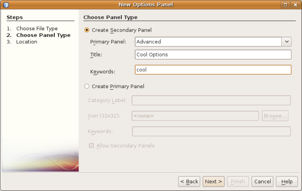

// 
//     Licensed to the Apache Software Foundation (ASF) under one
//     or more contributor license agreements.  See the NOTICE file
//     distributed with this work for additional information
//     regarding copyright ownership.  The ASF licenses this file
//     to you under the Apache License, Version 2.0 (the
//     "License"); you may not use this file except in compliance
//     with the License.  You may obtain a copy of the License at
// 
//       http://www.apache.org/licenses/LICENSE-2.0
// 
//     Unless required by applicable law or agreed to in writing,
//     software distributed under the License is distributed on an
//     "AS IS" BASIS, WITHOUT WARRANTIES OR CONDITIONS OF ANY
//     KIND, either express or implied.  See the License for the
//     specific language governing permissions and limitations
//     under the License.
//

= NetBeans Options Window Module Tutorial
:jbake-type: platform_tutorial
:jbake-tags: tutorials 
:jbake-status: published
:syntax: true
:source-highlighter: pygments
:toc: left
:toc-title:
:icons: font
:experimental:
:description: NetBeans Options Window Module Tutorial - Apache NetBeans
:keywords: Apache NetBeans Platform, Platform Tutorials, NetBeans Options Window Module Tutorial

This tutorial demonstrates how to extend the Options window.

NOTE: This document uses the NetBeans IDE 6.8 Release and is valid for releases after that. If you are using an earlier version, see  link:67/nbm-options.html[the 6.7 version of this document].

== Introduction to Options Window Extensions

Whether you are creating a plugin for NetBeans IDE or for another application, there is a good chance that you want the user to be able to specify settings, such as the location of an external file. The Options window offers a centralized location for all such settings. In the IDE, the Options window is found under the Tools menu and looks as follows:

image::images/options_nbm-options-65-1.png[]

The NetBeans APIs give you access to the Options window in two different ways. In the first case, you can add a new main panel to the Options window. Using this approach, your module will add a new 'primary' panel to the Options window, similar to the 'General' panel or 'Editor' panel shown in the screenshot above. Your panel will, just like these panels, have a name and an image in the top of the Options window, together with its settings in the body of the panel. In the second case, the NetBeans APIs allow you to add a new subpanel within the Miscellaneous panel, as shown below:

image::images/options_nbm-options-65-2.png[]

In this case, your new subpanel will have its own tab, just like "Ant" or "Diff" above, together with the settings within a panel in the body of the Options window extension. Whether you add your user settings within a new primary panel or within a tab in the Miscellaneous panel is completely up to you. Factors that might influence your decision are purely personal and a question of your own taste.

At the end of this tutorial, the Options window will be extended with a new panel. In addition, you will be shown how to use the NetBeans  `` link:http://bits.netbeans.org/dev/javadoc/org-openide-util/org/openide/util/NbPreferences.html[NbPreferences]``  class to store and use the settings that the user specifies in your Options window extension.

== Creating the Module Project

We begin by working through the New Module Project wizard. At the end of it, we will have a basic source structure, with some default files, that every NetBeans module requires.

[start=1]
1. Choose File > New Project (Ctrl+Shift+N). Under Categories, select NetBeans Modules. Under Projects, select Module. Click Next.

[start=2]
1. In the Name and Location panel, type  ``CoolOptions``  in the Project Name field. Change the Project Location to any directory on your computer. Leave the Standalone Module option and Set as Main Project checkbox selected. Click Next.

[start=3]
1. In the Basic Module Configuration panel, type  ``org.netbeans.modules.cooloptions``  in Code Name Base.

[start=4]
1. Do not select "Generate XML Layer", because you do not need a layer file in this scenario. Leave the location of the localizing bundle so that it will be stored in a package with the name  ``org/netbeans/modules/cooloptions`` . Click Finish.

The IDE creates the  ``CoolOptions``  project. The project contains all of your sources and project metadata, such as the project's Ant build script. The project opens in the IDE. You can view its logical structure in the Projects window (Ctrl+1) and its file structure in the Files window (Ctrl+2).

== Extending the Options Window

Now that we have a module project, which gives us our source structure, we simply run through another wizard that will create the NetBeans API implementation of an Options window extension. In the wizard, you simply need to specify the type of panel you want to have generated, either a primary panel or a miscellaneous panel, and then the wizard will generate all the required classes and  ``layer.xml``  registration details for you.

[start=1]
1. Right-click the "CoolOptions" project node and choose New > Other. Under Categories, select Module Development. Under File Types, select Options Panel. You should now see the following:

image::images/options_nb68-options-1.png[]

Click Next.

[start=2]
1. In the next panel, specify the type of panel that you want to create and fill in the information required. Initially, this panel looks as follows:

image::images/options_nb68-options-2.png[]

In this tutorial, we assume that we are creating a Miscellaneous Panel, which will therefore extend  link:http://bits.netbeans.org/dev/javadoc/org-netbeans-modules-options-api/org/netbeans/spi/options/AdvancedOption.html[org.netbeans.spi.options.AdvancedOption].

Fill in the above dialog with the following details:

* *Title.* Cool Options
* *Keywords.* cool

You should now see the following:

Click Next.

[start=3]
1. In the Location panel, you can set the prefix of the classes that will be generated and the package where they will be placed. Change the Class Name Prefix to "Cool" and leave the package name unchanged. Click Finish.

The Projects window should now look as follows:

image::images/options_nbm-options-65-6.png[]

Open the  ``CoolOptionsPanelController``  class and notice that it has this content:

[source,java]
----

package org.netbeans.modules.cooloptions;

import java.beans.PropertyChangeListener;
import java.beans.PropertyChangeSupport;
import javax.swing.JComponent;
import org.netbeans.spi.options.OptionsPanelController;
import org.openide.util.HelpCtx;
import org.openide.util.Lookup;

@OptionsPanelController.SubRegistration(location = "Advanced",
displayName = "#AdvancedOption_DisplayName_Cool",
keywords = "#AdvancedOption_Keywords_Cool",
keywordsCategory = "Advanced/Cool")
public final class CoolOptionsPanelController extends  link:http://bits.netbeans.org/dev/javadoc/org-netbeans-modules-options-api/org/netbeans/spi/options/OptionsPanelController.html[OptionsPanelController] {

    private CoolPanel panel;
    private final PropertyChangeSupport pcs = new PropertyChangeSupport(this);
    private boolean changed;

    public void update() {
        getPanel().load();
        changed = false;
    }

    public void applyChanges() {
        getPanel().store();
        changed = false;
    }

    public void cancel() {
        // need not do anything special, if no changes have been persisted yet
    }

    public boolean isValid() {
        return getPanel().valid();
    }

    public boolean isChanged() {
        return changed;
    }

    public HelpCtx getHelpCtx() {
        return null; // new HelpCtx("...ID") if you have a help set
    }

    public JComponent getComponent(Lookup masterLookup) {
        return getPanel();
    }

    public void addPropertyChangeListener(PropertyChangeListener l) {
        pcs.addPropertyChangeListener(l);
    }

    public void removePropertyChangeListener(PropertyChangeListener l) {
        pcs.removePropertyChangeListener(l);
    }

    private CoolPanel getPanel() {
        if (panel == null) {
            panel = new CoolPanel(this);
        }
        return panel;
    }

    void changed() {
        if (!changed) {
            changed = true;
            pcs.firePropertyChange(OptionsPanelController.PROP_CHANGED, false, true);
        }
        pcs.firePropertyChange(OptionsPanelController.PROP_VALID, null, null);
    }

}
----

In addition, a new  ``JPanel``  has been created, for the layout of your new panel.

== Building and Installing the Module

We have done no coding whatsoever, but we can already try out our module. When we do so we will simply see our new panel, integrated with the other panels in the Options window. In subsequent sections, we will add Swing components that will enable the user to enter and store their settings.

=== Installing the NetBeans Module

In the Projects window, right-click the  ``CoolOptions``  project and choose Run.

The module is built and installed in a new instance of the target NetBeans Platform. The target NetBeans Platform opens so that you can try out your new module.

=== Using the NetBeans Module

In this section, we take on the role of the user. After a user installs our module, they would typically take the steps outlined below to specify a setting in the Options window.

[start=1]
1. Choose Tools > Options from the main menu. The Options window opens.

[start=2]
1. Select the Miscellaneous panel and notice that your new "Cool Options" panel has been integrated there:

image::images/options_nbm-options-65-7.png[]

[start=3]
1. Close the Options window. Press Ctrl-I and then type the keyword you defined earlier:

image::images/options_nbm-options-65-8.png[]

You should then be able to click on the returned item to open the Options window. In addition, the specific category that you created should be opened.

In the next section, we add a text field and button to the panel and we learn how to store the user's setting when the Options window closes. Then we learn how to load the setting and use it, when appropriate, in the module's code.

== Storing and Loading Preferences

In this section, we begin by designing the Options window extension. Using the GUI Builder, we add a  ``JPanel`` , a  ``JTextField`` , and a  ``JLabel`` . Then we install the module again and we see the result. Next, we begin coding. Using the NetBeans  `` link:http://bits.netbeans.org/dev/javadoc/org-openide-util/org/openide/util/NbPreferences.html[NbPreferences]``  class, we store the value entered by the user. Storage of preferences is done in the user directory. Then we load the preference into an appropriate place in our code.

=== Designing the Panel

First, let's add some Swing components to the panel, to give the user a means of setting a preference.

[start=1]
1. Make the panel in the Design view of  ``CoolPanel.java``  larger, so that you have room to manoeuvre.

[start=2]
1. Drag and drop a  ``JPanel`` , a  ``JTextField`` , and a  ``JLabel``  onto the panel. Add a titled border, containing the text "Details", to the  ``JPanel`` . Change the text of the  ``JLabel``  to "Name". You should now see the following:

image::images/options_nbm-options-65-9.png[]

[start=3]
1. Install the module again. In the Options window, you should now see the following:

image::images/options_nbm-options-65-10.png[]

You have now designed the new Options panel. In the next section, we'll add logic to the panel so that the text in the text field will be stored when the Options window closes.

=== Storing Preferences

In this section, we add code that will store the preference after the user clicks OK in the Options window.

[start=1]
1. Look in the source of the  ``CoolPanel``  class. You should see the  ``store()``  method defined as follows:

[source,java]
----

void store() {
    // TODO store modified settings
    // Example:
    // Preferences.userNodeForPackage(CoolPanel.class).putBoolean("someFlag", someCheckBox.isSelected());
    // or for org.openide.util with API spec. version >= 7.4:
    // NbPreferences.forModule(CoolPanel.class).putBoolean("someFlag", someCheckBox.isSelected());
    // or:
    // SomeSystemOption.getDefault().setSomeStringProperty(someTextField.getText());
 }
----

The comments in the code present the three ways in which preferences can be stored. The first uses the JDK's Preferences API. The second uses the NetBeans IDE 6.x+ NetBeans  `` link:http://bits.netbeans.org/dev/javadoc/org-openide-util/org/openide/util/NbPreferences.html[NbPreferences]``  class. The third uses the pre-6.0 System Option class. The third approach is deprecated, while the first does not store preferences in the application's user directory. The second approach, the NetBeans  `` link:http://bits.netbeans.org/dev/javadoc/org-openide-util/org/openide/util/NbPreferences.html[NbPreferences]``  class, is the recommended approach. The NetBeans  `` link:http://bits.netbeans.org/dev/javadoc/org-openide-util/org/openide/util/NbPreferences.html[NbPreferences]``  class is based on the JDK's Preferences API, but is tailored towards NetBeans applications, in that it stores preferences in the application's user directory, which is a convenient place to store them since all other user customizations for your application are stored there too.

[start=2]
1. In the  ``store()``  method, delete all the comments and add this line:

[source,java]
----

NbPreferences.forModule(CoolPanel.class).put("namePreference", jTextField1.getText());
----

Press Alt-Enter in the line. Let the IDE specify an import statement for the NetBeans API package called  ``org.openide.util.NbPreferences`` .

[start=3]
1. Install the module again. Type a name in your Options window extension panel:

image::images/options_nbm-options-65-11.png[]

[start=4]
1. Click OK. Switch to the Files window (Ctrl-2). Expand the application's  ``build``  folder. Look in the application's user directory, within the  ``config``  folder. In the  ``config``  folder, you should find a folder called  ``Preferences`` , containing a properties file for your Options window. Open the folder and notice that the preference has been stored there:

image::images/options_nbm-options-65-12.png[]

=== Loading Preferences

In this section, we add code that will load the preference. We want the preference, in this case "Harry Potter", to be loaded into at least two places. First, we want the preference to be loaded into the Options window when the application restarts. Secondly, we want to be able to use the preference somewhere in our module. After all, the reason why a preference is set is so that it can be used somewhere else in the code. Finally, we also need to handle the situation where the preference changes. In that case, we need to add a preference listener and use the new value in our code, once the value changes.

[start=1]
1. Look in the source of the  ``CoolPanel``  class. You should see the  ``load()``  method, defined with comments, similar to those discussed in the previous section.

[start=2]
1. In the  ``load()``  method, delete all the comments and replace them with the following:

[source,java]
----

jTextField1.setText(NbPreferences.forModule(CoolPanel.class).get("namePreference", ""));
----

Now, when you restart the application, the preference is loaded into the Options window.

Next, we will create a new  ``TopComponent`` . We will only do so to demonstrate how a preference is used. Instead of a  ``TopComponent`` , you could use any other Java class to use your preference. In other words, this is just an example of using a user's preference in the context of a module.

[start=3]
1. Right-click the module project and choose New Window Component. Call the Window Component whatever you like and position it anywhere you want it to be. When you have created it, add a  ``JTextField``  to the  ``TopComponent`` . This is where we will display the user's preference.

[start=4]
1. Switch to the  ``TopComponent's``  Source view and add the following lines to the end of the constructor:

[source,java]
----

Preferences pref = NbPreferences.forModule(CoolPanel.class);
String name = pref.get("namePreference", "");

pref.addPreferenceChangeListener(new PreferenceChangeListener() {
    public void preferenceChange(PreferenceChangeEvent evt) {
        if (evt.getKey().equals("namePreference")) {
            jTextField1.setText(evt.getNewValue());
        }
    }
});

jTextField1.setText(name);
----

[start=5]
1. Install the module again.

Whenever the application restarts, the current preference in the Options window is shown in the  ``TopComponent`` . And whenever you change the preference in the Options window, the  ``TopComponent``  immediately reflects the new value, as soon as OK is clicked in the Options window.

Congratulations! You have successfully completed the Options Window Module Tutorial. You now know how to provide the functionality needed for users to set your module's options.

link:http://netbeans.apache.org/community/mailing-lists.html[Send Us Your Feedback]

== Next Steps

For more information about creating and developing NetBeans modules, see the following resources:

*  link:https://netbeans.apache.org/kb/docs/platform.html[Other Related Tutorials]
*  link:https://bits.netbeans.org/dev/javadoc/[NetBeans API Javadoc]
