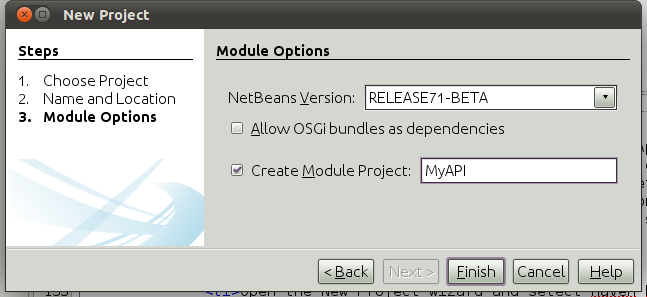
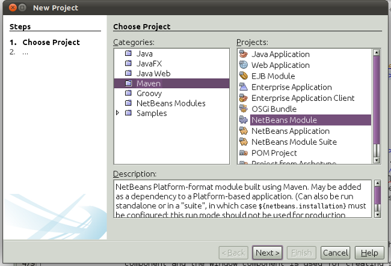
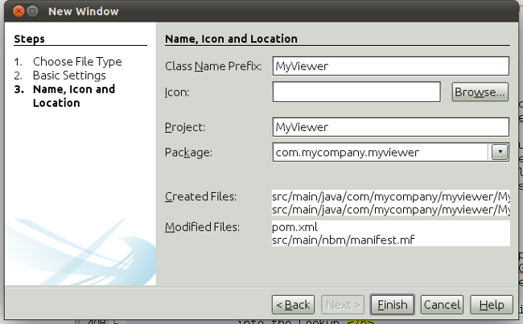
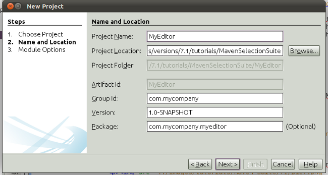

// 
//     Licensed to the Apache Software Foundation (ASF) under one
//     or more contributor license agreements.  See the NOTICE file
//     distributed with this work for additional information
//     regarding copyright ownership.  The ASF licenses this file
//     to you under the Apache License, Version 2.0 (the
//     "License"); you may not use this file except in compliance
//     with the License.  You may obtain a copy of the License at
// 
//       http://www.apache.org/licenses/LICENSE-2.0
// 
//     Unless required by applicable law or agreed to in writing,
//     software distributed under the License is distributed on an
//     "AS IS" BASIS, WITHOUT WARRANTIES OR CONDITIONS OF ANY
//     KIND, either express or implied.  See the License for the
//     specific language governing permissions and limitations
//     under the License.
//

= NetBeans Platform Selection Tutorial Using Maven
:jbake-type: platform_tutorial
:jbake-tags: tutorials 
:jbake-status: published
:syntax: true
:source-highlighter: pygments
:toc: left
:toc-title:
:icons: font
:experimental:
:description: NetBeans Platform Selection Tutorial Using Maven - Apache NetBeans
:keywords: Apache NetBeans Platform, Platform Tutorials, NetBeans Platform Selection Tutorial Using Maven

This document demonstrates how to create a NetBeans Platform Module Suite from Maven archetypes and build and install the suite in your installation of the IDE. In this tutorial you will create a Maven module suite project that contains three NetBeans modules as sub-projects. The Maven project that contains the sub-projects is a simple POM project that declares how the suite is compiled and the installation target.

This document is based on the Ant-based  link:https://netbeans.apache.org/tutorials/nbm-selection-1.html[NetBeans Selection Management Tutorial] and illustrates some of the differences between using Ant and Maven to develop NetBeans Platform module suites. After you understand some of the differences, you can easily proceed through other tutorials on the the  link:https://netbeans.apache.org/kb/docs/platform.html[NetBeans Platform Learning Trail].

NOTE:  You do not need to download Maven because it is bundled with the IDE. Optionally, use your own download of Maven, in which case use the Options window to configure your Maven settings.

Before starting this tutorial you may want to familiarize yourself with the following introductory Maven documentation:

*  link:http://wiki.netbeans.org/MavenBestPractices[Best Practices for Maven in NetBeans IDE]
*  link:http://www.sonatype.com/books/maven-book/reference/introduction.html[Chapter 1. Introducing Apache Maven] (from  link:http://www.sonatype.com/books/maven-book/reference/public-book.html[Maven: The Definitive Guide])

== Creating the NetBeans Platform Application

In this section you use the New Project wizard to create a NetBeans Platform Module Suite from a Maven archetype. The wizard will create a POM project that will contain the module projects. In the wizard you will also create a module as a sub-project of the suite.

[start=1]
1. Open the New Project wizard and select NetBeans Application in the Maven category:

image::images/maven-suite_71_pic1.png[title="Screenshot of Projects window"]

Click Next.

[start=2]
1. Type *MavenSelectionSuite* for the Project Name:

image::images/maven-suite_71_pic2.png[title="Screenshot of Projects window"]

Click Next.

[start=3]
1. Choose the NetBeans API version you want to use. Select Create Module Project and type *MyAPI* for the module name:

Click Finish.

When you click Finish, the IDE creates a Maven reactor project, together with subprojects for branding, NetBeans Platform application actions, and the API module:

image::images/maven-suite_71_pic4.png[title="Screenshot of Projects window"]

MavenSelectionSuite-parent is a reactor project which is a container for sub-projects, in this case NetBeans Module projects. The reactor project does not contain any source files. The reactor's POM contains instructions for compiling the application:

[source,xml]
----

<project xmlns="http://maven.apache.org/POM/4.0.0" xmlns:xsi="http://www.w3.org/2001/XMLSchema-instance" xsi:schemaLocation="http://maven.apache.org/POM/4.0.0 http://maven.apache.org/xsd/maven-4.0.0.xsd">
    <modelVersion>4.0.0</modelVersion>

    <groupId>com.mycompany</groupId>
    <artifactId>MavenSelectionSuite-parent</artifactId>
    <version>1.0-SNAPSHOT</version>
    <packaging>pom</packaging>

    <name>MavenSelectionSuite-parent</name>

    <repositories>
        <!--
        Repository hosting NetBeans modules, especially APIs.
        Versions are based on IDE releases, e.g.: RELEASE691
        To create your own repository, use: nbm:populate-repository
        -->
        <repository>
            <id>netbeans</id>
            <name>NetBeans</name>
            <url>http://bits.netbeans.org/maven2/</url>
        </repository>
    </repositories>

    <dependencyManagement>
        <dependencies>
            <dependency>
                <groupId>junit</groupId>
                <artifactId>junit</artifactId>
                <version>4.8.2</version>
                <scope>test</scope>
            </dependency>
        </dependencies>
    </dependencyManagement>

    <build>
        <pluginManagement>
            <plugins>
                <plugin>
                    <groupId>org.codehaus.mojo</groupId>
                    <artifactId>nbm-maven-plugin</artifactId>
                    <version>3.6</version>
                    <extensions>true</extensions>
                    <configuration>
                        <brandingToken>${brandingToken}</brandingToken>
                        <cluster>${brandingToken}</cluster>
                    </configuration>
                </plugin>
                <plugin>
                    <!-- NetBeans 6.9+ requires JDK 6 -->
                    <groupId>org.apache.maven.plugins</groupId>
                    <artifactId>maven-compiler-plugin</artifactId>
                    <version>2.3.2</version>
                    <configuration>
                        <source>1.6</source>
                        <target>1.6</target>
                    </configuration>
                </plugin>
                <plugin>
                    <groupId>org.apache.maven.plugins</groupId>
                    <artifactId>maven-jar-plugin</artifactId>
                    <version>2.3.1</version>
                </plugin>
            </plugins>
        </pluginManagement>
    </build>

    <modules>
        <module>branding</module>
        <module>application</module>
        <module>MyAPI</module>
    </modules>

    <properties>
        <netbeans.version>RELEASE71-BETA</netbeans.version>
        <brandingToken>mavenselectionsuite</brandingToken>
    </properties>
    
</project>
----

As you can see above, the reactor provides a list of the modules that will be included when you build the project. You can see that the MyAPI project is listed as one of these modules.

== Creating an API

You created the MyAPI module when you created the module suite, but now you need to create a class in the module and expose the class to other modules.

=== Creating a Class in the MyAPI Module

In this exercise you will create a simple class named  ``Event`` . Each instance of  ``Event``  will be unique because the field  ``index``  is incremented by 1 each time a new instance of  ``Event``  is created.

[start=1]
1. In the  ``com.mycompany.mavenselectionsuite``  package, create a new Java class named *Event*.

[start=2]
1. Modify the class to declare the following fields and getters:

[source,java]
----

package com.mycompany.mavenselectionsuite;

import java.util.Date;

public final class Event {

   private final Date date = new Date();
   private static int count = 0;
   private final int index;

   public Event() {
      index = count++;
   }

   public Date getDate() {
      return date;
   }

   public int getIndex() {
      return index;
   }

   public String toString() {
       return index + " - " + date;
   }

}
----

=== Exposing the Package

In this tutorial you will create additional modules that will need to access the  ``Event``  class. In this exercise, you will make the contents of the package that contains the  ``Event``  class public so that other modules can access it. To declare the  ``com.mycompany.mavenselectionsuite``  package as public, you will modify the  ``configuration``  element of  ``nbm-maven-plugin``  in the POM to specify the packages that are exported as public. You can make the changes to the POM in the editor or by selecting the packages to make public in the project's Properties window.

[start=1]
1. Right-click the MyAPI project node and choose Properties to open the Properties window.

[start=2]
1. 
Select the *com.mycompany.mavenselectionsuite* package in the *Public Packages* category:

image::images/maven-suite_71_pic5.png[title="screenshot"]

Click OK.

When you select a package to export, the IDE modifies the  ``nbm-maven-plugin``  element in the POM to specify the package:

[source,xml]
----

<plugin>
    <groupId>org.codehaus.mojo</groupId>
    <artifactId>nbm-maven-plugin</artifactId>
    <extensions>true</extensions>
    <configuration>
        <publicPackages>
            *<publicPackage>com.mycompany.mavenselectionsuite</publicPackage>*
        </publicPackages>
    </configuration>
</plugin>
----

[start=3]
1. Right-click the project and choose Build. When you build the project, the  ``nbm-maven-plugin``  will generate a manifest header in the  ``MANIFEST.MF``  of the JAR, to specify the public package:

[source,java]
----

Manifest-Version: 1.0
Archiver-Version: Plexus Archiver
Created-By: Apache Maven
Built-By: geertjan
Build-Jdk: 1.7.0
OpenIDE-Module-Localizing-Bundle: com/mycompany/mavenselectionsuite/Bu
 ndle.properties
OpenIDE-Module-Specification-Version: 1.0
OpenIDE-Module-Implementation-Version: 1.0-20111222
OpenIDE-Module-Build-Version: 201112221054
OpenIDE-Module: com.mycompany.MyAPI
*OpenIDE-Module-Public-Packages: com.mycompany.mavenselectionsuite.**
OpenIDE-Module-Requires: org.openide.modules.ModuleFormat1
OpenIDE-Module-Display-Category: com.mycompany
OpenIDE-Module-Name: MyAPI
OpenIDE-Module-Short-Description: <undefined>
OpenIDE-Module-Long-Description: <undefined>
OpenIDE-Module-Module-Dependencies: org.netbeans.api.annotations.commo
 n/1 > 1.10.1
----

For more information, see the  link:http://bits.netbeans.org/mavenutilities/nbm-maven-plugin/manifest-mojo.html#publicPackages[nbm-maven-plugin manifest documentation].

== Listening to the Selection

In this section you will create a new module named MyViewer and add a window component and two text fields. The component will implement  `` link:http://bits.netbeans.org/dev/javadoc/org-openide-util-lookup/org/openide/util/LookupListener.html[LookupListener]``  to listen for changes to the selection.

=== Creating the Module

In this exercise you will create the MyViewer NetBeans module in the  ``MavenSelectionSuite``  directory.

[start=1]
1. Choose File > New Project from the main menu (Ctrl-Shift-N). Select NetBeans Module from the Maven category:

Click Next.

[start=2]
1. Type *MyViewer* as the Project Name. Make sure to set the Project Location to the  ``MavenSelectionSuite``  directory:

image::images/maven-suite_71_pic7.png[title="screenshot"]

Click Next. Select the NetBeans API version you'd like to use. Click Finish.

[start=3]
1. The module is going to use the API module, therefore we need to set a dependency in the viewer module on the API module. Right-click the Dependencies node in the MyViewer project and choose Add Dependency:

image::images/maven-suite_71_pic8.png[title="screenshot"]

[start=4]
1. Select the MyAPI module in the Open Projects tab:

image::images/maven-suite_71_pic9.png[title="screenshot"]

When you click Add above, the IDE adds the API module to the list of dependencies of the MyViewer module. You can see the new dependency in the POM of the MyViewer module and displayed as a new node under the Dependencies node of the MyViewer module.

You've now learned how to create a new module in your application and you've also learned how to set dependencies between your modules. Once a dependency has been set, a module can use the publicly exposed classes of the modules it depends on.

=== Creating the Viewer Window

In this exercise you will create a GUI component in your viewer module. The data displayed in the GUI component will be retrieved from the Lookup. That means you will learn how to listen to the selection and how to update your GUI component whenever an object of interest is published into the Lookup.

[start=1]
1. Right-click the MyViewer project and choose New > Window.

[start=2]
1. 
Select *explorer* and select Open on Application Start:

image::images/maven-suite_71_pic01.png[title="screenshot"]

Click Next.

[start=3]
1. Type *MyViewer* as the Class Name Prefix:

Click Finish. You should see you have a new NetBeans Platform window component ready to be designed within the Matisse GUI Builder:

image::images/maven-suite_71_pic03.png[title="screenshot"]

[start=4]
1. Drag two Labels from the Palette into the window component:

image::images/maven-suite_71_pic04.png[title="screenshot"]

[start=5]
1. Click the Source tab and modify the class signature to implement  ``LookupListener`` .

[source,java]
----

public class MyViewerTopComponent extends TopComponent *implements LookupListener* {
----

[start=6]
1. Add the following  ``private``  field  ``result``  and set the initial value to null.

[source,java]
----

private Lookup.Result<Event> result = null;
----

[start=7]
1. Implement the LookupListener's "resultChanged" method as follows:

[source,java]
----

@Override
public void resultChanged(LookupEvent le) {
    if (!result.allInstances().isEmpty()) {
        for (Event event : result.allInstances()) {
            jLabel1.setText(Integer.toString(event.getIndex()));
            jLabel2.setText(event.getDate().toString());
        }
    } else {
        jLabel1.setText("[no selection]");
        jLabel2.setText("");
    }
}
----

[start=8]
1. Make the following additions to the  ``componentOpened()``  and  ``componentClosed()``  methods that have already been created in the class by the New Window wizard:

[source,java]
----

@Override
public void componentOpened() {
    *result = Utilities.actionsGlobalContext().lookupResult(Event.class);
    result.addLookupListener(this);*
}

@Override
public void componentClosed() {
    *result.removeLookupListener (this);*
}
----

By using  `` link:http://bits.netbeans.org/dev/javadoc/org-openide-util/org/openide/util/Utilities.html#actionsGlobalContext%28%29[Utilities.actionsGlobalContext()]`` , each time a component is opened, the window listens globally for Event objects. Whenever a new Event is published into the Lookup, the "resultChanged" method is automatically triggered to handle the event.

== Publishing a Selected Object

In this section you will create a new module called MyEditor. The module will contain a  `` link:http://bits.netbeans.org/dev/javadoc/org-openide-windows/org/openide/windows/TopComponent.html[TopComponent]``  that will publish instances of the  ``Event``  object into the Lookup of the TopComponent. When the user selects the TopComponent, the objects in its Lookup will be available globally. Once published globally, the viewer window created in the previous section, which is listening for Events in the global Lookup, will automatically update itself.

=== Creating the Module

In this exercise you will create a NetBeans module in the  ``MavenSelectionSuite``  directory and add a dependency on the MyAPI module.

[start=1]
1. Choose File > New Project from the main menu. Select NetBeans Module from the Maven category:

Click Next.

[start=2]
1. Type *MyEditor* as the Project Name. Make sure to set the Project Location to the  ``MavenSelectionSuite``  directory:

Click Next. Select the NetBeans API version you'd like to use. Click Finish.

[start=3]
1. Just like you did in the previous section, you need to set a dependency on the API module, so that you can use its public packages. Right-click the Dependencies node in the MyEditor project and choose Add Dependency:

image::images/maven-suite_71_pic06.png[title="screenshot"]

[start=4]
1. Select the MyAPI module in the Open Projects tab:

image::images/maven-suite_71_pic07.png[title="screenshot"]

You've now created a second module. In this module, you'll now create a TopComponent where new Events will be published into the Lookup.

=== Creating the Editor Window

In this exercise you will create the window that opens in the editor area when invoked from a menu item in the main menubar of the application.

Rather than using the New Window wizard, as done in the previous section, you will create a normal Java class here, then extend  ``TopComponent`` , and use the same annotations you previously used to register the window in the NetBeans Platform application. You'll learn that you do not need to use the wizards in the IDE to create the artifacts needed to integrate with the NetBeans Platform.

[start=1]
1. Create a new Java class named "MyEditorTopComponent".

[start=2]
1. Modify the constructor to create a new instance of  ``Event``  each time the class is invoked, together with a text field to display the currently published object.

[source,java]
----

package com.mycompany.myeditor;

import com.mycompany.mavenselectionsuite.Event;
import java.awt.BorderLayout;
import javax.swing.JTextField;
import org.openide.awt.ActionID;
import org.openide.awt.ActionReference;
import org.openide.util.NbBundle.Messages;
import org.openide.util.lookup.Lookups;
import org.openide.windows.TopComponent;

@TopComponent.Description(preferredID = "MyEditorTopComponent",
persistenceType = TopComponent.PERSISTENCE_NEVER)
@TopComponent.Registration(mode = "editor", openAtStartup = false)
@ActionID(category = "Window", id = "com.mycompany.myeditor.MyEditorTopComponent")
@ActionReference(path = "Menu/Window")
@TopComponent.OpenActionRegistration(displayName = "#CTL_MyEditorAction")
@Messages({
    "CTL_MyEditorAction=MyEditor",
    "CTL_MyEditorTopComponent=MyEditor Window",
    "HINT_MyEditorTopComponent=This is a MyEditor window"
})
public final class MyEditorTopComponent extends TopComponent {

    public MyEditorTopComponent() {

        setName(Bundle.CTL_MyEditorTopComponent());
        setToolTipText(Bundle.HINT_MyEditorTopComponent());

        Event obj = new Event();
        associateLookup(Lookups.singleton(obj));

        setLayout(new BorderLayout());

        JTextField displayField = new JTextField();
        add(displayField, BorderLayout.NORTH);
        displayField.setText("Event #" + obj.getIndex() + " created at " + obj.getDate());

        setDisplayName("MyEditor " + obj.getIndex());

    }

}
                    
----

The  ``associateLookup(Lookups.singleton(obj));``  line in the constructor will create a Lookup that contains the new instance of  ``Event`` .

The text field in the component only displays the index value and date from the  ``Event`` . This will enable you to see that each MyEditor component is unique and that MyViewer is displaying the details of the MyEditor component that has the focus.

== Building and Running the Application

Now that the target installation of the IDE is specified, you can use the Run command on the *MavenSelectionSuite-app* project. Before you do so, you need to add the viewer module and editor module as dependencies of the *MavenSelectionSuite-app* project.

[start=1]
1. Right-click the Dependencies node of the *MavenSelectionSuite-app* project and choose Add Dependency:

image::images/maven-suite_71_pic11.png[title="screenshot"]

[start=2]
1. In the Open Projects tab, choose "MyViewer" and click Add:

image::images/maven-suite_71_pic12.png[title="screenshot"]

[start=3]
1. Repeat the steps above to add the "MyEditor" module as a dependency of the *MavenSelectionSuite-app* project.

[start=4]
1. Right-click *MavenSelectionSuite-app* project and choose Run. The application starts up, consisting of the NetBeans Platform, together with the custom modules you created.

image::images/maven-suite_71_pic13.png[title="screenshot"]

The MyViewer window opens when the application starts and displays the two labels. You can now choose MyEditor from the Window menu, multiple times, to open multiple MyEditor components in the editor area. The MyViewer window will display the details of the currently selected MyEditor component.

== Changing Selected Objects Dynamically

Currently, a new  ``Event``  is created each time you open a new MyEditor component. In this section you will add a button to the MyEditor component. Whenever the button is clicked, the MyEditor component's current  ``Event``  object will be replaced with a new one.

In short, you will modify the code to use  `` link:http://bits.netbeans.org/dev/javadoc/org-openide-util-lookup/org/openide/util/lookup/InstanceContent.html[InstanceContent]``  to dynamically handle changes to the content of the Lookup.

[start=1]
1. Change the MyEditorTopComponent to the following:

[source,java]
----

package com.mycompany.myeditor;

import com.mycompany.mavenselectionsuite.Event;
import java.awt.event.ActionEvent;
import java.awt.event.ActionListener;
import java.util.Collections;
import javax.swing.BoxLayout;
import javax.swing.JButton;
import javax.swing.JTextField;
import org.openide.awt.ActionID;
import org.openide.awt.ActionReference;
import org.openide.util.NbBundle.Messages;
import org.openide.util.lookup.AbstractLookup;
import org.openide.util.lookup.InstanceContent;
import org.openide.windows.TopComponent;

@TopComponent.Description(preferredID = "MyEditorTopComponent",
persistenceType = TopComponent.PERSISTENCE_NEVER)
@TopComponent.Registration(mode = "editor", openAtStartup = false)
@ActionID(category = "Window", id = "com.mycompany.myeditor.MyEditorTopComponent")
@ActionReference(path = "Menu/Window")
@TopComponent.OpenActionRegistration(displayName = "#CTL_MyEditorAction")
@Messages({
    "CTL_MyEditorAction=MyEditor",
    "CTL_MyEditorTopComponent=MyEditor Window",
    "HINT_MyEditorTopComponent=This is a MyEditor window"
})
public final class MyEditorTopComponent extends TopComponent {

    private final InstanceContent content = new InstanceContent();

    public MyEditorTopComponent() {

        setName(Bundle.CTL_MyEditorTopComponent());
        setToolTipText(Bundle.HINT_MyEditorTopComponent());

        associateLookup(new AbstractLookup(content));
        
        setLayout(new BoxLayout(this, BoxLayout.LINE_AXIS));

        final JTextField displayField = new JTextField();
        add(displayField);

        JButton replaceButton = new JButton("Replace");
        add(replaceButton);
        replaceButton.addActionListener(new ActionListener() {
            @Override
            public void actionPerformed(ActionEvent e) {
                Event obj = new Event();
                displayField.setText("Event #" + obj.getIndex() + " created at " + obj.getDate());
                setDisplayName("MyEditor " + obj.getIndex());
                content.set(Collections.singleton(obj), null);
            }
        });

    }

}
----

NOTE:  To be able to publish the  ``InstanceContent`` , you are now using  `` link:http://bits.netbeans.org/dev/javadoc/org-openide-util-lookup/org/openide/util/lookup/AbstractLookup.html#AbstractLookup%28org.openide.util.lookup.AbstractLookup.Content%29[AbstractLookup]``  instead of  ``Lookup``  in the constructor.

NOTE:  You have moved several statements into the new button's action event handler.

[start=2]
1. When you run the application again, you will see the new button in each MyEditor component:

image::images/maven-suite_71_pic14.png[title="screenshot"]

[start=3]
1. When you click the button, the index number in the text field will increase. The label in the MyViewer window will also update to correspond to the new value.

This tutorial demonstrated how to create and run a NetBeans Platform application that you create from a Maven archetype. You saw how applications are structured and how you configure a modules POM to specify public packages. Most important of all, you learned how to publish objects into the selection and how to listen for them and update other parts of the application accordingly. For more examples on how to build NetBeans Platform applications, see the tutorials listed in the  link:https://netbeans.apache.org/kb/docs/platform.html[NetBeans Platform Learning Trail].

link:http://netbeans.apache.org/community/mailing-lists.html[ Send Us Your Feedback]

 

== See Also

For more information about creating and developing on the NetBeans Platform, see the following resources.

*  link:https://netbeans.apache.org/kb/docs/platform.html[NetBeans Platform Learning Trail]
*  link:https://netbeans.apache.org/wiki/[NetBeans Developer FAQ]
*  link:http://bits.netbeans.org/dev/javadoc/[NetBeans API Javadoc]

If you have any questions about the NetBeans Platform, feel free to write to the mailing list, dev@platform.netbeans.org, or view the  link:https://mail-archives.apache.org/mod_mbox/netbeans-dev/[NetBeans Platform mailing list archive].

