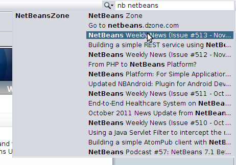

// 
//     Licensed to the Apache Software Foundation (ASF) under one
//     or more contributor license agreements.  See the NOTICE file
//     distributed with this work for additional information
//     regarding copyright ownership.  The ASF licenses this file
//     to you under the Apache License, Version 2.0 (the
//     "License"); you may not use this file except in compliance
//     with the License.  You may obtain a copy of the License at
// 
//       http://www.apache.org/licenses/LICENSE-2.0
// 
//     Unless required by applicable law or agreed to in writing,
//     software distributed under the License is distributed on an
//     "AS IS" BASIS, WITHOUT WARRANTIES OR CONDITIONS OF ANY
//     KIND, either express or implied.  See the License for the
//     specific language governing permissions and limitations
//     under the License.
//

= Quick Search Integration Tutorial
:jbake-type: platform_tutorial
:jbake-tags: tutorials 
:jbake-status: published
:syntax: true
:source-highlighter: pygments
:toc: left
:toc-title:
:icons: font
:experimental:
:description: Quick Search Integration Tutorial - Apache NetBeans
:keywords: Apache NetBeans Platform, Platform Tutorials, Quick Search Integration Tutorial

This tutorial shows you how to write a module that plugs custom items into the NetBeans Quick Search feature.

== Introduction to Quick Search Integration

The Quick Search feature, introduced in NetBeans Platform 6.5, consists of a text field in the top right corner of applications on the NetBeans Platform. As a search string is typed in the field, a drop-down list appears, showing matching items. By default, the items come from the names of actions registered in the IDE, as well as help topics in the IDE's Java Help. When an action item is selected, the action is invoked; when a help item is selected, the topic opens in JavaHelp.

In addition, however, the  link:http://bits.netbeans.org/dev/javadoc/org-netbeans-spi-quicksearch/overview-summary.html[Quick Search API] is exposed. You can use it to integrate your own search items into the Quick Search feature. You can use the feature either within the IDE or as part of your own application on top of the NetBeans Platform.

In this tutorial, you create a module that integrates items from  link:http://netbeans.dzone.com[NetBeans Zone] with the Quick Search feature:

image::images/qsearch_71_result1.png[]

== Creating the Module Project

In this section, we use a wizard to create the source structure that every NetBeans module requires. The source structure consists of certain folders in specific places and a set of files that are always needed. For example, every NetBeans module requires a  ``nbproject``  folder, which holds the project's metadata.

[start=1]
1. Choose File > New Project (Ctrl-Shift-N). Under Categories, select NetBeans Modules. Under Projects, select Module. Click Next.

[start=2]
1. In the Name and Location panel, type  ``NetBeansZoneSearch``  in Project Name. Change the Project Location to any directory on your computer. Click Next.

[start=3]
1. In the Basic Module Configuration panel, type  ``org.netbeans.modules.nbzone``  as the Code Name Base. Click Finish.

The IDE creates the  ``NetBeansZoneSearch``  project. The project contains all of your sources and project metadata, such as the project's Ant build script. The project opens in the IDE. You can view its logical structure in the Projects window (Ctrl-1) and its file structure in the Files window (Ctrl-2).

== Using the Quick Search Provider Wizard

In this section, we use a wizard to create a stub Java class and layer entries necessary for beginning our integration with the Quick Search feature.

[start=1]
1. Right-click the "NetBeansZoneSearch" project node and choose New > Other. In the New File dialog, choose Module Development > Quick Search Provider.

[start=2]
1. In the Quick Search Provider panel, set the following:
* *Provider Class Name.* Specifies the class name of the stub that the wizard will generate. Type "NBZoneSearchProvider" in this field.
* *Package.* Specifies the package where the stub class will be generated. Select "org.netbeans.modules.nbzone" from the drop-down.
* *Category Display Name.* Specifies the display name of the category that the stub will create. Type "NetBeans Zone" in this field.
* *Command Prefix.* Specifies prefix for narrowing the search to the category that the stub will create. Type "nb" in this field.
* *Position in Popup.* Specifies the position of the new category in within the Quick Search feature. Leave "0", so that the category will be first in the popup.

You should now see the following:

image::images/qsearch_71_newfilewizard.png[]

[start=3]
1. Click Finish. The Projects window should now look as follows:

image::images/qsearch_71_newproject.png[]

The Java stub that has been created is as follows:

[source,java]
----

package org.netbeans.modules.nbzone;

import org.netbeans.spi.quicksearch.SearchProvider;
import org.netbeans.spi.quicksearch.SearchRequest;
import org.netbeans.spi.quicksearch.SearchResponse;

public class NBZoneSearchProvider implements SearchProvider {

    /**
     * Method is called by infrastructure when search operation was requested.
     * Implementors should evaluate given request and fill response object with
     * apropriate results
     *
     * @param request Search request object that contains information what to
     * search for
     * @param response Search response object that stores search results. Note
     * that it's important to react to return value of
     * SearchResponse.addResult(...) method and stop computation if false value
     * is returned.
     */
    public void evaluate(SearchRequest request, SearchResponse response) {
        //sample code
        //for (SearchedItem item : getAllItemsToSearchIn()) {
        //    if (isConditionSatisfied(item, request)) {
        //        if (!response.addResult(item.getRunnable(), item.getDisplayName(),
        //	      item.getShortcut(), item.getDisplayHint())) {
        //	      break;
        //	  }
        //    }
        //}
    }
    
}
----

In the  ``layer.xml``  file, you should see the following:

[source,xml]
----

<filesystem>
    <folder name="QuickSearch">
        <folder name="NetBeansZone">
            <attr name="command" stringvalue="nb"/>
            <attr name="position" intvalue="0"/>
            <file name="org-netbeans-modules-nbzone-NBZoneSearchProvider.instance">
                <attr name="displayName" bundlevalue="org.netbeans.modules.nbzone.Bundle#QuickSearch/NetBeansZone/org-netbeans-modules-nbzone-NBZoneSearchProvider.instance"/>
            </file>
        </folder>
    </folder>
</filesystem>
----

== Integrating an External HTML DOM Parser

In the next section, we will need an HTML DOM Parser so that we can parse NetBeans Zone. You can use any appropriate parser of your choice. For purposes of this tutorial, we will use  link:http://sourceforge.net/project/showfiles.php?group_id=13153[JTidy].

There are two ways of making an external JAR file available to a module:

* The first way is to put the JAR into a separate module, called a "library wrapper module", and have the functionality module _depend on_ the library wrapper module, after putting both into a module suite. The advantage of having two separate modules is that, when a new version of the external JAR is released, you will only need to redistribute a small module containing only the external JAR, rather than a larger one that also contains the functionality code.
* The second way is to add the JAR to the functionality module, which is what is done below. The advantage of this approach is that it is more convenient in the short term only, since you only have one module to distribute, while the disadvantage is that you are mixing your external library with the functionality code, which is not a strictly modular approach.

[start=1]
1. Download  link:http://sourceforge.net/project/showfiles.php?group_id=13153[JTidy] and find the  ``Tidy.jar``  that is within the download.

[start=2]
1. 
Right-click the project, choose Properties, and wrap the JAR as shown below:

image::images/qsearch_71_wrapjar.png[]

[start=3]
1. Look in the Files window and notice that you have your  ``Tidy.jar``  in a new folder, named  ``release/modules/ext``  folder.

In addition, towards the end of the  ``project.xml``  file, which is in the  ``nbproject``  folder, notice the XML elements below, i.e., right near the end of the file:

[source,xml]
----

            ...
            ...
            ...
            *<class-path-extension>
                <runtime-relative-path>ext/Tidy.jar</runtime-relative-path>
                <binary-origin>release/modules/ext/Tidy.jar</binary-origin>
            </class-path-extension>*
        </data>
    </configuration>
 </project>
----

The external HTML DOM Parser is now on your module's classpath. Now you can use the classes within the JAR, as you will need to do in the next section.

== Coding the Quick Search Integration

Next, we will implement the API. The API's classes are as follows:

|===
|Class |Description 

| link:http://bits.netbeans.org/dev/javadoc/org-netbeans-spi-quicksearch/org/netbeans/spi/quicksearch/SearchProvider.html[SearchProvider] |The main interface of the Quick Search API. Implement this interface to provide a new group of results for your quick search. 

| link:http://bits.netbeans.org/dev/javadoc/org-netbeans-spi-quicksearch/org/netbeans/spi/quicksearch/SearchRequest.html[SearchRequest] |The description of the quick search request. 

| link:http://bits.netbeans.org/dev/javadoc/org-netbeans-spi-quicksearch/org/netbeans/spi/quicksearch/SearchResponse.html[SearchResponse] |The response object for collecting the results of the SearchRequest. 
|===

Below, we set dependencies on the required modules and then implement them in our own module.

[start=1]
1. Right-click the project, choose Properties, and set the following dependencies in the Libraries panel:

* Quick Search API
* UI Utilities API
* Utilities API

[start=2]
1. Modify the "NBZoneSearchProvider" class as follows:

[source,java]
----

public class NBZoneSearchProvider implements  link:http://bits.netbeans.org/dev/javadoc/org-netbeans-spi-quicksearch/org/netbeans/spi/quicksearch/SearchProvider.html[SearchProvider] {

    /**
     * Method is called by infrastructure when search operation is requested.
     * Implementors should evaluate given request and fill response object with
     * apropriate results
     *
     * @param request Search request object that contains search string
     * @param response Search response object that stores search results 
     * Note that it's important to react to return value of 
     * SearchResponse.addResult(...) method and stop computation if 
     * false value is returned.
     */
    @Override 
    public void evaluate( link:http://bits.netbeans.org/dev/javadoc/org-netbeans-spi-quicksearch/org/netbeans/spi/quicksearch/SearchRequest.html[SearchRequest request],  link:http://bits.netbeans.org/dev/javadoc/org-netbeans-spi-quicksearch/org/netbeans/spi/quicksearch/SearchResponse.html[SearchResponse response]) {
        try {

            *//The URL that we are providing a search for:*
            URL url = new URL("http://netbeans.dzone.com");
            *//Stuff needed by Tidy:*
            Tidy tidy = new Tidy();
            tidy.setXHTML(true);
            tidy.setTidyMark(false);
            tidy.setShowWarnings(false);
            tidy.setQuiet(true);

            *//Get the org.w3c.dom.Document from Tidy,
            //or use a different parser of your choice:*
            Document doc = tidy.parseDOM(url.openStream(), null);

            *//Get all "a" elements:*
            NodeList list = doc.getElementsByTagName("a");

            *//Get the number of elements:*
            int length = list.getLength();

            *//Loop through all the "a" elements:*
            for (int i = 0; i < length; i++) {

                String href = null;
                if (null != list.item(i).getAttributes().getNamedItem("href")) {
                    *//Get the "href" attribute from the current "a" element:*
                    href = list.item(i).getAttributes().getNamedItem("href").getNodeValue();
                }

                *//Get the "title" attribute from the current "a" element:*
                if (null != list.item(i).getAttributes().getNamedItem("title")) {
                    String title = list.item(i).getAttributes().getNamedItem("title").getNodeValue();

                    *//If the title matches the requested text:*
                    if (title.toLowerCase().indexOf( link:http://bits.netbeans.org/dev/javadoc/org-netbeans-spi-quicksearch/org/netbeans/spi/quicksearch/SearchRequest.html[request.getText().toLowerCase()]) != -1) {

                        *//Add the runnable and the title to the response
                        //and return if nothing is added:*
                        if (! link:http://bits.netbeans.org/dev/javadoc/org-netbeans-spi-quicksearch/org/netbeans/spi/quicksearch/SearchResponse.html[response.addResult(new OpenFoundArticle(href), title)]) {
                            return;
                        }

                    }

                }

            }

        } catch (IOException ex) {
            Exceptions.printStackTrace(ex);
        }

    }

    private static class OpenFoundArticle implements Runnable {

        private String article;

        public OpenFoundArticle(String article) {
            this.article = article;
        }

        @Override
        public void run() {
            try {
                URL url = new URL("http://netbeans.dzone.com" + article);
                StatusDisplayer.getDefault().setStatusText(url.toString());
                URLDisplayer.getDefault().showURL(url);
            } catch (MalformedURLException ex) {
                Logger.getLogger(NBZoneSearchProvider.class.getName()).log(Level.SEVERE, null, ex);
            }
        }
        
    } 
    
 }
----

[start=3]
1. Make sure the following import statements are declared at the top of the class:

[source,java]
----

import java.io.IOException;
import java.net.MalformedURLException;
import java.net.URL;
import java.util.logging.Level;
import java.util.logging.Logger;
import org.netbeans.spi.quicksearch.SearchProvider;
import org.netbeans.spi.quicksearch.SearchRequest;
import org.netbeans.spi.quicksearch.SearchResponse;
import org.openide.awt.HtmlBrowser.URLDisplayer;
import org.openide.awt.StatusDisplayer;
import org.openide.util.Exceptions;
import org.w3c.dom.Document;
import org.w3c.dom.NodeList;
import org.w3c.tidy.Tidy;
----

== Installing and Trying Out the Functionality

Let's now install the module and then use the quick search feature integration. The IDE uses an Ant build script to build and install your module. The build script is created for you when you create the project.

[start=1]
1. In the Projects window, right-click the project and choose Run. A new instance of the IDE starts up and installs the Quick Search integration module.

[start=2]
1. Type a string in the Quick Search feature and, if the string matches the title of something on NetBeans Zone, the item from NetBeans Zone is included in the result:

image::images/qsearch_71_result1.png[]

If you type the command prefix that you defined in the  ``layer.xml`` , followed by a space, then only the related category is searched:

[start=3]
1. Click an item and, if you have set a browser in the IDE, it opens, displaying the selected article.

== Using the Quick Search Feature on the NetBeans Platform

The previous sections assumed that you were creating a module for NetBeans IDE. The two topics that follow are applicable if, instead of creating a module for NetBeans IDE, you are creating your own application on top of the NetBeans Platform. In that case, you will need to take steps to include the Quick Search feature in your own application, as described below.

[start=1]
1. Add the following tags to the  ``layer.xml``  file:

[source,xml]
----

<folder name="Toolbars">
    <folder name="QuickSearch">
        <attr name="SystemFileSystem.localizingBundle" stringvalue="org.netbeans.modules.nbzone.Bundle"/>
        <file name="org-netbeans-modules-quicksearch-QuickSearchAction.shadow">
            <attr name="originalFile" 
            stringvalue="Actions/Edit/org-netbeans-modules-quicksearch-QuickSearchAction.instance"/>
        </file>
    </folder>
</folder>
----

[start=2]
1. Add this key/value pair to the  ``Bundle.properties``  file:

[source,java]
----

Toolbars/QuickSearch=Quick Search
----

[start=3]
1. Run the NetBeans Platform application and you should see that the Quick Search feature is now available and functioning:

image::images/qsearch_71_result2.png[]

link:http://netbeans.apache.org/community/mailing-lists.html[Send Us Your Feedback]

== Next Steps

For more information about creating and developing NetBeans modules, see the following resources:

*  link:https://netbeans.apache.org/platform/index.html[NetBeans Platform Homepage]
*  link:http://bits.netbeans.org/dev/javadoc/index.html[NetBeans API List (Current Development Version)]
*  link:https://netbeans.apache.org/kb/docs/platform.html[Other Related Tutorials]
