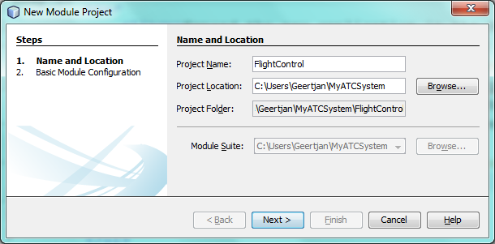

// 
//     Licensed to the Apache Software Foundation (ASF) under one
//     or more contributor license agreements.  See the NOTICE file
//     distributed with this work for additional information
//     regarding copyright ownership.  The ASF licenses this file
//     to you under the Apache License, Version 2.0 (the
//     "License"); you may not use this file except in compliance
//     with the License.  You may obtain a copy of the License at
// 
//       http://www.apache.org/licenses/LICENSE-2.0
// 
//     Unless required by applicable law or agreed to in writing,
//     software distributed under the License is distributed on an
//     "AS IS" BASIS, WITHOUT WARRANTIES OR CONDITIONS OF ANY
//     KIND, either express or implied.  See the License for the
//     specific language governing permissions and limitations
//     under the License.
//

= NetBeans Platform Tutorial for Geospatial Systems
:jbake-type: platform_tutorial
:jbake-tags: tutorials 
:jbake-status: published
:syntax: true
:source-highlighter: pygments
:toc: left
:toc-title:
:icons: font
:experimental:
:description: NetBeans Platform Tutorial for Geospatial Systems - Apache NetBeans
:keywords: Apache NetBeans Platform, Platform Tutorials, NetBeans Platform Tutorial for Geospatial Systems

The NetBeans Platform is a solid infrastructure for geospatial systems. It provides a docking framework with full screen mode, an application frame within which a map can be placed, and a loosely coupled module system for the organization of code into feature-oriented plugins.

In this quick start, you are shown how to set up a typical geospatial application structure, leveraging the central features of the NetBeans Platform. You start by creating a new application, you add several modules, each representing a hypothetical feature in your geospatial system, you configure the application to start up in full screen mode and hide tabs, while you integrate various mapping solutions.

By the end of this tutorial, you will have learned how to configure the NetBeans Platform to optimize it for typical geospatial scenarios, while also learning how to integrate a variety of map technologies into your NetBeans Platform application, such as OpenMap, shown below:

image::images/air_72_openmap-nb-small.png[]

* Part 1: <<application,Creating the Application>>
* Part 2: <<modules,Adding Modules for Geospatial Features>>
* Part 3: <<windows,Designing the Window Layout>>
* Part 4: <<map,Integrating Map Technologies>>
* Part 5: <<publish,Publishing and Subscribing to Objects of Interest>>
* Part 6: <<configure,Configuring the Geospatial System>>

NOTE:  Even though the NetBeans Platform is a distinct product, there is no need to download it separately from NetBeans IDE. Typically, you develop the application in NetBeans IDE, on top of the NetBeans Platform used by NetBeans IDE. Then you exclude the modules that are specific to the IDE but that are superfluous to your application.

If you are new to the NetBeans Platform, do some background reading before diving into this tutorial. In particular, read the  link:http://bits.netbeans.org/dev/javadoc/org-openide-modules/org/openide/modules/doc-files/api.html[Modules API Reference] document, which explains what modules are and provides some context for this tutorial, while noting that there is an extensive Reference Material section on the  link:https://netbeans.apache.org/kb/docs/platform.html[NetBeans Platform Learning Trail].

== Creating the Application

We start by creating a new NetBeans Platform application as a starting point for our geospatial system.

[start=1]
1. Choose File | New Project and then choose NetBeans Modules. Select "NetBeans Platform Application". Click Next.

Name your new application "MyATCSystem" and specify a folder on disk for storing it:

image::images/air_72_new-app.png[]

Click Finish. The new project appears as follows in the Projects window:

image::images/air_72_new-app-created.png[]

[start=2]
1. Right-click the application and choose Run. The application deploys and you should see this:

image::images/air_72_new-app-deployed.png[]

You have learned how to create a new NetBeans Platform application, which is the starting point for your geospatial system.

== Adding Modules for Geospatial Features

In a NetBeans Platform application, each feature is provided by one or more modules. In our geospatial system, we'll pretend we have a "Flight Control" feature in one module, and a "Sky Overview" feature in another module. Each module will include a window for viewing data and information related to the feature.

[start=1]
1. Expand the new application in the Projects window, right-click the Modules node, and choose "Add New":

image::images/air_72_new-module.png[]

[start=2]
1. Click Next. Type "FlightControl" as project name and set a location on disk where the the project will be stored, which is typically within the application's folder:

Click Next.

[start=3]
1. Use code name base "org.myatc.flight.control" and, optionally, change the display name of the module:

image::images/air_72_flight-control-2.png[]

Click Finish.

[start=4]
1. Repeat the steps above for a feature named "SkyOverview", with code name base "org.myatc.sky.overview".

[start=5]
1. You should now have two modules in your system, as shown below:

image::images/air_72_flight-control-3.png[]

[start=6]
1. Repeat the steps above for all the features in your application. Some features could be broken into multiple different modules, as discussed in  link:http://java.dzone.com/news/how-to-split-into-modules[How to Split an Application into Modules?].

== Designing the Window Layout

In this section, we add a new window into the modules we created in the previous section.

[start=1]
1. Right-click the Initializer module's Libraries node, choose Add Module Dependency, then set a dependency on the Lookup API, Settings API, UI Utilities API, Utilities API, and Window System API.

[start=2]
1. Create a new Java class, with this content:

[source,java]
----

import org.netbeans.api.settings.ConvertAsProperties;
import org.openide.awt.ActionID;
import org.openide.awt.ActionReference;
import org.openide.util.NbBundle;
import org.openide.windows.TopComponent;

@ConvertAsProperties(
    dtd = "-//org.myatc.flight.control//FlightControl//EN",
autostore = false)
@TopComponent.Description(
    preferredID = "FlightControlTopComponent",
persistenceType = TopComponent.PERSISTENCE_ALWAYS)
@TopComponent.Registration(mode = "output", openAtStartup = true)
@ActionID(category = "Window", id = "org.myatc.flight.control.FlightControlTopComponent")
@ActionReference(path = "Menu/Window" /*, position = 333 */)
@TopComponent.OpenActionRegistration(
    displayName = "#CTL_FlightControlAction",
preferredID = "FlightControlTopComponent")
@NbBundle.Messages({
    "CTL_FlightControlAction=FlightControl",
    "CTL_FlightControlTopComponent=FlightControl Window",
    "HINT_FlightControlTopComponent=This is a FlightControl window"
})
public class FlightControlTopComponent extends TopComponent {

    public FlightControlTopComponent() {
        initComponents();
        setName(Bundle.CTL_FlightControlTopComponent());
        setToolTipText(Bundle.HINT_FlightControlTopComponent());
    }

    private void initComponents() {
        // TODO add components to the component here
    }

    @Override
    public void componentOpened() {
        // TODO add custom code on component opening
    }

    @Override
    public void componentClosed() {
        // TODO add custom code on component closing
    }

    void writeProperties(java.util.Properties p) {
        // better to version settings since initial version as advocated at
        // http://wiki.apidesign.org/wiki/PropertyFiles
        p.setProperty("version", "1.0");
        // TODO store your settings
    }

    void readProperties(java.util.Properties p) {
        String version = p.getProperty("version");
        // TODO read your settings according to their version
    }

}
----

[start=3]
1. Repeat the steps above for the second module, but create the second Java class as follows:

[source,java]
----

import org.netbeans.api.settings.ConvertAsProperties;
import org.openide.awt.ActionID;
import org.openide.awt.ActionReference;
import org.openide.util.NbBundle;
import org.openide.windows.TopComponent;

@ConvertAsProperties(
    dtd = "-//org.myatc.sky.overview//SkyOverview//EN",
autostore = false)
@TopComponent.Description(
    preferredID = "SkyOverviewTopComponent",
persistenceType = TopComponent.PERSISTENCE_ALWAYS)
@TopComponent.Registration(mode = "explorer", openAtStartup = true)
@ActionID(category = "Window", id = "org.myatc.sky.overview.SkyOverviewTopComponent")
@ActionReference(path = "Menu/Window" /*, position = 333 */)
@TopComponent.OpenActionRegistration(
    displayName = "#CTL_SkyOverviewAction",
preferredID = "SkyOverviewTopComponent")
@NbBundle.Messages({
    "CTL_SkyOverviewAction=SkyOverview",
    "CTL_SkyOverviewTopComponent=SkyOverview Window",
    "HINT_SkyOverviewTopComponent=This is a SkyOverview window"
})
public class SkyOverviewTopComponent extends TopComponent {

    public SkyOverviewTopComponent() {
        initComponents();
        setName(Bundle.CTL_SkyOverviewTopComponent());
        setToolTipText(Bundle.HINT_SkyOverviewTopComponent());
    }

    private void initComponents() {
        // TODO add components to the component here
    }

    @Override
    public void componentOpened() {
        // TODO add custom code on component opening
    }

    @Override
    public void componentClosed() {
        // TODO add custom code on component closing
    }

    void writeProperties(java.util.Properties p) {
        // better to version settings since initial version as advocated at
        // http://wiki.apidesign.org/wiki/PropertyFiles
        p.setProperty("version", "1.0");
        // TODO store your settings
    }

    void readProperties(java.util.Properties p) {
        String version = p.getProperty("version");
        // TODO read your settings according to their version
    }

}
----

[start=4]
1. If you run the application, you will see the application starts up with two new windows, each of them docked into the application.

[start=5]
1. Now we will reconfigure the window system so that the two windows start up in undocked mode.

== Integrating Map Technologies

A variety of map technologies exist. In the subsections that follow, you will learn how to integrate a range of different map technologies into your NetBeans Platform application.

=== OpenMap

link:http://openmap.bbn.com/[OpenMap] is an open-source map technology.

image::images/air_72_openmap-nb-small.png[]

[start=1]
1. Download OpenMap:  link:http://openmap.bbn.com/cgi-bin/license.cgi[http://openmap.bbn.com/cgi-bin/license.cgi]

[start=2]
1. 
Right-click the application's Modules node, choose Add New Library and then create a library wrapper module that wraps the OpenMap JAR files.

[start=3]
1. From the OpenMap distribution, copy  ``dcwpo-browse.shp``  and  ``dcwpo-browse.ssx``  into your module. In the source code below, make sure the references to the files point to the correct location in your module.

[start=4]
1. 
In the MapTopComponent, use OpenMap as follows, as a first example to get started with your OpenMap/NetBeans Platform integration:

[source,java]
----

public final class MapTopComponent extends TopComponent {

    private final InstanceContent ic = new InstanceContent();

    public MapTopComponent() {

        initComponents();

        setName(Bundle.CTL_MapTopComponent());
        setToolTipText(Bundle.HINT_MapTopComponent());

        setLayout(new BorderLayout());

        try {

            //MapPanel:
            MapPanel mapPanel = new BasicMapPanel();

            //MapHandler:
            MapHandler mapHandler = mapPanel.getMapHandler();
            mapHandler.add(new LayerHandler());
            mapHandler.add(this);

            //MapBean:
            MapBean mapBean = mapPanel.getMapBean();
            mapBean.setScale(120000000f);

            //Selection:
            MouseDelegator mouseDelegator = new MouseDelegator();
            mapHandler.add(mouseDelegator);
            SelectMouseMode selectMouseMode = new SelectMouseMode();
            mapHandler.add(selectMouseMode);
            mouseDelegator.setActive(selectMouseMode);

            //MapMouseListener:
            final MyMapMouseListener myMapMouseListener = new MyMapMouseListener();

            //ShapeLayer:
            ShapeLayer shapeLayer = new ShapeLayer() {
                @Override
                public synchronized MapMouseListener getMapMouseListener() {
                    return myMapMouseListener;
                }
            };

            //Properties:
            Properties shapeLayerProps = new Properties();
            shapeLayerProps.put("lineColor", "000000");
            shapeLayerProps.put("fillColor", "BDDE83");
            shapeLayerProps.put("shapeFile", "org/myatc/initializer/dcwpo-browse.shp");
            shapeLayerProps.put("spatialIndex", "org/myatc/initializer/dcwpo-browse.ssx");

            //Assign properties to ShapeLayer:
            shapeLayer.setProperties(shapeLayerProps);
            shapeLayer.setVisible(true);

            //Assign ShapeLayer to MapHandler:
            mapHandler.add(shapeLayer);

            add(mapPanel.getMapBean(), BorderLayout.CENTER);

        } catch (MultipleSoloMapComponentException msmce) {
        }

        associateLookup(new AbstractLookup(ic));

    }

    public class MyMapMouseListener implements MapMouseListener {
        @Override
        public String[] getMouseModeServiceList() {
            return new String[]{SelectMouseMode.modeID};
        }
        @Override
        public boolean mouseClicked(MouseEvent e) {
            MapMouseEvent mme = (MapMouseEvent) e;
            //Optionally:
            //LatLonPoint latLonPoint = LatLonPoint.getFloat(mme.getLatLon());
            //UTMPoint utmPoint = UTMPoint.LLtoUTM(latLonPoint);
            //Publish something into Lookup:
            ic.set(Collections.singleton(mme.getLatLon()), null);
            return true;
        }
        @Override
        public boolean mousePressed(MouseEvent e) {return true;}
        @Override
        public boolean mouseReleased(MouseEvent e) {return true;}
        @Override
        public void mouseEntered(MouseEvent e) {}
        @Override
        public void mouseExited(MouseEvent e) {}
        @Override
        public boolean mouseDragged(MouseEvent e) {return true;}
        @Override
        public boolean mouseMoved(MouseEvent e) {return true;}
        @Override
        public void mouseMoved() {}
    }

    ...
    ...
    ...
----

[start=5]
1. Run the application, click on the map, and you will be publishing new  ``Point2D``  objects into the Lookup of the TopComponent.

=== Geotoolkit

link:http://www.geotoolkit.org/[Geotoolkit] is an open-source map technology.

[start=1]
1. Download Geotoolkit:  link:http://www.geotoolkit.org/download.html[http://www.geotoolkit.org/download.html]

[start=2]
1. 
Right-click the application's Modules node, choose Add New Library and then create a library wrapper module that wraps the Geotoolkit JAR files.

[start=3]
1. From the Geotoolkit distribution, copy  ``Countries.shp``  file, as well as the DBF, PRJ, and SHX file into your module. In the source code below, make sure the references to the files point to the correct location in your module.

[start=4]
1. 
In the MapTopComponent, use Geotoolkit as follows, as a first example to get started with your Geotoolkit/NetBeans Platform integration:

[source,java]
----

public final class MapTopComponent extends TopComponent {

    public MapTopComponent() {
        initComponents();
        setName(Bundle.CTL_MapTopComponent());
        setToolTipText(Bundle.HINT_MapTopComponent());
        setLayout(new BorderLayout());
        MapContext mapContext = MapBuilder.createContext(DefaultGeographicCRS.SPHERE);
        addShpData(mapContext);
        JMap2D map = new JMap2D();
        map.getContainer().setContext(mapContext);
        map.setBackground(new Color(0, 150, 150));
        JNavigationBar navBar = new JNavigationBar(map);
        add(navBar, BorderLayout.NORTH);
        add(map, BorderLayout.CENTER);
    }

    public void addShpData(MapContext context) {

        try {

            DataStore store = DataStoreFinder.get("url",
                    MapTopComponent.class.getResource("Countries.shp"));

            Name name = store.getNames().iterator().next();

            Session session = store.createSession(true);

            FeatureCollection fs = session.getFeatureCollection(QueryBuilder.all(name));

            MapLayer layer = MapBuilder.createFeatureLayer(fs,
                    RandomStyleFactory.createDefaultVectorStyle(fs));

            layer.setVisible(true);

            context.layers().add(layer);

        } catch (DataStoreException e) {
        }

    }

    ...
    ...
    ...
----

NOTE:  The import statements are as follows:

[source,java]
----

import java.awt.BorderLayout;
import java.awt.Color;
import org.geotoolkit.data.DataStore;
import org.geotoolkit.data.DataStoreFinder;
import org.geotoolkit.data.FeatureCollection;
import org.geotoolkit.data.query.QueryBuilder;
import org.geotoolkit.data.session.Session;
import org.geotoolkit.gui.swing.go2.JMap2D;
import org.geotoolkit.gui.swing.go2.control.JNavigationBar;
import org.geotoolkit.map.MapBuilder;
import org.geotoolkit.map.MapContext;
import org.geotoolkit.map.MapLayer;
import org.geotoolkit.referencing.crs.DefaultGeographicCRS;
import org.geotoolkit.storage.DataStoreException;
import org.geotoolkit.util.RandomStyleFactory;
import org.netbeans.api.settings.ConvertAsProperties;
import org.opengis.feature.type.Name;
import org.openide.awt.ActionID;
import org.openide.awt.ActionReference;
import org.openide.util.NbBundle.Messages;
import org.openide.windows.TopComponent;
----

[start=5]
1. Run the application and you will see your Geotoolkit map component displayed in a window in your NetBeans Platform application.

== Publishing and Subscribing to Objects of Interest

When a mouse click is performed in your map, you need to publish an object into the Lookup of the TopComponent. For example, you could publish the current Point on the map.

In the supporting windows, you need to implement a LookupListener. When the window opens, subscribe to the Lookup of the map window, while indicating that you want to be notified when a Point is published there. Whenever a new Point is made available, you can do something with it, for example, display it in the supporting window.

Conversely, you might need the map to be updated when one or more of the supporting windows change. In that case, the map window must be subscribed to the Lookup of the currently selected window or to the specific supporting window that it is interested in. The supporting window needs to published objects of interest to the map window.

The  link:https://netbeans.apache.org/tutorials/nbm-quick-start.html[NetBeans Platform Quick Start] describes this mechanism in detail.

== Configuring the Geospatial System

In this section, you learn how to change a variety of default features of the NetBeans Platform to optimize them for usage in a geospatial environment.

All the configuration settings that follow are optional. Depending on your business needs, follow the instructions below to adapt your system to your needs.

=== Starting Up in Full Screen Mode

In this section, we start the application in full screen mode. Full screen mode is supported by default by the NetBeans Platform. It can be invoked by the user via View | Full Screen or by pressing Alt-Shift-Enter. However, in geospatial systems, you typically need to start the application in full screen mode automatically, so that the user will not need to take this step over and over again manually.

[start=1]
1. Create a new module in the application and name it "Initializer", with code name base "org.myatc.initializer". In this module, you will provide code for initializing the application as a whole.

[start=2]
1. Right-click the Initializer module and choose New | Other | Module Development | Installer. Click Next and Finish.

[start=3]
1. Right-click the Initializer module's Libraries node, choose Add Module Dependency, then set a dependency on the File System API, the UI Utilities API, and the Window System API.

[start=4]
1. Define the Installer class as follows:

[source,java]
----

import javax.swing.Action;
import org.openide.filesystems.FileUtil;
import org.openide.modules.ModuleInstall;
import org.openide.windows.WindowManager;

public class Installer extends ModuleInstall {

    @Override
    public void restored() {
        WindowManager.getDefault().invokeWhenUIReady(new Runnable() {
            @Override
            public void run() {
                FileUtil.getConfigObject("Actions/Window/org-netbeans-core-windows-actions-ToggleFullScreenAction.instance", Action.class).actionPerformed(null);
            }
        });
    }

}
----

Run the application and notice that it starts in full screen mode.

=== Starting Up in Undocked Mode

In this section, we reconfigure the modes in the NetBeans Platform so that the windows, except the map window, open in undocked mode.

[start=1]
1. Create a layer file.

[start=2]
1. Expand the layer file and look for the mode file.

[start=3]
1. Change "joined" to "separated".

[start=4]
1. Look in the layer file and see that your overrides are registered.

Run the application and notice that the windows open undocked.

=== Removing Tabs

In this section, we remove the tabs from all the windows in the application.

[start=1]
1. Set dependencies on the "Look &amp; Feel Customization Library" and "Tab Control".

[start=2]
1. Create a class named `NoTabsTabDisplayerUI`, with this content

[source,java]
----

import java.awt.Dimension;
import java.awt.Point;
import java.awt.Polygon;
import java.awt.Rectangle;
import javax.swing.DefaultSingleSelectionModel;
import javax.swing.JComponent;
import javax.swing.SingleSelectionModel;
import javax.swing.plaf.ComponentUI;
import org.netbeans.swing.tabcontrol.TabDisplayer;
import org.netbeans.swing.tabcontrol.TabDisplayerUI;

public class NoTabsTabDisplayerUI extends TabDisplayerUI {

    public NoTabsTabDisplayerUI(TabDisplayer displayer) {
        super(displayer);
    }

    public static ComponentUI createUI(JComponent jc) {
        assert jc instanceof TabDisplayer;
        return new NoTabsTabDisplayerUI((TabDisplayer) jc);
    }

    private static final int[] PTS = new int[] { 0, 0, 0 };

    @Override
    public Polygon getExactTabIndication(int i) {
        //Should never be called
        return new Polygon(PTS, PTS, PTS.length);
    }

    @Override
    public Polygon getInsertTabIndication(int i) {
        return new Polygon(PTS, PTS, PTS.length);
    }

    @Override
    public int tabForCoordinate(Point point) {
        return -1;
    }

    @Override
    public Rectangle getTabRect(int i, Rectangle rectangle) {
        return new Rectangle(0,0,0,0);
    }

    @Override
    protected SingleSelectionModel createSelectionModel() {
        return new DefaultSingleSelectionModel();
    }

    public java.lang.String getCommandAtPoint(Point point) {
        return null;
    }

    @Override
    public int dropIndexOfPoint(Point point) {
        return -1;
    }

    @Override
    public void registerShortcuts(javax.swing.JComponent jComponent) {
        //do nothing
    }

    @Override
    public void unregisterShortcuts(javax.swing.JComponent jComponent) {
        //do nothing
    }

    @Override
    protected void requestAttention(int i) {
        //do nothing
    }

    @Override
    protected void cancelRequestAttention(int i) {
        //do nothing
    }

    @Override
    public Dimension getPreferredSize(javax.swing.JComponent c) {
        return new Dimension(0, 0);
    }

    @Override
    public Dimension getMinimumSize(javax.swing.JComponent c) {
        return new Dimension(0, 0);
    }

    @Override
    public Dimension getMaximumSize(javax.swing.JComponent c) {
        return new Dimension(0, 0);
    }

}
----

[start=3]
1. Add to the restored method in the installer:

[source,java]
----

UIManager.put("ViewTabDisplayerUI", "org.myatc.initializer.NoTabsTabDisplayerUI");
UIManager.put("EditorTabDisplayerUI", "org.myatc.initializer.NoTabsTabDisplayerUI");
----

Run the application and notice that the tabs are removed.

Congratulations! At this stage, with very little coding, you have created the starting point of an air-traffic control system.

To continue learning about the NetBeans Platform, head on to the four-part "NetBeans Platform Selection Management" series,  link:https://netbeans.apache.org/tutorials/nbm-selection-1.html[which starts here]. After that, get started with the  link:https://netbeans.apache.org/kb/docs/platform.html[NetBeans Platform Learning Trail], choosing the tutorials that are most relevant to your particular business scenario. Also, whenever you have questions about the NetBeans Platform, of any kind, feel free to write to the mailing list, dev@platform.netbeans.org; its related archive  link:https://mail-archives.apache.org/mod_mbox/netbeans-dev/[is here].

Have fun with the NetBeans Platform and see you on the mailing list!

