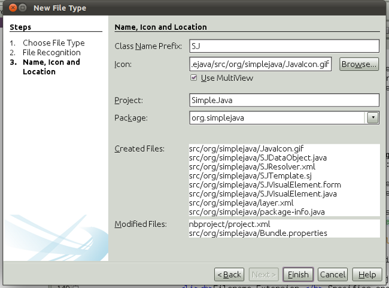
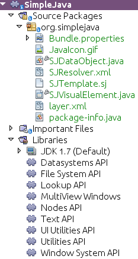
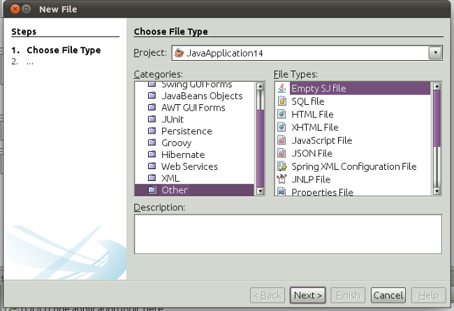
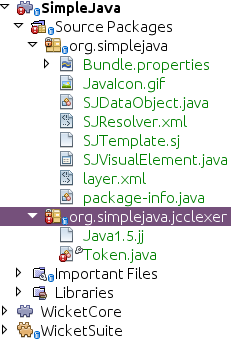

// 
//     Licensed to the Apache Software Foundation (ASF) under one
//     or more contributor license agreements.  See the NOTICE file
//     distributed with this work for additional information
//     regarding copyright ownership.  The ASF licenses this file
//     to you under the Apache License, Version 2.0 (the
//     "License"); you may not use this file except in compliance
//     with the License.  You may obtain a copy of the License at
// 
//       http://www.apache.org/licenses/LICENSE-2.0
// 
//     Unless required by applicable law or agreed to in writing,
//     software distributed under the License is distributed on an
//     "AS IS" BASIS, WITHOUT WARRANTIES OR CONDITIONS OF ANY
//     KIND, either express or implied.  See the License for the
//     specific language governing permissions and limitations
//     under the License.
//

= JavaCC Lexer Generator Integration Tutorial for NetBeans Platform 7.1
:jbake-type: platform_tutorial
:jbake-tags: tutorials 
:jbake-status: published
:syntax: true
:source-highlighter: pygments
:toc: left
:toc-title:
:icons: font
:experimental:
:description: JavaCC Lexer Generator Integration Tutorial for NetBeans Platform 7.1 - Apache NetBeans
:keywords: Apache NetBeans Platform, Platform Tutorials, JavaCC Lexer Generator Integration Tutorial for NetBeans Platform 7.1

This tutorial shows you how to generate a lexer with  link:https://javacc.github.io/javacc//[JavaCC] and use it to create editor features for applications created on top of the NetBeans Platform.

Though some explanations of JavaCC are given in this tutorial, the focus here is not on JavaCC as such. For background information and a thorough understanding of JavaCC, see the related website. The intended audience of this tutorial is the JavaCC user who would like to integrate a generated JavaCC lexer into NetBeans Platform applications. JavaCC is discussed only in so far as it is needed to set up a scenario for using the related NetBeans APIs.

This tutorial is the official version of the first part of  link:http://wiki.netbeans.org/How_to_create_support_for_a_new_language[http://wiki.netbeans.org/How_to_create_support_for_a_new_language], which, aside from being a rough draft, is partly obsolete and out of date for NetBeans Platform 7.1.

A basic overview of the steps to be taken during the instructions that follow can be seen here:

== Introduction

JavaCC is a generator for Java lexers and Java parsers. A Java lexer and parser generator is a tool that reads a grammar specification and converts it to a Java program that can recognize matches to the grammar.

This tutorial focuses specifically on lexers. Lexical analysis, or "lexing", is the process of converting a sequence of characters into a sequence of tokens. Functionality that performs lexical analysis is called a lexical analyzer, a lexer, or a scanner. In this tutorial, the term "lexer" will be used. A lexer typically exists as a single function called by a parser. For example, while a typical lexer recognizes parentheses as tokens, it does nothing to ensure that an opening parentheses is matched by a closing parentheses, which is a task for a parser.

Part 2 of this tutorial, the  link:nbm-javacc-parser.html[JavaCC Parser Generator Integration Tutorial], shows you how to create a parser that parses the same text that the lexer in this tutorial lexes.

The NetBeans Platform provides hooks for integrating a lexer into your own Java desktop application on the NetBeans Platform. For example, in this tutorial, you use a sample grammar specification provided by JavaCC to generate a lexer and use it to create syntax coloring in an editor for a simplified Java language defined by the sample grammar specification:

image::images/javacc_71_result-1.png[]

Users of your editor will be able to customize syntax colors via the Options window in the application:

image::images/javacc_71_result-2.png[]

The source code you will have by the end of this tutorial will be as follows:

image::images/javacc_71_lexer-5.png[]

The principles you learn in this tutorial should help you integrate a JavaCC-based lexer of your own.

== Creating the Module

In this section, we use a wizard to create the source structure that every NetBeans module requires. The source structure consists of certain folders in specific places and a set of files that are always needed. For example, every NetBeans module requires a  ``nbproject``  folder, which holds the project's metadata.

[start=1]
1. Choose File > New Project (Ctrl-Shift-N). Under Categories, select NetBeans Modules. Under Projects, select Module. Click Next.

[start=2]
1. 
In the Name and Location panel, type  ``SimpleJava``  in Project Name. Change the Project Location to any directory on your computer. Click Next.

[start=3]
1. In the Basic Module Configuration panel, type  ``org.simplejava``  as the Code Name Base. Click Finish.

The IDE creates the  ``SimpleJava``  project:

image::images/javacc_71_code-1.png[]

The project contains all of your sources and project metadata, such as the project's Ant build script. The project opens in the IDE. You can view its logical structure in the Projects window (Ctrl-1) and its file structure in the Files window (Ctrl-2).

== Recognizing SJ Files

In this section, we use a wizard to create the classes necessary for recognizing "SimpleJava" files, for which we will create the new "text/x-sj" MIME type, which will recognize files with ".sj" as their file extension.

[start=1]
1. Right-click the project node and choose New > Other > Module Development > File Type.

[start=2]
1. In the File Recognition panel, do the following:
* Type  ``text/x-sj``  in the MIME Type edit box.
* Type  ``.sj .SJ``  in the by Filename Extension edit box.

The File Recognition panel should now look as follows:

image::images/javacc_71_code-2.png[]

Note the following about the fields in the File Recognition panel:

* *MIME Type.* Specifies the data object's unique MIME type.
* *Filename Extension.* Specifies one or more file extensions that the IDE will recognize as belonging to the specified MIME type. The file extension can optionally be preceded by a dot. Separators are commas, spaces, or both. Therefore, all of the following are valid:
*  ``.abc,.def`` 
*  ``.abc .def`` 
*  ``abc def`` 
*  ``abc,.def ghi, .wow`` 

Let's imagine that SJ files are not case-sensitive. For this reason, you specify _two_ file extensions in this tutorial— ``.sj``  and  ``.SJ`` .

Click Next.

[start=3]
1. In the Name and Location panel, type  ``Abc``  as the Class Name Prefix and browse to any 16x16 pixel image file as the new file type's icon, as shown below.

*Note:* You can use any icon of a 16x16 pixel dimension. If you like, you can right-click on this one and save it locally, and then specify it in the wizard step above: 
image::images/javacc_71_JavaIcon.gif[]

[start=4]
1. Click Finish.

The Projects window should now look as follows:

Each of the newly generated files is briefly introduced:

* *SJDataObject.java.* Represents one or more file types, letting you parse and process the underlying file content. For more information, see  link:https://netbeans.apache.org/wiki/devfaqdataobject[What is a DataObject?].
* *SJResolver.xml.* Maps the  ``.sj``  and  ``.SJ``  extensions to the MIME type. The MIME type resolver, uses  link:http://bits.netbeans.org/dev/javadoc/org-openide-filesystems/org/openide/filesystems/doc-files/resolverDocumentation.html[these] rules to determine whether a file is recognized.
* *SJTemplate.sj.* Provides the basis of a file template that is registered in the system via the  ``package-info.java``  class, which has been generated into the module as can be seen in the screenshot above, such that it will be installed in the New File dialog as a new template.
* *SJVisualElement.java.* Is a  ``JPanel``  annotated such that it will integrate into your editor for the  ``text/x-sj``  file type, providing a first visual panel. Copy it and tweak its annotations to begin creating additional visual panels.

In the  ``layer.xml``  file, you should see the following:

[source,xml]
----

<folder name="Loaders">
    <folder name="text">
        <folder name="x-sj">
            <folder name="Actions">
                <file name="org-openide-actions-CopyAction.shadow">
                    <attr name="originalFile" stringvalue="Actions/Edit/org-openide-actions-CopyAction.instance"/>
                    <attr name="position" intvalue="400"/>
                </file>
                <file name="org-openide-actions-CutAction.shadow">
                    <attr name="originalFile" stringvalue="Actions/Edit/org-openide-actions-CutAction.instance"/>
                    <attr name="position" intvalue="300"/>
                </file>
                <file name="org-openide-actions-DeleteAction.shadow">
                    <attr name="originalFile" stringvalue="Actions/Edit/org-openide-actions-DeleteAction.instance"/>
                    <attr name="position" intvalue="600"/>
                </file>
                <file name="org-openide-actions-FileSystemAction.shadow">
                    <attr name="originalFile" stringvalue="Actions/System/org-openide-actions-FileSystemAction.instance"/>
                    <attr name="position" intvalue="1100"/>
                </file>
                <file name="org-openide-actions-OpenAction.shadow">
                    <attr name="originalFile" stringvalue="Actions/System/org-openide-actions-OpenAction.instance"/>
                    <attr name="position" intvalue="100"/>
                </file>
                <file name="org-openide-actions-PropertiesAction.shadow">
                    <attr name="originalFile" stringvalue="Actions/System/org-openide-actions-PropertiesAction.instance"/>
                    <attr name="position" intvalue="1400"/>
                </file>
                <file name="org-openide-actions-RenameAction.shadow">
                    <attr name="originalFile" stringvalue="Actions/System/org-openide-actions-RenameAction.instance"/>
                    <attr name="position" intvalue="700"/>
                </file>
                <file name="org-openide-actions-SaveAsTemplateAction.shadow">
                    <attr name="originalFile" stringvalue="Actions/System/org-openide-actions-SaveAsTemplateAction.instance"/>
                    <attr name="position" intvalue="900"/>
                </file>
                <file name="org-openide-actions-ToolsAction.shadow">
                    <attr name="originalFile" stringvalue="Actions/System/org-openide-actions-ToolsAction.instance"/>
                    <attr name="position" intvalue="1300"/>
                </file>
                <file name="sep-1.instance">
                    <attr name="instanceClass" stringvalue="javax.swing.JSeparator"/>
                    <attr name="position" intvalue="200"/>
                </file>
                <file name="sep-2.instance">
                    <attr name="instanceClass" stringvalue="javax.swing.JSeparator"/>
                    <attr name="position" intvalue="500"/>
                </file>
                <file name="sep-3.instance">
                    <attr name="instanceClass" stringvalue="javax.swing.JSeparator"/>
                    <attr name="position" intvalue="800"/>
                </file>
                <file name="sep-4.instance">
                    <attr name="instanceClass" stringvalue="javax.swing.JSeparator"/>
                    <attr name="position" intvalue="1000"/>
                </file>
                <file name="sep-5.instance">
                    <attr name="instanceClass" stringvalue="javax.swing.JSeparator"/>
                    <attr name="position" intvalue="1200"/>
                </file>
            </folder>
            <folder name="Factories">
                <file name="SJDataLoader.instance">
                    <attr name="dataObjectClass" stringvalue="org.simplejava.SJDataObject"/>
                    <attr name="iconBase" stringvalue="org/simplejava/JavaIcon.gif"/>
                    <attr name="instanceCreate" methodvalue="org.openide.loaders.DataLoaderPool.factory"/>
                    <attr name="mimeType" stringvalue="text/x-sj"/>
                </file>
            </folder>
        </folder>
    </folder>
</folder>
<folder name="Services">
    <folder name="MIMEResolver">
        <file name="SJResolver.xml" url="SJResolver.xml">
            <attr name="displayName" bundlevalue="org.simplejava.Bundle#Services/MIMEResolver/SJResolver.xml"/>
        </file>
    </folder>
</folder>
----

NOTE:  Each  ``<file>``  under  ``<folder name="Actions">``  associates the files of the  ``text/x-sj``  mime type with one of the predefined actions provided by the NetBeans Platform. A " ``.shadow`` " file means that the action specification is actually somewhere else in the NetBeans virtual filesystem, as specified by the  ``originalFile``  attribute. To add more actions for SJ files, see the  link:https://netbeans.apache.org/tutorials/nbm-filetype.html[File Type Integration Tutorial].

[start=5]
1. Right-click the module and choose Run. The application starts up, installing your module. Go to the Favorites window (Ctrl-3) and open a few files on computer that have ".sj" as their file extension.

You should see your icon is shown for the file type, the Actions registered in the  ``layer.xml``  are shown when you right-click the file in the Favorites window, and three tabs are shown in the editor (the source tab, the visual tab created above, and the history tab):

image::images/javacc_71_code-5.png[]

Create a new Java project and then go to the New File dialog, where you should see that your template has been registered:

You now have a basic file type recognition infrastructure set up. In the next section, we generate a lexer via JavaCC and then use it to add syntax coloring for the SJ file type.

== Generating a Lexer from JavaCC

Let's now use JavaCC to generate a lexer!

[start=1]
1. Download "javacc-4.0.zip" from "https://javacc.dev.java.net" and unpack it to a folder somewhere in your computer, named, for example, "/myjavacc40":

image::images/javacc_71_javacc-1.png[]

In this section, for purposes of this example, we will use the grammar specified in the  ``Java1.5.jj``  file, together with the  ``Token.java``  file from the example

image::images/javacc_71_javacc-2.png[]

NOTE:  You can try to use a different version of JavaCC, but there could be a differences in the generated files making the result incompatible with the sections that follow.

[start=2]
1. Create a new package named  ``org.simplejava.jcclexer``  in your project. Copy the two files mentioned above,  ``Java1.5.jj``  and  ``Token.java`` , into the new package:

NOTE:  The  ``Token``  class does not yet compile because the class it references,  ``JavaParserConstants`` , does not yet exist. It will be generated at the end of this section of the tutorial by JavaCC and at that stage the  ``Token``  class will compile.

We're now going to tweak the  ``Java1.5.jj``  file so that it fits our specific needs.

[start=3]
1. Firstly, we need to make sure that the classes that JavaCC will generate for us will be generated into the correct package, that is, the package where we copied the two files above. Add "package org.simplejava.jcclexer;" to  ``Java1.5.jj``  file after the "PARSER_BEGIN(JavaParser)" line, so that the files will be generated in the correct package:

[source,java]
----

PARSER_BEGIN(JavaParser)

*package org.simplejava.jcclexer;*

import java.io.*;
----

[start=4]
1. The  ``Java1.5.jj``  file contains the descriptions of tokens for the Java parser. That's nearly what we need for our own Java lexer, though there are some differences. The lexer defined for the parser hides some types of tokens, such as comments and whitespaces. However, we need to see such tokens in the NetBeans lexer because we want to define special colors for comments. Therefore, we need to change that in our JavaCC file.

* Change:

[source,java]
----

SKIP :
{
  " "
| "\t"
| "\n"
| "\r"
| "\f"
}
----

to:

[source,java]
----

TOKEN :
{
  < WHITESPACE:
  " "
| "\t"
| "\n"
| "\r"
| "\f">
}
----

* For the same reason, change all SPECIAL_TOKEN definitions:

[source,java]
----

SPECIAL_TOKEN :
{
  <SINGLE_LINE_COMMENT: "//" (~["\n","\r"])* ("\n" | "\r" | "\r\n")?>
}

<IN_FORMAL_COMMENT>
SPECIAL_TOKEN :
{
  <FORMAL_COMMENT: "*/" > : DEFAULT
}

<IN_MULTI_LINE_COMMENT>
SPECIAL_TOKEN :
{
  <MULTI_LINE_COMMENT: "*/" > : DEFAULT
}
----

to TOKEN definitions:

[source,java]
----

TOKEN :
{
  <SINGLE_LINE_COMMENT: "//" (~["\n","\r"])* ("\n" | "\r" | "\r\n")?>
}

<IN_FORMAL_COMMENT>
TOKEN :
{
  <FORMAL_COMMENT: "*/" > : DEFAULT
}

<IN_MULTI_LINE_COMMENT>
TOKEN :
{
  <MULTI_LINE_COMMENT: "*/" > : DEFAULT
}
----

[start=5]
1. Because we will use our  ``Java1.5.jj``  grammar file to create a lexer only, we can simplify it. Add this line, which sets the BUILD_PARSER property to false:

[source,java]
----

options {
  JAVA_UNICODE_ESCAPE = true;
  ERROR_REPORTING = false;
  STATIC = false;
  JDK_VERSION = "1.5";
  *BUILD_PARSER = false;*
}
----

[start=6]
1. Part of the  ``Java1.5.jj``  file is obsolete for our purposes, so let's delete some sections. Firstly, keep the PARSER_BEGIN and PARSER_END sections, but delete the JavaParser class body, so that you're left with exactly this:

[source,java]
----

PARSER_BEGIN(JavaParser)

package org.simplejava.jcclexer;

public class JavaParser {}

PARSER_END(JavaParser)
----

NOTE:  Though the parser start and end lines remain, the body of the class should now be empty and have exactly the content shown above.

Also delete everything from these lines down to the end of the file:

[source,java]
----

/*****************************************
 * THE JAVA LANGUAGE GRAMMAR STARTS HERE *
 *****************************************/
----

[start=7]
1. The  ``Java1.5.jj``  file is ready now and we can "compile" it from the command line:

[source,java]
----

cd /myprojects/simplejava/src/org/simplejava/jcclexer
/myjavacc40/bin/javacc Java1.5.jj
----

The result should be as follows:

image::images/javacc_71_code-7.png[]

As you can see, JavaCC has generated the following files:

* JavaCharStream.java
* JavaParserConstants.java
* JavaParserTokenManager.java
* ParseException.java
* TokenMgrError.java

All the files should be compilable, that is, there should be no error marks anywhere in the module, as can be seen in the screenshot above.

You've now completed the JavaCC part of the tutorial. The time has come to use the generated files to create a new NetBeans Lexer plugin.

== Integrating the JavaCC Lexer with NetBeans APIs

In this section, we take the files generated in the previous section and integrate them with the  link:http://bits.netbeans.org/dev/javadoc/org-netbeans-modules-lexer/overview-summary.html[NetBeans Lexer API].

[start=1]
1. In the Projects window, right-click the Libraries node, and choose Add Module Dependency, as shown below:

image::images/javacc_71_lexer-1.png[]

Look for the "Lexer" module in the list:

image::images/javacc_71_lexer-2.png[]

When you click OK, you should see the "Lexer" module is now a dependency in your module:

image::images/javacc_71_lexer-3.png[]

[start=2]
1. In your module, create a new package named  ``org.simplejava.lexer`` .

[start=3]
1. The first class you need to implement is  `` link:http://bits.netbeans.org/dev/javadoc/org-netbeans-modules-lexer/org/netbeans/api/lexer/TokenId.html[org.netbeans.api.lexer.TokenId]`` .  ``TokenId``  represents one type of token. It has three properties:

*  ``name.``  Unique name of the token type, such as  ``"KEYWORD_IF".`` 
*  ``id.``  Unique number.
*  ``primaryCategory.``  Used for sharing a token coloring among multiple token types.

Create a class named  ``SJTokenId``  and define it as follows:

[source,java]
----

package org.simplejava.lexer;

import org.netbeans.api.lexer.TokenId;

public class SJTokenId implements TokenId {

    private final String name;
    private final String primaryCategory;
    private final int id;

    SJTokenId(
            String name,
            String primaryCategory,
            int id) {
        this.name = name;
        this.primaryCategory = primaryCategory;
        this.id = id;
    }

    @Override
    public String primaryCategory() {
        return primaryCategory;
    }

    @Override
    public int ordinal() {
        return id;
    }

    @Override
    public String name() {
        return name;
    }

}
----

[start=4]
1. The next class you need to implement is  `` link:http://bits.netbeans.org/dev/javadoc/org-netbeans-modules-lexer/org/netbeans/spi/lexer/LanguageHierarchy.html[org.netbeans.spi.lexer.LanguageHierarchy]`` .  ``LanguageHierarchy``  provides a list of token types for our language and creates a new instance of our lexer.

Create a class named  ``SJLanguageHierarchy``  and define it as follows:

[source,java]
----

package org.simplejava.lexer;

import java.util.*;
import org.netbeans.spi.lexer.LanguageHierarchy;
import org.netbeans.spi.lexer.Lexer;
import org.netbeans.spi.lexer.LexerRestartInfo;

public class SJLanguageHierarchy extends LanguageHierarchy<SJTokenId> {

    private static List<SJTokenId> tokens;
    private static Map<Integer, SJTokenId> idToToken;

    private static void init() {
        tokens = Arrays.<SJTokenId>asList(new SJTokenId[]{
            //[PENDING]
        });
        idToToken = new HashMap<Integer, SJTokenId>();
        for (SJTokenId token : tokens) {
            idToToken.put(token.ordinal(), token);
        }
    }

    static synchronized SJTokenId getToken(int id) {
        if (idToToken == null) {
            init();
        }
        return idToToken.get(id);
    }

    @Override
    protected synchronized Collection<SJTokenId> createTokenIds() {
        if (tokens == null) {
            init();
        }
        return tokens;
    }

    @Override
    protected synchronized Lexer<SJTokenId> createLexer(LexerRestartInfo<SJTokenId> info) {
        return new SJLexer(info);
    }

    @Override
    protected String mimeType() {
        return "text/x-sj";
    }

}
----

NOTE:  Because the  ``SJLexer``  class does not yet exist, a red error mark is shown in the NetBeans editor in the new declaration for the non-existent  ``SJLexer``  class. You will define this class in the next step.

[start=5]
1. The last class you need to implement is  `` link:http://bits.netbeans.org/dev/javadoc/org-netbeans-modules-lexer/org/netbeans/spi/lexer/Lexer.html[org.netbeans.spi.lexer.Lexer]`` .  ``Lexer``  reads input text and returns tokens for it. In our case, the Lexer implementation needs to delegate to the lexer generated by JavaCC.

Create a class named  ``SJLexer``  and define it as follows:

[source,java]
----

package org.simplejava.lexer;

import org.netbeans.spi.lexer.Lexer;
import org.netbeans.spi.lexer.LexerRestartInfo;
import org.simplejava.jcclexer.JavaCharStream;
import org.simplejava.jcclexer.JavaParserTokenManager;
import org.simplejava.jcclexer.Token;

class SJLexer implements Lexer<SJTokenId> {

    private LexerRestartInfo<SJTokenId> info;
    private JavaParserTokenManager javaParserTokenManager;

    SJLexer(LexerRestartInfo<SJTokenId> info) {
        this.info = info;
        JavaCharStream stream = new JavaCharStream(info.input());
        javaParserTokenManager = new JavaParserTokenManager(stream);
    }

    @Override
    public org.netbeans.api.lexer.Token<SJTokenId> nextToken() {
        Token token = javaParserTokenManager.getNextToken();
        if (info.input().readLength() < 1) {
            return null;
        }
        return info.tokenFactory().createToken(SJLanguageHierarchy.getToken(token.kind));
    }

    @Override
    public Object state() {
        return null;
    }

    @Override
    public void release() {
    }

}
----

NOTE:  The class above does not compile at the moment because  ``JavaCharStream``  has not been defined to receive a  ``LexerInput`` . In the next step, we rewrite the  ``JavaCharStream``  class generated by JavaCC. Our new version of  ``JavaCharStream`` , listed in the next step, reads input characters from  `` link:http://bits.netbeans.org/dev/javadoc/org-netbeans-modules-lexer/org/netbeans/spi/lexer/LexerInput.html[org.netbeans.spi.lexer.LexerInput]`` , instead of the standard  ``InputStream`` .

[start=6]
1. Because we are now using  ``LexerInput``  instead of  ``InputStream`` , another change in  ``JavaCharStream``  is needed because the  ``JavaParserTokenManager``  created by JavaCC is designed to work with a  ``java.io.Reader``  and recognizes a <EOF> when the  ``io.Reader``  throws an  ``IOException`` . However, though the  ``LexerInput``  class logically corresponds to  ``java.io.Reader`` , its  ``read()``  method does not throw a checked exception. Hence the  ``BeginToken``  and the  ``readChar``  methods below validate the returned character and throw the exception, if necesary.

[source,java]
----

package org.simplejava.jcclexer;

import java.io.IOException;
import java.io.InputStream;
import java.io.Reader;
import java.io.UnsupportedEncodingException;
import org.netbeans.spi.lexer.LexerInput;

public class JavaCharStream {

    private LexerInput input;

    static boolean staticFlag;

    public JavaCharStream(LexerInput input) {
        this.input = input;
    }

    JavaCharStream(Reader stream, int i, int i0) {
        throw new UnsupportedOperationException("Not yet implemented");
    }

    JavaCharStream(InputStream stream, String encoding, int i, int i0) throws UnsupportedEncodingException {
        throw new UnsupportedOperationException("Not yet implemented");
    }

    char BeginToken() throws IOException {
        return readChar();
    }

    String GetImage() {
        return input.readText().toString();
    }

    public char[] GetSuffix(int len) {
        if (len > input.readLength()) {
            throw new IllegalArgumentException();
        }
        return input.readText(input.readLength() - len, input.readLength()).toString().toCharArray();
    }

    void ReInit(Reader stream, int i, int i0) {
        throw new UnsupportedOperationException("Not yet implemented");
    }

    void ReInit(InputStream stream, String encoding, int i, int i0) throws UnsupportedEncodingException {
        throw new UnsupportedOperationException("Not yet implemented");
    }

    void backup(int i) {
        input.backup(i);
    }

    int getBeginColumn() {
        return 0;
    }

    int getBeginLine() {
        return 0;
    }

    int getEndColumn() {
        return 0;
    }

    int getEndLine() {
        return 0;
    }

    char readChar() throws IOException {
        int result = input.read();
        if (result == LexerInput.EOF) {
            throw new IOException("LexerInput EOF");
        }
        return (char) result;
    }

}
----

[start=7]
1. After replacing the generated  ``JavaCharStream``  with the code in the previous step, everything should compile and your module structure should be as follows:

image::images/javacc_71_lexer-4.png[]

You now have an implementation of the NetBeans Lexer API based on a JavaCC lexer generated from a JavaCC grammar definition. In the next section, you register your NetBeans lexer so that the NetBeans Platform infrastructure can find it and load it into the application.

== Registering the NetBeans Lexer

You now have a NetBeans lexer. We need to register it so that it can be used.

[start=1]
1. In  ``SJTokenId`` , define the following method, which returns an instance of  ``org.netbeans.api.lexer.Language`` :

[source,java]
----

public static Language<SJTokenId> getLanguage() {
    return new SJLanguageHierarchy().language();
}
----

[start=2]
1. The instance created statically above needs to be called from somewhere. The call is done from the  ``layer.xml``  file, within the  ``CslPlugins``  folder, where you register the class below as a language instance, via the class annotation  ``@LanguageRegistration`` :

[source,java]
----

package org.simplejava;

import org.netbeans.api.lexer.Language;
import org.netbeans.modules.csl.spi.DefaultLanguageConfig;
import org.netbeans.modules.csl.spi.LanguageRegistration;
import org.simplejava.lexer.SJTokenId;

@LanguageRegistration(mimeType = "text/x-sj")
public class SJLanguage extends DefaultLanguageConfig {

    @Override
    public Language getLexerLanguage() {
        return SJTokenId.getLanguage();
    }

    @Override
    public String getDisplayName() {
        return "SJ";
    }

}
----

When the module containing the above class is built, the  ``generated-layer.xml``  file in the module's 'build' folder, which is visible in the Files window (Ctrl - 2) contains many new entries, providing many default features for your language.

== Defining Tokens and Assigning Colors

Let's now work with the actual tokens that we're going to need. First, we'll update the  ``SJLanguageHierarchy``  with our tokens. After that, we'll map the tokens to fonts and colors. Finally, we'll register our new files in the virtual filesystem of the application we're working on.

[start=1]
1. Look in the generated  ``JavaParserConstants``  file and notice the tokens that have been generated by JavaCC.

[source,java]
----

public interface JavaParserConstants {

  int EOF = 0;
  int WHITESPACE = 1;
  int SINGLE_LINE_COMMENT = 4;
  int FORMAL_COMMENT = 5;
  int MULTI_LINE_COMMENT = 6;
  int ABSTRACT = 8;
  int ASSERT = 9;
  int BOOLEAN = 10;
  int BREAK = 11;
  int BYTE = 12;
  ...
  ...
  ...
----

Now tweak and then copy the tokens above into your  ``SJLanguageHierarchy``  file:

[source,java]
----

tokens = Arrays.asList(new SJTokenId[]{
    new SJTokenId("EOF", "whitespace", 0),
    new SJTokenId("WHITESPACE", "whitespace", 1),
    new SJTokenId("SINGLE_LINE_COMMENT", "comment", 4),
    new SJTokenId("FORMAL_COMMENT", "comment", 5),
    new SJTokenId("MULTI_LINE_COMMENT", "comment", 6),
    new SJTokenId("ABSTRACT", "keyword", 8),
    new SJTokenId("ASSERT", "keyword", 9),
    new SJTokenId("BOOLEAN", "keyword", 10),
    new SJTokenId("BREAK", "keyword", 11),
    new SJTokenId("BYTE", "keyword", 12),
    ...
    ...
    ...
----

See the <<appendix,Appendix>> for the complete list of tokens. Copy them from the appendix into your module.

[start=2]
1. Next, we need to map the categories to fonts and colors. This is done declaratively, in an XML file, where we list the categories and then declare the fonts and colors that should be applied. In the main package of the module, that is,  ``org.simplejava`` , create a new XML file named  ``FontAndColors.xml`` , with the following content:

[source,xml]
----

<!DOCTYPE fontscolors PUBLIC
    "-//NetBeans//DTD Editor Fonts and Colors settings 1.1//EN"
    "https://netbeans.org/dtds/EditorFontsColors-1_1.dtd">
<fontscolors>
    <fontcolor name="character" default="char"/>
    <fontcolor name="errors" default="error"/>
    <fontcolor name="identifier" default="identifier"/>
    <fontcolor name="keyword" default="keyword" foreColor="red"/>
    <fontcolor name="literal" default="keyword" />
    <fontcolor name="comment" default="comment"/>
    <fontcolor name="number" default="number"/>
    <fontcolor name="operator" default="operator"/>
    <fontcolor name="string" default="string"/>
    <fontcolor name="separator" default="separator"/>
    <fontcolor name="whitespace" default="whitespace"/>
    <fontcolor name="method-declaration" default="method">
        
    </fontcolor>
</fontscolors>
----

This file defines how to visualize the tokens produced by the lexer.

The  ``fontcolor``  tag properties are as follows:

* name: Name or primaryCategory of your token (or tokens).
* default: Name of default coloring. All properties that are not defined explicitly are inherited from this default coloring. Default coloring is customizable in the Options window.
* foreColor: Foreground color.
* bgColor: Background color.
* underline: Underlined color. Token will be underlined if specified.
* strikeThrough: Strike through color.
* waveUnderlined: Wave underlined color.

The  ``fontcolor``  tag can contain a nested font tag. The  ``font``  tag has the following properties:

* name: Name of font.
* size: Font size.
* style: Bold or italic style.

[start=3]
1. 
Copy the following code into the template file. Not only will you use the template file, that is,  ``SJTemplate.sj`` , as a template in the New File dialog, but also as example text to be shown in the Options window, where the user will be able to see the effect of their customized fonts and colors.

[source,java]
----

/**
 * SimpleJavadoc comment for 

[source,java]
----

SimpleJavaExample
----

 class.
 * @author Simple Joe Smith
 */
public class SimpleJavaExample {

    @Deprecated public String method (int param) {
        return "SimpleString " + '-' + 1.2;
    }// line comment

}
----

[start=4]
1. Add the following key/value pairs into the  ``Bundle.properties``  file of the main package, that is, the  ``Bundle.properties``  file found in  ``org.simplejava`` :

[source,java]
----

text/x-sj=Simple Java
character=Character
errors=Error
identifier=Identifier
keyword=Keyword
literal=Literal
comment=Comment
number=Number
operator=Operator
string=String
separator=Separator
whitespace=Whitespace
method-declaration=Method Declaration
----

The above values will be shown in the Options window, in the panel where the user will be able to change the predefined fonts and colors per category.

[start=5]
1. Register the  ``FontAndColors.xml``  file, as well as the example file into the  ``layer.xml``  file:

[source,xml]
----

<folder name="Editors">
    <folder name="text">
        <folder name="x-sj">
            *<attr name="SystemFileSystem.localizingBundle" stringvalue="org.simplejava.Bundle"/>*
            *<folder name="FontsColors">
                <folder name="NetBeans">
                    <folder name="Defaults">
                        <file name="FontAndColors.xml" url="FontAndColors.xml">
                            <attr name="SystemFileSystem.localizingBundle" stringvalue="org.simplejava.Bundle"/>
                        </file>
                    </folder>
                </folder>
            </folder>*
        </folder>
    </folder>
</folder>
*<folder name="OptionsDialog">
    <folder name="PreviewExamples">
        <folder name="text">
            <file name="x-sj" url="SJTemplate.sj"/>
        </folder>
    </folder>
</folder>*
----

[start=6]
1. Check that your module now has this content:

image::images/javacc_71_lexer-5.png[]

Run the module, open an SJ file, and you should see the correct coloring, as defined in the files above:

image::images/javacc_71_result-1.png[]

Look in the Options window, under the Tools menu, and you should be able to change the fonts and colors for the file type.

image::images/javacc_71_result-2.png[]

link:http://netbeans.apache.org/community/mailing-lists.html[Send Us Your Feedback]

== Next Steps

This tutorial is the official version of the first part of  link:http://wiki.netbeans.org/How_to_create_support_for_a_new_language[http://wiki.netbeans.org/How_to_create_support_for_a_new_language], which, aside from being a rough draft, is partly obsolete and out of date for NetBeans Platform 7.1.

Part 2 of this tutorial, the  link:nbm-javacc-parser.html[JavaCC Parser Generator Integration Tutorial], shows you how to create a parser that parses the same text that the lexer in this tutorial lexes.

For more information about creating and developing NetBeans modules, see the following resources:

*  link:https://netbeans.apache.org/platform/index.html[NetBeans Platform Homepage]
*  link:https://bits.netbeans.org/dev/javadoc/[NetBeans API List (Current Development Version)]
*  link:https://netbeans.apache.org/kb/docs/platform.html[Other Related Tutorials]

== Appendix

The complete list of tokens, referred to in step 1 of the section <<defining,Defining Tokens and Assigning Colors>> above, is as follows:

[source,java]
----

tokens = Arrays.asList(new SJTokenId[]{
    new SJTokenId("EOF", "whitespace", 0),
    new SJTokenId("WHITESPACE", "whitespace", 1),
    new SJTokenId("SINGLE_LINE_COMMENT", "comment", 4),
    new SJTokenId("FORMAL_COMMENT", "comment", 5),
    new SJTokenId("MULTI_LINE_COMMENT", "comment", 6),
    new SJTokenId("ABSTRACT", "keyword", 8),
    new SJTokenId("ASSERT", "keyword", 9),
    new SJTokenId("BOOLEAN", "keyword", 10),
    new SJTokenId("BREAK", "keyword", 11),
    new SJTokenId("BYTE", "keyword", 12),
    new SJTokenId("CASE", "keyword", 13),
    new SJTokenId("CATCH", "keyword", 14),
    new SJTokenId("CHAR", "keyword", 15),
    new SJTokenId("CLASS", "keyword", 16),
    new SJTokenId("CONST", "keyword", 17),
    new SJTokenId("CONTINUE", "keyword", 18),
    new SJTokenId("_DEFAULT", "keyword", 19),
    new SJTokenId("DO", "keyword", 20),
    new SJTokenId("DOUBLE", "keyword", 21),
    new SJTokenId("ELSE", "keyword", 22),
    new SJTokenId("ENUM", "keyword", 23),
    new SJTokenId("EXTENDS", "keyword", 24),
    new SJTokenId("FALSE", "keyword", 25),
    new SJTokenId("FINAL", "keyword", 26),
    new SJTokenId("FINALLY", "keyword", 27),
    new SJTokenId("FLOAT", "keyword", 28),
    new SJTokenId("FOR", "keyword", 29),
    new SJTokenId("GOTO", "keyword", 30),
    new SJTokenId("IF", "keyword", 31),
    new SJTokenId("IMPLEMENTS", "keyword", 32),
    new SJTokenId("IMPORT", "keyword", 33),
    new SJTokenId("INSTANCEOF", "keyword", 34),
    new SJTokenId("INT", "keyword", 35),
    new SJTokenId("INTERFACE", "keyword", 36),
    new SJTokenId("LONG", "keyword", 37),
    new SJTokenId("NATIVE", "keyword", 38),
    new SJTokenId("NEW", "keyword", 39),
    new SJTokenId("NULL", "keyword", 40),
    new SJTokenId("PACKAGE", "keyword", 41),
    new SJTokenId("PRIVATE", "keyword", 42),
    new SJTokenId("PROTECTED", "keyword", 43),
    new SJTokenId("PUBLIC", "keyword", 44),
    new SJTokenId("RETURN", "keyword", 45),
    new SJTokenId("SHORT", "keyword", 46),
    new SJTokenId("STATIC", "keyword", 47),
    new SJTokenId("STRICTFP", "keyword", 48),
    new SJTokenId("SUPER", "keyword", 49),
    new SJTokenId("SWITCH", "keyword", 50),
    new SJTokenId("SYNCHRONIZED", "keyword", 51),
    new SJTokenId("THIS", "keyword", 52),
    new SJTokenId("THROW", "keyword", 53),
    new SJTokenId("THROWS", "keyword", 54),
    new SJTokenId("TRANSIENT", "keyword", 55),
    new SJTokenId("TRUE", "keyword", 56),
    new SJTokenId("TRY", "keyword", 57),
    new SJTokenId("VOID", "keyword", 58),
    new SJTokenId("VOLATILE", "keyword", 59),
    new SJTokenId("WHILE", "keyword", 60),
    new SJTokenId("INTEGER_LITERAL", "literal", 61),
    new SJTokenId("DECIMAL_LITERAL", "literal", 62),
    new SJTokenId("HEX_LITERAL", "literal", 63),
    new SJTokenId("OCTAL_LITERAL", "literal", 64),
    new SJTokenId("FLOATING_POINT_LITERAL", "literal", 65),
    new SJTokenId("DECIMAL_FLOATING_POINT_LITERAL", "literal", 66),
    new SJTokenId("DECIMAL_EXPONENT", "number", 67),
    new SJTokenId("HEXADECIMAL_FLOATING_POINT_LITERAL", "literal", 68),
    new SJTokenId("HEXADECIMAL_EXPONENT", "number", 69),
    new SJTokenId("CHARACTER_LITERAL", "literal", 70),
    new SJTokenId("STRING_LITERAL", "literal", 71),
    new SJTokenId("IDENTIFIER", "identifier", 72),
    new SJTokenId("LETTER", "literal", 73),
    new SJTokenId("PART_LETTER", "literal", 74),
    new SJTokenId("LPAREN", "operator", 75),
    new SJTokenId("RPAREN", "operator", 76),
    new SJTokenId("LBRACE", "operator", 77),
    new SJTokenId("RBRACE", "operator", 78),
    new SJTokenId("LBRACKET", "operator", 79),
    new SJTokenId("RBRACKET", "operator", 80),
    new SJTokenId("SEMICOLON", "operator", 81),
    new SJTokenId("COMMA", "operator", 82),
    new SJTokenId("DOT", "operator", 83),
    new SJTokenId("AT", "operator", 84),
    new SJTokenId("ASSIGN", "operator", 85),
    new SJTokenId("LT", "operator", 86),
    new SJTokenId("BANG", "operator", 87),
    new SJTokenId("TILDE", "operator", 88),
    new SJTokenId("HOOK", "operator", 89),
    new SJTokenId("COLON", "operator", 90),
    new SJTokenId("EQ", "operator", 91),
    new SJTokenId("LE", "operator", 92),
    new SJTokenId("GE", "operator", 93),
    new SJTokenId("NE", "operator", 94),
    new SJTokenId("SC_OR", "operator", 95),
    new SJTokenId("SC_AND", "operator", 96),
    new SJTokenId("INCR", "operator", 97),
    new SJTokenId("DECR", "operator", 98),
    new SJTokenId("PLUS", "operator", 99),
    new SJTokenId("MINUS", "operator", 100),
    new SJTokenId("STAR", "operator", 101),
    new SJTokenId("SLASH", "operator", 102),
    new SJTokenId("BIT_AND", "operator", 103),
    new SJTokenId("BIT_OR", "operator", 104),
    new SJTokenId("XOR", "operator", 105),
    new SJTokenId("REM", "operator", 106),
    new SJTokenId("LSHIFT", "operator", 107),
    new SJTokenId("PLUSASSIGN", "operator", 108),
    new SJTokenId("MINUSASSIGN", "operator", 109),
    new SJTokenId("STARASSIGN", "operator", 110),
    new SJTokenId("SLASHASSIGN", "operator", 111),
    new SJTokenId("ANDASSIGN", "operator", 112),
    new SJTokenId("ORASSIGN", "operator", 113),
    new SJTokenId("XORASSIGN", "operator", 114),
    new SJTokenId("REMASSIGN", "operator", 115),
    new SJTokenId("LSHIFTASSIGN", "operator", 116),
    new SJTokenId("RSIGNEDSHIFTASSIGN", "operator", 117),
    new SJTokenId("RUNSIGNEDSHIFTASSIGN", "operator", 118),
    new SJTokenId("ELLIPSIS", "operator", 119),
    new SJTokenId("RUNSIGNEDSHIFT", "operator", 120),
    new SJTokenId("RSIGNEDSHIFT", "operator", 121),
    new SJTokenId("GT", "operator", 122)
});
----

