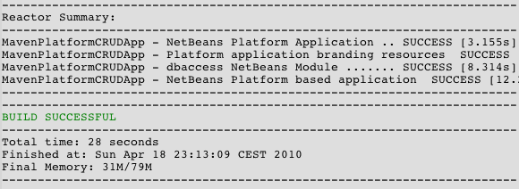

// 
//     Licensed to the Apache Software Foundation (ASF) under one
//     or more contributor license agreements.  See the NOTICE file
//     distributed with this work for additional information
//     regarding copyright ownership.  The ASF licenses this file
//     to you under the Apache License, Version 2.0 (the
//     "License"); you may not use this file except in compliance
//     with the License.  You may obtain a copy of the License at
// 
//       http://www.apache.org/licenses/LICENSE-2.0
// 
//     Unless required by applicable law or agreed to in writing,
//     software distributed under the License is distributed on an
//     "AS IS" BASIS, WITHOUT WARRANTIES OR CONDITIONS OF ANY
//     KIND, either express or implied.  See the License for the
//     specific language governing permissions and limitations
//     under the License.
//

= 使用 Maven 创建 NetBeans 平台 CRUD 应用程序
:jbake-type: platform_tutorial
:jbake-tags: tutorials 
:jbake-status: published
:syntax: true
:source-highlighter: pygments
:toc: left
:toc-title:
:icons: font
:experimental:
:description: 使用 Maven 创建 NetBeans 平台 CRUD 应用程序 - Apache NetBeans
:keywords: Apache NetBeans Platform, Platform Tutorials, 使用 Maven 创建 NetBeans 平台 CRUD 应用程序

欢迎使用  link:https://netbeans.apache.org/platform/[*NetBeans 平台*]！

本文档演示了如何使用 Maven 生成框架创建能读写数据库的简单 NetBeans 平台应用程序。在本文档中，您将使用 Maven 原型创建 NetBeans 平台应用程序和模块，并使用 Swing UI 工具包和 "Matisse" GUI 生成器创建窗口组件。

本文档根据基于 Ant 的 link:nbm-crud_zh_CN.html[针对 NetBeans 平台的 NetBeans CRUD 应用程序教程]而编写，阐述了使用 Ant 和 Maven 开发 NetBeans 平台应用程序的一些不同之处。在了解 Maven 与 Ant 之间的不同之处后，您便可以轻松地继续学习  link:https://netbeans.apache.org/kb/docs/platform_zh_CN.html[NetBeans 平台学习资源]上的其他教程。

“CRUD 样例应用程序”是“新建项目”向导中提供的一个 Maven 样例。

如果您不熟悉 NetBeans 平台，则可能需要观看截屏视频系列 link:https://netbeans.apache.org/tutorials/nbm-10-top-apis.html[最主要的 10 个 NetBeans API]。

*注意：*

* 捆绑的 GlassFish Server Open Source Edition 3.0.1 附带 JavaDB 数据库服务器和一个样例数据库。
* 为开发适用于 NetBeans 平台的应用程序，您无需下载该平台的独立版本。通常，您是在 NetBeans IDE 中开发应用程序和模块，并且只包含运行 NetBeans 平台和您的应用程序所需的模块。

在开始本教程之前，您可以先阅读下面这些文档。

*  link:http://wiki.netbeans.org/MavenBestPractices[Best Practices for Apache Maven in NetBeans 6.x]（NetBeans 6.x 中 Apache Maven 的最佳做法）
*  link:http://www.sonatype.com/books/maven-book/reference/introduction.html[Chapter 1. Introducing Apache Maven]（第 1 章. Apache Maven 简介，来自  link:http://www.sonatype.com/books/maven-book/reference/public-book.html[Maven: The Definitive Guide]（Maven：权威指南））
*  link:https://netbeans.apache.org/kb/docs/java/gui-functionality_zh_CN.html[生成 GUI 应用程序简介]

== 配置 Maven

如果这是您首次创建 Maven 项目，则需要在“选项”窗口中检查 Maven 配置设置。要学完本教程，您的本地系统中必须安装有 Maven。可以从  link:http://maven.apache.org/[Maven 站点]下载安装程序。

[start=1]
1. 在“选项”窗口中选择“其他”类别，然后单击 "Maven" 标签。

[start=2]
1. 指定 Maven 在本地的安装位置（要求为 2.0.9 或更高版本）。

[start=3]
1. 检查本地 Maven 资源库的位置是否正确。

[start=4]
1. 单击“确定”。

在大多数情况下，如果您执行了典型的 Maven 配置，则“选项”窗口中的信息应该已经是正确的。

IDE 使用 Maven SCM 签出 Maven 工件。您可能希望检查本地计算机上是否安装了签出源文件所需的任何客户端，并对它们进行了正确配置。

有关 Maven SCM 的详细信息，请参见  link:http://maven.apache.org/scm/index.html[Maven SCM 页]。

=== 查看 Maven 资源库

Maven 用于生成所有项目的工件均存储在本地 Maven 资源库中。如果某一工件被声明为项目依赖关系，则会将其从已注册的某个远程资源库下载到您的本地资源库中。

缺省情况下，已注册 NetBeans 资源库和一些常见的索引 Maven 资源库，并将它们列在资源库浏览器窗口中。NetBeans 资源库包含生成项目所需的大多数公共工件。您可以使用“Maven 资源库”浏览器查看本地和远程资源库的内容。您可以展开“本地库”节点以查看本地存在的工件。NetBeans 资源库节点下列出的工件可以添加为项目依赖关系，但并非所有这些工件都在本地存在。仅当这些工件被声明为项目依赖关系时，才会将其添加到“本地库”。

打开“Maven 资源库”浏览器：

* 从主菜单中选择“窗口”>“其他”>“Maven 资源库浏览器”。

image::images/maven-quickstart68_maven-nbm-netbeans-repo.png[title="“Maven 资源库”浏览器的屏幕快照"]

当将光标置于某个工件上时，IDE 将显示包含其坐标的工具提示。在浏览器中双击工件的 JAR 文件，可以查看有关该工件的其他详细信息。

单击“Maven 资源库”浏览器工具栏上的“查找”按钮，或使用主工具栏中的“快速搜索”文本字段，可以搜索工件。

有关管理 Maven 类路径依赖关系和在 IDE 中使用 Maven 资源库的详细信息，请参见  link:http://wiki.netbeans.org/MavenBestPractices[Best Practices for Apache Maven in NetBeans 6.x]（NetBeans 6.x 中 Apache Maven 的最佳做法）的 link:http://wiki.netbeans.org/MavenBestPractices#Dependency_management[Dependency Management]（依赖关系管理）部分。

要观看使用工件查看器的演示，请参见 link:https://netbeans.apache.org/kb/docs/java/maven-dependencies-screencast.html[处理 Maven 依赖关系]截屏视频。

== 创建 NetBeans 平台应用程序项目

在此部分，您将使用“新建项目”向导来通过 Maven 原型创建 NetBeans 平台应用程序。该向导会创建您开发 NetBeans 平台应用程序所需的 Maven 模块项目。您还将使用“新建项目”向导创建 NetBeans 模块。

=== 创建项目

请执行下列步骤，以使用“新建项目”向导创建 NetBeans 平台应用程序。

[start=1]
1. 选择“文件”>“新建项目”(Ctrl-Shift-N) 以打开“新建项目”向导。

[start=2]
1. 从 "Maven" 类别中选择“Maven NetBeans 应用程序”。单击“下一步”。

[start=3]
1. 在“项目名称”中键入 *MavenPlatformCRUDApp* 并设置“项目位置”。单击“完成”。

*注意：*当创建平台应用程序时，可以在向导中单击“下一步”并创建模块项目；但在本教程中，出于演示目的，您将分别创建应用程序和模块。

image::images/maven-crud_mavencrud-new-project.png[title="“新建项目”向导的屏幕快照"]

单击“完成”后，缺省情况下 IDE 会创建以下 Maven 项目类型。

* *NetBeans 平台应用程序。*此项目是平台应用程序的容器项目，它列出了要包含的模块和项目资源库的位置。此项目不包含任何源文件。IDE 在此项目的子目录中生成包含源文件和资源的模块。
* *基于 NetBeans 平台的应用程序。*此项目指定编译应用程序所需的工件（源文件）。在此项目的  ``pom.xml``  文件中，指定了必需的依赖关系（IDE 工件和模块工件）。
* *平台应用程序标记资源。*此项目包含用于标记应用程序的资源。

image::images/maven-crud_mavencrud-projects-window1.png[title="“项目”窗口中的项目结构"]

*注意：*

* 如果这是您第一次使用 Maven 创建 NetBeans 平台应用程序，则创建项目可能会耗费一些时间，因为 IDE 需要从 NetBeans 资源库中下载所有必需的工件。
* 在创建项目时，您会看到某些项目（例如，基于 NetBeans 平台的应用程序项目）带有标记，这是因为在  ``pom.xml``  文件 (POM) 中声明的一些依赖关系不可用。

=== 创建模块

在本练习中，您将使用“新建项目”向导创建一个 NetBeans 模块。

[start=1]
1. 选择“文件”>“新建项目”(Ctrl-Shift-N) 以打开“新建项目”向导。

[start=2]
1. 从 "Maven" 类别中选择“Maven NetBeans 模块”。单击“下一步”。

[start=3]
1. 在“项目名称”中键入 *MavenPlatformCRUDApp-dbaccess*。

[start=4]
1. 指定“项目位置”，方法是单击“浏览”并找到 *MavenPlatformCRUDApp* 目录。单击“打开”。
image::images/maven-crud_mavencrud-select-location.png[title="显示项目目录的“选择项目位置”对话框"]

[start=5]
1. 单击“完成”。

单击“完成”后，向导会创建名为 *MavenPlatformCRUDApp-dbaccess* 的 NetBeans 模块项目。当您将模块保存在某个子目录中时，该模块会自动配置为包含在应用程序中。如果打开该项目的 POM，则会看到 MavenPlatformCRUDApp 被声明为父项目。

[source,xml]
----

<parent>
    <artifactId>MavenPlatformCRUDApp</artifactId>
    <groupId>com.mycompany</groupId>
    <version>1.0-SNAPSHOT</version>
</parent>
<artifactId>MavenPlatformCRUDApp-dbaccess</artifactId>
<packaging>nbm</packaging>
<version>1.0-SNAPSHOT</version>
<name>MavenPlatformCRUDApp - dbaccess NetBeans Module</name>

----

可以更改模块的显示名称，方法是编辑 POM 中的  ``<name>``  元素，或者在该项目的属性窗口中修改名称。缺省显示名称为项目的工件 Id  ``MavenPlatformCRUDApp-dbaccess`` 。

如果在“项目”窗口中的“项目文件”节点下查看 NetBeans 平台应用程序的 POM，则可以看到在应用程序的模块中列出了三个模块。

[source,xml]
----

<modules>
   <module>branding</module>
   <module>application</module>
   <module>MavenPlatformCRUDApp-dbaccess</module>
</modules>

----

=== 为模块建立依赖关系

现在，您需要将该模块添加为基于 NetBeans 平台的应用程序的依赖关系。可以通过在编辑器中编辑  ``pom.xml``  或使用“添加依赖关系”对话框来添加依赖关系。

[start=1]
1. 在“项目”窗口中展开*基于 NetBeans 平台的应用程序*节点。

[start=2]
1. 右键单击“库”节点，然后选择“添加依赖关系”。

[start=3]
1. 单击“打开的项目”标签，然后选择 "MavenPlatformCRUDApp - dbaccess"。单击“确定”。
image::images/maven-crud_mavencrud-add-dependency1.png[title="“添加依赖关系”对话框中的“打开的项目”标签"]

如果在“项目”窗口中展开基于 NetBeans 平台的应用程序的“库”节点，则可以看到 MavenPlatformCRUDApp-dbaccess 此时已被列为依赖关系。

如果查看基于 NetBeans 平台的应用程序的 POM，则可以看到模块工件  ``MavenPlatformCRUDApp-dbaccess``  已被列为编译应用程序所需的依赖关系。在生成模块项目并在本地资源库中安装了工件之后，便可使用该工件。

[source,xml]
----

<dependency>
    <groupId>${project.groupId}</groupId>
    <artifactId>*MavenPlatformCRUDApp-dbaccess*</artifactId>
    <version>${project.version}</version>
</dependency>
----

=== 标记应用程序

标记模块用于指定在生成平台应用程序时所使用的标记资源。您可以使用“标记”对话框轻松地指定应用程序名称、闪屏和应用程序图标，并修改文本元素的值。

在本练习中，您将替换缺省的闪屏图像。缺省情况下，IDE 生成的标记模块会包含一个当平台应用程序启动时所显示的图像。可以通过执行下列步骤，将此图像替换为其他图像。

[start=1]
1. 右键单击“项目”窗口中的*平台应用程序标记资源*模块，然后选择“标记”。

[start=2]
1. 在“闪屏”标签中，指定要用作闪屏的图像，方法是单击缺省闪屏图像旁边的“浏览”按钮，然后找到您希望使用的图像。单击“确定”。

例如，您可以将下面的图像复制到本地系统，然后在“标记”对话框中指定该图像。

image::images/maven-crud_splash-crud.gif[title="缺省闪屏图像的示例"]

当启动应用程序时，便会在启动过程中显示新图像。

== 创建实体类

在此部分，将通过 Java DB 数据库中的表来生成一些实体类。要在应用程序中创建实体类并使用 Java 持久性 API (Java Persistence API, JPA)，您需要具有数据库服务器和 JPA 持久性提供器库的访问权限。本教程使用 JavaDB 数据库服务器，但您也可以将应用程序配置为使用其他数据库服务器。

使资源可用的最简便方法是注册 IDE 捆绑的 GlassFish Server Open Source Edition 3.0.1 实例。该 GlassFish 服务器附带 Java DB 数据库服务器、一个样例数据库和 JPA 持久性提供器。在创建实体类之前，请通过执行下列步骤启动 Java DB。

[start=1]
1. 在“服务”窗口中，展开“服务器”节点，然后检查是否已注册 GlassFish 实例。

[start=2]
1. 展开“数据库”节点，右键单击 Java DB 上 *app* 数据库的数据库连接节点 ( ``jdbc:derby://localhost:1527/sample [app on APP]`` )，然后选择“连接”。

当您选择“连接”时，如果尚未启动数据库，则 IDE 会启动它。

=== 将 DerbyClient 添加为运行时依赖关系

在此部分，您会将 derbyclient-10.5.3.0_1 库添加为依赖关系。

[start=1]
1. 右键单击 *dbaccess* 模块的“库”节点，然后选择“添加依赖关系”。

[start=2]
1. 添加库，方法是在 "GroupId" 中键入 *org.apache.derby*，在 "ArtifactId" 中键入 *derbyclient*，在“版本”中键入 *10.5.3.0_1*。

[start=3]
1. 从“作用域”下拉列表中选择 "runtime"。单击“确定”。
image::images/maven-crud_mavencrud-add-dependency-derby.png[title="在“添加依赖关系”对话框中添加 derbyclient JAR"]

如果在“项目”窗口中展开“运行时库”节点，则可以看到  ``derbyclient``  库已被列为依赖关系。

您还可以在编辑器中修改 POM，以指定依赖关系的  ``<scope>``  元素值。

[source,xml]
----

<dependency>
            <groupId>org.apache.derby</groupId>
            <artifactId>derbyclient</artifactId>
            <version>10.5.3.0_1</version>
            <scope>runtime</scope>
        </dependency>
----

=== 通过数据库生成实体类

在此部分，您将使用向导在 *dbaccess* 模块中生成实体类。

[start=1]
1. 右键单击 *dbaccess* 模块的“源包”，然后选择“新建”>“其他”。

[start=2]
1. 在“持久性”类别中选择“通过数据库生成实体类”。单击“下一步”。

[start=3]
1. 从“数据库连接”下拉列表中选择 Java DB 样例数据库。

[start=4]
1. 从“可用表”列表中选择 "CUSTOMER" 表，然后单击“添加”。单击“添加”后，相关表 DISCOUNT_CODE 也会被添加到“选定表”列表中。单击“下一步”。

[start=5]
1. 键入 *com.mycompany.mavenplatformcrudapp.dbaccess* 作为包名。确保“创建持久性单元”和“为持久性字段生成已命名的查询标注”处于选中状态。单击“完成”。

单击“完成”后，IDE 会生成 Customer 和 DiscountCode 实体类。IDE 还会在“其他源”节点下 "src/main/resources" 目录的 "META-INF" 包中生成  ``persistence.xml``  文件。

== 读取：读取并显示记录

在此部分，您将使用向导在 *dbaccess* 模块中添加窗口组件。您将在窗口组件中启用树视图来将对象显示为节点。您可以在节点的属性窗口中查看每条记录的数据。

=== 添加窗口组件

在本练习中，您将创建窗口组件。

[start=1]
1. 在“项目”窗口中右键单击项目节点，然后选择“新建”>“窗口”。

[start=2]
1. 在“窗口位置”下拉列表中选择 "editor"，然后选择“在应用程序启动时打开”。单击“下一步”。
image::images/maven-crud_mavencrud-new-window-customer.png[title="“新建窗口”向导的“基本设置”页"]

[start=3]
1. 在“类名前缀”中键入 *Customer*。

[start=4]
1. 在“包”中键入 *com.mycompany.mavenplatformcrudapp.viewer*。单击“完成”。

向导会显示将创建和修改的文件列表。

单击“完成”后，您可以在“项目”窗口中看到 IDE 在“源包”下的 "com.mycompany.mavenplatformcrudapp.viewer" 中生成了  ``CustomerTopComponent.java``  类。可以在“文件”窗口中查看项目的结构。要编译 Maven 项目，“源包”（“文件”窗口中的  ``src/main/java``  目录）下只能放置源文件。资源文件（例如，XML 文件）需要置于“其他源”（“文件”窗口中的  ``src/main/resources``  目录）下面。

=== 添加树视图

现在，您将修改窗口组件以在树视图中显示数据库记录。您将在构造函数中添加实体管理器，并启用 Bean 树视图。

[start=1]
1. 单击  ``CustomerTopComponent.java``  的“源”标签以在编辑器中查看源代码。

[start=2]
1. 修改构造函数以添加下列内容。

[source,java]
----

public CustomerTopComponent() {
    initComponents();
    setName(NbBundle.getMessage(CustomerTopComponent.class, "CTL_CustomerTopComponent"));
    setToolTipText(NbBundle.getMessage(CustomerTopComponent.class, "HINT_CustomerTopComponent"));
//        setIcon(ImageUtilities.loadImage(ICON_PATH, true));

    *EntityManager entityManager = Persistence.createEntityManagerFactory("com.mycompany_MavenPlatformCRUDApp-dbaccess_nbm_1.0-SNAPSHOTPU").createEntityManager();
    Query query = entityManager.createQuery("SELECT c FROM Customer c");
    List<Customer> resultList = query.getResultList();*
}
----

检查代码中持久性单元的名称是否正确，方法是将其与  ``persistence.xml``  中指定的名称进行比较。

[start=3]
1. 修改类签名以实现  ``ExplorerManager.Provider`` 。

[source,java]
----

public final class CustomerTopComponent extends TopComponent *implements ExplorerManager.Provider*
----

[start=4]
1. 修复导入以导入  ``*javax.persistence.Query*``  和  ``*javax.util.List*`` 。

[start=5]
1. 声明并初始化 ExplorerManager：

[source,java]
----

private static ExplorerManager em = new ExplorerManager();
----

[start=6]
1. 实现抽象方法，然后修改  ``getExplorerManager``  方法以返回  ``em`` 。

[source,java]
----

@Override
public ExplorerManager getExplorerManager() {
    return em;
}
----

您可以将插入光标置于类签名中，然后按 Alt+Enter 组合键来实现抽象方法。

[start=7]
1. 将以下内容添加到构造函数中以启用树视图。

[source,java]
----

BeanTreeView beanTreeView = new BeanTreeView();
add(beanTreeView, BorderLayout.CENTER);
----

[start=8]
1. 在“设计”视图，右键单击组件，然后选择“设置布局”>“边框式布局”。保存所做的更改。

=== 创建工厂类

现在，您将在  ``com.mycompany.mavenplatformcrudapp.viewer``  包中创建一个新类 *CustomerChildFactory*，该类用于为数据库中的每位客户创建一个新 BeanNode。

[start=1]
1. 右键单击 "com.mycompany.mavenplatformcrudapp.viewer" 包，然后选择“新建”>“Java 类”。

[start=2]
1. 在“类名”中键入 *CustomerChildFactory*。单击“完成”。

[start=3]
1. 修改签名以扩展  ``ChildFactory<Customer>`` 。

[start=4]
1. 为表格中的项目列表声明字段  ``resultList`` ，然后添加  ``CustomerChildFactory``  方法。

[source,java]
----

private List<Customer> resultList;

public CustomerChildFactory(List<Customer> resultList) {
    this.resultList = resultList;
}
----

[start=5]
1. 实现后，修改  ``createKeys``  抽象方法。

[source,java]
----

@Override
    protected boolean createKeys(List<Customer> list) {
      for (Customer customer : resultList) {
          list.add(customer);
      }
      return true;
    }
----

[start=6]
1. 添加一个方法以创建节点。

[source,java]
----

@Override
protected Node createNodeForKey(Customer c) {
    try {
        return new BeanNode(c);
    } catch (IntrospectionException ex) {
        Exceptions.printStackTrace(ex);
        return null;
    }
}
----

[start=7]
1. 修复导入以导入  ``org.openide.nodes.Node``  和  ``java.beans.InstrospectionException`` 。保存所做的更改。

该类将如下所示：

[source,java]
----

package com.mycompany.mavenplatformcrudapp.viewer;

import com.mycompany.mavenplatformcrudapp.dbaccess.Customer;
import java.beans.IntrospectionException;
import java.util.List;
import org.openide.nodes.BeanNode;
import org.openide.nodes.ChildFactory;
import org.openide.nodes.Node;
import org.openide.util.Exceptions;

public class CustomerChildFactory extends ChildFactory<Customer> {

    private List<Customer> resultList;

    public CustomerChildFactory(List<Customer> resultList) {
        this.resultList = resultList;
    }

    @Override
    protected boolean createKeys(List<Customer> list) {
        for (Customer customer : resultList) {
            list.add(customer);
        }
        return true;
    }

    @Override
    protected Node createNodeForKey(Customer c) {
        try {
            return new BeanNode(c);
        } catch (IntrospectionException ex) {
            Exceptions.printStackTrace(ex);
            return null;
        }
    }

}
----

现在，您需要修改 *CustomerTopComponent* 以使用 ExplorerManager 来将 JPA 查询的结果列表传递到节点。

[start=1]
1. 将以下行添加到 CustomerTopComponent 构造函数中，以设置节点的根上下文，并将 TopComponent 的 ActionMap 和 ExplorerManager 添加到 TopComponent 的 Lookup 中。

[source,java]
----

    EntityManager entityManager =  Persistence.createEntityManagerFactory("com.mycompany_MavenPlatformCRUDApp-dbaccess_nbm_1.0-SNAPSHOTPU").createEntityManager();
    Query query = entityManager.createQuery("SELECT c FROM Customer c");
    List<Customer> resultList = query.getResultList();
    *em.setRootContext(new AbstractNode(Children.create(new CustomerChildFactory(resultList), true)));
    associateLookup(ExplorerUtils.createLookup(em, getActionMap()));*
----

这会同步每个选定节点的属性窗口和工具提示文本。

[start=2]
1. 修复导入并保存更改。

=== 运行应用程序

在本练习中，您将测试应用程序以确认该应用程序可以正确访问和读取数据库表。在生成和运行应用程序之前，需要首先修改 POM，因为该应用程序需要对  ``org-openide-nodes``  和  ``org-openide-explorer``  JAR 的直接依赖关系。您可以在“项目”窗口中修改此依赖关系。

[start=1]
1. 展开 *dbaccess* 模块的“库”节点。

[start=2]
1. 右键单击  ``org-openide-nodes``  JAR，然后选择“声明为直接依赖关系”。

[start=3]
1. 右键单击  ``org-openide-explorer``  JAR，然后选择“声明为直接依赖关系”。

[start=4]
1. 右键单击 "MavenPlatformCRUDApp - NetBeans Platform based application"，然后选择“使用依赖关系生成”。

“输出”窗口会显示将要包含的模块。

image::images/maven-crud_mavencrud-build-output1.png[title="显示生成顺序的“输出”窗口"]

“输出”窗口还会显示生成状态。

[start=5]
1. 右键单击该应用程序，然后选择“运行”。

应用程序启动后，将显示 Customer 窗口，数据库表中的每条记录在该窗口中都有一个对应的节点。

image::images/maven-crud_mavencrud-customer-window1.png[title="应用程序中的 Customer 窗口"]

可以右键单击 Customer 窗口树中的某个节点，然后选择“属性”以查看有关该项目的其他详细信息。

image::images/maven-crud_mavencrud-read-properties.png[title="显示选定节点详细信息的“属性”窗口"]

== 更新：编辑记录

在此部分，您将添加一个用于编辑记录详细信息的窗口组件。

=== 创建编辑器窗口

在本练习中，您将创建一个新窗口 MyEditor，该窗口包含两个文本字段，用于编辑选定节点的名称和城市字段。然后，您将修改  ``layer.xml``  文件，以便 Customer 窗口以浏览器模式打开，而不是以编辑器模式打开。

[start=1]
1. 右键单击 *dbaccess* 模块，然后选择“新建”>“窗口”。

[start=2]
1. 在下拉列表中选择 "editor"，然后选择“在应用程序启动时打开”。单击“下一步”。

[start=3]
1. 在“类名前缀”中键入 *MyEditor*。

[start=4]
1. 在“包”中键入 *com.mycompany.mavenplatformcrudapp.editor*。单击“完成”。

[start=5]
1. 在  ``MyEditorTopComponent``  的“设计”视图中添加两个 JLabel 和两个 JTextField。

[start=6]
1. 将标签的文本分别设置为 "Name" 和 "City"，并将两个 JTextField 的变量名称分别设置为  ``jTextField1``  和  ``*jTextField2*`` 。保存所做的更改。
image::images/maven-crud_mavencrud-myeditor-window.png[title="“设计”视图中的窗口组件"]

[start=7]
1. 在“项目”窗口中展开“重要文件”节点，然后双击“XML 层”以在编辑器中打开  ``layer.xml``  文件。

[start=8]
1. 修改  ``layer.xml``  以指定将以浏览器模式显示 CustomerTopComponent 窗口。保存所做的更改。

[source,xml]
----

<folder name="Modes">
    <folder name="editor">
        <file name="MyEditorTopComponent.wstcref" url="MyEditorTopComponentWstcref.xml"/>
    </folder>
    *<folder name="explorer">
        <file name="CustomerTopComponent.wstcref" url="CustomerTopComponentWstcref.xml"/>
    </folder>*
</folder>
            
----

现在，可以测试应用程序以检查窗口是否可以打开并且其位置是否正确。

请务必在执行“使用依赖关系生成”操作之前清理应用程序。

现在，可以开始添加代码，以便在 Customer 窗口中选择某个节点时，该对象的名称和城市字段会显示在编辑器中。

=== 使用 LookupListener

在本练习中，您将修改 Customer 窗口，以便在选定了某个节点时，新的  ``Customer``  对象会被添加到节点的 Lookup 中。然后，您将修改 MyEditor，以便窗口实现  `` link:http://bits.netbeans.org/dev/javadoc/org-openide-util-lookup/org/openide/util/LookupListener.html[LookupListener]``  以侦听被添加到 Lookup 中的  ``Customer``  对象。

[start=1]
1. 修改 *CustomerChildFactory* 中的  ``createNodeForKey``  方法以创建  ``AbstractNode``  而不是  ``BeanNode`` 。

[source,java]
----

@Override
protected Node createNodeForKey(Customer c) {
  *Node node = new AbstractNode(Children.LEAF, Lookups.singleton(c));
  node.setDisplayName(c.getName());
  node.setShortDescription(c.getCity());
  return node;*
//        try {
//            return new BeanNode(c);
//        } catch (IntrospectionException ex) {
//            Exceptions.printStackTrace(ex);
//            return null;
//        }
}
----

当在 Customer 窗口中选择某个新节点时，所选的  ``Customer``  对象会被添加到窗口的 Lookup 中。

[start=2]
1. 单击 *MyEditorTopComponent* 的“源”标签，然后修改类签名以实现  ``LookupListener`` 。

[source,java]
----

public final class MyEditorTopComponent extends TopComponent *implements LookupListener*
----

[start=3]
1. 添加用于存储结果的变量。

[source,java]
----

private Lookup.Result result = null;
----

[start=4]
1. 实现所需的抽象方法以添加  ``resultChanged``  方法。

[start=5]
1. 修改  ``resultChanged``  方法，以便每次将新的  ``Customer``  对象引入 Lookup 时都会更新 jTextField。

[source,java]
----

      @Override
      public void resultChanged(LookupEvent le) {
          Lookup.Result r = (Lookup.Result) le.getSource();
          Collection<Customer> coll = r.allInstances();
          if (!coll.isEmpty()) {
              for (Customer cust : coll) {
                  jTextField1.setText(cust.getName());
                  jTextField2.setText(cust.getCity());
              }
          } else {
              jTextField1.setText("[no name]");
              jTextField2.setText("[no city]");
          }
      }

----

在定义 LookupListener 之后，便可以将其添加到从全局上下文获得的  ``Lookup.Result``  中。全局上下文将代理选定 Node 的上下文。例如，如果在树分层结构中选择 "Ford Motor Co"，则 "Ford Motor Co" 的  ``Customer``  对象会被添加到节点的 Lookup 中。由于 "Ford Motor Co" 是当前选定的节点，因此其  ``Customer``  对象此时在全局上下文中可用。随后即会将此对象传递到  ``resultChanged`` ，以填充该文本字段。

[start=6]
1. 修改  ``componentOpened``  和  ``componentClosed``  方法以便当编辑器窗口打开时激活 LookupListener。

[source,java]
----

      @Override
      public void componentOpened() {
          result = WindowManager.getDefault().findTopComponent("CustomerTopComponent").getLookup().lookupResult(Customer.class);
          result.addLookupListener(this);
          resultChanged(new LookupEvent(result));
      }

      @Override
      public void componentClosed() {
          result.removeLookupListener(this);
          result = null;
      }
----

由于编辑器窗口被设置为在应用程序启动时打开，因此当应用程序启动时，LookupListener 也将可用。

在此示例中，您将使用 Customer 窗口提供的本地 Lookup。在这种情况下，将通过字符串 " ``CustomerTopComponent`` " 明确标识该窗口。在  ``CustomerTopComponent``  的源代码中，该字符串被指定为 CustomerTopComponent 的 ID。仅当 MyEditorTopComponent 可以找到 ID 为 "CustomerTopComponent" 的 TopComponent 时，此方法才有效。

link:http://weblogs.java.net/blog/timboudreau/archive/2007/01/how_to_replace.html[Tim Boudreau 的博客文章]中描述了一种更加灵活的方法，该方法需要重写选择模型。

在执行“清理”和“使用依赖关系生成”之后，便可以重新运行此应用程序。现在，当您在 Customer 窗口中选择某个新节点时，编辑器窗口即会更新。由于您现在使用的是  ``AbstractNode``  而不是  ``BeanNode`` ，因此节点的“属性”窗口中不显示任何属性。

=== 添加“撤消”和“恢复”

在本练习中，将通过实现  `` link:http://bits.netbeans.org/dev/javadoc/org-openide-awt/org/openide/awt/UndoRedo.html[UndoRedo]``  管理器来启用“撤消”和“恢复”功能。当用户在编辑器窗口中更改了某个字段时，工具栏上的“撤消”和“恢复”按钮以及“撤消”和“恢复”菜单项便会启用。

[start=1]
1. 在 MyEditorTopComponent 的顶部声明并实例化一个新的 UndoRedoManager。

[source,java]
----

private UndoRedo.Manager manager = new UndoRedo.Manager();
----

[start=2]
1. 在 MyEditorTopComponent 中创建  ``getUndoRedo()``  方法：

[source,java]
----

@Override
public UndoRedo getUndoRedo() {
    return manager;
}
----

[start=3]
1. 将以下内容添加到构造函数中。

[source,java]
----

jTextField1.getDocument().addUndoableEditListener(manager);
jTextField2.getDocument().addUndoableEditListener(manager);
----

您可以运行该应用程序以测试“撤消”和“恢复”功能的按钮和菜单项是否能够正常使用。

=== 添加“保存”功能

在本练习中，您将集成 NetBeans 平台的“保存”功能。您将修改  ``layer.xml``  文件以隐藏工具栏中的“全部保存”按钮，并添加“保存”按钮。然后，将添加用于检测文本字段更改的侦听程序，以及在检测到更改时所触发的  ``fire``  方法。

[start=1]
1. 打开并修改 *dbaccess* 模块的  ``layer.xml``  文件以添加一个 Toolbar 元素。

[source,xml]
----

    *<folder name="Toolbars">
      <folder name="File">
          <file name="org-openide-actions-SaveAction.shadow">
              <attr name="originalFile" stringvalue="Actions/System/org-openide-actions-SaveAction.instance"/>
              <attr name="position" intvalue="444"/>
          </file>
          <file name="org-openide-actions-SaveAllAction.shadow_hidden"/>
      </folder>
    </folder>*
</filesystem>
----

[start=2]
1. 在 *MyEditorTopComponent* 构造函数中添加以下调用，以便在检测到文本字段更改时触发某个方法。

[source,java]
----

public MyEditorTopComponent() {

          ...
    jTextField1.getDocument().addUndoableEditListener(manager);
    jTextField2.getDocument().addUndoableEditListener(manager);

    *jTextField1.getDocument().addDocumentListener(new DocumentListener() {
        public void insertUpdate(DocumentEvent arg0) {
          fire(true);
        }
        public void removeUpdate(DocumentEvent arg0) {
          fire(true);
        }
        public void changedUpdate(DocumentEvent arg0) {
          fire(true);
        }
    });

    jTextField2.getDocument().addDocumentListener(new DocumentListener() {
        public void insertUpdate(DocumentEvent arg0) {
          fire(true);
        }
        public void removeUpdate(DocumentEvent arg0) {
          fire(true);
        }
        public void changedUpdate(DocumentEvent arg0) {
          fire(true);
        }
    });

    //Create a new instance of our SaveCookie implementation:
    impl = new SaveCookieImpl();

    //Create a new instance of our dynamic object:
    content = new InstanceContent();

    //Add the dynamic object to the TopComponent Lookup:
    associateLookup(new AbstractLookup(content));*

    ...
}
----

[start=3]
1. 添加  ``fire``  方法，在检测到更改时，即会调用该方法。

[source,java]
----

public void fire(boolean modified) {
  if (modified) {
      //If the text is modified,
      //we add SaveCookie impl to Lookup:
      content.add(impl);
  } else {
      //Otherwise, we remove the SaveCookie impl from the lookup:
      content.remove(impl);
  }
}
----

[start=4]
1. 添加  `` link:http://bits.netbeans.org/dev/javadoc/org-openide-nodes/org/openide/cookies/SaveCookie.html[SaveCookie]`` （由  ``fire``  方法添加到  ``InstanceContent``  中）的以下实现。

[source,java]
----

private class SaveCookieImpl implements SaveCookie {

  @Override
  public void save() throws IOException {

     Confirmation message = new NotifyDescriptor.Confirmation("Do you want to save \""
              + jTextField1.getText() + " (" + jTextField2.getText() + ")\"?",
              NotifyDescriptor.OK_CANCEL_OPTION,
              NotifyDescriptor.QUESTION_MESSAGE);

      Object result = DialogDisplayer.getDefault().notify(message);
      //When user clicks "Yes", indicating they really want to save,
      //we need to disable the Save action,
      //so that it will only be usable when the next change is made
      //to the JTextArea:
      if (NotifyDescriptor.YES_OPTION.equals(result)) {
          fire(false);
          //Implement your save functionality here.
      }
  }
}
----

[start=5]
1. 将以下字段添加到 MyEditorTopComponent 中。

[source,java]
----

private final SaveCookieImpl impl;
private final InstanceContent content;

----

[start=6]
1. 修复导入并保存更改。

[start=7]
1. 右键单击“项目”窗口中“库”节点下的  ``org-openide-dialogs``  JAR，然后选择“声明为直接依赖关系”。

现在，您可以对该应用程序执行“清理”、“使用依赖关系生成”和“运行”操作，以确认当您修改某个文本字段时，便会启用“保存”按钮。

=== 保留更改

在下一个练习中，您将添加用于保留更改的代码。此时，应用程序可正确识别某个字段何时发生了更改，并启用更改保存选项。当单击“保存”时，随即出现一个对话框，提示您确认是否希望保存更改。然而，当在对话框中单击“确定”时，这些更改并没有保留。要保留更改，您需要添加一些 JPA 代码以处理到数据库的持久性。

[start=1]
1. 将以下字段添加到 *MyEditorTopComponent* 中。

[source,java]
----

private Customer customer;
----

[start=2]
1. 添加用于保留更改的 JPA 代码，方法是修改  ``save``  方法以将注释  ``"//Implement your save functionality here." ``  替换为以下代码。

[source,java]
----

@Override
public void save() throws IOException {
...
    if (NotifyDescriptor.YES_OPTION.equals(result)) {
        fire(false);
        *EntityManager entityManager = Persistence.createEntityManagerFactory("com.mycompany_MavenPlatformCRUDApp-dbaccess_nbm_1.0-SNAPSHOTPU").createEntityManager();
        entityManager.getTransaction().begin();
        Customer c = entityManager.find(Customer.class, customer.getCustomerId());
        c.setName(jTextField1.getText());
        c.setCity(jTextField2.getText());
        entityManager.getTransaction().commit();*
    }
}
----

检查持久性单元的名称是否正确。

当前未定义  ``customer.getCustomerId()``  中的 "customer"。在下一步中，您会将  ``customer``  设置为用于获取客户 ID 的当前  ``Customer``  对象。

[start=3]
1. 将下面以粗体显示的代码行添加到  ``resultChanged``  方法中。

[source,java]
----

@Override
public void resultChanged(LookupEvent le) {
    Lookup.Result r = (Lookup.Result) le.getSource();
    Collection<Customer> coll = r.allInstances();
    if (!coll.isEmpty()) {
      for (Customer cust : coll) {
          *customer = cust;*
          jTextField1.setText(cust.getName());
          jTextField2.setText(cust.getCity());
      }
    } else {
      jTextField1.setText("[no name]");
      jTextField2.setText("[no city]");
    }
}
----

[start=4]
1. 修复导入并保存更改。

您可以运行此应用程序并更改一些数据，以测试保存功能是否能够正常使用并可保留更改。此时，编辑器不会更新字段以反映更改后的数据。要检查是否保留了数据，需要重新启动应用程序。

在下一个练习中，您将添加“刷新”功能，该功能可以从数据库中重新装入数据，并使您能够在编辑器中查看更改。

=== 添加“刷新”功能

在本练习中，通过将“刷新”菜单项添加到 Customer 窗口的根节点来添加用于更新客户查看器的功能。

[start=1]
1. 右键单击  ``*com.mycompany.mavenplatformcrudapp.viewer*``  包，选择“新建”>“Java 类”，然后创建一个名为 *CustomerRootNode* 的类。

[start=2]
1. 修改此类以扩展  ``AbstractNode``  并添加以下方法。

[source,java]
----

public class CustomerRootNode extends AbstractNode {

    *public CustomerRootNode(Children kids) {
      super(kids);
      setDisplayName("Root");
    }

    @Override
    public Action[] getActions(boolean context) {
      Action[] result = new Action[]{
          new RefreshAction()};
      return result;
    }

    private final class RefreshAction extends AbstractAction {

      public RefreshAction() {
          putValue(Action.NAME, "Refresh");
      }

      public void actionPerformed(ActionEvent e) {
          CustomerTopComponent.refreshNode();
      }
    }*

}
----

请注意，“刷新”操作绑定到新的根节点。

[start=3]
1. 修复导入以导入 * ``javax.swing.Action`` *。保存所做的更改。

[start=4]
1. 修改 *CustomerTopComponent* 以添加下面用于刷新视图的方法：

[source,java]
----

public static void refreshNode() {
    EntityManager entityManager = Persistence.createEntityManagerFactory("com.mycompany_MavenPlatformCRUDApp-dbaccess_nbm_1.0-SNAPSHOTPU").createEntityManager();
    Query query = entityManager.createQuery("SELECT c FROM Customer c");
    List<Customer> resultList = query.getResultList();
    em.setRootContext(new *CustomerRootNode*(Children.create(new CustomerChildFactory(resultList), true)));
}
----

请注意，该方法使用 *CustomerRootNode* 来设置根上下文。

如果希望 IDE 为您生成方法框架，则可以在  ``CustomerRootNode``  类中包含  ``refreshNode``  的代码行内按 Alt+Enter 组合键。

[start=5]
1. 修改 CustomerTopComponent 构造函数中的代码，将调用 *AbstractNode* 替换为调用 *CustomerRootNode*。

对  ``CustomerRootNode``  的调用会自动调用  ``refreshNode``  方法和“刷新”。

[start=6]
1. 修复导入并保存更改。

如果运行此应用程序，您会看到有一个新的根节点，并且其弹出式菜单中提供了“刷新”操作。

通过从  ``save``  方法中调用  ``refreshNode``  方法，可以重用  ``refreshNode``  方法并实现自动刷新。或者，也可以创建一个包含刷新操作的独立模块，并使该模块可以在各模块之间共享。

== 创建：添加新记录

在此部分，将允许用户在数据库中创建一个新的条目。

=== 添加“创建”操作

[start=1]
1. 右键单击 *dbaccess* 模块，然后选择“新建”>“操作”。

[start=2]
1. 选择“始终启用”。单击“下一步”。

[start=3]
1. 在“类别”下拉列表中，选择“文件”。

[start=4]
1. 选择“全局工具栏按钮”。单击“下一步”。
image::images/maven-crud_mavencrud-new-action.png[title="“新建操作”向导中的“GUI 注册”"]

[start=5]
1. 在“类名”中键入 *NewAction*。

[start=6]
1. 在“显示名称”中键入 *My New Action*。

[start=7]
1. 单击“浏览”，然后选择一个将在工具栏中使用的图像。

可以将以下图像  ``abc16.png``  复制到您的桌面，然后在向导中指定该图像。( 
image::images/maven-crud_abc16.png[title="样例 16 x 16 图标"] )

[start=8]
1. 选择 *com.mycompany.mavenplatformcrudapp.editor* 包。单击“完成”。

[start=9]
1. 修改  ``NewAction``  类以打开 MyEditorTopComponent 并清除字段。

[source,java]
----

import java.awt.event.ActionEvent;
import java.awt.event.ActionListener;

public final class NewAction implements ActionListener {

    public void actionPerformed(ActionEvent e) {
        MyEditorTopComponent tc = MyEditorTopComponent.getDefault();
        tc.resetFields();
        tc.open();
        tc.requestActive();
    }

}
----

此操作将实现 ActionListener 类，此类通过层文件中的条目绑定到应用程序，并由“新建操作”向导在此处生成。

=== 创建并保存新对象

[start=1]
1. 在 *MyEditorTopComponent* 中，添加以下方法以重置 JTextField 并创建新的  ``Customer``  对象。

[source,java]
----

public void resetFields() {
    customer = new Customer();
    jTextField1.setText("");
    jTextField2.setText("");
}
----

如果希望 IDE 在 MyEditorTopComponent 中生成方法框架，则可以在  ``NewAction``  类中的  ``resetFields``  调用内按 Alt+Enter 组合键。

[start=2]
1. 在 SaveCookie 中，确保返回的 null 表示已保存新条目，而非更新了现有条目：

[source,java]
----

public void save() throws IOException {

    Confirmation message = new NotifyDescriptor.Confirmation("Do you want to save \""
                  + jTextField1.getText() + " (" + jTextField2.getText() + ")\"?",
                  NotifyDescriptor.OK_CANCEL_OPTION,
                  NotifyDescriptor.QUESTION_MESSAGE);

    Object result = DialogDisplayer.getDefault().notify(msg);

    //When user clicks "Yes", indicating they really want to save,
    //we need to disable the Save button and Save menu item,
    //so that it will only be usable when the next change is made
    //to the text field:
    if (NotifyDescriptor.YES_OPTION.equals(result)) {
        fire(false);
        EntityManager entityManager = Persistence.createEntityManagerFactory("CustomerLibraryPU").createEntityManager();
        entityManager.getTransaction().begin();
        *if (customer.getCustomerId() != null) {*
            Customer c = entityManager.find(Customer.class, cude.getCustomerId());
            c.setName(jTextField1.getText());
            c.setCity(jTextField2.getText());
            entityManager.getTransaction().commit();
        *} else {
            Query query = entityManager.createQuery("SELECT c FROM Customer c");
            List<Customer> resultList = query.getResultList();
            customer.setCustomerId(resultList.size()+1);
            customer.setName(jTextField1.getText());
            customer.setCity(jTextField2.getText());
            //adds more fields that will populate the zip and discountCode columns
            customer.setZip("12345");
            customer.setDiscountCode(entityManager.find(DiscountCode.class, 'H'));

            entityManager.persist(customer);
            entityManager.getTransaction().commit();
        }*
    }

}
----

该代码还会在 DiscountCode 中写入一些任意的数据，因为该字段不能为空。

[start=3]
1. 修复导入以导入  ``*javax.persistence.Query*`` 。保存所做的更改。

== 生成和运行应用程序

现在，此应用程序执行三种 CRUD 功能：创建、读取和更新。您现在可以生成和运行此应用程序以检查所有功能是否都能够正常使用。

[start=1]
1. 右键单击 "MavenPlatformCRUDApp - NetBeans Platform based application" 项目节点，然后选择“清理”。

[start=2]
1. 右键单击 "MavenPlatformCRUDApp - NetBeans Platform based application" 项目节点，然后选择“使用依赖关系生成”。

[start=3]
1. 右键单击 "MavenPlatformCRUDApp - NetBeans Platform based application" 项目节点，然后选择“运行”。

单击“运行”后，IDE 会启动平台应用程序。该应用程序将使用数据库中的客户名称来填充 Customer 窗口中的树。当在 Customer 窗口中选择某个节点时，MyEditor 窗口便会显示所选客户的名称和城市。您可以修改 "Name" 和 "City" 字段中的数据并进行保存。要创建新客户，请单击工具栏上的 "My New Action" 按钮，在 MyEditor 窗口的空文本字段中输入名称和城市，然后单击“保存”。

image::images/maven-crud_mavencrud-finished-app.png[title="显示 Customer 和 MyEditor 窗口的完成的应用程序"]

如果您没有实现保存时刷新操作，则在创建或修改客户后，需要在 Customer 窗口中刷新根节点。

本教程说明了使用 Maven 创建 NetBeans 平台应用程序与使用 Ant 创建应用程序并无太大差异。主要的不同之处在于 Maven POM 控制应用程序组装的方式。有关如何生成 NetBeans 平台应用程序和模块的更多示例，请参见  link:https://netbeans.apache.org/kb/docs/platform_zh_CN.html[NetBeans 平台学习资源]中所列的教程。

== 另请参见

CRUD 教程到此结束。本文档描述了如何使用 Maven 生成框架创建具有 CRUD 功能的新 NetBeans 平台应用程序。有关创建和开发应用程序的更多信息，请参见以下资源。

*  link:https://netbeans.apache.org/kb/docs/platform_zh_CN.html[NetBeans 平台学习资源]
*  link:http://bits.netbeans.org/dev/javadoc/[NetBeans API Javadoc]

如果您有任何有关 NetBeans 平台的问题，可随时写信至邮件列表 dev@platform.netbeans.org，或查看  link:https://mail-archives.apache.org/mod_mbox/netbeans-dev/[NetBeans 平台邮件列表归档]。

