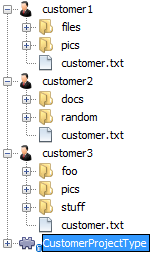
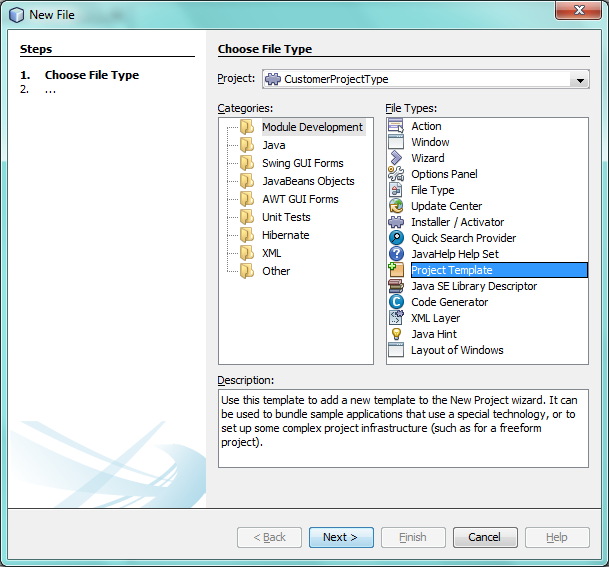

// 
//     Licensed to the Apache Software Foundation (ASF) under one
//     or more contributor license agreements.  See the NOTICE file
//     distributed with this work for additional information
//     regarding copyright ownership.  The ASF licenses this file
//     to you under the Apache License, Version 2.0 (the
//     "License"); you may not use this file except in compliance
//     with the License.  You may obtain a copy of the License at
// 
//       http://www.apache.org/licenses/LICENSE-2.0
// 
//     Unless required by applicable law or agreed to in writing,
//     software distributed under the License is distributed on an
//     "AS IS" BASIS, WITHOUT WARRANTIES OR CONDITIONS OF ANY
//     KIND, either express or implied.  See the License for the
//     specific language governing permissions and limitations
//     under the License.
//

= NetBeans Project Type Module Tutorial
:jbake-type: platform_tutorial
:jbake-tags: tutorials 
:jbake-status: published
:syntax: true
:source-highlighter: pygments
:toc: left
:toc-title:
:icons: font
:experimental:
:description: NetBeans Project Type Module Tutorial - Apache NetBeans
:keywords: Apache NetBeans Platform, Platform Tutorials, NetBeans Project Type Module Tutorial

This tutorial demonstrates how to create a new project type in a NetBeans Platform application.

*Before going further, make sure this is the tutorial you actually need!*

* Rather than creating a new project type, you might want to extend an _existing_ project type instead, as described in the  link:https://netbeans.apache.org/tutorials/nbm-projectextension.html[NetBeans Project Type Extension Module Tutorial].
* For Maven-based NetBeans Platform applications, see  link:http://netbeans.dzone.com/how-create-maven-nb-project-type[How to Create a Custom Project Type in a Mavenized NetBeans Platform Application].
* If the projects for which you're creating a project type (whether on Ant or Maven based NetBeans Platform applications) need to use Ant as their build tool, you should use the  link:https://netbeans.apache.org/tutorials/nbm-projecttypeant.html[NetBeans Ant-Based Project Type Module Tutorial] instead.

NOTE: This document uses NetBeans Platform 7.2 and NetBeans IDE 7.2. If you are using an earlier version, see  link:71/nbm-projecttype.html[the previous version of this document].

You will also make use of these icons, which you can right-click here and download: 
image::images/projecttypes_72pics_icon.png[] 
image::images/projecttypes_72pics_sub-icon.png[]

== Introduction to Project Types

A _project type_ is a NetBeans Platform term for a grouping of folders and files that is treated as a single unit. Treating related folders and files as a single unit makes working with them easier for the end user. One way in which a project type simplifies life for the user is that you are able to fill the Projects window only with those folders and files that the end user is most likely to work. For example, the Java project type in NetBeans IDE helps the end user to work with the folders and files belonging to a single Java application.

Our project type will be defined by the existence of a file named "customer.txt". The tutorial assumes you have available, on disk, multiple folders containing such a file, for example as illustrated below:

image::images/projecttypes_72pics_result-1.png[]

As in the case of the folders named "customer1", "customer2", and "customer3" above, if a folder contains a file named "customer", with a "txt" extension, the NetBeans Platform will recognize the folder as a project. The user will be able to open the project into a NetBeans Platform application. The user will also be able to create new projects, via the New Projects window (Ctrl-Shift-N), which is where we will register some sample projects.

The following are the main NetBeans API classes we will be implementing in this tutorial:

|===
|Class |Description 

| `` link:http://bits.netbeans.org/dev/javadoc/org-netbeans-modules-projectapi/org/netbeans/spi/project/ProjectFactory.html[org.netbeans.spi.project.ProjectFactory]``  |Determines when a folder or file is a valid project and then creates the implemention of  ``org.netbeans.api.project.Project`` . 

| `` link:http://bits.netbeans.org/dev/javadoc/org-netbeans-modules-projectapi/org/netbeans/api/project/Project.html[org.netbeans.api.project.Project]``  |Represents the project. 

| `` link:http://bits.netbeans.org/dev/javadoc/org-netbeans-modules-projectuiapi/org/netbeans/spi/project/ui/LogicalViewProvider.html[org.netbeans.spi.project.ui.LogicalViewProvider]``  |Provides the logical view for the project. 

| `` link:http://bits.netbeans.org/dev/javadoc/org-netbeans-modules-projectapi/org/netbeans/api/project/ProjectInformation.html[org.netbeans.api.project.ProjectInformation]``  |Provides supplemental information for the project. 

| `` link:http://bits.netbeans.org/dev/javadoc/org-netbeans-modules-projectapi/org/netbeans/spi/project/ActionProvider.html[org.netbeans.spi.project.ActionProvider]``  |Provides one or more actions for the project. 

| `` link:http://bits.netbeans.org/dev/javadoc/org-netbeans-modules-projectapi/org/netbeans/spi/project/CopyOperationImplementation.html[org.netbeans.spi.project.CopyOperationImplementation]``  |Provides the Copy operation for the project. 

| `` link:http://bits.netbeans.org/dev/javadoc/org-netbeans-modules-projectapi/org/netbeans/spi/project/DeleteOperationImplementation.html[org.netbeans.spi.project.DeleteOperationImplementation]``  |Provides the Delete operation for the project. 
|===

== Creating the Module Project

We begin by working through the New Module Project wizard. At the end of it, we will have a basic source structure, with some default files, that every NetBeans module requires.

[start=1]
1. Choose File > New Project (Ctrl+Shift+N). Under Categories, select NetBeans Modules. Under Projects, select Module. Click Next.

[start=2]
1. In the Name and Location panel, type  ``CustomerProjectType``  in the Project Name field. Change the Project Location to any directory on your computer. 

image::images/projecttypes_72pics_proj-1.png[]

Click Next.

[start=3]
1. In the Basic Module Configuration panel, type  ``org.customer.project``  in Code Name Base. 

image::images/projecttypes_72pics_proj-2.png[]

Click Finish.

The IDE creates the  ``CustomerProjectType``  project. The project contains all of your sources and project metadata, such as the project's Ant build script. The project opens in the IDE. You can view its logical structure in the Projects window (Ctrl-1) and its file structure in the Files window (Ctrl-2).

== Setting Dependencies

We will need to make use of several NetBeans APIs. In this step, we select the modules that provide the NetBeans APIs that we will need.

[start=1]
1. Right-click the project's Libraries node and choose "Add Module Dependency". Select the following modules and click OK: 
* Common Annotations
* Datasystems API
* Dialogs API
* File System API
* Lookup API
* Nodes API
* Project API
* Project UI API
* UI Utilities API
* Utilities API

[start=2]
1. Expand the Libraries node and check that the following dependencies have been set in the previous step: 

image::images/projecttypes_72pics_proj-3.png[]

== Creating the Project Factory

We start by implementing the  `` link:http://bits.netbeans.org/dev/javadoc/org-netbeans-modules-projectapi/org/netbeans/spi/project/ProjectFactory.html[org.netbeans.spi.project.ProjectFactory]``  class.

[start=1]
1. Create a Java class named  ``CustomerProjectFactory`` .

[start=2]
1. Change the default code to the following:

[source,java]
----

import java.io.IOException;
import org.netbeans.api.project.Project;
import org.netbeans.spi.project.ProjectFactory;
import org.netbeans.spi.project.ProjectState;
import org.openide.filesystems.FileObject;
import org.openide.util.lookup.ServiceProvider;

@ServiceProvider(service=ProjectFactory.class)
public class CustomerProjectFactory implements  link:http://bits.netbeans.org/dev/javadoc/org-netbeans-modules-projectapi/org/netbeans/spi/project/ProjectFactory.html[ProjectFactory] {

    public static final String PROJECT_FILE = "customer.txt";

    *//Specifies when a project is a project, i.e.,
    //if "customer.txt" is present in a folder:*
    @Override
    public boolean isProject(FileObject projectDirectory) {
        return projectDirectory.getFileObject(PROJECT_FILE) != null;
    }

    *//Specifies when the project will be opened, i.e., if the project exists:*
    @Override
    public Project loadProject(FileObject dir,  link:http://bits.netbeans.org/dev/javadoc/org-netbeans-modules-projectapi/org/netbeans/spi/project/ProjectState.html[ProjectState] state) throws IOException {
        return isProject(dir) ? new CustomerProject(dir, state) : null;
    }

    @Override
    public void saveProject(final Project project) throws IOException, ClassCastException {
        // leave unimplemented for the moment
    }

}
----

NOTE:  The @ServiceProvider annotation used in the class signature above will cause a META-INF/services file to be created when the module is compiled. Within that folder, a file named after the fully qualified name of the interface will be found, containing the fully qualified name of the implementing class. That is the standard JDK mechanism, since JDK 6, for registering implementations of interfaces. That is how project types are registered in the NetBeans Plaform.

Instead of  `` link:http://bits.netbeans.org/dev/javadoc/org-netbeans-modules-projectapi/org/netbeans/spi/project/ProjectFactory.html[ProjectFactory]`` , consider implementing the newer  `` link:http://bits.netbeans.org/dev/javadoc/org-netbeans-modules-projectapi/org/netbeans/spi/project/ProjectFactory2.html[ProjectFactory2]`` .  ``ProjectFactory2``  is a performance correction to  ``ProjectFactory`` , done in a compatible way. If you implement  ``ProjectFactory2`` , the project will not need to be loaded, which can take some time, especially in populating the Lookup, and the project icon appears fast in the Open Project dialog. If you implement only  ``ProjectFactory`` , more memory is consumed and projects are loaded even if not used or opened in the end. The main effective place to see the difference visually is when you have many projects in a single folder. The pattern itself is fairly common in the Eclipse world, for example. Interfaces are extended as InterfaceExt, InterfaceExt2, InterfaceExt3, etc. The general idea is that typically you should always implement the last extension to the base interface. But the core codebase dealing with the interfaces can handle all of the variants.

== Creating the Project

Next, we implement the  `` link:http://bits.netbeans.org/dev/javadoc/org-netbeans-modules-projectapi/org/netbeans/api/project/Project.html[org.netbeans.api.project.Project]``  class.

[start=1]
1. Create a Java class named  ``CustomerProject`` .

[start=2]
1. We'll start with a simple skeleton implementation:

[source,java]
----

import org.netbeans.api.project.Project;
import org.netbeans.spi.project.ProjectState;
import org.openide.filesystems.FileObject;
import org.openide.util.Lookup;

public class CustomerProject implements  link:http://bits.netbeans.org/dev/javadoc/org-netbeans-modules-projectapi/org/netbeans/api/project/Project.html[Project] {

    CustomerProject(FileObject dir, ProjectState state) {
        throw new UnsupportedOperationException("Not yet implemented");
    }

    @Override
    public FileObject getProjectDirectory() {
        throw new UnsupportedOperationException("Not supported yet.");
    }

    @Override
    public Lookup getLookup() {
        throw new UnsupportedOperationException("Not supported yet.");
    }
    
}
----

The  ``getLookup``  method, in the code above, is the key to the NetBeans project infrastructure. When you create new features for a project type, such as its logical view, its popup actions, or its customizer, you register them in the project via its  ``getLookup``  method.

[start=3]
1. Let's set up our project class so that we can start using it to register the project's features. Fill out the class by setting fields and add code to the  ``getLookup``  method to prepare it for the following sections.

[source,java]
----

import java.beans.PropertyChangeListener;
import javax.swing.Icon;
import javax.swing.ImageIcon;
import org.netbeans.api.annotations.common.StaticResource;
import org.netbeans.api.project.Project;
import org.netbeans.api.project.ProjectInformation;
import org.netbeans.spi.project.ProjectState;
import org.openide.filesystems.FileObject;
import org.openide.util.ImageUtilities;
import org.openide.util.Lookup;
import org.openide.util.lookup.Lookups;

public class CustomerProject implements Project {

    private final FileObject projectDir;
    private final ProjectState state;
    private Lookup lkp;

    CustomerProject(FileObject dir, ProjectState state) {
        this.projectDir = dir;
        this.state = state;
    }

    @Override
    public FileObject getProjectDirectory() {
        return projectDir;
    }

    @Override
    public Lookup getLookup() {
        if (lkp == null) {
            lkp = Lookups.fixed(new Object[]{
            
            // register your features here
            
            });
        }
        return lkp;
    }

}
----

[start=4]
1. Now let's work on the features that we'd like our project to have. In each case, we define the feature and then we register the feature in the project's Lookup. 
* <<projectinformation,Creating and Registering the Project Information>>
* <<projectlogicalview,Creating and Registering the Project Logical View>>
* <<projectchildren,Creating and Registering the Project Node Children>>
* <<projectcustomizer,Creating and Registering the Project Customizer>>
* <<projectsubtype,Creating and Registering the Project Subprojects>>

=== Creating and Registering the Project Information

In this section, you register minimum NetBeans project support, that is, you create and register a class that provides an icon and a display name for the project.

[start=1]
1. Put the  ``icon.png``  file, referred to at the start of this tutorial, into the  ``org.customer.project``  package.

[start=2]
1. As an inner class of the  ``CustomerProject``  class, define the project information as follows:

[source,java]
----

private final class Info implements  link:http://bits.netbeans.org/dev/javadoc/org-netbeans-modules-projectapi/org/netbeans/api/project/ProjectInformation.html[ProjectInformation] {

link:http://bits.netbeans.org/dev/javadoc/org-netbeans-api-annotations-common/org/netbeans/api/annotations/common/StaticResource.html[@StaticResource()]
    public static final String CUSTOMER_ICON = "org/customer/project/icon.png";

    @Override
    public Icon getIcon() {
        return new ImageIcon(ImageUtilities.loadImage(CUSTOMER_ICON));
    }

    @Override
    public String getName() {
        return getProjectDirectory().getName();
    }

    @Override
    public String getDisplayName() {
        return getName();
    }

    @Override
    public void addPropertyChangeListener(PropertyChangeListener pcl) {
        //do nothing, won't change
    }

    @Override
    public void removePropertyChangeListener(PropertyChangeListener pcl) {
        //do nothing, won't change
    }

    @Override
    public Project getProject() {
        return CustomerProject.this;
    }

}
----

[start=3]
1. Now register the  ``ProjectInformation``  in the Lookup of the project as follows:

[source,java]
----

@Override
public Lookup getLookup() {
    if (lkp == null) {
        lkp = Lookups.fixed(new Object[]{ 

            *new Info(),*

        });
    }
    return lkp;
}
----

[start=4]
1. Run the module. Your application starts up and your module is installed into it. Go to File | Open Project and, when you browse to folders containing a "customer.txt" file, notice that the folders are recognized as projects and show the icon you defined in the  ``ProjectInformation``  class above: 

image::images/projecttypes_72pics_result-3.png[]

When you open a project, notice that all the folders and files in the project are shown in the Projects window and that, when you right-click on the project, several default popup actions are shown:

image::images/projecttypes_72pics_result-2.png[]

Now that you can open folders as projects into your application, let's work on the project's logical view. The logical view is displayed in the Projects window. The Projects window typically only shows the most important files or folders that the user should work with, together with the related display names, icons, and popup actions.

=== Creating and Registering the Project Logical View

In this section, you define the logical view of your project, as shown in the Projects window of your application.

[start=1]
1. As an inner class of the  ``CustomerProject``  class, define the project logical view as follows:

[source,java]
----

class CustomerProjectLogicalView implements  link:http://bits.netbeans.org/dev/javadoc/org-netbeans-modules-projectuiapi/org/netbeans/spi/project/ui/LogicalViewProvider.html[LogicalViewProvider] {

link:http://bits.netbeans.org/dev/javadoc/org-netbeans-api-annotations-common/org/netbeans/api/annotations/common/StaticResource.html[@StaticResource()]
    public static final String CUSTOMER_ICON = "org/customer/project/icon.png";

    private final CustomerProject project;

    public CustomerProjectLogicalView(CustomerProject project) {
        this.project = project;
    }

    @Override
    public Node createLogicalView() {
        try {
            //Obtain the project directory's node:
            FileObject projectDirectory = project.getProjectDirectory();
            DataFolder projectFolder = DataFolder.findFolder(projectDirectory);
            Node nodeOfProjectFolder = projectFolder.getNodeDelegate();
            //Decorate the project directory's node:
            return new ProjectNode(nodeOfProjectFolder, project);
        } catch (DataObjectNotFoundException donfe) {
            Exceptions.printStackTrace(donfe);
            //Fallback-the directory couldn't be created -
            //read-only filesystem or something evil happened
            return new AbstractNode(Children.LEAF);
        }
    }

    private final class ProjectNode extends FilterNode {

        final CustomerProject project;

        public ProjectNode(Node node, CustomerProject project) 
            throws DataObjectNotFoundException {
            super(node,
                    new FilterNode.Children(node),
                    new ProxyLookup(
                    new Lookup[]{
                        Lookups.singleton(project),
                        node.getLookup()
                    }));
            this.project = project;
        }

        @Override
        public Action[] getActions(boolean arg0) {
            return new Action[]{
                        CommonProjectActions.newFileAction(),
                        CommonProjectActions.copyProjectAction(),
                        CommonProjectActions.deleteProjectAction(),
                        CommonProjectActions.closeProjectAction()
                    };
        }

        @Override
        public Image getIcon(int type) {
            return ImageUtilities.loadImage(CUSTOMER_ICON);
        }

        @Override
        public Image getOpenedIcon(int type) {
            return getIcon(type);
        }

        @Override
        public String getDisplayName() {
            return project.getProjectDirectory().getName();
        }

    }

    @Override
    public Node findPath(Node root, Object target) {
        //leave unimplemented for now
        return null;
    }

}
----

Many project actions are available for you to use, as you can see from the code completion:

image::images/projecttypes_72pics_proj-4.png[]

[start=2]
1. As before, register the feature in the Lookup of the project:

[source,java]
----

@Override
public Lookup getLookup() {
    if (lkp == null) {
        lkp = Lookups.fixed(new Object[]{
                new Info(),
                *new CustomerProjectLogicalView(this),*
        });
    }
    return lkp;
}
----

[start=3]
1. Run the module again and open a customer project again. You should see the following: 

image::images/projecttypes_72pics_result-4.png[]

The project node now shows the display name, icon, and popup actions that you defined.

=== Creating and Registering the Project Node Children

In this section, you learn how to define which folders and files should be displayed in the logical view, that is, the Projects window. Currently, you are showing all folders and files because the children of the project node are defined by  ``FilterNode.Children(node)`` , which means "display all the children of the node".

[start=1]
1. Change the constructor of the ProjectNode as follows:

[source,java]
----

public ProjectNode(Node node, CustomerProject project) 
    throws DataObjectNotFoundException {
    super(node,
            * link:http://bits.netbeans.org/dev/javadoc/org-netbeans-modules-projectuiapi/org/netbeans/spi/project/ui/support/NodeFactorySupport.html#createCompositeChildren(org.netbeans.api.project.Project, java.lang.String)[NodeFactorySupport.createCompositeChildren](
                    project, 
                    "Projects/org-customer-project/Nodes"),*
            // new FilterNode.Children(node),
            new ProxyLookup(
            new Lookup[]{
                Lookups.singleton(project),
                node.getLookup()
            }));
    this.project = project;
}
----

[start=2]
1. Register the project in its own Lookup:

[source,java]
----

@Override
public Lookup getLookup() {
    if (lkp == null) {
        lkp = Lookups.fixed(new Object[]{
               *this,*
               new Info(),
               new CustomerProjectLogicalView(this),});
    }
    return lkp;
}
----

[start=3]
1. Create a new Java class  ``TextsNodeFactory``  in a new package  ``org.customer.project.nodes``  as follows, while taking special note of the  ``@NodeFactory.Registration``  annotation:

[source,java]
----

package org.customer.project.nodes;

import java.util.ArrayList;
import java.util.List;
import javax.swing.event.ChangeListener;
import org.customer.project.CustomerProject;
import org.netbeans.api.project.Project;
import org.netbeans.spi.project.ui.support.NodeFactory;
import org.netbeans.spi.project.ui.support.NodeList;
import org.openide.filesystems.FileObject;
import org.openide.loaders.DataObject;
import org.openide.loaders.DataObjectNotFoundException;
import org.openide.nodes.FilterNode;
import org.openide.nodes.Node;
import org.openide.util.Exceptions;

link:http://bits.netbeans.org/dev/javadoc/org-netbeans-modules-projectuiapi/org/netbeans/spi/project/ui/support/NodeFactory.Registration.html[@NodeFactory.Registration](projectType = "org-customer-project", position = 10)
public class TextsNodeFactory implements  link:http://bits.netbeans.org/dev/javadoc/org-netbeans-modules-projectuiapi/org/netbeans/spi/project/ui/support/NodeFactory.html[NodeFactory] {

    @Override
    public NodeList<?> createNodes(Project project) {
        CustomerProject p = project.getLookup().lookup(CustomerProject.class);
        assert p != null;
        return new TextsNodeList(p);
    }

    private class TextsNodeList implements NodeList<Node> {

        CustomerProject project;

        public TextsNodeList(CustomerProject project) {
            this.project = project;
        }

        @Override
        public List<Node> keys() {
            FileObject textsFolder = 
                project.getProjectDirectory().getFileObject("texts");
            List<Node> result = new ArrayList<Node>();
            if (textsFolder != null) {
                for (FileObject textsFolderFile : textsFolder.getChildren()) {
                    try {
                        result.add(DataObject.find(textsFolderFile).getNodeDelegate());
                    } catch (DataObjectNotFoundException ex) {
                        Exceptions.printStackTrace(ex);
                    }
                }
            }
            return result;
        }

        @Override
        public Node node(Node node) {
            return new FilterNode(node);
        }

        @Override
        public void addNotify() {
        }

        @Override
        public void removeNotify() {
        }

        @Override
        public void addChangeListener(ChangeListener cl) {
        }

        @Override
        public void removeChangeListener(ChangeListener cl) {
        }
        
    }
    
}
----

[start=4]
1. Run the module again and open a customer project again. Make sure the project has a subfolder named "texts", with some content. You should see the following, that is, the content of the "texts" folder is shown in the Projects window, which exists to provide a logical view, while the Files window shows the complete folder structure: 

image::images/projecttypes_72pics_text-folder-1.png[]

An important point to realize in this section is that the  `` link:http://bits.netbeans.org/dev/javadoc/org-netbeans-modules-projectuiapi/org/netbeans/spi/project/ui/support/NodeFactory.Registration.html[@NodeFactory.Registration]``  annotation can be used to register new child nodes of the customer project node, either within the current module or via external modules. In this way, the logical view of your project is extensible, that is, logical views can be pluggable, if an extension point is created as part of its definition, as shown in step 1 of this section.

=== Creating and Registering the Project Customizer

In this section, you learn how to create a pluggable customizer. When the user right-clicks the project node, they will see a Properties menu item. When they click it, the customizer will open. The categories in the customizer can be contributed by external modules, that is, the customizer will be created to be extensible.

[start=1]
1. Register the customizer action in the logical view of the project, as follows:

[source,java]
----

@Override
public Action[] getActions(boolean arg0) {
    return new Action[]{
                CommonProjectActions.newFileAction(),
                CommonProjectActions.copyProjectAction(),
                CommonProjectActions.deleteProjectAction(),
                *CommonProjectActions.customizeProjectAction(),*
                CommonProjectActions.closeProjectAction()
            };
}
----

[start=2]
1. Run the module and right-click the project node. You should see that the Properties popup menu item is present, but disabled: 

image::images/projecttypes_72pics_customizer-1.png[]

[start=3]
1. Register a skeleton customizer in the Lookup of the project:

[source,java]
----

@Override
public Lookup getLookup() {
    if (lkp == null) {
        lkp = Lookups.fixed(new Object[]{
                    this,
                    new Info(),
                    new CustomerProjectLogicalView(this),
                    *new CustomizerProvider() {
                        @Override
                        public void showCustomizer() {
                            JOptionPane.showMessageDialog(
                                    null, 
                                    "customizer for " + 
                                    getProjectDirectory().getName());
                        }
                    },*
        });
    }
    return lkp;
}
----

[start=4]
1. Run the module again and right-click the project node. You should see that the Properties popup menu item is now enabled: 

image::images/projecttypes_72pics_customizer-2.png[]

Click the menu item and you should see your  ``JOptionPane`` :

image::images/projecttypes_72pics_customizer-3.png[]

[start=5]
1. Now we create the infrastructure for our pluggable Project Properties window:

[source,java]
----

package org.customer.project;

import java.awt.Dialog;
import java.awt.event.ActionEvent;
import java.awt.event.ActionListener;
import org.netbeans.api.project.ProjectUtils;
import org.netbeans.spi.project.ui.CustomizerProvider;
import org.netbeans.spi.project.ui.support.ProjectCustomizer;
import org.openide.awt.StatusDisplayer;
import org.openide.util.lookup.Lookups;

public class CustomerCustomizerProvider implements  link:http://bits.netbeans.org/dev/javadoc/org-netbeans-modules-projectuiapi/org/netbeans/spi/project/ui/CustomizerProvider.html[CustomizerProvider] {

    public final CustomerProject project;

    public static final String CUSTOMIZER_FOLDER_PATH =
            "Projects/org-customer-project/Customizer";

    public CustomerCustomizerProvider(CustomerProject project) {
        this.project = project;
    }

    @Override
    public void showCustomizer() {
        Dialog dialog =  link:http://bits.netbeans.org/dev/javadoc/org-netbeans-modules-projectuiapi/org/netbeans/spi/project/ui/support/ProjectCustomizer.html[ProjectCustomizer].createCustomizerDialog(
                //Path to layer folder:
                CUSTOMIZER_FOLDER_PATH,
                //Lookup, which must contain, at least, the Project:
                Lookups.fixed(project),
                //Preselected category:
                "",
                //OK button listener:
                new OKOptionListener(),
                //HelpCtx for Help button of dialog:
                null);
        dialog.setTitle(ProjectUtils.getInformation(project).getDisplayName());
        dialog.setVisible(true);
    }

    private class OKOptionListener implements ActionListener {

        @Override
        public void actionPerformed(ActionEvent e) {
            StatusDisplayer.getDefault().setStatusText("OK button clicked for "
                    + project.getProjectDirectory().getName() + " customizer!");
        }

    }

}
----

[start=6]
1. Next, rewrite the project's Lookup so that the above class is created within it:

[source,java]
----

@Override
public Lookup getLookup() {
    if (lkp == null) {
        lkp = Lookups.fixed(new Object[]{
               this,
               new Info(),
               new CustomerProjectLogicalView(this),
               *new CustomerCustomizerProvider(this)*
        });
    }
    return lkp;
}
----

[start=7]
1. In a new package  ``org.customer.project.panels`` , create a new Java class named  ``GeneralCustomerProperties`` , with this content:

[source,java]
----

package org.customer.project.panels;

import javax.swing.JComponent;
import javax.swing.JPanel;
import org.netbeans.spi.project.ui.support.ProjectCustomizer;
import org.netbeans.spi.project.ui.support.ProjectCustomizer.Category;
import org.openide.util.Lookup;
import org.openide.util.NbBundle;

public class GeneralCustomerProperties 
    implements  link:http://bits.netbeans.org/dev/javadoc/org-netbeans-modules-projectuiapi/org/netbeans/spi/project/ui/support/ProjectCustomizer.html[ProjectCustomizer.CompositeCategoryProvider] {

    private static final String GENERAL = "General";

    @ProjectCustomizer.CompositeCategoryProvider.Registration(
            projectType = "org-customer-project", position = 10)
    public static GeneralCustomerProperties createGeneral() {
        return new GeneralCustomerProperties();
    }

    @NbBundle.Messages("LBL_Config_General=General")
    @Override
    public Category createCategory(Lookup lkp) {
        return ProjectCustomizer.Category.create(
                GENERAL,
                Bundle.LBL_Config_General(),
                null);
    }

    @Override
    public JComponent createComponent(Category category, Lookup lkp) {
        return new JPanel();
    }

}
----

Note the usage of the  ``@ProjectCustomizer.CompositeCategoryProvider.Registration``  annotation above. Using that annotation, you can register new panels in the Project Properties dialog, via the extension point you created in step 5 above. In this way, each panel can be contributed by external modules. For another example, see  link:http://netbeans.dzone.com/new-tabs-netbeans-project-props[Adding New Tabs to the Project Properties Dialog in NetBeans IDE].

[start=8]
1. Run the module again and right-click the project node. When you click the Properties menu item, you should see the Project Properties dialog, with one category: 

image::images/projecttypes_72pics_customizer-4.png[]

When you click the OK button, you will see a message in the status bar. The message is provided by the  ``OKOptionListener``  you defined above.

You now have the start of a project customizer.

=== Creating and Registering the Project Subprojects

In this section, you learn how to create new project types that are nested within other project types:

image::images/projecttypes_72pics_sub-proj-2.png[]

Above, you can see that the "customer3" project has several folders. One of those folders is named "reports", containing subfolders, each of which contains a file named "report.xml". In the instructions that follow, you will create a new project type for folders containing a file named "report.xml", while also being shown how to register those projects as subprojects of the customer project.

[start=1]
1. Following the instructions <<creatingtheprojectfactory,at the start of this tutorial>>, create a new  ``ProjectFactory``  that recognizes folders containing a file named "report.xml" as a project of type  ``ReportsSubProject`` . Define a  ``ProjectInformation``  and a  ``ProjectLogicalView``  for your  ``ReportsSubProject`` .

[start=2]
1. Create a  `` link:http://bits.netbeans.org/dev/javadoc/org-netbeans-modules-projectapi/org/netbeans/spi/project/SubprojectProvider.html[SubprojectProvider]``  that looks inside the customer project's "reports" folder for projects of your type:

[source,java]
----

public class ReportsSubprojectProvider implements  link:http://bits.netbeans.org/dev/javadoc/org-netbeans-modules-projectapi/org/netbeans/spi/project/SubprojectProvider.html[SubprojectProvider] {

    private final CustomerProject project;

    public ReportsSubprojectProvider(CustomerProject project) {
        this.project = project;
    }

    @Override
    public Set<? extends Project> getSubprojects() {
        return loadProjects(project.getProjectDirectory());
    }

    private Set loadProjects(FileObject dir) {
        Set newProjects = new HashSet();
        FileObject reportsFolder = dir.getFileObject("reports");
        if (reportsFolder != null) {
            for (FileObject childFolder : reportsFolder.getChildren()) {
                try {
                    Project subp = ProjectManager.getDefault().
                        findProject(childFolder);
                    if (subp != null &amp;&amp; subp instanceof ReportsSubProject) {
                        newProjects.add((ReportsSubProject) subp);
                    }
                } catch (IOException ex) {
                    Exceptions.printStackTrace(ex);
                } catch (IllegalArgumentException ex) {
                    Exceptions.printStackTrace(ex);
                }
            }
        }
        return Collections.unmodifiableSet(newProjects);
    }

    @Override
    public void addChangeListener(ChangeListener cl) {
    }

    @Override
    public void removeChangeListener(ChangeListener cl) {
    }
    
}
----

[start=3]
1. Register the  ``SubprojectProvider``  in the customer project's Lookup:

[source,java]
----

@Override
public Lookup getLookup() {
    if (lkp == null) {
        lkp = Lookups.fixed(new Object[]{
                    this,
                    new Info(),
                    new CustomerProjectLogicalView(this),
                    new CustomerCustomizerProvider(this),
                    *new ReportsSubprojectProvider(this)*
                });
    }
    return lkp;
}
----

[start=4]
1. Similar to the  ``TextsNodeFactory``  that you created earlier in this tutorial, create a new Java class  ``ReportsSubProjectNodeFactory``  as follows, while again taking special note of the  ``@NodeFactory.Registration``  annotation, which registers the  ``NodeFactory``  into the logical view of the customer project:

[source,java]
----

@NodeFactory.Registration(projectType = "org-customer-project", position = 20)
public class ReportsSubProjectNodeFactory implements NodeFactory {

link:http://bits.netbeans.org/dev/javadoc/org-netbeans-api-annotations-common/org/netbeans/api/annotations/common/StaticResource.html[@StaticResource()]
    public static final String SUB_ICON = "org/customer/project/sub/icon.png";

    @Override
    public NodeList<?> createNodes(Project project) {
        ReportsSubprojectProvider rsp = project.getLookup().
            lookup(ReportsSubprojectProvider.class);
        assert rsp != null;
        return new ReportsNodeList(rsp.getSubprojects());
    }

    private class ReportsNodeList implements NodeList<Project> {

        Set<? extends Project> subprojects;

        public ReportsNodeList(Set<? extends Project> subprojects) {
            this.subprojects = subprojects;
        }

        @Override
        public List<Project> keys() {
            List<Project> result = new ArrayList<Project>();
            for (Project oneReportSubProject : subprojects) {
                result.add(oneReportSubProject);
            }
            return result;
        }

        @Override
        public Node node(Project node) {
            FilterNode fn = null;
            try {
                fn = new FilterNode(DataObject.find(node.
                        getProjectDirectory()).getNodeDelegate()){
                    @Override
                    public Image getIcon(int type) {
                        return ImageUtilities.loadImage(SUB_ICON);
                    }
                    @Override
                    public Image getOpenedIcon(int type) {
                        return ImageUtilities.loadImage(SUB_ICON);
                    }
                };
            } catch (DataObjectNotFoundException ex) {
                Exceptions.printStackTrace(ex);
            }
            return fn;
        }

        @Override
        public void addNotify() {
        }

        @Override
        public void removeNotify() {
        }

        @Override
        public void addChangeListener(ChangeListener cl) {
        }

        @Override
        public void removeChangeListener(ChangeListener cl) {
        }
        
    }
    
}
----

Above, reference is made to an icon. Use your own, 16x16 pixels in size, or use one of the two shown at the top of this tutorial.

[start=5]
1. Run the module again, go to the Open Project dialog, and notice that subprojects are recognized and that you can open them: 

image::images/projecttypes_72pics_sub-proj-1.png[]

Also, when you've selected a customer project in the Open Project dialog, the Open Project dialog lets you open the subprojects, too: 

image::images/projecttypes_72pics_sub-proj-3.png[]

Using the instructions in this subsection, you can create a richly structured and deeply nested project hierarchy, because each subproject can provide its own subprojects, too. For further information on this topic, see  link:https://blogs.oracle.com/geertjan/entry/org_netbeans_spi_project_subprojectprovider[this blog entry],  link:https://blogs.oracle.com/geertjan/entry/org_netbeans_spi_project_subprojectprovider1[this blog entry], and  link:https://blogs.oracle.com/geertjan/entry/org_netbeans_spi_project_subprojectprovider2[this blog entry].

In this section, you have defined the basic infrastructure of a new type of project in your NetBeans Platform application.

== Registering the Project Type as Project Sample

In this section, we create some project samples that make use of our project type. We also register these project samples in the New Project window of our application.

[start=1]
1. Run the module that you created in this tutorial. A new instance of your NetBeans Platform application starts up, with your project type installed via your module. If you're creating the project type for NetBeans IDE, continue to the next step.

If you're creating the project type for some other application on the NetBeans Platform, you will need to include the apisupport modules from NetBeans IDE in your application, temporarily, to complete the steps that follow.

[start=2]
1. Open the sample projects you created in the previous step, which you're now able to do since you have installed a module providing your project type.

[start=3]
1. Also open the module itself. Create a new subpackage, named "samples", as shown below. Then right-click the package and choose New | Other | Module Development, and select Project Template as shown below:

[start=4]
1. Use the New Project Template wizard to register your first sample project:

image::images/projecttypes_72pics_proj-temp-2.png[]

Click Next. Specify the name of the template, the display text, and the package where the template should be registered:

image::images/projecttypes_72pics_proj-temp-3.png[]

[start=5]
1. Once you have completed the wizard, use it again to register other customer projects as samples.

[start=6]
1. Check that the module you're developing now looks something like this in the Projects window:

image::images/projecttypes_72pics_proj-temp-4.png[]

You have now used the New Project Template wizard to register some project samples in your application. Also notice that you have some ZIP files containing your sample projects, created by the Project Template wizard, together with several classes from the NetBeans Wizard API. For further information, refer to the  link:https://netbeans.apache.org/tutorials/nbm-projectsamples.html[NetBeans Project Sample Module Tutorial].

[start=7]
1. After closing the second instance of the IDE with the installed module, close and reopen the module in the original IDE before trying to run it. The reason for this is that the nbproject\private\platform-private.properties is changed by the second instance of the IDE to point to the testuserdir of the module, when the module is opened. Reopening the module fixes this problem.

[start=8]
1. Run your module again and go to File | New Project. You should see your new project samples, together with any other project samples registered in the application: 

image::images/projecttypes_72pics_proj-temp-5.png[]

Complete the wizard. At the end of the wizard, the ZIP file is unzipped and the new project is created.

You now have support for a new type of project, including a set of samples that your users can use to create skeleton projects of your type.

link:http://netbeans.apache.org/community/mailing-lists.html[Send Us Your Feedback]

== Next Steps

For more information about creating and developing NetBeans modules, see the following resources:

*  link:https://netbeans.apache.org/kb/docs/platform.html[Other Related Tutorials]
*  link:http://bits.netbeans.org/dev/javadoc/index.html[NetBeans API Javadoc]
