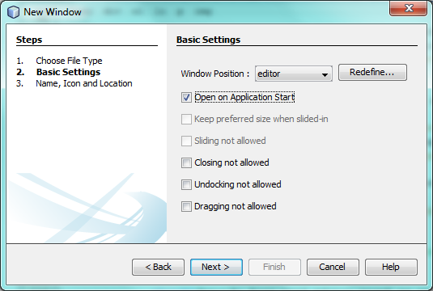
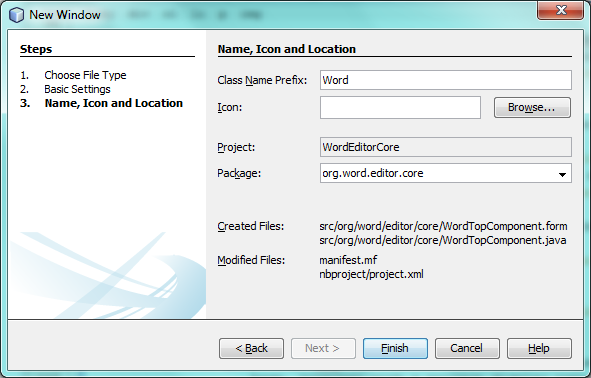
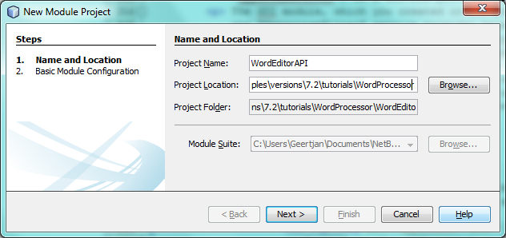

// 
//     Licensed to the Apache Software Foundation (ASF) under one
//     or more contributor license agreements.  See the NOTICE file
//     distributed with this work for additional information
//     regarding copyright ownership.  The ASF licenses this file
//     to you under the Apache License, Version 2.0 (the
//     "License"); you may not use this file except in compliance
//     with the License.  You may obtain a copy of the License at
// 
//       http://www.apache.org/licenses/LICENSE-2.0
// 
//     Unless required by applicable law or agreed to in writing,
//     software distributed under the License is distributed on an
//     "AS IS" BASIS, WITHOUT WARRANTIES OR CONDITIONS OF ANY
//     KIND, either express or implied.  See the License for the
//     specific language governing permissions and limitations
//     under the License.
//

= NetBeans Platform 7.2 Quick Start
:jbake-type: platform_tutorial
:jbake-tags: tutorials 
:jbake-status: published
:syntax: true
:source-highlighter: pygments
:toc: left
:toc-title:
:icons: font
:experimental:
:description: NetBeans Platform 7.2 Quick Start - Apache NetBeans
:keywords: Apache NetBeans Platform, Platform Tutorials, NetBeans Platform 7.2 Quick Start

Welcome to the  link:https://netbeans.apache.org/platform/[*NetBeans Platform*]!

The NetBeans Platform is a generic application framework primarily for Java desktop applications. The main benefit of the NetBeans Platform is its predefined modular architecture. Secondary benefits are the NetBeans Platform's reusable solutions such as its docking framework and its out-of-the-box pluggable components, in combination with the tools provided by its SDK, NetBeans IDE, in particular its award winning "Matisse" GUI Builder for designing GUI components.

In this quick start, you are introduced to the benefits and usages of modularity on the Java desktop via a very simple example, contributed by Thomas Würthinger, a PhD student at the Johannes Kepler University in Linz, Austria. Once you have grasped the concepts introduced in this quick start, you will be ready to step onto the  link:https://netbeans.apache.org/kb/docs/platform.html[NetBeans Platform Learning Trail], providing a very rich variety of tutorials for many different scenarios relating to the NetBeans Platform.

If you are new to the NetBeans Platform, it is highly recommended to watch the screencast series  link:https://netbeans.apache.org/tutorials/nbm-10-top-apis.html[Top 10 NetBeans APIs].

NOTE: This document uses NetBeans Platform 7.2 and NetBeans IDE 7.2. If you are using an earlier version, see  link:71/nbm-quick-start.html[the previous version of this document].

* Part 1: <<single,A Single Module NetBeans Platform Application>>
* Part 2: <<lookup,A Modular Application Using Lookup>>
* Part 3: <<listener,Publishing and Subscribing to the Lookup>>

NOTE:  Even though it is a separate product, there is no need to download the NetBeans Platform separately. Typically, you develop the application in NetBeans IDE and then exclude the modules that are specific to the IDE but that are superfluous to your application.

Do some background reading before diving into this tutorial. In particular, read the  link:http://bits.netbeans.org/dev/javadoc/org-openide-modules/org/openide/modules/doc-files/api.html[Modules API Reference] document, which explains what modules are and provides some context for this tutorial, while noting that there is an extensive Reference Material section on the  link:https://netbeans.apache.org/kb/docs/platform.html[NetBeans Platform Learning Trail].

== A Single Module NetBeans Platform Application

We start by creating a new NetBeans Platform application, containing a single module.

* <<application,Create the Application>>
* <<module,Create the Module>>
* <<window,Create the Window>>
* <<run,Running the Application>>

=== Create the Application

In this section, you create your first NetBeans Platform application.

[start=1]
1. Choose File | New Project and then choose NetBeans Modules. Select "NetBeans Platform Application". You should see this:

image::images/quickstart-platform_72_new-project-1.png[]

Click Next.

[start=2]
1. Name your new application "WordProcessor" and specify a folder on disk for storing it:

image::images/quickstart-platform_72_new-project-2.png[]

Click Finish. The new project appears as follows in the Projects window:

image::images/quickstart-platform_72_new-project-3.png[]

=== Create the Module

In this section, you create your first NetBeans Platform module.

[start=1]
1. Right-click the "Modules" node, shown in the screenshot above, and choose "Add New":

image::images/quickstart-platform_72_new-project-4.png[]

Name the new module "WordEditorCore":

image::images/quickstart-platform_72_new-project-5.png[]

Click Next.

[start=2]
1. Specify "org.word.editor.core" as the unique string identifying the module, which is its code name base, together with a project display name that will be shown in the Projects window.

image::images/quickstart-platform_72_new-project-6.png[]

Click Finish. The new module is created and its structure is shown in the Projects window:

image::images/quickstart-platform_72_new-project-7.png[]

=== Create the Window

In this section, you create your first NetBeans window.

[start=1]
1. Right-click the "WordEditorCore" module and choose New | Other. In the Module Development category, select "Window":

image::images/quickstart-platform_72_new-window-1.png[]

Click Next.

[start=2]
1. You should now see a dialog for specifying the position where the new window will appear in the application frame, as well as whether it will open automatically when the application starts, among other settings:

In the wizard step above, select "editor", which is the default central position within the application frame, and "Open on Application Start". Then click Next.

[start=3]
1. Set the class name prefix to "Word" and the package to "org.word.editor.core":

Click Finish. The new window is added to the source structure of your module:

image::images/quickstart-platform_72_new-window-4.png[]

[start=4]
1. Now double click on the file "WordTopComponent.java" to open it in the Design view of the "Matisse" GUI Builder. Use the Palette (Ctrl-Shift-8) to drag and drop a button and a text area onto the window:

image::images/quickstart-platform_72_new-window-5.png[]

Do the following to make the new GUI components meaningful:

* Right-click the text area, choose "Change Variable Name", and then name it "text". That is the name that will enable you to access the component from your code.
* Right-click the button, choose "Edit Text", and then set the text of the button to "Filter!"

[start=5]
1. Double click on the button, causing an event handling method to automatically be created in the Source editor. The method is called whenever the button is clicked. Change the body of the method to the following code.

[source,java]
----

private void jButton1ActionPerformed(java.awt.event.ActionEvent evt) {
   *String s = text.getText();
   s = s.toUpperCase();
   text.setText(s);*
}
----

=== Run the Application

In this section, you deploy the application.

[start=1]
1. Right-click the application and choose Run. Doing so will start up your new NetBeans Platform application and install your module. You will have a new window, as well as a new menu item for opening it, as shown below:

image::images/quickstart-platform_72_new-app-1.png[]

[start=2]
1. Enter a text in lowercase in the text area, and click "Filter!". You should see that the text is now shown in uppercase:

image::images/quickstart-platform_72_new-app-3.png[]

You have learned how to create a new NetBeans Platform application and how to add new modules to it. In the next section, you will be introduced to the NetBeans Platform's pluggable service infrastructure.

== A Modular Application Using Lookup

In this section, you create two additional modules. The first new module, "WordEditorAPI", contains a service provider interface. The second module, "UppercaseFilter", is a service provider for the interface.

The GUI module, which you created in the previous section, will be loosely coupled from the "UppercaseFilter" service provider because the GUI module will not refer to any code from the "UppercaseFilter" service provider. That will be possible because the "UppercaseFilter" service provider will be registered in the META-INF/services folder and loaded via the NetBeans Lookup class, which is comparable to the JDK 6 ServiceLoader class.

You will then create another loosely coupled service provider, named "LowercaseFilter".

* <<api,Create the API>>
* <<impl,Implement the API>>
* <<run2,Run the Application>>

=== Create the API

In this section, you create an API.

[start=1]
1. Expand the new application in the Projects window, right-click the Modules node, and choose "Add New":

image::images/quickstart-platform_72_new-api-1.png[]

Name the new module "WordEditorAPI":

Click Next. Use code name base "org.word.editor.api" and complete the wizard, which adds the module to your previously created application, as you did in the previous section:

image::images/quickstart-platform_72_new-api-3.png[]

[start=2]
1. Right-click the "WordEditorAPI" module and choose New | Java Interface. Name the Java interface "WordFilter", in the package "org.word.editor.api", and use the editor to define it as follows:

[source,java]
----

package org.word.editor.api;

public interface WordFilter {

    String process(String s);

}
----

[start=3]
1. Right-click the "WordEditorAPI" module, choose Properties, and use the "API Versioning" tab to specify that the package containing the interface should be available throughout the application:

image::images/quickstart-platform_72_new-api-4.png[]

Click OK.

In the Projects window, expand "Important Files" in the "WordEditorAPI" project and then double-click "Project Metadata". The "project.xml" file opens and you should see that the package has now been declared public:

[source,xml]
----

<?xml version="1.0" encoding="UTF-8"?>
<project xmlns="https://netbeans.org/ns/project/1">
    <type>org.netbeans.modules.apisupport.project</type>
    <configuration>
        <data xmlns="https://netbeans.org/ns/nb-module-project/3">
            <code-name-base>org.word.editor.api</code-name-base>
            <suite-component/>
            <module-dependencies/>
            *<public-packages>
                <package>org.word.editor.api</package>
            </public-packages>*
        </data>
    </configuration>
</project>
----

=== Implement the API

In this section, you implement the API, in a separate module.

[start=1]
1. Expand the new application in the Projects window, right-click the Modules node, and choose "Add New" again:

image::images/quickstart-platform_72_new-impl-1.png[]

Name the new module "UppercaseFilter":

image::images/quickstart-platform_72_new-impl-2.png[]

Click Next. Use code name base "org.word.editor.uppercase" and complete the wizard, which adds the module to your previously created application, as you did in the previous section:

image::images/quickstart-platform_72_new-impl-3.png[]

[start=2]
1. Right-click the Libraries node "UppercaseFilter" module, and Add Module Dependency, as shown below:

image::images/quickstart-platform_72_new-impl-4.png[]

Start typing the name of the API class and notice that the list narrows until the module containing the class is found:

image::images/quickstart-platform_72_new-impl-5.png[]

Click OK.

In the Projects window, expand "Important Files" in the "UppercaseFilter" project, and then double-click "Project Metadata". The "project.xml" file opens and you should see that a new dependency has been declared:

[source,xml]
----

<?xml version="1.0" encoding="UTF-8"?>
<project xmlns="https://netbeans.org/ns/project/1">
    <type>org.netbeans.modules.apisupport.project</type>
    <configuration>
        <data xmlns="https://netbeans.org/ns/nb-module-project/3">
            <code-name-base>org.word.editor.uppercase</code-name-base>
            <suite-component/>
            *<module-dependencies>
                <dependency>
                    <code-name-base>org.word.editor.api</code-name-base>
                    <build-prerequisite/>
                    <compile-dependency/>
                    <run-dependency>
                        <specification-version>1.0</specification-version>
                    </run-dependency>
                </dependency>
            </module-dependencies>*
            <public-packages/>
        </data>
    </configuration>
</project>
----

NOTE:  In the same way as shown above, set a dependency on the Lookup API module, which provides the @ServiceProvider annotation that you will use in the next step.

[start=3]
1. Because of the Lookup API dependency you defined above, you can now implement the interface defined in the WordEditorAPI module. Do so in the "UppercaseFilter" module, by creating a new class named "UppercaseFilter", in the "org.word.editor.uppercase" package, as shown below. Start by creating a new Java class, named "UppercaseFilter", and then define it as follows:

[source,java]
----

package org.word.editor.uppercase;

import org.openide.util.lookup.ServiceProvider;
import org.word.editor.api.WordFilter;

@ServiceProvider(service=WordFilter.class)
public class UppercaseFilter implements WordFilter {

    @Override
    public String process(String s) {
        return s.toUpperCase();
    }

}
----

At compile time, the @ServiceProvider annotation will create a META-INF/services folder with a file that registers your implementation of the WordFilter interface, following the JDK 6 ServiceLoader mechanism.

[start=4]
1. In the WordEditorCore module, the code that handles a click on the filter button now needs to be changed, so that all implementations of the interface "WordFilter" are located and loaded. When such implementations are found, you need to invoke its method to filter the text. Before we can do this, we need to add a dependency in the the "WordEditorCore" module on the "WordEditorAPI" module:

image::images/quickstart-platform_72_new-impl-6.png[]

Now, you can load implementations of the "WordFilter" class, as shown below:

[source,java]
----

private void jButton1ActionPerformed(java.awt.event.ActionEvent evt) {                                         
   *String enteredText = text.getText();
   Collection<? extends WordFilter> allFilters = Lookup.getDefault().lookupAll(WordFilter.class);
   StringBuilder sb = new StringBuilder();
   for (WordFilter textFilter : allFilters) {
      String processedText = textFilter.process(enteredText);
      sb.append(processedText).append("\n");
   }
   text.setText(sb.toString());*
}
----

The above could be achieved via the JDK 6 "ServiceLoader" class, except that the "Lookup" class can be used in JDK's prior to JDK 6. Aside from that, the "Lookup" class has a number of additional features, as the next section will illustrate.

=== Run the Application

In this section, you run the application again.

[start=1]
1. Now you can run the application again and check that everything works just as before. While the functionality is the same, the new modular design offers a clear separation between the GUI and the implementation of the filter. The structure of the application should be as shown below.

image::images/quickstart-platform_72_new-impl-7.png[]

[start=2]
1. The new application can also be extended quite easily, by adding new service providers to the application's classpath. As an exercise, add a new module that provides a "LowercaseFilter" implementation of the API to the application.

You have now used the default Lookup, that is, "Lookup.getDefault()", to load implementations of an interface from the META-INF/services folder.

== Publishing and Subscribing to the Lookup

In this section, we create a fourth module, which receives texts dynamically whenever we click the "Filter!" button in our first module.

* <<publish,Publish to the Lookup>>
* <<subscribe,Subscribe to the Lookup>>

=== Publish to the Lookup

In this section, you publish a String into the Lookup of the TopComponent. Whenever the TopComponent is selected, the String is published into the application's context.

[start=1]
1. In the "WordEditorCore" module, we publish a String whenever the user clicks the "Filter!" button. To do so, change the constructor of the "WordTopComponent" as follows:*private  link:http://bits.netbeans.org/dev/javadoc/org-openide-util-lookup/org/openide/util/lookup/InstanceContent.html[InstanceContent] content;*

[source,java]
----

private WordTopComponent() {
    initComponents();
    setName(Bundle.CTL_WordTopComponent());
    setToolTipText(Bundle.HINT_WordTopComponent());
    *content = new InstanceContent();
link:http://bits.netbeans.org/dev/javadoc/org-openide-windows/org/openide/windows/TopComponent.html#associateLookup(org.openide.util.Lookup)[associateLookup](new  link:http://bits.netbeans.org/dev/javadoc/org-openide-util-lookup/org/openide/util/lookup/AbstractLookup.html[AbstractLookup](content));*
}
----

[start=2]
1. Change the code of the filter button so that the entered text is added to the  ``InstanceContent``  object when the button is clicked.

[source,java]
----

private void jButton1ActionPerformed(java.awt.event.ActionEvent evt) {                                         
   String enteredText = text.getText();
   Collection<? extends WordFilter> allFilters = Lookup.getDefault().lookupAll(WordFilter.class);
   StringBuilder sb = new StringBuilder();
   for (WordFilter textFilter : allFilters) {
      String processedText = textFilter.process(enteredText);
      sb.append(processedText).append("\n");
      *content.add(enteredText);*
   }
   text.setText(sb.toString());
}
----

=== Subscribe to the Lookup

In this section, you create a new module, with a new window. In the new window, you listen to the application's context for Strings. When there is a new String in the Lookup, you display it in the window.

[start=1]
1. In the same way as done in the previous sections, create another module in your application and name it "WordHistory". Use code name base "org.word.editor.history".

[start=2]
1. In the WordHistory module, right-click the "org.word.editor.history" package and choose New | Window. Use the New Window wizard to create a new window component that will automatically be opened on the left side of the application frame, which is the "explorer" position:

image::images/quickstart-platform_72_new-window2-1.png[]

Click Next. Use prefix "WordHistory" and specify that the new window will be stored in the "org.word.editor.history" package. Click Finish.

[start=3]
1. Once you have created the window, add a  ``JTextArea``  to it:

image::images/quickstart-platform_72_new-window2-2.png[]

Change the variable name of the text area to "historyText".

[start=4]
1. In the Source view, add code to the constructor of the HistoryTopComponent class so that it listens to the lookup of the  ``String``  class of the current active window. It displays all retrieved  ``String``  objects in the text area:

[source,java]
----

...
...
...
public final class HistoryTopComponent extends TopComponent *implements LookupListener* {

    *private org.openide.util.Lookup.Result<String> result;*

    ...
    ...
    ...

    *@Override
    public void componentOpened() {
        result = org.openide.util.Utilities.actionsGlobalContext().lookupResult(String.class);
        result.addLookupListener(this);
    }

    @Override
    public void componentClosed() {
        result.removeLookupListener(this);
    }

    @Override
    public void resultChanged(LookupEvent le) {
        Collection<? extends String> allStrings = result.allInstances();
        StringBuilder sb = new StringBuilder();
        for (String string : allStrings) {
            sb.append(string).append("\n");
        }
        historyText.setText(sb.toString());
    }*

    ...
    ...
    ...
                        
----

[start=5]
1. Then you can start the application and experiment with it. The result should look similar to that shown in the screenshot below:

image::images/quickstart-platform_72_new-result-1.png[]

As an exercise, redesign the user interface of the "WordTopComponent" in such a way that a  ``JList``  displays the filters.

Congratulations! At this stage, with very little coding, you have created a small example of a loosely-coupled modular application:

image::images/quickstart-platform_72_new-result-2.png[]

Two important concepts have been covered in this tutorial.

[start=1]
1. The application consists of four modules. Code from one module can only be used by another module if (1) the first module explicitly exposes packages and (2) the second module sets a dependency on the first module. In this way, the NetBeans Platform helps to organize your code in a strict modular architecture, ensuring that code isn't reused randomly but only when there are contracts set between the modules that provide the code.

[start=2]
1. Secondly, the  ``Lookup``  class has been introduced as a mechanism for communicating between modules, as an extension of the JDK 6 ServiceLoader approach. Implementations are loaded via their interfaces. Without using any code from an implementation, the "WordEditorCore" module is able to display the service provided by the implementor. Loose coupling is provided to NetBeans Platform applications in this way.

To continue learning about modularity and the NetBeans Platform, head on to the four-part "NetBeans Platform Selection Management" series,  link:https://netbeans.apache.org/tutorials/nbm-selection-1.html[which starts here]. After that, get started with the  link:https://netbeans.apache.org/kb/docs/platform.html[NetBeans Platform Learning Trail], choosing the tutorials that are most relevant to your particular business scenario. Also, whenever you have questions about the NetBeans Platform, of any kind, feel free to write to the mailing list, dev@platform.netbeans.org; its related archive  link:https://mail-archives.apache.org/mod_mbox/netbeans-dev/[is here].

Have fun with the NetBeans Platform and see you on the mailing list!

