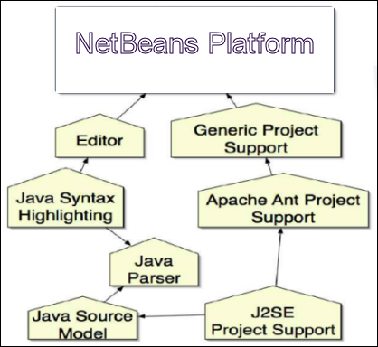

// 
//     Licensed to the Apache Software Foundation (ASF) under one
//     or more contributor license agreements.  See the NOTICE file
//     distributed with this work for additional information
//     regarding copyright ownership.  The ASF licenses this file
//     to you under the Apache License, Version 2.0 (the
//     "License"); you may not use this file except in compliance
//     with the License.  You may obtain a copy of the License at
// 
//       http://www.apache.org/licenses/LICENSE-2.0
// 
//     Unless required by applicable law or agreed to in writing,
//     software distributed under the License is distributed on an
//     "AS IS" BASIS, WITHOUT WARRANTIES OR CONDITIONS OF ANY
//     KIND, either express or implied.  See the License for the
//     specific language governing permissions and limitations
//     under the License.
//

= Plataforma do Editor HTML NetBeans
:jbake-type: platform_tutorial
:jbake-tags: tutorials 
:jbake-status: published
:syntax: true
:source-highlighter: pygments
:toc: left
:toc-title:
:icons: font
:experimental:
:description: Plataforma do Editor HTML NetBeans - Apache NetBeans
:keywords: Apache NetBeans Platform, Platform Tutorials, Plataforma do Editor HTML NetBeans

Este tutorial oferece uma introdução simples e rápida ao fluxo de trabalho da Plataforma NetBeans, orientando você na criação de um editor HTML simples. Embora simples, o Editor de HTML criado será muito desenvolvido porque reutilizará a infraestrutura fornecida pela Plataforma NetBeans. Por exemplo, sem qualquer código, o Editor de HTML terá um sistema de janela desenvolvido. Após concluir este tutorial, você terá adquirido um conhecimento geral sobre como criar, construir e executar aplicativos da Plataforma NetBeans.

Após concluir este tutorial, é possível passar para a  link:https://netbeans.apache.org/kb/docs/platform_pt_BR.html[trilha do aprendizado da plataforma NetBeans]. A trilha do aprendizado fornece tutoriais abrangentes que destacam uma ampla gama de APIs do NetBeans para uma variedade de tipos de aplicativos. Se não desejar criar um aplicativo "Hello world", ignore este tutorial e vá direito para a trilha do aprendizado.

NOTE: este documento usa o NetBeans IDE 6.7. Se você estiver utilizando uma versão anterior, veja  link:61/nbm-htmleditor_pt_BR.html[a versão 6.1 deste documento]. Se for o seu primeiro contato com a plataforma NetBeans, recomenda-se trabalhar com o  link:nbm-quick-start_pt_BR.html[Início rápido da plataforma NetBeans] antes de continuar com este tutorial. Se, em vez de aprender como criar um aplicativo para a Plataforma NetBeans, você quiser aprender como criar um plug-in do NetBeans, consulte  link:nbm-google_pt_BR.html[Introdução ao plug-in do NetBeans].

Opcionalmente, para fins de solução de problemas, é possível  link:http://plugins.netbeans.org/PluginPortal/faces/PluginDetailPage.jsp?pluginid=6635[baixar a amostra completa] e inspecionar os códigos-fonte.

No fim deste tutorial, você terá um Editor HTML que se parece com este:

image::images/htmleditor_html-editor-65.png[]

NOTE:  embora seja um aplicativo demonstrativo muito simples, ele não é um brinquedo! É um programa _real_ que dá suporte à edição fácil de páginas HTML, com recursos como autocompletar de código, validação e fragmentos de código HTML predefinidos.

O Editor HTML que você cria neste tutorial é uma aplicação rich-client concluída "sobre a Plataforma NetBeans". Isso significa que o núcleo do IDE, que _é_ a Plataforma NetBeans, será a base de seu aplicativo. Sobre a Plataforma NetBeans, adicione os módulos necessários e exclui aqueles de que o IDE precisa mas que a sua aplicação não. Aqui você vê alguns dos módulos do IDE, adicionados à Plataforma NetBeans, que é a sua base:

Criar esse Editor HTML significa gerar um esqueleto de aplicação, excluindo os módulos e os itens de interface do usuário que não são necessários e, em seguida, definir a janela Favoritos como a janela que será aberta por padrão quando o IDE se iniciar. Todas essas atividades são suportadas pelos elementos de interface do usuário no IDE.

Você verá por si mesmo como é simples e fácil construir, ou para ser mais preciso, _montar_ uma aplicação completa sobre a Plataforma NetBeans. No fim, é mostrado como tornar o produto final facilmente baixável e iniciável utilizando o WebStart.

NOTE:  embora seja um produto separado, não é necessário baixar a Plataforma NetBeans separadamente por causa deste tutorial. Você desenvolverá a aplicação rich-client no IDE e, em seguida, excluirá os módulos que são específicos do IDE, mas que são supérfluos para a sua aplicação.

== Gerando a aplicação de esqueleto

Ao criar um aplicativo na Plataforma NetBeans, o primeiro passo é criar um projeto de aplicativo da Plataforma NetBeans. O projeto de Aplicativo da plataforma NetBeans padrão inclui _todos_ os módulos incluídos na Plataforma NetBeans, assim como _todos_ os módulos incluídos no NetBeans IDE. Já que não precisamos de todos esses módulos, excluiremos os que não são necessários.

[start=1]
1. Utilizando o assistente para Novo projeto (Ctrl-Shift-N), crie um projeto de aplicativo da Plataforma NetBeans a partir do modelo na categoria de módulos do NetBeans, como mostrado abaixo:

image::images/htmleditor_new-nb-app-wiz-65.png[]

Clique em Próximo e nomeie o projeto de aplicativo da Plataforma NetBeans como "NetBeansHTMLEditor". Clique em Terminar.

[start=2]
1. Clique com o botão direito do mouse no nó do projeto, escolha Propriedades e, em seguida, faça algumas alterações na caixa de diálogo Propriedades do projeto de aplicativo da Plataforma NetBeans:
* No painel Construir, certifique-se de que o botão de seleção "Criar aplicativo independente" esteja marcado para especificar que será um aplicativo rich-client da Plataforma NetBeans.

Verifique se você gosta do nome da marca do executável e do título do aplicativo da barra de título, como mostrado abaixo:

image::images/htmleditor_html-editor-prop-1-65.png[]
* No painel Tela de abertura, observe que é possível fornecer a tela de splash do aplicativo e as identificações de marca da barra de andamento, como mostrado abaixo: 
image::images/htmleditor_html-editor-prop-2-65.png[]

NOTE:  Se você não tiver uma tela de splash, use  link:images/htmleditor_splash.gif[esta]

.

[start=3]
1. No painel Bibliotecas da caixa de diálogo Propriedades do projeto, você vê uma lista de "clusters". Um cluster é uma coleção de módulos relacionados. Os únicos clusters que precisam ser selecionados são  ``ide11``  e  ``platform11`` , como mostrado abaixo:

image::images/htmleditor_libraries-cust-1.png[]

A seguir, clique no botão "Resolver" e os módulos necessários serão adicionados ao conjunto de módulos necessário para que os módulos já selecionados façam parte do aplicativo. O botão "Resolver" desaparece e as mensagens de erro em vermelho não deveriam continuar aparecendo:

image::images/htmleditor_libraries-cust-2.png[]

Agora, você possui o subconjunto de módulos do NetBeans que são relevantes ao Editor de HTML. Entretanto, embora você precise dos módulos que possui agora, provavelmente não precisa de todos os elementos de interface de usuário que esses módulos fornecem. Nas próximas seções, você gerará ajustar a interface do usuário e personalizar o layout da janela especificamente para o Editor de HTML que está criando.

== Otimizando a interface de usuário

É possível manter ou rejeitar o quanto desejar da interface do usuário que os módulos selecionados fornecerem. Por exemplo, seu editor HTML provavelmente não precisa de um ou todos os itens do menu Ferramentas. Semelhantemente, talvez haja barras de ferramentas ou botões da barra de ferramentas que não sejam necessários. Nesta seção, você remove a interface de usuário do IDE até que haja um subconjunto que seja útil para o seu aplicativo rich-client.

[start=1]
1. Expanda o projeto de aplicativo da Plataforma NetBeans, clique com o botão direito do mouse no nó Módulos e escolha Adicionar novo, como mostrado abaixo:

image::images/htmleditor_add-module-61.png[]

O Assistente de novo projeto (Ctrl+Shift+N) aparece. Nomeie o projeto como  ``BrandingModule``  e clique em Próximo.

[start=2]
1. No campo Nome de base de código, digite  ``org.netbeans.brandingmodule`` .

[start=3]
1. Clique em "Gerar camada XML" e, em seguida, clique em Terminar.

[start=4]
1. No módulo de identificação de marca, expanda o nó  ``layer.xml`` . Dois subnós são expostos:

image::images/htmleditor_expanded-xml-layer-61.png[]

[start=5]
1. No nó  ``<esta camada em contexto>`` , o IDE mostra uma visualização mesclada de todas as pastas e arquivo que todos os módulos registram em suas camadas. Para excluir os itens, é possível clicar com o botão direito do mouse neles e escolher 'Excluir', como mostrado abaixo:

image::images/htmleditor_this-layer-in-context-61.png[]

O IDE adiciona marcas ao arquivo  ``layer.xml``  do módulo que, quando o módulo é instalado, oculta os itens que você excluiu. Por exemplo, clicando com o botão direito do mouse em  ``Barra de menus/Editar`` , é possível remover itens de menu Editar que não são necessários para o Editor HTML. Fazendo isso, trechos de código são gerados como o seguinte no arquivo  ``layer.xml`` :

[source,xml]
----

<folder name="Menu">
    <folder name="Edit">
        <file name="org-netbeans-modules-editor-MainMenuAction$StartMacroRecordingAction.instance_hidden"/>
        <file name="org-netbeans-modules-editor-MainMenuAction$StopMacroRecordingAction.instance_hidden"/>
    </folder>       
</folder>
----

O resultado do trecho de código acima é que as ações  ``Iniciar gravação de macro``  e  ``Parar gravação de macro``  fornecidas por outro módulo são removidas do menu por seu módulo de marca. Para mostrá-las novamente, simplesmente exclua as marcas acima do arquivo  ``layer.xml`` .

[start=6]
1. Utilize a abordagem descrita na etapa anterior para ocultar as barras de ferramentas, os botões da barra de ferramentas, os menus e os itens de menu que você desejar. Quando este estágio estiver concluído, observe o arquivo  ``layer.xml`` . Quando fizer isso, verá algo similar ao seguinte, dependendo dos itens que tenha excluído:

[source,xml]
----

<?xml version="1.0" encoding="UTF-8"?>
<!DOCTYPE filesystem PUBLIC "-//NetBeans//DTD Filesystem 1.1//EN" "https://netbeans.org/dtds/filesystem-1_1.dtd">
<filesystem>
    <folder name="Menu">
        <file name="BuildProject_hidden"/>
        <folder name="File">
            <file name="Separator2.instance_hidden"/>
            <file name="SeparatorNew.instance_hidden"/>
            <file name="SeparatorOpen.instance_hidden"/>
            <file name="org-netbeans-modules-project-ui-CloseProject.shadow_hidden"/>
            <file name="org-netbeans-modules-project-ui-CustomizeProject.shadow_hidden"/>
            <file name="org-netbeans-modules-project-ui-NewFile.shadow_hidden"/>
            <file name="org-netbeans-modules-project-ui-NewProject.shadow_hidden"/>
            <file name="org-netbeans-modules-project-ui-OpenProject.shadow_hidden"/>
            <file name="org-netbeans-modules-project-ui-RecentProjects.shadow_hidden"/>
            <file name="org-netbeans-modules-project-ui-SetMainProject.shadow_hidden"/>
            <file name="org-netbeans-modules-project-ui-groups-GroupsMenu.shadow_hidden"/>
        </folder>
        <file name="Refactoring_hidden"/>
        <file name="RunProject_hidden"/>
        <folder name="Window">
            <file name="ViewRuntimeTabAction.shadow_hidden"/>
            <file name="org-netbeans-modules-project-ui-logical-tab-action.shadow_hidden"/>
            <file name="org-netbeans-modules-project-ui-physical-tab-action.shadow_hidden"/>
        </folder>
    </folder>
</filesystem>
----

== Otimizando o layout da janela

utilizando o nó  ``<esta camada em contexto>`` , é possível não somente excluir itens existentes, mas também alterar seus conteúdo. Por exemplo, o Editor HTML trabalha em arquivos HTML, sendo assim, ao contrário do IDE regular que trabalha com arquivos-fonte Java e projetos, faz sentido mostrar a janela  ``Favoritos``  no layout inicial.

A definição do layout da janela também é descrita como arquivos em camadas, tudo armazenado na pasta  ``Janelas2`` . Os arquivos na pasta  ``Janelas2``  são arquivos XML pseudo-legíveis por humanos definidos pelas  link:http://bits.netbeans.org/dev/javadoc/org-openide-windows/org/openide/windows/doc-files/api.html[APIs do sistema de janelas]. Eles são complexos mas a boa notícia é que, para fins do nosso Editor HTML, não é necessário compreendê-los completamente, como mostrado abaixo.

[start=1]
1. No seu nó  ``<esta camada em contexto>``  do módulo de marca, consulte  ``Windows2/Components``  e  ``Windows2/Modes``  para ver os dois arquivos realçados abaixo e denominados "favorites.settings" e "favorites.wstcref":

image::images/htmleditor_find-favorites2-61.png[]

O primeiro arquivo define a aparência do componente e como ele é criado. Como o componente não precisa ser alterado, não é necessário modificar o arquivo. O segundo é mais interessante para os seus propósitos, ele contém o seguinte:

[source,xml]
----

<tc-ref version="2.0">
    <module name="org.netbeans.modules.favorites/1" spec="1.1" />
    <tc-id id="favorites" />
    <state opened="false" />
</tc-ref>
----

[start=2]
1. Embora a maior parte do XML seja criptografada, existe uma linha que parece promissora: sem precisar ler nenhum tipo de documentação, é provável que alterar  ``false``  para  ``true``  tornará o componente aberto por padrão. Faça isso agora.

[start=3]
1. De forma semelhante, é possível alterar o arquivo  ``CommonPalette.wstcref``  para que a paleta de componentes se abra por padrão.

Agora é possível ver que o seu módulo de marca contém um novo arquivo, um para cada um dos arquivos que foram alterados. De fato, esses arquivos substituem aqueles que foram encontrados nas etapas anteriores. Esses arquivos foram registrados automaticamente no arquivo  ``layer.xml``  do módulo.

== Otimizando a janela Favoritos

Na subpasta de uma pasta de  ``marca``  projeto de aplicativo da Plataforma NetBeans, que esteja visível na janela Arquivos, é possível substituir as strings definidas nos códigos-fonte do NetBeans. Nesta seção, você substituirá as strings que definem os rótulos utilizados na janela Favoritos. Por exemplo, alteraremos o rótulo "Favoritos" para "Arquivos HTML", pois usaremos essa janela especificamente para arquivos HTML.

[start=1]
1. Abra a janela Arquivos e expanda a pasta de  ``marca``  do projeto de aplicativo da Plataforma NetBeans.

[start=2]
1. Crie uma nova estrutura de pastas em  ``marca/módulos`` . (No IDE, você pode criar pastas clicando com o botão direito do mouse em uma pasta e escolhendo Nova | Outro e depois escolhendo Pasta da categoria Outro). A nova pasta deve se chamar  ``org-netbeans-modules-favorites.jar`` . Dentro dessa pasta, crie uma hierarquia de pastas  ``org/netbeans/módulos/favoritos`` . Dentro da pasta final, por exemplo,  ``favoritos`` , crie um novo arquivo  ``Bundle.properties`` :

image::images/htmleditor_favorites-branding-61a.png[]

Essa estrutura de pastas e arquivo de propriedades correspondem à estrutura de pastas nos códigos-fonte do NetBeans relacionados à janela Favoritos.

[start=3]
1. Adicione as strings mostradas na captura de tela abaixo para substituir as mesmas strings definidas no arquivo de propriedades correspondentes nos códigos-fonte da janela Favoritos:

image::images/htmleditor_favorites-branding-61b.png[]

Para simplificar esta etapa, copie e cole as strings definidas acima:

[source,java]
----

Favorites=HTML Files
ACT_AddOnFavoritesNode=&amp;Find HTML Files...
ACT_Remove=&amp;Remove from HTML Files List
ACT_View=HTML Files
ACT_Select=HTML Files
ACT_Select_Main_Menu=Select in HTML Files List

# JFileChooser
CTL_DialogTitle=Add to HTML Files List
CTL_ApproveButtonText=Add
ERR_FileDoesNotExist={0} does not exist.
ERR_FileDoesNotExistDlgTitle=Add to HTML Files List
MSG_NodeNotFound=The document node could not be found in the HTML Files List.
----

Depois, quando você iniciar o aplicativo, verá que os textos e rótulos na janela Favoritos foram alterados para os listados acima. Isso ilustra que é possível pegar um componente da Plataforma NetBeans e marcá-lo para atender as suas necessidades.

== Executando o aplicativo

Executar o seu aplicativo é tão simples quanto clicar com o botão direito do mouse no nó do projeto e escolher um item de menu.

[start=1]
1. Clique com o botão direito do mouse no nó do projeto do aplicativo e escolha Limpar e Construir tudo.

[start=2]
1. Clique com o botão direito do mouse no nó do projeto de aplicativo e escolha Executar:

[start=3]
1. Depois que a aplicação é implantada, é possível clicar com o botão direito do mouse dentro da janela Favoritos e escolher uma pasta contendo arquivos HTML e, em seguida, abrir um arquivo HTML, como mostrado abaixo:

image::images/htmleditor_html-editor-65.png[]

Você agora possui um Editor HTML completo, em funcionamento, que foi criado sem digitar uma única linha de código Java.

== Distribuindo o aplicativo

Escolha uma das duas abordagens para distribuir o aplicativo. Se você desejar manter o máximo controle possível sobre o aplicativo, utilize o web start (JNLP) para distribuir o aplicativo na Web. Neste cenário, sempre que você desejar atualizar o aplicativo, gerará fazer isso localmente e permitir que os usuários finais saibam sobre a atualização, que estará disponível automaticamente para eles na próxima vez que iniciarem o aplicativo na Web. Alternativamente, distribua um arquivo ZIP contendo seu aplicativo. Os usuários finais terão, assim, o aplicativo completo localmente disponível. Distribua então as atualizações e os novos recursos através do mecanismo de atualização, descrito abaixo.

=== Distribuindo o aplicativo através de um arquivo ZIP

Para estender seu aplicativo, é necessário permitir que os usuários instalem módulos para aprimorar a funcionalidade do aplicativo. Para isso, seu aplicativo já está incorporando o Gerenciador de plug-in.

[start=1]
1. Escolha o item de menu Ferramentas | Plug-ins e instale alguns plug-ins úteis para o editor HTML. Navegue no  link:http://plugins.netbeans.org/PluginPortal/[Portal plug-in] para localizar alguns que sejam adequados. É desta mesma forma que os usuários finais atualizarão sua instalação local do aplicativo.

[start=2]
1. Clique com o botão direito do mouse no nó do projeto do aplicativo e escolha Construir distribuição de ZIP.

[start=3]
1. Na pasta  ``dist``  (visível na janela Arquivos), agora deve ser possível visualizar um arquivo ZIP que pode ser expandido para exibição de seu conteúdo:

image::images/htmleditor_unzipped-app-61.png[]

NOTE:  o iniciador do aplicativo é criado na pasta  ``bin`` , como mostrado acima.

=== Distribuindo o editor HTML por meio do Repositório Web Start compartilhado do NetBeans

Em vez de distribuir um arquivo ZIP, vamos nos preparar para uma distribuição webstart ao efetuar o ajuste fino do arquivo  ``master.jnlp``  que é gerado na primeira vez em que o aplicativo é iniciado através de "Executar aplicativo JNLP". Embora ele faça o trabalho, ele não está pronto para distribuição. É necessário, pelo menos, alterar a seção de informações para fornecer melhores descrições e ícones.

Outra alteração na infraestrutura JNLP padrão é o uso de um repositório JNLP compartilhado em www.netbeans.org. Como padrão, o aplicativo JNLP gerado para um conjunto sempre contém todos os seus módulos, assim como os módulos do qual depende. Isso pode ser útil para uso de intranet, mas é um pouco menos prático para uso amplo na Internet. Na Internet, é muito melhor se todos os aplicativos construídos na Plataforma NetBeans se referirem a um repositório de módulos do NetBeans, o que significa que tais módulos são compartilhados e não precisam ser baixados mais de uma vez.

Existe um repositório como tal para NetBeans 6.1. Ele não contém todos os módulos que o NetBeans IDE possui, mas ele contém o suficiente para criar aplicativos não-IDE como o nosso editor HTML. Para utilizar o repositório, é necessário somente modificar  ``platform.properties``  adicionando a URL correta:

[source,java]
----

# compartilhe as bibliotecas do repositório comum no netbeans.org # este URL é para os arquivos JNLP versão65 JNLP:
jnlp.platform.codebase=http://bits.netbeans.org/6.5/jnlp/

----

Assim que o aplicativo é iniciado como um aplicativo JNLP, todos os seus módulos de plug-in compartilhados são carregados a partir de netbeans.org e compartilhados com os aplicativos que fazem o mesmo.

link:http://netbeans.apache.org/community/mailing-lists.html[Envie-nos seus comentários]

== Veja também

Isto conclui o tutorial do Editor HTML do NetBeans. Para obter mais informações sobre a criação e o desenvolvimento de aplicativos na Plataforma NetBeans, consulte os seguintes recursos:

*  link:https://netbeans.apache.org/kb/docs/platform_pt_BR.html[Outros tutoriais relacionados]
*  link:https://bits.netbeans.org/dev/javadoc/[Javadoc da API da NetBeans ]
