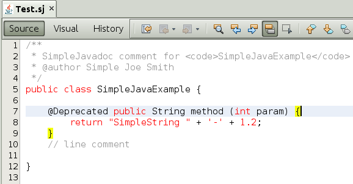

// 
//     Licensed to the Apache Software Foundation (ASF) under one
//     or more contributor license agreements.  See the NOTICE file
//     distributed with this work for additional information
//     regarding copyright ownership.  The ASF licenses this file
//     to you under the Apache License, Version 2.0 (the
//     "License"); you may not use this file except in compliance
//     with the License.  You may obtain a copy of the License at
// 
//       http://www.apache.org/licenses/LICENSE-2.0
// 
//     Unless required by applicable law or agreed to in writing,
//     software distributed under the License is distributed on an
//     "AS IS" BASIS, WITHOUT WARRANTIES OR CONDITIONS OF ANY
//     KIND, either express or implied.  See the License for the
//     specific language governing permissions and limitations
//     under the License.
//

= JavaCC Parser Generator Integration Tutorial for NetBeans Platform 7.1
:jbake-type: platform_tutorial
:jbake-tags: tutorials 
:jbake-status: published
:syntax: true
:source-highlighter: pygments
:toc: left
:toc-title:
:icons: font
:experimental:
:description: JavaCC Parser Generator Integration Tutorial for NetBeans Platform 7.1 - Apache NetBeans
:keywords: Apache NetBeans Platform, Platform Tutorials, JavaCC Parser Generator Integration Tutorial for NetBeans Platform 7.1

This tutorial shows you how to generate a parser with  link:https://javacc.github.io/javacc//[JavaCC] and use it to create features in a NetBeans editor.

NOTE:  Prior to starting to work on this tutorial, you must have completed the  link:nbm-javacc-lexer.html[JavaCC Lexer Generator Integration Tutorial], since that tutorial shows how to create the module structure and file type used in the instructions that follow.

You will learn how to create several features in a NetBeans editor, based on your JavaCC parser, such as a syntax error parser, as shown below:

image::images/javacc_71_result.png[]

* Implementing New Features

This tutorial is the official version of the second part of  link:http://wiki.netbeans.org/How_to_create_support_for_a_new_language[http://wiki.netbeans.org/How_to_create_support_for_a_new_language], which, aside from being a rough draft, is partly obsolete and out of date for NetBeans Platform 7.1.

== Generating a Parser from JavaCC

Let's now use JavaCC to generate a parser, in the same way as we generated a lexer in the  link:nbm-javacc-lexer.html[JavaCC Lexer Generator Integration Tutorial]. We'll need to edit the JavaCC grammar file less than we did in the previous tutorial, since we're not going to remove the parser generator as we did last time.

[start=1]
1. Create a new package named  ``org.simplejava.jccparser``  in your project. Copy into the new package the same two files mentioned in the previous tutorial:

* /myjavacc40/examples/JavaGrammars/1.5/Java1.5.jj
* /myjavacc40/examples/JavaGrammars/1.5/Token.java

In your project structure, you should now see your two new files:

image::images/javacc_71_parser-1.png[]

NOTE:  As before, the  ``Token``  class does not yet compile because the class it references,  ``JavaParserConstants`` , does not yet exist. It will be generated at the end of this section of the tutorial by JavaCC and at that stage the  ``Token``  class will compile.

We're now going to tweak the  ``Java1.5.jj``  file so that it fits our specific needs.

[start=2]
1. Firstly, we need to make sure that the classes that JavaCC will generate for us will be generated into the correct package, that is, the package where we copied the two files above. Add "package org.simplejava.jccparser;" to  ``Java1.5.jj``  file after the "PARSER_BEGIN(JavaParser)" line, so that the files will be generated in the correct package:

[source,java]
----

PARSER_BEGIN(JavaParser)

*package org.simplejava.jccparser;*

import java.io.*;
----

[start=3]
1. The  ``Java1.5.jj``  file is ready now and we can "compile" it from the command line:

[source,java]
----

cd /myprojects/simplejava/src/org/simplejava/jccparser /myjavacc40/bin/javacc Java1.5.jj
----

The result should be as follows:

image::images/javacc_71_parser-2.png[]

As you can see, JavaCC has generated the following files:

* JavaCharStream.java
* JavaParser.java
* JavaParserConstants.java
* JavaParserTokenManager.java
* ParseException.java
* TokenMgrError.java

All the files should be compilable, that is, there should be no error marks anywhere in the module, as can be seen in the screenshot above.

You've now completed the JavaCC part of the tutorial. The time has come to use the generated files to extend your NetBeans Lexer plugin.

== Integrating the JavaCC Parser with NetBeans APIs

In this section, we take the files generated in the previous section and integrate them with the  link:http://bits.netbeans.org/dev/javadoc/org-netbeans-modules-parsing-api/overview-summary.html[NetBeans Parsing API].

[start=1]
1. In the Projects window, right-click the Libraries node, and choose Add Module Dependency. Look for the "Parsing API" module in the list. When you click OK, you should see the "Parsing API" module is now a dependency in your module:

image::images/javacc_71_parser-4.png[]

[start=2]
1. In your module, create a new package named  ``org.simplejava.parser`` .

[start=3]
1. The first NetBeans APIclass you need to implement is  `` link:http://bits.netbeans.org/dev/javadoc/org-netbeans-modules-parsing-api/org/netbeans/modules/parsing/spi/Parser.html[org.netbeans.modules.parsing.spi.Parser]`` . Create a class named  ``SJParser``  and define it as follows:

[source,java]
----

package org.simplejava.parser;

import java.io.Reader;
import java.io.StringReader;
import java.util.logging.Level;
import java.util.logging.Logger;
import javax.swing.event.ChangeListener;
import  link:http://bits.netbeans.org/dev/javadoc/org-netbeans-modules-parsing-api/org/netbeans/modules/parsing/api/Snapshot.html[org.netbeans.modules.parsing.api.Snapshot];
import  link:http://bits.netbeans.org/dev/javadoc/org-netbeans-modules-parsing-api/org/netbeans/modules/parsing/api/Task.html[org.netbeans.modules.parsing.api.Task];
import  link:http://bits.netbeans.org/dev/javadoc/org-netbeans-modules-parsing-api/org/netbeans/modules/parsing/spi/Parser.html[org.netbeans.modules.parsing.spi.Parser];
import  link:http://bits.netbeans.org/dev/javadoc/org-netbeans-modules-parsing-api/org/netbeans/modules/parsing/spi/ParserResultTask.html[org.netbeans.modules.parsing.spi.Parser.Result];
import  link:http://bits.netbeans.org/dev/javadoc/org-netbeans-modules-parsing-api/org/netbeans/modules/parsing/spi/SourceModificationEvent.html[org.netbeans.modules.parsing.spi.SourceModificationEvent];
import org.simplejava.jccparser.JavaParser;

public class SJParser extends  link:http://bits.netbeans.org/dev/javadoc/org-netbeans-modules-parsing-api/org/netbeans/modules/parsing/spi/Parser.html[Parser] {

    private Snapshot snapshot;
    private JavaParser javaParser;

    @Override
    public void parse (Snapshot snapshot, Task task, SourceModificationEvent event) {
        this.snapshot = snapshot;
        Reader reader = new StringReader(snapshot.getText().toString ());
        javaParser = new JavaParser(reader);
        try {
            javaParser.CompilationUnit ();
        } catch (org.simplejava.jccparser.ParseException ex) {
            Logger.getLogger (SJParser.class.getName()).log (Level.WARNING, null, ex);
        }
    }

    @Override
    public Result getResult (Task task) {
        return new SJParserResult (snapshot, javaParser);
    }

    @Override
    public void cancel () {
    }

    @Override
    public void addChangeListener (ChangeListener changeListener) {
    }

    @Override
    public void removeChangeListener (ChangeListener changeListener) {
    }

    
    public static class SJParserResult extends Result {

        private JavaParser javaParser;
        private boolean valid = true;

        SJParserResult (Snapshot snapshot, JavaParser javaParser) {
            super (snapshot);
            this.javaParser = javaParser;
        }

        public JavaParser getJavaParser () throws org.netbeans.modules.parsing.spi.ParseException {
            if (!valid) throw new org.netbeans.modules.parsing.spi.ParseException ();
            return javaParser;
        }

        @Override
        protected void invalidate () {
            valid = false;
        }

    }
    
}
----

[start=4]
1. The next class you need to implement is  `` link:http://bits.netbeans.org/dev/javadoc/org-netbeans-modules-parsing-api/org/netbeans/modules/parsing/spi/ParserFactory.html[org.netbeans.modules.parsing.spi.ParserFactory]`` . Create a class named  ``SJParserFactory``  and define it as follows:

[source,java]
----

package org.simplejava.parser;

import java.util.Collection;
import  link:http://bits.netbeans.org/dev/javadoc/org-netbeans-modules-parsing-api/org/netbeans/modules/parsing/api/Snapshot.html[org.netbeans.modules.parsing.api.Snapshot];
import  link:http://bits.netbeans.org/dev/javadoc/org-netbeans-modules-parsing-api/org/netbeans/modules/parsing/spi/Parser.html[org.netbeans.modules.parsing.spi.Parser];
import  link:http://bits.netbeans.org/dev/javadoc/org-netbeans-modules-parsing-api/org/netbeans/modules/parsing/spi/ParserFactory.html[org.netbeans.modules.parsing.spi.ParserFactory];

public class SJParserFactory extends  link:http://bits.netbeans.org/dev/javadoc/org-netbeans-modules-parsing-api/org/netbeans/modules/parsing/spi/ParserFactory.html[ParserFactory] {

    @Override
    public Parser createParser (Collection<Snapshot> snapshots) {
        return new SJParser ();
    }

}
----

You now have an implementation of the NetBeans Parsing API based on a JavaCC parser generated from a JavaCC grammar definition. In the next section, you register your NetBeans parser so that the NetBeans Platform infrastructure can find it and load it into the application.

== Registering the NetBeans Parser

You now have a NetBeans parser. We need to register it so that it can be used. We also need to create a

[start=1]
1. Register your parser as shown below:

[source,xml]
----

<folder name="Editors">
    <folder name="text">
        <folder name="x-sj">
            <attr name="SystemFileSystem.localizingBundle" stringvalue="org.simplejava.Bundle"/>
            *<file name="org-simplejava-parser-SJParserFactory.instance"/>*
            <file name="language.instance">
                <attr name="instanceCreate" methodvalue="org.simplejava.lexer.SJTokenId.getLanguage"/>
                <attr name="instanceOf" stringvalue="org.netbeans.api.lexer.Language"/>
            </file>
            <folder name="FontsColors">
                <folder name="NetBeans">
                    <folder name="Defaults">
                        <file name="FontAndColors.xml" url="FontAndColors.xml">
                            <attr name="SystemFileSystem.localizingBundle" stringvalue="org.simplejava.Bundle"/>
                        </file>
                    </folder>
                </folder>
            </folder>
        </folder>
    </folder>
</folder>
----

[start=2]
1. Create a new language class, which provides a central mechanism for registering language features, in addition to the layer mechanism above.

[source,java]
----

package org.simplejava;

import  link:http://bits.netbeans.org/dev/javadoc/org-netbeans-modules-lexer/org/netbeans/api/lexer/Language.html[org.netbeans.api.lexer.Language];
import org.netbeans.modules.csl.spi.DefaultLanguageConfig;
import org.netbeans.modules.csl.spi.LanguageRegistration;
import org.simplejava.lexer.SJTokenId;

@LanguageRegistration(mimeType = "text/x-sj")
public class SJLanguage extends DefaultLanguageConfig {

    @Override
    public Language getLexerLanguage() {
        return SJTokenId.getLanguage();
    }

    @Override
    public String getDisplayName() {
        return "SJ";
    }
    
}
----

NOTE:  The above class initializes language features in your plugin. If you do not have this class, certain language features will not be enabled and it will be difficult to track down the reasons for their failure.

Your parser generated by JavaCC is now registered in the NetBeans Platform. You can compile and run the module. However, your parser will never be called simply because you don't have code asking for the parser results. Since there is no client of your parser yet, let's create one in the next sections.

== Implementing a New Feature: Error Parsing

Now you will create a first client of your  ``SJParser`` . This client (task) will show syntax errors in the NetBeans editor sidebar, also known as its "gutter".

Before working on the related code, we need to make some modifications to the generated parser. The parser throws a  ``ParseException``  when it finds the first error in the source code. This is the default behavior of parsers generated by JavaCC. But in the NetBeans editor we need to detect more than just one syntax error. Therefore, we need to add some simple error recovery to the parser before integrating the NetBeans error parsing code with it.

=== Adding Simple Error Recovery to the Parser

[start=1]
1. The tweaks below should both be done in  ``Java1.5.jj``  file in your  ``org.simplejava.jccparser``  package.

* Change "ERROR_REPORTING = false;" to "ERROR_REPORTING = true;":

[source,java]
----

options {
  JAVA_UNICODE_ESCAPE = true;
  *ERROR_REPORTING = true;*
  STATIC = false;
  JDK_VERSION = "1.5";
}
----

* Add "import java.util.*;" to your Java1.5.jj file:

[source,java]
----

PARSER_BEGIN(JavaParser)

package org.simplejava.jccparser;

import java.io.*;
*import java.util.*;*
----

[start=2]
1. Recompile  ``Java1.5.jj``  again, the same way as you did in the previous section:

[source,java]
----

cd /myprojects/simplejava/src/org/simplejava/jcclexer /myjavacc40/bin/javacc Java1.5.jj
----

[start=3]
1. These additions and changes should be done in your  ``JavaParser``  class.

* Add the following method to your  ``JavaParser``  body:

[source,java]
----

public List<ParseException> syntaxErrors = new ArrayList<ParseException>();

void recover (ParseException ex, int recoveryPoint) {
    syntaxErrors.add (ex);
    Token t;
    do {
        t = getNextToken ();
    } while (t.kind != EOF &amp;&amp; t.kind != recoveryPoint);
}
----

* Catch  ``ParseExceptions``  in  ``CompilationUnit`` ,  ``FieldDeclaration`` ,  ``MethodDeclaration`` , and  ``Statement`` :

[source,java]
----

final public void CompilationUnit() throws ParseException {
    *try {*
        if (jj_2_1(2147483647)) {
            PackageDeclaration();
        } else {
            ;
        }
        label_1:
        while (true) {
            switch ((jj_ntk == -1) ? jj_ntk() : jj_ntk) {
                case IMPORT:
                    ;
                    break;
                default:
                    break label_1;
            }
            ImportDeclaration();
        }
        label_2:
        while (true) {
            switch ((jj_ntk == -1) ? jj_ntk() : jj_ntk) {
                case ABSTRACT:
                case CLASS:
                case ENUM:
                case FINAL:
                case INTERFACE:
                case NATIVE:
                case PRIVATE:
                case PROTECTED:
                case PUBLIC:
                case STATIC:
                case STRICTFP:
                case SYNCHRONIZED:
                case TRANSIENT:
                case VOLATILE:
                case SEMICOLON:
                case AT:
                    ;
                    break;
                default:
                    break label_2;
            }
            TypeDeclaration();
        }
        switch ((jj_ntk == -1) ? jj_ntk() : jj_ntk) {
            case 127:
                jj_consume_token(127);
                break;
            default:
                ;
        }
        switch ((jj_ntk == -1) ? jj_ntk() : jj_ntk) {
            case STUFF_TO_IGNORE:
                jj_consume_token(STUFF_TO_IGNORE);
                break;
            default:
                ;
        }
        jj_consume_token(0);
    *} catch (ParseException ex) {
        recover(ex, SEMICOLON);
    }*
}
----

[source,java]
----

final public void FieldDeclaration(int modifiers) throws ParseException {
    *try {*
        Type();
        VariableDeclarator();
        label_11:
        while (true) {
            switch ((jj_ntk == -1) ? jj_ntk() : jj_ntk) {
                case COMMA:
                    ;
                    break;
                default:
                    break label_11;
            }
            jj_consume_token(COMMA);
            VariableDeclarator();
        }
        jj_consume_token(SEMICOLON);
    *} catch (ParseException ex) {
        recover(ex, SEMICOLON);
    }*
}
----

[source,java]
----

final public void MethodDeclaration(int modifiers) throws ParseException {
    *try {*
        switch ((jj_ntk == -1) ? jj_ntk() : jj_ntk) {
            case LT:
                TypeParameters();
                break;
            default:
                ;
        }
        ResultType();
        MethodDeclarator();
        switch ((jj_ntk == -1) ? jj_ntk() : jj_ntk) {
            case THROWS:
                jj_consume_token(THROWS);
                NameList();
                break;
            default:
                ;
        }
        switch ((jj_ntk == -1) ? jj_ntk() : jj_ntk) {
            case LBRACE:
                Block();
                break;
            case SEMICOLON:
                jj_consume_token(SEMICOLON);
                break;
            default:
                jj_consume_token(-1);
                throw new ParseException();
        }
    *} catch (ParseException ex) {
        recover(ex, SEMICOLON);
    }*
}
----

[source,java]
----

final public void Statement() throws ParseException {
    *try {*
        if (jj_2_36(2)) {
            LabeledStatement();
        } else {
            switch ((jj_ntk == -1) ? jj_ntk() : jj_ntk) {
                case ASSERT:
                    AssertStatement();
                    break;
                case LBRACE:
                    Block();
                    break;
                case SEMICOLON:
                    EmptyStatement();
                    break;
                case BOOLEAN:
                case BYTE:
                case CHAR:
                case DOUBLE:
                case FALSE:
                case FLOAT:
                case INT:
                case LONG:
                case NEW:
                case NULL:
                case SHORT:
                case SUPER:
                case THIS:
                case TRUE:
                case VOID:
                case INTEGER_LITERAL:
                case FLOATING_POINT_LITERAL:
                case CHARACTER_LITERAL:
                case STRING_LITERAL:
                case IDENTIFIER:
                case LPAREN:
                case INCR:
                case DECR:
                    StatementExpression();
                    jj_consume_token(SEMICOLON);
                    break;
                case SWITCH:
                    SwitchStatement();
                    break;
                case IF:
                    IfStatement();
                    break;
                case WHILE:
                    WhileStatement();
                    break;
                case DO:
                    DoStatement();
                    break;
                case FOR:
                    ForStatement();
                    break;
                case BREAK:
                    BreakStatement();
                    break;
                case CONTINUE:
                    ContinueStatement();
                    break;
                case RETURN:
                    ReturnStatement();
                    break;
                case THROW:
                    ThrowStatement();
                    break;
                case SYNCHRONIZED:
                    SynchronizedStatement();
                    break;
                case TRY:
                    TryStatement();
                    break;
                default:
                    jj_consume_token(-1);
                    throw new ParseException();
            }
        }
    *} catch (ParseException ex) {
        recover(ex, SEMICOLON);
    }*
}
----

We have added some very basic error recovery to our parser so that we can display some syntax errors in the NetBeans editor in the next section.

=== Integrating Syntax Error Reporting

At this point, we're ready to implement our first  ``ParserResultTask`` . This task consists of three standard steps:

[start=1]
1. Create a factory, i.e.,  `` link:http://bits.netbeans.org/dev/javadoc/org-netbeans-modules-parsing-api/org/netbeans/modules/parsing/spi/TaskFactory.html[TaskFactory]`` 

[start=2]
1. Create a task, i.e.,  `` link:http://bits.netbeans.org/dev/javadoc/org-netbeans-modules-parsing-api/org/netbeans/modules/parsing/spi/ParserResultTask.html[ParserResultTask]`` 

[start=3]
1. Register the factory in the layer file

The above steps are standard in the sense that they are common to all tasks implementing the NetBeans Parsing API.

[start=1]
1. Add a dependency on the NetBeans "Editor Hints" module.

[start=2]
1. Create the  ``SJSyntaxErrorHighlightingTask``  class:

[source,java]
----

package org.simplejava.parser;

import java.util.ArrayList;
import java.util.List;
import javax.swing.text.BadLocationException;
import javax.swing.text.Document;
import javax.swing.text.StyledDocument;
import  link:http://bits.netbeans.org/dev/javadoc/org-netbeans-modules-parsing-api/org/netbeans/modules/parsing/spi/Parser.Result.html[org.netbeans.modules.parsing.spi.Parser.Result];
import  link:http://bits.netbeans.org/dev/javadoc/org-netbeans-modules-parsing-api/org/netbeans/modules/parsing/spi/ParserResultTask.html[org.netbeans.modules.parsing.spi.ParserResultTask];
import  link:http://bits.netbeans.org/dev/javadoc/org-netbeans-modules-parsing-api/org/netbeans/modules/parsing/spi/Scheduler.html[org.netbeans.modules.parsing.spi.Scheduler];
import  link:http://bits.netbeans.org/dev/javadoc/org-netbeans-modules-parsing-api/org/netbeans/modules/parsing/spi/SchedulerEvent.html[org.netbeans.modules.parsing.spi.SchedulerEvent];
import  link:http://bits.netbeans.org/dev/javadoc/org-netbeans-spi-editor-hints/org/netbeans/spi/editor/hints/ErrorDescription.html[org.netbeans.spi.editor.hints.ErrorDescription];
import  link:http://bits.netbeans.org/dev/javadoc/org-netbeans-spi-editor-hints/org/netbeans/spi/editor/hints/ErrorDescriptionFactory.html[org.netbeans.spi.editor.hints.ErrorDescriptionFactory];
import  link:http://bits.netbeans.org/dev/javadoc/org-netbeans-spi-editor-hints/org/netbeans/spi/editor/hints/HintsController.html[org.netbeans.spi.editor.hints.HintsController];
import  link:http://bits.netbeans.org/dev/javadoc/org-netbeans-spi-editor-hints/org/netbeans/spi/editor/hints/Severity.html[org.netbeans.spi.editor.hints.Severity];
import org.openide.text.NbDocument;
import org.openide.util.Exceptions;
import org.simplejava.jccparser.ParseException;
import org.simplejava.jccparser.Token;
import org.simplejava.parser.SJParser.SJParserResult;

public class SJSyntaxErrorHighlightingTask extends  link:http://bits.netbeans.org/dev/javadoc/org-netbeans-modules-parsing-api/org/netbeans/modules/parsing/spi/ParserResultTask.html[ParserResultTask] {

    @Override
    public void run (Result result, SchedulerEvent event) {
        try {
            SJParserResult sjResult = (SJParserResult) result;
            List<ParseException> syntaxErrors = sjResult.getJavaParser ().syntaxErrors;
            Document document = result.getSnapshot ().getSource ().getDocument (false);
            List<ErrorDescription> errors = new ArrayList<ErrorDescription> ();
            for (ParseException syntaxError : syntaxErrors) {
                Token token = syntaxError.currentToken;
                int start = NbDocument.findLineOffset ((StyledDocument) document, token.beginLine - 1) + token.beginColumn - 1;
                int end = NbDocument.findLineOffset ((StyledDocument) document, token.endLine - 1) + token.endColumn;
                ErrorDescription errorDescription = ErrorDescriptionFactory.createErrorDescription(
                    Severity.ERROR,
                    syntaxError.getMessage (),
                    document,
                    document.createPosition(start),
                    document.createPosition(end)
                );
                errors.add (errorDescription);
            }
            HintsController.setErrors (document, "simple-java", errors);
        } catch (BadLocationException ex1) {
            Exceptions.printStackTrace (ex1);
        } catch (org.netbeans.modules.parsing.spi.ParseException ex1) {
            Exceptions.printStackTrace (ex1);
        }
    }

    @Override
    public int getPriority () {
        return 100;
    }

    @Override
    public Class getSchedulerClass () {
        return Scheduler.EDITOR_SENSITIVE_TASK_SCHEDULER;
    }

    @Override
    public void cancel () {
    }

}
----

[start=3]
1. Create the  ``SJSyntaxErrorHighlightingTaskFactory``  class in the  ``org.simplejava.parser``  package:

[source,java]
----

package org.simplejava.parser;

import java.util.Collection;
import java.util.Collections;
import  link:http://bits.netbeans.org/dev/javadoc/org-netbeans-modules-parsing-api/org/netbeans/modules/parsing/api/Snapshot.html[org.netbeans.modules.parsing.api.Snapshot];
import  link:http://bits.netbeans.org/dev/javadoc/org-netbeans-modules-parsing-api/org/netbeans/modules/parsing/spi/TaskFactory.html[org.netbeans.modules.parsing.spi.TaskFactory];

public class SJSyntaxErrorHighlightingTaskFactory extends  link:http://bits.netbeans.org/dev/javadoc/org-netbeans-modules-parsing-api/org/netbeans/modules/parsing/spi/TaskFactory.html[TaskFactory] {

    @Override
    public Collection create (Snapshot snapshot) {
        return Collections.singleton (new SJSyntaxErrorHighlightingTask());
    }

}
----

[start=4]
1. And register the  ``TaskFactory``  in your layer file:

[source,xml]
----

<folder name="Editors">
    <folder name="text">
        <folder name="x-sj">
            <attr name="SystemFileSystem.localizingBundle" stringvalue="org.simplejava.Bundle"/>
            *<file name="org-simplejava-parser-SJSyntaxErrorHighlightingTaskFactory.instance"/>*
            <file name="org-simplejava-parser-SJParserFactory.instance"/>
            <file name="language.instance">
                <attr name="instanceCreate" methodvalue="org.simplejava.lexer.SJTokenId.getLanguage"/>
                <attr name="instanceOf" stringvalue="org.netbeans.api.lexer.Language"/>
            </file>
            <folder name="FontsColors">
                <folder name="NetBeans">
                    <folder name="Defaults">
                        <file name="FontAndColors.xml" url="FontAndColors.xml">
                            <attr name="SystemFileSystem.localizingBundle" stringvalue="org.simplejava.Bundle"/>
                        </file>
                    </folder>
                </folder>
            </folder>
        </folder>
    </folder>
</folder>
----

When you install the module into your application and make a syntax error in a SJ file, you should see the error highlighting in the sidebar of the NetBeans editor:

image::images/javacc_71_result.png[]

== Implementing a New Feature: Indentation

Next, we'll create the skeleton of an indentation task for our language.

[start=1]
1. Add a dependency on the " link:http://bits.netbeans.org/dev/javadoc/org-netbeans-modules-editor-indent/overview-summary.html[Editor Indentation]" module.

[start=2]
1. 
Create a new  `` link:http://bits.netbeans.org/dev/javadoc/org-netbeans-modules-editor-indent/org/netbeans/modules/editor/indent/spi/IndentTask.html[IndentTask]`` :

[source,java]
----

package org.simplejava.parser;

import javax.swing.text.BadLocationException;
import  link:http://bits.netbeans.org/dev/javadoc/org-netbeans-modules-editor-indent/org/netbeans/modules/editor/indent/spi/Context.html[org.netbeans.modules.editor.indent.spi.Context];
import  link:http://bits.netbeans.org/dev/javadoc/org-netbeans-modules-editor-indent/org/netbeans/modules/editor/indent/spi/ExtraLock.html[org.netbeans.modules.editor.indent.spi.ExtraLock];
import  link:http://bits.netbeans.org/dev/javadoc/org-netbeans-modules-editor-indent/org/netbeans/modules/editor/indent/spi/IndentTask.html[org.netbeans.modules.editor.indent.spi.IndentTask];
import org.openide.awt.StatusDisplayer;

public class SJIndentTask implements  link:http://bits.netbeans.org/dev/javadoc/org-netbeans-modules-editor-indent/org/netbeans/modules/editor/indent/spi/IndentTask.html[IndentTask] {

    private Context context;

    SJIndentTask(Context context) {
        this.context = context;
    }

    @Override
    public void reindent() throws BadLocationException {
        StatusDisplayer.getDefault().setStatusText("We will indent this now...");
    }

    @Override
    public ExtraLock indentLock() {
        return null;
    }
    
}
----

NOTE:  The indent task will make a callback to the  ``reindent()``  method when the Enter key is pressed in the NetBeans editor. The  ``Context``  object contains everything that you need, including the editor document object. To complete the above implementation, it should be a matter of taking the text after the cursor and before the next line to indent the code as desired.

[start=3]
1. Create a new  `` link:http://bits.netbeans.org/dev/javadoc/org-netbeans-modules-editor-indent/org/netbeans/modules/editor/indent/spi/IndentTask.Factory.html[IndentTask.Factory]`` :

[source,java]
----

package org.simplejava.parser;

import  link:http://bits.netbeans.org/dev/javadoc/org-netbeans-modules-editor-indent/org/netbeans/modules/editor/indent/spi/Context.html[org.netbeans.modules.editor.indent.spi.Context];
import  link:http://bits.netbeans.org/dev/javadoc/org-netbeans-modules-editor-indent/org/netbeans/modules/editor/indent/spi/IndentTask.html[org.netbeans.modules.editor.indent.spi.IndentTask];

public class SJIndentTaskFactory implements  link:http://bits.netbeans.org/dev/javadoc/org-netbeans-modules-editor-indent/org/netbeans/modules/editor/indent/spi/IndentTask.Factory.html[IndentTask.Factory] {

    @Override
    public IndentTask createTask(Context context) {
        return new SJIndentTask(context);
    }

}
----

[start=4]
1. Register the new  ``TaskFactory``  in the layer file:

[source,xml]
----

<folder name="Editors">
    <folder name="text">
        <folder name="x-sj">
            <attr name="SystemFileSystem.localizingBundle" stringvalue="org.simplejava.Bundle"/>
            *<file name="org-simplejava-parser-SJIndentTaskFactory.instance"/>*
            <file name="org-simplejava-parser-SJParserFactory.instance"/>
            <file name="language.instance">
                <attr name="instanceCreate" methodvalue="org.simplejava.lexer.SJTokenId.getLanguage"/>
                <attr name="instanceOf" stringvalue="org.netbeans.api.lexer.Language"/>
            </file>
            <folder name="FontsColors">
                <folder name="NetBeans">
                    <folder name="Defaults">
                        <file name="FontAndColors.xml" url="FontAndColors.xml">
                            <attr name="SystemFileSystem.localizingBundle" stringvalue="org.simplejava.Bundle"/>
                        </file>
                    </folder>
                </folder>
            </folder>
        </folder>
    </folder>
</folder>
----

When you install the module into the application, open an SJ file, and press Enter, you will see a message in the status bar, showing you that the indentation integration is working correctly.

== Implementing a New Feature: Reformatting

Next, we'll create the skeleton of a reformat task for our language.

[start=1]
1. If you have not already done so in the previous section, add a dependency on the " link:http://bits.netbeans.org/dev/javadoc/org-netbeans-modules-editor-indent/overview-summary.html[Editor Indentation]" module.

[start=2]
1. 
Create a new  `` link:http://bits.netbeans.org/dev/javadoc/org-netbeans-modules-editor-indent/org/netbeans/modules/editor/indent/spi/ReformatTask.html[ReformatTask]`` :

[source,java]
----

package org.simplejava.parser;

import javax.swing.text.BadLocationException;
import  link:http://bits.netbeans.org/dev/javadoc/org-netbeans-modules-editor-indent/org/netbeans/modules/editor/indent/spi/Context.html[org.netbeans.modules.editor.indent.spi.Context];
import  link:http://bits.netbeans.org/dev/javadoc/org-netbeans-modules-editor-indent/org/netbeans/modules/editor/indent/spi/ExtraLock.html[org.netbeans.modules.editor.indent.spi.ExtraLock];
import  link:http://bits.netbeans.org/dev/javadoc/org-netbeans-modules-editor-indent/org/netbeans/modules/editor/indent/spi/ReformatTask.html[org.netbeans.modules.editor.indent.spi.ReformatTask];
import org.openide.awt.StatusDisplayer;

public class SJReformatTask implements  link:http://bits.netbeans.org/dev/javadoc/org-netbeans-modules-editor-indent/org/netbeans/modules/editor/indent/spi/ReformatTask.html[ReformatTask] {

    private Context context;

    public SJReformatTask(Context context) {
        this.context = context;
    }

    @Override
    public void reformat() throws BadLocationException {
        StatusDisplayer.getDefault().setStatusText("We will format this now...");
    }

    @Override
    public ExtraLock reformatLock() {
        return null;
    }
    
}
----

NOTE:  The reformat task will make a callback to the  ``reformat()``  method when Alt-Shift-F is pressed in the NetBeans editor. The  ``Context``  object contains everything that you need, including the editor document object. To complete the above reformatting, it should be a matter of taking the text after the cursor and before the next line to reformat the code as desired.

[start=3]
1. Create a new  `` link:http://bits.netbeans.org/dev/javadoc/org-netbeans-modules-editor-indent/org/netbeans/modules/editor/indent/spi/ReformatTask.Factory.html[ReformatTask.Factory]`` :

[source,java]
----

package org.simplejava.parser;

import  link:http://bits.netbeans.org/dev/javadoc/org-netbeans-modules-editor-indent/org/netbeans/modules/editor/indent/spi/Context.html[org.netbeans.modules.editor.indent.spi.Context];
import  link:http://bits.netbeans.org/dev/javadoc/org-netbeans-modules-editor-indent/org/netbeans/modules/editor/indent/spi/ReformatTask.Factory.html[org.netbeans.modules.editor.indent.spi.ReformatTask];

public class SJReformatTaskFactory implements  link:http://bits.netbeans.org/dev/javadoc/org-netbeans-modules-editor-indent/org/netbeans/modules/editor/indent/spi/ReformatTask.Factory.html[ReformatTask.Factory] {

    @Override
    public ReformatTask createTask(Context context) {
        return new SJReformatTask(context);
    }
    
}
----

[start=4]
1. Register the new  ``TaskFactory``  in the layer file:

[source,xml]
----

<folder name="Editors">
    <folder name="text">
        <folder name="x-sj">
            <attr name="SystemFileSystem.localizingBundle" stringvalue="org.simplejava.Bundle"/>
            *<file name="org-simplejava-parser-SJReformatTaskFactory.instance"/>*
            <file name="org-simplejava-parser-SJIndentTaskFactory.instance"/>
            <file name="org-simplejava-parser-SJParserFactory.instance"/>
            <file name="language.instance">
                <attr name="instanceCreate" methodvalue="org.simplejava.lexer.SJTokenId.getLanguage"/>
                <attr name="instanceOf" stringvalue="org.netbeans.api.lexer.Language"/>
            </file>
            <folder name="FontsColors">
                <folder name="NetBeans">
                    <folder name="Defaults">
                        <file name="FontAndColors.xml" url="FontAndColors.xml">
                            <attr name="SystemFileSystem.localizingBundle" stringvalue="org.simplejava.Bundle"/>
                        </file>
                    </folder>
                </folder>
            </folder>
        </folder>
    </folder>
</folder>
----

When you install the module into the application, open an SJ file, and choose Source | Format (Alt-Shift-F), you will see a message in the status bar, showing you that the extension point is working correctly.

== Implementing a New Feature: Brace Matching

Now, let's look at brace matching. When the user selects an opening brace, the closing brace should be highlighted, and vice versa. Moreover, when Ctrl-[ is pressed on the keyboard, the cursor should move back and forth between matching braces.

This feature is especially useful if your language is likely to be used to create deeply nested code structures.

In the first screenshot, the opening brace is selected, which results in it being highlighted, together with the closing brace, so that you can see where a code phrase or code block begins and ends and you can toggle between them by pressing Ctrl-[:

image::images/javacc_71_brace-match-1.png[]

Similarly, here another code block is made visible by selecting either the opening or closing brace, causing the matching brace to also be highlighted, and enabling the cursor to be toggled between the matching braces via Ctrl-[:

[start=1]
1. Add a dependency on the " link:http://bits.netbeans.org/dev/javadoc/org-netbeans-modules-editor-bracesmatching/overview-summary.html[Editor Brace Matching]" module.

[start=2]
1. 
Create a new  `` link:http://bits.netbeans.org/dev/javadoc/org-netbeans-modules-editor-bracesmatching/org/netbeans/spi/editor/bracesmatching/BracesMatcherFactory.html[BracesMatcherFactory]`` :

[source,java]
----

package org.simplejava.parser;

import  link:http://bits.netbeans.org/dev/javadoc/org-netbeans-modules-editor-bracesmatching/org/netbeans/spi/editor/bracesmatching/BracesMatcher.html[org.netbeans.spi.editor.bracesmatching.BracesMatcher];
import  link:http://bits.netbeans.org/dev/javadoc/org-netbeans-modules-editor-bracesmatching/org/netbeans/spi/editor/bracesmatching/BracesMatcherFactory.html[org.netbeans.spi.editor.bracesmatching.BracesMatcherFactory];
import  link:http://bits.netbeans.org/dev/javadoc/org-netbeans-modules-editor-bracesmatching/org/netbeans/spi/editor/bracesmatching/MatcherContext.html[org.netbeans.spi.editor.bracesmatching.MatcherContext];
import  link:http://bits.netbeans.org/dev/javadoc/org-netbeans-modules-editor-bracesmatching/org/netbeans/spi/editor/bracesmatching/support/BracesMatcherSupport.html[org.netbeans.spi.editor.bracesmatching.support.BracesMatcherSupport];

public class SJBracesMatcherFactory implements  link:http://bits.netbeans.org/dev/javadoc/org-netbeans-modules-editor-bracesmatching/org/netbeans/spi/editor/bracesmatching/BracesMatcherFactory.html[BracesMatcherFactory] {

    @Override
    public BracesMatcher createMatcher(MatcherContext context) {
        return BracesMatcherSupport.defaultMatcher(context, -1, -1);
    }
    
}
----

The  `` link:http://bits.netbeans.org/dev/javadoc/org-netbeans-modules-editor-bracesmatching/org/netbeans/spi/editor/bracesmatching/support/BracesMatcherSupport.html[BracesMatcherSupport]``  package provides a number of useful implementations of  `` link:http://bits.netbeans.org/dev/javadoc/org-netbeans-modules-editor-bracesmatching/org/netbeans/spi/editor/bracesmatching/BracesMatcher.html[BracesMatcher]`` ! One of these is used in the code above.

[start=3]
1. Register the new  ``TaskFactory``  in the layer file:

[source,xml]
----

<folder name="Editors">
    <folder name="text">
        <folder name="x-sj">
            <attr name="SystemFileSystem.localizingBundle" stringvalue="org.simplejava.Bundle"/>
            <file name="org-simplejava-parser-SJReformatTaskFactory.instance"/>
            <file name="org-simplejava-parser-SJIndentTaskFactory.instance"/>
            <file name="org-simplejava-parser-SJSyntaxErrorHighlightingTaskFactory.instance"/>
            <file name="org-simplejava-parser-SJParserFactory.instance"/>
            <file name="language.instance">
                <attr name="instanceCreate" methodvalue="org.simplejava.lexer.SJTokenId.getLanguage"/>
                <attr name="instanceOf" stringvalue="org.netbeans.api.lexer.Language"/>
            </file>
            *<folder name="BracesMatchers">
                <file name="org-simplejava-parser-SJBracesMatcherFactory.instance">
                    <attr name="position" intvalue="0"/>
                </file>
            </folder>*
            <folder name="FontsColors">
                <folder name="NetBeans">
                    <folder name="Defaults">
                        <file name="FontAndColors.xml" url="FontAndColors.xml">
                            <attr name="SystemFileSystem.localizingBundle" stringvalue="org.simplejava.Bundle"/>
                        </file>
                    </folder>
                </folder>
            </folder>
        </folder>
    </folder>
</folder>
----

When you install the module into the application, open an SJ file, and select a brace, you should see that the brace is highlighted, together with its matching brace. Press Ctrl-[ to toggle between matching braces.

== Implementing a New Feature: Code Folding

The " link:http://bits.netbeans.org/dev/javadoc/org-netbeans-modules-editor-fold/overview-summary.html[Editor Code Folding]" module provides the functionality you need to implement for creating your own code folds.

In this tutorial, we will use the custom code folding provided by the NetBeans Editor Library. No dependencies on any additional modules are needed. As you can see below, you will be able to type a code fold text above and below a piece of code and then, automatically, the code between the code fold text will be expandable/collapsible:

image::images/javacc_71_code-fold-1.png[]

When collapsed, the fold will look like this:

image::images/javacc_71_code-fold-2.png[]

To obtain the custom code fold shown above, register the custom fold manager, as shown below:

[source,xml]
----

<folder name="Editors">
    <folder name="text">
        <folder name="x-sj">
            <attr name="SystemFileSystem.localizingBundle" stringvalue="org.simplejava.Bundle"/>
            <file name="org-simplejava-parser-SJReformatTaskFactory.instance"/>
            <file name="org-simplejava-parser-SJIndentTaskFactory.instance"/>
            <file name="org-simplejava-parser-SJSyntaxErrorHighlightingTaskFactory.instance"/>
            <file name="org-simplejava-parser-SJParserFactory.instance"/>
            <file name="language.instance">
                <attr name="instanceCreate" methodvalue="org.simplejava.lexer.SJTokenId.getLanguage"/>
                <attr name="instanceOf" stringvalue="org.netbeans.api.lexer.Language"/>
            </file>
            *<folder name="FoldManager">
                <file name="org-netbeans-editor-CustomFoldManager$Factory.instance"/>
            </folder>*
            <folder name="BracesMatchers">
                <file name="org-simplejava-parser-SJBracesMatcherFactory.instance">
                    <attr name="position" intvalue="0"/>
                </file>
            </folder>
            <folder name="FontsColors">
                <folder name="NetBeans">
                    <folder name="Defaults">
                        <file name="FontAndColors.xml" url="FontAndColors.xml">
                            <attr name="SystemFileSystem.localizingBundle" stringvalue="org.simplejava.Bundle"/>
                        </file>
                    </folder>
                </folder>
            </folder>
        </folder>
    </folder>
</folder>
----

When you install the module into the application, open an SJ file, and type a custom code fold text above and below a piece of code in the way shown in the images above and a code fold will automatically appear around the code between the code fold text.

link:http://netbeans.apache.org/community/mailing-lists.html[Send Us Your Feedback]

== Next Steps

This tutorial is the official version of the second part of  link:http://wiki.netbeans.org/How_to_create_support_for_a_new_language[http://wiki.netbeans.org/How_to_create_support_for_a_new_language], which, aside from being a rough draft, is partly out of date for NetBeans Platform 7.1.

For more information about creating and developing NetBeans modules, see the following resources:

*  link:https://netbeans.apache.org/platform/index.html[NetBeans Platform Homepage]
*  link:https://bits.netbeans.org/dev/javadoc/[NetBeans API List (Current Development Version)]
*  link:https://netbeans.apache.org/kb/docs/platform.html[Other Related Tutorials]
