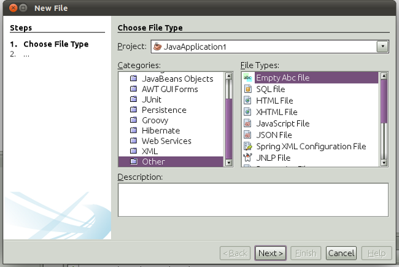

// 
//     Licensed to the Apache Software Foundation (ASF) under one
//     or more contributor license agreements.  See the NOTICE file
//     distributed with this work for additional information
//     regarding copyright ownership.  The ASF licenses this file
//     to you under the Apache License, Version 2.0 (the
//     "License"); you may not use this file except in compliance
//     with the License.  You may obtain a copy of the License at
// 
//       http://www.apache.org/licenses/LICENSE-2.0
// 
//     Unless required by applicable law or agreed to in writing,
//     software distributed under the License is distributed on an
//     "AS IS" BASIS, WITHOUT WARRANTIES OR CONDITIONS OF ANY
//     KIND, either express or implied.  See the License for the
//     specific language governing permissions and limitations
//     under the License.
//

= NetBeans Platform File Type Tutorial Using Maven
:jbake-type: platform_tutorial
:jbake-tags: tutorials 
:jbake-status: published
:syntax: true
:source-highlighter: pygments
:toc: left
:toc-title:
:icons: font
:experimental:
:description: NetBeans Platform File Type Tutorial Using Maven - Apache NetBeans
:keywords: Apache NetBeans Platform, Platform Tutorials, NetBeans Platform File Type Tutorial Using Maven

This document demonstrates how to create a NetBeans module from a Maven archetype and build and install the module in NetBeans IDE or any other application on the NetBeans Platform. In this tutorial, you will create a module project that when installed enables you to recognize a new type of file in your projects. The module also creates a menu action that is available when the user right-click a file conforming to the new file type.

This document is based on the Ant-based  link:https://netbeans.apache.org/tutorials/nbm-filetype.html[NetBeans File Type Tutorial] and can be used to learn some of the differences between using Ant and Maven to develop NetBeans modules. After you understand the differences, you can easily proceed through other tutorials on the  link:https://netbeans.apache.org/kb/docs/platform.html[NetBeans Platform Learning Trail].

NOTE:  You do not need to download Maven because it is bundled with the IDE. Optionally, use your own download of Maven, in which case use the Options window to configure your Maven settings.

Before starting this tutorial you may want to familiarize yourself with the following introductory Maven documentation:

*  link:http://wiki.netbeans.org/MavenBestPractices[Best Practices for Maven in NetBeans IDE]
*  link:http://www.sonatype.com/books/maven-book/reference/introduction.html[Chapter 1. Introducing Apache Maven] (from  link:http://www.sonatype.com/books/maven-book/reference/public-book.html[Maven: The Definitive Guide])

== Creating the Module Project

In this section you create a NetBeans module project from a Maven archetype.

[start=1]
1. Open the New Project wizard and choose NetBeans Module in the Maven category:

image::images/maven-single_71_pic1.png[title="Module wizard 1"]

Click Next.

[start=2]
1. Type *AbcFileTypeSupport* in Project Name and specify a location for storing the project:

image::images/maven-single_71_pic2.png[title="Module wizard 2"]

Click Next. Specify the NetBeans API version you want to use. Click Finish.

When you click Finish, the IDE creates the AbcFileTypeSupport project:

image::images/maven-single_71_pic4.png[title="Module wizard 2"]

If you look in the POM, shown above, you can see that Maven will use the  `` link:http://maven.apache.org/plugins/maven-jar-plugin/[maven-jar-plugin]``  to build the JAR and the  `` link:http://bits.netbeans.org/mavenutilities/nbm-maven-plugin/[nbm-maven-plugin]``  will package the JAR as a NetBeans Module ( ``nbm`` ).

[source,xml]
----

<modelVersion>4.0.0</modelVersion>

<groupId>com.mycompany</groupId>
<artifactId>AbcFileTypeSupport</artifactId>
<version>1.0-SNAPSHOT</version>
*<packaging>nbm</packaging>*

<name>AbcFileTypeSupport</name>

<properties>
    <project.build.sourceEncoding>UTF-8</project.build.sourceEncoding>
</properties>

<repositories>
    <!--
    Repository hosting NetBeans modules, especially APIs.
    Versions are based on IDE releases, e.g.: RELEASE691
    To create your own repository, use: nbm:populate-repository
    -->
    <repository>
        <id>netbeans</id>
        <name>NetBeans</name>
        <url>http://bits.netbeans.org/maven2/</url>
        <snapshots>
            <enabled>false</enabled>
        </snapshots>
    </repository>
</repositories>

<dependencies>
    <dependency>
        <groupId>org.netbeans.api</groupId>
        <artifactId>org-netbeans-api-annotations-common</artifactId>
        <version>RELEASE71-BETA</version>
    </dependency>
</dependencies>

<build>
    <plugins>
        <plugin>
            <groupId>org.codehaus.mojo</groupId>
            *<artifactId>nbm-maven-plugin</artifactId>*
            <version>3.6</version>
            <extensions>true</extensions>
        </plugin>

        <plugin>
            <!-- NetBeans 6.9+ requires JDK 6 -->
            <groupId>org.apache.maven.plugins</groupId>
            <artifactId>maven-compiler-plugin</artifactId>
            <version>2.3.2</version>
            <configuration>
                <source>1.6</source>
                <target>1.6</target>
            </configuration>
        </plugin>

        <plugin>
            <groupId>org.apache.maven.plugins</groupId>
            *<artifactId>maven-jar-plugin</artifactId>*
            <version>2.3.1</version>
            <configuration>
                <!-- to have the jar plugin pickup the nbm generated manifest -->
                <useDefaultManifestFile>true</useDefaultManifestFile>
            </configuration>
        </plugin>
    </plugins>
</build>
----

== Recognizing the File Type

In this section you will use the New File Type wizard to create the files for recognizing a new file type named  ``.abc`` .

[start=1]
1. Right-click the project node in the Projects window and choose New > File Type. Click Next.

[start=2]
1. In the File Recognition panel, type *text/x-abc* for the MIME Type and *.abc .ABC* for the Filename Extension:

image::images/maven-single_71_pic5.png[title="Module wizard 1"]

Click Next.

[start=3]
1. Type *Abc* as the Class Name Prefix. Click Browse and select a 16x16 pixel image file as the new file type's icon.

If you don't have an image available, just save this image  `` link:images/maven-crud_abc16.png[abc16.png]``  ( 
image::images/maven-crud_abc16.png[title="16x16"] ) to your system and select the image after clicking Browse.

image::images/maven-single_71_pic6.png[title="Module wizard 1"]

Click Finish.

When you click Finish, the IDE creates the files shown below:

image::images/maven-single_71_pic7.png[title="Module wizard 1"]

For more details on the files that the IDE created, see  link:https://netbeans.apache.org/wiki/devfaqdataobject[What is a DataObject] and the section on  link:nbm-filetype.html#recognizing[Recognizing Abc Files] in the Ant-Based  link:nbm-filetype.html[File Type Integration Tutorial].

== Building and Running the Project

To install the module, you first need to build and run it.

[start=1]
1. Right-click the project node and choose Build.

[start=2]
1. Right-click the project node and choose Run. The IDE launches with the new module installed. To confirm that the new module is working correctly, create a new project and then use the New File wizard to create an  ``abc``  file:

For example, you can create a simple Java application and then open the New File wizard and choose the Empty Abc file type in the Other category.

When you create the new file, specify a source package if you want to see the file in the Projects window. By default the wizard for the new file type will create the file at the root level of the project.

[start=3]
1. After you create the new abc file you can see that the file is displayed in the Projects window with the icon for the file type. If you open the file in the editor you can see that the contents of the new file were generated from the file template.

image::images/maven-single_71_pic9.png[title="Module wizard 1"]

Click the "Visual" tab and you will see the GUI panel created by the New File Type wizard:

image::images/maven-single_71_pic91.png[title="Module wizard 1"]

You can see that your file type is now recognized by the application. In the next section, we'll create a new action for our file type, which will be available when the user right-click on a file conforming to the type in the Projects window.

== Adding an Action for the File Type

In this section you will add an action that can be invoked from the popup menu when the user right-clicks the node of a file conforming to your new file type.

[start=1]
1. Right-click the AbcFileTypeSupport project and choose New > Action. In the Action Type panel, select Conditionally Enabled and type *AbcDataObject* for the Cookie Class, which specifies the type that needs to be in the Lookup for the Action to be enabled:

image::images/maven-single_71_pic92.png[title="Module wizard 1"]

Click Next.

[start=2]
1. Select Edit in the Category drop-down list and deselect Global Menu Item. Select File Type Context Menu Item and select *text/x-abc* in the Content Type drop-down list:

image::images/maven-single_71_pic93.png[title="Module wizard 1"]

Click Next.

[start=3]
1. Type *MyAction* as the Class Name and *My Action* as the Display Name:

image::images/maven-single_71_pic94.png[title="Module wizard 1"]

Click Finish.

When you click Finish,  ``MyAction.java``  is created in the  ``com.mycompany.abcfiletype``  source package:

[source,java]
----

package com.mycompany.abcfiletypesupport;

import java.awt.event.ActionEvent;
import java.awt.event.ActionListener;
import org.openide.awt.ActionID;
import org.openide.awt.ActionReference;
import org.openide.awt.ActionReferences;
import org.openide.awt.ActionRegistration;
import org.openide.util.NbBundle.Messages;

@ActionID(category = "Edit",
id = "com.mycompany.abcfiletypesupport.MyAction")
@ActionRegistration(displayName = "#CTL_MyAction")
@ActionReferences({
    @ActionReference(path = "Loaders/text/x-abc/Actions", position = 0)
})
@Messages("CTL_MyAction=My Action")
public final class MyAction implements ActionListener {

    private final AbcDataObject context;

    public MyAction(AbcDataObject context) {
        this.context = context;
    }

    public void actionPerformed(ActionEvent ev) {
        // TODO use context
    }
    
}
----

[start=4]
1. Let's now make the Action a bit more meaningful. We'll add some code for the action. In this example you will add some code that uses  ``DialogDisplayer``  to open a dialog box when the action is invoked from the popup menu.

Modify the  ``actionPerformed(ActionEvent ev)``  method in  ``MyAction.java``  to open a dialog when My Action is invoked.

[source,java]
----

@Override
public void actionPerformed(ActionEvent ev) {
   *FileObject f = context.getPrimaryFile();
   String displayName = FileUtil.getFileDisplayName(f);
   String msg = "This file is " + displayName + ".";
   NotifyDescriptor nd = new NotifyDescriptor.Message(msg);
   DialogDisplayer.getDefault().notify(nd);*
}
----

[start=5]
1. Fix the missing import statements (Ctrl-Shift-I) and then confirm that your import statements are as shown below:

[source,java]
----

package com.mycompany.abcfiletypesupport;

import java.awt.event.ActionEvent;
import java.awt.event.ActionListener;
import org.openide.DialogDisplayer;
import org.openide.NotifyDescriptor;
import org.openide.awt.ActionID;
import org.openide.awt.ActionReference;
import org.openide.awt.ActionReferences;
import org.openide.awt.ActionRegistration;
import org.openide.filesystems.FileObject;
import org.openide.filesystems.FileUtil;
import org.openide.util.NbBundle.Messages;

@ActionID(category = "Edit",
id = "com.mycompany.abcfiletypesupport.MyAction")
@ActionRegistration(displayName = "#CTL_MyAction")
@ActionReferences({
    @ActionReference(path = "Loaders/text/x-abc/Actions", position = 0)
})
@Messages("CTL_MyAction=My Action")
public final class MyAction implements ActionListener {

    private final AbcDataObject context;

    public MyAction(AbcDataObject context) {
        this.context = context;
    }

    @Override
    public void actionPerformed(ActionEvent ev) {
        FileObject f = context.getPrimaryFile();
        String displayName = FileUtil.getFileDisplayName(f);
        String msg = "This file is " + displayName + ".";
        NotifyDescriptor nd = new NotifyDescriptor.Message(msg);
        DialogDisplayer.getDefault().notify(nd);
    }
    
}
----

[start=6]
1. You can now try out the module to confirm that the new action works correctly.

*Note.* To run the module you will first need to clean and build the module.

When you right-click on a node of the  ``abc``  file type you will see that My Action is one of the items in the popup menu.

image::images/maven-single_71_pic95.png[title="Module wizard 1"]

This tutorial demonstrated how to create and run a NetBeans module that you created from a Maven Archetype. You also learned a little about how to work with file types, but for more details you should look at the Ant-Based  link:https://netbeans.apache.org/tutorials/nbm-filetype.html[NetBeans File Type Tutorial]. For more examples on how to build NetBeans Platform applications and modules, see the tutorials listed in the  link:https://netbeans.apache.org/kb/docs/platform.html[NetBeans Platform Learning Trail].

link:http://netbeans.apache.org/community/mailing-lists.html[ Send Us Your Feedback]

 

== See Also

For more information about creating and developing applications, see the following resources.

*  link:https://netbeans.apache.org/kb/docs/platform.html[NetBeans Platform Learning Trail]
*  link:http://bits.netbeans.org/dev/javadoc/[NetBeans API Javadoc]

If you have any questions about the NetBeans Platform, feel free to write to the mailing list, dev@platform.netbeans.org, or view the  link:https://mail-archives.apache.org/mod_mbox/netbeans-dev/[NetBeans Platform mailing list archive].

