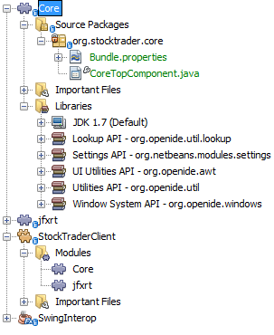

// 
//     Licensed to the Apache Software Foundation (ASF) under one
//     or more contributor license agreements.  See the NOTICE file
//     distributed with this work for additional information
//     regarding copyright ownership.  The ASF licenses this file
//     to you under the Apache License, Version 2.0 (the
//     "License"); you may not use this file except in compliance
//     with the License.  You may obtain a copy of the License at
// 
//       http://www.apache.org/licenses/LICENSE-2.0
// 
//     Unless required by applicable law or agreed to in writing,
//     software distributed under the License is distributed on an
//     "AS IS" BASIS, WITHOUT WARRANTIES OR CONDITIONS OF ANY
//     KIND, either express or implied.  See the License for the
//     specific language governing permissions and limitations
//     under the License.
//

= NetBeans Platform JavaFX Porting Tutorial
:jbake-type: platform_tutorial
:jbake-tags: tutorials 
:jbake-status: published
:syntax: true
:source-highlighter: pygments
:toc: left
:toc-title:
:icons: font
:experimental:
:description: NetBeans Platform JavaFX Porting Tutorial - Apache NetBeans
:keywords: Apache NetBeans Platform, Platform Tutorials, NetBeans Platform JavaFX Porting Tutorial

This tutorial provides step-by-step instructions for integrating JavaFX features into a NetBeans Platform application. Since the NetBeans Platform is typically used as a basis for corporate applications, the JavaFX chart components are ideal candidates for integration into NetBeans Platform applications. JavaFX, as a whole, is focused on bringing special effects to Java. In the context of charts, JavaFX provides a set of predefined charts, each of which can be animated, which is particularly useful to show changes in values presented in a chart.

image::https://blogs.oracle.com/geertjan_images/resource/stock-trader-client-nb.pnh.png[]

At the end of this tutorial, you will have various JavaFX charts in a NetBeans Platform application, as can be seen above, together with instructions and an API for plugging in additional charts.

== Examining the Swing Interop Sample

We begin by looking at a sample that comes with NetBeans IDE. It provides all the JavaFX code we'll need. In the following sections, we'll port the code to a NetBeans Platform application.

[start=1]
1. Choose File > New Project (Ctrl+Shift+N). Under Categories, select Samples | JavaFX. Under Projects, select SwingInterop. 
image::images/javafx_72_swinginterop-1.png[] Click Next.

[start=2]
1. In the Name and Location panel, specify where the project should be stored:
image::images/javafx_72_swinginterop-2.png[] Click Finish.

[start=3]
1. Browse through the structure of your new application: 
image::images/javafx_72_swinginterop-3.png[]

[start=4]
1. Right-click the application and choose Run. You should now see the following: 
image::images/javafx_72_swinginterop-4.png[] 

Change the first value in the 2008 table and press Enter. Notice that the chart is animated while the value changes.

[start=5]
1. For the application we're going to create, we don't need the "Web Browser" tab. Let's modify the sample application so that we have exactly the code we need. All the changes below apply to the class  ``SwingInterop.java`` , because we can use  ``SampleTableModel``  unchanged. 
* Delete the  ``createBrowser()``  method.
* Delete all references to  ``browserFxPanel`` , which is the  ``JFXPanel``  that embeds the JavaFX web view, which we do not need.
* Replace the  ``JTabbedPane``  and  ``JSplitPane``  with a  ``JPanel`` .

The  ``init``  method should now be as follows:

[source,java]
----

public void init() {

    tableModel = new SampleTableModel();
    // create javafx panel for charts
    chartFxPanel = new JFXPanel();
    chartFxPanel.setPreferredSize(new Dimension(PANEL_WIDTH_INT, PANEL_HEIGHT_INT));

    JPanel panel = new JPanel();
    panel.setLayout(new BorderLayout());

    //JTable
    JTable table = new JTable(tableModel);
    table.setAutoCreateRowSorter(true);
    table.setGridColor(Color.DARK_GRAY);
    SwingInterop.DecimalFormatRenderer renderer = new SwingInterop.DecimalFormatRenderer();
    renderer.setHorizontalAlignment(JLabel.RIGHT);
    for (int i = 0; i < table.getColumnCount(); i++) {
        table.getColumnModel().getColumn(i).setCellRenderer(renderer);
    }
    
    JScrollPane tablePanel = new JScrollPane(table);
    tablePanel.setPreferredSize(new Dimension(PANEL_WIDTH_INT, TABLE_PANEL_HEIGHT_INT));

    JPanel chartTablePanel = new JPanel();
    chartTablePanel.setLayout(new BorderLayout());
    chartTablePanel.add(chartFxPanel, BorderLayout.CENTER);

    panel.add(chartTablePanel, BorderLayout.CENTER);
    panel.add(tablePanel, BorderLayout.SOUTH);

    add(panel, BorderLayout.CENTER);

    // create JavaFX scene
    Platform.runLater(new Runnable() {
        public void run() {
            createScene();
        }
    });

}
----

Run the application again and you should see the following, that is, the JavaFX chart is now directly in a  ``JPanel`` :

image::images/javafx_72_swinginterop-5.png[] 

You now have code that is ready to be ported to a NetBeans Platform application.

== Setting Up the Application

Let's imagine that we're creating a stock trader application. That provides a desktop client scenario where JavaFX charts would be useful to integrate.

[start=1]
1. Choose File > New Project (Ctrl+Shift+N). Under Categories, select NetBeans Modules. Under Projects, select NetBeans Platform Application: 
image::images/javafx_72_new-app-1.png[] Click Next.

[start=2]
1. In the Name and Location panel:
* In the Project Name field, type  ``StockTraderClient`` .
* In the Project Location field, change the value to any directory on your computer where the application will be stored.

image::images/javafx_72_new-app-2.png[] 

Click Finish. The IDE creates the  ``StockTraderClient``  project:

image::images/javafx_72_new-app-3.png[]

[start=3]
1. Right-click the Modules node and choose Add New Library: 
image::images/javafx_72_new-app-4.png[]

[start=4]
1. Click Browse and browse to the  ``jfxrt.jar``  in the JavaFX Runtime: 
image::images/javafx_72_new-app-5.png[] 

Click Select, then click Next.

[start=5]
1.  ``jfxrt``  should be the project name: 
image::images/javafx_72_new-app-6.png[] 

Click Next.

[start=6]
1. Type  ``javafx``  as the code name base: 
image::images/javafx_72_new-app-7.png[] 

The code name base is a unique identifier for a module. In the case of a library wrapper module, you'll typically use the name of the root package, such as  ``org.netbeans`` , but in the case of JavaFX it is  ``javafx`` , as the code name base.

Click Finish. The application now has a new module called  ``jfxrt`` , which wraps the JavaFX runtime JAR:

image::images/javafx_72_new-app-8.png[]

[start=7]
1. 
In the JavaFX Runtime distribution, you'll find a long list of native libraries.

If you use Java 7 Update 6 or later, you will not need to include the native libraries in your application, because the JDK and JRE already include them.

For example, for Windows, the list looks like the image on the left. Switch to the Files window. Expand the  ``jfxrt``  folder and create a new subfolder within  ``release`` , named  ``modules/bin`` . Into that folder, copy all the native libraries, as shown in the image on the right: 

image::images/javafx_72_jfx-rt-1.png[] 
image::images/javafx_72_jfx-rt-2.png[] 

Your application now contains the  ``jfxrt.jar`` , as well as the native libraries required by JavaFX.

You're now ready to create a module where you'll embed the JavaFX chart into a  ``TopComponent`` .

== Embedding a JavaFX Chart in a TopComponent

We begin by creating a new module. Then we use the New Window wizard to create a new  ``TopComponent`` . We set a dependency on the  ``jfxrt``  module so that the  ``TopComponent``  can access JavaFX packages. Then we round off the section by moving the code from the Swing Interop sample into the  ``TopComponent`` .

* <<create-module,Create the Module>>
* <<create-topcomponent,Create the TopComponent>>
* <<set-dependency,Set Dependency on the JavaFX Runtime>>
* <<port-chart,Port the JavaFX Chart>>

=== Create the Module

In this section, you use the New Module wizard to create a new module.

[start=1]
1. Right-click the Modules node and choose Add New: 
image::images/javafx_72_new-module-1.png[] 

[start=2]
1. The module we're now creating is going to contain the core functionality of the application. Ultimately, there'll be many modules that will be optional, such as a range of charting windows, while this module will always remain essential to the application. Hence, we will name this module  ``Core`` : 
image::images/javafx_72_new-module-2.png[] 

Click Next.

[start=3]
1. We imagine that we own a URL  ``stocktrader.org`` , which means that that URL is unique. Turning the URL around, we arrive at the prefix of the code base for all our functionality modules. Next, in this particular case, we add  ``core`` , since that is the name of our module and so we have  ``org.stocktrader.core``  as the unique identifier of our module: 
image::images/javafx_72_new-module-3.png[] 

Click Finish. We now have a new module in our application, named  ``Core`` :

image::images/javafx_72_new-module-4.png[]

=== Create the TopComponent

In this section, you use the New Window wizard to create a new window.

[start=1]
1. Right-click the  ``org.stocktrader.core``  package and choose New | Other. In the Module Development category, choose Window: 
image::images/javafx_72_new-window-1.png[] 

Click Next.

[start=2]
1. In the Window Position drop-down, choose "editor". Select "Open on Application Start": 
image::images/javafx_72_new-window-2.png[] 

Click Next.

[start=3]
1. Type "Core" as class name prefix: 
image::images/javafx_72_new-window-3.png[] 

Click Finish. We now have a new window in our application, named  ``CoreTopComponent`` , together with libraries that are the dependencies required by  ``CoreTopComponent`` :

=== Set Dependency on the JavaFX Runtime

In this section, you make the JavaFX classes accessible to your  ``TopComponent`` .

[start=1]
1. Right-click the Libraries node and choose Add Module Dependency: 
image::images/javafx_72_set-dep-1.png[]

[start=2]
1. Scroll down to your  ``jfxrt``  module: 
image::images/javafx_72_set-dep-2.png[] 

Click OK. We now have a new dependency on the JavaFX Runtime, so that we can use the JavaFX classes in our  ``TopComponent`` :

image::images/javafx_72_set-dep-3.png[]

=== Port the JavaFX Chart

In this section, you move the useful parts of the Swing Interop sample into your Core module.

[start=1]
1. Copy the  ``SampleTableModel.java``  file into the  ``org.stocktrader.core``  package. Do so by copying the class, right-clicking on the package where you want to copy it to, and choosing Paste | Refactor Copy and then clicking the Refactor button.

[start=2]
1. Copy the fields at the top of the  ``SwingInterop.java``  file to the top of the  ``TopComponent`` .

[start=3]
1. Copy the methods  ``createScene`` ,  ``createBarChart`` , and  ``DecimalFormatRenderer``  into the body of the  ``TopComponent`` .

[start=4]
1. Copy the  ``init``  method into the  ``TopComponent``  and change  ``SwingInterop.DecimalFormatRenderer``  to  ``DecimalFormatRenderer`` .

[start=5]
1. Change the constructor of the  ``TopComponent``  to set the layout and to call the  ``init``  metod, as follows, that is, by adding the two highlighted lines below:

[source,java]
----

public CoreTopComponent() {
    initComponents();
    setName(Bundle.CTL_CoreTopComponent());
    setToolTipText(Bundle.HINT_CoreTopComponent());
    *setLayout(new BorderLayout());
    init();*
}
----

[start=6]
1. Right-click the application, choose Run, and the application starts up, showing the JavaFX chart, together with the  ``JTable``  that controls it: 
image::images/javafx_72_result-1.png[] 

Change the first value in the 2008 table and press Enter. Notice that the chart is animated while the value changes.

In this section, you integrated a JavaFX chart into a  ``TopComponent`` . In the next section, we will begin to make the application more modular. By the end of that section, the  ``JTable``  will be in one module, while the JavaFX Chart will be in another.

== Splitting the Table from the Chart

To make the application more modular, we will move the JavaFX chart into a separate module. Because the interaction between the JavaFX chart and the  ``JTable``  is done via the  ``SampleTableModel`` , we will move that class into a separate module, too. That module will be the API between the table and the chart.

When you complete this section, you will have a modular infrastructure letting you provide alternative JavaFX charts, which will all be made available by separate modules that integrate with the  ``SampleTableModel``  in the API module.

* <<create-api,Create the Stock Trader API Module>>
* <<create-bar,Create the Bar Chart Module>>

=== Create the Stock Trader API Module

In this section, you create a new module for the  ``SampleTableModel``  class. You expose the package containing the class and you set a dependency on it in the  ``Core``  module.

[start=1]
1. Right-click on the StockTraderClient's Modules node and choose Add New. Create a new module, named  ``StockTraderAPI`` . When you click Next, set  ``org.stocktrader.api``  as the code name base for the module. Click Finish and you will have a new module, named StockTraderAPI.

[start=2]
1. Right-click on the StockTraderClient's Libraries node and choose Add Module Dependency. Set a dependency on the  ``jfxrt``  module and click Finish. Your API module now has access to the JavaFX classes.

[start=3]
1. In the Core module, right-click on  ``SampleTableModel``  and choose Cut. Next, in the StockTraderAPI module, right-click on the  ``org.stocktrader.api``  package and choose Paste | Refactor Copy and then click Refactor. The class is moved into the new package, while it's package statement has been updated.

[start=4]
1. Create a new Java class named  ``StockTraderUtilities``  in the  ``org.stocktrader.api``  package. In this class, create a method that will ensure that only one instance of  ``SampleTableModel``  is made available:

[source,java]
----

package org.stocktrader.api;

public class StockTraderUtilities {
    
    private static SampleTableModel stm = null;
    
    public static SampleTableModel getSampleTableModel() {
        if (stm == null){
            return stm = new SampleTableModel();
        } else {
            return stm;
        }
    }
    
}
----

[start=5]
1. Right-click on the StockTraderAPI project node and choose Properties. In the Project Properties dialog, click the API Versioning tab. Then put a checkmark next to the package containing the classes that you want to expose to the rest of the application, as shown below:

image::images/javafx_72_new-api-0.png[]

Click OK. Now the package containing our classes has been exposed to the rest of the application.

[start=6]
1. In the Core module, right-click on Libraries node and choose Add Module Dependency. Set a dependency on the StockTraderAPI.

[start=7]
1. 
Check that the structure of the application is now as follows:

image::images/javafx_72_new-api-7.png[]

=== Create the Bar Chart Module

In this section, you create a module containing a  ``TopComponent``  where you will embed the JavaFX chart that is currently in the  ``CoreTopComponent`` . Since the table and the JavaFX chart interact via the  ``SampleTableModel`` , the modules containing the table and the chart will both depend on the StockTraderAPI module.

[start=1]
1. Right-click on the StockTraderClient's Modules node and choose Add New. Create a new module, named  ``BarChart`` . When you click Next, set  ``org.stocktrader.chart.bar``  as the code name base and "Chart - Bar" as the display name. Click Finish and you will have a new module, named "Chart - Bar", which we will refer to below as the "bar chart module".

[start=2]
1. Right-click on the bar chart module's Libraries node and choose Add Module Dependency. Set a dependency on the  ``jfxrt``  module and click Finish. The bar chart module now has access to the JavaFX classes. Also set a dependency on the StockTraderAPI module, so that the bar chart module will have access to the table model.

[start=3]
1. In the bar chart module, use the New Window wizard to create a new window in the editor position, which should open at start up, with  ``BarChart``  as the class name prefix.

[start=4]
1. Open  ``CoreTopComponent``  and  ``BarChartTopComponent``  and do the following:
* Move the methods  ``createScene``  and  ``createBarChart``  into the  ``BarChartTopComponent`` .
* Delete  ``DecimalFormatRenderer``  and all references to it. We'll not use it at the moment, since it's not directly relevant to the application we're creating.
* Move the fields  ``chartFxPanel``  and  ``chart``  into the  ``BarChartTopComponent`` .
* Copy the field  ``tableModel``  into the  ``BarChartTopComponent``  because both  ``TopComponents``  will need to have access to this class.
* In  ``CoreTopComponent`` , clean up the  ``init``  method, so that it only contains the code that you actually need:

[source,java]
----

public void init() {
    tableModel = StockTraderUtilities.getSampleTableModel();
    JTable table = new JTable(tableModel);
    table.setAutoCreateRowSorter(true);
    table.setGridColor(Color.DARK_GRAY);
    add(table, BorderLayout.CENTER);
}
----

Similarly, in  ``BarChartTopComponent`` , create an  ``init``  method that only contains the chart-related code:

[source,java]
----

public void init() {
    tableModel = StockTraderUtilities.getSampleTableModel();
    chartFxPanel = new JFXPanel();
    add(chartFxPanel, BorderLayout.CENTER);
    //Make sure to add the line below:
    Platform.setImplicitExit(false);
    Platform.runLater(new Runnable() {
        public void run() {
            createScene();
        }
    });
}
----

 `` link:http://docs.oracle.com/javafx/2/api/javafx/application/Platform.html[Platform.setImplicitExit]``  sets the implicitExit attribute to the specified value. If this attribute is true, the JavaFX runtime will implicitly shutdown when the last window is closed; the JavaFX launcher will call the Application.stop() method and terminate the JavaFX application thread. If this attribute is false, the application will continue to run normally even after the last window is closed, until the application calls exit(). The default value is true.

Notice how modulerizing the code is little more than refactoring. And, in the end, you have code that is much clearer than it was in the beginning.

* In  ``BarChartTopComponent`` , add these lines to the end of the constructor, to set the layout and call the  ``init``  method:

[source,java]
----

setLayout(new BorderLayout());
init();
----

* In  ``CoreTopComponent`` , change the  ``@TopComponent.Registration``  so that "mode" is set to "output", instead of "editor". That way, our table will be displayed at the bottom of the application frame, while the chart will be displayed in the editor area, which makes for a better appearance.

[start=5]
1. Check that your application now has the following structure: 
image::images/javafx_72_result-3.png[]

[start=6]
1. Right-click the application, choose Run, and the application starts up, showing the JavaFX chart, together with the  ``JTable``  that controls it. This time, however, the table and the chart are in separate windows, though they're able to interact because they share a common table model: 
image::images/javafx_72_result-2.png[] 

Change a value in the table and press Enter. Notice that the chart is animated while the value changes.

In the final section of this tutorial, we will add new modules, each containing new JavaFX charts, which will be integrated with the rest of the application because they will all share the same table model.

== Plugging in New Charts

In this section, we add new modules providing a JavaFX pie chart and a JavaFX area chart. They will both be animated, just like the bar chart. Whenever the user changes a value in the table, all charts will be animated while performing the change.

* <<create-pie,Create the Pie Chart Module>>
* <<create-area,Create the Area Chart Module>>

=== Create the Pie Chart Module

In this section, you create a module containing a  ``TopComponent``  where you will embed the JavaFX pie chart. The module will need to have access to the JavaFX classes, as well as to the Stock Trader API.

[start=1]
1. Right-click on the StockTraderClient's Modules node and choose Add New. Create a new module, named  ``PieChart`` . When you click Next, set  ``org.stocktrader.chart.pie``  as the code name base and "Chart - Pie" as the display name. Click Finish and you will have a new module, named "Chart - Pie", which we will refer to below as the "pie chart module".

[start=2]
1. Right-click on the bar chart module's Libraries node and choose Add Module Dependency. Set a dependency on the  ``jfxrt``  module and click Finish. The pie chart module now has access to the JavaFX classes. Also set a dependency on the StockTraderAPI module, so that the pie chart module will have access to the table model.

[start=3]
1. 
In the pie chart module, use the New Window wizard to create a new window in the explorer position, which is the left-most window in the NetBeans Platform, which should open at start up:

image::images/javafx_72_new-pie-1.png[] 

Click Next and set  ``PieChart``  as the class name prefix. Click Finish.

[start=4]
1. Copy the code you added to the  ``BarChartTopComponent``  into the  ``PieChartTopComponent`` . However, instead of a bar chart, you now want to create a pie chart:

[source,java]
----

public PieChart createPieChart() {
    ObservableList data = FXCollections.observableArrayList();
    List<String> columnNames = tableModel.getColumnNames();
    for (String string : columnNames) {
        data.add(new PieChart.Data(string, 20));
    }
    final PieChart chart = new PieChart(FXCollections.observableArrayList(data));
    tableModel.addTableModelListener(new TableModelListener() {
        public void tableChanged(TableModelEvent e) {
            if (e.getType() == TableModelEvent.UPDATE) {
                final int row = e.getFirstRow();
                final int column = e.getColumn();
                final Object value = ((SampleTableModel) e.getSource()).getValueAt(row, column);
                Platform.setImplicitExit(false);
                Platform.runLater(new Runnable() {
                    public void run() {
                        PieChart.Data s = chart.getData().get(row);
                        s.setPieValue((Double)value);
                    }
                });
            }
        }
    });
    chart.setId("BasicPie");
    return chart;
}
----

[start=5]
1. Run the application and notice that you now have a pie chart and that, when you make changes to the table, the pie chart animates together with the bar chart: 
image::images/javafx_72_result-4.png[]

=== Create the Area Chart Module

In this section, you create a module containing a  ``TopComponent``  where you will embed the JavaFX area chart.

[start=1]
1. Follow all the steps in the previous section, using "AreaChart" as the project name,  ``org.stocktrader.chart.area``  as the code name base, and "Chart - Area" as the display name. Add dependencies on the  ``jfxrt``  module and on the Stock Trader API. Use the New Window wizard to create a new  ``TopComponent`` , in the properties position, which should open at start up.

[start=2]
1. Copy the code you added to the  ``BarChartTopComponent``  into the  ``AreaChartTopComponent`` . However, instead of a bar chart, you now want to create an area chart:

[source,java]
----

protected AreaChart<Number, Number> createAreaChart() {
    NumberAxis xAxis = new NumberAxis();
    NumberAxis yAxis = new NumberAxis();
    AreaChart<Number,Number> ac = new AreaChart<Number,Number>(xAxis,yAxis);
    // setup chart
    ac.setTitle("Area Chart Example");
    xAxis.setLabel("X Axis");
    yAxis.setLabel("Y Axis");
    // add starting data
    for (int s=0;s<3;s++) {
        XYChart.Series<Number,Number> series = new XYChart.Series<Number,Number>();
        series.setName("Data Series "+s);
        double x = 0;
        while (x<95) {
            series.getData().add(new XYChart.Data<Number,Number>(x, Math.random()*99));
            x += 5 + (15*Math.random());
        }
        series.getData().add(new XYChart.Data<Number,Number>(99d, Math.random()*99));
        ac.getData().add(series);
    }
    return ac;
}
----

[start=3]
1. Run the application and notice that you now have three charts that, when you make changes to the table, all change simultaneously: 
image::images/javafx_72_result-5.png[]

The tutorial is complete. You have created a modular application on the NetBeans Platform, while making use of JavaFX chart technology:

image::images/javafx_72_result-6.png[] 

link:http://netbeans.apache.org/community/mailing-lists.html[ Send Us Your Feedback]

