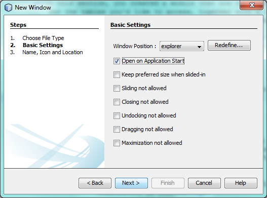

// 
//     Licensed to the Apache Software Foundation (ASF) under one
//     or more contributor license agreements.  See the NOTICE file
//     distributed with this work for additional information
//     regarding copyright ownership.  The ASF licenses this file
//     to you under the Apache License, Version 2.0 (the
//     "License"); you may not use this file except in compliance
//     with the License.  You may obtain a copy of the License at
// 
//       http://www.apache.org/licenses/LICENSE-2.0
// 
//     Unless required by applicable law or agreed to in writing,
//     software distributed under the License is distributed on an
//     "AS IS" BASIS, WITHOUT WARRANTIES OR CONDITIONS OF ANY
//     KIND, either express or implied.  See the License for the
//     specific language governing permissions and limitations
//     under the License.
//

= NetBeans Platform CRUD Tutorial Using Maven
:jbake-type: platform_tutorial
:jbake-tags: tutorials 
:jbake-status: published
:syntax: true
:source-highlighter: pygments
:toc: left
:toc-title:
:icons: font
:experimental:
:description: NetBeans Platform CRUD Tutorial Using Maven - Apache NetBeans
:keywords: Apache NetBeans Platform, Platform Tutorials, NetBeans Platform CRUD Tutorial Using Maven

This tutorial demonstrates how to use the Maven build framework to create a simple NetBeans Platform application that can read from and write to a database. In this document you will use Maven archetypes to create the NetBeans Platform application and module, and the Swing UI toolkit and "Matisse" GUI Builder to create window components.

This document is based on the Ant-based  link:nbm-crud.html[NetBeans Platform CRUD Application Tutorial] and can be used to understand some of the differences between using Ant and Maven to develop NetBeans Platform applications. After you understand how Maven is different from Ant, you can easily proceed through other tutorials on the  link:https://netbeans.apache.org/kb/docs/platform.html[NetBeans Platform Learning Trail].

NOTE:  You do not need to download Maven because it is bundled with the IDE. Optionally, use your own download of Maven, in which case use the Options window to configure your Maven settings.

NOTE:  This is [.underline]#not# a beginners tutorial. Before starting this tutorial, it is important that you familiarize yourself with the following introductory Maven documentation:

*  link:http://wiki.netbeans.org/MavenBestPractices[Best Practices for Maven in NetBeans IDE]
*  link:http://www.sonatype.com/books/maven-book/reference/introduction.html[Chapter 1. Introducing Apache Maven] (from  link:http://www.sonatype.com/books/maven-book/reference/public-book.html[Maven: The Definitive Guide])
*  link:https://netbeans.apache.org/tutorials/nbm-maven-commandline.html[NetBeans Platform Command Line Tutorial]
*  link:https://netbeans.apache.org/tutorials/nbm-maven-quickstart.html[NetBeans Platform Quick Start Using Maven]

Watch this YouTube movie before beginning to work on the tutorial because it shows the steps you will take below:

== Creating and Running the Sample Application

In this section, you set up a sample application provided by NetBeans IDE. The sample application access data and displays data in a Maven-based NetBeans Platform application, similar to the application you create in this tutorial. Successfully running the sample application and displaying data will be useful in determining whether the database connection is set up correctly.

[start=1]
1. Choose File > New Project (Ctrl-Shift-N) to open the New Project wizard. Select the Samples | Maven category and then select "CRUD Sample Application":

image::images/maven-crud_72_sample-1.png[title="screenshot"]

Click Next.

[start=2]
1. Specify a location:

image::images/maven-crud_72_sample-2.png[title="screenshot"]

Click Next.

[start=3]
1. Change, if needed, the location of libraries that the sample will use:

image::images/maven-crud_72_sample-3.png[title="screenshot"]

Click Finish.

Once the project is opened, if you see projects with [unloadable] in the display name, that means something is wrong with the POM file or that plugins are missing:

image::images/maven-crud_72_setup-2.png[title="screenshot"]

Developers seeing the above in the IDE are typically new to Maven or are setting up Maven for the first time on their system.

If you see the above, wait for the Maven dependencies to download, which is a process that you can follow by looking in the status bar of the IDE. Once the downloading has completed, and not before, right-click each project and choose "Build with Dependencies". Also see  link:https://bz.apache.org/netbeans/show_bug.cgi?id=205865[this issue] if problems relating to missing  ``plexus-utils.jar``  occur. If problems continue, refer to the links at the start of this document, to set up your Maven repository correctly.

[start=4]
1. Examine the project structure:

image::images/maven-crud_72_sample-4.png[title="screenshot"]

The project structure above is explained here:

* 
image::images/maven-crud_72_Maven2Icon.gif[] *NetBeans Platform Application.* This project is a Maven reactor project for the NetBeans Platform application, which lists the modules to include and the location of the project's repositories. This project does not contain any sources. The IDE generates the modules containing the sources and resources in sub-directories of this project.
* 
image::images/maven-crud_72_suiteicon.png[] *NetBeans Platform based application.* The NetBeans Platform application project enumerates included modules; permits interactive runs; produces various kinds of packaging, such as ZIP by default, but optionally JNLP, NBMs; holds functional tests. Each module project specifies its own compile dependencies, while the app project's dependencies are anything additional that should be present at runtime. For example, that includes, by default, the whole platform cluster, that is, the set of modules constituting the "platform" cluster. The app project could include other clusters, or subsets of clusters, or whatever plugins you want included in your app which are not used as compilation dependencies. At a minimum, core.startup and its transitive dependencies are included.
* 
image::images/maven-crud_72_nbmicon.png[] *Platform application branding resources.* This project contains the global resources used for branding the application, such as the splash screen.
* 
image::images/maven-crud_72_nbmicon.png[] *sample NetBeans Module.* The project that contains the source code for accessing the database and displaying it in a window.

[start=5]
1. 
You need to have access to a database server. This tutorial uses the JavaDB database server, together with a sample database. Before continuing, start the JavaDB server in the Services window by connecting to the sample database. Right-click on the connection node shown below and choose Connect:

image::images/maven-crud_72_sample-5.png[title="screenshot"]

If it is not already available, an easy way to make the JavaDB database server available is to register an instance of GlassFish that is bundled with the IDE. The JavaDB database server and a sample database are included with the GlassFish server.

[start=6]
1. Right-click the NetBeans Platform based application (
image::images/maven-crud_72_suiteicon.png[]) and choose Run. The application starts up and should show the following:

image::images/maven-crud_72_sample-6.png[title="screenshot"]

Use Window | Customer to open the Customer window, wait a few seconds, and you should see your data displayed:

image::images/maven-crud_72_sample-7.png[title="screenshot"]

[start=7]
1. Open the editor window and notice that the selected customer's details are shown in the editor. Make changes in the editor and save them and then notice that the viewer is automatically updated. Changes you make are stored in the database.

NOTE:  If you were not able to complete the above steps, do not continue with the rest of the tutorial. If you encountered problems relating to Maven repositories and unresolved Maven dependencies, refer to the introductory Maven links at the start of this document.

Since your database is being accessed correctly and your Maven dependencies have been correctly resolved, you are now ready to continue creating your own CRUD application.

== Creating the NetBeans Platform Application

In this section you use the New Project wizard to create a NetBeans Platform application from a Maven archetype.

[start=1]
1. If it is still open, close the sample application you created in the previous section. You do not need the sample anymore and leaving it open may cause confusion while you work on your real application.

[start=2]
1. Choose File > New Project (Ctrl-Shift-N) to open the New Project wizard. Select NetBeans Application from the Maven category:

image::images/maven-crud_72_pic1.png[title="screenshot"]

Click Next.

[start=3]
1. Type *MavenPlatformCRUDApp* for the Project Name and set the Project Location:

image::images/maven-crud_72_pic2.png[title="screenshot"]

Click Next.

[start=4]
1. Select the version of the NetBeans APIs you'd like to use and type the name of a NetBeans module that you'd like to be created together with the application, in this case *MavenPlatformCRUDApp-dbaccess*:

image::images/maven-crud_72_pic3.png[title="screenshot"]

Click Finish.

Depending on the availability of JARs as specified by Maven dependencies in your repository, the IDE will spend some time downloading Maven dependencies. Once the downloading of Maven dependencies is completed, you should see the following:

image::images/maven-crud_72_pic4.png[title="screenshot"]

The above project structure is explained here:

* 
image::images/maven-crud_72_Maven2Icon.gif[] *app.* This project is a Maven reactor project for the NetBeans Platform application, which lists the modules to include and the location of the project's repositories. This project does not contain any sources. The IDE generates the modules containing the sources and resources in sub-directories of this project.
* 
image::images/maven-crud_72_nbmicon.png[] *branding.* This project contains the global resources used for branding the application, such as the splash screen.
* 
image::images/maven-crud_72_nbmicon.png[] *dbaccess.* The project that will contain the Java sources you will create in the next section.
* 
image::images/maven-crud_72_suiteicon.png[] *parent.* The NetBeans Platform application project enumerates included modules; permits interactive runs; produces various kinds of packaging, such as ZIP by default, but optionally JNLP, NBMs; holds functional tests. Each module project specifies its own compile dependencies, while the app project's dependencies are anything additional that should be present at runtime. For example, that includes, by default, the whole platform cluster, that is, the set of modules constituting the "platform" cluster. The app project could include other clusters, or subsets of clusters, or whatever plugins you want included in your app which are not used as compilation dependencies. At a minimum, core.startup and its transitive dependencies are included.

[start=5]
1. 
Right-click the "parent" project and choose "Build with Dependencies". After the process has completed, right-click the "app" project and choose Run. You should see the default splash screen and then the main window of the application:

image::images/maven-crud_72_result-1.png[]

You have successfully set up the application and are now ready to begin generating the application's model classes.

== Creating the Model

In this section you generate Java Persistence API (JPA) entity classes from tables in the Java DB database. To create the entity classes and to use JPA in your application, you need to have access to a database server and the JPA persistence provider libraries.

Though this tutorial uses the JavaDB database server, you can later configure the application to use other database servers.

=== Generating Entity Classes From the Database

In this section you use a wizard to generate entity classes in the *dbaccess* module.

[start=1]
1. Right-click the Source Packages of the *dbaccess* module and choose New > Other. Select Entity Classes from Database in the Persistence category:

image::images/maven-crud_72_generate-1.png[title="screenshot"]

Click Next.

[start=2]
1. Select the Java DB sample database from the Database Connection drop-down list. Select the Customer table from the Available Tables list and click Add. When you click Add, the related tables, such as DiscountCode, which could vary depending on your version of the database, are also added to the list of Selected Tables list:

image::images/maven-crud_72_generate-2.png[title="screenshot"]

Click Next.

[start=3]
1. Leave the package name as suggested, that is, *com.mycompany.mavenplatformcrudapp*. Make sure that the Create Perisistence Unit and Generate Named Query Annotations are selected:

image::images/maven-crud_72_generate-3.png[title="screenshot"]

[start=4]
1. Click Finish. When you click Finish, the IDE generates an entity class for each selected table. The IDE also generates the  ``persistence.xml``  file in the  ``META-INF``  package under the Other Sources node in the  ``src/main/resources``  directory:

image::images/maven-crud_72_generate-4.png[title="screenshot"]

[start=5]
1. Right-click the *dbaccess* module and choose Build. Depending on their availability in your repository, several JARs may now start to be downloaded.

=== Adding the DerbyClient as a Runtime Dependency

In this section you will add  ``derbyclient.jar``  library as a dependency.

[start=1]
1. Right-click the Dependencies node of the *dbaccess* module and choose Add Dependency:

image::images/maven-crud_72_derby-1.png[title="screenshot"]

The Add Library dialog appears.

[start=2]
1. Specify the library by typing *org.apache.derby* for the "Group ID", *derbyclient* for the "Artifact ID", select *runtime* from the Scope drop-down, and choose the latest version available:

image::images/maven-crud_72_derby-3.png[title="screenshot"]

Notice that you can use code completion to help you throughout the above dialog:

image::images/maven-crud_72_derby-2.png[title="screenshot"]

Click Add.

[start=3]
1. Expand the Runtime Dependencies node in the Projects window and you can see that the  ``derbyclient``  library is listed as a dependency:

image::images/maven-crud_72_derby-4.png[title="screenshot"]

You have now registered the Derby database dependency for your module.

In this section, you created a module that now contains entity classes for the tables you'd like to access, together with a  ``persistence.xml``  file providing the data access information, and new dependency declarations in the project's POM file.

== Creating the Viewer

In this section, we create a simple prototype GUI component that accesses our data and displays it.

[start=1]
1. Right-click the *dbaccess* module and choose New | Window. Define the window to be opened in the "explorer" position and let it open when the application starts:

Click Next.

[start=2]
1. Set "Viewer" as the class name prefix.

image::images/maven-crud_72_new-window-2.png[title="screenshot"]

Click Finish.

[start=3]
1. In the Source tab of the new window, redefine the constructor as follows:

[source,java]
----

public ViewerTopComponent() {

    initComponents();

    setName(Bundle.CTL_ViewerTopComponent());
    setToolTipText(Bundle.HINT_ViewerTopComponent());

    setLayout(new BorderLayout());
    JTextArea area = new JTextArea();
    add(area, BorderLayout.CENTER);

    EntityManager entityManager = Persistence.createEntityManagerFactory("com.mycompany_MavenPlatformCRUDApp-dbaccess_nbm_1.0-SNAPSHOTPU").createEntityManager();
    Query query = entityManager.createNamedQuery("Customer.findAll");
    List<Customer> resultList = query.getResultList();
    for (Customer c : resultList) {
        area.append(c.getName() + " (" + c.getCity() + ")" + "\n");
    }

}
----

[start=4]
1. Right-click in the editor and choose Fix Imports (Ctrl-Shift-I). Make the choices below in the dialog that appears:

image::images/maven-crud_72_dep-1.png[title="screenshot"]

Click OK. The import statements at the top of the class should now be as follows:

[source,java]
----

import java.awt.BorderLayout;
import java.util.List;
import javax.persistence.EntityManager;
import javax.persistence.Persistence;
import javax.persistence.Query;
import javax.swing.JTextArea;
import org.netbeans.api.settings.ConvertAsProperties;
import org.openide.awt.ActionID;
import org.openide.awt.ActionReference;
import org.openide.util.NbBundle.Messages;
import org.openide.windows.TopComponent;
----

[start=5]
1. Right-click the *parent* project and choose Clean. Right-click the *app* project and choose Build with Dependencies and, once the process has completed, right-click it again and choose Run.

After the splash screen is shown, you should see this:

image::images/maven-crud_72_result-2.png[title="screenshot"]

The simple prototype is finished. You're using very few NetBeans APIs at the moment, but you're able to retrieve data from your database and display it in your view component.

== Creating the Editor

In this section, you add the start of an editor module to the application. You then continue with the instructions in the Ant based NetBeans Platform application tutorial to set up and listen to the selection and populate the editor with objects found there.

[start=1]
1. In the New Project dialog, choose NetBeans Module in the Maven category:

image::images/maven-crud_72_new-editor-1.png[title="screenshot"]

Click Next.

[start=2]
1. Name the module *MavenPlatformCRUDApp-editor*. On the next page, set the project location to the folder where the other modules are found, which is within the *parent* folder. Click Next.

[start=3]
1. Deselect the OSGi checkbox:

image::images/maven-crud_72_new-editor-2.png[title="screenshot"]

Click Finish. Because you set the project location to be the folder where the *parent* project is found, you see that the new module is created and visible within the *parent* project:

image::images/maven-crud_72_new-editor-3.png[title="screenshot"]

[start=4]
1. Though the new module is now part of the *parent* project, it is not part of the *app* project yet. Therefore, when you run the application, your module will currently not be included. Let's include it now. In the *app* project, right-click Dependencies, click Add Dependency, select the Open Projects tab, and choose the *editor* module.

[start=5]
1. 
In the same way as you did in the previous section, create a new window, in the *editor* module. This time, it should be opened at start up in the "editor" position, with "Editor" as its class name prefix.

[start=6]
1. Right-click the *parent* project and choose Clean. Right-click the *app* project and choose Build with Dependencies and, once the process has completed, right-click it again and choose Run.

After the splash screen is shown, you should see this:

image::images/maven-crud_72_new-editor-4.png[title="screenshot"]

[start=7]
1. Now that you have completed the steps above, you can refer to the Ant-based  link:nbm-crud.html[NetBeans Platform CRUD Application Tutorial], since all the Java code in that tutorial is applicable to the application you are creating here.

You have a basic understanding of how developing with Maven is different from Ant. You can easily proceed through other tutorials on the  link:https://netbeans.apache.org/kb/docs/platform.html[NetBeans Platform Learning Trail] and apply them to your Maven scenarios.

link:http://netbeans.apache.org/community/mailing-lists.html[ Send Us Your Feedback]

 

== See Also

This concludes the CRUD Tutorial. This document has described how to use the Maven build framework to create a new NetBeans Platform application with CRUD functionality. For more information about creating and developing applications, see the following resources.

*  link:https://netbeans.apache.org/kb/docs/platform.html[NetBeans Platform Learning Trail]
*  link:http://bits.netbeans.org/dev/javadoc/[NetBeans API Javadoc]

If you have any questions about the NetBeans Platform, feel free to write to the mailing list, dev@platform.netbeans.org, or view the  link:https://mail-archives.apache.org/mod_mbox/netbeans-dev/[NetBeans Platform mailing list archive].

