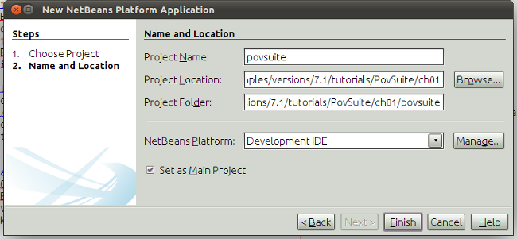

// 
//     Licensed to the Apache Software Foundation (ASF) under one
//     or more contributor license agreements.  See the NOTICE file
//     distributed with this work for additional information
//     regarding copyright ownership.  The ASF licenses this file
//     to you under the Apache License, Version 2.0 (the
//     "License"); you may not use this file except in compliance
//     with the License.  You may obtain a copy of the License at
// 
//       http://www.apache.org/licenses/LICENSE-2.0
// 
//     Unless required by applicable law or agreed to in writing,
//     software distributed under the License is distributed on an
//     "AS IS" BASIS, WITHOUT WARRANTIES OR CONDITIONS OF ANY
//     KIND, either express or implied.  See the License for the
//     specific language governing permissions and limitations
//     under the License.
//

= Writing POV-Ray Support for NetBeans I—Application Structure &amp; File Support
:jbake-type: platform_tutorial
:jbake-tags: tutorials 
:jbake-status: published
:syntax: true
:source-highlighter: pygments
:toc: left
:toc-title:
:icons: font
:experimental:
:description: Writing POV-Ray Support for NetBeans I—Application Structure &amp; File Support - Apache NetBeans
:keywords: Apache NetBeans Platform, Platform Tutorials, Writing POV-Ray Support for NetBeans I—Application Structure &amp; File Support

The POV-Ray tutorial is an advanced NetBeans Platform tutorial showing how to build an application for rendering POV-Ray files. In the process of creating the application, you will build on top of your existing NetBeans Platform knowledge, extending that knowledge into new areas, such as modular intercommunication and API design. You will touch upon many NetBeans APIs and learn how their best features can be combined in the creation of a real application.

NOTE:  For a quick visual impression of the application you'll be creating, see the screenshot in the  link:nbm-povray-10.html[Conclusion] of this tutorial.

link:http://povray.org[POV-Ray]—the Persistence Of Vision Raytracer—is an open-source 3D rendering engine and one that only a programmer could love. Rather than having a graphical modeling tool, it is based around a _scene_ language which is "compiled" into an image.

* Part 1: Application Structure &amp; File Support
* Part 2:  link:nbm-povray-2.html[Project Type Design]
* Part 3:  link:nbm-povray-3.html[Implementing a Project Type]
* Part 4:  link:nbm-povray-4.html[Providing Project Templates]
* Part 5:  link:nbm-povray-5.html[Creating an API]
* Part 6:  link:nbm-povray-6.html[Implementing the API]
* Part 7:  link:nbm-povray-7.html[Support For Running POV-Ray]
* Part 8:  link:nbm-povray-8.html[Implementing ViewService and its Actions]
* Part 9:  link:nbm-povray-9.html[Build Support]
* Part 10:  link:nbm-povray-10.html[Conclusion]

For troubleshooting purposes, you can download the code sources of this tutorial here:

link:http://web.archive.org/web/20170409072842/http://java.net/projects/nb-api-samples/show/versions/7.1/tutorials/PovSuite[http://java.net/projects/nb-api-samples/sources/api-samples/show/versions/7.1/tutorials/PovSuite]

NOTE:  If you haven't developed a NetBeans Platform application before, you are advised to work through several other tutorials before working on this one—doing so will familiarize you with the basic concepts presented here. Particularly recommended are:

* * link:http://wiki.netbeans.org/NbmIdioms[Introduction to NetBeans Idioms and Infrastructure]*—covers a lot of the concepts you will encounter here
* * link:https://netbeans.apache.org/tutorials/nbm-quick-start.html[NetBeans Platform Quick Start]*—the essential starting point for anyone interested in working with the NetBeans Platform
* * link:https://netbeans.apache.org/tutorials/nbm-selection-1.html[Selection in NetBeans]*—not directly relevant to writing project types, which is the focus of this tutorial, but will familiarize you with using the Lookup API which pops up in a number of places here
* * link:https://netbeans.apache.org/tutorials/nbm-filetype.html[File Type]*—the tutorial describing how new file types are supported in the NetBeans Platform
*  link:https://netbeans.apache.org/wiki/[NetBeans Developer FAQ]—contains essential definitions and descriptions of API classes and concepts, and how to perform the typical tasks you will need to do when using the NetBeans Platform

== Creating the Application and Modules

Since support for POV-Ray will be made up of multiple modules, we will start by creating a "NetBeans Platform Application" container, which holds multiple interdependent modules, while providing a subset of NetBeans modules containing features common to most desktop applications. Then we will walk through creating two modules. The first implements support for  link:http://povray.org[POV-Ray Scene Files]. The second provides a POV-Ray project type, and allows scene files to be rendered into image files.

[start=1]
1. Select File > New Project from the main menu. In the New Project dialog, select NetBeans Modules > NetBeans Platform Application and click Next or press Enter:

image::images/povray_71_ch1_pic-1.png[]

[start=2]
1. Name the suite "povsuite" on the next screen, choose a location on your hard disk to put it.

Then press Enter or click Finish.

=== Creating the  ``povfile``  Module Project

Now we will create the first module for our suite—support for `.pov` files—POV-Ray scene language files.

[start=1]
1. Select File > New Project again from the main menu.

[start=2]
1. This time, select NetBeans Modules > Module in the New Project wizard, and click Next or press Enter.

[start=3]
1. On the next page of the wizard, give the module the project name "povfile" and then click Next.

[start=4]
1. Now specify, for code name base, "org.netbeans.examples.modules.povfile" and the display name "Povray File Support".

[start=5]
1. Click Finish or press Enter to create the project. It should automatically be added to the application we just created.

=== Creating the  ``povproject``  Module Project

We will now repeat the last few steps to create another project, in which we will implement a special POV-Ray project type, whose compile actions will generate an image from a scene file.

[start=1]
1. Select File > New Project again from the main menu.

[start=2]
1. This time, select NetBeans Modules > Module in the New Project wizard, and click Next or press Enter.

[start=3]
1. On the next page of the wizard, give the module the project name "povproject" and then click Next.

[start=4]
1. On the next page of the wizard, give the module the code name "org.netbeans.examples.modules.povproject" and the display name "Povray Projects".

[start=5]
1. Click Finish or press Enter to create the project. It should automatically be added to the application we just created.

Your application should now look as follows:

image::images/povray_71_ch1_pic-3.png[]

== Creating a File Type—Basic Support for .pov Files

The first thing we will want to create is basic support that enables NetBeans to recognize .pov files and open them in the editor—which will give us a place to hang Actions, provide special icons, and other special support specific to .pov files.

A ` link:https://netbeans.apache.org/wiki/devfaqdataloader[DataLoader]` is a factory which is registered against a particular MIME type or file extension. It creates ` link:https://netbeans.apache.org/wiki/devfaqdataobject[DataObject]`s—typically one per file. So, when you expand a folder in the Projects or Files tab in the IDE, what happens under the hood is that all of the files in the folder you expanded are found, and for each file, the system locates the `DataLoader` for its file type and asks it to create a `DataObject` for it.

`DataObject`s contain logic that enables them to actually parse or understand a files contents, or know what to do with that particular type of file. So there is a 1:1 mapping between files and `DataObjects` and a 1:1 mapping between _file types_ and `DataLoader`s.

NetBeans IDE has a template called "File Type" that makes it very easy to generate basic support for a new file type:

[start=1]
1. Expand the Povray File Support Module and its Source Packages subnode.

[start=2]
1. Right-click the package `org.netbeans.examples.modules.povfile` and choose New > Other from the popup menu.

[start=3]
1. 
Select NetBeans Module Development > File Type in the New File wizard:

image::images/povray_71_ch1_pic-4.png[]

Click Next or press Enter.

[start=4]
1. On the next screen, you are asked to supply a MIME type and a file extension. Enter "text/x-povray" for the MIME type, and two file extensions, ".pov,.inc" for the file extensions:

image::images/povray_71_ch1_pic-5.png[]

Click Next or press Enter.

[start=5]
1. On the next screen, you are asked to supply a prefix for a the names of several Java classes that will be generated. Enter "Povray". This screen also requests an icon. Any 16x16 gif or png will do, or you can use 
[.feature]
--
image::images/povray_povicon.gif[role="left", link="images/povray_povicon.gif"]
--
.

image::images/povray_71_ch1_pic-6.png[]

When you have entered the icon and the name, press Enter or click Finish and the IDE will generate the Java classes and metadata files needed for basic POV-Ray file support in NetBeans.

You should now have the following file structure in the `povfile` package:

image::images/povray_71_ch1_pic-7.png[]

* `*org.netbeans.examples.modules.povfile/*`
* `*Bundle.properties*` A resource bundle for miscellaneous localized strings
* `*PovrayDataObject.java*` This is the object that understands what a .pov file is. If we were to provide advanced support for POV-Ray files, we would probably parse those files here, and provide some sort of model of the structure of the file that could be shown in Navigator or manipulated programmatically
* `*PovrayResolver.xml*` This is a small bit of XML that declares that `.pov` and `.inc` files map to the MIME type `text/x-povray` (which we have invented for purposes of this tutorial). This XML file is referenced from the module's `layer.xml` file.
* `*PovrayTemplate.pov*` This is an empty template POV-Ray file which can be modified and will be used as the basis of new POV-Ray files in the New File wizard
* `*layer.xml*` A module layer file which allows the module to install some objects declaratively.
* `*povicon.gif*` The icon you chose in the wizard, which will appear on editor tabs for `.pov` and `.inc` files

At this point we have basic support for POV-Ray files—if you right-click the module suite and click Run, NetBeans will install with both of the modules installed—and if you create a fake `.pov` file in your home directory and then browse, for example, in the Favorites tab (Window > Favorites from the main menu), you will see that it is indeed recognized by NetBeans, and has the icon that you specified.

== Next Steps

The  link:nbm-povray-2.html[next section] will cover designing and planning our project type and file support and how they will interrelate.

