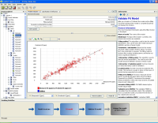
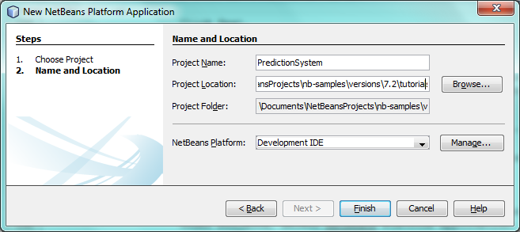
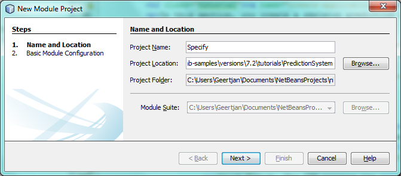

// 
//     Licensed to the Apache Software Foundation (ASF) under one
//     or more contributor license agreements.  See the NOTICE file
//     distributed with this work for additional information
//     regarding copyright ownership.  The ASF licenses this file
//     to you under the Apache License, Version 2.0 (the
//     "License"); you may not use this file except in compliance
//     with the License.  You may obtain a copy of the License at
// 
//       http://www.apache.org/licenses/LICENSE-2.0
// 
//     Unless required by applicable law or agreed to in writing,
//     software distributed under the License is distributed on an
//     "AS IS" BASIS, WITHOUT WARRANTIES OR CONDITIONS OF ANY
//     KIND, either express or implied.  See the License for the
//     specific language governing permissions and limitations
//     under the License.
//

= NetBeans Platform Workflow Tutorial
:jbake-type: platform_tutorial
:jbake-tags: tutorials 
:jbake-status: published
:syntax: true
:source-highlighter: pygments
:toc: left
:toc-title:
:icons: font
:experimental:
:description: NetBeans Platform Workflow Tutorial - Apache NetBeans
:keywords: Apache NetBeans Platform, Platform Tutorials, NetBeans Platform Workflow Tutorial

In this tutorial, you are shown how to create a pluggable infrastructure as the basis for a workflow application. In workflow applications, the user is guided through a sequence of steps provided by multiple GUI components, ending with a final product of some kind.

Here are two examples of workflow applications.

* *EasyDoe Toolsuite.* A workflow created by IAV in Berlin, Germany, for control units of calibration engines, using a method called Design of Experiments. The workflow guides the user through the whole process, starting at defining the task, making a test plan, importing data, making a mathematical model from the data, using the model in optimizations and calibrate maps that are directly exported to the engine control units.

[.feature]
--

--

* *Limits.* A reservoir engineering tool created by Object Reservoir, in Austin, Texas, for shale gas and unconventional reservoirs. Limits uses readily available and routinely collected pressure and rate data to determine feasible ranges of physical reservoir and completion parameters in order to estimate the uncertainty in the future performance of the well.

[.feature]
--
image::images/workflow_72_objectreservoir_thumb.jpg[role="left", link="https://netbeans.org/images_www/screenshots/platform/objectreservoir.jpg"]
--

In this tutorial, we imagine we're creating a prediction system consisting of three steps, "specify", "diagnose", and "forecast". Each step in the sequence is supported by a "canvas", which consists of multiple "windows". The user switches from canvas to canvas via a control panel. Changes made by the user to the size and position of windows in a canvas are automatically stored on disk and are automatically available upon restarts of the application.

NOTE:  This document uses NetBeans IDE 8.0 and NetBeans Platform 8.0. If you are using an earlier version, see  link:74/nbm-workflow.html[the previous version of this document].

For troubleshooting purposes, you are welcome to download the  link:http://web.archive.org/web/20170409072842/http://java.net/projects/nb-api-samples/show/versions/8.0/tutorials/PredictionSystem[completed tutorial source code].

== Creating the Application

In this section, you create a skeleton prediction system, consisting of the NetBeans Platform.

[start=1]
1. Choose File > New Project (Ctrl+Shift+N). Under Categories, select NetBeans Modules. Under Projects, select NetBeans Platform Application: 
image::images/javafx_72_new-app-1.png[] Click Next.

[start=2]
1. In the Name and Location panel:
* In the Project Name field, type  ``PredictionSystem`` .
* In the Project Location field, change the value to any directory on your computer where the application will be stored.

 

Click Finish. The IDE creates the  ``PredictionSystem``  project:

image::images/workflow_72_new-app.png[]

[start=3]
1. Right-click the application and choose Run. The application starts up, showing a default splash screen. Once the application has started, open some windows, browse through the menu bar and toolbar, and generally investigate the features that your application already has. 
image::images/workflow_72_new-app-2.png[] 

You now have a basic application containing a lot of functionality. In the next section, we create the canvases.

== Creating the Canvases

In this section, you create support for the steps in the workflow, each of which consist of a canvas containing one or more windows.

=== Creating the Modular Structure

In this section, you create a new module for each step in the sequence.

[start=1]
1. Right-click the application's Modules node and choose Add New: 
image::images/workflow_72_new-canvas-1.png[] Click Next.

[start=2]
1. Set  ``Specify``  as the project name and leave the other values unchanged: 
 Click Next.

[start=3]
1. Set  ``org.prediction.specify``  as the module's code name base and set  ``Specify``  as the display name: 
image::images/workflow_72_new-canvas-3.png[] Click Finish. You now have your first custom module, named "Specify", for the code relating to the specify step: 
image::images/workflow_72_new-canvas-4.png[]

[start=4]
1. Repeat the three steps above twice, to create modules for the steps "diagnose" and "forecast": 
image::images/workflow_72_new-canvas-5.png[]

You now have a modular structure on top of the NetBeans Platform. Each module will provide the code for one step in the workflow.

=== Creating the Windows

In this section, you create the windows that define the canvases.

[start=1]
1. Right-click the  ``org.prediction.specify``  package and choose New | Other | Module Development and then choose Window: 
image::images/workflow_72_new-window-1.png[] Click Next.

[start=2]
1. Choose a window position, that is, the place in the application frame where the window will be displayed, and set Open on Application Start so that the window will open as soon as the application has started up: 
image::images/workflow_72_new-window-2.png[] Click Next.

[start=3]
1. Set  ``SpecifyOne``  (or another suitable name) as the class name prefix: 
image::images/workflow_72_new-window-3.png[] Click Finish. You now have your first window, named "SpecifyOneTopComponent", for the code relating to one of the windows in the specify step: 
image::images/workflow_72_new-window-4.png[]

[start=4]
1. 
In the source code of the window, assign the window to its role, as follows, by adding  ``roles={"specify"}``  in the  ``@TopComponent.Registration``  annotation:

[source,java]
----

@TopComponent.Registration(*roles={"specify"},* mode = "editor", openAtStartup = true)
----

[start=5]
1. Repeat the four steps above several times, to create several windows in each module, each window registered to the role for which you created the module. Each canvas is defined by multiple windows, some canvases will have more windows, while others have less. Dependending on the needs of each canvas, create the required windows accordingly, with appropriate names: 
image::images/workflow_72_new-window-5.png[]

You now have three modules, each containing a canvas defined by one or more windows. In the next section, we create a controler mechanism so that the user can switch from canvas to canvas.

== Creating the Controler Mechanism

In this section, you create a controler mechanism for switching between roles.

[start=1]
1. As before, create a module in the application. Name it  ``Control`` : 
image::images/workflow_72_new-control-1.png[] 

Click Next.

[start=2]
1. Set  ``org.prediction.control``  as the code name base: 
image::images/workflow_72_new-control-2.png[] 

Click Finish. You now have a Control module, together with the three canvas modules you already had:

image::images/workflow_72_new-control-3.png[]

[start=3]
1. In the Control module, right-click the Libraries node, and choose Add Module Dependency. Set a new module dependency on the Module System API and the Window System API.

[start=4]
1. Create a new Java class named  ``Installer``  in the package  ``org.prediction.control`` . Define it as follows and click the links for further information:

[source,java]
----

package org.prediction.control;

import  link:http://bits.netbeans.org/dev/javadoc/org-openide-modules/org/openide/modules/OnStart.html[org.openide.modules.OnStart];
import org.openide.windows.WindowManager;
import org.openide.windows.WindowSystemEvent;
import  link:http://bits.netbeans.org/dev/javadoc/org-openide-windows/org/openide/windows/WindowSystemListener.html[org.openide.windows.WindowSystemListener];

link:http://bits.netbeans.org/dev/javadoc/org-openide-modules/org/openide/modules/OnStart.html[@OnStart]
public class Installer implements Runnable,  link:http://bits.netbeans.org/dev/javadoc/org-openide-windows/org/openide/windows/WindowSystemListener.html[WindowSystemListener]  {

    @Override
    public void run() {
        WindowManager.getDefault().addWindowSystemListener(this);
    }

    @Override
    public void beforeLoad(WindowSystemEvent wse) {
link:http://bits.netbeans.org/dev/javadoc/org-openide-windows/org/openide/windows/WindowManager.html#setRole(java.lang.String)[WindowManager.getDefault().setRole("specify")];
        WindowManager.getDefault().removeWindowSystemListener(this);
    }

    @Override
    public void afterLoad(WindowSystemEvent wse) {
    }

    @Override
    public void beforeSave(WindowSystemEvent wse) {
    }

    @Override
    public void afterSave(WindowSystemEvent wse) {
    }
    
}
----

[start=5]
1. In each window, delete the  ``@ActionID`` ,  ``@ActionReference`` , and  ``@TopComponent.OpenActionRegistration``  annotations because, instead of menu items for opening individual windows, you´re going to create a controler to open canvases, using one or more of the mechanisms described below.

=== Creating a Menu Based Controler Mechanism

In this section, you create new menu items to control switching between canvases.

In each canvas module, create an ActionListener such as the below for switching between roles. The example below is for the specify role, create the same class in the other two modules, changing "specify" to "diagnose" and "forecast" for the other modules.

[source,java]
----

package org.prediction.specify;

import java.awt.event.ActionEvent;
import java.awt.event.ActionListener;
import  link:http://bits.netbeans.org/dev/javadoc/org-openide-awt/org/openide/awt/ActionID.html[org.openide.awt.ActionID];
import  link:http://bits.netbeans.org/dev/javadoc/org-openide-awt/org/openide/awt/ActionReference.html[org.openide.awt.ActionReference];
import  link:http://bits.netbeans.org/dev/javadoc/org-openide-awt/org/openide/awt/ActionRegistration.html[org.openide.awt.ActionRegistration];
import  link:http://bits.netbeans.org/dev/javadoc/org-openide-util/org/openide/util/NbBundle.Messages.html[org.openide.util.NbBundle.Messages];
import org.openide.windows.WindowManager;

link:http://bits.netbeans.org/dev/javadoc/org-openide-awt/org/openide/awt/ActionID.html[@ActionID](
        category = "Window",
        id = "org.prediction.specify.SwitchToSpecifyRole")
link:http://bits.netbeans.org/dev/javadoc/org-openide-awt/org/openide/awt/ActionRegistration.html[@ActionRegistration](
        displayName = "#CTL_SwitchToSpecifyRole")
link:http://bits.netbeans.org/dev/javadoc/org-openide-awt/org/openide/awt/ActionReference.html[@ActionReference](
        path = "Menu/Window", 
        position = 250)
link:http://bits.netbeans.org/dev/javadoc/org-openide-util/org/openide/util/NbBundle.Messages.html[@Messages]("CTL_SwitchToSpecifyRole=Switch to Specify Role")
public final class SwitchToSpecifyRole implements ActionListener {

    @Override
    public void actionPerformed(ActionEvent e) {
link:http://bits.netbeans.org/dev/javadoc/org-openide-windows/org/openide/windows/WindowManager.html#setRole(java.lang.String)[WindowManager.getDefault().setRole("specify")];
    }
    
}
----

You now have a controler mechanism, defined by a set of actions, invoked from menu items in the Window menu, for switching between roles.

image::images/workflow_72_new-canvas-6.png[] 

You also have an installer class which sets the initial role in the application.

=== Creating a Window Based Controler Mechanism

In this section, you create a new window to control switching between canvases.

In the Control module, create a new  ``TopComponent`` , with  ``WorkflowControl``  as the class name prefix. Add a dependency on the File System API and define the constructor of the  ``TopComponent``  as follows. Also make sure that the "category" of each  ``ActionListener``  defined in the previous section is set to "Predict".

[source,java]
----

public WorkflowControlTopComponent() {
    initComponents();
    setName(Bundle.CTL_WorkflowControlTopComponent());
    setToolTipText(Bundle.HINT_WorkflowControlTopComponent());
    setLayout(new FlowLayout(FlowLayout.LEFT, 14, 10));
    for (FileObject fo : FileUtil.getConfigFile("Actions/Predict").getChildren()) {
        Action action = FileUtil.getConfigObject(fo.getPath(), Action.class);
        JButton button = new JButton(action);
        button.setPreferredSize(new Dimension(150,100));
        add(button);
    }
}
----

You now have a controler mechanism, defined by a set of buttons in a TopComponent for switching between roles.

image::images/workflow_72_new-control-4.png[] 

You also have an installer class which sets the initial role in the application.

The tutorial is complete. You have created a modular application on the NetBeans Platform, providing the infrastructure for a workflow application.

link:http://netbeans.apache.org/community/mailing-lists.html[ Send Us Your Feedback]

