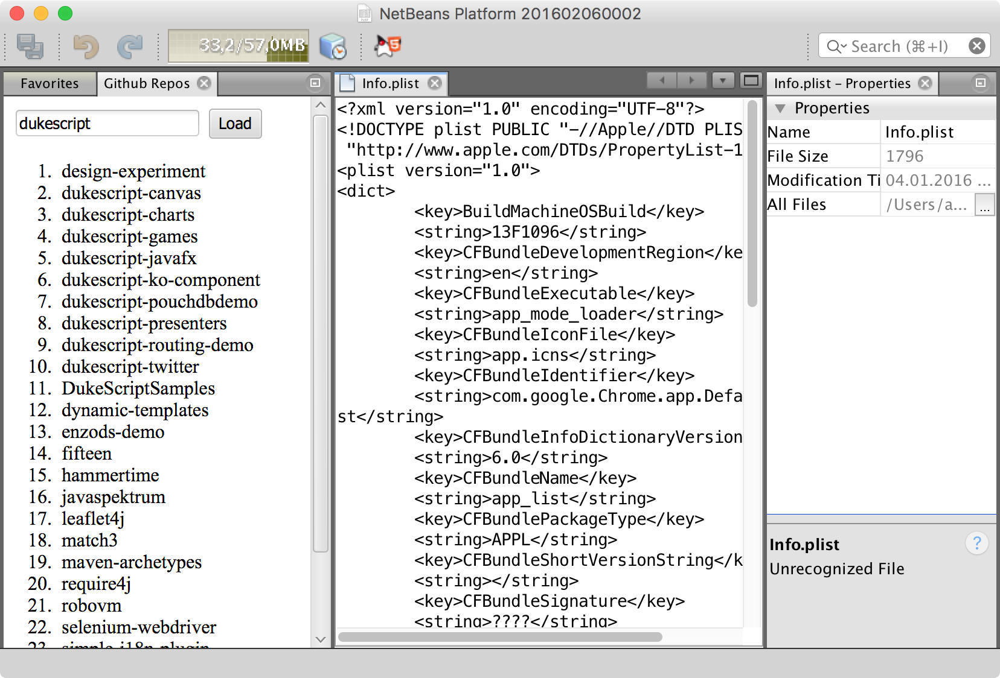
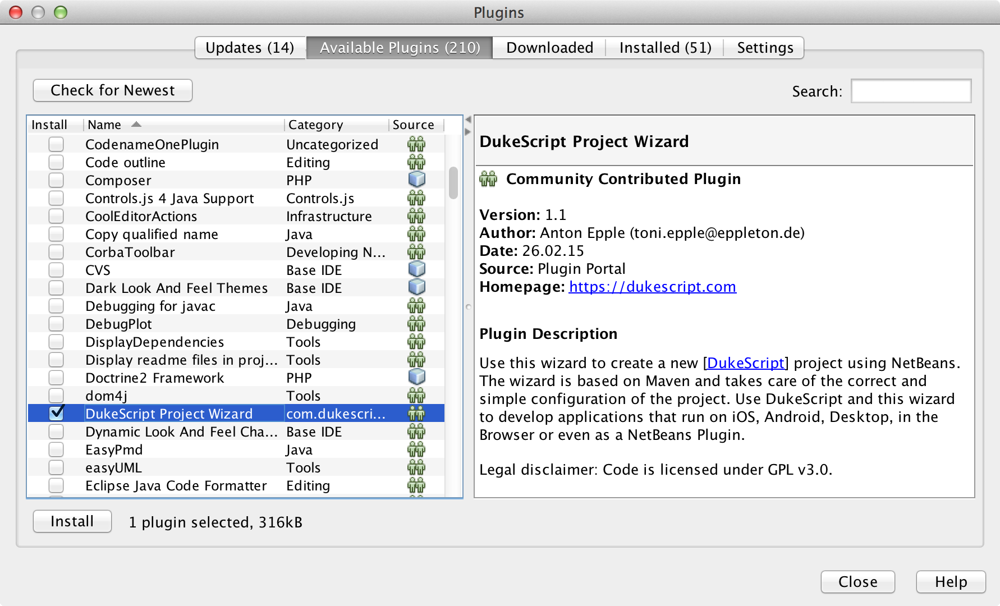
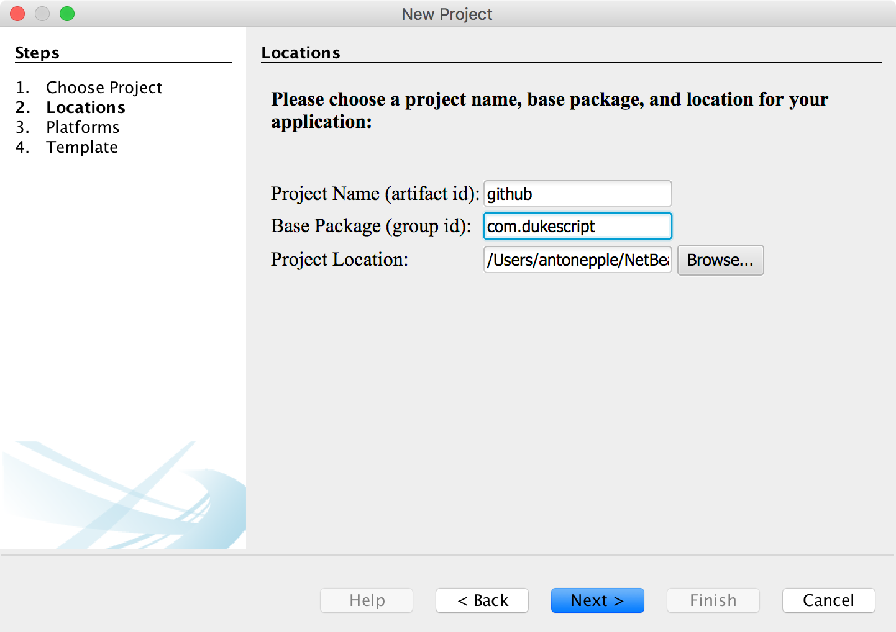

// 
//     Licensed to the Apache Software Foundation (ASF) under one
//     or more contributor license agreements.  See the NOTICE file
//     distributed with this work for additional information
//     regarding copyright ownership.  The ASF licenses this file
//     to you under the Apache License, Version 2.0 (the
//     "License"); you may not use this file except in compliance
//     with the License.  You may obtain a copy of the License at
// 
//       http://www.apache.org/licenses/LICENSE-2.0
// 
//     Unless required by applicable law or agreed to in writing,
//     software distributed under the License is distributed on an
//     "AS IS" BASIS, WITHOUT WARRANTIES OR CONDITIONS OF ANY
//     KIND, either express or implied.  See the License for the
//     specific language governing permissions and limitations
//     under the License.
//

= NetBeans Platform Plugins with DukeScript
:jbake-type: platform_tutorial
:jbake-tags: tutorials 
:jbake-status: published
:syntax: true
:source-highlighter: pygments
:toc: left
:toc-title:
:icons: font
:experimental:
:description: NetBeans Platform Plugins with DukeScript - Apache NetBeans
:keywords: Apache NetBeans Platform, Platform Tutorials, NetBeans Platform Plugins with DukeScript

Welcome to a new era for NetBeans plugin development!

This tutorial shows you how you can use the  link:https://bits.netbeans.org/html+java/1.2.3/index.html[html4java API] (aka DukeScript) to create NetBeans Plugins. This API allows you to define your view using HTML 5, and code the view logic in Java. After completing this tutorial, you'll be able to create Plugins for the NetBeans IDE, or for your NetBeans Platform Application with this new Technology.

After you finish this tutorial, you can move on to the  link:https://dukescript.com/documentation.html[DukeScript Library]. This page provides comprehensive documentation of the DukeScript APIs and many helpful tutorials.

NOTE:  This document uses NetBeans IDE 8.1 and NetBeans Platform 8.1.

For troubleshooting purposes, the complete project is available for download on Github:  link:https://github.com/dukescript/github-nb-plugin[Tutorial source code].

The Window you create in this tutorial will look as follows:

When the user enters a Github username in the input field, the window displays a list of projects of this user.

== The Github REST API

We'll use the  link:https://developer.github.com/v3/[Github REST API] to provide the data for our tutorial. The following command lists all repositories for a github account (actually the Jersey JAX-RS developers account): 

[source,shell]
----

$ curl https://api.github.com/users/jersey/repos
----

The ouput of this query has the following format: 

[source,java]
----

[
  {
    "id": 6109440,
    "name": "hol-sse-websocket",
    "full_name": "jersey/hol-sse-websocket",
    "owner": {
      "login": "jersey",
      "id": 399710,
      "avatar_url": "https://avatars.githubusercontent.com/u/399710?v=3",
      "gravatar_id": "",
      "url": "https://api.github.com/users/jersey",
      "html_url": "https://github.com/jersey",
      "followers_url": "https://api.github.com/users/jersey/followers",
      "following_url": "https://api.github.com/users/jersey/following{/other_user}",
      "gists_url": "https://api.github.com/users/jersey/gists{/gist_id}",
      "starred_url": "https://api.github.com/users/jersey/starred{/owner}{/repo}",
      "subscriptions_url": "https://api.github.com/users/jersey/subscriptions",
      "organizations_url": "https://api.github.com/users/jersey/orgs",
      "repos_url": "https://api.github.com/users/jersey/repos",
      "events_url": "https://api.github.com/users/jersey/events{/privacy}",
      "received_events_url": "https://api.github.com/users/jersey/received_events",
      "type": "Organization",
      "site_admin": false
    },
    "private": false,
    "html_url": "https://github.com/jersey/hol-sse-websocket",
    "description": "Hands-on-lab on using server-sent events and web socket with Jersey and Tyrus.",
    "fork": false,
    "url": "https://api.github.com/repos/jersey/hol-sse-websocket",
    "forks_url": "https://api.github.com/repos/jersey/hol-sse-websocket/forks",
    "keys_url": "https://api.github.com/repos/jersey/hol-sse-websocket/keys{/key_id}",
    "collaborators_url": "https://api.github.com/repos/jersey/hol-sse-websocket/collaborators{/collaborator}",
    "teams_url": "https://api.github.com/repos/jersey/hol-sse-websocket/teams",
    "hooks_url": "https://api.github.com/repos/jersey/hol-sse-websocket/hooks",
    "issue_events_url": "https://api.github.com/repos/jersey/hol-sse-websocket/issues/events{/number}",
    "events_url": "https://api.github.com/repos/jersey/hol-sse-websocket/events",
    "assignees_url": "https://api.github.com/repos/jersey/hol-sse-websocket/assignees{/user}",
    "branches_url": "https://api.github.com/repos/jersey/hol-sse-websocket/branches{/branch}",
    "tags_url": "https://api.github.com/repos/jersey/hol-sse-websocket/tags",
    "blobs_url": "https://api.github.com/repos/jersey/hol-sse-websocket/git/blobs{/sha}",
    "git_tags_url": "https://api.github.com/repos/jersey/hol-sse-websocket/git/tags{/sha}",
    "git_refs_url": "https://api.github.com/repos/jersey/hol-sse-websocket/git/refs{/sha}",
    "trees_url": "https://api.github.com/repos/jersey/hol-sse-websocket/git/trees{/sha}",
    "statuses_url": "https://api.github.com/repos/jersey/hol-sse-websocket/statuses/{sha}",
    "languages_url": "https://api.github.com/repos/jersey/hol-sse-websocket/languages",
    "stargazers_url": "https://api.github.com/repos/jersey/hol-sse-websocket/stargazers",
    "contributors_url": "https://api.github.com/repos/jersey/hol-sse-websocket/contributors",
    "subscribers_url": "https://api.github.com/repos/jersey/hol-sse-websocket/subscribers",
    "subscription_url": "https://api.github.com/repos/jersey/hol-sse-websocket/subscription",
    "commits_url": "https://api.github.com/repos/jersey/hol-sse-websocket/commits{/sha}",
    "git_commits_url": "https://api.github.com/repos/jersey/hol-sse-websocket/git/commits{/sha}",
    "comments_url": "https://api.github.com/repos/jersey/hol-sse-websocket/comments{/number}",
    "issue_comment_url": "https://api.github.com/repos/jersey/hol-sse-websocket/issues/comments/{number}",
    "contents_url": "https://api.github.com/repos/jersey/hol-sse-websocket/contents/{+path}",
    "compare_url": "https://api.github.com/repos/jersey/hol-sse-websocket/compare/{base}...{head}",
    "merges_url": "https://api.github.com/repos/jersey/hol-sse-websocket/merges",
    "archive_url": "https://api.github.com/repos/jersey/hol-sse-websocket/{archive_format}{/ref}",
    "downloads_url": "https://api.github.com/repos/jersey/hol-sse-websocket/downloads",
    "issues_url": "https://api.github.com/repos/jersey/hol-sse-websocket/issues{/number}",
    "pulls_url": "https://api.github.com/repos/jersey/hol-sse-websocket/pulls{/number}",
    "milestones_url": "https://api.github.com/repos/jersey/hol-sse-websocket/milestones{/number}",
    "notifications_url": "https://api.github.com/repos/jersey/hol-sse-websocket/notifications{?since,all,participating}",
    "labels_url": "https://api.github.com/repos/jersey/hol-sse-websocket/labels{/name}",
    "releases_url": "https://api.github.com/repos/jersey/hol-sse-websocket/releases{/id}",
    "created_at": "2012-10-07T04:44:32Z",
    "updated_at": "2014-06-29T22:29:42Z",
    "pushed_at": "2013-05-29T16:56:03Z",
    "git_url": "git://github.com/jersey/hol-sse-websocket.git",
    "ssh_url": "git@github.com:jersey/hol-sse-websocket.git",
    "clone_url": "https://github.com/jersey/hol-sse-websocket.git",
    "svn_url": "https://github.com/jersey/hol-sse-websocket",
    "homepage": null,
    "size": 7750,
    "stargazers_count": 11,
    "watchers_count": 11,
    "language": "Java",
    "has_issues": true,
    "has_downloads": true,
    "has_wiki": true,
    "has_pages": false,
    "forks_count": 5,
    "mirror_url": null,
    "open_issues_count": 1,
    "forks": 5,
    "open_issues": 1,
    "watchers": 11,
    "default_branch": "master"
  },
  {
     "etc." : "etc."
  }
]
----

== Installing the Plugin

Before we start coding we'll install a Plugin that helps us develop applications with DukeScript.

[start=1]
1. Go to Tools/Plugins, refresh the catalog, select available plugins tab and install *DukeScript Project Wizard*. 
 This will require a restart of the IDE.

After that, you'll have a handy wizard that helps you create a new project. We'll use it to create our demo project in the next section. 
Under the hood this wizard uses Maven to create a project from an Archetype. Alternatively you can also use the Maven Archetypes directly from the command line:

[source,java]
----

mvn archetype:generate 
-DarchetypeGroupId=com.dukescript.archetype
-DarchetypeArtifactId=knockout4j-archetype 
-DarchetypeVersion=0.11
----

The archetype can generate subprojects for each of the supported platforms. Currently we support iOS, Desktop (via JavaFX), Android, NetBeans plugin, and Browser (via bck2brwsr). The JavaFX-based project will always be generated, as this is integrated with the NetBeans visual debugger and the other debugging functions. The other subprojects are only generated on demand using these properties: 
Run in Browser:
 ``-Dwebpath=client-web``  
Create NetBeans Module:
 ``-Dnetbeanspath=client-netbeans``  
Create iOS project:
 ``-Diospath=client-ios ``  
Create Android project:
 ``-Dandroidpath=client-android`` 

== Create the Project(s)

[start=1]
1. Now create new project (*File | New Project...*). In the New Project Wizard switch to category *DukeScript*. Choose the template *DukeScript Application*: 
image::images/dukescript1.jpg[] Click Next.

[start=2]
1. In Step 2 you need to specify the location where to create your project and the Maven coordinates.
 Click Next.

[start=3]
1. The next wizard steps ask to what platforms you would like to deploy. The options are Android, iOS, Browser and NetBeans Plugin. In addition to that a Desktop Client will automatically created for you. This is the one that is used for testing and debugging. Select "Run as NetBeans Plugin" in this step:
image::images/wizard_4.png[] 

[start=4]
1. In Step 4 you can choose between the available project templates. Let's go for the simplest one *Knockout 4 Java Maven Archetype*. In this step you can also choose to install some sample code. But for this tutorial we'll start from scratch: 
image::images/wizard_5.png[] Click Finish.

The Maven archetype will create a parent project, that contains several subprojects. There's always the "General Client Code". This is the project that contains the actual source Java code. Use this to develop, test and debug your project. There's also a separate project for JavaScript Libraries. The code in here makes calls to JavaScript and back, which is sometimes necessary to achieve what you want.

image::images/subprojects.png[] 

A "project" is a NetBeans IDE compilation/deployment unit. It contains a Maven POM file, which on disk is named "pom.xml". This is a configuration file that contains all information required for compiling and running the project. The project contains all of your sources. The project opens in the IDE. You can view its logical structure in the Projects window (Ctrl+1) and its file structure in the Files window (Ctrl+2).

For each target platform you selected in the wizard, there will also be a project. These projects can be used to deploy and test the project on the individual platforms. In NetBeans each of the projects context menu has a submenu "custom" with entries that apply only to the deployment platform. For example the iOS project has an entry that allows you to run in an iPad simulator or deploy to a real iOS device, while the Android project has entries for running on an attached Android device.

In our tutorial, we have created a subproject that creates a NetBeans plugin. If you run it, it will start your plugin inside the core NetBeans Platform. It will also create an  ``nbm file`` , that you can use to install the plugin in the IDE.

After the projects were created, NetBeans will immediately start an initial build and downloads all required dependencies.

== Coding the Module

In order to create our Github Tool, you need to complete the following steps:

* <<code-logic,Code the View Logic>>
* <<code-view,Create the View>>

=== Code the View Logic

DukeScript allows developers a clean separation of view and view logic. The view is defined in HTML, the logic is written in Java. With this approach you can write and test the logic independent of the view. We'll start by coding the logic of our application. The view will be added later.

In this section, you'll use the  link:https://bits.netbeans.org/html4j/1.0/net/java/html/json/Model.html[@Model] annotation to create the view logic of our application. You'll learn how to connect a model to the Github REST API.

NOTE:  In this section we will create a Java class with annotations. At compile-time, another Java class is generated from these annotations. This saves us a from writing a lot of setters, getters and other boilerplate code. If you're interested in having a look at the generated code, you can find it in your project in Folder "Generated Sources (annotations)."

[start=1]
1. In project "github General Client Code" -> "Source Packages" open the class  ``DataModel.java``  in the editor: 

[source,java]
----

package com.dukescript.github;

import net.java.html.json.Model;

@Model(className = "Data", targetId="", properties = {
})
final class DataModel {
    private static Data ui;
    /**
     * Called when the page is ready.
     */
    static void onPageLoad() throws Exception {
        ui = new Data();
        ui.applyBindings();
    }
}
----

We will use this class to define our view logic. The  ``Model``  annotation defines the name of the model that will be generated, and it's properties. Currently there are no properties.

In your project open  ``Generated Sources (annotations)`` . You will find the class  ``Data.java``  that has been generated from the Annotation.

[start=2]
1. Change the value of attribute  ``className``  to "ViewModel". If you save the file, NetBeans will show some errors. It will underline all uses of class  ``Data`` . This is because the gerneated class is now named "ViewModel". Replace these occurrences with "ViewModel" to fix these problems.

[source,java]
----

package com.dukescript.github;

import net.java.html.json.Model;

@Model(className = "*ViewModel*", targetId="", properties = {
})
final class DataModel {
    private static *ViewModel* ui;
    /**
     * Called when the page is ready.
     */
    static void onPageLoad() throws Exception {
        ui = new *ViewModel*();
        ui.applyBindings();
    }
}
----

[start=3]
1. Now we'll add a property of type String for the Github username:

[source,java]
----

import net.java.html.json.Model;
import net.java.html.json.Property;

@Model(className = "ViewModel", targetId="", properties = {
    *@Property(name = "user", type=String.class)*
})
final class DataModel {
    private static ViewModel ui;
    /**
     * Called when the page is ready.
     */
    static void onPageLoad() throws Exception {
        ui = new ViewModel();
        ui.applyBindings();
    }
}
                        
----

When you save the file, it will automatically add a setter and a getter to the generated class. You can test it right away in method  ``onPageLoad``  :

[source,java]
----

    static void onPageLoad() throws Exception {
        ui = new ViewModel();
        *ui.setUser("dukescript");*
        ui.applyBindings();
    }
                        
----

[start=4]
1. Next we'll Model the information we want to get from Github:

[source,java]
----

@Model(className = "RepositoryInfo", properties = {
        @Property(name = "id", type = int.class),
        @Property(name = "name", type = String.class),
        @Property(name = "owner", type = Owner.class),
        @Property(name = "private", type = boolean.class)})
    static class RepositoryModel {
    }

    @Model(className = "Owner", properties = {
        @Property(name = "login", type = String.class)
    })
    static final class OwnerModel {
    }
----

The names of these properties were not chosen at random. If you have a look at the JSON message from github, you'll see that the structure and properties of our Model match some attribute names and the structure of the JSON message.

DukeScript can automatically parse JSON messages and map them to our Model class. That's what we'll utilize next.

[start=5]
1. Add a new property to ViewModel:

[source,java]
----

import java.util.List;
import net.java.html.json.Model;
import net.java.html.json.OnReceive;
import net.java.html.json.Property;

@Model(className = "ViewModel", targetId = "", properties = {
    @Property(name = "user", type = String.class),
    *@Property(name = "repositories", type = RepositoryInfo.class, array = true)*
})
final class DataModel {
    //... rest of the code
                        
----

Please note that the new property has the attribute  ``array``  set to true. This means there can be multiple instances of RepositoryInfo.

[start=6]
1. Now we'll add a method to connect to the REST API:

[source,java]
----

    *@OnReceive(url = "https://api.github.com/users/{name}/repos")*
    public static void connect(ViewModel vm, List<RepositoryInfo> repos) {
        vm.getRepositories().clear();
        vm.getRepositories().addAll(repos);
    }
                        
----

The method  ``connect``  is annotated with the annotation  link:https://bits.netbeans.org/html4j/1.0/net/java/html/json/OnReceive.html[@OnReceive] It will generate a new method of the same name in our ViewModel. The generated method has a parameter for the parts of the url enclosed in curly braces ({name}). When you call the method with a parameter, this will replace the  ``{name}``  to build the URL dynamically.

The generated method does a lot of magic for us. It will call the URL to retrieve the answer. The answer is in the JSON format you've seen above. In our connect method, we've declared that we want to receive a  ``List<RepositoryInfo> repos`` . Therefore the generated method will automatically parse the JSON message and map it to a list of RepositoryInfo Objects.

That's probably the easiest way to parse a JSON message.

[start=7]
1. Now we'll declare a function that calls our generated method:

[source,java]
----

*@Function*
public static void loadRepos(ViewModel vm){
    vm.connect(vm.getUser());
}
----

The annotation  link:images/images[@Function] makes this method callable from the view. For example from a button click. We'll use it in the next section.

In this section we have created the view logic of our application. We used the  ``@Model``  annotation to generate several model classes, and we've used  ``@OnReceive``  to connect to the Github REST API and read the repositories of a user. In the next section we'll create a view for our plugin.

=== Create the View

So far we created the view logic. Now we're ready to create the view. In DukeScript the view is defined as HTML. Inside of the HTML we use some special  ``data-bind``  attributes. With these attributes we establish a two-way binding between the view and the viewmodel.

[start=1]
1. Open file  ``index.html``  in the editor ( Web Pages | pages | index.html ). This is the (empty) view definition:

[source,html]
----

<!DOCTYPE html>
<html>
    <head>
        <title>Github Repositories</title>
        <meta http-equiv="Content-Type" content="text/html; charset=UTF-8">
    </head>
    <body>    
    </body>
</html>
                    
----

[start=2]
1. Add a text input field, a button and a list:

[source,html]
----

<!DOCTYPE html>
<html>
    <head>
        <title>Github Repositories</title>
        <meta http-equiv="Content-Type" content="text/html; charset=UTF-8">
    </head>
    <body>
        *<input type="text" >
        <button >Load</button>
        <ol >
            <li></li>
        </ol>*   
    </body>
</html>
----

[start=3]
1. To make this dynamic you need to bind the elements to the model using  ``data-bind``  attributes:

[source,html]
----

<!DOCTYPE html>
<html>
    <head>
        <title>Github Repositories</title>
        <meta http-equiv="Content-Type" content="text/html; charset=UTF-8">
    </head>
    <body>
        <input type="text" *data-bind="textInput: user"*>
        <button *data-bind="click: loadRepos"*>Load</button>
        <ol *data-bind="foreach: repositories"*>
            <li></li>
        </ol>
      
    </body>
</html>
----

The first binding  ``textInput``  binds the value of the input to the property  ``user``  of our model. Whenever the user types something in this textfield, the property  ``user``  will be updated and vice versa. The  ``click`` -binding on the button binds the click event to the function  ``loadRepos`` . When the user clicks the button the method  ``loadRepos``  will be called. The  ``foreach`` -binding is bound to the property  ``repositories``  of our model. For each entry in the array, it will copy the content of the enclosing element. That means, for each entry it will create a list item. For this list item the  ``RepositoryInfo``  will be the binding context.

That's the reason why here we can bind directly to the properties of  ``RepositoryInfo`` . The  ``text`` -binding simply binds the text of the span to the name property of the  ``RepositoryInfo`` .

For more information on the binding syntax, check out the  link:https://dukescript.com/knockout4j.html[documentation]. There's a comprehensive list of all available bindings.

[start=4]
1. Now run your application. When it runs enter a valid username in the input field. The ui will display a list of their repositories:

image::images/repos.png[] 

[start=5]
1. 
As a final step you should now run the application as a NetBeans Plugin. Switch to the project "github Client for NetBeans" and choose  ``run`` .

 

In this section you've learned how to define a view in HTML and how to bind it to the view model. The view is still very basic, but you can use CSS (and even JavaScript) to make it look nicer. The HTML-renderer we use is based on Webkit and it's pretty capable. We'll cover this in another tutorial.

You've reached the end of this tutorial. We hope you like this modern way for separating the view from the view model. By the way, you can also create applications for Android, iOS, and the Browser with this technology.

== See Also

This concludes the NetBeans Platform Plugins with DukeScript. This document has described how to create a plugin that displays github repositories for any github user. For more information about creating and developing applications with DukeScript, see the following resources:

*  link:https://dukescript.com[The DukeScript Website]
*  link:https://dukescript.com/blog.html[The DukeScript Blog]
*  link:https://bits.netbeans.org/html+java/1.2.3/index.html[NetBeans html4JavaAPI Javadoc]
