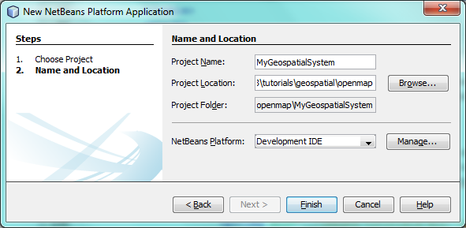

// 
//     Licensed to the Apache Software Foundation (ASF) under one
//     or more contributor license agreements.  See the NOTICE file
//     distributed with this work for additional information
//     regarding copyright ownership.  The ASF licenses this file
//     to you under the Apache License, Version 2.0 (the
//     "License"); you may not use this file except in compliance
//     with the License.  You may obtain a copy of the License at
// 
//       http://www.apache.org/licenses/LICENSE-2.0
// 
//     Unless required by applicable law or agreed to in writing,
//     software distributed under the License is distributed on an
//     "AS IS" BASIS, WITHOUT WARRANTIES OR CONDITIONS OF ANY
//     KIND, either express or implied.  See the License for the
//     specific language governing permissions and limitations
//     under the License.
//

= NetBeans Platform Tutorial for Geospatial Systems
:jbake-type: platform_tutorial
:jbake-tags: tutorials 
:jbake-status: published
:syntax: true
:source-highlighter: pygments
:toc: left
:toc-title:
:icons: font
:experimental:
:description: NetBeans Platform Tutorial for Geospatial Systems - Apache NetBeans
:keywords: Apache NetBeans Platform, Platform Tutorials, NetBeans Platform Tutorial for Geospatial Systems

The NetBeans Platform is a solid infrastructure for geospatial systems. It provides a docking framework with full screen mode, an application frame within which a map can be placed, and a loosely coupled module system for the organization of code into feature-oriented interdependent plugins.

In this tutorial, you are shown how to set up a typical geospatial application structure, leveraging the central features of the NetBeans Platform. You start by creating a new application, you add several modules, each representing a feature in your geospatial system, you configure the application to start up in full screen mode and hide tabs, while you integrate various mapping solutions.

By the end of this tutorial, you will have learned how to set up a powerful geospatial application infrastructure and configure the NetBeans Platform to optimize it for typical geospatial scenarios, while also learning how to integrate a variety of map technologies into your NetBeans Platform application, such as OpenMap, shown below:

image::images/air_72_openmap-nb-small.png[]

NOTE:  This document uses NetBeans IDE 8.0 and NetBeans Platform 8.0. If you are using an earlier version, see  link:74/nbm-geospatial.html[the previous version of this document].

For troubleshooting purposes, you are welcome to download the  link:http://web.archive.org/web/20170409072842/http://java.net/projects/nb-api-samples/show/versions/8.0/tutorials/geospatial[completed tutorial source code].

== Creating the Application

We start by creating a new NetBeans Platform application as a starting point for our geospatial system.

[start=1]
1. Choose File | New Project and then choose NetBeans Modules. Select "NetBeans Platform Application", as shown below:

image::images/air_73_new-app-1.png[]

Click Next. Name your new application "MyGeospatialSystem" and specify a folder on disk for storing it:

Click Finish. The new project appears as follows in the Projects window:

image::images/air_73_new-app-3.png[]

[start=2]
1. Right-click the application and choose Run. The application deploys and you should see this:

image::images/air_73_new-app-4.png[]

Explore the menus and toolbars to see the available features that are part of your geospatial system out of the box.

You have learned how to create a new NetBeans Platform application, which is the starting point for your geospatial system.

== Creating Features

Each feature in your application, such as a map feature or a country browser feature, will be contained within a NetBeans module. Modulerizing your features in this way lets you create multiple different distributions of your software, each consisting of a variety of different features provided by different modules. We start by creating a new NetBeans module to contain a map feature.

[start=1]
1. Right-click the Modules node and choose Add New, as shown below:

image::images/air_73_new-mod-1.png[]

[start=2]
1. Type Map and specify that the module should be stored within the application:

image::images/air_73_new-mod-2.png[]

Click Next.

[start=3]
1. Type  ``org.geospatial.map``  as the unique identifier for the module:

image::images/air_73_new-mod-3.png[]

Click Finish. You should see that your application has a new module:

image::images/air_73_new-mod-4.png[]

You now have the container for a new feature. Next, we're going to add some JARs providing NetBeans APIs to the classpath of the module so that we can begin creating the starting point of our features.

[start=4]
1. Right-click the Libraries node and choose Add Module Dependency, as shown below:

image::images/air_73_add-lib-1.png[]

Choose the following modules:

* Lookup API
* UI Utilities API
* Utilities API
* Window System API

Click OK and notice that the Libraries node now lists the new module dependencies you selected:

image::images/air_73_add-lib-3.png[]

[start=5]
1. Right-click the  ``org.geospatial.map``  and create a new Java class. Name it  ``MyMapTopComponent.java`` . Define it as follows:

[source,java]
----

package org.geospatial.map;

import org.openide.awt.ActionID;
import org.openide.awt.ActionReference;
import org.openide.awt.ActionReferences;
import org.openide.util.NbBundle.Messages;
import org.openide.windows.TopComponent;

@TopComponent.Description(
        preferredID = "MyMapTopComponent",
        persistenceType = TopComponent.PERSISTENCE_ALWAYS)
@TopComponent.Registration(
        mode = "editor", 
        openAtStartup = true)
@ActionID(
        category = "Window", 
        id = "org.geospatial.map.MyMapTopComponent")
@ActionReferences({
    @ActionReference(
        path = "Menu/Window", 
        position = 0)
})
@TopComponent.OpenActionRegistration(
        displayName = "#CTL_MyMapAction")
@Messages(
        "CTL_MyMapAction=Open Map")
public class MyMapTopComponent extends TopComponent {

    @Messages("CTL_MyMapName=Map")
    public MyMapTopComponent() {
        setDisplayName(Bundle.CTL_MyMapName());
    }
    
}
----

[start=6]
1. Run the application again and notice that you now have a new window:

image::images/air_73_new-map-1.png[]

In the same way as you have now done, you can very easily create more new windows throughout your application.

You have the basis of your first feature. In the next section, you will integrate one or more map technologies into your feature.

== Integrating Map Technologies

A variety of map technologies exist. In the subsections that follow, you will learn how to integrate a range of different map technologies into your NetBeans Platform application. Each of the scenarios below are alternatives, each building on top of the previous sections of this tutorial.

=== Scenario 1: OpenMap

link:https://github.com/OpenMap-java/openmap/releases[OpenMap] is an open-source map technology.

image::images/air_72_openmap-nb-small.png[]

[start=1]
1. Download OpenMap:  link:http://openmap.bbn.com/cgi-bin/license.cgi[http://openmap.bbn.com/cgi-bin/license.cgi]

[start=2]
1. 
Right-click the application's Modules node, choose Add New Library:

image::images/air_73_openmap-1.png[]

Then create a library wrapper module that wraps the OpenMap JAR files. Name the module OpenMapLib and use  ``org.openmap``  as the code name base. When you complete the wizard, you should see your new module, with the Libraries node listing the OpenMap JARs:

image::images/air_73_openmap-2.png[]

Next, set a dependency on the OpenMapLib module after right-clicking the Map module's Libraries node and choosing Add Module Dependency, as shown below:

image::images/air_73_add-dep-1.png[]

You should notice that the OpenMapLib module is now a dependency in your Map module, so that you can use the OpenMap JARs in your Map module:

image::images/air_73_add-dep-2.png[]

[start=3]
1. In the MapTopComponent, use OpenMap as follows, as a first example to get started with your OpenMap/NetBeans Platform integration:

[source,java]
----

public class MyMapTopComponent extends TopComponent {

    private final InstanceContent ic = new InstanceContent();

    @Messages("CTL_MyMapName=Map")
    public MyMapTopComponent() {

        setDisplayName(Bundle.CTL_MyMapName());

        setLayout(new BorderLayout());

        try {

            //MapPanel:
            MapPanel mapPanel = new BasicMapPanel();

            //MapHandler:
            MapHandler mapHandler = mapPanel.getMapHandler();
            mapHandler.add(new LayerHandler());
            mapHandler.add(this);

            //MapBean:
            MapBean mapBean = mapPanel.getMapBean();
            mapBean.setScale(120000000f);

            //Selection:
            MouseDelegator mouseDelegator = new MouseDelegator();
            mapHandler.add(mouseDelegator);
            SelectMouseMode selectMouseMode = new SelectMouseMode();
            mapHandler.add(selectMouseMode);
            mouseDelegator.setActive(selectMouseMode);

            //MapMouseListener:
            final MyMapMouseListener myMapMouseListener = new MyMapMouseListener();

            //ShapeLayer:
            ShapeLayer shapeLayer = new ShapeLayer() {
                @Override
                public synchronized MapMouseListener getMapMouseListener() {
                    return myMapMouseListener;
                }
            };

            //Properties:
            Properties shapeLayerProps = new Properties();
            shapeLayerProps.put("lineColor", "000000");
            shapeLayerProps.put("fillColor", "BDDE83");
            shapeLayerProps.put("shapeFile", "org/geospatial/map/dcwpo-browse.shp");
            shapeLayerProps.put("spatialIndex", "org/geospatial/map/dcwpo-browse.ssx");

            //Assign properties to ShapeLayer:
            shapeLayer.setProperties(shapeLayerProps);
            shapeLayer.setVisible(true);

            //Assign ShapeLayer to MapHandler:
            mapHandler.add(shapeLayer);

            add(mapPanel.getMapBean(), BorderLayout.CENTER);

        } catch (MultipleSoloMapComponentException msmce) {
        }

        associateLookup(new AbstractLookup(ic));

    }

    public class MyMapMouseListener implements MapMouseListener {
        @Override
        public String[] getMouseModeServiceList() {
            return new String[]{SelectMouseMode.modeID};
        }
        @Override
        public boolean mouseClicked(MouseEvent e) {
            MapMouseEvent mme = (MapMouseEvent) e;
            //Optionally:
            //LatLonPoint latLonPoint = LatLonPoint.getFloat(mme.getLatLon());
            //UTMPoint utmPoint = UTMPoint.LLtoUTM(latLonPoint);
            //Publish something into Lookup:
            ic.set(Collections.singleton(mme.getLatLon()), null);
            StatusDisplayer.getDefault().setStatusText(mme.getLatLon().toString());
            return true;
        }
        @Override
        public boolean mousePressed(MouseEvent e) {return true;}
        @Override
        public boolean mouseReleased(MouseEvent e) {return true;}
        @Override
        public void mouseEntered(MouseEvent e) {}
        @Override
        public void mouseExited(MouseEvent e) {}
        @Override
        public boolean mouseDragged(MouseEvent e) {return true;}
        @Override
        public boolean mouseMoved(MouseEvent e) {return true;}
        @Override
        public void mouseMoved() {}
    }

}
----

You should notice that you have the following import statements:

[source,java]
----

import com.bbn.openmap.LayerHandler;
import com.bbn.openmap.MapBean;
import com.bbn.openmap.MapHandler;
import com.bbn.openmap.MouseDelegator;
import com.bbn.openmap.MultipleSoloMapComponentException;
import com.bbn.openmap.event.MapMouseEvent;
import com.bbn.openmap.event.MapMouseListener;
import com.bbn.openmap.event.SelectMouseMode;
import com.bbn.openmap.gui.BasicMapPanel;
import com.bbn.openmap.gui.MapPanel;
import com.bbn.openmap.layer.shape.ShapeLayer;
import java.awt.BorderLayout;
import java.awt.event.MouseEvent;
import java.util.Collections;
import java.util.Properties;
import org.openide.awt.ActionID;
import org.openide.awt.ActionReference;
import org.openide.awt.ActionReferences;
import org.openide.util.NbBundle.Messages;
import org.openide.util.lookup.AbstractLookup;
import org.openide.util.lookup.InstanceContent;
import org.openide.windows.TopComponent;
----

From "share/data/shape" in the OpenMap distribution, copy  ``dcwpo-browse.shp``  and  ``dcwpo-browse.ssx``  into your module. In the source code above, make sure the references to the files point to the correct location in your module.

[start=4]
1. Run the application, click on the map, and you will be publishing new  ``Point2D``  objects into the  ``Lookup``  of the  ``TopComponent`` , while the status bar will also show new information whenever you click on the map:

image::images/air_73_openmap-3.png[]

=== Scenario 2: Geotoolkit

link:http://download.geotoolkit.org/[Geotoolkit] is an open-source map technology.

[start=1]
1. Download Geotoolkit:  link:http://www.geotoolkit.org/download.html[http://www.geotoolkit.org/download.html]

[start=2]
1. 
Right-click the application's Modules node, choose Add New Library:

image::images/air_73_openmap-1.png[]

Then create a library wrapper module that wraps the GeoToolkit JAR file. Name the module GeoToolkit and use  ``org.geotoolkit``  as the code name base. When you complete the wizard, you should see your new module, with the Libraries node listing the GeoToolkit JAR:

image::images/air_73_geotoolkit-1.png[]

Next, set a dependency on the OpenMapLib module after right-clicking the Map module's Libraries node and choosing Add Module Dependency, as shown below:

image::images/air_73_add-dep-1.png[]

You should notice that the OpenMapLib module is now a dependency in your Map module, so that you can use the OpenMap JARs in your Map module:

image::images/air_73_geotoolkit-2.png[]

[start=3]
1. From the Geotoolkit distribution, copy  ``Countries.shp``  file, as well as the DBF, PRJ, and SHX file into your module.

Alternatively, get these files here:

link:http://www.naturalearthdata.com/downloads/[http://www.naturalearthdata.com/downloads/]

In the source code below, make sure the references to the files point to the correct location in your module.

[start=4]
1. In the MapTopComponent, use Geotoolkit as follows, as a first example to get started with your Geotoolkit/NetBeans Platform integration:

[source,java]
----

public class MyMapTopComponent extends TopComponent {

    @Messages("CTL_MyMapName=Map")
    public MyMapTopComponent() {

        setDisplayName(Bundle.CTL_MyMapName());

        setLayout(new BorderLayout());

        MapContext mapContext = MapBuilder.createContext(DefaultGeographicCRS.SPHERE);
        addShpData(mapContext);
        JMap2D map = new JMap2D();
        map.getContainer().setContext(mapContext);
        map.setBackground(new Color(0, 150, 150));
        JNavigationBar navBar = new JNavigationBar(map);
        add(navBar, BorderLayout.NORTH);
        add(map, BorderLayout.CENTER);

    }

    public void addShpData(MapContext context) {

        try {

            DataStore store = DataStoreFinder.getDataStore("url",
                    MyMapTopComponent.class.getResource("Countries.shp"));

            Name name = store.getNames().iterator().next();

            Session session = store.createSession(true);

            FeatureCollection fs = session.getFeatureCollection(QueryBuilder.all(name));

            MapLayer layer = MapBuilder.createFeatureLayer(fs,
                    RandomStyleFactory.createDefaultVectorStyle(fs));

            layer.setVisible(true);

            context.layers().add(layer);

        } catch (DataStoreException e) {
        }

    }

}
----

NOTE:  The import statements are as follows:

[source,java]
----

import java.awt.*;
import org.geotoolkit.data.*;
import org.geotoolkit.data.query.QueryBuilder;
import org.geotoolkit.gui.swing.go2.JMap2D;
import org.geotoolkit.gui.swing.go2.control.JNavigationBar;
import org.geotoolkit.map.*;
import org.geotoolkit.referencing.crs.DefaultGeographicCRS;
import org.geotoolkit.storage.DataStoreException;
import org.opengis.feature.type.Name;
import org.geotoolkit.util.RandomStyleFactory;
import org.geotoolkit.data.session.Session;
import org.openide.awt.*;
import org.openide.util.NbBundle.Messages;
import org.openide.windows.TopComponent;
----

[start=5]
1. Run the application and you will see your Geotoolkit map component displayed in a window in your NetBeans Platform application.

== Publishing and Subscribing to Objects of Interest

When a mouse click is performed in your map, you need to publish an object into the Lookup of the TopComponent. For example, you could publish the current Point on the map.

In the supporting windows, you need to implement a LookupListener. When the window opens, subscribe to the Lookup of the map window, while indicating that you want to be notified when a Point is published there. Whenever a new Point is made available, you can do something with it, for example, display it in the supporting window.

Conversely, you might need the map to be updated when one or more of the supporting windows change. In that case, the map window must be subscribed to the Lookup of the currently selected window or to the specific supporting window that it is interested in. The supporting window needs to published objects of interest to the map window.

The  link:https://netbeans.apache.org/tutorials/nbm-quick-start.html[NetBeans Platform Quick Start] describes this mechanism in detail.

== Configuring the Geospatial System

In this section, you learn how to change a variety of default features of the NetBeans Platform to optimize them for usage in a geospatial environment.

All the configuration settings that follow are optional. Depending on your business needs, follow the instructions below to adapt your system to your needs.

=== Starting Up in Full Screen Mode

In this section, we start the application in full screen mode. Full screen mode is supported by default by the NetBeans Platform. It can be invoked by the user via View | Full Screen or by pressing Alt-Shift-Enter. However, in geospatial systems, you typically need to start the application in full screen mode automatically, so that the user will not need to take this step over and over again manually.

[start=1]
1. Create a new Java class named Installer.

[start=2]
1. Define the Installer class as follows:

[source,java]
----

package org.geospatial.map;

import org.openide.awt.Actions;
import org.openide.windows.OnShowing;

@OnShowing
public class Installer implements Runnable {

    @Override
    public void run() {
        Actions.forID("Window", "org.netbeans.core.windows.actions.ToggleFullScreenAction").actionPerformed(null);
    }

}
----

Run the application and notice that it starts in full screen mode.

=== Removing Tabs

In this section, we remove the tabs from all the windows in the application.

[start=1]
1. Set dependencies on the "Look &amp; Feel Customization Library" and "Tab Control".

[start=2]
1. Create a class named `NoTabsTabDisplayerUI`, with this content

[source,java]
----

import java.awt.Dimension;
import java.awt.Point;
import java.awt.Polygon;
import java.awt.Rectangle;
import javax.swing.DefaultSingleSelectionModel;
import javax.swing.JComponent;
import javax.swing.SingleSelectionModel;
import javax.swing.plaf.ComponentUI;
import org.netbeans.swing.tabcontrol.TabDisplayer;
import org.netbeans.swing.tabcontrol.TabDisplayerUI;

public class NoTabsTabDisplayerUI extends TabDisplayerUI {

    public NoTabsTabDisplayerUI(TabDisplayer displayer) {
        super(displayer);
    }

    public static ComponentUI createUI(JComponent jc) {
        assert jc instanceof TabDisplayer;
        return new NoTabsTabDisplayerUI((TabDisplayer) jc);
    }

    private static final int[] PTS = new int[] { 0, 0, 0 };

    @Override
    public Polygon getExactTabIndication(int i) {
        //Should never be called
        return new Polygon(PTS, PTS, PTS.length);
    }

    @Override
    public Polygon getInsertTabIndication(int i) {
        return new Polygon(PTS, PTS, PTS.length);
    }

    @Override
    public int tabForCoordinate(Point point) {
        return -1;
    }

    @Override
    public Rectangle getTabRect(int i, Rectangle rectangle) {
        return new Rectangle(0,0,0,0);
    }

    @Override
    protected SingleSelectionModel createSelectionModel() {
        return new DefaultSingleSelectionModel();
    }

    public java.lang.String getCommandAtPoint(Point point) {
        return null;
    }

    @Override
    public int dropIndexOfPoint(Point point) {
        return -1;
    }

    @Override
    public void registerShortcuts(javax.swing.JComponent jComponent) {
        //do nothing
    }

    @Override
    public void unregisterShortcuts(javax.swing.JComponent jComponent) {
        //do nothing
    }

    @Override
    protected void requestAttention(int i) {
        //do nothing
    }

    @Override
    protected void cancelRequestAttention(int i) {
        //do nothing
    }

    @Override
    public Dimension getPreferredSize(javax.swing.JComponent c) {
        return new Dimension(0, 0);
    }

    @Override
    public Dimension getMinimumSize(javax.swing.JComponent c) {
        return new Dimension(0, 0);
    }

    @Override
    public Dimension getMaximumSize(javax.swing.JComponent c) {
        return new Dimension(0, 0);
    }

}
----

[start=3]
1. Add to the Installer created in the previous section the statements in bold below:

[source,java]
----

import javax.swing.UIManager;
import org.openide.awt.Actions;
import org.openide.windows.OnShowing;

@OnShowing
public class Installer implements Runnable {

    @Override
    public void run() {
        Actions.forID("Window", "org.netbeans.core.windows.actions.ToggleFullScreenAction").actionPerformed(null);
        *UIManager.put("ViewTabDisplayerUI", "org.geospatial.map.NoTabsTabDisplayerUI");
        UIManager.put("EditorTabDisplayerUI", "org.geospatial.map.NoTabsTabDisplayerUI");*
    }

}
----

Run the application and notice that the tabs are removed.

Congratulations! At this stage, with very little coding, you have created the starting point of an air-traffic control system.

To continue learning about the NetBeans Platform, head on to the four-part "NetBeans Platform Selection Management" series,  link:https://netbeans.apache.org/tutorials/nbm-selection-1.html[which starts here]. After that, get started with the  link:https://netbeans.apache.org/kb/docs/platform.html[NetBeans Platform Learning Trail], choosing the tutorials that are most relevant to your particular business scenario. Also, whenever you have questions about the NetBeans Platform, of any kind, feel free to write to the mailing list, dev@platform.netbeans.org; its related archive  link:https://mail-archives.apache.org/mod_mbox/netbeans-dev/[is here].

Have fun with the NetBeans Platform and see you on the mailing list!

link:http://netbeans.apache.org/community/mailing-lists.html[Send Us Your Feedback]
