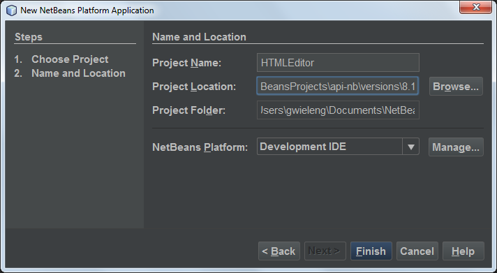

// 
//     Licensed to the Apache Software Foundation (ASF) under one
//     or more contributor license agreements.  See the NOTICE file
//     distributed with this work for additional information
//     regarding copyright ownership.  The ASF licenses this file
//     to you under the Apache License, Version 2.0 (the
//     "License"); you may not use this file except in compliance
//     with the License.  You may obtain a copy of the License at
// 
//       http://www.apache.org/licenses/LICENSE-2.0
// 
//     Unless required by applicable law or agreed to in writing,
//     software distributed under the License is distributed on an
//     "AS IS" BASIS, WITHOUT WARRANTIES OR CONDITIONS OF ANY
//     KIND, either express or implied.  See the License for the
//     specific language governing permissions and limitations
//     under the License.
//

= NetBeans Platform HTML Editor
:jbake-type: platform_tutorial
:jbake-tags: tutorials 
:jbake-status: published
:syntax: true
:source-highlighter: pygments
:toc: left
:toc-title:
:icons: font
:experimental:
:description: NetBeans Platform HTML Editor - Apache NetBeans
:keywords: Apache NetBeans Platform, Platform Tutorials, NetBeans Platform HTML Editor

This tutorial provides a very simple and quick introduction to the NetBeans Platform workflow by walking you through the creation of a simple HTML Editor. Though simple to create, the HTML Editor you create will be a mature application because it will reuse the infrastructure provided by the NetBeans Platform, as well as several modules from NetBeans IDE. For example, without any coding, your HTML Editor will have a mature window system, which it reuses from the NetBeans Platform. Once you are done with this tutorial, you will have a general understanding of how to create, build, and run applications on top of the NetBeans Platform.

After you finish this tutorial, you can move on to the  xref:../kb/docs/platform.adoc[NetBeans Platform learning trail]. The learning trail provides comprehensive tutorials that highlight a wide range of NetBeans APIs for a variety of application types. If you do not want to do a "Hello World" application, you can skip this tutorial and jump straight to the learning trail.

// NOTE:  This document uses NetBeans IDE 8.1 and NetBeans Platform 8.1. If you are using an earlier version of these products, see  link:80/nbm-htmleditor.html[the previous version of this document]. If this is your first encounter with the NetBeans Platform, you are recommended to work through the  xref:nbm-quick-start.adoc[NetBeans Platform Quick Start] before continuing with this one. If, instead of learning how to create a NetBeans Platform application, you would like to learn how to create a NetBeans plugin, see the  xref:nbm-google.adoc[NetBeans Plugin Quick Start].

To use the same look and feel in NetBeans IDE as used in this tutorial, install the  link:http://plugins.netbeans.org/plugin/62424/darcula-laf-for-netbeans[Darcula LAF for NetBeans].

For troubleshooting purposes, you are welcome to download the  link:http://web.archive.org/web/20170409072842/http://java.net/projects/nb-api-samples/show/versions/8.1/tutorials/HTMLEditor[completed tutorial source code].

At the end of this tutorial, you will have an HTML Editor that looks like this:

image::images/htmleditor_81_pic10a.png[]

NOTE:  Although this a very simple demo application, it is not a toy! It is a _real_ program that supports easy editing of HTML pages, with features such as code completion, validation, and predefined HTML snippets.

The HTML Editor that you create in this tutorial is a rich-client application built "on top of the NetBeans Platform". What this means is that the core of the IDE, which is what the NetBeans Platform _is_, will be the base of your application. On top of the NetBeans Platform, you add the modules that you need and exclude the ones that the IDE needs but that your application doesn't. Here you see some of the IDE's modules, added to the NetBeans Platform, which is its base:

image::images/htmleditor_diagram.png[]

Creating this HTML Editor means generating an application skeleton, excluding the modules and user interface items that you do not need, and then setting the NetBeans IDE's Favorites window as the window that will open by default when the IDE starts. The Favorites window will be rebranded so that it will be a browser for HTML documents. All of these activities are supported by user interface elements in the IDE, as you will learn in this tutorial.

You will see for yourself how simple and easy it is to build, or to be more precise, to _assemble_ a full-featured application on top of the NetBeans Platform. At the end, you are shown how to make the final product easily downloadable and launchable using WebStart.

NOTE:  Even though it is a separate product, there is no need to download the NetBeans Platform separately for purposes of this tutorial. You will develop the rich-client application in the IDE and then exclude the modules that are specific to the IDE but that are superfluous to you application.

== Generating the Skeleton Application

When creating an application on the NetBeans Platform, the very first step is to create a NetBeans Platform Application project. The template we will use to create our new NetBeans Platform Application project includes a subset of the modules provided by the NetBeans Platform.

[start=1]
1. Using the New Project wizard (Ctrl-Shift-N), create a NetBeans Platform Application project from the template in the NetBeans Modules category, as shown below:

image::images/htmleditor_81_pic1.png[]

[start=2]
1. Click Next and name the NetBeans Platform Application project "NetBeansHTMLEditor":

Click Finish. The skeleton application is created:

image::images/htmleditor_81_pic3.png[]

Right-click the application and choose Run. The application starts and looks as follows:

image::/tutorials/htmleditor/81/pic3a.png[]

Close the application.

[start=3]
1. We'll start by using the IDE to brand our application. Right-click the project node, choose Branding, and then make a few changes in the Branding Editor:

* In the Basic panel, make sure that you like the application title for the titlebar, as well as the icons, as shown below:

image::images/htmleditor_81_pic4.png[]

* In the Splash Screen panel, notice that you can provide the application's splash screen, and progress bar brandings, as shown below:

image::images/htmleditor_81_pic5.png[]

NOTE:  If you do not have a splash screen, use  link:images/htmleditor_splash.gif[this one]

.

[start=4]
1. 
Now that the application has been branded, let's make sure that the modules we need for our HTML editor are available to the application. Right-click the project node, choose Properties, and then go to the Libraries panel in the Project Properties dialog box. Here you see a list of "clusters". A cluster is a collection of related modules and represents a folder in the application's installation directory. The only clusters that need to be selected are, in the first place,  ``platform`` , which is already selected, but expand it and _also_ select the following:

* Auto Update Services
Auto Update UI—together, these two modules provide the Plugin Manager, so that users of your HTML Editor will be able to add new plugins at runtime to the application
* Favorites—provides the Favorites window that you will use to open and create new HTML files later

Then deselect the following in the "platform" cluster, since they will not be needed in this scenario:

* FX WebView Bootstrap
* HTML UI API
* JavaFX wrapper
* File Templates HTML UI

[start=5]
1. 
Next, expand the  ``ide``  cluster, and select most of the HTML modules in the "ide" cluster:

* HTML
* HTML Editor
* HTML Editor Library
* HTML Lexer
* HTML Parser
* HTML Validation

Next, click the "Resolve" button and the required modules will be added to the set of modules needed by modules that you have already selected to be part of the application.

[start=6]
1. Also select the following in the  ``ide``  cluster:

* Lexer to NetBeans Bridge
* Parsing API IDE Bridge
* Project API Implementation
* User Utilities

Click the "Resolve" button to include the modules required by the above modules. Now you have the subset of NetBeans modules relevant to your HTML Editor. Click OK to exit the Project Properties dialog.

[start=7]
1. Right-click the application and run it. Choose File | Open File and then open some HTML files. You should see a fully functional HTML editor:

image::images/htmleditor_81_pic10a.png[]

== Distributing the Application

Choose one of two approaches for distributing your application. If you want to maintain as much control over your application as possible, you will use web start (JNLP) to distribute your application over the web. In this scenario, whenever you want to update the application, you will do so locally and let your end users know about the update, which they will automatically have available next time they start up your application over the web. Alternatively, distribute a ZIP file containing your application. The end users will then have the complete application locally available. You would then distribute updates and new features via the update mechanism, described below.

=== Distributing the Application via a ZIP File

To make your application extendable, you need to let your users install modules to enhance the application's functionality. To do so, your application is already bundling the Plugin Manager.

[start=1]
1. Right-click the application's project node and choose Package as | ZIP Distribution.

[start=2]
1. 
In the  ``dist``  folder (visible in the Files window, Ctrl-2), you should now be able to see a ZIP file, as follows:

image::images/htmleditor_81_pic11.png[]

NOTE:  The application's launcher is created in the  ``bin``  folder, as shown above.

=== Distributing the HTML Editor via the Shared NetBeans Web Start Repository

Instead of distributing a ZIP file, let's prepare for a webstart distribution by finetuning the  ``master.jnlp``  file that is generated the first time you start the application via "JNLP | Run". Even though it does the job, it is not yet ready for distribution. At the very least, you need to change the information section to provide better descriptions and icons.

Another change to the standard JNLP infrastructure is the use of a shared JNLP repository on www.netbeans.org. By default, the JNLP application generated for a suite always contains all its modules as well as all the modules it depends on. This may be useful for intranet usage, but it is a bit less practical for wide internet use. When on the internet, it is much better if all the applications built on the NetBeans Platform refer to one repository of NetBeans modules, which means that such modules are shared and do not need to be downloaded more than once.

There is such a repository for NetBeans Platform. It does not contain all the modules that NetBeans IDE has, but it contains enough to make most of non-IDE applications like our HTML Editor possible. To use the repository, you only need to modify the application's  ``platform.properties``  by adding the correct URL:

[source,java]
----

# share the libraries from common repository on netbeans.org
# this URL is for release81 JNLP files:
jnlp.platform.codebase=http://bits.netbeans.org/8.1/jnlp/
            
----

Similarly, for 8.0:

[source,java]
----

# share the libraries from common repository on netbeans.org
# this URL is for release80 JNLP files:
jnlp.platform.codebase=http://bits.netbeans.org/8.0/jnlp/
            
----

Similarly, for 7.4:

[source,java]
----

# share the libraries from common repository on netbeans.org
# this URL is for release74 JNLP files:
jnlp.platform.codebase=http://bits.netbeans.org/7.4/jnlp/
            
----

Similarly, for 7.3:

[source,java]
----

# share the libraries from common repository on netbeans.org
# this URL is for release73 JNLP files:
jnlp.platform.codebase=http://bits.netbeans.org/7.3/jnlp/
            
----

Similarly, for 7.2:

[source,java]
----

# share the libraries from common repository on netbeans.org
# this URL is for release72 JNLP files:
jnlp.platform.codebase=http://bits.netbeans.org/7.2/jnlp/
            
----

Similarly, for 7.1:

[source,java]
----

# share the libraries from common repository on netbeans.org
# this URL is for release71 JNLP files:
jnlp.platform.codebase=http://bits.netbeans.org/7.1/jnlp/
            
----

Similarly, for 7.0:

[source,java]
----

# share the libraries from common repository on netbeans.org
# this URL is for release70 JNLP files:
jnlp.platform.codebase=http://bits.netbeans.org/7.0/jnlp/
            
----

Similarly, for 6.9:

[source,java]
----

# share the libraries from common repository on netbeans.org
# this URL is for release69 JNLP files:
jnlp.platform.codebase=http://bits.netbeans.org/6.9/jnlp/
            
----

As soon as the application is started as a JNLP application, all its shared plug-in modules are going to be loaded from netbeans.org and shared with other applications doing the same.

xref:../community/mailing-lists.adoc[Send Us Your Feedback]

== See Also

This concludes the NetBeans HTML Editor Tutorial. For more information about creating and developing applications on the NetBeans Platform, see the following resources:

*  xref:../kb/docs/platform.adoc[Other Related Tutorials]
*  link:https://bits.netbeans.org/dev/javadoc/[NetBeans API Javadoc]
