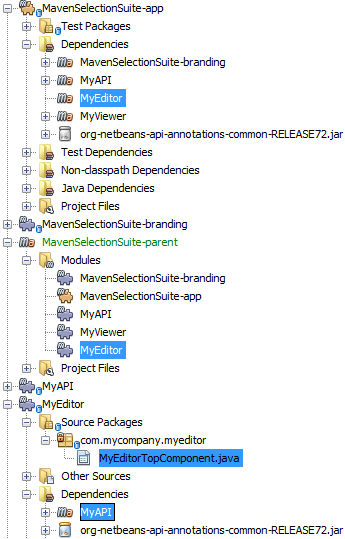

// 
//     Licensed to the Apache Software Foundation (ASF) under one
//     or more contributor license agreements.  See the NOTICE file
//     distributed with this work for additional information
//     regarding copyright ownership.  The ASF licenses this file
//     to you under the Apache License, Version 2.0 (the
//     "License"); you may not use this file except in compliance
//     with the License.  You may obtain a copy of the License at
// 
//       http://www.apache.org/licenses/LICENSE-2.0
// 
//     Unless required by applicable law or agreed to in writing,
//     software distributed under the License is distributed on an
//     "AS IS" BASIS, WITHOUT WARRANTIES OR CONDITIONS OF ANY
//     KIND, either express or implied.  See the License for the
//     specific language governing permissions and limitations
//     under the License.
//

= NetBeans Platform Selection Tutorial Using Maven
:jbake-type: platform_tutorial
:jbake-tags: tutorials 
:jbake-status: published
:syntax: true
:source-highlighter: pygments
:toc: left
:toc-title:
:icons: font
:experimental:
:description: NetBeans Platform Selection Tutorial Using Maven - Apache NetBeans
:keywords: Apache NetBeans Platform, Platform Tutorials, NetBeans Platform Selection Tutorial Using Maven

This document demonstrates how to create a NetBeans Platform Module Suite from Maven archetypes and build and install the suite in your installation of the IDE. In this tutorial you will create a Maven module suite project that contains three NetBeans modules as sub-projects. The Maven project that contains the sub-projects is a simple POM project that declares how the suite is compiled and the installation target.

This document is based on the Ant-based  xref:nbm-selection-1.adoc[NetBeans Selection Management Tutorial] and illustrates some of the differences between using Ant and Maven to develop NetBeans Platform module suites. After you understand some of the differences, you can easily proceed through other tutorials on the the  xref:../kb/docs/platform.adoc[NetBeans Platform Learning Trail].

NOTE:  You do not need to download Maven because it is bundled with the IDE. Optionally, use your own download of Maven, in which case use the Options window to configure your Maven settings.

NOTE:  This is [.underline]#not# a beginners tutorial. Before starting this tutorial, it is important that you familiarize yourself with the following introductory Maven documentation:

*  xref:../wiki/MavenBestPractices.adoc[Best Practices for Maven in NetBeans IDE]
*  link:http://www.sonatype.com/books/maven-book/reference/introduction.html[Chapter 1. Introducing Apache Maven] (from  link:http://www.sonatype.com/books/maven-book/reference/public-book.html[Maven: The Definitive Guide])
*  xref:nbm-maven-commandline.adoc[NetBeans Platform Command Line Tutorial]
*  xref:nbm-maven-quickstart.adoc[NetBeans Platform Quick Start Using Maven]

== Creating the NetBeans Platform Application

In this section you use the New Project wizard to create a NetBeans Platform Module Suite from a Maven archetype. The wizard will create a POM project that will contain the module projects. In the wizard you will also create a module as a sub-project of the suite.

[start=1]
1. Open the New Project wizard and select NetBeans Application in the Maven category:

image::images/maven-crud_72_pic1.png[title="Screenshot of Projects window"]

Click Next.

[start=2]
1. Type *MavenSelectionSuite* for the Project Name:

image::images/maven-suite_72_pic2.png[title="Screenshot of Projects window"]

Click Next.

[start=3]
1. Choose the NetBeans API version you want to use. Select Create Module Project and type *MyAPI* for the module name:

image::images/maven-suite_72_pic3.png[title="Screenshot of Projects window"]

Click Finish.

When you click Finish, the IDE creates a Maven reactor project, together with subprojects for branding, NetBeans Platform application actions, and the API module:

image::images/maven-suite_72_pic4.png[title="Screenshot of Projects window"]

*MavenSelectionSuite-parent* is a reactor project which is a container for sub-projects, in this case NetBeans Module projects. The reactor project does not contain any source files. As you can see from the screenshot above, the reactor provides a list of the modules that will be included when you build the project. You can see that the MyAPI project is listed as one of these modules.

== Creating an API

You created the *MyAPI* module when you created the module suite, but now you need to create a class in the module and expose the class to other modules.

=== Creating a Class in the MyAPI Module

In this exercise you will create a simple class named  ``Event`` . Each instance of  ``Event``  will be unique because the field  ``index``  is incremented by 1 each time a new instance of  ``Event``  is created.

[start=1]
1. In the  ``com.mycompany.mavenselectionsuite``  package, create a new Java class named *Event*.

[start=2]
1. Modify the class to declare the following fields and getters:

[source,java]
----

package com.mycompany.mavenselectionsuite;

import java.util.Date;

public final class Event {

   private final Date date = new Date();
   private static int count = 0;
   private final int index;

   public Event() {
      index = count++;
   }

   public Date getDate() {
      return date;
   }

   public int getIndex() {
      return index;
   }

   public String toString() {
       return index + " - " + date;
   }

}
----

=== Exposing the Package

In this tutorial you will create additional modules that will need to access the  ``Event``  class. In this exercise, you will make the contents of the package that contains the  ``Event``  class public so that other modules can access it. To declare the  ``com.mycompany.mavenselectionsuite``  package as public, you will modify the  ``configuration``  element of  ``nbm-maven-plugin``  in the POM to specify the packages that are exported as public. You can make the changes to the POM in the editor or by selecting the packages to make public in the project's Properties window.

[start=1]
1. Right-click the MyAPI project node and choose Properties to open the Properties window.

[start=2]
1. 
Select the *com.mycompany.mavenselectionsuite* package in the *Public Packages* category:

image::images/maven-suite_72_pic5.png[title="screenshot"]

Click OK.

When you select a package to export, the IDE modifies the  ``nbm-maven-plugin``  element in the *MyAPI* module's POM to specify the package:

[source,xml]
----

<plugin>
    <groupId>org.codehaus.mojo</groupId>
    <artifactId>nbm-maven-plugin</artifactId>
    <extensions>true</extensions>
    <configuration>
        <publicPackages>
            *<publicPackage>com.mycompany.mavenselectionsuite</publicPackage>*
        </publicPackages>
    </configuration>
</plugin>
----

[start=3]
1. Right-click the project and choose Build. When you build the project, the  ``nbm-maven-plugin``  will generate a manifest header in the  ``MANIFEST.MF``  of the JAR, to specify the public package:

[source,java]
----

Manifest-Version: 1.0
Archiver-Version: Plexus Archiver
Created-By: Apache Maven
Built-By: geertjan
Build-Jdk: 1.7.0
OpenIDE-Module-Localizing-Bundle: com/mycompany/mavenselectionsuite/Bu
 ndle.properties
OpenIDE-Module-Specification-Version: 1.0
OpenIDE-Module-Implementation-Version: 1.0-20111222
OpenIDE-Module-Build-Version: 201112221054
OpenIDE-Module: com.mycompany.MyAPI
*OpenIDE-Module-Public-Packages: com.mycompany.mavenselectionsuite.**
OpenIDE-Module-Requires: org.openide.modules.ModuleFormat1
OpenIDE-Module-Display-Category: com.mycompany
OpenIDE-Module-Name: MyAPI
OpenIDE-Module-Short-Description: <undefined>
OpenIDE-Module-Long-Description: <undefined>
OpenIDE-Module-Module-Dependencies: org.netbeans.api.annotations.commo
 n/1 > 1.10.1
----

For more information, see the  link:http://bits.netbeans.org/mavenutilities/nbm-maven-plugin/manifest-mojo.html#publicPackages[nbm-maven-plugin manifest documentation].

== Listening to the Selection

In this section you will create a new module named MyViewer and add a window component and two text fields. The component will implement  `` link:https://bits.netbeans.org/dev/javadoc/org-openide-util-lookup/org/openide/util/LookupListener.html[LookupListener]``  to listen for changes to the selection.

=== Creating the Module

In this exercise you will create the MyViewer NetBeans module in the  ``MavenSelectionSuite``  directory.

[start=1]
1. Choose File > New Project from the main menu (Ctrl-Shift-N). Select NetBeans Module from the Maven category:

image::images/maven-suite_72_pic6.png[title="screenshot"]

Click Next.

[start=2]
1. Type *MyViewer* as the Project Name. Make sure to set the Project Location to the  ``MavenSelectionSuite``  directory:

image::images/maven-suite_72_pic7.png[title="screenshot"]

[start=3]
1. Click Next. Select the NetBeans API version you'd like to use:

image::images/maven-suite_72_pic8.png[title="screenshot"]

Click Finish.

[start=4]
1. The new module is created within the *parent* project, which is a Maven reactor. Therefore, it becomes part of the reactor build. However, the new module is not yet part of the *app* project. Right-click the Dependencies node in the *app* project and choose Add Dependency:

image::images/maven-suite_72_pic02.png[title="screenshot"]

[start=5]
1. Select the *MyViewer* module in the Open Projects tab:

image::images/maven-suite_72_pic03.png[title="screenshot"]

[start=6]
1. When you click Add above, the IDE adds the *MyViewer* module to the list of dependencies of the *app* project. You can see the new dependency in the POM of the *app* project module and displayed as a new node under the Dependencies node of the *app* project:

image::images/maven-suite_72_pic04.png[title="screenshot"]

[start=7]
1. The module is going to use the API module, therefore we need to set a dependency in the viewer module on the API module. Right-click the Dependencies node in the *MyViewer* project and choose Add Dependency:

image::images/maven-suite_72_pic9.png[title="screenshot"]

[start=8]
1. Select the *MyAPI* module in the Open Projects tab:

image::images/maven-suite_72_pic10.png[title="screenshot"]

[start=9]
1. When you click Add above, the IDE adds the API module to the list of dependencies of the MyViewer module. You can see the new dependency in the POM of the MyViewer module and displayed as a new node under the Dependencies node of the MyViewer module:

image::images/maven-suite_72_pic01.png[title="screenshot"]

You've now learned how to create a new module in your application and you've also learned how to set dependencies between your modules. Once a dependency has been set, a module can use the publicly exposed classes of the modules it depends on.

=== Creating the Viewer Window

In this exercise you will create a GUI component in your viewer module. The data displayed in the GUI component will be retrieved from the Lookup. That means you will learn how to listen to the selection and how to update your GUI component whenever an object of interest is published into the Lookup.

[start=1]
1. Right-click the MyViewer project and choose New > Window. Select *explorer* and select Open on Application Start:

image::images/maven-suite_72_pic05.png[title="screenshot"]

Click Next.

[start=2]
1. Type *MyViewer* as the Class Name Prefix:

image::images/maven-suite_72_pic06.png[title="screenshot"]

Click Finish. You should see you have a new NetBeans Platform window component ready to be designed within the Matisse GUI Builder:

image::images/maven-suite_72_pic07.png[title="screenshot"]

[start=3]
1. Drag two Labels from the Palette into the window component:

image::images/maven-suite_72_pic08.png[title="screenshot"]

[start=4]
1. You are now going to listen to the global context, provided by the  xref:../wiki/index.adoc#_lookup[NetBeans Lookup], for Event objects. Right now, no Event objects will be present in the global context. However, in the next section, we will create a new module that will publish Event objects.

Click the Source tab and modify the class signature to implement  ``LookupListener`` :

[source,java]
----

public class MyViewerTopComponent extends TopComponent *implements LookupListener* {
----

Add the following  ``private``  field  ``result``  and set the initial value to null.

[source,java]
----

private Lookup.Result<Event> result = null;
----

Implement the LookupListener's "resultChanged" method as follows:

[source,java]
----

@Override
public void resultChanged(LookupEvent le) {
    if (!result.allInstances().isEmpty()) {
        for (Event event : result.allInstances()) {
            jLabel1.setText(Integer.toString(event.getIndex()));
            jLabel2.setText(event.getDate().toString());
        }
    } else {
        jLabel1.setText("[no selection]");
        jLabel2.setText("");
    }
}
----

Make the following additions to the  ``componentOpened()``  and  ``componentClosed()``  methods that have already been created in the class by the New Window wizard:

[source,java]
----

@Override
public void componentOpened() {
    *result = Utilities.actionsGlobalContext().lookupResult(Event.class);
    result.addLookupListener(this);*
}

@Override
public void componentClosed() {
    *result.removeLookupListener (this);*
}
----

*Note.* By using  `` link:https://bits.netbeans.org/dev/javadoc/org-openide-util/org/openide/util/Utilities.html#actionsGlobalContext%28%29[Utilities.actionsGlobalContext()]`` , each time the window is opened, the window listens to the global context for Event objects. Whenever a new Event is published into the global context, the  ``resultChanged``  method is automatically triggered to handle the event.

Make sure to import the correct  ``Event``  class, that is,  ``com.mycompany.mavenselectionsuite.Event`` .

== Publishing a Selected Object

In this section you will create a new module called MyEditor. The module will contain a  `` link:https://bits.netbeans.org/dev/javadoc/org-openide-windows/org/openide/windows/TopComponent.html[TopComponent]``  that will publish instances of the  ``Event``  object into the Lookup of the TopComponent. When the user selects the TopComponent, the objects in its Lookup will be available globally. Once published globally, the viewer window created in the previous section, which is listening for Events in the global Lookup, will automatically update itself.

=== Creating the Module

In this exercise you will create a NetBeans module in the  ``MavenSelectionSuite``  directory and add a dependency on the MyAPI module.

[start=1]
1. As you did in the previous section, create a new module in the *parent* folder. Type *MyEditor* as the Project Name.

[start=2]
1. As you did in the previous section, you need to add the *MyEditor* module as a dependency of the *app* project, so that it will be deployed when you run the application.

[start=3]
1. As you did in the previous section, you need to add a dependency on the API module, so that you can use its public packages.

[start=4]
1. As you did in the previous section, create a new window in the *MyEditor* module. Set its position to "editor". Type *MyEditor* as the Class Name Prefix.

[start=5]
1. Check that the result of the steps you have taken so far match the screenshot below:

[start=6]
1. Use the Palette to drag and drop a Text Field onto the window:

image::images/maven-suite_72_pic11.png[title="screenshot"]

[start=7]
1. Switch to the Source tab. At the end of the constructor in the window, include the following code:

[source,java]
----

Event obj = new Event();
associateLookup(Lookups.singleton(obj));

jTextField1.setText("Event #" + obj.getIndex() + " created at " + obj.getDate());

setDisplayName("MyEditor " + obj.getIndex());
----

NOTE:  The  ``associateLookup(Lookups.singleton(obj));``  line in the constructor will add a new instance of  ``Event``  to the  ``Lookup``  of the  ``TopComponent`` . When the  ``TopComponent``  is selected, its  ``Lookup``  is passed into the global context. For more details, see  xref:../wiki/index.adoc#_lookup[NetBeans Lookup].

Make sure to import the correct  ``Event``  class, that is,  ``com.mycompany.mavenselectionsuite.Event`` .

[start=8]
1. Change the  ``@TopComponent.OpenActionRegistration``  so that no  ``preferredId``  is defined, as shown below, which means that a new Editor window will open whenever you choose Window | Editor in the menubar:

[source,java]
----

@TopComponent.OpenActionRegistration(displayName = "#CTL_MyEditorAction")
----

The text field in the component only displays the index value and date from the  ``Event`` . This will enable you to see that each MyEditor component is unique and that MyViewer is displaying the details of the MyEditor component that has the focus.

=== Building and Running the Application

Now that the target installation of the IDE is specified, you can use the Run command on the *app* project.

[start=1]
1. Right-click *app* project and choose Run. The application starts up, consisting of the NetBeans Platform, together with the custom modules you created.

[start=2]
1. The MyViewer window opens when the application starts and displays the two labels. You can now choose MyEditor from the Window menu, multiple times, to open multiple MyEditor components in the editor area. The MyViewer window will display the details of the currently selected MyEditor component.

image::images/maven-suite_72_pic13.png[title="screenshot"]

This tutorial demonstrated how to create and run a NetBeans Platform application that you create from a Maven archetype. You saw how applications are structured and how you configure a modules POM to specify public packages. Most important of all, you learned how to publish objects into the selection and how to listen for them and update other parts of the application accordingly. For more examples on how to build NetBeans Platform applications, see the tutorials listed in the  xref:../kb/docs/platform.adoc[NetBeans Platform Learning Trail].

xref:../community/mailing-lists.adoc[ Send Us Your Feedback]

 

== See Also

For more information about creating and developing on the NetBeans Platform, see the following resources.

*  xref:../kb/docs/platform.adoc[NetBeans Platform Learning Trail]
*  xref:../wiki/index.adoc[NetBeans Developer FAQ]
*  link:https://bits.netbeans.org/dev/javadoc/[NetBeans API Javadoc]

If you have any questions about the NetBeans Platform, feel free to write to the mailing list, dev@platform.netbeans.org, or view the  link:https://mail-archives.apache.org/mod_mbox/netbeans-dev/[NetBeans Platform mailing list archive].

