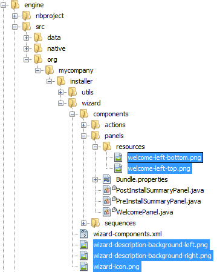

// 
//     Licensed to the Apache Software Foundation (ASF) under one
//     or more contributor license agreements.  See the NOTICE file
//     distributed with this work for additional information
//     regarding copyright ownership.  The ASF licenses this file
//     to you under the Apache License, Version 2.0 (the
//     "License"); you may not use this file except in compliance
//     with the License.  You may obtain a copy of the License at
// 
//       http://www.apache.org/licenses/LICENSE-2.0
// 
//     Unless required by applicable law or agreed to in writing,
//     software distributed under the License is distributed on an
//     "AS IS" BASIS, WITHOUT WARRANTIES OR CONDITIONS OF ANY
//     KIND, either express or implied.  See the License for the
//     specific language governing permissions and limitations
//     under the License.
//

= NetBeans Platform Installer Integration Tutorial
:jbake-type: platform_tutorial
:jbake-tags: tutorials 
:jbake-status: published
:syntax: true
:source-highlighter: pygments
:toc: left
:toc-title:
:icons: font
:experimental:
:description: NetBeans Platform Installer Integration Tutorial - Apache NetBeans
:keywords: Apache NetBeans Platform, Platform Tutorials, NetBeans Platform Installer Integration Tutorial

In this tutorial, you learn how to use the infrastructure of the NetBeans IDE installer to generate and customize an installer for your own NetBeans Platform application.

*Background Reading*

This tutorial is derived from the following sources:

*  xref:../wiki/NBI.adoc[http://wiki.netbeans.org/NBI]
*  link:http://installer.netbeans.org/docs/nbi-devguide.html[http://installer.netbeans.org/docs/nbi-devguide.html]

== Generating and Using the Default Installer

In this section, you set up the Paint Application, which is one of the sample applications distributed with NetBeans IDE, and generate the default NetBeans installer for it.

=== Generating the Default Installer

[start=1]
1. Go to File | New Project and go to Samples | NetBeans Modules, where you will find the Paint Application:

image::images/nbi_721_paint-app-1.png[]

Complete the wizard and you should see the Paint Application in the Projects window.

[start=2]
1. Right-click the application, choose Properties, and then go to the Installer tab. Select the operating systems for which you'd like to create installers, as shown below:

image::images/nbi_721_paint-app-2.png[]

Specify whether you want to compress the installer and then click OK.

[start=3]
1. Right-click the application and choose Package as | Installers, as shown below:

image::images/nbi_721_paint-app-3.png[]

NOTE:  The process that creates installers can take a long time, especially if you specified that multiple installers should be created. Use the Output window to follow the creation process.

[start=4]
1. Switch to the Files window, expand the application's "dist" folder, and you should see one or more installers that have been generated, together with a ZIP distribution of the application:

image::images/nbi_721_paint-app-4.png[]

=== Using the Default Installer

[start=1]
1. Right-click the installer and choose "Open in System", as shown below:

image::images/nbi_721_paint-app-5.png[]

Alternatively, if the above instruction does not work in your operating system, leave NetBeans IDE, go into your filesystem outside the IDE, and launch the installer in the standard way applicable to your operating system.

[start=2]
1. After a moment, you should see the first panel of the installer wizard, as shown below:

image::images/nbi_721_paint-app-6.png[]

Click Next.

[start=3]
1. In the second panel, specify a location where the application will be installed, together with whether a desktop icon and a start menu entry should be created:

image::images/nbi_721_paint-app-7.png[]

Click Next.

[start=4]
1. In the third panel, you are shown a summary prior to the installation starting:

image::images/nbi_721_paint-app-8.png[]

Click Install. You are shown the progression of the installation procedure:

image::images/nbi_721_paint-app-9.png[]

When the installation is complete, the panel below is shown:

image::images/nbi_721_paint-app-1a.png[]

Now that you have learned how to create and use the default installer, let's customize it!

== Customizing the Installation Wizard

In this section, you configure the NetBeans Installation (nbi) infrastructure in various ways. Then, when you generate the installer again, as shown in the previous section, your configurations will automatically be applied. The nbi infrastructure is a standard part of every NetBeans IDE installation, as shown in the screenshot below, and is always found within the NetBeans IDE installation directory's "harness" subdirectory:

image::images/nbi_721_favorites-view.png[]

Below, you are shown how to change the installer's images, texts, size, destination directory, and panels. After you make a change, regenerate the installer to see the impact of your changes.

=== Customizing the Wizard Images

[start=1]
1. In the "harness/nbi" folder, go to "stub/ext/engine", which is the folder shown in the screenshot below. Then continue expanding the folders until you find the images shown below:

[start=2]
1. Replace the images with your own images and then generate the installer again, following the instructions in the previous section.

=== Customizing the Wizard Texts

[start=1]
1. In the "harness/nbi" folder, go to "stub/ext/engine", which is the folder shown in the screenshot below. Then continue expanding the folders until you find the  ``Bundle.properties``  file shown below:

image::images/nbi_721_customize-texts-1.png[]

[start=2]
1. Replace the texts with your own and then regenerate the installer, which is explained in the previous section.

=== Customizing the Wizard Size

[start=1]
1. In the "harness/nbi" folder, go to "stub/ext/engine", which is the folder shown in the screenshot below. Then continue expanding the folders until you find the  ``engine.properties``  file shown below:

image::images/nbi_721_customize-sizes-1.png[]

[start=2]
1. Replace the sizes with your own and then regenerate the installer, which is explained in the previous section.

=== Customizing the Wizard Destination Directory

[start=1]
1. In the "harness/nbi" folder, go to "stub/ext/infra", which is the folder shown in the screenshot below. Then continue expanding the folders until you find the  ``build.properties``  file shown below:

image::images/nbi_721_customize-destinationdir-1.png[]

[start=2]
1. Replace the values of the  ``product.properties``  keys with your own and then regenerate the installer, which is explained in the previous section.

=== Customizing the Wizard Panels

[start=1]
1. In the "harness/nbi" folder, go to "stub/ext/components", which is the folder shown in the screenshot below. Then continue expanding the folders until you find the  ``HelloWorldPanel.java``  and the  ``wizard.xml``  file shown below:

image::images/nbi_721_customize-panels-1.png[]

[start=2]
1. Create new panels and register them in the  ``wizard.xml``  file or unregister panels by removing their registration entries found in the  ``wizard.xml``  file.

Now that you have learned how to customize the default installer, let's add additional resources to it!

== Bundling Additional Resources

In this section, you learn how to bundle additional resources together with your installer.

=== Bundling GlassFish

Some NetBeans Platform applications use GlassFish in one way or another. Using the instructions below, you can bundle GlassFish with your installer and add a new panel to the installer wizard so that users can specify where and how GlassFish should be installed.

These instructions can be applied to any other tool or application that should be bundled and installed together with your NetBeans Platform application–simply replace each instance of "GlassFish" below with the name of the tool or application you'd like to bundle with the installer of your NetBeans Platform application.

[start=1]
1. Start by creating a ZIP file of your installation of GlassFish. Somewhere on disk, you should have GlassFish installed. Remove any domain folders you have there, since the procedure that follows will result in a "domain1" domain automatically being created at the time when the installer finished.

NOTE:  If you have some custom libraries that GlassFish will need, simply include them in the appropriate folders in GlassFish before you ZIP it up. That means you'll be providing a custom GlassFish distribution tailor made for the application you've created. Otherwise, ZIP up the default standard GlassFish distribution and the user will have that when they complete the installer.

Put the ZIP file anywhere on disk, such as in the home directory. Later, your ZIP file will be located by the nbi infrastructure, unzipped, and packed into the installer, once you choose "Package as | Installers" in the IDE.

[start=2]
1. In the  ``components``  folder and the  ``infra``  folder, find the  ``helloworld``  folders, shown below:

image::images/nbi_721_bundle-glassfish-1.png[]

Copy the  ``helloworld``  folders, one by one, and paste them in the same folders where the  ``helloworld``  folders are found. Name both new folders  ``glassfish`` , as shown below:

image::images/nbi_721_bundle-glassfish-2.png[]

Depending on the operating system you're using, make sure you have write permission for the folders into which you're copying, otherwise you will not be able to complete the copy action. To fix this, go outside the IDE to the folder in your filesystem and fix the permissions set on the folder so that you have write permission.

[start=3]
1. In  ``nbi/build.xml`` , include  ``glassfish``  in the  ``-clean``  and  ``-build``  targets. Do this by copying the  ``helloworld``  equivalents and replacing  ``helloworld``  references with  ``glassfish``  references. In the same file, change  ``create-bundle``  so that  ``glassfish``  is included, as highlighted below:

[source,xml]
----

<create-bundle root="${output.dir}/registry-temp" 
           platform="${platform}" 
           target="${bundles.release.dir}/${bundle.files.prefix}-${platform}.${bundle.extention}">
    <component uid="${main.product.uid}" version="1.0.0.0.0"/>
    *<component uid="glassfish" version="1.0.0.0.0"/>*
</create-bundle>
----

[start=4]
1. In  ``nbi/stub/ext/infra/products/glassfish`` , open  ``build.properties``  and change the value of  ``product.data.1.path``  so that it points to the location on disk of your GlassFish ZIP file. In the same file, change the value of  ``product.uid``  to  ``glassfish`` .

When you regenerate the installer, as explained in the previous section, your GlassFish ZIP file will be included in the installer. When you run the installer, a new panel will be shown for installing GlassFish. When the wizard is complete, GlassFish will be installed, together with the application.

=== Bundling the JRE

In many cases, the users of your NetBeans Platform application may not have a Java runtime environment (JRE) installed on their system. As a result, they will not be able to start your NetBeans Platform application, in fact, they will not even be able to start your installer, and will need to download and configure the JRE manually. To help your users, you can bundle the JRE with the installer and create the installer and the NetBeans Platform application in such a way that they will automatically use the bundled JRE when starting up.

NOTE:  The instructions below apply to Windows. For Unix systems, refer to  link:http://netbeans.dzone.com/including-jre-in-nbi[Including the JRE in a NetBeans Platform Installer on Ubuntu Linux].

*Preparing the JRE*

[start=1]
1. Go to your JDK installation and copy the JRE somewhere else, separately, so that you don't accidentally destroy the JDK you're using to run Java programs, such as NetBeans IDE. For purposes of this tutorial, we will copy the folder "jre", from the JDK, to a new folder named "C:\AJava":

image::images/nbi_721_bundle-jre-1.png[]

[start=2]
1. The  ``C:\\AJava\jre\lib\rt.jar``  is large. In this step, we're going to replace  ``rt.jar``  with a compressed version of the same JAR. Go to C:\\AJava\jre\lib and run:

[source,java]
----

pack200 -J-Xmx1024m rt.jar.pack.gz rt.jar
----

Now go into C:\\AJava\jre\lib and delete the "rt.jar".

[start=3]
1. Go to C:\\AJava\jre and select the "bin" folder and the "lib" folder. Right-click and ZIP the selected folders. You'll end up with "jre.zip".

[start=4]
1. Put "unzipsfx.exe",  link:http://www.info-zip.org/pub/infozip/[which can you get here] or  xref:../wiki/DevFaqAccessSourcesUsingMercurial.adoc[by downloading the NetBeans sources] and then looking in the "nbi/infra/build/jvm/tools/unzipsfx" folder, into the same folder as where the "jre.zip" is found. Then, in the folder where "unzipsfx.exe" and "jre.zip" are found, run this:

[source,java]
----

copy /B unzipsfx.exe + jre.zip jre.exe
----

The result of the above is that you now have a "jre.exe" file, which is a self-extractable ZIP archive. To try it out, run it and then you'll find the "jre" installed on your system. We now need to bundle this "jre.exe" into the installer, via the Ant script that configures the installer, as outlined in the steps that follow.

*Configuring the NetBeans Installer Infrastructure*

[start=1]
1. Replace "create-bundle" in the "build.xml" found in the IDE's "harness/nbi/stub" folder with the following:

[source,xml]
----

<create-bundle root="${output.dir}/registry-temp" platform="${platform}" 
       target="${bundles.release.dir}/${bundle.files.prefix}-${platform}.${bundle.extention}">
    <component uid="${main.product.uid}" version="1.0.0.0.0"/>
    *<property name="nbi.bundled.jvm.file" value="C:\\AJava\jre\jre.exe"/>*
</create-bundle>
----

Depending on the operating system you're using, make sure you have write permission for the above file, otherwise you will not be able to make changes to it. To fix this, go outside the IDE to the file in your filesystem and fix the permissions set on the file so that you have write permission.

[start=2]
1. Put this right at the end of "install(Progress progress)" in ConfigurationLogic.java, which is within "harness/nbi/stub/ext/components/products/helloworld/src/org/mycompany":

[source,java]
----

File javaHome = new File(System.getProperty("java.home"));
File target = new File(installLocation, "jre");
try {
    FileUtils.copyFile(javaHome, target, true); //FileUtils is one of the NBI core classes, already imported
} catch (IOException e) {
    throw new InstallationException("Cannot copy JRE",e);
}

// to add uninstaller logic:
SystemUtils.getNativeUtils().addUninstallerJVM(new LauncherResource(false, target));
----

And, in the "uninstall(Progress progress)" method, add this right before the last statement:

[source,java]
----

File jre = new File(installLocation, "jre");
if (jre.exists()) {
    try {
        for (File file : FileUtils.listFiles(jre).toList()) {
            FileUtils.deleteOnExit(file);
        }
        FileUtils.deleteOnExit(installLocation);
    } catch (IOException e) {
        //ignore
    }
}
----

Add this to the import statement section at the top of the file:

[source,java]
----

import org.netbeans.installer.utils.system.launchers.LauncherResource;
----

NOTE:  You will see compilation errors, i.e., red error marks, throughout the code. That is because you have not opened the code as projects into the IDE. Don't worry, the code will compile once you regenerate the installer later in this tutorial.

Depending on the operating system you're using, make sure you have write permission for the above file, otherwise you will not be able to make changes to it. To fix this, go outside the IDE to the file in your filesystem and fix the permissions set on the file so that you have write permission.

You have now specified how and when the "jre" will be installed by the installer wizard.

*Configuring the NetBeans Platform Application to Use the Bundled JRE*

[start=1]
1. In your application, e.g., in "nbproject" of your application, create a ".conf" file with. For example, for purposes of this tutorial, switch to the Files window, right-click on the Paint Application's "nbproject" folder, and choose New | Other and then select Other | Empty File. Click Next, type "paintit.conf", and click Finish. You should now see this:

image::images/nbi_721_bundle-jre-2.png[]

[start=2]
1. Paste the content below into the  ``paintit.conf``  file. As you can see below, you need to make sure that the  ``jdkhome``  key has its value set to "jre", which is the folder relative to the installation directory where your bundled JRE will be unpacked:

[source,java]
----

default_userdir="C://paintit"
default_cachedir="C://paintit"
default_options="-J-client -J-Xss2m -J-Xms32m -J-XX:PermSize=32m -J-ea"
jdkhome="jre"
----

Read about  xref:../wiki/FaqWhatIsUserdir.adoc[userdir &amp; cachedir] in the NetBeans Wiki.

[start=3]
1. Register the conf file in the application's "project.properties" file, i.e., in the same file where  ``app.name``  is defined, like this:

[source,java]
----

app.conf=nbproject/paintit.conf
----

The  ``paintit.conf``  file needs to be defined relative to the application root folder. In this case, we have put the file within the "nbproject" folder, which has as its parent the application root folder. Now you have specified that the application will use the configuration file that you have provided, within which the bundled JRE is defined as the JRE to be used for starting up the application.

[start=4]
1. Regenerate the installer, as explained in the previous section, and the installer will be created, as always. However, when you run the installer, the JRE will be unbundled into a temp folder and the installer will use that JRE to run itself. A copy of the JRE will be made to a folder named "jre" within the root folder of your application, where the "jdkhome" setting in the .conf file of the application points. For the Paint Application, you should now see the following:

image::images/nbi_721_bundle-jre-3.png[]

Run the application via the executable in the "bin" folder and the JRE within the application root folder will be used to start it.

Now that you have learned how to create, customize, and bundle additional resources with the NetBeans installer, read the resources below for many additional details and other information that may be relevant to your business needs:

*  xref:../wiki/NBI.adoc[http://wiki.netbeans.org/NBI]
*  link:http://installer.netbeans.org/docs/nbi-devguide.html[http://installer.netbeans.org/docs/nbi-devguide.html]
xref:../community/mailing-lists.adoc[Send Us Your Feedback]
