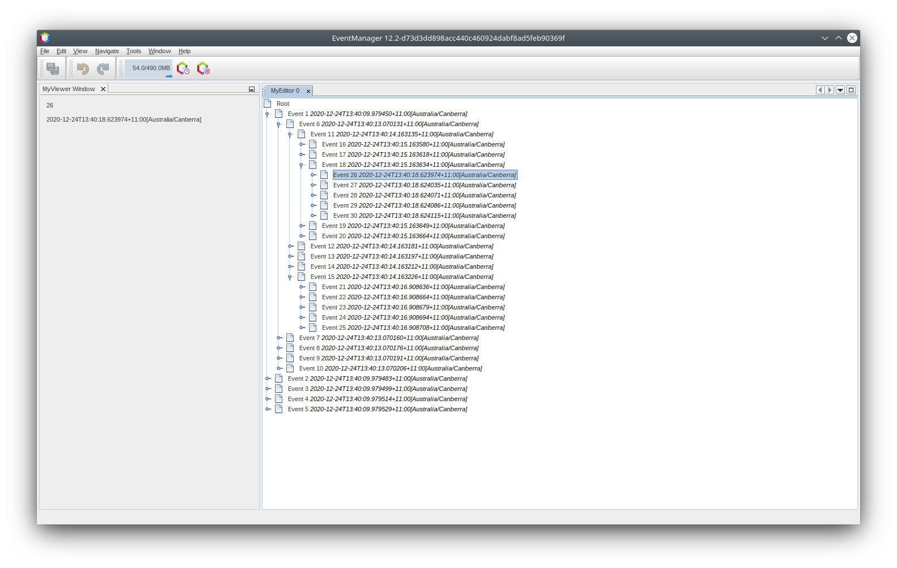
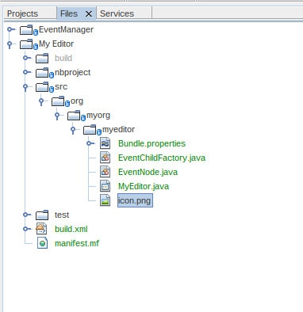
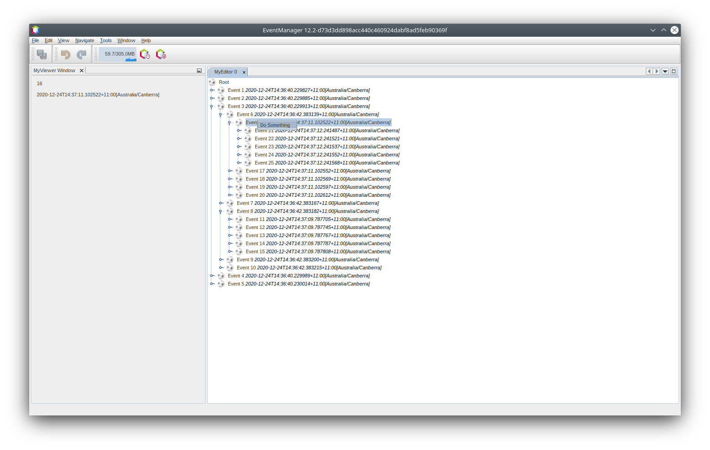
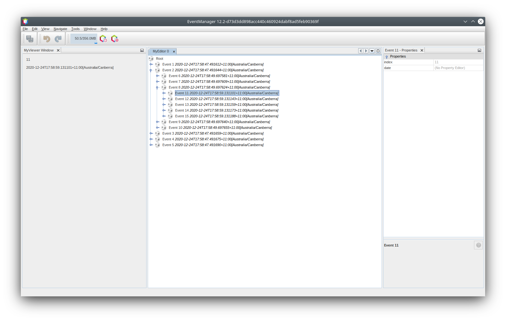
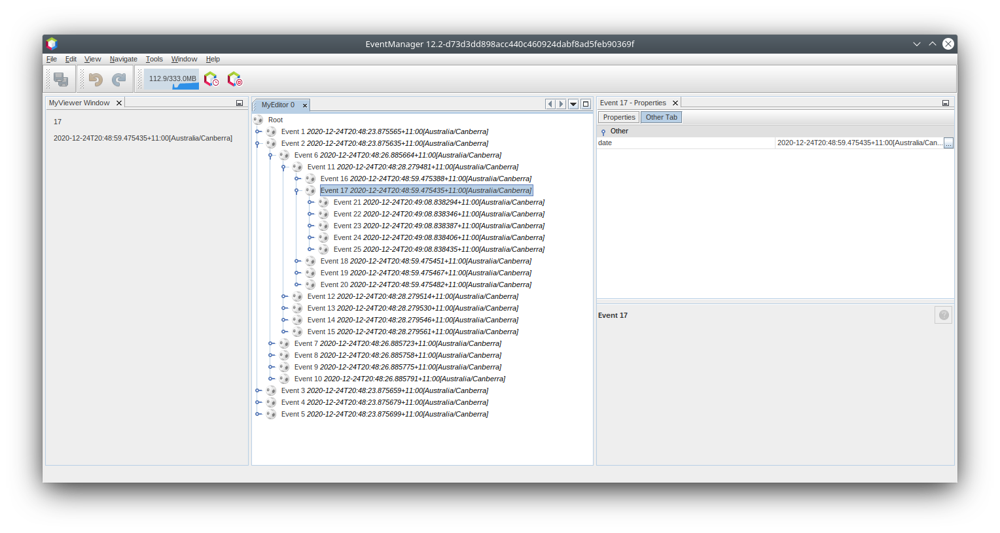

// 
//     Licensed to the Apache Software Foundation (ASF) under one
//     or more contributor license agreements.  See the NOTICE file
//     distributed with this work for additional information
//     regarding copyright ownership.  The ASF licenses this file
//     to you under the Apache License, Version 2.0 (the
//     "License"); you may not use this file except in compliance
//     with the License.  You may obtain a copy of the License at
// 
//       http://www.apache.org/licenses/LICENSE-2.0
// 
//     Unless required by applicable law or agreed to in writing,
//     software distributed under the License is distributed on an
//     "AS IS" BASIS, WITHOUT WARRANTIES OR CONDITIONS OF ANY
//     KIND, either express or implied.  See the License for the
//     specific language governing permissions and limitations
//     under the License.
//

= NetBeans Nodes API Tutorial
:jbake-type: platform_tutorial
:jbake-tags: tutorials 
:jbake-status: published
:syntax: true
:source-highlighter: pygments
:toc: left
:toc-title:
:icons: font
:experimental:
:reviewed: 2020-12-23
:description: NetBeans Nodes API Tutorial - Apache NetBeans
:keywords: Apache NetBeans Platform, Platform Tutorials, NetBeans Nodes API Tutorial

This tutorial shows how to make use of some of the features of the Nodes API in NetBeans. It shows how to do the following:

* Decorate Nodes with icons
* Use HTML markup to enhance how Nodes are displayed
* Create properties for display in the property sheet
* Provide Actions from Nodes

This tutorial is intended as a follow-on to the  xref:nbm-selection-1.adoc[NetBeans Selection Management Tutorial], which covers how `Lookup` is used in managing selection in the NetBeans windowing system, and its xref:nbm-selection-2.adoc[follow-on tutorial] which demonstrates how to use the Nodes API in managing selection.

This tutorial builds on the source code created in the first tutorial and enhanced in the second tutorial. If you have not yet done these tutorials, you should do them first; or at least ensure you are familiar with the content and approach used, and download the completed result of the second tutorial. 

For troubleshooting purposes, you are welcome to download the  xref:nbm-nodesapi2.adoc[completed tutorial source code].

== Creating a Node subclass

As mentioned in the  xref:nbm-selection-2.adoc[previous tutorial], Nodes are _presentation objects_. That means that they are not a data model themselves - rather, they are a presentation layer for an _underlying data model_. In the Projects or Files windows in the NetBeans IDE, you can see ``Node``s used where the underlying data model is files on disk. In the Services window in the IDE, you can see them used where the underlying objects are configurable aspects of NetBeans runtime environment, such as available application servers and databases.

As a presentation layer, ``Node``s add human-friendly attributes to the objects they model. The essential ones are:

* *Display Name* — a human readable, user-friendly display name
* *Description* — a human readable, user-friendly description, often shown as a tooltip
* *Icon* — some glyph that graphically indicates the type of object shown and possibly its state
* *Actions* — actions that appear on the context menu when the node is right-clicked, which can be invoked by the user

In the preceding tutorial, you used your `EventChildFactory` class to create `Node`s, by calling

[source,java]
----

new AbstractNode(Children.create(new EventChildFactory(), true), Lookups.singleton(key));
----

and then calling `setDisplayName(key.toString())` to provide a basic display name. There is much more that can be done to make your ``Node``s more user-friendly, which we will explore in this part of the tutorial series.

First you will need to create a `Node` subclass to work with, as detailed below.

[start=1]
1. In the My Editor project, right click the package `org.myorg.myeditor` and choose New > Java Class. Name the class "EventNode" and press Enter or click Finish.

[start=2]
1. Change the signature and constructors of the class as follows:

[source,java]
----
package org.myorg.myeditor;

import org.myorg.myapi.Event;
import org.openide.nodes.AbstractNode;
import org.openide.nodes.Children;
import org.openide.util.lookup.Lookups;

public class EventNode extends AbstractNode {
    
    public EventNode(Event obj) {
        super (Children.create(new EventChildFactory(), true), Lookups.singleton(obj));
        setDisplayName ("Event " + obj.getIndex());
    }
    
    public EventNode() {
        super (Children.create(new EventChildFactory(), true));
        setDisplayName ("Root");
    }
    
}
----

[start=3]
1. Open `MyEditor.java` from the same package, in the code editor. Switch to Source view if not already selected. Remove this line in the constructor:

[source,java]
----
mgr.setRootContext(new AbstractNode(Children.create(new EventChildFactory(), true)));
----

Add this single line of code in place of the previous line:

[source,java]
----
mgr.setRootContext(new EventNode());
----

[start=4]
1. Now make a similar change to the  ``EventChildFactory``  class. Open it in the editor, and change its `createNodeForKey` method as follows:

[source,java]
----
@Override
protected Node createNodeForKey(Event key) {
    return new EventNode(key);
}
----

The code is now runnable, but so far all we've done is moved logic around. It will do exactly what it did before. The only (non-user-visible) difference you now are using a `Node` subclass instead of just using  `AbstractNode`.

== Enhancing Display Names with HTML

The first enhancement you will provide is an enhanced display name. The Nodes API supports a limited subset of HTML which you can use to enhance how the labels for ``Node``s are shown in Explorer UI components. The following tags are supported:

* font color—font size and face settings are not supported, but color is, using standard HTML syntax
* font style tags: `b` (bold), `i` (italics), `u` (underline) and `s` (strikethrough)
* A limited subset of SGML entities: `&amp;quot;`, `&amp;lt;`, `&amp;amp;`, `&amp;lsquo;`, `&amp;rsquo;`, `&amp;ldquo;`, `&amp;rdquo;`, `&amp;ndash;`, `&amp;mdash;`, `&amp;ne;`, `&amp;le;`, `&amp;ge;`, `&amp;copy;`, `&amp;reg;`, `&amp;trade;`, and `&amp;nbsp;`

Since the data available from our `Event` doesn't have anything really exciting, we'll extend this artificial example, and decide that odd numbered `Events` should appear with blue text.

[start=1]
1. Add the following method to `EventNode`:

[source,java]
----
@Override
public String getHtmlDisplayName() {
    Event obj = getLookup().lookup(Event.class);
    if ((obj != null) && (obj.getIndex() % 2 != 0)) {
        return "Event " + obj.getIndex() + "";
    } else {
        return null;
    }
}
----

When the Explorer component renders the Node instance, it calls `getHtmlDisplayName()`.  If it gets a non-null value back, then it will use the HTML string it received and a fast, lightweight HTML renderer to render it. If it is null, then it will fall back to whatever is returned by `getDisplayName()`. So in this implementation,  any `EventNode` whose `Event` has an index not evenly divisible by 2 will have a non-null HTML display name. 

[start=2]
1. Run the Event Manager again and you should see the following:

image::images/nbm-nodesapi2/html-display-1.png[]

NOTE: There are two reasons for `getDisplayName()` and `getHtmlDisplayName()` being separate methods. First, it is an optimization; second, as you will see later, it makes it possible to compose HTML strings together, without needing to strip `<html>` marker tags.

You can enhance this further - in the previous tutorial, the date was included in the HTML string, and we have removed it here. So let's make the HTML string a little more complex, and provide HTML display names for all of the nodes.

[start=1]
1. Modify the `getHtmlDisplayName()` method as follows:

[source,java]
----
@Override
public String getHtmlDisplayName() {
    Event obj = getLookup().lookup(Event.class);
    if (obj != null) {
        return "Event " + obj.getIndex() + ""
                + " <i>" + obj.getDate() + "</i>";
    } else {
        return null;
    }
}
----

[start=2]
1. Run the Event Manager again and now you should see the following:

image::images/nbm-nodesapi2/html-display-2.png[]

One minor thing we can do to improve appearance here: we are currently using hard-coded colors in your HTML. Yet the NetBeans Platform can run under various look and feels, and there's no guarantee that your hard-coded color will not be the same as or very close to the background color of the tree or other UI component your Node appears in.

The NetBeans HTML renderer provides a minor extension to the HTML spec which makes it possible to look up colors by passing `UIManager` keys. The look and feel Swing is using provides a UIManager, which manages a name-value map of the colors and fonts a given look and feel uses. Most (but not all) look and feels find the colors to use for different GUI elements by calling `UIManager.getColor(String)`, where the string key is some agreed-upon value. So by using values from `UIManager`, you can guarantee that you will always be producing readable text. The two keys you will use are "textText", which returns the default color for text (usually black unless using a look and feel with a dark-background theme), and "controlShadow" which should give us a color that contrasts, but not too much, with the default control background color.

[start=1]
1. Modify the `getHtmlDisplayName()` method as follows:

[source,java]
----
@Override
public String getHtmlDisplayName() {
    Event obj = getLookup().lookup (Event.class);
    if (obj != null) {
        return "Event " + obj.getIndex() + "" +
                " <i>" + obj.getDate() + "</i>";
    } else {
        return null;
    }
}
----

[start=2]
1. Run the Event Manager again and now you should see the following:

NOTE:  You got rid of the blue color and switched to plain old black. Using the value of `UIManager.getColor("textText")` guarantees us text that will always be readable under any look and feel, which is valuable; also, color should be used sparingly in user interfaces, to avoid the  link:http://www.catb.org/jargon/html/A/angry-fruit-salad.html[angry fruit salad] effect. If you really want to use wilder colors in your UI, the best bet is to either find a UIManager key/value pair that consistently gets what you want, or create a  xref:../wiki/DevFaqModulesGeneral.adoc[ModuleInstall] class and  link:https://github.com/apache/netbeans/blob/master/platform/o.n.swing.plaf/src/org/netbeans/swing/plaf/util/RelativeColor.java[ _derive the color_] _from a color you can get from UIManager_, or if you are sure you know the color theme of the look and feel, hard-code it on a per-look and feel basis (``if ("aqua".equals(UIManager.getLookAndFeel().getID())...``).

== Providing Icons

Icons, used judiciously, also enhance user interfaces. So providing 16x16 pixel icon is another way to improve the appearance of your UI. One caveat of using icons is, do not attempt to convey too much information via an icon—there are not a lot of pixels there to work with. A second caveat that applies to both icons and display names is, _never use only color to distinguish a node_— there are many people in the world who are colorblind.

Providing an icon is quite simple—you just load an image and set it. You will need to have a GIF or PNG file to use. If you do not have one easily available, here is one you can use:

image::images/nbm-nodesapi2/icon.png[]

[start=1]
1. Copy the image linked above, or another 16x16 pixel PNG or GIF, into the same package as the `MyEditor` class.

In the Projects view, it should look like this:

image::images/nbm-nodesapi2/icon-in-project.png[]

In the Files view, it should look like this:

[start=2]
1. Add the following method to the `EventNode` class:

[source,java]
----
@Override
public Image getIcon (int type) {
    return ImageUtilities.loadImage ("org/myorg/myeditor/icon.png");
}
----

Fix imports.

NOTE:  It is possible to have different icon sizes and styles. The possible int values (``type``) passed to `getIcon()` are constants on `java.beans.BeanInfo`, such as `BeanInfo.ICON_COLOR_16x16`. Also, while you can use the standard JDK `ImageIO.read()` to load your images, `ImageUtilities.loadImage()` is more optimized, has better caching behavior, and supports branding of images.

[start=3]
1. If you run the code now, you will notice that the icon is used for some nodes but not others!

image::images/nbm-nodesapi2/icon-display-1.png[]

The reason for this is that it is common to use a different icon for an unexpanded versus an expanded `Node`. All you need to do to fix this is to override another method. Add the following additional method to the `EventNode` class:

[source,java]
----
@Override
public Image getOpenedIcon(int type) {
    return getIcon(type);
}
----

Now if you run the Event Manager, all of the Nodes will have the correct icon, as shown below:

image::images/nbm-nodesapi2/icon-display-2.png[]

== Actions and Nodes

The next aspect of ``Node``s we will look at is _Actions_. A `Node` has a popup menu which can contain actions that the user can invoke against that `Node`. Any subclass of `javax.swing.Action` can be provided by a `Node`, and will show up in its popup menu. Additionally, there is the concept of _presenters_, which we will cover later.

First, let's create a simple action for your nodes to provide:

[start=1]
1. Override the `getActions()` method of `EventNode` as follows:

[source,java]
----
@Override
public Action[] getActions (boolean popup) {
    return new Action[] { new MyAction() };
}
----

[start=2]
1. Now, create the `MyAction` class as an inner class of `EventNode`:

[source,java]
----
private class MyAction extends AbstractAction {

    public MyAction () {
        putValue (NAME, "Do Something");
    }

    @Override
    public void actionPerformed(ActionEvent e) {
        Event obj = getLookup().lookup(Event.class);
        JOptionPane.showMessageDialog(null, "Hello from " + obj);
    }

} 
----

Fix Imports. The full set of imports for `EventNode.java` should be:

[source,java]
----
import java.awt.Image;
import java.awt.event.ActionEvent;
import javax.swing.AbstractAction;
import javax.swing.Action;
import static javax.swing.Action.NAME;
import javax.swing.JOptionPane;
import org.myorg.myapi.Event;
import org.openide.nodes.AbstractNode;
import org.openide.nodes.Children;
import org.openide.util.ImageUtilities;
import org.openide.util.lookup.Lookups;
----

[start=3]
1. Run the EventManager again and notice that when you right-click on a node, a menu item is shown:

When you select the menu item, the action is invoked:

image::images/nbm-nodesapi2/action-display-2.png[]

== Presenters

Of course, sometimes you will want to provide a submenu or checkbox menu item or some other component, other than a JMenuItem, to display in the popup menu. This is quite easy:

[start=1]
1. Add to the signature of `MyAction` that it implements `Presenter.Popup`:

[source,java]
----
private class MyAction extends AbstractAction implements Presenter.Popup {
----

Use Fix Imports to add `import org.openide.util.actions.Presenter;`.

[start=2]
1. Position the cursor in the class signature line of `MyAction` and press Alt-Enter when the lightbulb glyph appears in the margin, and accept the hint "Implement all abstract methods". Implement the newly created method `getPopupPresenter()` as follows:

[source,java]
----
@Override
public JMenuItem getPopupPresenter() {
    JMenu result = new JMenu("Submenu");  //remember JMenu is a subclass of JMenuItem
    result.add(new JMenuItem(this));
    result.add(new JMenuItem(this));
    return result;
}
----

Fix Imports again.

[start=3]
1. Run the Event Manager again and notice that you now have the following:

image::images/nbm-nodesapi2/action-display-3.png[]

The result is not too exciting - you now have a submenu called "Submenu" with two identical menu items which work as before. However you should get the idea of what is possible here: if you want to return a `JCheckBoxMenuItem` or some other kind of menu item, it is possible to do that.

== Properties and the Property Sheet

The last subject we will cover in this tutorial is properties. 

You are probably aware that NetBeans IDE contains a "property sheet" which can display the "properties" of a `Node`. The exact meaning of "properties" depends on how the `Node` is implemented. Properties are essentially name-value pairs which have a Java type, which are grouped in sets and shown in the property sheet - where writable properties can be edited via their _property editors_ (see  link:https://docs.oracle.com/javase/8/docs/api/java/beans/PropertyEditor.html[`java.beans.PropertyEditor`] for general information about property editors).

So, built into ``Node``s from the ground up is the idea that a Node may have properties that can be viewed and, optionally, edited on a property sheet. Adding support for this is quite easy. There is a convenience class in the Nodes API, `Sheet`, which represents the entire set of properties for a Node. You can add instances of `Sheet.Set` to the `Sheet`, which represent "property sets", which appear in the property sheet as groups of properties.

[start=1]
1. Override `EventNode.createSheet()` as follows:

[source,java]
----
@Override
protected Sheet createSheet() {
    Sheet sheet = Sheet.createDefault();
    Sheet.Set set = Sheet.createPropertiesSet();
    Event obj = getLookup().lookup(Event.class);

    try {
        Property indexProp = new PropertySupport.Reflection(obj, Integer.class, "getIndex", null);
        Property dateProp = new PropertySupport.Reflection(obj, ZonedDateTime.class, "getDate", null);

        indexProp.setName("index");
        dateProp.setName("date");

        set.put(indexProp);
        set.put(dateProp);
    } catch (NoSuchMethodException ex) {
        ErrorManager.getDefault();
    }

    sheet.put(set);
    return sheet;
}
----

As usual, Fix Imports. 

[start=2]
1. Right click the EventManager and choose Run and then, once it is started up, select Window > IDE Tools > Properties to show the NetBeans Platform Properties window.

[start=3]
1. Move the selection between different nodes, and notice the property sheet updating, just as your `MyViewer` component does, as shown below:

The above code makes use of a very convenient class: `PropertySupport.Reflection`, which may simply be passed an object, a type, and getter and setter method names, and it will create a Property object that can read (and optionally write) that property of the object in question. So you use `PropertySupport.Reflection` as a simple way to wire one `Property` object up to the `getIndex()` method of `Event`.

NOTE: There is no property editor for a ZonedDateTime instance, so that doesn't show up yet. However this is covered in detail in the next tutorial.

TIP: If you want `Property` objects for nearly all of the getters/setters on an underlying model object, you may want to use or subclass `BeanNode`, which is a full implementation of `Node` that can be given a random object and will try to create all the necessary properties for it (and listen for changes) via reflection (how exactly they are presented can be controlled by creating a  link:https://docs.oracle.com/en/java/javase/11/docs/api/java.desktop/java/beans/BeanInfo.html[`BeanInfo`] for the class of the object to be represented by the node).

[NOTE]
====
*Caveat:* Setting the `name` of your properties is very important. Property objects test their equality based on names. If you are adding some properties to a `Sheet.Set` and they seem to be disappearing, the most likely problem is that their name is not set, so putting one property in a `HashSet` with the same (empty) name as another is causing later added ones to displace earlier added ones.
====

[start=4]
1. Just so we can see the date, we'll add a method to the Event and update our Reflection call to use it. 

Open `org.myorg.myapi.Event` in the code editor, and add the following:

[source,java]
----
public String getDateAsString() {
    return date.toString();
}
----

[start=5]
1. Now switch back to the `org.myorg.myeditor.EventNode` implementation of `createSheet()`. Replace this line:

[source,java]
----
Property dateProp = new PropertySupport.Reflection(obj, ZonedDateTime.class, "getDate", null);
----

with this:

[source,java]
----
Property dateProp = new PropertySupport.Reflection(obj, String.class, "getDateAsString", null);
----

[start=6]
1. Build and run the application. You should now see the date displayed:

image::images/nbm-nodesapi2/prop-display-2.png[]

== Read-Write Properties

To play with this concept further, what you really need is a read/write property. So the next step is to add some additional support to `Event` to make the `Date` property settable.

[start=1]
1. Open `org.myorg.myapi.Event` in the code editor.

[start=2]
1. Remove the `final` keyword from the line declaring the `date` field

[start=3]
1. Add the following setter and property change support methods to `Event`:

[source,java]
----
private List listeners = Collections.synchronizedList(new LinkedList());

public void addPropertyChangeListener (PropertyChangeListener pcl) {
    listeners.add (pcl);
}

public void removePropertyChangeListener (PropertyChangeListener pcl) {
    listeners.remove (pcl);
}

private void fire(String propertyName, Object old, Object nue) {
    // Passing 0 below on purpose, so you only synchronize for one atomic call:
    PropertyChangeListener[] pcls = (PropertyChangeListener[]) listeners.toArray(new PropertyChangeListener[0]);
    for (PropertyChangeListener pcl : pcls) {
        pcl.propertyChange(new PropertyChangeEvent(this, propertyName, old, nue));
    }
}
----

[start=4]
1. Now, within the `Event`, call the `fire` method above:

[source,java]
----
public void setDateFromString(String dateAsString) {
    String oldDate = getDateAsString();
    date = ZonedDateTime.parse(dateAsString);
    fire("date", oldDate, date);
}
----

[start=5]
1. In `EventNode.createSheet()`, change the way `dateProp` is declared, so that it will call the setter method:

[source,java]
----
Property dateProp = new PropertySupport.Reflection(obj, String.class, "getDateAsString", "setDateFromString");
----

[start=6]
1. Build and run the EventManager, and notice that you can now select an instance of `EventNode` in `MyEditor` and actually edit the date value, as shown below:

image::images/nbm-nodesapi2/prop-display-3.png[]

However, there is still one bug in this code: when you change the Date property, you should also update the display name of your node. So you will make one more change to `EventNode` and have it listen for property changes on `Event`.

[start=7]
1. Modify the signature of `EventNode` so that it implements `java.beans.PropertyChangeListener`:

[source,java]
----
public class EventNode extends AbstractNode implements java.beans.PropertyChangeListener {
----

[start=8]
1. Placing the cursor in the signature line, accept the hint "Implement all abstract methods".

[start=9]
1. Add the following line to the constructor which takes an argument of `Event`:

[source,java]
----
obj.addPropertyChangeListener(WeakListeners.propertyChange(this, obj));
----

NOTE:  Here you are using a utility method on `org.openide.util.WeakListeners`. This is a technique for avoiding memory leaks: an `Event` will only weakly reference its `EventNode`, so if the ``Node``'s parent is collapsed, the `Node` can be garbage collected. If the `Node` were still referenced in the list of listeners owned by `Event`, it would be a memory leak. In your case, the `Node` actually owns the `Event`, so this is not a terrible situation, but in real world programming, objects in a data model (such as files on disk) may be much longer-lived than ``Node``s displayed to the user. Whenever you add a listener to an object which you never explicitly remove, it is preferable to use `WeakListeners` to avoid memory leaks which will be quite a headache later. If you instantiate a separate listener class, though, be sure to keep a strong reference to it from the code that attaches it, otherwise it will be garbage collected almost as soon as it is added.

[start=10]
1. Finally, implement the `propertyChange()` method:

[source,java]
----
@Override
public void propertyChange(PropertyChangeEvent evt) {
    if ("date".equals(evt.getPropertyName())) {
        this.fireDisplayNameChange(null, getDisplayName());
}
----

[start=11]
1. Build and Run again, select a `EventNode` in the `MyEditor` window and change its `Date` property. Notice that the display name of the `Node` is now updated correctly, as shown below, where the day number is set to 25 and is now reflected both on the node and in the property sheet:

image::images/nbm-nodesapi2/prop-display-4.png[]

== Grouping Property Sets

You may have noticed when running Matisse, NetBeans IDE's form editor, that there is a set of buttons at the top of the property sheet, for switching between groups of property sets.

Generally this is only advisable if you have a really large number of properties, and generally it's not advisable for ease-of-use _to_ have a really large number of properties. Nonetheless, if you feel you need to split out your sets of properties into groups, this is easy to accomplish.

`Property` has the methods `getValue()` and `setValue()`, as does `PropertySet` (both of them inherit this from  link:https://docs.oracle.com/javase/8/docs/api/java/beans/FeatureDescriptor.html[`java.beans.FeatureDescriptor`]). These methods can be used in certain cases, for passing ad-hoc "hints" between a given `Property` or `PropertySet` and the property sheet or certain kinds of property editor (for example, passing a default filechooser directory to an editor for `java.io.File`). And that is the technique by which you can specify a group name (to be displayed on a button) for one or more `PropertySet`s. In real world coding, this should be a localized string, not a hard-coded string as below:

[start=1]
1. Open `EventNode.java` in the code editor.

[start=2]
1. Modify the method `createSheet()` as follows (modified and added lines are highlighted):

[source,java,linenums,highlight=5-7;17-18;25]
----
@Override
protected Sheet createSheet() {
    Sheet sheet = Sheet.createDefault();
    Sheet.Set set = Sheet.createPropertiesSet();
    Sheet.Set set2 = Sheet.createPropertiesSet();
    set2.setDisplayName("Other");
    set2.setName("other");
    final Event obj = getLookup().lookup(Event.class);
    if (obj != null) {
        try {
            Property indexProp = new PropertySupport.Reflection(obj, Integer.class, "getIndex", null);
            Property dateProp = new PropertySupport.Reflection(obj, String.class, "getDateAsString", "setDateFromString");
            indexProp.setName("index");
            dateProp.setName("date");

            set.put(indexProp);
            set2.put(dateProp);
            set2.setValue("tabName", "Other Tab");
        } catch (NoSuchMethodException ex) {
            ErrorManager.getDefault();
        }
    }

    sheet.put(set);
    sheet.put(set2);
    return sheet;
}
----

[start=3]
1. Run the Event Manager again, and notice that there are now buttons at the top of the property sheet, and there is one property under each, as seen here:

== General Property Sheet Caveats

If you used very early versions of NetBeans, you may recall they used the property sheet very heavily as a core element of the UI, whereas it's not so prevalent today. The reason is simple - _property sheet based UIs are not terribly user-friendly_. That doesn't mean don't use the property sheet, but use it judiciously. If you have the option of providing a customizer with a nice GUI, such as via JavaFX, do so. Your users will thank you.

If you have an enormous number of properties on one object, try to find some overall settings that encapsulate the most probable combinations of settings. For example, think of what the settings for a tool for managing imports on a Java class can be - you can provide integers for setting the threshold number of usages of a package required for wildcard imports, the threshold number of uses of a fully qualified class name required before importing it at all, and lots of other numbers. Or you can ask yourself the question, _what is the user trying to do?_ In this case, it's either going to be getting rid of import statements or getting rid of fully qualified names. So probably settings of _low noise_, _medium noise_ and _high noise_ where "noise" refers to the amount of fully qualified class/package names in the edited source file would do just as well and be much easier to use. Where you can make life simpler for the user, do so.

== Review of Concepts

This tutorial has introduced the following ideas:

* Nodes are a presentation layer.
* The display names of Nodes can be customized using a limited subset of HTML.
* Nodes have icons, and you can provide custom icons for nodes you create.
* Nodes have Actions; an Action which implements  ``Presenter.Popup``  can provide its own component to display in a popup menu; the same is true for main menu items using  ``Presenter.Menu`` , and toolbar items using  ``Presenter.Toolbar`` .
* Nodes have properties, which can be displayed on the property sheet.

xref:../community/mailing-lists.adoc[Send Us Your Feedback]

== Next Steps

You've now begun to delve into how to get more out of the property sheet in NetBeans. In the  xref:nbm-property-editors.adoc[next tutorial], you will cover how to write custom editors and provide a custom inline editor for use in the property sheet.

