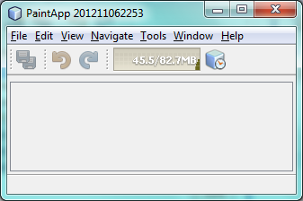
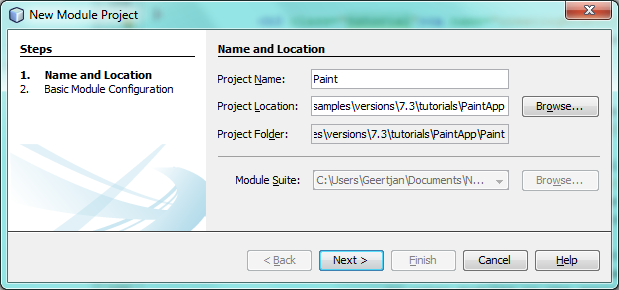

// 
//     Licensed to the Apache Software Foundation (ASF) under one
//     or more contributor license agreements.  See the NOTICE file
//     distributed with this work for additional information
//     regarding copyright ownership.  The ASF licenses this file
//     to you under the Apache License, Version 2.0 (the
//     "License"); you may not use this file except in compliance
//     with the License.  You may obtain a copy of the License at
// 
//       http://www.apache.org/licenses/LICENSE-2.0
// 
//     Unless required by applicable law or agreed to in writing,
//     software distributed under the License is distributed on an
//     "AS IS" BASIS, WITHOUT WARRANTIES OR CONDITIONS OF ANY
//     KIND, either express or implied.  See the License for the
//     specific language governing permissions and limitations
//     under the License.
//

= NetBeans Platform Paint Application Tutorial
:jbake-type: platform_tutorial
:jbake-tags: tutorials 
:jbake-status: published
:syntax: true
:source-highlighter: pygments
:toc: left
:toc-title:
:icons: font
:experimental:
:description: NetBeans Platform Paint Application Tutorial - Apache NetBeans
:keywords: Apache NetBeans Platform, Platform Tutorials, NetBeans Platform Paint Application Tutorial

This tutorial takes you through the basics of using NetBeans IDE to develop rich-client applications on top of the NetBeans Platform. When you develop applications on top of the NetBeans Platform, you are developing on top of the NetBeans IDE's core. All the modules belonging to the IDE that are not relevant to your application are excluded, but those that are useful are kept. By reusing features readily available in IDE's core, you save yourself a lot of time and energy.

// NOTE: If you are using an earlier version of Apache NetBeans, see  link:74/nbm-paintapp.html[the previous version of this document].

For troubleshooting purposes, you are welcome to download the  link:http://web.archive.org/web/20170409072842/http://java.net/projects/nb-api-samples/show/versions/8.0/tutorials/PaintApp[completed tutorial source code].

== Introduction to the Paint Application

This tutorial is designed to get you going as quickly as possible. You will create a simple application on the NetBeans Platform. The application allows the user to paint on the screen:

image::images/paintapp_73_result-2.png[]

This initial version is far from a full fledged paint application, but it demonstrates a very simple case of creating an application on top of the NetBeans Platform.

NOTE:  The  xref:nbm-google.adoc[NetBeans Plugin Quick Start] is a better tutorial for you if, instead of rich-client applications, you want to learn about NetBeans modules.

== Setting Up the Paint Application

In this section, you create the structure of your application. You first need to create an application skeleton, which you can do via a wizard. Then you will create the module that will contain your code.

=== Creating the Application Skeleton

The "NetBeans Platform Application" template will create your application's skeleton. The skeleton will consist of a set of modules that work together to form the basis of your application. You will use the Project Properties dialog to assign your application's splashscreen, application name, and the type and number of NetBeans modules that you want to use. You can also take advantage of such actions as creating a ZIP distribution and building a Java WebStart (JNLP) application, which are important tools in making your application available to other users.

[start=1]
1. Choose File > New Project. Under Categories, select NetBeans Modules. Under projects, select NetBeans Platform Application:

image::images/paintapp_73_new-app-1.png[]

Click Next.

[start=2]
1. In the Name and Location panel, type  ``PaintApp``  in Project Name. Change the Project Location to any directory on your computer:

image::images/paintapp_73_new-app-2.png[]

Click Finish.

[start=3]
1. The new application skeleton opens in the IDE. Look at the new project structure:

image::images/paintapp_73_new-app-3.png[]

You see two subnodes in the Projects window. The first subnode, the "Modules" node, shows you the custom modules that are part of the application. Right now, as you can see, there are none. You can right-click on this subnode and then invoke wizards for creating new modules or for wrapping external JARs into the application. The "Important Files" node shows the build scripts and other supporting files used by the application.

[start=4]
1. Right-click the application and choose Run. The default splash screen is shown and then you see the starting point of your new application:

Look through the menu bar and the toolbar to see the features that your application already has, such as an Exit menu item, a Properties window, and an Output window.

=== Creating the Functionality Module

Now you need a module to contain the actual code you're going to write.

[start=1]
1. Right-click the "Modules" node in the Paint Application. Select Add New:

image::images/paintapp_73_new-mod-1.png[]

[start=2]
1. In the Name and Location panel, type  ``Paint``  in Project Name.

Notice that the module sources will be stored within a folder in the application's directory on disk. Click Next.

[start=3]
1. In the Basic Module Configuration panel, type  ``org.netbeans.paint``  as the "Code Name Base". The code name base is a unique string identifying the module to other modules in the application. Leave everything unchanged.

image::images/paintapp_73_new-mod-3.png[]

Click Finish. The IDE creates the  ``Paint``  project.

[start=4]
1. Take a look at the structure of your application. The project contains all of your sources and project metadata, such as the project's Ant build script. The project opens in the IDE. You can view its logical structure in the Projects window (Ctrl-1) and its file structure in the Files window (Ctrl-2). For example, the Projects window should look as follows:

image::images/paintapp_73_new-mod-4.png[]

[start=5]
1. You will need to subclass several classes that belong to the  link:https://bits.netbeans.org/dev/javadoc/index.html[NetBeans APIs]. All NetBeans APIs are implemented by modules, so this task really just means adding some modules to the list of modules that our module needs in order to run. In the Projects window, right-click the  ``Paint``  project node and choose Properties. The Project Properties dialog box opens. Under Categories, click Libraries. For each of the API's listed in the table below, click "Add Dependency..." and then, in the Filter text box, start typing the name of the class that you want to subclass.

|===
|*Class* |*API* |*Purpose* 

| ``Lookup``  | ``Lookup API``  |Enables loosely coupled communication between modules. 

| ``ActionID``  | ``UI Utilities API``  |Provides annotations for registering Actions in the NetBeans Platform virtual filesystem, as well as the  ``ColorComboBox``  class. 

| ``Messages``  | ``Utilities API``  |Provides a variety of general utility classes, including support for internationalization via the Bundle class and  ``@Messages``  annotation. 

| ``TopComponent``  | ``Window System API``  |Gives you access to the NetBeans window system. 
|===

The first column in the table above lists all the classes that you will subclass in this tutorial. In each case, start typing the class name in the Filter and watch the Module list narrow. Use the table's second column to pick the appropriate API (or, in the case of  ``ColorChooser`` , the library) from the narrowed Module list and then click OK to confirm the choice. Click OK to exit the Project Properties dialog box.

In the Projects window, expand the Paint module's project node and then expand the Libraries node. Notice that all the libraries you have selected are displayed:

image::images/paintapp_73_new-dep-1.png[]

Expand the Paint module's Important Files node and double-click the Project Metadata node. Notice that the API's you selected have been declared as module dependencies in the file. When the module is compiled, the declared dependencies are added to the module's manifest file.

== Creating and Embedding the Paint Canvas

=== Creating the Canvas

The next step is to create the actual component on which the user can paint. Here, you use a pure Swing component—so, let's skip the details of its implementation and just provide the final version. The color chooser bean, which you created the library wrapper module for, is used in the source code for this panel—when you run the finished application, you will see it in the toolbar of the panel for editing images.

[start=1]
1. In the Projects window, expand the  ``Paint``  node, then expand the Source Packages node, and then right-click the  ``org.netbeans.paint``  node. Choose New > Java Class.

[start=2]
1. Enter  ``PaintCanvas``  as the Class Name. Ensure that  ``org.netbeans.paint``  is listed as the Package. Click Finish.  ``PaintCanvas.java``  opens in the Source editor.

[start=3]
1. Replace the default content of the file with the content found  link:images/paintapp_70_PaintCanvas.java[here]. If you named your package something other than  ``org.netbeans.paint`` , correct the package name in the Source editor.

=== Embedding the Canvas in a Window

Now you'll write the only class in this application that needs to touch the  link:https://bits.netbeans.org/dev/javadoc/index.html[NetBeans APIs]. It is a  `` link:https://bits.netbeans.org/dev/javadoc/org-openide-windows/org/openide/windows/TopComponent.html[TopComponent]``  class. A  ``TopComponent``  class is just a  ``JPanel``  class which the NetBeans windowing system knows how to talk to—so that it can be put inside a tabbed container inside the main window.

[start=1]
1. In the Projects window, expand the  ``Paint``  node, then expand the Source Packages node, and then right-click the  ``org.netbeans.paint``  node. Choose New > Java Class. Enter  ``PaintTopComponent``  as the Class Name. Ensure that  ``org.netbeans.paint``  is listed as the Package. Click Finish.  ``PaintTopComponent.java``  opens in the Source editor.

[start=2]
1. Near the top of the file, change the class declaration to the following:

[source,java]
----

public class PaintTopComponent extends TopComponent implements ActionListener, ChangeListener {
----

[start=3]
1. Press Ctrl-Shift-I to fix imports and click OK. The IDE makes the necessary import package declarations at the top of the file:

[source,java]
----

import java.awt.event.ActionListener;
import javax.swing.event.ChangeListener;
import org.openide.windows.TopComponent;
----

Notice the red line under the class declaration that you just entered. Position the cursor in the line and notice that a light bulb appears in the left margin. Click the light bulb (or press Alt-Enter), as shown below:

image::images/paintapp_73_new-dep-2.png[]

Select Implement all abstract methods. The IDE generates two method skeletons— ``actionPerformed()``  and  ``stateChanged()`` . You will fill these out later in this tutorial.

[start=4]
1. Register the  ``PaintTopComponent``  in the window system by adding annotations to the top of the class, as shown here, and then press Ctrl-Shift-I to let the IDE generate the appropriate import statements: 

[source,java,subs="macros"]
----
link:https://bits.netbeans.org/dev/javadoc/org-openide-windows/org/openide/windows/TopComponent.Description.html[@TopComponent.Description]
(
        preferredID = "PaintTopComponent",
        iconBase = "/org/netbeans/paint/new_icon.png", 
        persistenceType = TopComponent.PERSISTENCE_ALWAYS)
link:https://bits.netbeans.org/dev/javadoc/org-openide-windows/org/openide/windows/TopComponent.Registration.html[@TopComponent.Registration](
        mode = "editor", 
        openAtStartup = true)
link:https://bits.netbeans.org/dev/javadoc/org-openide-awt/org/openide/awt/ActionID.html[@ActionID](
        category = "Window", 
        id = "org.netbeans.paint.PaintTopComponent")
link:https://bits.netbeans.org/dev/javadoc/org-openide-awt/org/openide/awt/ActionReferences.html[@ActionReferences]({
link:https://bits.netbeans.org/dev/javadoc/org-openide-awt/org/openide/awt/ActionReference.html[@ActionReference](
        path = "Menu/Window", 
        position = 0),
link:https://bits.netbeans.org/dev/javadoc/org-openide-awt/org/openide/awt/ActionReference.html[@ActionReference](
        path = "Toolbars/File", 
        position = 0)
})
link:https://bits.netbeans.org/dev/javadoc/org-openide-windows/org/openide/windows/TopComponent.OpenActionRegistration.html[@TopComponent.OpenActionRegistration](
        displayName = "#CTL_NewCanvasAction")
link:https://bits.netbeans.org/dev/javadoc/org-openide-util/org/openide/util/NbBundle.Messages.html[@Messages]({
        "CTL_NewCanvasAction=New Canvas",
        "LBL_Clear=Clear",
        "LBL_Foreground=Foreground",
        "LBL_BrushSize=Brush Size",
        "# {0} - image",
        "UnsavedImageNameFormat=Image {0}"})
public class PaintTopComponent extends TopComponent implements ActionListener, ChangeListener {
----

NOTE:  While the module is being compiled, the annotations above will be processed. XML entries will be created in the module's  ``generated-layer.xml``  file, for each of the @TopComponent* and @Action* annotations. The  ``generated-layer.xml``  file will be contributed by the module to the System Filesystem of the application. Read more  xref:../wiki/DevFaqSystemFilesystem.adoc[about the System Filesystem here]. For example, the  ``PaintTopComponent``  will be displayed in the main area of the application, defined by the "editor" position, as specified by the  ``@TopComponent.Registration``  annotation above. For each item defined in the  ``@Messages``  annotation, a new key/value string is generated into a  ``Bundle.java``  class.

[start=5]
1. Add these two icons to "org/netbeans/paint":

image::images/paintapp_70_new_icon.png[] 
image::images/paintapp_70_new_icon24.png[]

The 16x16 pixel icon will be used for the Small Toolbar Icons display, while the 24x24 pixel icon will be used for the Large Toolbar display, as well as in the tab of the window, as defined by  ``@TopComponent.Description``  above.

[start=6]
1. The  ``TopComponent``  class is a wrapper for the  ``Canvas``  you created earlier. All the new import statements and code below is normal Java Swing code. Copy it below and paste it into your  ``PaintTopComponent``  source file:

[source,java]
----

package org.netbeans.paint;

import java.awt.BorderLayout;
import java.awt.Dimension;
import java.awt.FlowLayout;
import java.awt.event.ActionEvent;
import java.awt.event.ActionListener;
import javax.swing.JButton;
import javax.swing.JComponent;
import javax.swing.JLabel;
import javax.swing.JScrollPane;
import javax.swing.JSlider;
import javax.swing.JToolBar;
import javax.swing.event.ChangeEvent;
import javax.swing.event.ChangeListener;
import org.openide.awt.ActionID;
import org.openide.awt.ActionReference;
import org.openide.awt.ActionReferences;
import org.openide.awt.ColorComboBox;
import org.openide.util.NbBundle.Messages;
import org.openide.windows.TopComponent;

@TopComponent.Description(
        preferredID = "PaintTopComponent",
        iconBase = "/org/netbeans/paint/new_icon.png", 
        persistenceType = TopComponent.PERSISTENCE_ALWAYS)
@TopComponent.Registration(
        mode = "editor", 
        openAtStartup = true)
@ActionID(
        category = "Window", 
        id = "org.netbeans.paint.PaintTopComponent")
@ActionReferences({
    @ActionReference(
        path = "Menu/Window", 
        position = 0),
    @ActionReference(
        path = "Toolbars/File", 
        position = 0)
})
@TopComponent.OpenActionRegistration(
        displayName = "#CTL_NewCanvasAction")
@Messages({
    "CTL_NewCanvasAction=New Canvas",
    "LBL_Clear=Clear",
    "LBL_Foreground=Foreground",
    "LBL_BrushSize=Brush Size",
    "# {0} - image",
    "UnsavedImageNameFormat=Image {0}"})
public class PaintTopComponent extends TopComponent implements ActionListener, ChangeListener {

    private PaintCanvas canvas = new PaintCanvas(); //The component the user draws on
    private final JComponent preview = canvas.getBrushSizeView(); //A component in the toolbar that shows the paintbrush size
    private final JSlider brushSizeSlider = new JSlider(1, 24); //A slider to set the brush size
    private final JToolBar toolbar = new JToolBar(); //The toolbar
    private final ColorComboBox color = new ColorComboBox(); //Our color chooser component from the ColorChooser library
    private final JButton clear = new JButton(Bundle.LBL_Clear()); //A button to clear the canvas
    private final JLabel label = new JLabel(Bundle.LBL_Foreground()); //A label for the color chooser
    private final JLabel brushSizeLabel = new JLabel(Bundle.LBL_BrushSize()); //A label for the brush size slider
    private static int ct = 0; //A counter you use to provide names for new images

    public PaintTopComponent() {
        initComponents();
        setDisplayName(Bundle.UnsavedImageNameFormat(ct++));
    }

    private void initComponents() {
        
        setLayout(new BorderLayout());

        //Configure our components, attach listeners:
        color.addActionListener(this);
        clear.addActionListener(this);
        brushSizeSlider.setValue(canvas.getBrushDiameter());
        brushSizeSlider.addChangeListener(this);
        color.setSelectedColor(canvas.getColor());
        color.setMaximumSize(new Dimension(16, 16));

        //Install the toolbar and the painting component:
        add(toolbar, BorderLayout.NORTH);
        add(new JScrollPane(canvas), BorderLayout.CENTER);

        //Configure the toolbar:
        toolbar.setLayout(new FlowLayout(FlowLayout.LEFT, 7, 7));
        toolbar.setFloatable(false);

        //Now populate our toolbar:
        toolbar.add(label);
        toolbar.add(color);
        toolbar.add(brushSizeLabel);
        toolbar.add(brushSizeSlider);
        toolbar.add(preview);
        toolbar.add(clear);
        
    }

    @Override
    public void actionPerformed(ActionEvent e) {
        if (e.getSource() instanceof JButton) {
            canvas.clear();
        } else if (e.getSource() instanceof ColorComboBox) {
            ColorComboBox cc = (ColorComboBox) e.getSource();
            canvas.setColor(cc.getSelectedColor());
        }
    }

    @Override
    public void stateChanged(ChangeEvent e) {
        canvas.setBrushDiameter(brushSizeSlider.getValue());
    }
    
}
----

== Running, Branding, and Packaging the Application

In this section, you try out the application and then package it for distribution to your users.

=== Running the Application

[start=1]
1. Right-click the application and choose Run:

image::images/paintapp_73_run-1.png[]

[start=2]
1. The application starts up, a splash screen is displayed, and then your application is shown. Paint something, as shown below:

image::images/paintapp_73_result-2.png[]

[start=3]
1. Use the application and try to identify areas where you'd like to provide more functionality.

=== Branding the Application

[start=1]
1. Right-click the application and choose Branding.

[start=2]
1. The Branding Window is shown, use it to change icons, the splash screen, the window features, and the strings displayed in the application:

image::images/paintapp_73_brand-1.png[]

=== Packaging the Application

[start=1]
1. Right-click the application and choose Package as:

image::images/paintapp_73_dist-1.png[]

[start=2]
1. Choose the distribution mechanism relevant to your business needs and your user requirements.

[start=3]
1. Switch to the Files window (Ctrl-2) to see the result.

That's it! You have completed the Paint Application. You have learned how to set up a NetBeans Platform application and how to create a new window that displays something to the user.

Next, you are recommended to work through the  xref:nbm-crud.adoc[NetBeans Platform CRUD Application Tutorial], which will teach you how to create a business-oriented NetBeans Platform application that interacts with a database.

xref:../community/mailing-lists.adoc[Send Us Your Feedback]
