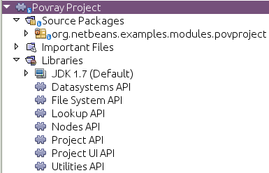

// 
//     Licensed to the Apache Software Foundation (ASF) under one
//     or more contributor license agreements.  See the NOTICE file
//     distributed with this work for additional information
//     regarding copyright ownership.  The ASF licenses this file
//     to you under the Apache License, Version 2.0 (the
//     "License"); you may not use this file except in compliance
//     with the License.  You may obtain a copy of the License at
// 
//       http://www.apache.org/licenses/LICENSE-2.0
// 
//     Unless required by applicable law or agreed to in writing,
//     software distributed under the License is distributed on an
//     "AS IS" BASIS, WITHOUT WARRANTIES OR CONDITIONS OF ANY
//     KIND, either express or implied.  See the License for the
//     specific language governing permissions and limitations
//     under the License.
//

= Writing POV-Ray Support for NetBeans III—Implementing a Project Type
:jbake-type: platform_tutorial
:jbake-tags: tutorials 
:jbake-status: published
:syntax: true
:source-highlighter: pygments
:toc: left
:toc-title:
:icons: font
:experimental:
:description: Writing POV-Ray Support for NetBeans III—Implementing a Project Type - Apache NetBeans
:keywords: Apache NetBeans Platform, Platform Tutorials, Writing POV-Ray Support for NetBeans III—Implementing a Project Type

This is a continuation of the tutorial for building a POV-Ray rendering application on the NetBeans Platform. If you have not read the  xref:nbm-povray-1.adoc[first] and  xref:nbm-povray-2.adoc[second] parts of this tutorial, you may want to start there.

== Setting Up Dependencies

There are a few APIs which we will need to use classes from—so before starting to code, let's add dependencies from the Povray Projects module to those:

[start=1]
1. The Project APIs are not part of the NetBeans Platform, but of NetBeans IDE. The NetBeans Platform Application template we used, at the start of part 1, only included modules into our application from the NetBeans Platform. Therefore, to start with, we need to include the Project APIs into our application, before we can set dependencies on them in our modules.

Right-click the  ``povsuite``  application, choose Properties, and then select the Libraries tab. In the Libraries tab, expand the "ide" node, and select Project API, Project UI, and Project UI API, as shown below:

image::images/povray_71_ch3_pic0.png[]

Finally, click the Resolve button, which includes a number of additional modules into your application.

Click OK above.

[start=2]
1. Right-click the  ``povsuite``  project and choose Run. The application starts up. Now that it includes several project-related modules, you should see a number of new features, accessed from many new menu items, as shown below:

image::images/povray_71_ch3_pic2.png[]

Now we're going to extend the project functionality to include support for a new project type for PovRay projects. That means we'll need to use several APIs, on which we need to set dependencies in the Povray Projects module.

[start=3]
1. Right-click the Povray Projects module in the Projects window in the IDE package, and choose Properties from the popup menu. Open the Libraries tab of the dialog:

image::images/povray_71_ch3_pic1.png[]

[start=4]
1. On the Libraries page of the project properties dialog, shown above, click the Add Dependency button.

[start=5]
1. 
In the dialog that appears, type "ProjectFactory". The Projects API module should become selected in the list below—it is the module that provides this class, so we need a dependency on it to be able to use the class.

image::images/povray_71_ch3_pic3.png[]

Press Enter or Click OK, and then either press Tab and then Space, or click the Add Dependency button to add another dependency.

[start=6]
1. Repeat the steps above with the following classes:

* In the add dependency dialog, type "FileObject". When "FileSystems API" becomes selected, press Enter or click OK.
* Repeat these steps again, typing the name "Lookup", and adding a dependency on the Lookup API.
* Repeat these steps yet again, typing the name "AbstractNode", and adding a dependency on the Nodes API.
* Repeat these steps once again, typing the name "DataFolder", and adding a dependency on the Loaders API.
* Repeat these steps once more, typing the name "LogicalViewProvider", and adding a dependency on the Project UI API.
* Repeat these steps once more, typing the name "HelpCtx", and adding a dependency on the Utilities API.

[start=7]
1. 
You should now see the following:

image::images/povray_71_ch3_pic4.png[]

Click OK to dismiss the dialog. The Libraries node of the project should now show you the dependencies you have set:

== Creating the Project Factory

As with `DataObjects` and `DataLoaders`, the system keeps a registry of things that can identify a directory as being a project and creates a `Project` object to represent it. So, the first step in creating a our own project type is to create a factory—an implementation of `ProjectFactory` from the Projects API—which can figure out if a directory is a POV-Ray project and, if it is one, make an instance of our `Project` implementation for it.

[start=1]
1. Right-click the `org.netbeans.examples.modules.povproject` package, and choose New > Java Class:

image::images/povray_71_ch3_pic6.png[]

[start=2]
1. In the New File wizard that appears, enter the name  ``PovProjectFactory`` . Press Enter or click OK to create the new file.

[start=3]
1. In the code editor, modify the class signature of  ``PovProjectFactory``  as follows:

[source,java]
----

public class PovProjectFactory implements ProjectFactory {
----

Press Alt-Shift-F (Ctrl-Shift-F on Macintosh) to Fix Imports.

[start=4]
1. Position the caret somewhere in the class signature line. When the lightbulb glyph appears in the margin, press Alt-Enter, and then Enter again to accept the hint "Implement All Abstract Methods". The class definition should now be as follows:

[source,java]
----

package org.netbeans.examples.modules.povproject;

import java.io.IOException;
import org.netbeans.api.project.Project;
import org.netbeans.spi.project.ProjectFactory;
import org.netbeans.spi.project.ProjectState;
import org.openide.filesystems.FileObject;

public class PovProjectFactory implements ProjectFactory {

    @Override
    public boolean isProject(FileObject projectDirectory) {
        throw new UnsupportedOperationException("Not supported yet.");
    }

    @Override
    public Project loadProject(FileObject projectDirectory, ProjectState state) throws IOException {
        throw new UnsupportedOperationException("Not supported yet.");
    }

    @Override
    public void saveProject(Project project) throws IOException, ClassCastException {
        throw new UnsupportedOperationException("Not supported yet.");
    }

}
----

[start=5]
1. Add the following constants to the head of the `PovProjectFactory` class definition, as follows:

[source,java]
----

public class PovProjectFactory implements ProjectFactory {

    *public static final String PROJECT_DIR = "pvproject";
    public static final String PROJECT_PROPFILE = "project.properties";*
----

[start=6]
1. The first method we will implement is the `isProject()` method. This method needs to be very fast—it should determine whether or not a directory is a project as quickly as possible, because it will be called once for each directory shown in the file chooser when the user selects File > Open Project.

Implement the method as follows:

[source,java]
----

@Override
public boolean isProject(FileObject projectDirectory) {
    *return projectDirectory.getFileObject(PROJECT_DIR) != null;*
}
----

This simple test for the presence of a subdirectory called "pvproject" is all we need to determine that something is _not_ one of our projects.

[start=7]
1. Next, we will implement the code that actually loads a project, given a directory. The project system handles caching of projects, so all that's needed here is to create a new project:

[source,java]
----

@Override
public Project loadProject(FileObject projectDirectory, ProjectState state) throws IOException {
    *return isProject (projectDirectory) ? new PovrayProject (projectDirectory, state) : null;*
}
----

The only interesting thing here is the `ProjectState` object, which we pass along with the directory to our project's constructor. It is provided to us by the project system, and can be used to mark a project as needing to be saved. We will use it later to do that when the user changes the main file of the project, which will be written to disk in the `project.properties` when our project is closed.

[start=8]
1. The final thing to implement is `saveProject()`—this is what will write out any unsaved changes to disk when a POV-Ray project is closed, or when the application shuts down:

[source,java]
----

@Override
public void saveProject(Project project) throws IOException, ClassCastException {

    FileObject projectRoot = project.getProjectDirectory();
    if (projectRoot.getFileObject(PROJECT_DIR) == null) {
        throw new IOException ("Project dir " + projectRoot.getPath() + " deleted," +
                " cannot save project");
    }

    //Force creation of the scenes/ dir if it was deleted
    project.getLookup(PovrayProject.class).getScenesFolder(true);

    //Find the properties file pvproject/project.properties,
    //creating it if necessary
    String propsPath = PROJECT_DIR + "/" + PROJECT_PROPFILE;
    FileObject propertiesFile = projectRoot.getFileObject(propsPath);
    if (propertiesFile == null) {
        //Recreate the properties file if needed
        propertiesFile = projectRoot.createData(propsPath);
    }

    Properties properties = (Properties) project.getLookup().lookup (Properties.class);
    File f = FileUtil.toFile(propertiesFile);
    properties.store(new FileOutputStream(f), "NetBeans Povray Project Properties");

}
----

We haven't written the `PovrayProject` yet, which is why you have some red underline error marks in your code, but from this code it's pretty clear what it will look like—we are creating the `scenes/` directory if it does not exist or was deleted; we fetch a Properties object out of the project's `Lookup`, and save it into `pvproject/project.properties`—that's all there is or will be to saving a POV-Ray project.

== Implementing PovrayProject

Now we need to create the Java class that represents a POV-Ray project—this is what our `PovProjectFactory` will create if the user opens a project that it owns. The Project API in NetBeans is quite simple. A "project", programmatically is the association of a directory on disk with a `Lookup` - a bag-o-stuff that can be queried for known interfaces. The Project API then defines some interfaces and classes that should be available from a `Project`'s Lookup.

So the first thing will be to create our implementation of `org.netbeans.api.project.Project`.

[start=1]
1. Right-click the `org.netbeans.examples.modules.povproject` package in the Povray Projects project, and choose New > Java Class again. In the New File wizard that appears, enter the name  ``PovrayProject`` . Press Enter or click OK to create the new file.

[start=2]
1. 
In the code editor, modify the signature line of `PovrayProject` as follows:

[source,java]
----

public final class PovrayProject implements Project {
----

Press Alt-Shift-F (Ctrl-Shift-F on Macintosh) to Fix Imports.

[start=3]
1. Position the caret somewhere in the class signature line. When the lightbulb glyph appears in the margin, press Alt-Enter, and then Enter again to accept the hint "Implement All Abstract Methods". You should now see the following:

[source,java]
----

package org.netbeans.examples.modules.povproject;

import org.netbeans.api.project.Project;
import org.openide.filesystems.FileObject;
import org.openide.util.Lookup;

public class PovrayProject implements Project {

    @Override
    public FileObject getProjectDirectory() {
        throw new UnsupportedOperationException("Not supported yet.");
    }

    @Override
    public Lookup getLookup() {
        throw new UnsupportedOperationException("Not supported yet.");
    }

}
----

[start=4]
1. Implement the top of the class as follows:

[source,java]
----

public class PovrayProject implements Project {

    public static final String SCENES_DIR = "scenes"; //NOI18N
    public static final String IMAGES_DIR = "images"; //NOI18N

    private final FileObject projectDir;
    LogicalViewProvider logicalView = new PovrayLogicalView(this);
    private final ProjectState state;

    public PovrayProject(FileObject projectDir, ProjectState state) {
        this.projectDir = projectDir;
        this.state = state;
    }

    @Override
    public FileObject getProjectDirectory() {
        return projectDir;
    }

    FileObject getScenesFolder(boolean create) {
        FileObject result =
            projectDir.getFileObject(SCENES_DIR);

        if (result == null &amp;&amp; create) {
            try {
                result = projectDir.createFolder (SCENES_DIR);
            } catch (IOException ioe) {
                Exceptions.printStackTrace(ioe);
            }
        }
        return result;
    }

    FileObject getImagesFolder(boolean create) {
        FileObject result =
            projectDir.getFileObject(IMAGES_DIR);
        if (result == null &amp;&amp; create) {
            try {
                result = projectDir.createFolder (IMAGES_DIR);
            } catch (IOException ioe) {
                Exceptions.printStackTrace(ioe);
            }
        }
        return result;
    }
                    
----

The last two methods we will use later on in this tutorial—they define (and can create) the `scenes` code and `images` folders that POV-Ray source files and their resulting image files will go into when the project is rendered.

[start=5]
1. The actually interesting code goes into our implementation of `getLookup()`. Eventually we will put some of our own interfaces into the project's `Lookup`; for now it will be mainly standard stuff—interfaces provided by the Project API module which we will implement. Implement `getLookup()` as follows:

[source,java]
----

    private Lookup lkp;

    @Override
    public Lookup getLookup() {
        if (lkp == null) {
            lkp = Lookups.fixed(new Object[]{
                        this, //handy to expose a project in its own lookup
                        state, //allow outside code to mark the project as needing saving
                        new ActionProviderImpl(), //Provides standard actions like Build and Clean
                        loadProperties(), //The project properties
                        new Info(), //Project information implementation
                        logicalView, //Logical view of project implementation
                    });
        }
        return lkp;
    }
----

[start=6]
1. The one interesting thing in the code above is the call to `loadProperties()`—for storing project settings, we will use a properties file. So all we do here is read it into a `Properties` object, and make that object available through the project's `Lookup`. We will want to save any changes made to this properties object, so we'll use a bit of cleverness and create a `Properties` subclass that will mark the project as needing saving whenever something calls `put()`:

[source,java]
----

    private Properties loadProperties() {

        FileObject fob = projectDir.getFileObject(PovProjectFactory.PROJECT_DIR
                + "/" + PovProjectFactory.PROJECT_PROPFILE);

        Properties properties = new NotifyProperties(state);
        if (fob != null) {
            try {
                properties.load(fob.getInputStream());
            } catch (Exception e) {
                Exceptions.printStackTrace(e);
            }
        }

        return properties;

    }

    private static class NotifyProperties extends Properties {

        private final ProjectState state;

        NotifyProperties(ProjectState state) {
            this.state = state;
        }

        @Override
        public Object put(Object key, Object val) {

            Object result = super.put(key, val);

            if (((result == null) != (val == null)) || (result != null
                    &amp;&amp; val != null &amp;&amp; !val.equals(result))) {
                state.markModified();
            }

            return result;

        }

    }
----

Other than that, the things in the `Lookup` are what should typically be found in the `Lookup` of any project—the project itself (the project infrastructure reserves the right to wrap any Project type in a wrapper Project object, so this guarantees being able to get at the real project instance), its state, an `ActionProvider` to handle standard commands like Build and Clean, a `ProjectInformation` implementation that supplies the display name and icon for the project. The last thing in the lookup is the _logical view_ which we will come to next—this is what provides a `Node` for the project that will be displayed on the _Projects_ tab in NetBeans.

[start=7]
1. There are two remaining classes we need to create—the implementations of `ActionProvider` and `ProjectInformation`. We will simply stub these for now—add these two classes as inner classes of `PovrayProject`:

[source,java]
----

private final class ActionProviderImpl implements ActionProvider {

    @Override
    public String[] getSupportedActions() {
        return new String[0];
    }

    @Override
    public void invokeAction(String string, Lookup lookup) throws IllegalArgumentException {
        //do nothing
    }

    @Override
    public boolean isActionEnabled(String string, Lookup lookup) throws IllegalArgumentException {
        return false;
    }

}

/**
 * Implementation of project system's ProjectInformation class
 */
private final class Info implements ProjectInformation {

    @Override
    public Icon getIcon() {
        return new ImageIcon(ImageUtilities.loadImage(
                "org/netbeans/examples/modules/povrayproject/resources/scenes.gif"));
    }

    @Override
    public String getName() {
        return getProjectDirectory().getName();
    }

    @Override
    public String getDisplayName() {
        return getName();
    }

    @Override
    public void addPropertyChangeListener(PropertyChangeListener pcl) {
        //do nothing, won't change
    }

    @Override
    public void removePropertyChangeListener(PropertyChangeListener pcl) {
        //do nothing, won't change
    }

    @Override
    public Project getProject() {
        return PovrayProject.this;
    }

}
----

== Implementing the Logical View

One line in the code you entered above should still be marked as being an error:

[source,java]
----

LogicalViewProvider logicalView = new PovrayLogicalView(this);
----

In NetBeans IDE, what you see in the Projects window is a "logical view" of your project. This is a view that may not exactly reflect the structure of files on disk (the Files window and Favorites window is for that), but is more convenient to work with—for example, collapsing a tree of directories into a single node with a Java package name.

What we will implement now is a `LogicalViewProvider`. This is basically a factory that produces a `Node` that represents the project. What child `Node`s that `Node` has, and what actions are available on them is up to us.

[start=1]
1. Right-click the `org.netbeans.examples.modules.povproject` package in the Povray Projects project, and choose New > Java Class. In the New File wizard that appears, enter the name "PovrayLogicalView". Press Enter or click OK to create the new file.

[start=2]
1. In the code editor, modify the signature line of `PovrayLogicalView` as follows:

[source,java]
----

class PovrayLogicalView implements LogicalViewProvider {
----

Press Alt-Shift-F (Ctrl-Shift-F on Macintosh) to Fix Imports.

[start=3]
1. Position the caret somewhere in the class signature line. When the lightbulb glyph appears in the margin, press Alt-Enter, and then Enter again to accept the hint "Implement All Abstract Methods".

We now have a skeleton implementation of our logical view:

[source,java]
----

class PovrayLogicalView implements LogicalViewProvider {

    public PovrayLogicalView(PovrayProject aThis) {
    }

    @Override
    public Node createLogicalView() {
        throw new UnsupportedOperationException("Not supported yet.");
    }

    @Override
    public Node findPath(Node root, Object target) {
        throw new UnsupportedOperationException("Not supported yet.");
    }

}
----

NOTE:  Part of the value of having a concept of a project is the ability to present data in a way that is closer to the way a user will _think_ about their project than the structure of files on disk may be. The logical view of a project should present a simplified structure showing users what they need to get their work done.

NOTE:  In our case, we  xref:nbm-povray-2.adoc#phys[already decided] that the user did not need to see the `images/` subdirectory, they should just be able to click a scene file and choose _View_, and that we want to put scene files in a `scenes/` subdirectory. So the logical thing to do for our logical view is to have it show the contents of that `scenes/` directory. We can return whatever `Node` we want as the root of our logical view of the project, and NetBeans makes using the content of the `scenes/` subdirectory very easy.

In the Nodes API is a class called `FilterNode`. What it does is wrap an existing `Node`, and by default, simply expose the same child nodes, display name, icon, actions, etc. as the original. We can subclass `FilterNode` to change its icon and the set of actions available on it. The `DataLoader` infrastructure already provides a loader that recognizes Filesystem folders—an API class called `DataFolder`. So we get the original node for the folder for free—we just need to provide a subclass that uses our icon and (eventually) actions.

[start=4]
1. We can now implement `PovrayLogicalView` as follows:

[source,java]
----

class PovrayLogicalView implements LogicalViewProvider {

    private final PovrayProject project;

    public PovrayLogicalView(PovrayProject project) {
        this.project = project;
    }

    @Override
    public Node createLogicalView() {

        try {

            //Get the scenes directory, creating if deleted:
            FileObject scenes = project.getScenesFolder(true);

            //Get the DataObject that represents it:
            DataFolder scenesDataObject =
                    DataFolder.findFolder(scenes);

            //Get its default node—we'll wrap our node around it to change the
            //display name, icon, etc:
            Node realScenesFolderNode = scenesDataObject.getNodeDelegate();

            //This FilterNode will be our project node:
            return new ScenesNode(realScenesFolderNode, project);

        } catch (DataObjectNotFoundException donfe) {

            Exceptions.printStackTrace(donfe);

            //Fallback—the directory couldn't be created -
            //read-only filesystem or something evil happened:
            return new AbstractNode (Children.LEAF);

        }

    }

    /**
     * This is the node you actually see in the Projects window for the project
     */
    private static final class ScenesNode extends FilterNode {

        final PovrayProject project;

        public ScenesNode(Node node, PovrayProject project) throws DataObjectNotFoundException {
            super(node, new FilterNode.Children(node),
                    //The projects system wants the project in the Node's lookup.
                    //NewAction and friends want the original Node's lookup.
                    //Make a merge of both:
                    new ProxyLookup(
                        Lookups.singleton(project),
                        node.getLookup())
                    );
            this.project = project;
        }

        @Override
        public Image getIcon(int type) {
            return ImageUtilities.loadImage(
                    "org/netbeans/examples/modules/povproject/resources/scenes.gif");
        }

        @Override
        public Image getOpenedIcon(int type) {
            return getIcon(type);
        }

        @Override
        public String getDisplayName() {
            return project.getProjectDirectory().getName();
        }

    }

    @Override
    public Node findPath(Node root, Object target) {
        //leave unimplemented for now
        return null;
    }

}
----

The interesting code above is in the method `createLogicalView()`. What we do there is quite simple and elegant—we have already decided that there will be a `scenes/` directory in our project, and that's where new `.pov` and `.inc` files will be created. And that is all we want to expose to the user when they interact with one of our projects. So, we simply find the `Node` for that folder in the real filesystem on disk, and wrap it in our own `FilterNode`, which can expose whatever actions, icon, child `Node`s or properties we choose. Essentially, the logical view of the project is a view of a subdirectory of the project, with a special icon and (eventually) set of actions.

The final method, `findPath()` allows a user to use a keystroke to select whatever they're editing in the _Projects_ tab in the main window - we will leave that unimplemented for now.

[start=5]
1. One final thing we need to do is to provide the icon referenced from `PovrayLogicalView.ScenesNode.getIcon()` above. Any 16x16 `.gif` or `.png` file will do, or you can use 
[.feature]
--
imageone 
image::images/povray_scenes.gif[role="left", link="images/povray_scenes.gif"]
--
. Create a new java package "resources" underneath `org.netbeans.examples.modules.povproject`, and copy or save the image file there, modifying the file name in the source code if necesary.

== Registering the Project Factory

The system needs to know about our project type, for this module to do anything. We will register our project type into the default lookup using the technique of adding a file to `META-INF/services` in our module's JAR:

[start=1]
1. Add the @ServiceProvider annotation above the class signature of the factory class:

[source,java]
----

@ServiceProvider(service=ProjectFactory.class)
public class PovProjectFactory implements ProjectFactory {
----

[start=2]
1. Right-click the Povray Project and choose Build.

[start=3]
1. In the Files window, expand the 'build' folder and notice that the META-INF/services folder has been created for you, via the build process, at which time a NetBeans annotation processor processed the @ServiceProvider annotation:

image::images/povray_71_ch3_pic7.png[]

[start=4]
1. When you open the file above, notice that it consists of one line, which is the name of the implementing class:

[source,java]
----

org.netbeans.examples.modules.povproject.PovProjectFactory
----

That's all it takes to register our project type, so that when our module is loaded, the NetBeans Platform will start recognizing POV-Ray projects.

== Trying Out the New Project

We now have a working (albeit not terribly useful) implementation of POV-Ray projects. As yet we have no way to create such a project on disk, but if you were to have one, you could open it and view it.

[start=1]
1. To try out your code at this point, download  link:images/povray_71_ch3_Wonderland.zip[Wonderland.zip] which contains such a project, unpack it to a temporary directory and attempt to open it as a project, following the steps below.

[start=2]
1. 
Run the application, go to File | Open Project, and when you browse to the temporary directory created above, you should see that your project is recognized:

image::images/povray_71_ch3_pic8.png[]

[start=3]
1. Open the project. In the Projects window, you will see the logical view created above:

image::images/povray_71_ch3_pic9.png[]

[start=4]
1. In the Files window, you will see all the files in the project:

image::images/povray_71_ch3_pic10.png[]

== Next Steps

The  xref:nbm-povray-4.adoc[next tutorial] will begin to add truly useful functionality to our projects.

