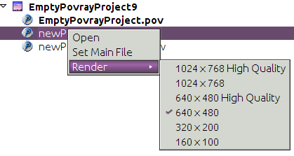

// 
//     Licensed to the Apache Software Foundation (ASF) under one
//     or more contributor license agreements.  See the NOTICE file
//     distributed with this work for additional information
//     regarding copyright ownership.  The ASF licenses this file
//     to you under the Apache License, Version 2.0 (the
//     "License"); you may not use this file except in compliance
//     with the License.  You may obtain a copy of the License at
// 
//       http://www.apache.org/licenses/LICENSE-2.0
// 
//     Unless required by applicable law or agreed to in writing,
//     software distributed under the License is distributed on an
//     "AS IS" BASIS, WITHOUT WARRANTIES OR CONDITIONS OF ANY
//     KIND, either express or implied.  See the License for the
//     specific language governing permissions and limitations
//     under the License.
//

= Writing POV-Ray Support for NetBeans VI—Implementing the API
:jbake-type: platform_tutorial
:jbake-tags: tutorials 
:jbake-status: published
:syntax: true
:source-highlighter: pygments
:toc: left
:toc-title:
:icons: font
:experimental:
:description: Writing POV-Ray Support for NetBeans VI—Implementing the API - Apache NetBeans
:keywords: Apache NetBeans Platform, Platform Tutorials, Writing POV-Ray Support for NetBeans VI—Implementing the API

This is a continuation of the tutorial for building a POV-Ray rendering application on the NetBeans Platform. If you have not read the  xref:nbm-povray-1.adoc[first],  xref:nbm-povray-2.adoc[second],  xref:nbm-povray-3.adoc[third],  xref:nbm-povray-4.adoc[fourth], and  xref:nbm-povray-5.adoc[fifth] parts of this tutorial, you may want to start there.

== Implementing MainFileProvider

The first class we will implement is `MainFileProvider`. This is the class that our `Node`s for POV-Ray files will look up, to see if they represent the main scene file of the project (if so, they will display their name in boldface text, and later this will be used to provide actions to set which file is the main file).

[start=1]
1. In the Povray Project module, add the key for the main file to the top of the  ``PovrayProject``  class:

[source,java]
----

public static final String KEY_MAINFILE = "main.file";
----

[start=2]
1. In the Povray Project module, create a new Java class in the package `org.netbeans.examples.modules.povproject`, and call it "MainFileProviderImpl".

[start=3]
1. Implement it as follows:

[source,java]
----

class MainFileProviderImpl extends MainFileProvider {

    private final PovrayProject proj;

    private FileObject mainFile = null;

    private boolean checked = false;

    MainFileProviderImpl(PovrayProject proj) {
        this.proj = proj;
    }

    @Override
    public FileObject getMainFile() {
        //Try to look up the main file in the project properties
        //the first time this is called;  no need to look it up every
        //time, either it's there or it's not and when the user sets it
        //we'll save it when the project is closed
        if (mainFile == null &amp;&amp; !checked) {
            checked = true;
            Properties props = (Properties) proj.getLookup().lookup(Properties.class);
            String path = props.getProperty(PovrayProject.KEY_MAINFILE);
            if (path != null) {
                FileObject projectDir = proj.getProjectDirectory();
                mainFile = projectDir.getFileObject(path);
            }
        }
        if (mainFile != null &amp;&amp; !mainFile.isValid()) {
            return null;
        }
        return mainFile;
    }

    @Override
    public void setMainFile(FileObject file) {
        String projPath = proj.getProjectDirectory().getPath();
        assert file == null ||
                file.getPath().startsWith(projPath) :
                "Main file not under project";
        boolean change = ((mainFile == null) != (file == null)) ||
                (mainFile != null &amp;&amp; !mainFile.equals(file));
        if (change) {
            mainFile = file;
            //Get the project properties (loaded from
            //$PROJECT/pvproject/project.properties)
            Properties props = (Properties) proj.getLookup().lookup(
                    Properties.class);
            //Store the relative path from the project root as the main file
            String relPath = file.getPath().substring(projPath.length());
            props.put(PovrayProject.KEY_MAINFILE, relPath);
        }
    }

}
----

The code above is simple and quite straightforward—it will look for a `Properties` object in the `Lookup` of the project. The getter will look for the value of "main.file" from the `Properties` object (which was loaded from `$PROJECT/pvproject/project.properties`), which will be a relative path to the main file. If there is a value for that key, try to find the corresponding file and return it. The setter, in turn, will write a new relative path to the `Properties` object. That in turn, will cause the project to be marked as modified, so the system will call `PovProjectFactory.saveProject()` if it is unloading the project, causing the `Properties` to be written out to disk in `$PROJECT/pvproject/project.properties`.

[start=4]
1. Add `new MainFileProviderImpl(this)` to the implementation of `getLookup()` in `PovrayProject`, so that it is included in the array of objects that make up the lookup contents:

[source,java]
----

@Override
public Lookup getLookup() {
    if (lkp == null) {
        lkp = Lookups.fixed(new Object[]{
                    this, //handy to expose a project in its own lookup
                    state, //allow outside code to mark the project as needing saving
                    new ActionProviderImpl(), //Provides standard actions like Build and Clean
                    loadProperties(), //The project properties
                    new Info(), //Project information implementation
                    logicalView, //Logical view of project implementation
                    *new MainFileProviderImpl(this)*
                });
    }
    return lkp;
}
----

== Implementing RendererService—Providing Default Renderer Settings

The next class to implement is `RendererService`—this is the service, belonging to the project, by which a project will be "compiled" into an image (by executing the POV-Ray program and passing it arguments).

As we discussed  xref:nbm-povray-2.adoc[earlier], we are not going to try to implement a complicated dialog that makes every possible POV-Ray setting adjustable via a GUI widget—this would add a lot of complexity when many users would be satisfied with a reasonable set of defaults. So we will have a set of different default combinations of settings that should satisfy most users. Later we will add the ability to create completely customized settings by editing the `project.properties` of a POV-Ray project, to satisfy the needs of power users.

Right now, we will not worry about the execution part—`RendererService` also provides for named sets of settings—combinations of line switches which should be passed to POV-Ray to determine rendering quality, image size and speed. Right now we will only implement that part of `RendererService`.

This is where we will begin dealing directly with the System Filesystem—the registry of runtime data supplied by modules. What we will do is create `.properties` files for each set of standard settings we will supply. We will start by creating `.properties` files for each set of settings in our module.

[start=1]
1. Create a new Java Package in the Povray Project project, `org.netbeans.examples.modules.povproject.defaults`. This is where we will put our properties files.

[start=2]
1. 
Create six properties files with the following contents in that package:

* 160x100.properties

[source,java]
----

W=160
H=100
Q=4
FN=8
A=0.0
                            
----

* 320x200.properties

[source,java]
----

W=320
H=200
Q=4
FN=8
A=0.0
                            
----

* 640x480.properties

[source,java]
----

W=640
H=480
Q=4
FN=8
A=0.0
                            
----

* 640x480hq.properties

[source,java]
----

W=640
H=480
Q=R
FN=8
A=0.9
                            
----

* 1024x768.properties

[source,java]
----

W=1024
H=768
Q=4
FN=9
A=0.0
                            
----

* 1024x768hq.properties

[source,java]
----

W=1024
H=768
Q=R
FN=8
A=0.9
                            
----

[start=3]
1. Next, we will want to actually add these to the System Filesystem, so our module can find them at runtime, and more importantly, so other modules can modify and save, or add additional, sets of default settings by adding more properties files to the same folder we put these files in, in the System Filesystem.

Right-click the Povray Project project and choose New | Other | Module Development | XML Layer. Then click Next and Finish. The IDE creates the  ``layer.xml``  file and registers it in the project's manifest. Open the newly created  ``layer.xml``  file in the code editor.

[start=4]
1. Replace the content of the  ``layer.xml``  file with the content below.

[source,xml]
----

<?xml version="1.0" encoding="UTF-8"?>
<!DOCTYPE filesystem PUBLIC "-//NetBeans//DTD Filesystem 1.2//EN" "https://netbeans.org/dtds/filesystem-1_2.dtd">
<filesystem>

    <folder name="Povray">

        <folder name="RendererSettings">

        <!-- Declare a file, with its content provided by the URL.  This
                 will be the command line arguments for 1024x768 high quality
                 rendering -->
            <file name="1024x768hq.properties" url="defaults/1024x768hq.properties">
                <attr name="SystemFileSystem.localizingBundle"
                  stringvalue="org.netbeans.examples.modules.povproject.defaults.Bundle"/>
            </file>
        <!-- This is an ordering attribute, it determines that the
                 DataFolder (but *not* the FileObject) for this folder will return
                 its child DataObjects (and thus also its Node's children) in
                 a specific order—in this case we are specifying that
                 1024x768hq must come before 1024x768.properties. -->
            <attr name="1024x768hq.properties/1024x768.properties" boolvalue="true"/>

            <file name="1024x768.properties" url="defaults/1024x768.properties">
                <attr name="SystemFileSystem.localizingBundle"
                  stringvalue="org.netbeans.examples.modules.povproject.defaults.Bundle"/>
            </file>

            <attr name="1024x768.properties/640x480hq.properties" boolvalue="true"/>
            <file name="640x480hq.properties" url="defaults/640x480hq.properties">
                <attr name="SystemFileSystem.localizingBundle"
                  stringvalue="org.netbeans.examples.modules.povproject.defaults.Bundle"/>
            </file>

            <attr name="640x480hq.properties/640x480.properties" boolvalue="true"/>
            <file name="640x480.properties" url="defaults/640x480.properties">
                <attr name="SystemFileSystem.localizingBundle"
                  stringvalue="org.netbeans.examples.modules.povproject.defaults.Bundle"/>
            </file>

            <attr name="640x480.properties/320x200.properties" boolvalue="true"/>
            <file name="320x200.properties" url="defaults/320x200.properties">
                <attr name="SystemFileSystem.localizingBundle"
                  stringvalue="org.netbeans.examples.modules.povproject.defaults.Bundle"/>
            </file>

            <attr name="320x200.properties/160x100.properties" boolvalue="true"/>
            <file name="160x100.properties" url="defaults/160x100.properties">
                <attr name="SystemFileSystem.localizingBundle"
                  stringvalue="org.netbeans.examples.modules.povproject.defaults.Bundle"/>
            </file>

        </folder>

    </folder>

</filesystem>
----

What this XML does is map the properties files we just created into the system filesystem in the folder `Povray/RendererSettings`, which is where our code will look for them. Additionally, it specifies _ordering attributes_, which are attributes we are adding to the folder `RendererSettings/`, which will determine what order the files will appear in when code asks for the array of children of the `DataFolder` (`DataObject` subclass for folders) or its Node for this folder.

[start=5]
1. You may have noticed the attribute `SystemFilesystem.localizingBundle` which we added to the `RendererSettings` folder. NetBeans `FileObject`s (which is what the "files" in the System Filesystem are) can have ad-hoc key-value pairs associated with them. `SystemFilesystem.localizingBundle` is a magic attribute which the system will use to localize the names of files—all you have to do is get the `DataObject` for a file in the system filesystem, get the `Node` for that `DataObject`, and the return value of `Node.getDisplayName()` for that `Node` will look up its localized display name in the requested resource bundle—this is how file names for things declared in the System Filesystem are localized.

So we need one _more_ properties file in `org.netbeans.examples.modules.povproject.defaults`—create one called "Bundle". This one won't contain renderer defaults, it will contain mappings from the file names of the files we declared above, to their localized, human friendly names.

[start=6]
1. Add the following contents to `Bundle.properties`:

[source,java]
----

Povray/RendererSettings/1024x768.properties=1024 x 768
Povray/RendererSettings/1024x768hq.properties=1024 x 768 High Quality
Povray/RendererSettings/640x480hq.properties=640 x 480 High Quality
Povray/RendererSettings/640x480.properties=640 x 480
Povray/RendererSettings/320x200.properties=320 x 200
Povray/RendererSettings/160x100.properties=160 x 100
----

[start=7]
1. Make sure that you have the new files in the correct places, reflecting the structure in the image below:

image::images/povray_71_ch6_pic1.png[]

== Implementing RendererService—Basic Implementation

Now we have a set of default settings to show, so we can implement the methods of `RendererService` that will expose them.

[start=1]
1. Create a new class, `RendererServiceImpl`, in `org.netbeans.examples.modules.povproject`.

[start=2]
1. Modify the class declaration to say that it extends `RendererService` and press Ctrl-Shift-I to fix imports and to generate stub implementations of the abstract methods. The result should be as follows:

[source,java]
----

package org.netbeans.examples.modules.povproject;

import java.util.Properties;
import org.netbeans.examples.api.povray.RendererService;
import org.openide.filesystems.FileObject;

public class RendererServiceImpl extends RendererService {

    @Override
    public FileObject render(FileObject scene, String propertiesName) {
        throw new UnsupportedOperationException("Not supported yet.");
    }

    @Override
    public FileObject render(FileObject scene, Properties renderSettings) {
        throw new UnsupportedOperationException("Not supported yet.");
    }

    @Override
    public FileObject render(FileObject scene) {
        throw new UnsupportedOperationException("Not supported yet.");
    }

    @Override
    public FileObject render() {
        throw new UnsupportedOperationException("Not supported yet.");
    }

    @Override
    public String[] getAvailableRendererSettingsNames() {
        throw new UnsupportedOperationException("Not supported yet.");
    }

    @Override
    public Properties getRendererSettings(String name) {
        throw new UnsupportedOperationException("Not supported yet.");
    }

    @Override
    public String getPreferredRendererSettingsNames() {
        throw new UnsupportedOperationException("Not supported yet.");
    }

    @Override
    public String getDisplayName(String settingsName) {
        throw new UnsupportedOperationException("Not supported yet.");
    }

}
----

[start=3]
1. The first things we will do are implement the constructor and leave the render methods stubbed out—we will implement these later:

[source,java]
----

private PovrayProject proj;

    public RendererServiceImpl(PovrayProject proj) {
        this.proj = proj;
    }

    PovrayProject getProject() {
        return proj;
    }
----

[start=4]
1. Next, we will implement some private utility methods that the other methods will do. This should help to give some of the flavor of working with things in the system filesystem.

[source,java]
----

    private FileObject getRendererSettingsFolder() {
        String folderName = "Povray/RendererSettings";
        FileObject result = FileUtil.getConfigFile(folderName);
        if (result == null &amp;&amp; !logged) {
            //Corrupted userdir or something is very very wrong.
            //Log it and move on.
            Exceptions.printStackTrace(new IllegalStateException("Renderer settings dir missing!"));
            logged = true;
        }
        return result;
    }

    private static boolean logged = false;

    private FileObject fileFor (String settingsName) {
        FileObject settingsFolder = getRendererSettingsFolder();
        FileObject result;
        if (settingsFolder != null) { //should never be null
            result = settingsFolder.getFileObject(settingsName);
        } else {
            result = null;
        }
        return result;
    }

    private void setPreferredRendererSettingsName(String val) {
        getPreferences().put(KEY_PREFERRED_SETTINGS, val);
    }

    private static final String KEY_PREFERRED_SETTINGS = "preferredSettings";

    static Preferences getPreferences() {
        return Preferences.userNodeForPackage(RendererServiceImpl.class);
    }
----

The first thing we have is a utility method that finds the folder we declared in our XML layer, in the System Filesystem—that is what `getRendererSettingsFolder()` does. You'll note that there is a null check. This folder *should* not be null, since we are declaring it in our layer. But it conceivably could be (a corrupted settings directory or a module that for some reason hides the settings directory - it should not happen, but it is theoretically possible), so we log an exception if so, rather than throwing exceptions every time something goes and looks for a display name for a menu item or similar.

The next method is a utility method that just fetches the file corresponding to a file name—we are returning the names of all files in the settings folder, so this will allow us to find a corresponding properties file.

The last two methods are simply for saving the last-used set of renderer settings, and simply use the standard Java Preferences API.

[start=5]
1. The next method we want to implement is `getAvailableRendererSettingsNames()`. This method will return an array of `String`s—the localized, human-friendly names of all of the files which we declared above:

[source,java]
----

    @Override
    public String[] getAvailableRendererSettingsNames() {
        FileObject settingsFolder = getRendererSettingsFolder();
        String[] result;
        if (settingsFolder != null) {
            //Use a DataFolder here, so our ordering attributes in the layer
            //file are applied, and our returned String array will be in the
            //order we want
            DataFolder fld = DataFolder.findFolder(settingsFolder);
            DataObject[] kids = fld.getChildren();
            result = new String[ kids.length ];
            for (int i = 0; i < kids.length; i++) {
                result[i] = kids[i].getPrimaryFile().getNameExt();
            }
        } else {
            result = new String[0];
        }
        return result;
    }
----

This is quite straightforward—we just iterate all of the files in the folder, and return an array of `String`s with their names. The one twist to it is that we don't iterate the _`FileObject`_'s children, but rather we get a `DataFolder` (the `DataObject` type for filesystem folders), and iterate its children. The reason we do it this way is that the order of children of `FileObjects` is undefined—we might get the files we declared in any order. The `DataFolder`, however, understands _ordering attributes_ - attributes we can declare in the XML of our layer file, which will determine what order a folder's children are returned in. So this enables us to sort our settings files in an intuitive way—yet other modules could still insert additional settings, with their own ordering attributes, and they would be included in the sort (for more info on how and why this works, see the javadoc for  link:https://bits.netbeans.org/dev/javadoc/org-openide-util/org/openide/util/Utilities.html#topologicalSort(java.util.Collection,%20java.util.Map)[Utilities.topologicalSort()]).

[start=6]
1. Next we will implement `getRendererSettings(name)`—this method will actually get a `Properties` object with the contents of whichever file name was passed to it:

[source,java]
----

    @Override
    public Properties getRendererSettings(String name) {
        Properties result = new Properties();
        FileObject settingsFile = fileFor (name);
        if (settingsFile != null) {
            try {
                result.load(new BufferedInputStream(settingsFile.getInputStream()));
            } catch (FileNotFoundException ex) {
                Exceptions.printStackTrace(ex);
            } catch (IOException ex) {
                Exceptions.printStackTrace(ex);
            }
        } else {
            Exceptions.printStackTrace(
		    new NullPointerException("Requested non-existent settings " +
                    "file " + name));
        }
        return result;
    }
----

The code here is also quite straightforward—it simply tries to load a `Properties` object from the input stream of the file in question.

[start=7]
1. Next we will implement the method that fetches the name of the preferred set of settings—this will be the most recently used settings, fetched from the Preferences API, with a fallback if none has yet been chosen:

[source,java]
----

    @Override
    public String getPreferredRendererSettingsName() {
        String result = getPreferences().get(KEY_PREFERRED_SETTINGS, null);
        if (result == null) {
            result = "640x480.properties";
        }
        return result;
    }
----

[start=8]
1. The last method we will implement takes a settings _file name_ and converts it to a localized, human-readable name:

[source,java]
----

    @Override
    public String getDisplayName(String settingsName) {
        FileObject file = fileFor (settingsName);
        String result;
        if (file != null) {
            DataObject dob;
            try {
                dob = DataObject.find(file);
                result = dob.getNodeDelegate().getDisplayName();
            } catch (DataObjectNotFoundException ex) {
                Exceptions.printStackTrace(ex);
                result = "[error]";
            }
        } else {
            result = "";
        }
        return result;
    }
----

Human-readable display names are provided by `Nodes`—a `FileObject` is simply a file on disk (or similar storage such as the System Filesystem via our `layer.xml` file)—it has no notion of human readability. So if we want the _localized_ name for a `FileObject`, we need to get the `Node` for it. In this case, the `Node` will use the hint we provided in the `layer.xml` file:

[source,java]
----

<attr name="SystemFileSystem.localizingBundle" stringvalue="org.netbeans.modules.povproject.defaults.Bundle"/>
----

and look up its localized name in `org.netbeans.examples.modules.povproject.defaults.Bundle.properties`.

[start=9]
1. As we did earlier with the  ``MainFileProviderImpl`` , we now need to expose our implementation of  ``RendererService``  via the project's lookup. Modify  ``PovrayProject.getLookup()``  as follows:

[source,java]
----

public Lookup getLookup() {
    if (lkp == null) {
        lkp = Lookups.fixed(new Object[] {
            this,  //handy to expose a project in its own lookup
            state, //allow outside code to mark the project as needing saving
            new ActionProviderImpl(), //Provides standard actions like Build and Clean
            loadProperties(), //The project properties
            new Info(), //Project information implementation
            logicalView, //Logical view of project implementation
            new MainFileProviderImpl(this), //So things can set the main file
            *new RendererServiceImpl(this), //Renderer Service Implementation*
        });
    }
    return lkp;
}
----

== Providing Render Actions on POV-Ray Files

Now we have an implementation of some of our API, the next step is to use it. As  xref:nbm-povray-2.adoc[discussed earlier], we want a user to be able to right-click and choose to render any file, not just the main file of the project. So there should be some menu items available from our `PovrayDataNode`s which will allow the user to render the file with one of our sets of settings.

[start=1]
1. Open `PovrayDataNode`, from the Povray File Support project, in the code editor

[start=2]
1. 
Press Ctrl-I (Command-I on Macintosh) and override the `getActions(boolean)` method. Implement it as follows:

[source,java]
----

@Override
public Action[] getActions (boolean popup) {
    Action[] actions = super.getActions(popup);
    RendererService renderer =
        (RendererService)getFromProject (RendererService.class);
    Action[] result;
    if (renderer != null &amp;&amp; actions.length > 0) { //should always be > 0
        Action rendererAction = new RendererAction (renderer, this);
        result = new Action[ actions.length + 2 ];
        result[0] = actions[0];
        result[1] = new SetMainFileAction();
        result[2] = rendererAction;
    } else {
        //Isolated file in the favorites window or something
        result = actions;
    }
    return result;
}
----

This method will add two (yet to be implemented) actions into the array of actions, if a renderer service for this file can be found. It positions them as the second and third elements in the array, since the first element is what will be invoked when you double click the file, and we want that to remain opening the file (we could also override `getPreferredAction()` to determine what happens when the node is doubled clicked).

[start=3]
1. Now we need to implement RendererAction. Right-click the `org.netbeans.examples.modules.povfile` package, and create a new Java Class called `RendererAction`. Define it as follows:

[source,java]
----

public class RendererAction extends AbstractAction implements Presenter.Popup {
----

Implementing `Presenter.Popup` is an important step—this is a way in which an action can actually provide whatever component it wants to insert into the popup menu. It is a one-method interface, with the method `getPopupPresenter` which returns a JMenuItem (remember that in Swing, JMenu is a subclass of JMenuItem, so it's legal to return whole submenu here). In our case, we want a submenu:

* Render
* 1024 x 768 High Quality
* 1024 x 768
* 640 x 480 High Quality
* 640 x 480 High Quality
* 320 x 200
* 160 x 120
* Standard file menu items...

[start=4]
1. 
Now we will provide the body of `RendererAction`:

[source,java]
----

package org.netbeans.examples.modules.povfile;

import java.awt.event.ActionEvent;
import javax.swing.AbstractAction;
import javax.swing.JCheckBoxMenuItem;
import javax.swing.JMenu;
import javax.swing.JMenuItem;
import org.netbeans.examples.api.povray.RendererService;
import org.openide.util.NbBundle;
import org.openide.util.actions.Presenter;

public class RendererAction extends AbstractAction implements Presenter.Popup {

    private final RendererService renderer;
    private final PovrayDataNode node;

    public RendererAction(RendererService renderer, PovrayDataNode node) {
        this.renderer = renderer;
        this.node = node;
    }

    @Override
    public void actionPerformed(ActionEvent e) {
        assert false;
    }

    @NbBundle.Messages("LBL_Render=Render")
    @Override
    public JMenuItem getPopupPresenter() {

        JMenu result = new JMenu();

        //Set the menu's label
        result.setText(Bundle.LBL_Render());

        //Get the names of all available settings sets:
        String[] availableSettings =
                renderer.getAvailableRendererSettingsNames();

        //Get the name of the most recently used setting set:
        String preferred = renderer.getPreferredRendererSettingsNames();

        for (int i = 0; i < availableSettings.length; i++) {

            String currName = availableSettings[i];

            RenderWithSettingsAction action =
                    new RenderWithSettingsAction(currName);

            JCheckBoxMenuItem itemForSettings = new JCheckBoxMenuItem(action);

            //Show our menu item checked if it is the most recently used set
            //of settings:
            itemForSettings.setSelected(preferred != null
                    &amp;&amp; preferred.equals(currName));

            result.add(itemForSettings);

        }

        return result;

    }

}
----

[start=5]
1. The one thing missing here, of course, is the individual actions that will run the renderer with different sets of settings. Create an inner class of `RendererAction` called `RenderWithSettingsAction`, and implement it as follows:

[source,java]
----

private class RenderWithSettingsAction extends AbstractAction implements Runnable {

    private final String name;

    public RenderWithSettingsAction(String name) {
        this.name = name;
        putValue(NAME, renderer.getDisplayName(name));
    }

    @Override
    public void actionPerformed(ActionEvent e) {
        RequestProcessor.getDefault().post(this);
    }

    @Override
    public void run() {
        DataObject ob = node.getDataObject();
        FileObject toRender = ob.getPrimaryFile();
        FileObject image = renderer.render(toRender, name);
        if (image != null) {
            try {
                //Try to open the file:
                DataObject dob = DataObject.find(image);
                Node n = dob.getNodeDelegate();
                OpenCookie ck = (OpenCookie) n.getLookup().lookup(OpenCookie.class);
                if (ck != null) {
                    ck.open();
                }
            } catch (DataObjectNotFoundException e) {
                //Should never happen
                Exceptions.printStackTrace(e);
            }
        }
    }

}
----

This is relatively straightforward as well. We are using the `renderer` field of the outer class, and only storing the name of which specific properties file should be used to provide settings for this class, which we will pass to `renderer.render()`.

The two interesting areas are how we find the file, and how we actually perform the rendering. We have the instance of `PovRayDataNode` that we are operating against. It is a subclass of `DataNode`, so we can call its `getDataObject()` method (another way would be to call `node.getLookup().lookup(DataObject.class)`, but since we know its type, calling `getDataObject()` is more efficient). From that we may call `getPrimaryFile()` to actually get the `FileObject` that should be rendered into an image by POV-Ray.

The other item of interest is how we do our rendering. Notice that we implement Runnable. Our action will be, by default, called from the event dispatch thread when the user clicks it in a menu. It would not be good at all if running the action blocked the UI from repainting or anything else until the external POV-Ray process was completed. So instead, we use a handy thread pool NetBeans provides for us, and simply post the work to be done on another thread off of the event queue.

== Implementing SetMainFileAction

The other action we added to the array of actions on the popup menu for POV-Ray files will set the main file of the project to be whatever file was clicked.

[start=1]
1. We will simply implement this as an inner class of `PovrayDataNode`. Open `PovrayDataNode` in the code editor.

[start=2]
1. Implement it as follows. The only twist is that if our `Node` becomes the main file, it needs to tell the former main file that it is not the main file anymore—more specifically, it needs to force it to fire a property change in its display name so that it gets redrawn as non-bold:

[source,java]
----

@NbBundle.Messages("CTL_SetMainFile=Set Main File")
private final class SetMainFileAction extends AbstractAction {

    public SetMainFileAction() {
        putValue(NAME, Bundle.CTL_SetMainFile());
    }

    @Override
    public void actionPerformed(ActionEvent ae) {
        MainFileProvider provider = (MainFileProvider) getFromProject(MainFileProvider.class);
        FileObject oldMain = provider.getMainFile();
        provider.setMainFile(getFile());
        fireDisplayNameChange(getDisplayName(), getHtmlDisplayName());
        if (oldMain != null) {
            try {
                Node oldMainFilesNode = DataObject.find(oldMain).getNodeDelegate();
                if (oldMainFilesNode instanceof PovrayDataNode) {
                    ((PovrayDataNode) oldMainFilesNode).fireDisplayNameChange(null, oldMainFilesNode.getDisplayName());
                }
            } catch (DataObjectNotFoundException donfe) { //Should never happen
                Exceptions.printStackTrace(donfe);
            }
        }
    }

    @Override
    public boolean isEnabled() {
        return !isMainFile() &amp;&amp; getFromProject(MainFileProvider.class) != null;
    }

}
----

[start=3]
1. Run the application, create or open a POV-Ray project, right-click on a .pov file, and you should see your new Actions on the Node:

NOTE:  Though the Set Main File action should work correctly, the rendering Actions do not work yet because we have not implemented them yet. That will be done later in this tutorial.

== Locating the POV-Ray Executable

The next step is to write the code that will actually run POV-Ray and send its text output to the output window, and eventually open a rendered image. Since this involves some complicated code, we will create a separate utility class that will do the actual rendering.

[start=1]
1. Create a new Java class in the Povray Project project, in `org.netbeans.examples.modules.povproject`, called "Povray".

[start=2]
1. 
First we need to implement support for finding the POV-Ray executable, so that we have something to run. This will simply be a matter of popping up a `JFileChooser` to let the user locate the POV-Ray executable and the directory with the standard POV-Ray include files—once this has been done once, we will store the result so we do not have to ask again unless it is deleted.

Since we may need a file chooser twice, once to locate the executable, and once to locate the standard include file directory (which contains files that define standard colors, shapes, etc. that can be used in POV-Ray files), we should provide one method that shows a file chooser for both cases. Add the following method to `Povray`:

[source,java]
----

private static File locate(String key) {
    JFileChooser jfc = new JFileChooser();
    jfc.setDialogTitle(NbBundle.getMessage(Povray.class, key));
    jfc.setFileSelectionMode (JFileChooser.FILES_ONLY);
    jfc.showOpenDialog(WindowManager.getDefault().getMainWindow());
    File result = jfc.getSelectedFile();
    return result;
}
----

At this point we need to add another dependency, because we are calling `WindowManager` above. That is part of the Window System API. We could pass null here, but then there is the risk that on some window managers, our file chooser would pop up _behind_ the main window. This makes sure it stays on top. Add a dependency on the Window System API to Povray Project, by right-clicking the project's Libraries node and choosing Add Module Dependency.

[start=3]
1. As you can see in the above code, we will be fetching a localized string from a resource bundle—a different one depending on whether we're looking for the executable or include directory. So let's add those strings to the resource bundle for this package via Bundle annotations. We will also add one warning message we will need later.

Next, we will add the two methods for fetching the POV-Ray executable and the include directory, which will automatically ask the user if they are unknown or unavailable. Add the following two methods, and their associated fields to `Povray`:

[source,xml]
----

private static File povray = null;
private static File include = null;

/**
 * Preferences key for the povray executable
 */
private static final String KEY_POVRAY_EXEC = "povray";

/**
 * Preferences key for the povray standard includes dir
 */
private static final String KEY_POVRAY_INCLUDES = "include";

@NbBundle.Messages({"TTL_FindPovray=Locate POV-Ray Executable",
    "MSG_WindowsWarning="
    + "POV-Ray for Windows always displays its graphical"
    + "user interface when it runs. You can get a command-line "
    + "version of POV-Ray at <a href=\"http://www.imagico.de/files/povcyg_350c.zip\">"
    + "http://www.imagico.de/files/povcyg_350c.zip</a>"
})
private static File getPovray() {
    if (povray == null || !povray.exists()) {
        Preferences prefs = RendererServiceImpl.getPreferences();
        String loc = prefs.get(KEY_POVRAY_EXEC, null);
        if (loc != null) {
            povray = new File(loc);
        }
        if (povray == null || !povray.exists()) {
            File maybePov = locate(Bundle.TTL_FindPovray());
            if (maybePov.getPath().endsWith("pvengine.exe")) {
                //Warn the user to get a command line build:
                NotifyDescriptor msg = new NotifyDescriptor.Confirmation(
                        NbBundle.getMessage(RendererServiceImpl.class,
                        Bundle.MSG_WindowsWarning()),
                        NotifyDescriptor.WARNING_MESSAGE);
                Object result = DialogDisplayer.getDefault().notify(msg);
                if (result == NotifyDescriptor.CANCEL_OPTION) {
                    return null;
                }
            }
            povray = maybePov;
            if (povray != null) {
                prefs.put(KEY_POVRAY_EXEC, povray.getPath());
            }
        }
    }
    return povray;
}

@NbBundle.Messages("TTL_FindIncludeDir=Find POV-Ray Standard Include File Dir")
private static File getStandardIncludeDir(File povray) {
    if (include != null) {
        return include;
    }
    Preferences prefs = RendererServiceImpl.getPreferences();
    String loc = prefs.get(KEY_POVRAY_INCLUDES, null);
    if (loc != null) {
        include = new File(loc);
        if (!include.exists()) {
            include = null;
        }
    }
    if (include == null) {
        include = new File(povray.getParentFile().getParent()
                + File.separator + "include");
        if (!include.exists()) {
            include = locate(Bundle.TTL_FindIncludeDir());
            if (include != null) {
                prefs.put(KEY_POVRAY_INCLUDES, include.getPath());
            } else {
                include = null;
            }
        }
    }
    return include;
}
----

== Next Steps

The  xref:nbm-povray-7.adoc[next section] will cover actually executing POV-Ray and piping its output to the Output window of our application.

