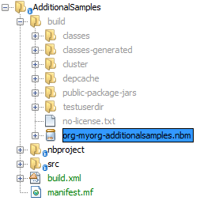

// 
//     Licensed to the Apache Software Foundation (ASF) under one
//     or more contributor license agreements.  See the NOTICE file
//     distributed with this work for additional information
//     regarding copyright ownership.  The ASF licenses this file
//     to you under the Apache License, Version 2.0 (the
//     "License"); you may not use this file except in compliance
//     with the License.  You may obtain a copy of the License at
// 
//       http://www.apache.org/licenses/LICENSE-2.0
// 
//     Unless required by applicable law or agreed to in writing,
//     software distributed under the License is distributed on an
//     "AS IS" BASIS, WITHOUT WARRANTIES OR CONDITIONS OF ANY
//     KIND, either express or implied.  See the License for the
//     specific language governing permissions and limitations
//     under the License.
//

= NetBeans Project Sample Module Tutorial
:jbake-type: platform_tutorial
:jbake-tags: tutorials 
:jbake-status: published
:syntax: true
:source-highlighter: pygments
:toc: left
:toc-title:
:icons: font
:experimental:
:description: NetBeans Project Sample Module Tutorial - Apache NetBeans
:keywords: Apache NetBeans Platform, Platform Tutorials, NetBeans Project Sample Module Tutorial

This tutorial demonstrates how to create a module that adds a sample to the New Project wizard. The sample could function either as an example to the user or as a new project template that provides the basic files needed to get started working on a technology of some kind.

NOTE: If you are using an earlier version of Apache NetBeans, see  link:74/nbm-projectsamples.html[the previous version of this document].

== Introduction to Project Samples

Using two wizards in the IDE—the New Module Project wizard and the New Project Template wizard—you can very easily create a module that contains your technology's project samples. No coding of any kind is needed in order to do this. The wizards do all the work for you. In fact, if you find yourself doing any coding at all, you are possibly doing something wrong. Coding should only be necessary in a small set of corner cases.

When you complete this tutorial, you will have a module that contains your samples. The intended users of your samples can then simply use the Plugin Manager to install the module. As a result, the samples will appear in the New Project wizard.

At the end of this tutorial, the New Project wizard will contain a new sample, called "My Sample Application":

image::images/mysample_72_proj-temp-4.png[]

In addition to showing how to create a module containing a sample, you will be instructed on some ancillary topics, such as how to change the icon and description in the New Project wizard, and how to regenerate the sample after modifying its sources.

== Creating the Module Project

We begin by working through the New Module Project wizard. At the end of it, we will have a basic source structure, with some default files, that every NetBeans module requires.

[start=1]
1. Choose File > New Project (Ctrl+Shift+N). Under Categories, select NetBeans Modules. Under Projects, select Module. Click Next.

[start=2]
1. In the Name and Location panel, type  ``AdditionalSamples``  in the Project Name field. Change the Project Location to any directory on your computer. Click Next.

[start=3]
1. In the Basic Module Configuration panel, type  ``org.myorg.additionalsamples``  in Code Name Base. Click Finish.

The IDE creates the  ``AdditionalSamples``  project. The project contains all of your sources and project metadata, such as the project's Ant build script. The project opens in the IDE. You can view its logical structure in the Projects window (Ctrl-1) and its file structure in the Files window (Ctrl-2).

== Bundling the Sample Application

Now that we have a module project, which gives us our source structure, we simply run through another wizard that will bundle our sample. You simply need to select it in the wizard and then the wizard will generate all the required classes and registration details for you.

[start=1]
1. Right-click the project node and choose New > Other. Under Categories, select NetBeans Module Development. Under Projects, select Project Template. Click Next.

[start=2]
1. 
In the Select Project panel, select the project that you want to bundle as a sample, as shown below.

image::images/mysample_72_proj-temp-5.png[]

NOTE:  Only projects that are open in the IDE are shown in the Project drop-down above. To bundle an external project as a sample, use the Browse button to locate it in your filesystem.

Click Next.

[start=3]
1. In the Name and Location panel, type  ``MySampleApplication``  as the template name, type  ``My Sample Application``  as the display name, and select Samples | Java in the Category drop-down, as shown below:

image::images/mysample_72_proj-temp-6.png[]

[start=4]
1. Click Finish.

The IDE creates the following:

image::images/mysample_72_proj-temp-2.png[]

*  ``MySampleApplication.png.``  Image copied from the icon of the sample.
*  ``MySampleApplicationDescription.html.``  Description text to be displayed in the New Project dialog's description field.
*  ``MySampleApplicationPanelVisual.``  
 ``MySampleApplicationWizardIterator.java.``  
 ``MySampleApplicationWizardPanel.java.``  A  ``JPanel`` , with a supporting wizard class, and an iterator used in the New Project wizard to create the sample. You do not need to understand how these work, unless you want to. Later in this tutorial, these classes are discussed, although they are not necessary to understand in most scenarios involving the creation of project samples.
*  ``MySampleApplicationProject.zip.``  A ZIP file containing your sample.

== Building and Installing the Module

The IDE uses an Ant build script to build and install your module. The build script is created for you when you create the module project.

=== Installing the NetBeans Module

In the Projects window, right-click the  ``AdditionalSamples``  project and choose Install/Reload in Target Platform.

The module is built and installed in a new instance of NetBeans IDE or other application created on the NetBeans Platform. The application opens so that you can try out the functionality provided by your new module.

=== Using the NetBeans Module

In this section, we take on the role of the user of our sample. After a user installs our module, either explicitly or because it is part of the application they started up, they will typically take the steps outlined below.

[start=1]
1. Choose File > New Project (Ctrl-Shift-N). The New Project wizard opens and displays the new project sample:

image::images/mysample_72_proj-temp-4.png[]

[start=2]
1. Select the new project sample and click Next. Type a name in the project name field and define a project location.

image::images/mysample_72_proj-temp-4a.png[]

Click Finish. The Projects window opens and displays the newly created project sample.

=== Creating a Shareable Module Binary

To make our sample available to our users, we need to create an NBM file, which is a binary NetBeans module file, containing our sample.

[start=1]
1. In the Projects window, right-click the  ``AdditionalSamples``  project and choose Create NBM. The NBM file is created and you can view it in the Files window (Ctrl-2):

[start=2]
1. Make it available to others via, for example, e-mail. Or create your own NetBeans Update Center and publish it there. Or publish it in the  link:http://plugins.netbeans.org/PluginPortal/[NetBeans Plugin Portal].

== Tweaking the Sample

In this section, we perform some typical tasks that you might want to perform after completing the New Project Template wizard, in order to finetune your sample. For example, you might want to change the sample's icon, description, and similar items.

=== Changing the Icon

Optionally, you can change the icon you chose when you worked through the New Project Template wizard.

Within the annotation at the top of the iterator class, the  ``iconBase``  attribute reflects your icon choice:

[source,java]
----

@TemplateRegistration(
        folder = "Project/Samples/Standard", 
        displayName = "#MySampleApplication_displayName", 
        description = "MySampleApplicationDescription.html", 
        *iconBase = "org/myorg/additionalsamples/MySampleApplication.png",* 
        content = "MySampleApplicationProject.zip")
----

Manually change the icon, by adding it to your module, and changing its name and location in the annotation shown above.

=== Changing the Category

When we used the New Project Template wizard, we assigned the sample to a category. Afterwards, we can put it in a different category, using the  ``folder``  attribute to do so:

Within the annotation at the top of the iterator class, the  ``iconBase``  attribute reflects your icon choice:

[source,java]
----

@TemplateRegistration(
        *folder = "Project/Samples/Standard"*, 
        displayName = "#MySampleApplication_displayName", 
        description = "MySampleApplicationDescription.html", 
        iconBase = "org/myorg/additionalsamples/MySampleApplication.png",
        content = "MySampleApplicationProject.zip")
----

=== Changing the Description

Next, we can change the sample's description, which is shown in the New Project wizard. As with the icon, a default description is provided when you create a module containing a sample. However, you can easily change that description.

[start=1]
1. Open the file shown below and notice the default text shown in the editor:

image::images/mysample_72_proj-temp-3.png[]

[start=2]
1. Change the text, reinstall the module, and notice the changed description in the New Project wizard.

=== Adding a Panel

In the previous section, we changed the iterator, which resulted in a different panel being shown. Possibly, however, there is no existing iterator to cater to your specific needs. In this section, we learn how to add a new panel to the wizard. We do this by reusing the iterator that the New Project Template wizard creates for us.

[start=1]
1. Use the Wizard wizard to create a new wizard panel which, just like the panel created by the New Project Template wizard, consists of a  ``JPanel``  and a wizard class.

[start=2]
1. Instantiate the new wizard panel in the iterator's  ``createPanels()``  method, as shown here:

[source,java]
----

private WizardDescriptor.Panel[] createPanels() {
    return new WizardDescriptor.Panel[] {
        *//This is the wizard panel, created by the
        //New Project Template wizard:*
        new MySampleApplicationWizardPanel()
        *//This is the new wizard panel, created by the
        //New Wizard wizard:*
        //new MySampleApplicationWizardPanel1()
    };
}
----

You only need to add your new wizard panel to the method above, and then it will be instantiated when the sample's wizard is invoked by the user in the New Project wizard.

[start=3]
1. Finally, you need to add a new string to the iterator's  ``createSteps()``  method, so that your new wizard panel is accompanied by a string in the left sidebar of the wizard:

[source,java]
----

private String[] createSteps() {
    return new String[] {
        NbBundle.getMessage(MySampleApplicationWizardIterator.class, "LBL_CreateProjectStep"),
        *NbBundle.getMessage(MySampleApplicationWizardIterator.class, "LBL_CreateProjectStep1")*
    };
}
----

You only need to add the line in bold above, and then define the key/value pair in the  ``Bundle.properties``  file.

=== Updating the Sources

When you change the sample's sources, how do you update the module that bundles the sample? Do you need to recreate the module project, work through the New Project Template wizard again, and then recreate the NBM file? No. The only part of the sample module project that is impacted by changes in the original sample's sources is the ZIP file. The ZIP file contains the sources, and those are the only pieces that are affected when you make changes to the original project. Hence, you simply need to recreate the ZIP file. To simplify this, if you add the following Ant target to the  ``build.xml``  file of the project where you created the sources, you can regenerate the ZIP file from inside the IDE and automatically have it copied to the sample module's source structure right away.

[source,xml]
----

<target name="zipme" description="Zip the application to the sample project">
    <property name="build.classes.dir" location="/home/NetBeansProjects/AdditionalSamples"/>
    <property name="examples" location="${build.classes.dir}/src/org/myorg/additionalsamples/"/>
    <zip basedir="../MySampleApplication" destfile="${examples}/MySampleApplicationProject.zip">
        <exclude name="**/build/"/>
        <exclude name="**/dist/"/>
        <exclude name="**/nbproject/private/"/>
    </zip>
</target>
----

In the above Ant target, the  ``build.classes.dir``  property points to the location of your sample module project, which is probably different in your scenario than is indicated above.

NOTE:  We exclude some folders from the ZIP file, because these are not needed in the sample module project and, in fact, would cause problems if they were not excluded.

link:http://netbeans.apache.org/community/mailing-lists.html[Send Us Your Feedback]

== Next Steps

For more information about creating and developing NetBeans modules, see the following resources:

*  link:https://netbeans.apache.org/kb/docs/platform.html[Other Related Tutorials]
*  link:http://bits.netbeans.org/dev/javadoc/[NetBeans API Javadoc]
