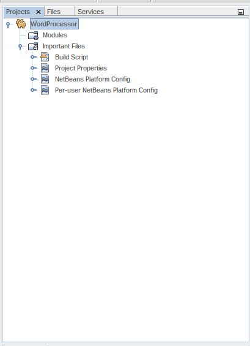
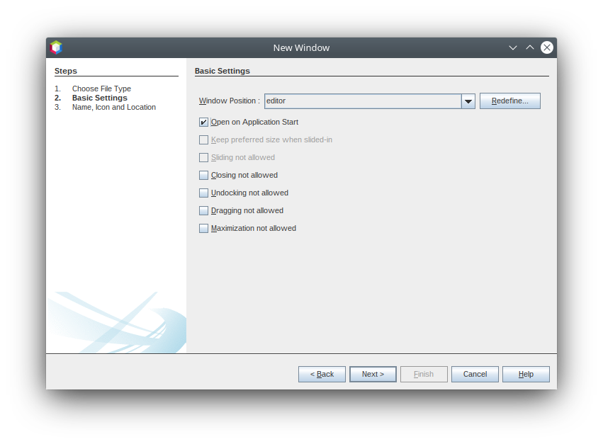
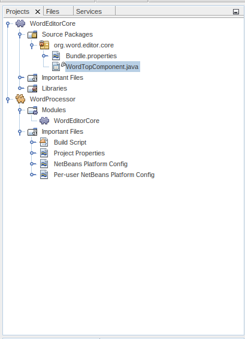
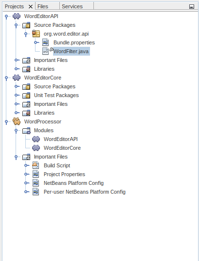
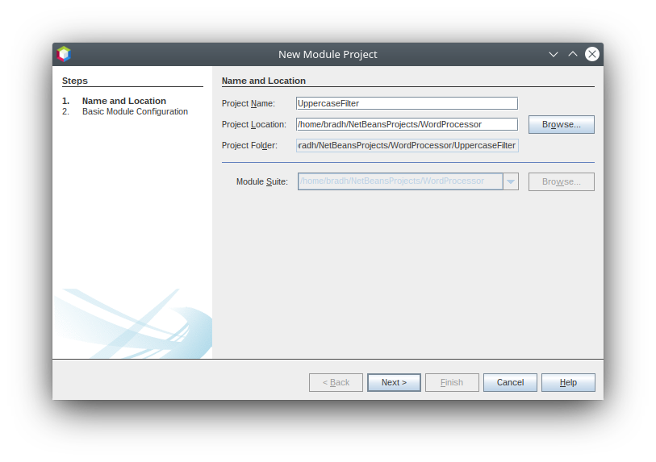
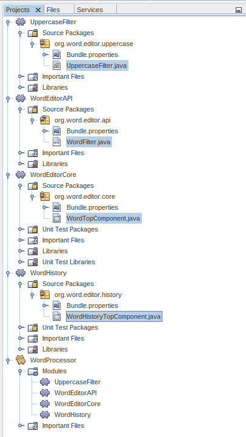

// 
//     Licensed to the Apache Software Foundation (ASF) under one
//     or more contributor license agreements.  See the NOTICE file
//     distributed with this work for additional information
//     regarding copyright ownership.  The ASF licenses this file
//     to you under the Apache License, Version 2.0 (the
//     "License"); you may not use this file except in compliance
//     with the License.  You may obtain a copy of the License at
// 
//       http://www.apache.org/licenses/LICENSE-2.0
// 
//     Unless required by applicable law or agreed to in writing,
//     software distributed under the License is distributed on an
//     "AS IS" BASIS, WITHOUT WARRANTIES OR CONDITIONS OF ANY
//     KIND, either express or implied.  See the License for the
//     specific language governing permissions and limitations
//     under the License.
//

= NetBeans Platform Quick Start
:jbake-type: platform_tutorial
:jbake-tags: tutorials 
:jbake-status: published
:syntax: true
:source-highlighter: pygments
:toc: left
:toc-title:
:icons: font
:experimental:
:reviewed: 2020-11-20
:description: NetBeans Platform Quick Start - Apache NetBeans
:keywords: Apache NetBeans Platform, Platform Tutorials, NetBeans Platform Quick Start

Welcome to the  link:https://netbeans.apache.org/platform/[*NetBeans Platform*]!

The NetBeans Platform is a generic application framework primarily for Java desktop applications. The main benefit of the NetBeans Platform is its predefined modular architecture. Secondary benefits are the NetBeans Platform's reusable solutions such as its docking framework and its out-of-the-box pluggable components, in combination with the tools provided by its SDK, NetBeans IDE, in particular its award winning "Matisse" GUI Builder for designing GUI components.

In this quick start, you are introduced to the benefits and usages of modularity on the Java desktop via a very simple example, contributed by Thomas Würthinger, a PhD student at the Johannes Kepler University in Linz, Austria. Once you have grasped the concepts introduced in this quick start, you will be ready to step onto the  xref:../kb/docs/platform.adoc[NetBeans Platform Learning Trail], providing a very rich variety of tutorials for many different scenarios relating to the NetBeans Platform.

If you are new to the NetBeans Platform, it is highly recommended to get hold of  link:https://leanpub.com/nbp4beginners[NetBeans Platform for Beginners] (published in 2014).

// NOTE: If you are using an earlier version of Apache NetBeans, see  link:74/nbm-quick-start.html[the previous version of this document].

* Part 1: <<single,A Single Module NetBeans Platform Application>>
* Part 2: <<lookup,A Modular Application Using Lookup>>
* Part 3: <<listener,Publishing and Subscribing to the Lookup>>

For troubleshooting purposes, you are welcome to download the  link:http://web.archive.org/web/20170409072842/http://java.net/projects/nb-api-samples/show/versions/8.0/tutorials/WordProcessor[completed tutorial source code].

NOTE:  Even though it is a separate product, there is no need to download the NetBeans Platform separately. Typically, you develop the application in NetBeans IDE and then exclude the modules that are specific to the IDE but that are not required for your application.

== A Single Module NetBeans Platform Application

We start by creating a new NetBeans Platform application, containing a single module.

* <<application,Create the Application>>
* <<module,Create the Module>>
* <<window,Create the Window>>
* <<run,Running the Application>>

=== Create the Application

In this section, you create your first NetBeans Platform application.

[start=1]
1. Choose File | New Project and then choose NetBeans Modules. Select "NetBeans Platform Application". You should see this:

image::images/nbm-quick-start/new-project-1.png[]

The difference between the 4 templates above is as follows:

* *NetBeans Platform Application.* A project that groups a set of module projects and library wrapper module projects that have dependencies on each other, and lets you deploy them together as a unit. Automatically included are a subset of the modules that make up the NetBeans Platform.
* *Module Suite.* Same as above, except that the pre-included modules are more than only those relating to the NetBeans Platform—in this case, all the modules that make up NetBeans IDE are included as well.
* *Library Wrapper Module.* A project that puts a library JAR file on its classpath and exports some or all of the JAR file's packages from the module as public packages.
* *Module.* A project for implementing the functionality, business logic, and user interface of a module or application built on the NetBeans Platform.

Click btn:[Next].

[start=2]
1. Name your new application `WordProcessor` and specify a folder on disk for storing it:

image::images/nbm-quick-start/new-project-2.png[]

Click btn:[Finish]. The new project appears as follows in the Projects window:

=== Create the Module

In this section, you create your first NetBeans Platform module.

[start=1]
1. Right-click the "Modules" node, shown in the screenshot above, and choose "Add New":

image::images/nbm-quick-start/new-module-1.png[]

The New Module Project dialog will appear. 
Name the new module `WordEditorCore`:

image::images/nbm-quick-start/new-module-2.png[]

Click btn:[Next].

[start=2]
1. Specify "org.word.editor.core" as the Code Name Base, which is a unique string identifying the module. The Module Display Name is used as a label for the module in the Projects window.

image::images/nbm-quick-start/new-module-3.png[]

Click btn:[Finish]. The new module is created and its structure is shown in the Projects window:

image::images/nbm-quick-start/new-module-4.png[]

=== Create the Window

Having created a module, you now create your first NetBeans window.

[start=1]
1. Right-click the "WordEditorCore" module and choose New | Other.

image::images/nbm-quick-start/new-window-1.png[]

The New File dialog appears. In the Module Development category, select "Window":

image::images/nbm-quick-start/new-window-2.png[]

Click btn:[Next].

[start=2]
1. You should now see a dialog for specifying the position where the new window will appear in the application frame, as well as whether it will open automatically when the application starts, among other settings. 

Set the Window Position to be `editor`, which is the default central position within the application frame, and select "Open on Application Start".

Then click btn:[Next].

[start=3]
1. Set the class name prefix to `Word` and the package to `org.word.editor.core`:

image::images/nbm-quick-start/new-window-4.png[]

Click btn:[Finish]. The new window ("WordTopComponent.java") is added to the source structure of your module:

[start=4]
1. The new window should have opened in the Design view of the "Matisse" GUI Builder. You can double-click  (or select "Open" from the context menu) it if it didn't open automatically.

image::images/nbm-quick-start/new-window-6.png[]

The Palette should be open on the right side (you can use menu:Window[IDE Tools>Palette] or kbd:[Ctrl+Shift+8] if not). Drag and drop a Button and a Text Area from the Palette onto the window:

image::images/nbm-quick-start/new-window-7.png[]

Do the following to make the new GUI components more meaningful:

* Right-click the text area, choose "Change Variable Name", and then name it `text`.
* Right-click the button, choose "Edit Text", and then set the text of the button to `Filter!`. Also rename the variable to `filterButton`.

image::images/nbm-quick-start/new-window-7.png[]

[start=5]
1. Double click on the button. This will create an event handling method in the Source editor. The method is called whenever the button is clicked. Change the body of the method to the following code:

[source,java]
----
    private void filterButtonActionPerformed(java.awt.event.ActionEvent evt) {
        String s = text.getText();
        s = s.toUpperCase();
        text.setText(s);
    }
----

You have now created the window module. When the "Filter!" button is clicked, the 
`filterButtonActionPerformed` method will be called, which will get the content of the
`text` text area, convert that text to upper case, and put the upper case version into
the `text` text area.

=== Run the Application

In this section, you deploy the application.

[start=1]
1. Right-click the WordProcessor application (not the WordEditorCore module) and choose Run. 

image::images/nbm-quick-start/new-app-1.png[]

Doing so will start up your new NetBeans Platform application and install your module. You will have a new window, as well as a new menu item for opening it, as shown below:

image::images/nbm-quick-start/new-app-2.png[]

[start=2]
1. Enter a text in lowercase in the text area, and click "Filter!".

image::images/nbm-quick-start/new-app-3.png[]

You should see that the text is now shown in uppercase:

image::images/nbm-quick-start/new-app-4.png[]

You have learned how to create a new Apache NetBeans Platform application and how to add new modules to it. In the next section, you will be introduced to the Apache NetBeans Platform's pluggable service infrastructure.

== A Modular Application Using Lookup

In this section, you create two additional modules. The first new module, "WordEditorAPI", contains a service provider interface. The second module, "UppercaseFilter", is a service provider for the interface.

The GUI module, which you created in the previous section, will be loosely coupled from the "UppercaseFilter" service provider because the GUI module will not refer to any code from the "UppercaseFilter" service provider. That will be possible because the "UppercaseFilter" service provider will be registered in the META-INF/services folder and loaded via the NetBeans Lookup class, which is comparable to the JDK 6 ServiceLoader class.

You will then create another loosely coupled service provider, named "LowercaseFilter".

The concept is that instead of all the different functions needing to be added to "WordEditorCore", each function can be implemented separately, without coupling the filter operation to the display of the result.

The steps are:

* <<api,Create the API>>
* <<impl,Implement the API>>
* <<run2,Run the Application>>

=== Create the API

In this section, you create an API.

[start=1]
1. Expand the new application in the Projects window, right-click the Modules node, and choose "Add New":

image::images/nbm-quick-start/new-api-1.png[]

The New Module Project dialog appears. Set the Project Name for the new module to be "WordEditorAPI":

image::images/nbm-quick-start/new-api-2.png[]

Click btn:[Next]. Set the Code Name Base to be `org.word.editor.api`, as shown below:

image::images/nbm-quick-start/new-api-3.png[]

Click btn:[Finish] to complete the wizard, which adds the module to your previously created application, just as in the previous section:

image::images//nbm-quick-start/new-api-4.png[]

Having created the module, the next activity is to add an Interface to it.

[start=2]
1. Right-click the "WordEditorAPI" module and choose New | Java Interface. 

image::images//nbm-quick-start/new-api-5.png[]

Name the Java interface `WordFilter`, in the package `org.word.editor.api`:

image::images/nbm-quick-start/new-api-6.png[]

Click btn:[Finish] to complete the wizard, which adds the interface to your module.

[start=3]
1. The WordFilter.java interface should be open. Use the editor to define it as follows:

[source,java]
----

package org.word.editor.api;

public interface WordFilter {

    String process(String s);

}
----

[start=4]
1. Right-click the "WordEditorAPI" module, choose Properties to open the Project Properties window.

image::images/nbm-quick-start/new-api-8.png[]

Select the "API Versioning" category, and check the box under "Public Packages" to specify that the package containing the interface should be available throughout the application:

image::images/nbm-quick-start/new-api-9.png[]

Click btn:[OK].

As another way to see this, in the Projects window, expand "Important Files" in the "WordEditorAPI" project and then double-click "Project Metadata".

image::images/nbm-quick-start/new-api-10.png[]

The "project.xml" file opens and you should see that the package has now been declared public:

[source,xml,linenums,highlight='9-11']
----
<?xml version="1.0" encoding="UTF-8"?>
<project xmlns="http://www.netbeans.org/ns/project/1">
    <type>org.netbeans.modules.apisupport.project</type>
    <configuration>
        <data xmlns="http://www.netbeans.org/ns/nb-module-project/3">
            <code-name-base>org.word.editor.api</code-name-base>
            <suite-component/>
            <module-dependencies/>
            <public-packages>
                <package>org.word.editor.api</package>
            </public-packages>
        </data>
    </configuration>
</project>
----

The API definition is now complete.

=== Implement the API

In this section you implement the API that you just defined, again using a separate module. This implementation will do the same conversion to upper case, but with loose coupling.

[start=1]
1. In the Projects window, right-click the Modules node of the application, and choose "Add New" again:

image::images/nbm-quick-start/new-impl-1.png[]

Name the new module "UppercaseFilter":

Click btn:[Next]. Set the Code Name Base to `org.word.editor.uppercase`, as shown below:

image::images/nbm-quick-start/new-impl-3.png[]

Click btn:[Finish] to complete the wizard, which adds the module to your previously created application, as you did in the previous section:

image::images/nbm-quick-start/new-impl-4.png[]

[start=2]
1. Right-click the Libraries node of the "UppercaseFilter" module, and choose Add Module Dependency, as shown below:

image::images/nbm-quick-start/new-impl-5.png[]

Start typing the name of the API class (WordEditorAPI) and notice that the list narrows until the module containing the class is found:

image::images/nbm-quick-start/new-impl-6.png[]

Click btn:[OK].

A confirmation dialog will appear:

image::images/nbm-quick-start/new-impl-7.png[]

Click btn:[Yes] to add the dependency.

In the Projects window, expand "Libraries" in the "UppercaseFilter" project to see that the "WordEditorAPI" dependency has been added:

image::images/nbm-quick-start/new-impl-8.png[]

As another way to see this, in the Projects window, expand "Important Files" in the "UppercaseFilter" project, and then double-click "Project Metadata". The "project.xml" file opens and you should see that a new dependency has been declared:

[source,xml,linenums,highlight='9-16']
----
<?xml version="1.0" encoding="UTF-8"?>
<project xmlns="http://www.netbeans.org/ns/project/1">
    <type>org.netbeans.modules.apisupport.project</type>
    <configuration>
        <data xmlns="http://www.netbeans.org/ns/nb-module-project/3">
            <code-name-base>org.word.editor.uppercase</code-name-base>
            <suite-component/>
            <module-dependencies>
                <dependency>
                    <code-name-base>org.word.editor.api</code-name-base>
                    <build-prerequisite/>
                    <compile-dependency/>
                    <run-dependency>
                        <specification-version>1.0</specification-version>
                    </run-dependency>
                </dependency>
            </module-dependencies>
            <public-packages/>
        </data>
    </configuration>
</project>
----

[start=3]
1. In the same way as shown in the previous step, set a dependency on the Lookup API module, which provides the @ServiceProvider annotation that you will use in the next step.

[start=4]
1. You can now implement the interface defined in the WordEditorAPI module. In the "UppercaseFilter" module create a new class in the `org.word.editor.uppercase` package, as shown below.

image::images/nbm-quick-start/new-impl-9.png[]

Name the new class `UppercaseFilter`:

image::images/nbm-quick-start/new-impl-10.png[]

Click btn:[Finish] to exit the wizard and create the file. It should open automatically for editing. 

Define the class as follows:

[source,java]
----
package org.word.editor.uppercase;

import org.openide.util.lookup.ServiceProvider;
import org.word.editor.api.WordFilter;

@ServiceProvider(service = WordFilter.class)
public class UppercaseFilter implements WordFilter {

    @Override
    public String process(String s) {
        return s.toUpperCase();
    }

}
----

At compile time, the `@ServiceProvider` annotation will create a META-INF/services folder with a file that registers your implementation of the WordFilter interface, following the JDK 6 ServiceLoader mechanism.

Now we need to update the WordEditorCore module so that all implementations of the interface "WordFilter" are located and loaded. When each implementation is found, we will invoke its `process` method to filter the text. Before we can do this, we need to add a dependency in the the "WordEditorCore" module on the "WordEditorAPI" module, similar to how we did for the UppercaseFilter. 

[start=5]
1. In the Projects tree, expand the WordEditorCore module to locate the Libraries node. Right click and select "Add Modules Dependency...".

image::images/nbm-quick-start/new-impl-11.png[]

Add the WordEditorAPI dependency:

image::images/nbm-quick-start/new-impl-12.png[]

Expand the Libraries entries to verify the dependency as been added:

image::images/nbm-quick-start/new-impl-13.png[]

[start=6]
6. Now we can modify the `WordTopComponent.java` implementation to load implementations of the "WordFilter" interface. Replace the previous implementation (which was hard-coded to just upper-case text) with the following:

[source,java]
----
private void filterButtonActionPerformed(java.awt.event.ActionEvent evt) {                                             
    String enteredText = text.getText();
    Collection<? extends WordFilter> allFilters = Lookup.getDefault().lookupAll(WordFilter.class);
    StringBuilder sb = new StringBuilder();
    for (WordFilter textFilter : allFilters) {
        String processedText = textFilter.process(enteredText);
        sb.append(processedText).append("\n");
    }
    text.setText(sb.toString());
}
----

The required imports are:

[source,java]
----
import java.util.Collection;
import org.netbeans.api.settings.ConvertAsProperties;
import org.openide.awt.ActionID;
import org.openide.awt.ActionReference;
import org.openide.util.Lookup;
import org.openide.windows.TopComponent;
import org.openide.util.NbBundle.Messages;
import org.word.editor.api.WordFilter;
----

Lookup provides an ability to do service loading, without coupling consumers to particular service implementations. This is the key to the flexible pluggable architecture provided by 
the Apache NetBeans Platform.

=== Run the Application

In this section, you run the application again.

[start=1]
1. Now you can run the application again and check that everything works just as before.

image::images/nbm-quick-start/new-impl-14.png[]

While the functionality is the same, the new modular design offers a clear separation between the GUI and the implementation of the filter. The structure of the application should be as shown below:

image::images/nbm-quick-start/new-impl-15.png[]

[start=2]
1. The new application can also be extended quite easily by adding new service providers to the application's classpath. As an exercise, add a new module that provides a "LowercaseFilter" implementation of the API to the application.

Note: When there is more than one filter, the results of each filter will be added to the text area.

You have now used the default Lookup, that is, "Lookup.getDefault()", to load implementations of an interface from the META-INF/services folder.

== Publishing and Subscribing to the Lookup

In this section, we create a fourth module, which receives texts dynamically whenever we click the "Filter!" button in our first module.

* <<publish,Publish to the Lookup>>
* <<subscribe,Subscribe to the Lookup>>

=== Publish to the Lookup

In this section, you publish a String into the Lookup of the TopComponent. Whenever the TopComponent is selected, the String is published into the application's context.

[start=1]
1. In the "WordEditorCore" module, we publish a String whenever the user clicks the "Filter!" button. To do so, add a member variable and update the constructor of the "WordTopComponent" as follows:

[source,java,linenums,highlight=1,7-8]
----
private final InstanceContent content;

public WordTopComponent() {
    initComponents();
    setName(Bundle.CTL_WordTopComponent());
    setToolTipText(Bundle.HINT_WordTopComponent());
    content = new InstanceContent();
    this.associateLookup(new AbstractLookup(content));
}
----

[start=2]
1. Change the code of the filter button so that the entered text is added to the  ``InstanceContent``  object when the button is clicked.

[source,java,linenums,highlight=8]
----
private void filterButtonActionPerformed(java.awt.event.ActionEvent evt) {
    String enteredText = text.getText();
    Collection<? extends WordFilter> allFilters = Lookup.getDefault().lookupAll(WordFilter.class);
    StringBuilder sb = new StringBuilder();
    for (WordFilter textFilter : allFilters) {
        String processedText = textFilter.process(enteredText);
        sb.append(processedText).append("\n");
        content.add(enteredText);
    }
    text.setText(sb.toString());
}
----

=== Subscribe to the Lookup

In this section, you create a new module, with a new window. In the new window, you listen to the application's context for Strings. When there is a new String in the Lookup, you display it in the window.

[start=1]
1. In the same way as done in the previous sections, create another module in your application and name it "WordHistory". Set the Code Name Base to be `org.word.editor.history`.

[start=2]
1. In the WordHistory module, right-click the `org.word.editor.history` package and choose New | Window. Use the New Window wizard to create a new window component that will automatically be opened on the left side of the application frame, which is the `explorer` position:

image::images/nbm-quick-start/new-history-1.png[]

Click btn:[Next]. Use prefix `WordHistory` and specify that the new window will be stored in the `org.word.editor.history` package.

image::images/nbm-quick-start/new-history-2.png[]

Click btn:[Finish] to complete the wizard and create the Window.

[start=3]
1. Once you have created the window, add a Text Area (`JTextArea`)  to it, resizing it so that it covers the whole area of the window:

image::images/nbm-quick-start/new-history-3.png[]

Change the variable name of the text area to "historyText".

[start=4]
1. In the Source view, add code to the `HistoryTopComponent` class so that it listens to the lookup of the `String` class of the current active window (implements `org.openide.util.LookupListener`) and displays all retrieved `String` objects in the text area. Update the `componentOpened()` and `componentClosed()` methods, and add `result` and `resultChanged` members, as well as the `implements` and additional imports.

[source,java]
----
import org.openide.util.LookupEvent;
import org.openide.util.LookupListener;

public final class WordHistoryTopComponent extends TopComponent implements LookupListener {
    private org.openide.util.Lookup.Result<String> result;

    @Override
    public void componentOpened() {
        result = org.openide.util.Utilities.actionsGlobalContext().lookupResult(String.class);
        result.addLookupListener(this);
    }

    @Override
    public void componentClosed() {
        result.removeLookupListener(this);
    }
    
    @Override
    public void resultChanged(LookupEvent le) {
        Collection<? extends String> allStrings = result.allInstances();
        StringBuilder sb = new StringBuilder();
        for (String string : allStrings) {
            sb.append(string).append("\n");
        }
        historyText.setText(sb.toString());
    }
                        
----

[start=5]
1. Then you can start the application and experiment with it. The result should look similar to that shown in the screenshot below:

image::images/nbm-quick-start/new-result-1.png[]

As an exercise, redesign the user interface of the "WordTopComponent" in such a way that a  ``JList``  displays the filters.

Congratulations! At this stage, with very little coding, you have created a small example of a loosely-coupled modular application:

Two important concepts have been covered in this tutorial.

[start=1]
1. The application consists of four modules. Code from one module can only be used by another module if (1) the first module explicitly exposes packages and (2) the second module sets a dependency on the first module. In this way, the Apache NetBeans Platform helps to organize your code in a strict modular architecture, ensuring that code isn't reused randomly but only when there are contracts set between the modules that provide the code.

2. Secondly, the  `Lookup`  class has been introduced as a mechanism for communicating between modules. Implementations are loaded via their interfaces. Without using any code from an implementation, the "WordEditorCore" module is able to display the service provided by the implementor. This enables loose coupling in the Apache NetBeans Platform applications.

To continue learning about modularity and the NetBeans Platform, head on to the four-part "NetBeans Platform Selection Management" series,  xref:nbm-selection-1.adoc[which starts here]. After that, get started with the  xref:../kb/docs/platform.adoc[NetBeans Platform Learning Trail], choosing the tutorials that are most relevant to your particular business scenario. Also, whenever you have questions about the NetBeans Platform, of any kind, feel free to write to the mailing list, dev@platform.netbeans.org; also check its related archive  link:https://mail-archives.apache.org/mod_mbox/netbeans-dev/[is here].

Have fun with the NetBeans Platform and see you on the mailing list!

xref:../community/mailing-lists.adoc[Send Us Your Feedback]
