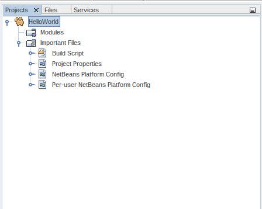
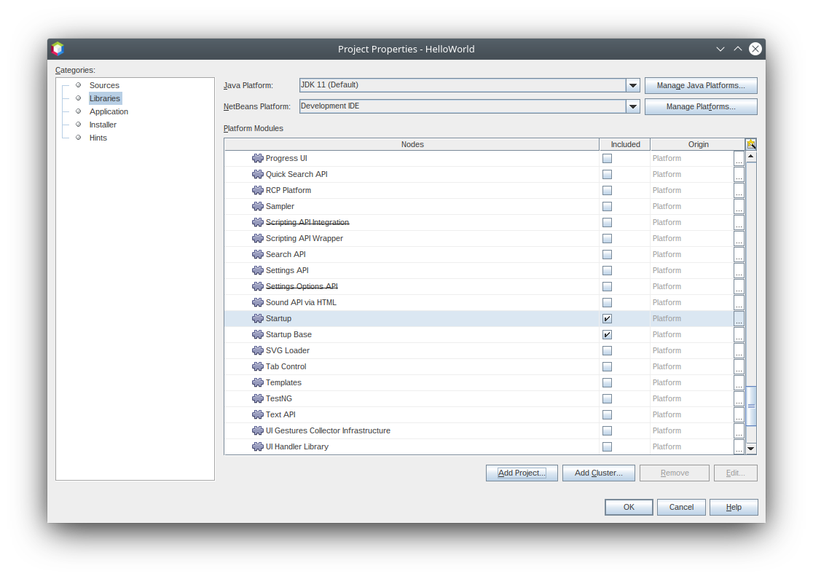
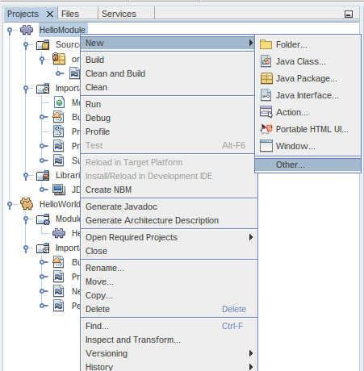
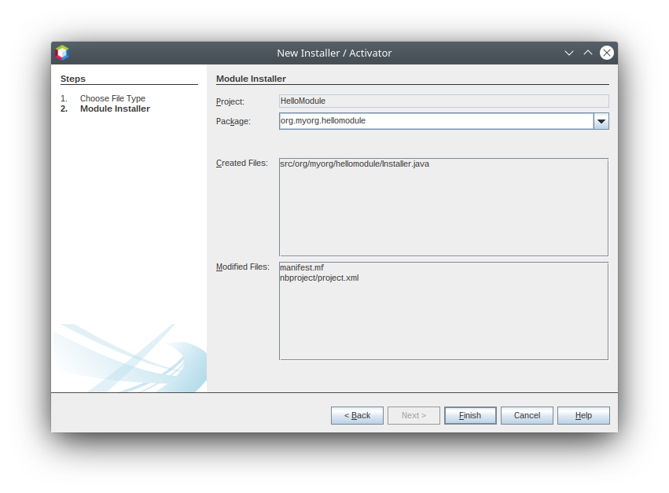

// 
//     Licensed to the Apache Software Foundation (ASF) under one
//     or more contributor license agreements.  See the NOTICE file
//     distributed with this work for additional information
//     regarding copyright ownership.  The ASF licenses this file
//     to you under the Apache License, Version 2.0 (the
//     "License"); you may not use this file except in compliance
//     with the License.  You may obtain a copy of the License at
// 
//       http://www.apache.org/licenses/LICENSE-2.0
// 
//     Unless required by applicable law or agreed to in writing,
//     software distributed under the License is distributed on an
//     "AS IS" BASIS, WITHOUT WARRANTIES OR CONDITIONS OF ANY
//     KIND, either express or implied.  See the License for the
//     specific language governing permissions and limitations
//     under the License.
//

= NetBeans Platform Runtime Container Tutorial
:jbake-type: platform_tutorial
:jbake-tags: tutorials 
:jbake-status: published
:syntax: true
:source-highlighter: pygments
:toc: left
:toc-title:
:icons: font
:reviewed: 2020-12-19
:description: NetBeans Platform Runtime Container Tutorial - Apache NetBeans
:keywords: Apache NetBeans Platform, Platform Tutorials, NetBeans Platform Runtime Container Tutorial

This tutorial covers the most fundamental concept in the NetBeans Platform: the runtime container. The runtime container is the execution environment for the modules that make up a NetBeans Platform application. It consists of modules provided by the NetBeans Platform. In this tutorial, we will look at these modules, and use them in a very simple modular application.

Before going further, you can watch this video series, which covers the same material as the rest of this tutorial:  xref:nbm-10-top-apis.adoc[Top 10 NetBeans APIs]

For troubleshooting purposes, you are welcome to download the link:https://github.com/bradh/NetBeansRuntimeTutorial[completed tutorial source code].

== Introduction to the Runtime Container

The "NetBeans runtime container" is the collective name for the core parts of the NetBeans Platform.

Brief overview of each of these nine modules:

* Startup (org-netbeans-core-startup) : Provides the main method of your application, as well as all the code needed for starting it up.
* Startup Base (org-netbeans-core-startup-base): Private implementation details supporting Startup.
* Bootstrap (org-netbeans-bootstrap) : Enables the runtime container to understand what a module is, and how to load and compose modules into an application.
* Filesystem API (org-openide-filesystems): Gives your application a virtual filesystem.
* Module System API (org-openide-modules): Provides access to the lifecycle of the modules in your application.
* Lookup API (org-openide-util-lookup): Provides a generic communication mechanism for inter-modular interaction.
* Base Utilities API (org-openide-util): Includes several utility classes shared between the other modules in the runtime container.
* Utilities API (org-openide-util-ui): User Interface utility classes.
* OW2 ASM (): Used for bytecode manipulation. Private implementation detail.

== Setting up the Runtime Container

In this section, we will create an absolutely minimal NetBeans Platform application. It will consist of only those modules that every NetBeans Platform application must have - the modules that make up the runtime container. Once we have created an application that consists of nothing more than these none modules, we will run it. There will be no specific output from this application. However, it will build and run successfully because all the fundamental requirements of a NetBeans Platform application will have been met.

[start=1]
1.  Choose menu:File[New Project] (kbd:[Ctrl+Shift+N]). Under Categories, expand Java with Ant, and select NetBeans Modules. Under Projects, select Module: 

image::images/nbm-runtime-container/new_project1.png[]

Click btn:[Next].

[start=2]
1. Name your application 'HelloWorld' and specify where to store it:

image::images/nbm-runtime-container/new_project2.png[]

Click btn:[Finish]. You now have a minimal NetBeans Platform application:

[start=3]
1. Right-click the main project node in the Projects window (`HelloWorld`), choose Properties:

image::images/nbm-runtime-container/new_project4.png[]

The Project Properties dialog appears. Go to the Libraries tab. There you can see all the modules that are part of this application:

image::images/nbm-runtime-container/new_project5.png[]

NOTE:  The template you used in step 1 above preselected several modules for you, all of which come from the "platform" cluster.

In addition to the modules making up the runtime container, many other modules are included. We are going to exclude them in the next step because the purpose of this tutorial is to create a minimal NetBeans Platform application, that is, one that contains nothing more than the runtime container.

[start=4]
1. Click the checkbox next to "platform" to deselect it. There are now no modules in the application.

image::images/nbm-runtime-container/new_project6.png[]

[start=5]
1. Next, scroll down the list, find "Startup", and click the corresponding checkbox, as shown below: 

image::images/nbm-runtime-container/new_project7.png[]

Click btn:[Resolve], because the Startup module depends on code found in eight other modules that make up the runtime container. Now you should see that the Resolve button disappears, together with the warning messages:

Scroll up and down the list and notice that ONLY the nine modules that make up the runtime container are included.

Click btn:[OK] to close the Project Properties dialog.

You now have a minimal NetBeans Platform application. It does not contain a user interface. It has nine modules that provide the low level plumbing required in any NetBeans Platform application.

Right-click the application and choose Run (F6). The application successfully executes but doesn't do or display anything special yet.

== Loading a New Module into the Runtime Container

In this section, we add a custom module to the NetBeans runtime container. The custom module will do nothing special: it will only print a message to System.out. The only reason for adding the custom module will be so that you can see that it will be an equal partner to the existing modules in your application. At the end of this section, your application will have ten modules, made up of the nine modules that you already have plus your custom module.

[start=1]
1. Right-click the application's Modules node and choose 'Add New...'.

image::images/nbm-runtime-container/custom_module1.png[]

[start=2]
1. Give your module a project name, such as 'HelloModule' and specify a location to store the module:

image::images/nbm-runtime-container/custom_module2.png[]

Click btn:[Next].

[start=3]
1. Specify a code name base (e.g. `org.myorg.hellomodule`), which is a unique string that identifies the module: 

image::images/nbm-runtime-container/custom_module3.png[]

Click btn:[Finish]. You now have a new module:

image::images/nbm-runtime-container/custom_module4.png[]

[start=4]
1. Right-click the module, choose New > Other:

Then choose Module Development > Installer/Activator: 

image::images/nbm-runtime-container/custom_module6.png[]

Click btn:[Next].

[start=5]
1. The module activator details are shown:

Click btn:[Finish] to create the class.

You now have a new class that extends the NetBeans ModuleInstall class, which is from the Module System API.

[start=6]
1. Add a new 'System.out.println' message in the `restored` method of the Installer class, as shown in the highlighted line below:

[source,javaline, nums,highlight=9]
----
package org.myorg.hellomodule;

import org.openide.modules.ModuleInstall;

public class Installer extends ModuleInstall {

    @Override
    public void restored() {
        System.out.println("hello world!");
    }

}
----

[start=7]
1. Run the application again and notice the 'Hello World' message in the application's output (Output window, which can be opened from the Window menu if required). The end of the stack trace, which includes the 'hello world' message, should be something like this:

[source]
----
>Log Session: Saturday, December 19, 2020 at 3:02:09 PM Australian Eastern Daylight Time
>System Info: 
  Product Version         = HelloWorld 12.2-d73d3dd898acc440c460924dabf8ad5feb90369f
  Operating System        = Linux version 5.4.0-58-generic running on amd64
  Java; VM; Vendor        = 11.0.9.1; OpenJDK 64-Bit Server VM 11.0.9.1+1-Ubuntu-0ubuntu1.20.04; Ubuntu
  Runtime                 = OpenJDK Runtime Environment 11.0.9.1+1-Ubuntu-0ubuntu1.20.04
  Java Home               = /usr/lib/jvm/java-11-openjdk-amd64
  System Locale; Encoding = en_AU (helloworld); UTF-8
  Home Directory          = /home/bradh
  Current Directory       = /home/bradh/NetBeansProjects/HelloWorld
  User Directory          = /home/bradh/NetBeansProjects/HelloWorld/build/testuserdir
  Cache Directory         = /home/bradh/NetBeansProjects/HelloWorld/build/testuserdir/var/cache
  Installation            = /home/bradh/NetBeansProjects/HelloWorld/build/cluster
                            /snap/netbeans/41/netbeans/platform
                            /snap/netbeans/41/netbeans/platform
  Boot & Ext. Classpath   = 
  Application Classpath   = /snap/netbeans/41/netbeans/platform/lib/boot.jar:/snap/netbeans/41/netbeans/platform/lib/org-openide-modules.jar:/snap/netbeans/41/netbeans/platform/lib/org-openide-util-lookup.jar:/snap/netbeans/41/netbeans/platform/lib/org-openide-util-ui.jar:/snap/netbeans/41/netbeans/platform/lib/org-openide-util.jar
  Startup Classpath       = /snap/netbeans/41/netbeans/platform/core/asm-8.0.1.jar:/snap/netbeans/41/netbeans/platform/core/asm-commons-8.0.1.jar:/snap/netbeans/41/netbeans/platform/core/asm-tree-8.0.1.jar:/snap/netbeans/41/netbeans/platform/core/core-base.jar:/snap/netbeans/41/netbeans/platform/core/core.jar:/snap/netbeans/41/netbeans/platform/core/org-netbeans-libs-asm.jar:/snap/netbeans/41/netbeans/platform/core/org-openide-filesystems-compat8.jar:/snap/netbeans/41/netbeans/platform/core/org-openide-filesystems.jar:/home/bradh/NetBeansProjects/HelloWorld/build/cluster/core/locale/core_helloworld.jar
-------------------------------------------------------------------------------
hello world!
INFO [org.netbeans.core.startup.NbEvents]: Turning on modules:
	org.openide.util.lookup [8.44 12.2-d73d3dd898acc440c460924dabf8ad5feb90369f]
	org.openide.util [9.17 12.2-d73d3dd898acc440c460924dabf8ad5feb90369f]
	org.openide.util.ui [9.18 12.2-d73d3dd898acc440c460924dabf8ad5feb90369f]
	org.openide.modules [7.58 12.2-d73d3dd898acc440c460924dabf8ad5feb90369f]
	org.openide.filesystems [9.20 12.2-d73d3dd898acc440c460924dabf8ad5feb90369f]
	org.openide.filesystems.compat8 [9.19 12.2-d73d3dd898acc440c460924dabf8ad5feb90369f]
	org.netbeans.libs.asm [5.13 12.2-d73d3dd898acc440c460924dabf8ad5feb90369f]
	org.netbeans.core.startup.base [1.72.0.1 1 12.2-d73d3dd898acc440c460924dabf8ad5feb90369f]
	org.netbeans.bootstrap/1 [2.88 12.2-d73d3dd898acc440c460924dabf8ad5feb90369f]
	org.netbeans.core.startup/1 [1.72.0.1 12.2-d73d3dd898acc440c460924dabf8ad5feb90369f]
	org.myorg.hellomodule [1.0 201219]
BUILD SUCCESSFUL (total time: 20 seconds)
----

== Summary

In this tutorial, you have used the minimal set of NetBeans Platform modules that any NetBeans Platform application requires, that is, the NetBeans runtime container, consisting of nine modules. You added a custom module, that is, a module that you created yourself. The custom module printed a message into the Output window.

Notice that you did not need to create a main method because the NetBeans runtime container contains one already. The "module" concept was also predefined in the NetBeans runtime container. Other features of the NetBeans runtime container will be introduced as you take the next steps outlined below.

xref:../community/mailing-lists.adoc[Send Us Your Feedback]

== Next Steps

To continue your journey on the NetBeans Platform, see:

*  xref:../features/platform/features.adoc[NetBeans Platform Features]
*  xref:nbm-quick-start.adoc[NetBeans Platform Quick Start]
*  xref:nbm-selection-1.adoc[NetBeans Selection Management Tutorial I—Using a TopComponent's Lookup]
*  xref:nbm-10-top-apis.adoc[Top 10 NetBeans APIs]
