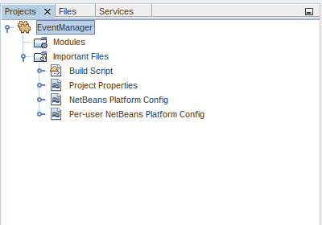
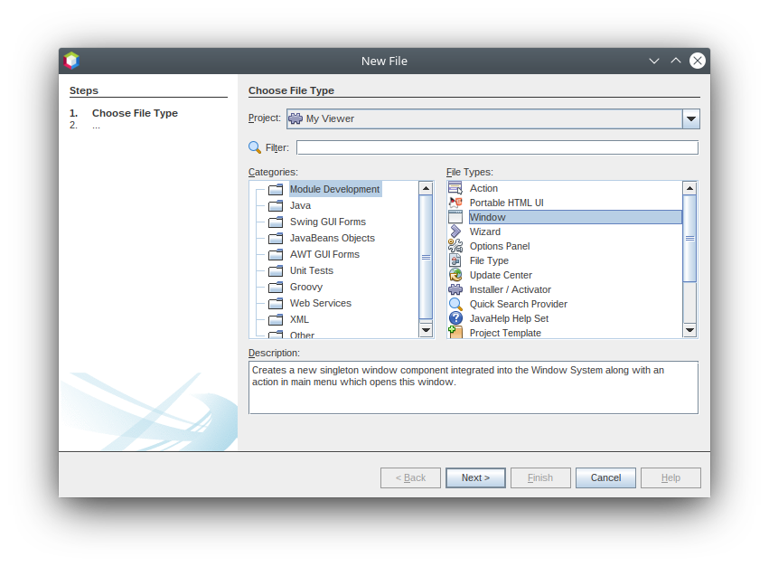
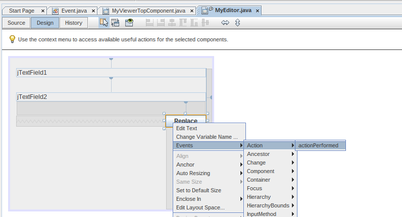
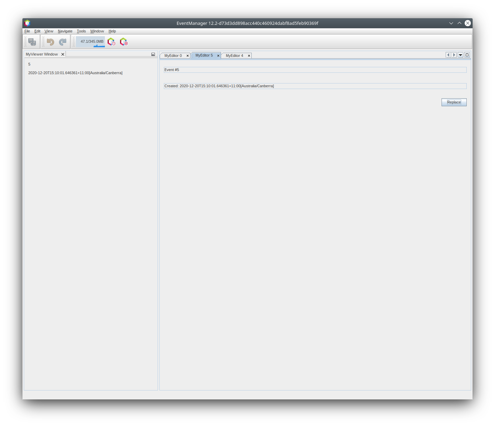

// 
//     Licensed to the Apache Software Foundation (ASF) under one
//     or more contributor license agreements.  See the NOTICE file
//     distributed with this work for additional information
//     regarding copyright ownership.  The ASF licenses this file
//     to you under the Apache License, Version 2.0 (the
//     "License"); you may not use this file except in compliance
//     with the License.  You may obtain a copy of the License at
// 
//       http://www.apache.org/licenses/LICENSE-2.0
// 
//     Unless required by applicable law or agreed to in writing,
//     software distributed under the License is distributed on an
//     "AS IS" BASIS, WITHOUT WARRANTIES OR CONDITIONS OF ANY
//     KIND, either express or implied.  See the License for the
//     specific language governing permissions and limitations
//     under the License.
//

= NetBeans Selection Management Tutorial I-Using a TopComponent's Lookup
:jbake-type: platform_tutorial
:jbake-tags: tutorials 
:jbake-status: published
:syntax: true
:source-highlighter: pygments
:toc: left
:toc-title:
:icons: font
:experimental:
:reviewed: 2020-12-20
:description: NetBeans Selection Management Tutorial I - Using a TopComponent's Lookup - Apache NetBeans
:keywords: Apache NetBeans Platform, Platform Tutorials, NetBeans Selection Management Tutorial I - Using a TopComponent's Lookup

This tutorial covers how to write components for the Apache NetBeans Platform that provide a "selected object" and how to write components that update themselves as the global selection changes. This is an important aspect of the application, and helps your component fit in with the behavior of other components.

For troubleshooting purposes, you are welcome to download the  link:https://github.com/bradh/NetBeansSelection1[completed tutorial source code].

This tutorial is part 1 of a series. Part 2 builds on this tutorial to explain how to handle selection on a single item (such as one element in a tree view).

== Introduction to Selection

"Selection" is an important concept for any non-trivial application. NetBeans has two basic concepts of selection - the contents of the focused xref:../wiki/DevFaqWindowsTopComponent.adoc[TopComponent]'s xref:../wiki/DevFaqLookup.adoc[Lookup], and the focused `TopComponent`'s  xref:../wiki/DevFaqWhatIsANode.adoc[ activated `Node`(s)]. Here you will deal only with the  `Lookup`  portion of selection - doing more advanced things will be covered later in this series.

Selection enables things such as context sensitive actions (actions that are enabled or disabled depending on what is displayed), and palette windows such as the Property Sheet or Navigator components in the IDE, which each display some aspect of whatever is selected.

Basically, each `TopComponent` has a bag of objects that it can put things into, and that other code is able to query. That bag of objects is its _Lookup_ - essentially a Map where the keys are class objects and the values are objects that extend or implement the key-class. This is useful because it decouples the components that provide some object and the components that consume those objects so they can be implemented in separate modules, or new editors for existing objects can be provided without changing the rest of the system.

== Creating the NetBeans Platform Application Project

The loosely-coupled modular example used in this tutorial will contain three modules constituting a NetBeans Platform application, as illustrated below:

image::images/nbm-selection-1/module_structure.png[]

Start by creating the NetBeans Platform application that will contain all three modules:

[start=1]
1. Choose menu:File[New Project] (kbd:[Ctrl+Shift+N]). Under Categories, expand Java with Ant, and select NetBeans Modules. Under Projects, select NetBeans Platform Application: 

image::images/nbm-selection-1/new-project1.png[]

Click btn:[Next].

[start=2]
1. In the Name and Location panel, type  ``EventManager``  in Project Name. Change the Project Location to any directory on your computer:

image::images/nbm-selection-1/new-project2.png[]

Click btn:[Finish].

You now have a NetBeans Platform application project, which is the container for the modules that you will be creating throughout this tutorial:

Via the configuration files shown in the screenshot above, the NetBeans Platform application project provides a set of pre-defined modules, such as modules that give your application a window system and an action system. The configuration files also set up the application to be built via the Ant build system. In the next steps, you will be adding three custom modules to the application. The first module will provide an API class, while the other two will share that API module between them. That will ensure that the other two modules do not depend on each other, making them loosely coupled.

[start=3]
1. Choose menu:File[New Project] (kbd:[Ctrl+Shift+N]) again. If not already open, under Categories, expand Java with Ant, and select NetBeans Modules. Under Projects, select Module:

image::images/nbm-selection-1/new-project4.png[]

Click btn:[Next].

TIP: You could also do this by expanding the "EventManager" project node, right-click the "Modules" node, and then choose "Add New".

[start=4]
1. In the Name and Location panel, type  ``MyAPI``  in Project Name. Now look at the Project Location field and the Project Folder field. As you can see, the default in the wizard is to create the module within the directory where you just created the "EventManager" application, which means that the module's sources will be organized within the folder where the application is defined. That is the standard way to organize NetBeans Platform application sources.

image::images/nbm-selection-1/new-project5.png[]

Click btn:[Next].

[start=5]
1. In the Basic Module Configuration panel, set the following values:

* *Code Name Base.* The code name base is a string that uniquely identifies a module. By convention, the value of the code name base is the main package of the module. Therefore, if the main package of your module is going to be "org.me.foo", then that would normally also be the value of the code name base of the module. In this case, since the base package will be "org.myorg.myapi", set the code name base to  `org.myorg.myapi`. That will be the string used to identify the module by other modules that will need to make use of code within this module.
* *Module Display Name.* Set the module display name to  `My API`. That is the text you will see displayed for the module in the Projects window in the IDE.
* *Localizing Bundle.* Leave the location of the localizing bundle with the default value, so that localization keys/values will be stored in the main package, with the name `org/myorg/myapi`.
* *Generate OSGi Bundle.* Leave this unchecked to use the NetBeans module system. There are two module systems are supported by the NetBeans Platform, the NetBeans module system and the OSGi framework. You can use OSGi if required to meet your business requirements, although we use the NetBeans module system in this tutorial series.

The result should be as follows:

image::images/nbm-selection-1/new-project6.png[]

Click btn:[Finish].

[start=6]
1. Now create two more modules now, following step 3, 4, and 5 above. For the second module use "MyEditor" for the Project Name, with a Code Name Base of `org.myorg.myeditor` and a Module Display Name of "My Editor". For the third module use "MyViewer" for the Project Name, with a Code Name Base of `org.myorg.myviewer` and a Module Display Name of "My Viewer".

At the end of this step, the structure of the application should be as follows:

image::images/nbm-selection-1/new-project7.png[]

The reason you are creating three modules in the application is that you are creating a modular application, where the viewer and editor modules will be loosely coupled from each other, only sharing the API module between them. The usefulness of this approach will become clearer as you continue with this tutorial.

== Creating an API and Setting Up Dependencies

In this part of the tutorial, we will create a trivial API class. In the real world, such an API might represent files or some other kind of data that is being modelled programmatically. For the purposes of this tutorial it will suffice to have a simple object named "Event", representing a random event, possibly an event such as a calendar event or an event within a programmatic sequence. An Event has an index that provides a unique identifier, and a date.

[start=1]
1. Right click the `org.myorg.myapi` package and choose New > Java Class.

image::images/nbm-selection-1/api1.png[]

Name the class `Event`:
 
image::images/nbm-selection-1/api2.png[]

Click btn:[Finish].

Replace the default code with the following:

[source,java]
----
package org.myorg.myapi;

import java.time.ZonedDateTime;

public final class Event {

    private final ZonedDateTime date = ZonedDateTime.now();
    private static int count = 0;
    private final int index;

    public Event() {
        index = count++;
    }

    public ZonedDateTime getDate() {
        return date;
    }

    public int getIndex() {
        return index;
    }

    @Override
    public String toString() {
        return index + " - " + date.toString();
    }
}
----

This will be all of the code that this module contains. As you can see, each time a new instance of `Event` is created, a counter is incremented so there will be some unique identifier to each instance of `Event`.

[start=2]
1. The next step is to have your API module export the `org.myorg.myapi` package so other modules can see the Event class in it. By default, all packages are hidden from all other modules in the application. Right click the My API project and choose Properties. In the API Versioning page in the Project Properties dialog box, check the checkbox for `org.myorg.myapi` in the Public Packages list, as shown below:

image::images/nbm-selection-1/api3.png[]

Click btn:[OK].

Now expand the Important Files node of the My API project. Open the Project Metadata file. On disk, this file is named `project.xml`. Inside this file, notice the following section, which was added when you clicked OK in the dialog above:

[source,xml]
----
    <public-packages>
        <package>org.myorg.myapi</package>
    </public-packages>
----

When the module is compiled, the information above in the `project.xml` file is added to the module's manifest file.

[start=3]
1. Now you need to set up some dependencies between your modules. The other two modules, My Editor and My Viewer, will use the `Event` class, so each of them needs to say that they _depend on_ the API module. Right-click on the My Editor project node, and choose Properties. The Project Properties dialog will appear. Select the Libraries tab.

image::images/nbm-selection-1/api4.png[]

Click btn:[Add Dependency...]

In the Filter text box, type `Event`, which will refine the list of all available modules. Locate the "My API" module and select it:

image::images/nbm-selection-1/api5.png[]

TIP: Using the Cluster combo-box will provide more filtering.

Click btn:[OK] to add the dependency.

You should see the following:

image::images/nbm-selection-1/api6.png[]

Click btn:[OK] to close the Project Properties dialog.

When you open the Project Metadata file in the Important Files node of the My Editor module, you should see that the section below has been added:

[source,xml]
----
<module-dependencies>
    <dependency>
        <code-name-base>org.myorg.myapi</code-name-base>
        <build-prerequisite/>
        <compile-dependency/>
        <run-dependency>
            <specification-version>1.0</specification-version>
        </run-dependency>
    </dependency>
</module-dependencies>
----

Notice that the code name base of the MyAPI module is used to identify it here. When the module is compiled, the information above in the `project.xml` file is added to the module's manifest file.

Now add the same dependency for the My Viewer module, starting with right-click on the My Viewer project node and selecting Properties.

When this is done, the new contract between the modules is represented in the Project window as follows:

image::images/nbm-selection-1/api7.png[]

== Creating the Viewer Component

Now you will create a singleton component that will track if there is an `Event` available in the global selection (i.e., if the focused `TopComponent` has one in its Lookup). If there is one, it will display some data about it. One common use case for this kind of functionality is creating master/detail views.

=== Generating a Singleton TopComponent

A "singleton component" is a component like the Projects window in the NetBeans IDE, or the Property Sheet or the Navigator - a component that there is only ever one of in the system. The Window wizard will automatically generate all of the code needed to create such a singleton component - you just have to use the form designer or write code to provide the contents of your singleton component.

[start=1]
1. Right click the `org.myorg.myviewer` package and choose New > Other. 

image::images/nbm-selection-1/viewer1.png[]

In the resulting New File dialog, select Module Development > Window, as shown below:

Click btn:[Next] (or press Enter).

[start=2]
1. On the "Basic Settings" page of the wizard, select `explorer` as the location in which to place your viewer component, and check the "Open on Application Start" checkbox to cause the window to open on startup, as shown below:

image::images/nbm-selection-1/viewer3.png[]

Click btn:[Next].

[start=3]
1. The "Name, Icon and Location" page of the wizard will appear. Set `MyViewer` as the class name prefix:

image::images/nbm-selection-1/viewer4.png[]

[start=4]
1. Click btn:[Finish] and you should see the following:

image::images/nbm-selection-1/viewer5.png[]

You now have a skeleton `TopComponent` - a singleton component called `MyViewerTopComponent`. The wizard created the Java class, and added the required module dependencies (under Libraries). 

[start=5]
1. If not already open, double-click to open the `MyViewerTopComponent` file. Click its Source tab. Via the annotations that you can see at the top of the Java source file, `MyViewerTopComponent` will be registered in the layer file of the MyViewer module, together with an `Action` for opening the `MyViewerTopComponent` from the Window menu:

[source,java]
----
@ConvertAsProperties(
        dtd = "-//org.myorg.myviewer//MyViewer//EN",
        autostore = false
)
@TopComponent.Description(
        preferredID = "MyViewerTopComponent",
        //iconBase="SET/PATH/TO/ICON/HERE",
        persistenceType = TopComponent.PERSISTENCE_ALWAYS
)
@TopComponent.Registration(mode = "explorer", openAtStartup = true)
@ActionID(category = "Window", id = "org.myorg.myviewer.MyViewerTopComponent")
@ActionReference(path = "Menu/Window" /*, position = 333 */)
@TopComponent.OpenActionRegistration(
        displayName = "#CTL_MyViewerAction",
        preferredID = "MyViewerTopComponent"
)
@Messages({
    "CTL_MyViewerAction=MyViewer",
    "CTL_MyViewerTopComponent=MyViewer Window",
    "HINT_MyViewerTopComponent=This is a MyViewer window"
})
----

=== Creating a Context Sensitive TopComponent

Click its Design tab of the open `MyViewerTopComponent` to access the "Matisse" GUI Builder (also known as the "form editor").

You will add two labels to the component, which will display some information about the selected `Event` if there is one.

[start=1]
1. Drag two Labels (javax.swing.JLabel) to the form from the Palette (kbd:[Ctrl+Shift+8]), one below the other, as shown below:

image::images/nbm-selection-1/viewer6.png[]

Press F2 on the first label and then change the text as shown above, so that by default it displays "[Nothing selected]".

image::images/nbm-selection-1/viewer7.png[]

[start=2]
1. Click the Source button in the editor toolbar to switch to the code editor. Modify the signature of the class, so that `MyViewerTopComponent` implements `LookupListener`:

[source,java]
----
public final class MyViewerTopComponent extends TopComponent implements LookupListener {                        
----

Right-click in the editor and choose Fix Imports, so that `LookupListener` is imported.

Put the cursor over the lightbulb icon should appear in the editor margin. A popup hint should appear, as shown below:

image::images/nbm-selection-1/viewer8.png[]

Left click on the lightbulb icon in the editor margin, and when the popup appears, select the text "Implement all abstract methods".

image::images/nbm-selection-1/viewer9.png[]

You now have a class that implements `LookupListener` (i.e. the `resultChanged` method). Now it needs something to listen to.

There is a convenient global `Lookup` object, which proxies the Lookup of whatever component has focus - it can be obtained from the call `Utilities.actionsGlobalContext()`. So rather than tracking what component has focus yourself, you can listen to this one global selection `Lookup`, which will fire appropriate changes whenever focus changes.

[start=3]
1. Edit the source code of the `MyViewerTopComponent` to add a lookup result member, and so that its `componentOpened`, `componentClosed`, and `resultChanged` methods are as follows:

[source,java]
----
    private Lookup.Result<Event> result = null;

    @Override
    public void componentOpened() {
        result = Utilities.actionsGlobalContext().lookupResult(Event.class);
        result.addLookupListener (this);
    }

    @Override
    public void componentClosed() {
        result.removeLookupListener(this);
    }

    @Override
    public void resultChanged(LookupEvent lookupEvent) {
        Collection<? extends Event> allEvents = result.allInstances();
        if (!allEvents.isEmpty()) {
            Event event = allEvents.iterator().next();
            jLabel1.setText(Integer.toString(event.getIndex()));
            jLabel2.setText(event.getDate().toString());
        } else {
            jLabel1.setText("[Nothing selected]");
            jLabel2.setText("");
        }
    }
----

* `componentOpened()` is called whenever the component is made visible by the window system; `componentClosed()` is called whenever the user clicks the X button on its tab to close it. So whenever the component is showing, you want it to be tracking the selection - which is what the above code does.
* The `resultChanged()` method is your implementation of `LookupListener`. Whenever the selected `Event` changes, it will update the two `JLabel`s you put on the form.

The required import statements for the `MyViewerTopComponent` are as follows:

[source,java]
----
import java.util.Collection;
import org.myorg.myapi.Event;
import org.netbeans.api.settings.ConvertAsProperties;
import org.openide.awt.ActionID;
import org.openide.awt.ActionReference;
import org.openide.util.Lookup;
import org.openide.util.LookupEvent;
import org.openide.util.LookupListener;
import org.openide.windows.TopComponent;
import org.openide.util.NbBundle.Messages;
import org.openide.util.Utilities;
----

== Creating the Editor Component

Now you need something to actually provide instances of `Event` for this viewer code to be of any use. Fortunately this is quite simple.

We will do this in the My Editor module, consistent with our goal of demonstrating loose coupling between the components of our application.

You will create another `TopComponent`, this time, one that opens in the editor area and offers an instance of `Event` from its `Lookup`. You _could_ use the Window template again, but that template is designed for creating singleton components, rather than components there can be many of. So you will simply create a `TopComponent` subclass without the template, and an action which will open additional ones.

[start=1]
1. You will need to add four dependencies to the My Editor module for it to be able to find the classes you will be using.

Right click the My Editor project and choose Properties. On the Library page of the Project Properties dialog box, click the Add Dependency button, and type `TopComponent` in the Filter textbox. The dialog should automatically suggest setting a dependency on the Window System API. Do the same thing for `Lookups` (Lookup API). Also set a dependency on the Utilities API, Base Utilities API, and UI Utilities API, which provide various helpful supporting classes that are made available by the NetBeans Platform.

TIP: You can select more than one dependency at a time using Ctrl + left-click. For example, you could select both Utilities API and UI Utilities API based off a filtered search for "Utilities".

You should end up with six dependencies (the MyAPI dependency from the earlier part of this tutorial, plus the five you just added), as shown below:

image::images/nbm-selection-1/editor1.png[]

You can also see these in the Libraries node of the My Editor project.

[start=2]
1. Right-click the `org.myorg.myeditor` package in the My Editor project, and choose New > Other. When the New File dialog appears, select Swing GUI Forms from the Category selection, and JPanel Form from the File Types selection. 

image::images/nbm-selection-1/editor2.png[]

Click btn:[Next].

[start=3]
1. Set the class name to "MyEditor", and click:[Finish] to complete the wizard.

You should see `MyEditor.java` open in with the Design view (form editor) open:

image::images/nbm-selection-1/editor3.png[]

[start=4]
1. When the form editor opens, drop two Text Fields (javax.swing.JTextField) on the form, one above the other. 

image::images/nbm-selection-1/editor4.png[]

On the property sheet, set the "editable" property (checkbox) to `false` for both text fields.

[start=5]
1. Click the Source button in the editor toolbar to switch to the code editor.

[start=6]
1. Change the signature of `MyEditor` to extends `TopComponent` instead of `javax.swing.JPanel` and annotate the class to specify the location of the window and the menu item for opening it:

[source,java]
----

@TopComponent.Description(
        preferredID = "MyEditorTopComponent",
        persistenceType = TopComponent.PERSISTENCE_ALWAYS)
@TopComponent.Registration(
        mode = "editor",
        openAtStartup = true)
@ActionID(
        category = "Window",
        id = "org.myorg.myeditor.MyEditorTopComponent")
@ActionReference(path = "Menu/Window")
@TopComponent.OpenActionRegistration(displayName = "#CTL_MyEditorAction")
@NbBundle.Messages({"CTL_MyEditorAction=Open Editor"})

public class MyEditor extends TopComponent {
----

[start=7]
1. Add the following code to the constructor of `MyEditor`, after the  `initComponents()`  statement:

[source,java]
----
Event obj = new Event();
associateLookup(Lookups.singleton(obj));
jTextField1.setText ("Event #" + obj.getIndex());
jTextField2.setText ("Created: " + obj.getDate());
setDisplayName ("MyEditor " + obj.getIndex());
----

[start=8]
1. Right-click in the editor and choose Fix Imports, which should result in the following import section at the top of your class:

[source,java]
----
import org.myorg.myapi.Event;
import org.openide.awt.ActionID;
import org.openide.awt.ActionReference;
import org.openide.util.NbBundle;
import org.openide.util.lookup.Lookups;
import org.openide.windows.TopComponent;
----

The line `associateLookup(Lookups.singleton(obj));` will create a `Lookup` that contains only one object - the new instance of `Event` - and assign that `Lookup` to be what is returned by `MyEditor.getLookup()`. While this is an artificial example, you can imagine how `Event` might represent a file, an entity in a database, or anything else you might want to edit or view. Probably you can also imagine one component that allows you to select or edit multiple unique instances of `Event`, which will be the subject of the next tutorial.

To make your editor component at least somewhat interesting (though it doesn't actually edit anything), you set the text fields' values to values from the `Event`, so you have something to display.

== Running the Code

Now you're ready to run the tutorial. Simply right click `EventManager`, the application which contains your three modules, and choose Run from the popup menu. When the IDE opens, simply choose Window > Open Editor to invoke your action. Do this a couple of times, so that there are several of your editor components open. Your singleton `MyViewer` window should also be open. Notice how the `MyViewer` window's contents change as you click different tabs, as shown here:

image::images/nbm-selection-1/result1.png[]

If you click in the Viewer window, or close all of the editor windows, note that the text changes to "[no selection]", as shown below:

image::images/nbm-selection-1/result2.png[]

NOTE:  If you do not see the `MyViewer` window, you probably did not check the checkbox in the wizard to open it on system start - simply go to the Window menu and choose MyViewer to display it.

== So, What's the Point?

So the key point of this tutorial is the way the code is split into three modules: the My Viewer module knows nothing about the My Editor module, and either one can run by itself. They only share a common dependency on My API. That means two things: 1. My Viewer and My Editor can be developed and shipped independently, and 2. Any module that wants to provide a different sort of editor than My Editor can do so, and the viewer component will work perfectly with it, as long as the replacement editor offers an instance of `Event` from its Lookup.

To really picture the value of this, imagine `Event` were something much more complex; imagine that `MyEditor` is an image editor, and ` Event` represents an image being edited. The thing that's powerful here is that you could replace `MyEditor` with, say, an SVG vector-based editor, and the viewer component (presumably showing attributes of the currently edited image) will work transparently with that new editor. It is this model of doing things that is the reason you can add new tools into the NetBeans IDE that work against Java files, and they will work in different versions of NetBeans, and that you can have an alternate editor (such as the form editor) for Java files and all the components and actions that work against Java files still work when the form editor is used.

This is very much the way NetBeans works with Java and other source files-in their case, the thing that is available from the editor's Lookup is a ` xref:../wiki/DevFaqDataObject.adoc[DataObject]`, and components like Navigator and the Property Sheet are simply watching what object is being made available by the focused `TopComponent`.

Another valuable thing about this approach is that often people are migrating existing applications to the NetBeans Platform. The object that is part of the data model, in that case, is probably existing, working code that should not be changed in order to integrate it into NetBeans. By keeping the data model's API in a separate module, the NetBeans integration can be kept separate from the core business logic.

== Changing Selected Objects on the Fly

To make it really evident how powerful this approach can be, you'll take one more step, and add a button to your editor component that lets it replace the `Event` it has with a new one on the fly.

[start=1]
1. Open `MyEditor` in the form editor (click the Design toolbar button in the editor toolbar), and drag a `Button` (javax.swing.JButton) to it.

[start=2]
1. Set the `text` property of the JButton to "Replace".

image::images/nbm-selection-1/replace1.png[]

[start=3]
1. Right click the `JButton` and choose Events > Action > actionPerformed. 

This will cause the code editor to open with the cursor in an event handler method. Make that method call `updateContent()`.

[source,java]
----
    private void jButton1ActionPerformed(java.awt.event.ActionEvent evt) {                                         
        updateContent();
    }
----

Implement the missing method:

[source,java]
----
    private void updateContent() {
        Event obj = new Event();
        jTextField1.setText ("Event #" + obj.getIndex());
        jTextField2.setText ("Created: " + obj.getDate());
        setDisplayName ("MyEditor " + obj.getIndex());
        content.set(Collections.singleton (obj), null);
    }
----

Note that this implementation is just the same as the lines that are in the constructor, except for the last one.

[start=4]
1. At the head of the class definition, add one final field:

[source,java]
----
public class MyEditor extends TopComponent {

    private final InstanceContent content = new InstanceContent();
----

link:https://bits.netbeans.org/dev/javadoc/org-openide-util-lookup/org/openide/util/lookup/InstanceContent.html[InstanceContent] is a class which allows us to modify the content of a Lookup (specifically an instance of `AbstractLookup`) on the fly.

[start=5]
1. Remove the lines we added to the constructor earlier, except for the line beginning "associateLookup...". That line of the constructor should be changed as follows:

[source,java]
----
    associateLookup (new AbstractLookup (content)); 
----

NOTE: Be sure to leave the standard `initComponents()` call.

[start=6]
1. Add a call to `updateContent()` to the constructor, after the `associateLookup()` line.

[source,java]
----
    updateContent();
----

[start=7]
1. Right-click in the editor and choose Fix Imports. The imports should now look like:

[source,java]
----
import java.util.Collections;
import org.myorg.myapi.Event;
import org.openide.awt.ActionID;
import org.openide.awt.ActionReference;
import org.openide.util.NbBundle;
import org.openide.util.lookup.AbstractLookup;
import org.openide.util.lookup.InstanceContent;
import org.openide.windows.TopComponent;
----

You're now ready to run the Event Manager again. Right click EventManager again and choose Run. 

When you click the Replace button, all of the components update, including the instance of `MyViewer` - everything.

== Providing More Than One Object

This is all well and good for decoupling, but isn't providing this one object from your component a bit like having a `Map` that only contains one key and one value? The answer is, yes, it is like that. Where this technique becomes even more powerful is when you provide multiple objects from multiple APIs.

As an example, it is very common in NetBeans to provide context sensitive actions. A case in point is the built-in `SaveAction` that is part of NetBeans' Actions API. What this action actually does is, it simply listens for the presence of something called `SaveCookie` on the global context - the same way your viewer window listens for `Event`. If a `SaveCookie` appears (editors typically add one to their Lookup when the content of the file is modified but not yet saved), the action becomes enabled, so the Save toolbar button and menu items become enabled. When the Save action is invoked, it calls `SaveCookie.save()`, which in turn causes the `SaveCookie` to disappear, so the Save action then becomes disabled until a new one appears.

So the pattern in practice is to provide more than just a single object from your component's `Lookup`- different auxillary components and different actions will be interested in different aspects of the object being edited. These aspects can be cleanly separated into interfaces which those auxillary components and actions can depend on and listen for.

xref:../community/mailing-lists.adoc[Send Us Your Feedback]

== Next Steps

By now you may have noticed that some components have more granular selection logic, and even involve multiple selection. In the xref:nbm-selection-2.adoc[next tutorial] you will cover how to use the link:https://bits.netbeans.org/dev/javadoc/org-openide-nodes/overview-summary.html[Nodes API] to handle that.

