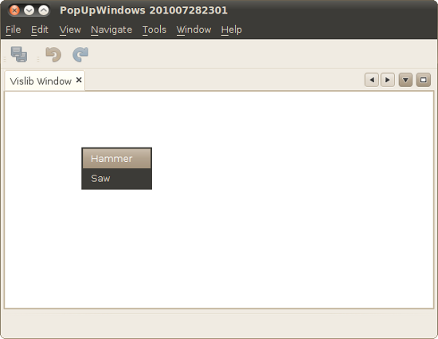

// 
//     Licensed to the Apache Software Foundation (ASF) under one
//     or more contributor license agreements.  See the NOTICE file
//     distributed with this work for additional information
//     regarding copyright ownership.  The ASF licenses this file
//     to you under the Apache License, Version 2.0 (the
//     "License"); you may not use this file except in compliance
//     with the License.  You may obtain a copy of the License at
// 
//       http://www.apache.org/licenses/LICENSE-2.0
// 
//     Unless required by applicable law or agreed to in writing,
//     software distributed under the License is distributed on an
//     "AS IS" BASIS, WITHOUT WARRANTIES OR CONDITIONS OF ANY
//     KIND, either express or implied.  See the License for the
//     specific language governing permissions and limitations
//     under the License.
//

= DRAFT: NetBeans Visual Library Widget Creation Tutorial
:jbake-type: platform_tutorial
:jbake-tags: tutorials 
:jbake-status: published
:syntax: true
:source-highlighter: pygments
:toc: left
:toc-title:
:icons: font
:experimental:
:description: DRAFT: NetBeans Visual Library Widget Creation Tutorial - Apache NetBeans
:keywords: Apache NetBeans Platform, Platform Tutorials, DRAFT: NetBeans Visual Library Widget Creation Tutorial

In this tutorial, you will learn about a different approach to creating widgets in Visual Library scenes. Other approaches are described in other tutorials:

*  xref:nbm-visual_library.adoc[NetBeans Visual Library Tutorial.] In this introductory tutorial to the Visual Library, you are shown how widgets can be created when the user drags-and-drops an item from the Component Palette.
*  xref:nbm-visual_library2.adoc[NetBeans Visual Database Explorer Tutorial.] In this tutorial, you are shown how widgets can be created from tables in a database via a database connection in the Services window.
*  xref:nbm-visual_library3.adoc[NetBeans Visual Library Tutorial for Java Applications.] In this tutorial aimed at general Java SE applications, you are shown how widgets can be generated from the constructor of a NetBeans Visual Library Scene class.

In this tutorial, widgets are created in a slightly different way, more common to typical Visual Library scenarios. When the user clicks in a scene, a dialog will appear, where the user can specify certain attributes of the widget, after which the widget itself will be created. In other words, in contrast to the above tutorials, widgets will be created on-demand, that is, when the user requires them, when clicking in the scene, that is, without using the Component Palette.

All the information you need to know for working with the Visual Library API is collected at these two locations:

*  xref:../projects/platform/graph/index.adoc[Visual Library Project Page]
*  link:https://bits.netbeans.org/dev/javadoc/org-netbeans-api-visual/org/netbeans/api/visual/widget/doc-files/documentation.html[Visual Library 2.0 - Documentation]

== Setting Up the Application

In this section, we use wizards to create a module project and a custom window component.

[start=1]
1. Choose File > New Project (Ctrl+Shift+N). Under Categories, select NetBeans Modules. Under Projects, select NetBeans Platform Application. Click Next.

[start=2]
1. In the Name and Location panel, type  ``DemoToolVisualizer``  as the name of the application. Click Finish.

[start=3]
1. Choose File > New Project (Ctrl+Shift+N). Under Categories, select NetBeans Modules. Under Projects, select Module. Click Next.

[start=4]
1. In the Name and Location panel, type  ``ToolVisualizerSample``  in the Project Name field. Change the Project Location to any directory on your computer. Set the  ``DemoToolVisualizer``  as the suite to which you will add your module. Click Next.

[start=5]
1. In the Basic Module Configuration panel, type  ``org.netbeans.demo``  in Code Name Base.

[start=6]
1. Select "Generate XML Layer". Leave the locations of both the localizing bundle and the XML layer file so that they will be stored in a package with the name  ``org/netbeans/demo`` . Click Finish.

The IDE has created an application containing a single module. The application contains all of your sources and project metadata, such as the project's Ant build script. The project opens in the IDE. You can view its logical structure in the Projects window (Ctrl+1) and its file structure in the Files window (Ctrl+2).

Now we need to set some dependencies.

[start=1]
1. Right-click the project, choose Properties, click Libraries in the Project Properties dialog box and declare a dependency on the following APIs:

* Visual Library API
* Utilities API

Click OK.

== Creating the Window

In this section, we use a wizard to create a custom window component.

[start=1]
1. Right-click the module project, choose New > Other and choose Window from the Module Development category. Click Next.

[start=2]
1. Choose  ``editor``  in the drop-down list and select Open on Application Start. Click Next.

[start=3]
1. 
Type  ``ToolVisualizer``  in Class Name Prefix. Optionally, add an icon with a dimension of 16x16 pixels. Click Finish.

Multiple files are generated, one of them is  ``ToolVisualizerTopComponent`` . Open this file in Design mode. You should now see this:

image::images/vislib_65-shapetopcomponent.png[]

[start=4]
1. Right-click in the TopComponent in Design mode, choose Set Layout, and select BorderLayout.

== Creating the Scene

Programming with the Visual Library API is similar to programming in Swing. You build and modify a tree of visual elements that are called "widgets". The root of the tree is represented by a Scene class which holds all the visual data of the scene. The scene is a widget. You have to create a scene view, which is a JComponent. You must then add the JComponent to a JScrollPane.

In this section, we add a JScrollPane to our TopComponent. Then we create a new scene. Next, we pass the scene view to the TopComponent, so that it can be displayed in the TopComponent's JScrollPane. We then install the module project and display our first scene.

[start=1]
1. Use the Palette (Ctrl-Shift-8) to drop a  ``JScrollPane``  on the TopComponent. In the Inspector, right-click the  ``JScrollPane`` , choose Change Variable Name and type  ``shapePane`` .

[start=2]
1. Create a Scene in the window, as follows:

[source,java]
----

private final Scene scene;
private final LayerWidget layer;

public ToolVisualizerTopComponent() {

    ...
    ...
    ...

    scene = new Scene();

    layer = new LayerWidget(scene);
    scene.addChild(layer);

    scene.getActions().addAction(ActionFactory.createPopupMenuAction(new PopupMenuProvider() {
        public JPopupMenu getPopupMenu(Widget widget, Point localLocation) {
            JPopupMenu popup = new JPopupMenu();
            popup.add(new WidgetMenuItem(scene,"Hammer", localLocation));
            popup.add(new WidgetMenuItem(scene,"Saw", localLocation));
            return popup;
        }
    }));

    jScrollPane1.setViewportView(scene.createView());

}

class WidgetMenuItem extends JMenuItem {

    public WidgetMenuItem(final Scene scene, final String type, final Point loc) {
        super(type);
        addActionListener(new ActionListener() {
            @Override
            public void actionPerformed(ActionEvent e) {
                NotifyDescriptor.InputLine desc =
                        new NotifyDescriptor.InputLine(
                        "Description:","Create a " + type) ;
                DialogDisplayer.getDefault().notify(desc);
                ToolWidget widget = new ToolWidget(
                        scene,
                        type,
                        desc.getInputText(),
                        loc);
                layer.addChild(widget);
                scene.validate();
            }
        });
    }

}

class ToolWidget extends LabelWidget {

    public ToolWidget(Scene scene, String type, String description, Point loc) {
        super(scene);
        setLabel(type + " (" + description + ")");
        setPreferredLocation(loc);
        getActions().addAction(ActionFactory.createMoveAction());
    }

}
----

[start=3]
1. Run the application.

image::images/vislib4_result-2.png[]

image::images/vislib4_result-3.png[]

image::images/vislib4_result-4.png[]

Congratulations, you have completed your first Visual Library scene.

xref:../community/mailing-lists.adoc[Send Us Your Feedback]

== Next Steps

For more information on working with the Visual Library API, see:

*  link:http://www.javalobby.org/eps/netbeans_visual_library/[Roman Strobl's Visual Library Screencast] on Javalobby.
*  xref:../projects/platform/graph/index.adoc[Visual Library Project Page]
*  link:https://bits.netbeans.org/dev/javadoc/org-netbeans-api-visual/org/netbeans/api/visual/widget/doc-files/documentation.html[Visual Library 2.0 - Documentation]
