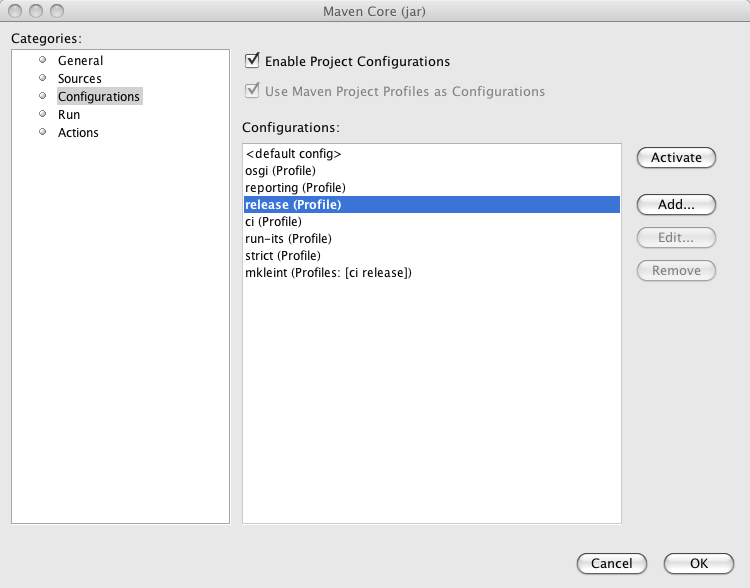
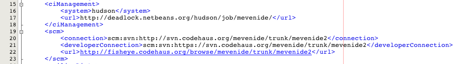
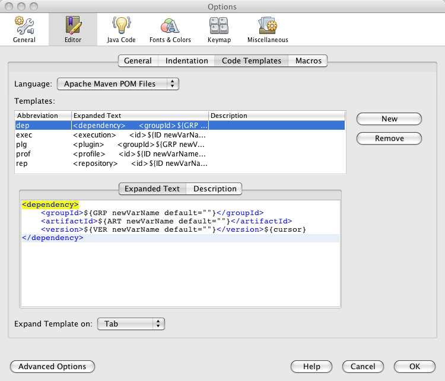
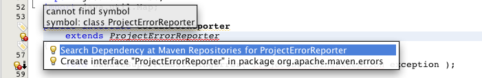

// 
//     Licensed to the Apache Software Foundation (ASF) under one
//     or more contributor license agreements.  See the NOTICE file
//     distributed with this work for additional information
//     regarding copyright ownership.  The ASF licenses this file
//     to you under the Apache License, Version 2.0 (the
//     "License"); you may not use this file except in compliance
//     with the License.  You may obtain a copy of the License at
// 
//       http://www.apache.org/licenses/LICENSE-2.0
// 
//     Unless required by applicable law or agreed to in writing,
//     software distributed under the License is distributed on an
//     "AS IS" BASIS, WITHOUT WARRANTIES OR CONDITIONS OF ANY
//     KIND, either express or implied.  See the License for the
//     specific language governing permissions and limitations
//     under the License.
//

= Best Practices for Apache Maven in NetBeans
:jbake-type: wiki
:jbake-tags: wiki, devfaq, needsreview
:jbake-status: published
:keywords: Maven Best Practices NetBeans 
:description: Maven Best Practices NetBeans 
:toc: left
:toc-title:
:syntax: true

In this article you will learn how to import, create and work with Apache Maven
based projects in NetBeans IDE. To quote the link:https://maven.apache.org/[Maven project site], "Maven is a software project management and comprehension tool.
Based on the concept of a project object model (POM), Maven can manage a
project's build, reporting and documentation from a central piece of
information."

NOTE: This article assumes basic knowledge of Apache Maven, its terminology and principles. The article uses terms from the Apache Maven world without explaining them in details.

The article was originally written for NetBeans 6.1 IDE. Unless stated
otherwise, the content applies to any future versions of NetBeans as well.
Features added in newer versions are clearly marked with version number such as
`NetBeans 6.5:` or `NetBeans 6.9`

To learn about Maven in general or about particular aspects mentioned in this
article, please visit the link:https://maven.apache.org/[project site] and read
the link:https://maven.apache.org/articles.html[available books and articles] on
the subject.

== Open existing project

The NetBeans IDE can automatically recognize any existing Apache Maven project. If you have such a project, just use the Open Project dialog (to be invoked via Ctrl-Shift-O keyboard shortcut, icon in the toolbar or the File/Open project menu item). All the recognized Maven projects should be marked by the Maven project type icon. If you select such folder in the file chooser, you get the project's name and a list of subprojects on the right hand side.

image::open_MavenBestPractices.png[]

As you can see in the picture above, the project name for Maven-based projects
is composed of 2 elements: the POM <name> element (if not present, then
<artifactId> element) and the project packaging in brackets. In this example
the packaging is maven-plugin. That means the resulting output of the project
is a plugin for Maven itself. The most common packagings are "jar", "war",
"ejb", and "pom". Depending on the packaging of the project the IDE will
automatically change the UI appearance of the opened project. Thus if your
project is a .war project, then web application specific features get enabled
for such Maven project, such as the possibility to deploy to an application
server, web application specific file templates, etc.

NOTE: For users of the standard Ant-based projects there is one important
difference in Maven projects with regard to what "Required project" means. For
Ant-based projects, the project's classpath is composed of libraries (as
defined in the IDE's Library Manager), custom jars and folders and of projects
that the current project depends on. Such a project needs to be compiled before
the current project etc. Maven is missing such a notion and the classpath is
composed exclusively of dependencies that are uniquely identified and are to be
present in a local or remote repository. Therefore one cannot explicitly
declare that the project depends on another project and that one has to be
compiled and packaged before the current one. However for a set of projects
that has to be compiled and packaged together, a "pom" packaged project
aggregates the build by listing them as modules. A project with modules is
known as a multimodule, or aggregator project. Modules are projects that this
POM lists, and are executed as a group. The Maven projects in NetBeans lists
these modules as "Required Projects". So you will only get the required
projects list populated for Maven projects with "pom" packaging that have
modules defined.

TIP: You can exploit this behavior to easily define project groups
(File/Project Group/New Group... menu item). In the dialog that adds new
project groups, select the "Project and All Required Projects" option and add
the root POM with definitions of modules that are part of the aggregated build.
By switching to this project, you get all relevant projects opened instantly
and the project group is managed by the content of your POM, therefore you
always get an up-to-date list of the relevant projects.

If your project contains generated source roots that need to appear in the
project's source path, please make sure that the Maven plugin generating the
sources generates them in the target/generated-sources/<toolname> directory
where <toolname> is folder specific to the Maven plugin used and acts as source
root for the generated sources. Most common maven plugins currently follow this
pattern in the default configuration. If you open the project and the  sources
are not generated yet, you will get compilation errors in classes that use the
generated content. Please do a build of the project and the classpath and
editor highlighting should be refreshed. Alternatively running just the "mvn
generate-sources" build phase should be sufficient.

== Create new project

Apart from working with existing projects, the IDE also offers a way to create
new Maven based projects from scratch. The projects are generated using
maven-archetype-plugin.

image::Create_MavenBestPractices.png[]

To create a new project, invoke the File/New Project menu item, the action in
toolbar or press Ctrl-Shift-N shortcut. In the list of available project types
select the "Maven" category and select the first project template named "Maven
Project". Hit Next button.  On the next panel you will be presented with the
available Archetypes. Archetype is a Maven term for what is otherwise called a
"project template" in the IDE. The list contains a few hardwired simple
archetypes to get you started fast. You can however enter any archetype you
want. If you have used Maven archetypes before and have some in your local
repository, the list should include your favorite archetypes as well. As you
create new projects from archetypes, the list keeps updating and offering you
the archetypes you have used before in a privileged position. If you don't want
to use a particular archetype anymore, you can remove it from the list. It will
be also removed from the local repository.

If NetBeans knows about the content of remote Maven repositories (more on the
new remote repositories feature later in the article) it will present them in
an expandable tree at the end of the list. There you can browse for all known
archetypes and pick the exact version you want. The IDE will however suggest
the latest version of a given archetype at the top level of the expandable
tree.

After you have selected your archetype, the next panel will let you customize
the properties of the new project. These properties will be passed to the maven
archetype plugin which creates the new project. If the execution succeeds, the
created project(s) gets opened in the IDE.

`NetBeans 6.7`: In 6.7, we've added 3 new project wizards that let you easily create a Maven based Web, Ejb and Ear projects. The wizards let you pick the J2EE level and the resulting project will be very close to what the standard Ant based projects generate.

`NetBeans 6.8, 6.9` In 6.8 and 6.9, the New Project wizards were enhanced to enable the creation of new Maven NetBeans Platform applications, Maven NetBeans modules and Maven OSGi bundles. The option to support OSGi dependencies was added to New Project wizards in 6.9. All specialized wizards can be found under the Maven category of the New Project wizard.

== Debugging, running applications

Just like Ant based projects in NetBeans use Ant to perform tasks like Run project, Test project or Debug Single File, the Maven based projects use execution of Maven goals to achieve the tasks at hand. The advantage behind the concept is that your IDE action will always perform the required steps as you have defined them in your project's POM. Additionally it will do so without changing your project pom.xml file in most cases. What happens when you perform for example "Run Project" action on your project largely depends on what project's packaging. If it's a jar project, you will be prompted for a main class to run, if it's a war or ejb packaging you will have to associate an application server. That will be then used as deployment target your web application. Some basic actions like "Build project" or "Clean project" are defined for all packagings.

NOTE: Please note that for some custom packagings, the default action mapping
is missing and you will have to define yourself what it meas to Run your
project. In the next paragraph we will learn how you can do that.

=== Binding Maven goals to IDE actions

It's possible to customize the default Maven goal to IDE Action binding from the project's customizer.

Right click on the project node and select "Properties" or use the File/Project
Properties main menu item to invoke the Project properties dialog. On the left
hand side, select the panel named "Actions".

The panel lists all available default project actions that can be mapped. When
selecting one from the list the textfields in the bottom allow to change the
values.

You can customize 3 basic properties

* What goals get executed
* What profiles get activated
* What properties get set on the command line. These generally customize behavior of the executed goal.

If you have modified the default value in any way, the action in the list will be shown in bold letters to show that you have a project specific mapping for the action.

image::Actions_MavenBestPractices.png[]

Apart from the default action mappings, you can define custom executions for
the project. That's done by clicking on the Add Custom... button. Such custom
items appear in the project's popup menu under "Custom...". Additionally you
can define such execution definition for the whole IDE installation on
Tools/Options dialog. Go to Miscellaneous/Maven panel there and setup the
global execution definitions there.

=== Configurations

Configurations is a new additional mechanism to further extend the
customization of your project's execution and loading. It's using the similar
UI as the standard Java SE project type. However it's disabled by default for
Maven projects.

To enable it and customize it, right click on the project node and select
"Properties" or use the File/Project Properties main menu item to invoke the
Project properties dialog. On the left hand side, select the panel named
"Configurations". The panel allows to enable and disable the configurations
feature. When enabled all project's profiles serve as configurations, however
you can create new custom ones as well.

And what does the configuration bring to your project anyway?

* It loads the project in the IDE with the profile(s) associated with the configuration. That way you can get a different set of dependencies or different set of submodules loaded.
* Every action triggered with the configuration will have it's profile(s) also activated for building, running or debugging the application. Thus you can have alternate setup for various plugins and easily switch between them.
* Once configurations are enabled, other panels in the Project properties dialog (currently Actions panel for all project packagings and the Run panel for "jar" packaging) add a combobox with existing configurations and let you customize the IDE actions on a per configuration basis. For example each configuration can run the project with different main class setup. Or with different parameters passed into the main class.

Once enabled, the activated configuration can be switched by accessing the popup menu of the project. Right click the project node and select "Set Configuration" menu item. From the list of existing configurations, select the one you want to activate. If your project is setup to be the main project in the IDE (it's name is shown in bold letters), you can also quickly switch configurations using a combo box in the toolbar. Please note that due to a bug in NetBeans 6.1, the toolbar editor will not immediately appear for your main project after enabling configurations. A workaround is to restart the IDE or set a different project as main and then set it back to the old project.

TIP: In case you have configurations disabled but still want to have the project loaded with specific profile(s) on, please refer to the project's popup menu and find the "Profiles" sub menu. There you can select profiles you want to have activated when the project loads. Please note that when you enable configurations, the Profiles action disappears and you are expected to use Configurations to get the same result.

=== J2EE Deployment

The web or enterprise application is run by deploying to an application server.
Unlike the standard Ant based projects, Maven projects don't have an
application server associated by default. Therefore before you can run or debug
a web application, you need to associate the project with a server. Please make
sure you have a server registered first. Then right click on the project node
and select "Properties" or use the File/Project Properties main menu item to
invoke the Project properties dialog. Select the Run panel (applies to war, ejb
and ear maven packaging) and select the application server you want to deploy
to. There is additional difference to Ant based projects. None of the jars in
the application server end up on your project's compilation classpath. Please
make sure you add all necessary binary dependencies yourself, don't forget that
jars that are part of the application server shall not be bundled with the war
file. Setting dependency scope to "provided" handles that.

TIP: When you select the application server for your project, a property named
"netbeans.hint.deploy.server" is added to your POM. The property is harmless
for the Maven build and it eases the setup for your colleagues that checkout
the project from version control. If they have an instance of the same type of
server registered in their IDE, it gets automatically assigned to the project.
No more setup for them. If for some reason you don't like the property in the
POM, you can move it to the "netbeans-private" profile in the profiles.xml file
(resides next to your pom.xml and is easily accessible from the "Project Files"
node of your project). The IDE will recognize your preference and when you
update the deployment server later, it writes the changes to profiles.xml file
instead.

=== Web frameworks

The new version of Maven support adds integration with Web framework support
for web projects in the IDE. For Maven projects with "war" packaging there's an
additional panel in the project Customizer to add Web frameworks to the
project. Right click on the project node and select "Properties" or use the
File/Project Properties main menu item to invoke the Project properties dialog.
On the left hand side, select the panel named "Frameworks".

image::Frameworks_MavenBestPractices.png[]

The panel on the right hand side lists the web frameworks that are already
included in the project. You can customize the frameworks there. Or add more
web frameworks by clicking the Add... button. When adding a new web frameworks,
the Maven support will attempt to identify the web framework jars and add
appropriate dependency elements in the project POM. However not always can the
binaries be identified. In such a case, temporary artifact identification is
created along with a temporary file:// protocol based repository. The user is
encouraged to identify the jars manually and upload them to the company's own
remote repository to create reproducible Maven builds.  Additionally, the web
framework is registered in the web application's descriptor and configuration
files are created.

== Improving editing efficiency

The project properties dialog offers just limited capabilities for editing the
content of the Maven POM files. As we have shown above it attempts to cover
just the most common cases and anything that is related to the IDE integration
itself. For anything else you are encouraged to use the XML editor.

NOTE: Please refer to Apache Maven link:https://maven.apache.org/pom.html[POM
Reference] and other Maven documentation to learn about how you can configure
your Maven based project.

Let's start by opening the POM file for your project. Expand the project's node
the Projects View component. Find the subnode named "Project Files" and expand
it as well. The project files driving your project are residing there. You
always get the pom.xml file as that one is essential for any Maven Project.
There are 2 other files appearing eventually.

* `settings.xml` file which resides in your `~/.m2 directory`. This file
influences all your projects and builds. User specific settings belong there.
For more details, see the link:https://maven.apache.org/settings.html[Settings
Reference] page

* `profiles.xml` file which resides in the same directory as your POM and
contains user specific settings that are bound to this particular project
only.

If you don't have these additional files and want to create them, there are
shortcut actions to do so available on the Project Files node popup menu. The
files will be created for you in the right location and opened in the editor
for further editing.

Once you open the `pom.xml` file in the editor you will notice it's good old
plain xml. No xml namespaces and actually even no attributes. (Attributes might
be added in the future versions of Maven as an alternative to sub elements for
some parts of the POM though). The syntax coloring, code folding, navigator
panel, editor toolbar and popup menu actions are all derived from the xml
editor.

Let's take a look closely at what additional Maven specific features you can
use when editing the project object model (POM).

=== Code completion

The code completion is your best friend in the IDE for editing java file and it
shall be no different for editing the POM file. The basic set of completion
hints is derived from the XML schemas describing the POM. The XML schema for
your pom.xml, settings.xml and profiles.xml file are already automatically
included in the IDE for your convenience. You shall get a list allowed elements
along with a description (as described in the schema).

NOTE: If you want to include an additional Maven related XML schema, please refer to "Tools/DTDs and XML Schemas" window. It contains multiple catalogs with registered DTDs and Schemas. Once you add your custom schema, the IDE should recognize your documents.

image::Completion-schema_MavenBestPractices.png[]

Additionally the Maven support attempts to utilize the sources of information it has about the project to provide more help.
That includes:

* List of known Dependency groupId, artifactId (for given groupId) and version (for given groupId and artifactId)
* List of known Maven Plugin groupId, artifactId (for given groupId) and version (for given groupId and artifactId)

image::Completion-value_MavenBestPractices.png[]

* List of known Repository URLs, and a list of values for repository's update policy.
* List of Dependency scopes
* List of Goals for a Plugin within the Executions elements.
* List of Phases within the plugin's Executions element.
* Additionally in settings.xml, list of profiles and available plugin groups.
* Last but not least, for the most popular plugins (must be present in central maven repository) also the names of configuration parameters for the plugin's goals.

image::Completion-param_MavenBestPractices.png[]

=== Hyperlinking

The Java editor offers so called "hyperlinks" that allow you to traverse from
one java file to another one. The same can be achieved within the pom.xml
editor. To invoke the hyperlink, hold the CTRL key while pointing the mouse
over an element of the document. If the part of the document is recognized as a
hyperlink, it turns blue and gets underlined. To follow the link, click the
left mouse button while still holding the CTRL key.

And what can be hyperlinked within the maven project files?

* Any URLs with http or https protocol. That includes continuous integration
server location, bug tracking URL, mailing list archives, repository urls
etc. Any of the URLs will be opened in your default web browser.
* If the pom.xml file contains declaration of sub modules, the link to the
module opens the submodule's pom.xml file in editor.

=== Code templates

You can reduce the number of keystrokes when you are typing code by typing
abbreviations to generate code from templates. The abbreviation is expanded
into the template after you press the Tab key.

The IDE comes with a set of code templates for java files or general XML files.
Because the POM xml format is rather verbose, there are a few templates
included for your POM editing needs as well. So for example, you can add a new
dependency quickly by typing "dep", followed by the Tab key. You will get a
dependency code snippet where you just fill in the groupId, artifactId and
version. Please note that you can use code completion to get help on the
groupId/artifactId/version values. Other default code templates include
profile, repository, plugin and plugin execution code snippets.

The code template expansion key is configurable in the Tools/Options dialog,
the Editor/Code templates tab. At the same place you can also edit the existing
POM file code templates or add your own.

=== Hints

For some common coding mistakes, the Source Editor provides hints for adding
the missing code and offers to add the code for you automatically. To display
hints, choose Source > Fix Code (Alt-Enter). The maven support adds currently
one additional hint.

The IDE has knowledge about the local repository content (populated by locally
built projects from remote repositories) and also about about some content of
some remote repositories. By default at least about the
link:https://repo1.maven.org/maven2[central repository]. Among other things it
also knows about what classes are used in the artifacts in the repository. The
hint makes use of that information and is capable of finding artifacts in
repositories that contain any unknown class or interface.

When the hint is invoked, the remote repositories are searched for the given
term and displayed in a dialog. All artifacts that contains such class are
returned in a list grouped by groupId and artifactId. When a matching artifact
is selected, it's added to the project's pom.xml file as a dependency and
downloaded (if not present locally).

image::Hintdialog_MavenBestPractices.png[]

TIP: You can use this feature as a quick and easy way of adding dependencies to
your project. However the assumption is that you know a name of a class from
the artifact you intend to add to the project. Also remember that picking a too
generic name like "FileUtil" will return a lot of results when searching the
complete central repository.

Please note that the hint only works in NetBeans IDE 6.1 and newer.

=== Code Formatting

A panel in project properties dialog allows to customize formatting rules on a
per-project basis. Any such customizations get written into the
nb-configurations.xml file by default. However if you take these properties and
move them to your pom.xml file, the IDE will recognize them as well. Ideally
you put the properties in your company's super pom to enforce unified code
formatting across all your projects.

== Dependency management

An important part of your Maven based projects is managing it's classpath
dependencies. Dependency management is one of the features of Maven that is
best known to users. There is not much difficulty in managing dependencies for
a single a project, but when you start getting into dealing with multi-module
projects and applications that consist of tens or hundreds of modules this is
where Maven can help you a great deal in maintaining a high degree of control
and stability. Check detailed information on Apache Maven
link:https://maven.apache.org/guides/introduction/introduction-to-dependency-mechanism.html[dependency mechanism].

The IDE lists the project dependencies under one or more subnodes of your
project's node. It will list the compilation dependencies under "Libraries"
node, runtime dependencies under "Runtime libraries" and the dependencies
required to compile and run your tests under "Test Libraries". Please note that
the Runtime and Test Libraries nodes will only be visible if the project has
applicable dependency entries to save display space for you.

* `NetBeans 7.0:` All "Libraries" nodes as part of Maven projects were renamed into "Dependencies".
* `NetBeans 7.1:` Additional node "Java Dependencies" was added.

image::Dependencyinfo_MavenBestPractices.png[]

When you expand the Libraries node you get a flat listing of your project's
dependencies. The direct dependencies (listed in your POM) are in the
beginning, transitive ones are at the back and have a desaturated icon to make
it obvious they were pulled by one (or more) of your direct dependencies. Every
dependency also has icon annotations on the right side of the icon that show if
the dependency has javadoc and sources available locally. That's useful for
code completion, debugging and other IDE features. The Libraries node provides
popup menu actions for retrieval of sources and javadocs. However please note
that some artifacts in central repository don't have these present.

To download and attach source packages from the maven repository, right-click
on the "Libraries" node and select "Download All Library Sources".  This can be
done from the "Test Libraries" and "Runtime Libraries" nodes as well.  Once the
source packages are downloaded, you can drill down to a particular class and
double-clicking it will open the corresponding source code.

* `NetBeans 7.0:` For attaching source packages using NetBeans 7 and above, right click on the "Dependencies" and select "Download Source".

TIP: If you open a project that other projects depend on, the icon in other
projects changes to a "maven project" icon to denote that the IDE knows about
link between the projects. However such a link is only established when the
groupId, artifactId and version all match in the dependency and project
declaration. Frequently occurring problem is that you change an API signature
in your library project, but the application is not picking up. Often it's
caused by the fact that the application is using an older version of the
library artifact. The artifact icon can help you track down these problems.

All dependency entries can be browsed, that way you can examine the manifest or
some other configuration data present in the jars. They also provide useful
actions on the popup menu.

* Install artifact action allows you to populate your local repository manually
in case none of the remote repositories serves the artifact.
* If the artifact doesn't have sources or javadoc locally, you can install them
manually as well.
* Direct dependencies can be Removed, transitive dependencies can be Excluded.
The difference is subtle. Wile direct dependency gets removed from the
pom.xml file, for transitive dependencies the IDE identifies what direct
dependency pulled in the transitive one and appropriate exclusion element is
added.
* If the dependency's metadata provides additional project information, it's
possible to: Open project home page or bug tracking system page in your
preferred browser. You can also browse the sources of the artifact online.
Alternatively you can also checkout the sources of the artifact on your local
machine. That's useful for debugging and submitting patches to 3rd party
projects.

image::Dependency-checkout_MavenBestPractices.png[]

The version control checkout is using
link:https://maven.apache.org/scm/scms-overview.html[Maven SCM] on the
background, so you don't need to have the appropriate version control support
installed and it even works for systems that are not currently supported by the
IDE.

* `NetBeans 6.7 and newer:` The number of dependencies and the complexity of
managing dependencies can be considerable even in smaller projects. The IDE
includes a dependency graph viewer to help you view, manage and fix
dependencies and their conflicts. You can open the viewer by choosing "Show
Dependency Graph" in a project's popup menu. The graph displays the structure
of the project's dependencies, their paths, and also indicates conflicts and
hints on how such conflicts are typically resolved, such as adding dependency
exclusions or declaring a direct dependency on an artifact. The video
xref:../kb/docs/java/maven-dependencies-screencast.adoc[Working with Maven
Dependencies] can demonstrate how to use the dependency graph viewer.

=== Utilizing and managing Maven repositories

Maven integration is using the link:http://nexus.sonatype.org/[Nexus] indexing
engine for indexing the local repository. At the same time it can download
zipped Nexus indexes from remote locations. These indexes describe the content
of the remote repositories and allow searching and browsing the content. Many
IDE features make use of these indexes. Some have been already mentioned, like
archetype discovery, code completion in the pom.xml editor, recognition of
library jars for web frameworks etc.  It's also possible to browse and manage
the indexes used by the IDE. Open the "Windows" main menu item and select the
"Services" action in the popup. A new component gets opened at the same
position as "Projects", "Files" or "Favourites" components. One of the nodes in
the view is name "Maven repositories" and it lists the currently known
repositories that are browseable and searchable. If you expand the root
repository node, you get a listing of all artifact groupIds present in the
repository, at the next level there are artifactId for the given groupId. The
leaves in the tree and single versions of the given artifact. Small icon
annotations designate if the artifact has sources and javadoc and the text
annotation shows what packaging the artifact is.

image::Repobrowser_MavenBestPractices.png[]

At the top of the browser there are 3 icons.

* The left most is "Refresh" which will reindex the local repository (local repository has a brown/orange repository icon in the browser) and will check the remote locations for index updates. If there are updates or the index was not present locally yet, new index is retrieved.
* The middle icon represents the "Add Repository" action. When you click it, a dialog shown which allows you to enter new repository locations.

image::Repository-custom_MavenBestPractices.png]][]

TIP: If you have your own company repository manager (you should have one
ideally, there are multiple one to choose from:
link:http://archiva.apache.org/[Archiva],
link:http://nexus.sonatype.org/[Nexus],
link:http://www.jfrog.org/sites/artifactory/latest/[Artifactory]), then you can
easily create and maintain the downloadable repository index for your company
repository using these
link:http://docs.codehaus.org/display/M2ECLIPSE/Nexus+indexer[instructions].
Then you can remove the central repository index from the list of registered
indexes and replace it with your company index. That index is most probably a
reasonably better match for your repository searching/indexing needs and the
IDE will start giving you better results in your everyday work.

* The last toolbar button on the right - "Find" - allows you to search the content of the repositories. Enter keywords in the Find field and the artifacts containing the terms will be returned in the Repository browser window.

TIP: In both browsing view and search results view you can right click on the
selected artifact and invoke similar action like we have seen in the Dependency
management section. If the artifact in remote repository defines the
appropriate metadata you should be able to visit the website, file bug reports,
browse the sources online or check them out for local work.

One additional action is that is worth mentioning here the "Add as Dependency
To" action. You will be presented with a dialog popup where you can easily
choose which project(s) you want to add the selected artifact to.

image::Addasrepository_MavenBestPractices.png[]

== License Header

* `NetBeans 7.4 and newer:` There is a new project properties panel that allows set license headers from the UI.

For previous releases, use the property netbeans.hint.license in POM.xml to
make Netbeans automatically insert license header in new Java files. Designates
the License header template to be used within the project. You need to create
the license template first. Go to Tools/Templates and create a new entry under
Licenses. The format of the template file name needs to be license-FOO.txt.
Your netbeans.hint.license property takes FOO as value then.

== Tutorials

The following NetBeans tutorials and videos can provide additional information
about how to develop your Maven projects with the NetBeans IDE:

* xref:../kb/docs/java/maven-hib-java-se.ado [Creating a Maven Swing Application Using Hibernate]
* xref:../kb/docs/javaee/maven-entapp.adoc[Creating an Enterprise Application Using Maven]
* link:http://nbstaging.czech/kb/docs/javaee/maven-osgi-declarativeservices.html[OSGi Declarative Services Using Maven]
* xref:../tutorials/nbm-maven-quickstart.adoc[NetBeans Platform Quick Start Using Maven]
* xref:../tutorials/nbm-maven-modulesingle.adoc[Creating a NetBeans Module Using Maven]
* xref:../tutorials/nbm-maven-modulesuite.adoc[Working with NetBeans Module Suites]
* xref:../tutorials/nbm-maven-crud.adoc[Creating NetBeans Platform CRUD Application Using Maven]
* xref:../kb/docs/java/maven-dependencies-screencast.adoc[Video of Working with Maven Dependencies]

== Summary

At this point you should be able to take full advantage of the IDE's Apache
Maven support. You learned how to setup the project, how to configure it for
work within the IDE, how editor features help you edit your project fast and
without mistakes and how to manage your project in general.

