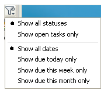
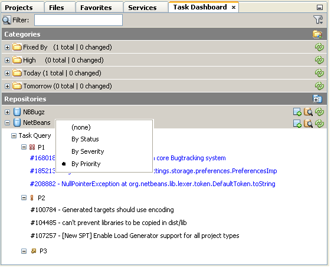
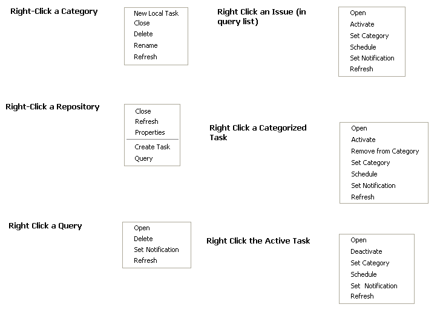

// 
//     Licensed to the Apache Software Foundation (ASF) under one
//     or more contributor license agreements.  See the NOTICE file
//     distributed with this work for additional information
//     regarding copyright ownership.  The ASF licenses this file
//     to you under the Apache License, Version 2.0 (the
//     "License"); you may not use this file except in compliance
//     with the License.  You may obtain a copy of the License at
// 
//       http://www.apache.org/licenses/LICENSE-2.0
// 
//     Unless required by applicable law or agreed to in writing,
//     software distributed under the License is distributed on an
//     "AS IS" BASIS, WITHOUT WARRANTIES OR CONDITIONS OF ANY
//     KIND, either express or implied.  See the License for the
//     specific language governing permissions and limitations
//     under the License.
//

= TaskDashboardDesignSpec
:jbake-type: wiki
:jbake-tags: wiki, devfaq, needsreview
:markup-in-source: verbatim,quotes,macros
:jbake-status: published
:syntax: true
:description: Specification for the look and feel
:icons: font
:source-highlighter: pygments
:toc: left
:toc-title:
:experimental:

[[Description_of_this_document]]
== Description of this document

This document is intended to serve as a specification for the look and feel,
the features and functionality, and the user interaction with the proposed Task
Dashboard window in Netbeans.

[[Look_and_Feel]]
== Look and Feel

The base look and feel of the Task Dashboard is shown here:

image:Task_Dashboard_MarkedUp.png[]

[[User_Interface_Description]]
=== User Interface Description

[[General]]
==== General

The general User Interface is that of a dockable window.  The intent is to
provide a common location where developers can organize, access, and manipulate
issues coming out of various Issue Trackers like Jira or Bugzilla.

[[Description_of_UI_Aspects]]
==== Description of UI Aspects

Here are descriptions of the UI Aspects shown in the mockup above, based on the
numerical callouts shown therein:

1. Categories: Categories are user-created buckets into which individual issues can be placed.  These can be for priority, due date, area of functionality, severity, or any other delineation that the user wants to segment their issues by.  Once categorized, issues will appear in this area until the user removes them, or they can be filtered out once closed.
. Repositories: Each Issue Tracker which is registered in NetBeans is given a top-level node in the Repositories tree.  While it is assumed there might only be one or two, the proposal is to break it up by connection.  There is also the notion of local tasks, that is, tasks that are created by the developer outside of any given repository, and kept private.  More details on local tasks are xref:TaskFocusedLocalTasks.adoc[here].
. Queries:  For each repository, there are various subnodes which map to a named/saved query upon that Issue Tracker.  Users might set up a few named queries that organize their issues by various parameters and attributes.  In each case, the Dashboard shows the total number of results as well as the number of issues that have changed in some way.  These changed issues are shown at the top in blue text.  Each issue is then shown as a subnode to the query and can be clicked to show or edit its details, or can be added to a category from here.
. Repository Operators: There are four functions related to repositories.  From right to left, they are:

* Create New Task: creates a new issue using the parameters specific to the given repository.
* Search in Repository: gives ability to query the repository.  From here, you can create new named queries. 
* Refresh: re-runs all named queries to update results and status.
* Close: closes the connection to the issue repository and removes it from the tree.

. Filtering: There are two ways to globally filter the task dashboard.  These filters will apply to the issues that appear both in Categories as well as in the Repository Query Results.  The first filter is a dynamic text filter, shown as a text box.  As you enter letters into this textbox, they are highlighted in relevant results, and non-matching results disappear.  The numbers for results and changed also update to show the number of matches based on the current query.  The second capability is a dropdown filter that gives the following options:

Notes on "Status": The idea behind status is that there will be the ability to
specify, on a repository-by-repository basis, which statuses equate to "open"
and which to "closed", since different Issue Trackers have different notions of
these statuses (e.g. "resolved", "fixed", "completed).

. Query Results: The query results show up both as summary text (i.e. the number of results and number of changed issues), as well as individual nodes that can be opened, edited, and/or categorized.  Users can also schedule an issue, that is, give it a due date which can be used to organize or filter it later.  It is also possible to right-click the Repository and group results by relevant attributes like priority:

. When issues, categories, and repositories are "closed", they are shown as disabled and cannot be toggled open.  They are sorted to the bottom of their respective lists.  Notifications and auto-refresh are disabled for the closed items.  Closed items can be filtered out using the filter shown in #5, at the top right of the dashboard.

. New Category: New Categories can be created from here.  Clicking this button launches a dialog that allows the user to provide a new name for their category.

. New Repository: Launches the new Issue Tracker dialog for adding a new repository connection.

[[Local_Tasks]]
==== Local Tasks

A category has the ability to show "Local Tasks", that is, tasks that are not pulled in from a repository.  These can be created by an individual developer, assigned a schedule, and associated with other tasks as super- or sub-tasks.  The only metadata available for a local task is the same as the "private" information available for any other task.  

[[Context_Menus]]
==== Context Menus

Each of the elements in the Task Dashboard have context menus associated with them.  These are shown here:

Note on Repository Grouping: Each repository can supply, by API call, a set of grouping parameters.  Likely parameters are "Priority", "Severity", or project area/module.  Grouping is done via context menu.  When grouped, each named query node will have subnodes for each value of the grouping parameter, under which the relevant query results will be shown.

[NOTE]
====

The content in this page was kindly donated by Oracle Corp. to the
Apache Software Foundation.

This page was exported from link:http://wiki.netbeans.org/TaskDashboardDesignSpec[http://wiki.netbeans.org/TaskDashboardDesignSpec] , 
that was last modified by NetBeans user RichGunther 
on 2012-05-10T19:15:28Z.

This document was automatically converted to the AsciiDoc format on 2020-03-12, and needs to be reviewed.
====

