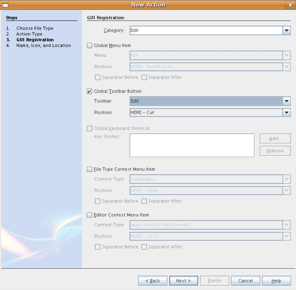
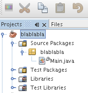
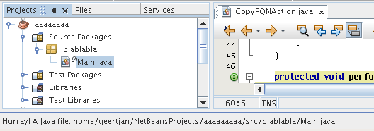
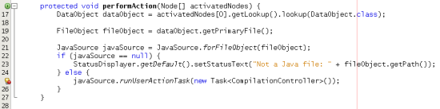
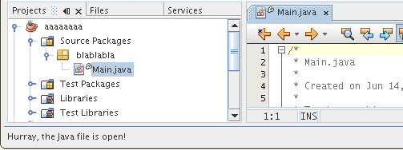

// 
//     Licensed to the Apache Software Foundation (ASF) under one
//     or more contributor license agreements.  See the NOTICE file
//     distributed with this work for additional information
//     regarding copyright ownership.  The ASF licenses this file
//     to you under the Apache License, Version 2.0 (the
//     "License"); you may not use this file except in compliance
//     with the License.  You may obtain a copy of the License at
// 
//       http://www.apache.org/licenses/LICENSE-2.0
// 
//     Unless required by applicable law or agreed to in writing,
//     software distributed under the License is distributed on an
//     "AS IS" BASIS, WITHOUT WARRANTIES OR CONDITIONS OF ANY
//     KIND, either express or implied.  See the License for the
//     specific language governing permissions and limitations
//     under the License.
//

= NetBeans Java 言語インフラストラクチャーのチュートリアル
:jbake-type: platform_tutorial
:jbake-tags: tutorials 
:jbake-status: published
:syntax: true
:source-highlighter: pygments
:toc: left
:toc-title:
:icons: font
:experimental:
:description: NetBeans Java 言語インフラストラクチャーのチュートリアル - Apache NetBeans
:keywords: Apache NetBeans Platform, Platform Tutorials, NetBeans Java 言語インフラストラクチャーのチュートリアル

このチュートリアルでは、新しい NetBeans 6.0「Retouche」API について学習します。この API によって NetBeans Java エディタにアクセスできるようになります。

トラブルシューティングのために、 link:http://plugins.netbeans.org/PluginPortal/faces/PluginDetailPage.jsp?pluginid=2753[完了したサンプルをダウンロード]してソースを調べることもできます (任意)。

== Java 言語インフラストラクチャーについて

NetBeans IDE 6.0 より以前は、Java コード生成および Java リファクタリングを含め、Java エディタをサポートする Java 言語インフラストラクチャーは、JMI for Java と呼ばれるもの (「MDR」ともいう) に基づいていました。JMI for Java には、単一の読み取りに対するロックなど、いくつかの構造上の問題点がありました。つまり、モデルから情報を読み取るだけの場合もロックされるわけですが、これは通常は書き込み時にのみ必要なものです。数年かけて JMI はデバッグされ、パフォーマンスに関しては改善されています。しかし、自身の Java パーサーの内部コピーを使用するという問題が残っています。つまり、Java ソースを独自の手法で解釈するため JDK の Java コンパイラとは異なることになります。より複雑で繊細な Java の概念を取り入れた JDK 5 が汎用的に導入され、その違いを処理することがいっそう困難になっています。このように、JMI のパフォーマンスに関して問題があること、また 正式な言語モデルが JDK Java コンパイラをプログラムのツールとして活用するように開発されていることから、JMI for Java が廃止され JDK Java コンパイラに基づく新しい手法が取り入れられました。

こうして Retouche が生まれました。Retouche とはフランス語で「改良」を意味します。Retouche は、NetBeans IDE における新しい高速の Java 言語インフラストラクチャーです。NetBeans 6.0 で実現された優れた Java エディタの機能をすべてサポートしています。本質的に、Retouche は JDK Java コンパイラのインスタンスをラップし、たとえば抽象構文ツリー (AST と呼ぶ) や解析のさまざまな段階で発生するシンボリックの解決といった、自身のアーティファクトを消費します。Retouche を使用するときには、それらのアーティファクトをいくつか取り扱う必要があります。たとえば、 link:http://java.sun.com/javase/6/docs/jdk/api/javac/tree/index.html[コンパイラツリー API] はそれらの 1 つです。コンパイラツリー API のクラスのパッケージは  ``com.sun.*``  と命名されています。したがって、技術的にはこれは非 JDK API ですが、JDK Java に由来するものです。Retouche の使用に伴う JDK Java コンパイラのアーティファクトの別の例として、JDK API における正式言語モデルがあげられます。これは、 ``javax.language.model.*``  パッケージに含まれています。

== モジュールの設定

この節では、ウィザードを使用してモジュールプロジェクトを作成し、関係する NetBeans モジュールとの依存関係を設定します。

[start=1]
1. 「ファイル」>「新規プロジェクト」を選択します。「新規プロジェクト」ウィザードで、「カテゴリ」の下にある「NetBeans モジュール」と「プロジェクト」の下にある「モジュールプロジェクト」を選択し、「次へ」をクリックします。

[start=2]
1. 「プロジェクト名」に「 ``CopyFQN`` 」と入力し、「プロジェクトの場所」をディスク上の適切なフォルダに設定します。「スタンドアロンモジュール」および「主プロジェクトとして設定」が選択されていない場合は、それらを選択します。「次へ」をクリックします。

[start=3]
1. 「コード名ベース」に「 ``org.netbeans.modules.copyfqn`` 」、「モジュール表示名」に「 ``CopyFQN`` 」と入力します。「完了」をクリックします。

[start=4]
1. プロジェクトを右クリックして「プロパティー」を選択し、「プロジェクトプロパティー」ダイアログで「ライブラリ」をクリックして次の API との依存関係を宣言します。

* データシステム API
* エディタライブラリ 2
* ファイルシステム API
* Javac API ラッパー
* Java ソース
* ノード API
* テキスト API
* UI ユーティリティー API
* ユーティリティー API
* ウィンドウシステム API

次のような表示になります。

image::images/copyfqn_proj-props-copyfqn-60.png[]

「了解」をクリックします。

== コンテキストを区別するツールバーボタンの作成

この節では、ツールバー上にコンテキスト認識ボタンを作成します。新しい Retouche API とは関係ありませんが、このチュートリアルのあとのほうで、Retouche API の実装と相互に作用するためのユーザーインタフェース要素を提供します。

[start=1]
1. モジュールプロジェクトを右クリックして「新規」>「その他」を選択し、「モジュールの開発」カテゴリの「アクション」を選択します。「次へ」をクリックします。

[start=2]
1. 次に示すように、「条件付で有効」を選択してすべての項目をデフォルトのままにします。これによってアクションは  ``DataObjects``  を区別できるようになり、 ``DataObject``  が 1 つ選択されたときにだけ有効になります。

image::images/copyfqn_cookie-action-60.png[]

「次へ」をクリックします。

[start=3]
1. 「カテゴリ」で「編集」を、「ツールバー」で「編集」を選択します。

画面は次のようになります。

「次へ」をクリックします。

[start=4]
1. 「クラス名」に「 ``CopyFQNAction`` 」、「表示名」に「 ``CopyFQN`` 」と入力します。

[start=5]
1. ツールバーボタンとして表示されるアイコンを参照します。例として、このチュートリアルで使用されているものを使用します。

image::images/copyfqn_icon.png[]

「完了」をクリックします。

新しい  ``CopyFQNAction.java``  クラスに、次のようなコードが見つかるはずです。

[source,java]
----

public final class CopyFQNAction extends CookieAction {
    
    protected void performAction(Node[] activatedNodes) {
        DataObject dataObject = activatedNodes[0].getLookup().lookup(org.openide.loaders.DataObject.class);
        // TODO dataObject を使用
    }
    
    protected int mode() {
        return CookieAction.MODE_EXACTLY_ONE;
    }
    
    public String getName() {
        return NbBundle.getMessage(CopyFQNAction.class, "CTL_CopyFQNAction");
    }
    
    protected Class[] cookieClasses() {
        return new Class[] {
            DataObject.class
        };
    }
    
    protected String iconResource() {
        return "org/netbeans/modules/copyfqn/icon.png";
    }
    
    public HelpCtx getHelpCtx() {
        return HelpCtx.DEFAULT_HELP;
    }
    
    protected boolean asynchronous() {
        return false;
----

NOTE: このあと、このチュートリアルでは、すべてこの  ``performAction()``  メソッドに重点を置いて進めます。

これで、データオブジェクトを区別するアクションが作成されました。続いて、その働きについて確認します。

[start=6]
1. モジュールを右クリックして「インストール」を選択します。

モジュールがインストールされると、ツールバーに新しいボタンが表示されます。

[start=7]
1. 「プロジェクト」ウィンドウでノードを選択してから、ツールバーのボタンを確認します。ファイルまたはフォルダ (パッケージを含む) を示すノードを選択した場合は、次に示すようにボタンが使用可能になっています。

image::images/copyfqn_ctx-sensitive-on.png[]

一方、プロジェクトを示すノードを選択した場合は、次に示すようにボタンは使用できなくなっています。

次の節では、ここで確認したプロジェクトノードと、ファイルノードまたはフォルダノードの区別だけでなく、Java クラスのファイルノードとその他すべての種類のファイルノードの区別について学習します。

== Java ソースファイルの識別

この節では、 link:https://bits.netbeans.org/dev/javadoc/org-netbeans-modules-java-source/overview-summary.html[Java ソース]と呼ばれる、新しい Retouche API の 1 つを使用します。ここで使用する  link:https://bits.netbeans.org/dev/javadocorg-netbeans-modules-java-source/org/netbeans/api/java/source/JavaSource.html[JavaSource] クラスは、Java ソースファイルを表しています。使用中のデータオブジェクトに関連付けられたファイルオブジェクトの、このクラスのインスタンスを返します。null が返された場合は、ファイルオブジェクトは Java ソースファイルではありません。ファイルが選択されている状態でボタンをクリックすると、ステータスバーに結果が表示されるようにします。

[start=1]
1.  ``performAction()``  メソッドに、次に示す強調表示された行を追加します。

[source,java]
----

protected void performAction(Node[] activatedNodes) {
    DataObject dataObject = activatedNodes[0].getLookup().lookup(org.openide.loaders.DataObject.class);
    // TODO dataObject を使用

    *FileObject fileObject = dataObject.getPrimaryFile();

link:https://bits.netbeans.org/dev/javadoc/org-netbeans-modules-java-source/org/netbeans/api/java/source/JavaSource.html[JavaSource] javaSource =  link:https://bits.netbeans.org/dev/javadocorg-netbeans-modules-java-source/org/netbeans/api/java/source/JavaSource.html#forFileObject(org.openide.filesystems.FileObject)[JavaSource.forFileObject(fileObject)];
    if (javaSource == null) {
        StatusDisplayer.getDefault().setStatusText("Not a Java file: " + fileObject.getPath());
    } else {
        StatusDisplayer.getDefault().setStatusText("Hurray! A Java file: " + fileObject.getPath());
    }*
}
----

[start=2]
1. インポート文が次のようになっていることを確認します。

[source,java]
----

import org.netbeans.api.java.source.JavaSource;
import org.openide.awt.StatusDisplayer;
import org.openide.filesystems.FileObject;
import org.openide.loaders.DataObject;
import org.openide.nodes.Node;
import org.openide.util.HelpCtx;
import org.openide.util.NbBundle;
import org.openide.util.actions.CookieAction;
----

[start=3]
1. モジュールをもう一度インストールします。

[start=4]
1. ファイルノードを選択し、ボタンを押します。

次に示すように、Java ファイルを選択したときだけ「Hurray!」のメッセージが表示されます。

別の手法として、_Java ファイルが選択されたときにだけボタンを使用可能にする_という方法もあります。これを実装するには、次のように  ``CookieAction.enable()``  メソッドをオーバーライドします。

[source,java]
----

@Override
protected boolean enable(Node[] activatedNodes) {
    if (super.enable(activatedNodes)) {
        DataObject dataObject = activatedNodes[0].getLookup().lookup(org.openide.loaders.DataObject.class);
        FileObject fileObject = dataObject.getPrimaryFile();
        JavaSource javaSource = JavaSource.forFileObject(fileObject);
        if (javaSource == null) {
            return false;
        }
        return true;
    }
    return false;
}
----

このメソッドは、Java ファイル_以外_のすべてのファイルをフィルタで除外します。これによって、現在のファイルが Java ファイルであるときだけボタンが使用可能になります。

== 開いている状態の判定

この節では、はじめて明示的に呼び出された Retouche タスクを取り扱います。このようなタスクは JavaSource クラスの  ``runUserActionTask``  メソッドによってもたらされます。この種のタスクによって、構文解析の段階を制御できるようになります。これは、ユーザーの入力にすぐに応答する際に適用できます。タスク内で行われることはすべて単体として処理されます。ここでは、ツールバーのボタンによって表されるアクションの呼び出しのあと、すぐにステータスバーのテキストを表示するようにします。

[start=1]
1.  ``performAction()``  メソッドの「Hurray!」メッセージを次の行に置き換えます。 link:http://bits.netbeans.org/dev/javadoc/org-netbeans-modules-java-source/org/netbeans/api/java/source/JavaSource.html#runUserActionTask(org.netbeans.api.java.source.Task,%20boolean)[javaSource.runUserActionTask]

[source,java]
----

(new  link:http://bits.netbeans.org/dev/javadoc/org-netbeans-modules-java-source/org/netbeans/api/java/source/Task.html[Task]< link:https://bits.netbeans.org/dev/javadoc/org-netbeans-modules-java-source/org/netbeans/api/java/source/CompilationController.html[CompilationController]>());
----

これで、次に示すような電球がエディタの左側のバーに表示されるはずです。

[start=2]
1. 電球をクリックします。あるいは、その行にキャレットを置いて Alt-Enter キーを押します。これで、IDE によってメソッドが実装されます。

[start=3]
1. メソッドの最後に  ``true``  の Boolean を加え、IDE が try/catch ブロックのスニペットをラップするように変更します。コードは次のようになります。

[source,java]
----

protected void performAction(Node[] activatedNodes) {
    DataObject dataObject = activatedNodes[0].getLookup().lookup(org.openide.loaders.DataObject.class);
    // TODO dataObject を使用

    FileObject fileObject = dataObject.getPrimaryFile();

    JavaSource javaSource = JavaSource.forFileObject(fileObject);
    if (javaSource == null) {
        StatusDisplayer.getDefault().setStatusText("Not a Java file: " + fileObject.getPath());
     } else {
     
            *try {
                javaSource.runUserActionTask(new Task<CompilationController>() {

                    public void run(CompilationController arg0) throws Exception {
                        throw new UnsupportedOperationException("Not supported yet.");
                    }
                }, true);
            } catch (IOException ex) {
                Exceptions.printStackTrace(ex);
            }*
            
     }

}
----

[start=4]
1. 次のように、 ``run()``  メソッドを実装します。

[source,java]
----

public void run(CompilationController compilationController) throws Exception {
     
link:https://bits.netbeans.org/dev/javadoc/org-netbeans-modules-java-source/org/netbeans/api/java/source/CompilationController.html#toPhase(org.netbeans.api.java.source.JavaSource.Phase)[compilationController.toPhase(Phase.ELEMENTS_RESOLVED)];
      
link:https://docs.oracle.com/javase/1.5.0/docs/api/javax/swing/text/Document.html[Document] document =  link:https://bits.netbeans.org/dev/javadoc/org-netbeans-modules-java-source/org/netbeans/api/java/source/CompilationController.html#getDocument()[compilationController.getDocument()];
      if (document != null) {
         StatusDisplayer.getDefault().setStatusText("Hurray, the Java file is open!");
      } else {
         StatusDisplayer.getDefault().setStatusText("The Java file is closed!");
      }
      
}
----

[start=5]
1. インポート文が次のようになっていることを確認します。

[source,java]
----

import java.io.IOException;
import javax.swing.text.Document;
import org.netbeans.api.java.source.CompilationController;
import org.netbeans.api.java.source.JavaSource;
import org.netbeans.api.java.source.JavaSource.Phase;
import org.netbeans.api.java.source.Task;
import org.openide.awt.StatusDisplayer;
import org.openide.filesystems.FileObject;
import org.openide.loaders.DataObject;
import org.openide.nodes.Node;
import org.openide.util.Exceptions;
import org.openide.util.HelpCtx;
import org.openide.util.NbBundle;
import org.openide.util.actions.CookieAction;
----

[start=6]
1. モジュールをもう一度インストールします。

[start=7]
1. ファイルノードを選択し、ボタンを押します。

次に示すように、Java エディタで開いている Java ファイルを選択するときだけ「Hurray!」のメッセージが表示されます。

== キャレットの下の要素の検出

この節では、Java ファイルを取り扱っていてそれが開いている状態であるため、随時キャレットの下の要素の型を検出できます。

[start=1]
1. はじめに入出力 API との依存関係を宣言すると、「出力」ウィンドウに結果を出力できます。

[start=2]
1.  ``run()``  メソッドの「Hurray!」のメッセージを、次に示す強調表示された行に置き換えます。

[source,java]
----

public void run(CompilationController compilationController) throws Exception {
    
    compilationController.toPhase(Phase.ELEMENTS_RESOLVED);
    Document document = compilationController.getDocument();
    
    if (document != null) {
        *new MemberVisitor(compilationController).scan(compilationController.getCompilationUnit(), null);*
    } else {
        StatusDisplayer.getDefault().setStatusText("The Java file is closed!");
    }
    
}
----

[start=3]
1. また、ここに示す  ``MemberVisitor``  クラスは、 ``CopyFQNAction``  クラスの内部クラスとして定義されます。

[source,java]
----

private static class MemberVisitor extends TreePathScanner<Void, Void> {

    private CompilationInfo info;

    public MemberVisitor(CompilationInfo info) {
        this.info = info;
    }

    @Override
    public Void visitClass(ClassTree t, Void v) {
        Element el = info.getTrees().getElement(getCurrentPath());
        if (el == null) {
            StatusDisplayer.getDefault().setStatusText("Cannot resolve class!");
        } else {
            TypeElement te = (TypeElement) el;
            List enclosedElements = te.getEnclosedElements();
            InputOutput io = IOProvider.getDefault().getIO("Analysis of "  
                        + info.getFileObject().getName(), true);
            for (int i = 0; i < enclosedElements.size(); i++) {
            Element enclosedElement = (Element) enclosedElements.get(i);
                if (enclosedElement.getKind() == ElementKind.CONSTRUCTOR) {
                    io.getOut().println("Constructor: " 
                        + enclosedElement.getSimpleName());
                } else if (enclosedElement.getKind() == ElementKind.METHOD) {
                    io.getOut().println("Method: " 
                        + enclosedElement.getSimpleName());
                } else if (enclosedElement.getKind() == ElementKind.FIELD) {
                    io.getOut().println("Field: " 
                        + enclosedElement.getSimpleName());
                } else {
                    io.getOut().println("Other: " 
                        + enclosedElement.getSimpleName());
                }
            }
            io.getOut().close();
        }
        return null;
    }

}
----

[start=4]
1. モジュールをもう一度インストールし、Java クラスを開きます。そのあとで、ボタンをクリックすると、次のようにコンストラクタ、メソッド、およびフィールドが「出力」ウィンドウに示されます。

image::images/copyfqn_output-window-60.png[]

[start=5]
1. 次に、「出力」ウィンドウにすべての要素を出力するのではなく、キャレットの下にある要素だけを出力します。 ``visitClass``  メソッドを、次に示す強調表示されたコードに置き換えるだけです。

[source,java]
----

private static class MemberVisitor extends TreePathScanner<Void, Void> {

    private CompilationInfo info;

    public MemberVisitor(CompilationInfo info) {
        this.info = info;
    }

    *@Override
    public Void visitClass(ClassTree t, Void v) {
        try {
            JTextComponent editor = EditorRegistry.lastFocusedComponent();
            if (editor.getDocument() == info.getDocument()) {
                int dot = editor.getCaret().getDot();
                TreePath tp = info.getTreeUtilities().pathFor(dot);
                Element el = info.getTrees().getElement(tp);
                if (el == null) {
                    StatusDisplayer.getDefault().setStatusText("Cannot resolve class!");
                } else {
                    InputOutput io = IOProvider.getDefault().getIO("Analysis of " 
                            + info.getFileObject().getName(), true);
                    if (el.getKind() == ElementKind.CONSTRUCTOR) {
                        io.getOut().println("Hurray, this is a constructor: " 
                            + el.getSimpleName());
                    } else if (el.getKind() == ElementKind.METHOD) {
                        io.getOut().println("Hurray, this is a method: " 
                            + el.getSimpleName());
                    } else if (el.getKind() == ElementKind.FIELD) {
                        io.getOut().println("Hurray, this is a field: " 
                            + el.getSimpleName());
                    } else {
                        io.getOut().println("Hurray, this is something else: " 
                            + el.getSimpleName());
                    }
                    io.getOut().close();
                }
            }
        } catch (IOException ex) {
            Exceptions.printStackTrace(ex);
        }
        return null;
    }*

}
----

[start=6]
1. モジュールをインストールします。

[start=7]
1. Java コードの任意の場所にキャレットを置き、ボタンを押します。「出力」ウィンドウに、キャレットの下にあるコードに関する情報がある場合には、それが表示されます。たとえば、メソッド内にキャレットを置いたあとにボタンを押すと、「出力」ウィンドウには、次のように、キャレットがメソッド内にあることが表示されます。

image::images/copyfqn_message-constructor-60.png[]

[start=8]
1. キャレットの下にある要素の名前だけでなく、より多くの情報を検出することもできます。 ``visitClass``  メソッドで、次に示す太字の行に置き換えます。

[source,java]
----

@Override
public Void visitClass(ClassTree t, Void v) {
    try {
        JTextComponent editor = EditorRegistry.lastFocusedComponent();
        if (editor.getDocument() == info.getDocument()) {
            int dot = editor.getCaret().getDot();
            TreePath tp = info.getTreeUtilities().pathFor(dot);
            Element el = info.getTrees().getElement(tp);
            if (el == null) {
                StatusDisplayer.getDefault().setStatusText("Cannot resolve class!");
            } else {
                InputOutput io = IOProvider.getDefault().getIO("Analysis of " 
                    + info.getFileObject().getName(), true);
                *String te = null;
                if (el.getKind() == ElementKind.CONSTRUCTOR) {
                    te = ((TypeElement) ((ExecutableElement) el).getEnclosingElement()).getQualifiedName().toString();
                    io.getOut().println("Hurray, this is a constructor's qualified name: " + te);
                } else if (el.getKind() == ElementKind.METHOD) {
                    te = ((ExecutableElement) el).getReturnType().toString();
                    io.getOut().println("Hurray, this is a method's return type: " + te);
                } else if (el.getKind() == ElementKind.FIELD) {
                    te = ((VariableElement) el).asType().toString();
                    io.getOut().println("Hurray, this is a field's type: " + te);
                }* else {
                    io.getOut().println("Hurray, this is something else: " 
                        + el.getSimpleName());
                }
                io.getOut().close();
            }
        }
    } catch (IOException ex) {
        Exceptions.printStackTrace(ex);
    }
    return null;
}
----

[start=9]
1. モジュールをもう一度インストールします。今度は、キャレットが、コンストラクタ、メソッド、あるいはフィールドの上にあるときにボタンをクリックすると、「出力」ウィンドウに要素に関するより詳細な情報が表示されます。

ここでは、Java ファイルを取り扱っているかどうか、ドキュメントが開いているかどうか、また、キャレットの下の要素の型を検出できることを学習しました。しかし、この情報をどのように使ったらよいのでしょうか。次の節では、この新たに学習したことが役に立つことがわかる簡単なシナリオを紹介します。

== 便利な使い方

この節では、 ``java.awt.datatransfer.Clipboard``  にあるクリップボードの内容が、キャレットの下にある要素に基づくように設定します。ボタンを押すと、キャレットの下にある要素がクリップボードにコピーされ、コード内の任意の場所にその内容をペーストできます。

[start=1]
1. 次に示すように、はじめにクリップボードの宣言を行い、コンストラクタを定義します。

[source,java]
----

private Clipboard clipboard;

public CopyFQNAction() {
    clipboard = Lookup.getDefault().lookup(ExClipboard.class);
    if (clipboard == null) {
        clipboard = Toolkit.getDefaultToolkit().getSystemClipboard();
    }
}
----

[start=2]
1. 次に、コード内の「Hurray!」の行を、次の手順で定義するメソッドに文字列として要素を送信する行に置き換えます。 ``setClipboardContents``  メソッドを呼び出すことになります。したがって、たとえば、最初の「Hurray!」の行を次に置き換えます。

[source,java]
----

setClipboardContents(te);
----

ほかの「Hurray!」の行についても同様のことを行い、必ずメソッドに正しい文字列が渡されるようにします。

NOTE: まだ  ``setClipboardContents``  メソッドを定義していないため、この手順で追加した各行には赤い下線が付きます。次の手順で、新しいメソッドを追加します。

[start=3]
1. 最後に、クラスの最後に次の内容を追加します。このメソッドは、文字列を受け取ってそれをクリップボードにコピーします。

[source,java]
----

private void setClipboardContents(String content) {
    if (clipboard != null) {
        if (content == null) {
            StatusDisplayer.getDefault().setStatusText("");
            clipboard.setContents(null, null);
        } else {
            StatusDisplayer.getDefault().setStatusText("Clipboard: " + content);
            clipboard.setContents(new StringSelection(content), null);
        }
    }
}
----

link:http://netbeans.apache.org/community/mailing-lists.html[ご意見をお寄せください]

== 関連項目

NetBeans モジュールの作成と開発の詳細については、次のリソースを参照してください。

*  link:http://wiki.netbeans.org/Java_DevelopersGuide[Java Developer's Guide]
*  link:http://wiki.netbeans.org/RetoucheDeveloperFAQ[Retouche Developer FAQ]
*  link:https://netbeans.apache.org/kb/docs/platform.html[その他の関連チュートリアル]
*  link:https://bits.netbeans.org/dev/javadoc/[NetBeans API Javadoc]
