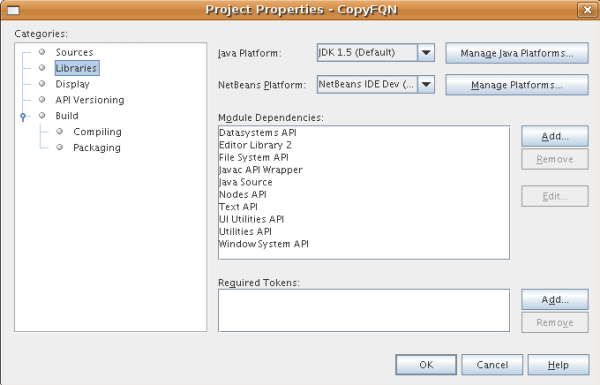
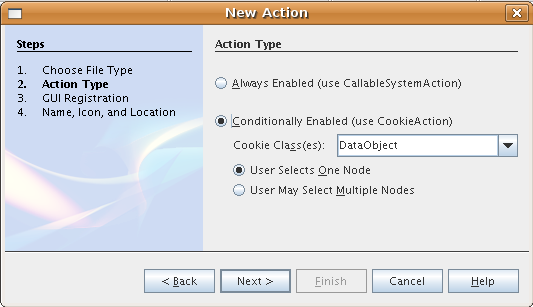
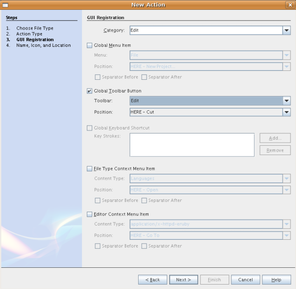
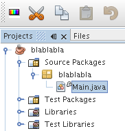
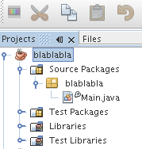
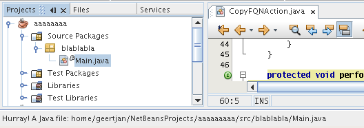
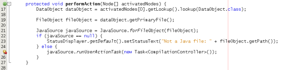
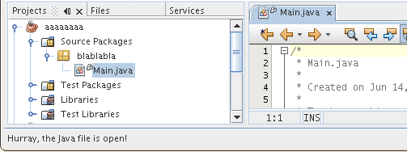
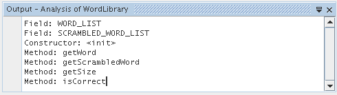
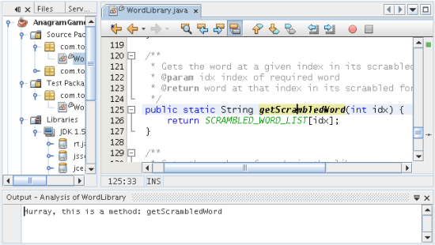

// 
//     Licensed to the Apache Software Foundation (ASF) under one
//     or more contributor license agreements.  See the NOTICE file
//     distributed with this work for additional information
//     regarding copyright ownership.  The ASF licenses this file
//     to you under the Apache License, Version 2.0 (the
//     "License"); you may not use this file except in compliance
//     with the License.  You may obtain a copy of the License at
// 
//       http://www.apache.org/licenses/LICENSE-2.0
// 
//     Unless required by applicable law or agreed to in writing,
//     software distributed under the License is distributed on an
//     "AS IS" BASIS, WITHOUT WARRANTIES OR CONDITIONS OF ANY
//     KIND, either express or implied.  See the License for the
//     specific language governing permissions and limitations
//     under the License.
//

= Руководство по инфраструктуре языка Java в среде NetBeans
:jbake-type: platform_tutorial
:jbake-tags: tutorials 
:jbake-status: published
:syntax: true
:source-highlighter: pygments
:toc: left
:toc-title:
:icons: font
:experimental:
:description: Руководство по инфраструктуре языка Java в среде NetBeans - Apache NetBeans
:keywords: Apache NetBeans Platform, Platform Tutorials, Руководство по инфраструктуре языка Java в среде NetBeans

В этом руководстве описываются аспекты новых интерфейсов API инфраструктуры "Retouche" в среде NetBeans 6.0, которые предоставляют доступ к редактору Java, предусмотренному в этой среде.

Дополнительно, в целях поиска и устранения ошибок, можно  link:http://plugins.netbeans.org/PluginPortal/faces/PluginDetailPage.jsp?pluginid=2753[загрузить готовые примеры] и изучить исходный код.

== Введение в инфраструктуру языка Java

До появления среды IDE NetBeans 6.0 инфраструктура языка Java, поддерживавшая редактор Java, включая создание и реорганизацию кода Java, была основана на так называемом "JMI для Java" (Java Metadata Interface – интерфейс метаданных Java), также известном как "MDR" (MetaData Repository – хранилище метаданных). В JMI для Java имелся ряд архитектурных проблем, например, блокировка для единственной операции чтения. Другими словами, блокировка применялась просто для чтения информации из модели, в то время как обычно она требуется только для записи. В течение нескольких лет проводилась отладка и улучшение производительности JMI. Еще одна проблема состояла в использовании внутренней копии синтаксического анализатора Java, что предполагало собственный подход к интерпретации исходного кода Java, который отличался от компилятора Java в JDK. После появления общих объектов в JDK 5, в результате чего в языке Java появились намного более сложные и тонкие конструкции, преодолеть это расхождение стало еще труднее. Поэтому из-за проблем с производительностью JMI и из-за того, что благодаря разработке формальной модели языка компилятор Java из JDK стал программно доступным средством, JMI для Java был заменен новым подходом, основанным на компиляторе Java из JDK.

Именно тогда появилась инфраструктура "Retouche" (французское слово, означающее "мелкий ремонт" или "доработку"). "Retouche" – это новая и быстрая инфраструктура языка Java в среде IDE NetBeans, способная к поддержке всех превосходных компонентов редактора Java, реализованных в среде NetBeans 6.0. Суть состоит в том, что "Retouche" обеспечивает обертку экземпляра компилятора Java в JDK и использует его артефакты, такие как абстрактное синтаксическое дерево (также известное как "AST") и разрешение символических ссылок, производимое на различных этапах процесса синтаксического анализа. При работе с "Retouche" необходимо иметь дело с некоторыми из этих артефактов. Одним из них, например, является  link:http://java.sun.com/javase/6/docs/jdk/api/javac/tree/index.html[интерфейс API дерева компиляции]. Пакеты классов в интерфейсе API дерева компиляции начинаются с  ``com.sun.*`` . Поэтому технически этот интерфейс не является интерфейсом API JDK, но фактически происходит из компилятора Java в JDK. Другим примером артефактов компилятора Java в JDK, используемых при работе с инфраструктурой "Retouche", является формальная модель языка в интерфейсах API в JDK, представленная пакетами  ``javax.language.model.*`` .

== Настройка модуля

Этот раздел посвящен созданию проекта модуля и настройке зависимостей от соответствующих модулей NetBeans с помощью программ-мастеров.

[start=1]
1. Выберите "File > New Project". В мастере создания проекта выберите "NetBeans Modules" в области "Categories" и "Module Project" в области "Projects", а затем нажмите кнопку "Next".

[start=2]
1. Введите  ``CopyFQN``  в поле "Project Name" и укажите соответствующую папку на диске в поле "Project Location". Выберите "Standalone Module" и "Set as Main Project", если эти параметры не выбраны. Нажмите кнопку "Next".

[start=3]
1. Введите  ``org.netbeans.modules.copyfqn``  в поле "Code Name Base" и  ``CopyFQN``  в поле "Module Display Name". Нажмите кнопку "Finish".

[start=4]
1. Щелкните проект правой кнопкой мыши, выберите "Properties", щелкните "Libraries" в диалоговом окне "Project Properties" и установите зависимость от следующих интерфейсов API:

* Datasystems API
* Editor Library 2
* File System API
* Javac API Wrapper
* Java Source
* Nodes API
* Text API
* UI Utilities API
* Utilities API
* Window System API

Экран должен выглядеть следующим образом:

Нажмите кнопку "OK".

== Создание контекстно-зависимой кнопки на панели инструментов

В этом разделе будет рассмотрено создание контекстно-зависимой кнопки на панели инструментов. Это не связано с новыми интерфейсами API инфраструктуры "Retouche", но позволяет создать элемент интерфейса пользователя для взаимодействия с нашей реализацией этих интерфейсов, описанных далее в настоящем руководстве.

[start=1]
1. Щелкните проект модуля правой кнопкой мыши, выберите "New > Other", затем выберите "Action" из категории "Module Development". Нажмите кнопку "Next".

[start=2]
1. Выберите "Conditionally Enabled" и сохраните все значения по умолчанию, как показано ниже. Действие должно зависеть от  ``DataObjects`` , и его выполнение должно быть возможно только при выборе какого-либо  ``DataObject`` .

Нажмите кнопку "Next".

[start=3]
1. Выберите "Edit" в поле "Category" и "Edit" в поле "Toolbar".

Экран должен выглядеть следующим образом:

Нажмите кнопку "Next".

[start=4]
1. Введите  ``CopyFQNAction``  в поле "Class Name" и  ``CopyFQN``  в поле "Display Name".

[start=5]
1. Найдите значок, который должен отображаться на кнопке панели инструментов. Например, выберите значок, который используется в этом руководстве:

image::images/copyfqn_icon.png[]

Нажмите кнопку "Finish".

В новом классе  ``CopyFQNAction.java``  должен быть представлен следующий код:

[source,java]
----

public final class CopyFQNAction extends CookieAction {
    
    protected void performAction(Node[] activatedNodes) {
        DataObject dataObject = activatedNodes[0].getLookup().lookup(org.openide.loaders.DataObject.class);
        // Добавить: использование dataObject
    }
    
    protected int mode() {
        return CookieAction.MODE_EXACTLY_ONE;
    }
    
    public String getName() {
        return NbBundle.getMessage(CopyFQNAction.class, "CTL_CopyFQNAction");
    }
    
    protected Class[] cookieClasses() {
        return new Class[] {
            DataObject.class
        };
    }
    
    protected String iconResource() {
        return "org/netbeans/modules/copyfqn/icon.png";
    }
    
    public HelpCtx getHelpCtx() {
        return HelpCtx.DEFAULT_HELP;
    }
    
    protected boolean asynchronous() {
        return false;
    }
    
}
----

NOTE:  В оставшейся части этого руководства описывается метод  ``performAction()`` .

Было создано действие, зависящее от объектов данных. Теперь выясним, что это означает.

[start=6]
1. Щелкните модуль правой кнопкой мыши и выберите "Install".

После установки модуля на панели инструментов должна появиться новая кнопка.

[start=7]
1. Выберите узел в окне "Projects" и проверьте кнопку на панели инструментов. При выборе узла, соответствующего файлу или папке (в том числе пакет), кнопка активна, как показано ниже:

Однако при выборе узла, соответствующего проекту, кнопка отключается, как показано ниже:

В следующем разделе будут рассмотрены не только различия между узлами проекта и узлами файла/папки, но и различия между узлами файлов для классов Java и всеми остальными видами узлов файлов.

== Идентификация исходных файлов Java

В этом разделе рассматривается использование одного из новых интерфейсов API инфраструктуры "Retouche", называемого  link:https://bits.netbeans.org/dev/javadoc/org-netbeans-modules-java-source/overview-summary.html[Java Source]. Здесь используется класс  link:https://bits.netbeans.org/dev/javadocorg-netbeans-modules-java-source/org/netbeans/api/java/source/JavaSource.html[JavaSource], представляющий исходный файл Java. Возвращается экземпляр этого класса для объекта файла, связанного с объектом данных. Если возвращается пустое значение, объект файла не является исходным файлом Java. При нажатии кнопки после выбора файла в строке состояния отображается результат.

[start=1]
1. Заполните метод  ``performAction()``  путем добавления строк, выделенных ниже:

[source,java]
----

protected void performAction(Node[] activatedNodes) {
    DataObject dataObject = activatedNodes[0].getLookup().lookup(org.openide.loaders.DataObject.class);
    // Добавить: использование dataObject

    *FileObject fileObject = dataObject.getPrimaryFile();

link:https://bits.netbeans.org/dev/javadoc/org-netbeans-modules-java-source/org/netbeans/api/java/source/JavaSource.html[JavaSource] javaSource =  link:https://bits.netbeans.org/dev/javadocorg-netbeans-modules-java-source/org/netbeans/api/java/source/JavaSource.html#forFileObject(org.openide.filesystems.FileObject)[JavaSource.forFileObject(fileObject)];
    if (javaSource == null) {
        StatusDisplayer.getDefault().setStatusText("Not a Java file: " + fileObject.getPath());
    } else {
        StatusDisplayer.getDefault().setStatusText("Hurray! A Java file: " + fileObject.getPath());
    }*
}
----

[start=2]
1. Проверьте, что используются следующие операторы импорта:

[source,java]
----

import org.netbeans.api.java.source.JavaSource;
import org.openide.awt.StatusDisplayer;
import org.openide.filesystems.FileObject;
import org.openide.loaders.DataObject;
import org.openide.nodes.Node;
import org.openide.util.HelpCtx;
import org.openide.util.NbBundle;
import org.openide.util.actions.CookieAction;
----

[start=3]
1. Установите модуль еще раз.

[start=4]
1. Выберите узел файла и нажмите кнопку.

Обратите внимание, что сообщение "Hurray!" появляется только при выборе файла Java, как показано ниже:

Альтернативный подход заключается во _включении кнопки только при выборе файла Java_. Для этого необходимо переопределить метод  ``CookieAction.enable()``  следующим образом:

[source,java]
----

@Override
protected boolean enable(Node[] activatedNodes) {
    if (super.enable(activatedNodes)) {
        DataObject dataObject = activatedNodes[0].getLookup().lookup(org.openide.loaders.DataObject.class);
        FileObject fileObject = dataObject.getPrimaryFile();
        JavaSource javaSource = JavaSource.forFileObject(fileObject);
        if (javaSource == null) {
            return false;
        }
        return true;
    }
    return false;
}
----

Показанный выше метод отфильтровывает любой файл, _не_ являющийся файлом Java. В результате кнопка включается только тогда, когда текущий файл является файлом Java.

== Определение состояния открытия

В этом разделе мы обратимся к нашей первой явно вызываемой задаче в инфраструктуре "Retouche". Такая задача представлена методом  ``runUserActionTask``  класса JavaSource. Задача этого вида позволяет управлять этапами процесса синтаксического анализа и применяется при необходимости немедленной реакции на пользовательский ввод. Все действия задачи выполняются единым блоком. В данном случае необходимо, чтобы действие, представленное кнопкой на панели инструментов, немедленно сопровождалось появлением текста в строке состояния.

[start=1]
1. Замените сообщение "Hurray!" в методе  ``performAction()``  следующей строкой: link:http://bits.netbeans.org/dev/javadoc/org-netbeans-modules-java-source/org/netbeans/api/java/source/JavaSource.html#runUserActionTask(org.netbeans.api.java.source.Task,%20boolean)[javaSource.runUserActionTask]

[source,java]
----

(new  link:http://bits.netbeans.org/dev/javadoc/org-netbeans-modules-java-source/org/netbeans/api/java/source/Task.html[Task]< link:https://bits.netbeans.org/dev/javadoc/org-netbeans-modules-java-source/org/netbeans/api/java/source/CompilationController.html[CompilationController]>());
----

Теперь в левом столбце редактора должен появиться значок лампочки, показанный ниже:

[start=2]
1. Щелкните значок лампочки. В качестве альтернативы можно установить курсор на строку и нажать Alt-Enter. Теперь позволим среде IDE реализовать метод.

[start=3]
1. Незначительно измените метод путем добавления в его конец логической переменной  ``true`` . Среда IDE перенесет фрагмент в блок try/catch. Конечный результат должен выглядеть следующим образом:

[source,java]
----

protected void performAction(Node[] activatedNodes) {
    DataObject dataObject = activatedNodes[0].getLookup().lookup(org.openide.loaders.DataObject.class);
    // Добавить: использование dataObject

    FileObject fileObject = dataObject.getPrimaryFile();

    JavaSource javaSource = JavaSource.forFileObject(fileObject);
    if (javaSource == null) {
        StatusDisplayer.getDefault().setStatusText("Not a Java file: " + fileObject.getPath());
     } else {
     
            *try {
                javaSource.runUserActionTask(new Task<CompilationController>() {

                    public void run(CompilationController arg0) throws Exception {
                        throw new UnsupportedOperationException("Not supported yet.");
                    }
                }, true);
            } catch (IOException ex) {
                Exceptions.printStackTrace(ex);
            }*
            
     }

}
----

[start=4]
1. Реализуйте метод  ``run()``  следующим образом:

[source,java]
----

public void run(CompilationController compilationController) throws Exception {
     
link:https://bits.netbeans.org/dev/javadoc/org-netbeans-modules-java-source/org/netbeans/api/java/source/CompilationController.html#toPhase(org.netbeans.api.java.source.JavaSource.Phase)[compilationController.toPhase(Phase.ELEMENTS_RESOLVED)];
      
link:https://docs.oracle.com/javase/1.5.0/docs/api/javax/swing/text/Document.html[Document] document =  link:https://bits.netbeans.org/dev/javadoc/org-netbeans-modules-java-source/org/netbeans/api/java/source/CompilationController.html#getDocument()[compilationController.getDocument()];
      if (document != null) {
         StatusDisplayer.getDefault().setStatusText("Hurray, the Java file is open!");
      } else {
         StatusDisplayer.getDefault().setStatusText("The Java file is closed!");
      }
      
}
----

[start=5]
1. Проверьте, что используются следующие операторы импорта:

[source,java]
----

import java.io.IOException;
import javax.swing.text.Document;
import org.netbeans.api.java.source.CompilationController;
import org.netbeans.api.java.source.JavaSource;
import org.netbeans.api.java.source.JavaSource.Phase;
import org.netbeans.api.java.source.Task;
import org.openide.awt.StatusDisplayer;
import org.openide.filesystems.FileObject;
import org.openide.loaders.DataObject;
import org.openide.nodes.Node;
import org.openide.util.Exceptions;
import org.openide.util.HelpCtx;
import org.openide.util.NbBundle;
import org.openide.util.actions.CookieAction;
----

[start=6]
1. Установите модуль еще раз.

[start=7]
1. Выберите узел файла и нажмите кнопку.

Обратите внимание, что сообщение "Hurray!" появляется только при выборе файла Java, открытого в редакторе Java (см. ниже):

== Обнаружение элемента под курсором

В этом разделе, зная, что мы имеем дело с открытым файлом Java, можно приступить к обнаружению типа элемента, находящегося под курсором в любой определенный период времени.

[start=1]
1. Начните с объявления зависимости от интерфейсов API ввода/вывода, чтобы результаты выводились в окне "Output".

[start=2]
1. Замените сообщение "Hurray!" в методе  ``run()``  выделенными строками, как показано ниже:

[source,java]
----

public void run(CompilationController compilationController) throws Exception {
    
    compilationController.toPhase(Phase.ELEMENTS_RESOLVED);
    Document document = compilationController.getDocument();
    
    if (document != null) {
        *new MemberVisitor(compilationController).scan(compilationController.getCompilationUnit(), null);*
    } else {
        StatusDisplayer.getDefault().setStatusText("The Java file is closed!");
    }
    
}
----

[start=3]
1. Здесь представлен класс  ``MemberVisitor`` , определенный как внутренний класс класса  ``CopyFQNAction`` :

[source,java]
----

private static class MemberVisitor extends TreePathScanner<Void, Void> {

    private CompilationInfo info;

    public MemberVisitor(CompilationInfo info) {
        this.info = info;
    }

    @Override
    public Void visitClass(ClassTree t, Void v) {
        Element el = info.getTrees().getElement(getCurrentPath());
        if (el == null) {
            StatusDisplayer.getDefault().setStatusText("Cannot resolve class!");
        } else {
            TypeElement te = (TypeElement) el;
            List enclosedElements = te.getEnclosedElements();
            InputOutput io = IOProvider.getDefault().getIO("Analysis of "  
                        + info.getFileObject().getName(), true);
            for (int i = 0; i < enclosedElements.size(); i++) {
            Element enclosedElement = (Element) enclosedElements.get(i);
                if (enclosedElement.getKind() == ElementKind.CONSTRUCTOR) {
                    io.getOut().println("Constructor: " 
                        + enclosedElement.getSimpleName());
                } else if (enclosedElement.getKind() == ElementKind.METHOD) {
                    io.getOut().println("Method: " 
                        + enclosedElement.getSimpleName());
                } else if (enclosedElement.getKind() == ElementKind.FIELD) {
                    io.getOut().println("Field: " 
                        + enclosedElement.getSimpleName());
                } else {
                    io.getOut().println("Other: " 
                        + enclosedElement.getSimpleName());
                }
            }
            io.getOut().close();
        }
        return null;
    }

}
----

[start=4]
1. Установите модуль еще раз и откройте класс Java. Затем нажмите кнопку и обратите внимание на то, что конструкторы, методы и поля отображаются в окне "Output", как показано ниже:

[start=5]
1. Затем вместо того, чтобы выводить все элементы в окне "Output", выведем в это окно только тот элемент, на котором установлен курсор. Просто замените метод  ``visitClass``  выделенным кодом, показанным ниже:

[source,java]
----

private static class MemberVisitor extends TreePathScanner<Void, Void> {

    private CompilationInfo info;

    public MemberVisitor(CompilationInfo info) {
        this.info = info;
    }

    *@Override
    public Void visitClass(ClassTree t, Void v) {
        try {
            JTextComponent editor = EditorRegistry.lastFocusedComponent();
            if (editor.getDocument() == info.getDocument()) {
                int dot = editor.getCaret().getDot();
                TreePath tp = info.getTreeUtilities().pathFor(dot);
                Element el = info.getTrees().getElement(tp);
                if (el == null) {
                    StatusDisplayer.getDefault().setStatusText("Cannot resolve class!");
                } else {
                    InputOutput io = IOProvider.getDefault().getIO("Analysis of " 
                            + info.getFileObject().getName(), true);
                    if (el.getKind() == ElementKind.CONSTRUCTOR) {
                        io.getOut().println("Hurray, this is a constructor: " 
                            + el.getSimpleName());
                    } else if (el.getKind() == ElementKind.METHOD) {
                        io.getOut().println("Hurray, this is a method: " 
                            + el.getSimpleName());
                    } else if (el.getKind() == ElementKind.FIELD) {
                        io.getOut().println("Hurray, this is a field: " 
                            + el.getSimpleName());
                    } else {
                        io.getOut().println("Hurray, this is something else: " 
                            + el.getSimpleName());
                    }
                    io.getOut().close();
                }
            }
        } catch (IOException ex) {
            Exceptions.printStackTrace(ex);
        }
        return null;
    }*

}
----

[start=6]
1. Установите модуль.

[start=7]
1. Установите курсор в любом месте кода Java и нажмите кнопку. В окне "Output" появится информация о коде под курсором (если применимо). Например, при нажатии кнопки после помещения курсора на метод, как показано ниже, в окне "Output" сообщается, что курсор установлен на данном методе:

[start=8]
1. Однако в это окно можно вывести гораздо больше информации, чем название элемента под курсором. В методе  ``visitClass``  замените выделенные полужирным строки, показанные ниже:

[source,java]
----

@Override
public Void visitClass(ClassTree t, Void v) {
    try {
        JTextComponent editor = EditorRegistry.lastFocusedComponent();
        if (editor.getDocument() == info.getDocument()) {
            int dot = editor.getCaret().getDot();
            TreePath tp = info.getTreeUtilities().pathFor(dot);
            Element el = info.getTrees().getElement(tp);
            if (el == null) {
                StatusDisplayer.getDefault().setStatusText("Cannot resolve class!");
            } else {
                InputOutput io = IOProvider.getDefault().getIO("Analysis of " 
                    + info.getFileObject().getName(), true);
                *String te = null;
                if (el.getKind() == ElementKind.CONSTRUCTOR) {
                    te = ((TypeElement) ((ExecutableElement) el).getEnclosingElement()).getQualifiedName().toString();
                    io.getOut().println("Hurray, this is a constructor's qualified name: " + te);
                } else if (el.getKind() == ElementKind.METHOD) {
                    te = ((ExecutableElement) el).getReturnType().toString();
                    io.getOut().println("Hurray, this is a method's return type: " + te);
                } else if (el.getKind() == ElementKind.FIELD) {
                    te = ((VariableElement) el).asType().toString();
                    io.getOut().println("Hurray, this is a field's type: " + te);
                }* else {
                    io.getOut().println("Hurray, this is something else: " 
                        + el.getSimpleName());
                }
                io.getOut().close();
            }
        }
    } catch (IOException ex) {
        Exceptions.printStackTrace(ex);
    }
    return null;
}
----

[start=9]
1. Установите модуль еще раз. На этот раз после нажатия кнопки при условии, что курсор находится на конструкторе, методе или поле, в окне "Output" отображается более подробная информация об этом элементе.

На данном этапе можно определить, является ли текущий файл файлом Java, открыт ли документ и к какому типу относится элемент под курсором. Как можно использовать эту информацию? В следующем разделе представлен простой сценарий, при работе с которым приобретенное знание окажется полезным.

== Применение на практике

В этом разделе описано определение содержимого буфера обмена, представленного  ``java.awt.datatransfer.Clipboard`` , в соответствии с элементом под курсором. При нажатии кнопки элемент под курсором помещается в буфер обмена, после чего его можно переместить в другое место кода.

[start=1]
1. Сначала необходимо объявить буфер обмена и определить конструктор:

[source,java]
----

private Clipboard clipboard;

public CopyFQNAction() {
    clipboard = Lookup.getDefault().lookup(ExClipboard.class);
    if (clipboard == null) {
        clipboard = Toolkit.getDefaultToolkit().getSystemClipboard();
    }
}
----

[start=2]
1. Затем замените каждую строку "Hurray!" в коде строкой, передающей элемент в качестве строки методу, который будет определен на следующем этапе. Дадим методу имя  ``setClipboardContents`` . Затем, например, замените первую строку "Hurray!" на следующую:

[source,java]
----

setClipboardContents(te);
----

Выполните аналогичные операции для других строк "Hurray!", убедившись в том, что в метод была передана корректная строка.

NOTE:  Поскольку метод  ``setClipboardContents``  еще не определен, каждая из добавляемых на этом этапе строк подчеркивается красным цветом. На следующем этапе мы добавим новый метод.

[start=3]
1. Добавьте следующий код (вплоть до конца класса). Этот метод получает строку и помещает ее в буфер обмена:

[source,java]
----

private void setClipboardContents(String content) {
    if (clipboard != null) {
        if (content == null) {
            StatusDisplayer.getDefault().setStatusText("");
            clipboard.setContents(null, null);
        } else {
            StatusDisplayer.getDefault().setStatusText("Clipboard: " + content);
            clipboard.setContents(new StringSelection(content), null);
        }
    }
}
----

link:http://netbeans.apache.org/community/mailing-lists.html[Мы ждем ваших отзывов]

== Дополнительная информация

Для получения дополнительной информации о создании и разработке модуля NetBeans см. следующие материалы:

*  link:http://wiki.netbeans.org/Java_DevelopersGuide[Руководство разработчика Java]
*  link:http://wiki.netbeans.org/RetoucheDeveloperFAQ[Часто задаваемые вопросы по разработке в инфраструктуре "Retouche" ]
*  link:https://netbeans.apache.org/kb/docs/platform.html[Другие связанные руководства]
*  link:https://bits.netbeans.org/dev/javadoc/[Документация Javadoc по интерфейсам API в среде NetBeans]
