// 
//     Licensed to the Apache Software Foundation (ASF) under one
//     or more contributor license agreements.  See the NOTICE file
//     distributed with this work for additional information
//     regarding copyright ownership.  The ASF licenses this file
//     to you under the Apache License, Version 2.0 (the
//     "License"); you may not use this file except in compliance
//     with the License.  You may obtain a copy of the License at
// 
//       http://www.apache.org/licenses/LICENSE-2.0
// 
//     Unless required by applicable law or agreed to in writing,
//     software distributed under the License is distributed on an
//     "AS IS" BASIS, WITHOUT WARRANTIES OR CONDITIONS OF ANY
//     KIND, either express or implied.  See the License for the
//     specific language governing permissions and limitations
//     under the License.
//

= Tutorial do Feed Reader para a Plataforma NetBeans
:jbake-type: platform_tutorial
:jbake-tags: tutorials 
:jbake-status: published
:syntax: true
:source-highlighter: pygments
:toc: left
:toc-title:
:icons: font
:experimental:
:description: Tutorial do Feed Reader para a Plataforma NetBeans - Apache NetBeans
:keywords: Apache NetBeans Platform, Platform Tutorials, Tutorial do Feed Reader para a Plataforma NetBeans

Bem-vindo ao tutorial do Feed Reader para a Plataforma NetBeans. O Feed Reader construído neste tutorial é um simples navegador RSS/Atom feed, modelado de acordo com o plug-in Sage para Mozilla Firefox. Ele apresenta uma árvore de feeds com subnós representando entradas individuais de feeds que podem ser abertas em um navegador.

Para ilustrar o resultado final, aqui você vê o Feed Reader que será construído neste tutorial, exibindo uma entrada de feed do  link:https://netbeans.org/rss-091.xml[feed Destaques do NetBeans]:

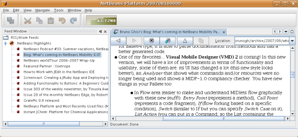

==  Conhecimento de pré-requisito

Você não precisa ter qualquer conhecimento sobre desenvolvimento da Plataforma NetBeans para trabalhar neste tutorial. Pode ser útil se você tiver algum conhecimento sobre programação Java, embora isso não seja essencial. Entretanto, a leitura dos seguintes documentos antes de iniciar este tutorial pode ser útil, para fornecer informações de suporte:

*  link:https://netbeans.apache.org/tutorials/60/nbm-feedreader_background.html[Preparando para criar o aplicativo FeedReader]. Este documento fornece o plano de fundo deste tutorial. Ele o conduz por tudo que será feito neste tutorial, conceitualmente. Ele também mostra onde encontrar o código-fonte da amostra construída neste tutorial.
*  link:../61/nbm-htmleditor_pt_BR.html[NetBeans Platform Quick Start]. Este tutorial breve fornece orientação através de um processo completo de criação de um aplicativo de cliente avançado sobre a Plataforma NetBeans. As principais ferramentas e os estágios de desenvolvimento são abordados, e o Editor de HTML é o resultado do tutorial.

==  Configurando a aplicação

No NetBeans IDE, a construção de um aplicativo sobre a Plataforma NetBeans começa com a criação de vários arquivos que irão servir como base para o aplicativo. Por exemplo, o IDE fornece um Assistente de projeto de módulo, um Assistente de projeto de suíte de módulos e um Assistente de projeto de módulo de wrapper de bibliotecas que configuram todos os arquivos básicos que os módulos e aplicativos construídos na Plataforma NetBeans precisam.

* *Projeto de suíte de módulos.* Um projeto que agrupa um conjunto de projetos de módulos e projetos de módulo de wrapper de bibliotecas que possuem dependências entre eles, e permite que você implante-os juntos como uma unidade.
* *Projeto de módulo de wrapper de bibliotecas.* Um projeto que coloca um arquivo JAR de biblioteca no seu classpath e exporta alguns ou todos os pacotes do arquivo JAR do módulo como pacotes públicos.
* *Projeto de módulo.* Um projeto para implementar a funcionalidade, lógica comercial e a interface do usuário de um módulo ou aplicativo construído na Plataforma NetBeans.

=== Criando o projeto de suíte de módulos

[start=1]
1. Escolha Arquivo > Novo projeto (Ctrl-Shift-N). Em Categorias, selecione Módulos do NetBeans. Em Projetos, selecione Projeto de suíte de módulos. Você deve ver o seguinte:

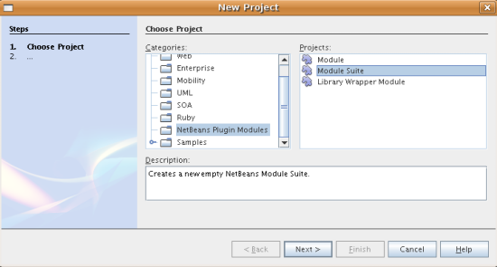

Clique em Próximo.

[start=2]
1. No painel Nome e localização, digite  `` feedreader-suite``  em Nome do projeto. Altere Local do projeto para qualquer diretório no computador. Agora você deve ver o seguinte:

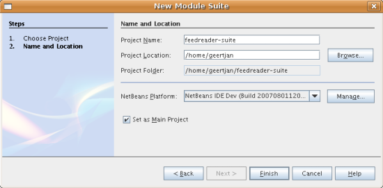

Clique em Terminar.

O IDE cria o projeto  `` feedreader-suite`` , que tem a seguinte aparência na janela Projetos:

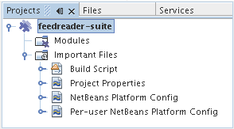

O projeto conterá o projeto de módulo e os projetos de módulo de wrapper de bibliotecas que você criará nas seguintes subseções.

=== Empacotando as bibliotecas

Você pode empacotar todo o aplicativo Feed Reader em um único módulo. Entretanto, o aplicativo precisa das bibliotecas Rome, Rome Fetcher e JDom:

* *Rome.* Lê RSS e Atom feeds, usando uma API muito simples.
* *Rome Fetcher.* Permite a recuperação de feeds via HTTP.
* *JDom.* É uma API de análise de XML. O Feed Reader só precisará dela porque ela é utilizada pela biblioteca Rome.

Posteriormente, se você desejar estender o aplicativo Feed Reader com mais módulos que possam usar estas bibliotecas, seria bom que eles dependessem somente dos módulos de biblioteca, e não de todo o Feed Reader. Além disso, os módulos de biblioteca podem ser de "carregamento automático", o que significa que o NetBeans só os carregará quando necessário. Até que isso aconteça, ele não utilizará nenhuma memória em tempo de execução.

[start=1]
1. Clique com o botão direito do mouse no nó Módulos no projeto de suíte de módulos na janela Projetos, conforme mostrado abaixo, e clique em Adicionar nova biblioteca:

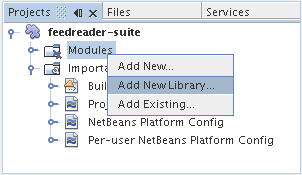

Quando você fizer isso, deve ver o seguinte:

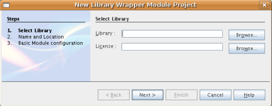

[start=2]
1. No painel Selecionar biblioteca, mostrado acima, vá até a pasta onde baixou JDom e selecione  `` jdom.jar``  e  `` LICENSE.txt.``  Clique em Próximo.

[start=3]
1. No painel Nome e localização, aceite todos os padrões. Você deve ver o seguinte:

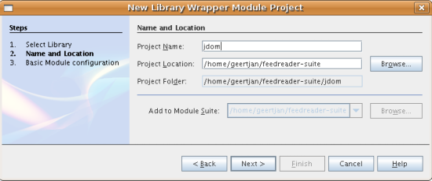

*Observação:* o projeto de módulo de wrapper de bibliotecas será armazenado no projeto de suíte de módulos. Você também poderia armazená-lo em outro lugar, mas por questões de versionamento, é melhor colocá-lo no projeto de suíte de módulos. Por isso, o projeto de suíte de módulos  `` feedreader-suite``  é selecionado na lista suspensa Adicionar à suíte de módulos.

Clique em Próximo.

[start=4]
1. No painel Configuração básica de módulos, aceite todos os padrões. Você deve ver o seguinte:

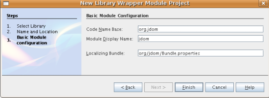

Clique em Terminar.

O novo projeto de módulo de wrapper de bibliotecas é aberto no IDE e exibido na janela Projetos. Agora você deve ver o seguinte na janela Projetos:

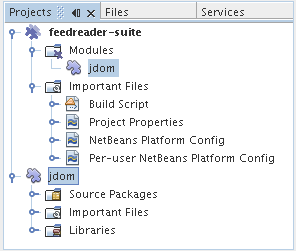

[start=5]
1. Retorne para a etapa 1 desta seção e crie um projeto de módulo de wrapper de bibliotecas para Rome. Aceite todos os padrões.

[start=6]
1. Retorne para a etapa 1 desta seção e crie um projeto de módulo de wrapper de bibliotecas para Rome Fetcher. Aceite todos os padrões.

Você agora possui um projeto de suíte de módulos, com três projetos de módulo de wrapper de bibliotecas, fornecendo muitas classes Javas úteis que você poderá utilizar ao longo de todo este tutorial.

=== Criando o projeto do módulo

Nesta seção, criaremos um projeto para a funcionalidade que o seu aplicativo fornecerá. O projeto utilizará as classes disponibilizadas pelos módulos de wrapper de bibliotecas criados na seção anterior.

[start=1]
1. Clique com o botão direito do mouse no nó Módulos no projeto de suíte de módulos na janela Projetos, conforme mostrado abaixo, e clique em Adicionar novo:

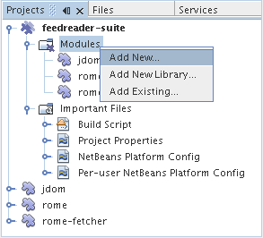

Quando você fizer isso, deve ver o seguinte:

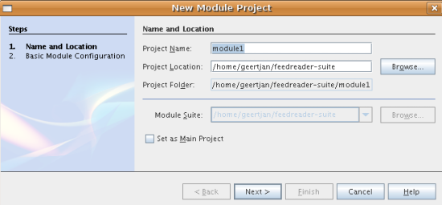

[start=2]
1. No painel Nome e localização, digite  `` FeedReader``  em Nome do projeto. Aceite todos os padrões. Clique em Próximo.

[start=3]
1. No painel Configuração básica de módulos, substitua  `` yourorghere``  em Nome base de código por  `` myorg``  , de maneira que o nome base de código inteiro seja  `` org.myorg.feedreader.``  Digite  ``FeedReader``  in Module Display Name. Deixe o local do pacote de localização e a camada XML, para que sejam armazenados em um pacote com o nome  `` org/myorg/feedreader.``  Agora você deve ver o seguinte:

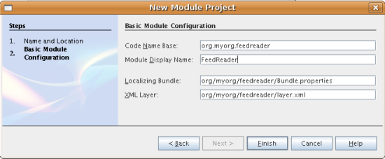

Clique em Terminar.

O IDE cria o projeto FeedReader. O projeto contém todos os metadados de projeto e códigos-fonte do módulo, como o script de construção Ant do projeto. O projeto se abre no IDE. Você pode ver a estrutura lógica na janela Projetos (Ctrl-1) e a estrutura de arquivos na janela Arquivos (Ctrl+2). A janela Projetos agora deve mostrar o seguinte:

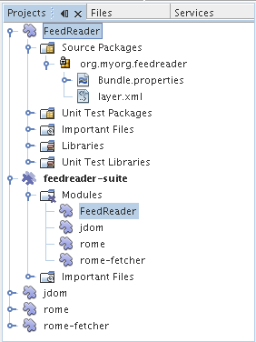

Você criou a estrutura do código-fonte do novo aplicativo. Na próxima seção, começaremos adicionando algum código.

==  Criando a janela Feed Reader

Nesta seção, você usará o Assistente de componente de janela para gerar arquivos que criam um componente de janela personalizado e uma ação para chamá-lo. O assistente também registra a ação como um item de menu no arquivo de configuração  `` layer.xml ``  e adiciona entradas para serializar o componente de janela. Logo após o término desta seção, você saberá como testar os arquivos que o Assistente de componente de janela gera para você.

[start=1]
1. Clique com o botão direito do mouse no nó do projeto  `` FeedReader``  e escolha Novo > Outro. Em Categorias, selecione Desenvolvimento de módulo. Em Tipos de arquivos, selecione Componente de janela, conforme mostrado abaixo:

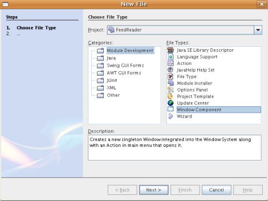

Clique em Próximo.

[start=2]
1. No painel Configurações básicas, selecione  ``explorer``  na lista suspensa e clique em Abrir na inicialização do aplicativo, conforme mostrado abaixo:

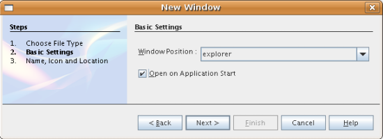

Clique em Próximo.

[start=3]
1. No painel Nome e localização, digite Feed como o Prefixo do nome da classe e vá até o local onde o arquivo  ``rss16.gif (
image::images/feedreader_rss16.gif[]) foi salvo.``  O arquivo GIF será mostrado no item de menu que chama a ação. Agora você deve ver o seguinte:

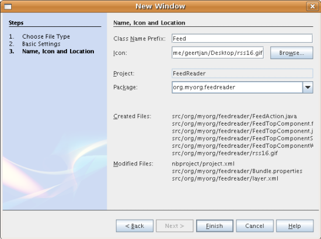

Clique em Terminar.

O seguinte é mostrado agora na janela Projetos:

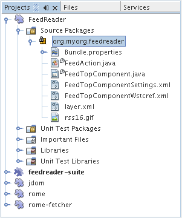

O IDE criou os novos arquivos a seguir:

*  `` FeedAction.java.``  Defina a ação que aparece no menu Janela com o rótulo Abrir janela de feed e a imagem  `` rss16.gif``  (
image::images/feedreader_rss16.gif[]). Ele abre a janela Feed.
*  `` FeedTopComponent.java.``  Define a janela Feed.
*  `` FeedTopComponentSettings.xml.``  Especifica todas as interfaces do aplicativo rich-client  `` org.myorg.feedreader`` . Possibilita a pesquisa fácil de instâncias, sem a necessidade de instanciar cada uma. Evita a necessidade de carregar classes ou criar objetos e, portanto, aumenta o desempenho. Registrado na pasta  ``Windows2/Components``  do arquivo  ``layer.xml`` .
*  `` FeedTopComponentWstcref.xml.``  Especifica uma referência ao componente. Permite que o componente pertença a mais de um modo. Registrado na pasta  ``Windows2/Modes``  do arquivo  ``layer.xml`` .

O IDE modificou os arquivos existentes a seguir:

* * * 
 `` project.xml.``  Duas dependências de módulo foram adicionadas,  `` API de utilitários ``  (clique  link:http://bits.netbeans.org/dev/javadoc/org-openide-util/overview-summary.html[aqui ] para Javadoc) e  `` API do sistema Window ``  (clique  link:http://bits.netbeans.org/dev/javadoc/org-openide-windows/overview-summary.html[aqui] para Javadoc).
*  `` Bundle.properties.``  
 Três pares de chave-valor foram adicionados:
*  ``CTL_FeedAction.``  Localiza o rótulo do item de menu, definido em  ``FeedAction.java`` .
*  ``CTL_FeedTopComponent.``  Localiza o rótulo de  ``FeedTopComponent.java`` .
*  ``HINT_FeedTopComponent.``  Localiza a dica de ferramenta de  ``FeedTopComponent.java`` .

Finalmente, três entradas de registro foram adicionadas ao arquivo  ``layer.xml`` .

Isto é o que as entradas no arquivo  `` layer.xml``  fazem:

*  `` <Ações>``  
Registra a ação como uma ação na pasta Janela.
*  `` <Menu>``  
Registra a ação como um item de menu no menu Janela.
*  `` <Windows2> ``  Registra o arquivo  ``FeedTopComponentSettings.xml`` , que é usado para pesquisar o componente de janela. Registra o arquivo de referência do componente  ``FeedTopComponentWstcref.xml``  na área do "explorer". 

==  Executando a aplicação

Sem ter digitado uma única linha de código, ainda é possível fazer um teste com o aplicativo. Testar significa implantar os módulos na Plataforma NetBeans e depois verificar se a janela Feed vazia é exibida corretamente.

[start=1]
1. Vamos primeiro remover todos os módulos que definem o NetBeans IDE, mas que não serão necessários no aplicativo Feed Reader. Clique com o botão direito do mouse no projeto  ``feedreader-suite`` , escolha Propriedades e clique em Bibliotecas na caixa de diálogo Propriedades do projeto.

É mostrada uma lista de 'grupos'. Cada cluster é um conjunto de módulos relacionados. O único cluster que precisaremos será o de plataforma. Assim, desmarque todos os outros, até que somente o de plataforma esteja selecionado:

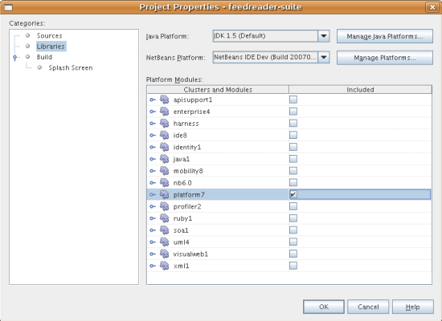

Expanda o cluster de plataforma e navegue através dos módulos fornecidos:

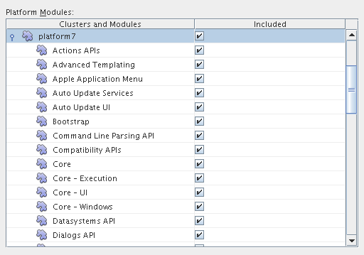

Os módulos da plataforma fornecem a infra-estrutura comum de aplicativos Swing. Assim, como nós incluímos o cluster de plataforma, não será necessário criar o código 'básico' para a infra-estrutura do aplicativo, como a barra de menu, o sistema de janelas e a funcionalidade de inicialização.

Clique em OK.

[start=2]
1. Na janela Projetos, clique com o botão direito do mouse no nó do projeto  `` feedreader-suite``  e escolha Limpar e construir tudo.

[start=3]
1. Na janela Projetos, clique com o botão direito do mouse no projeto  ``feedreader-suite``  e escolha Executar, conforme mostrado abaixo:

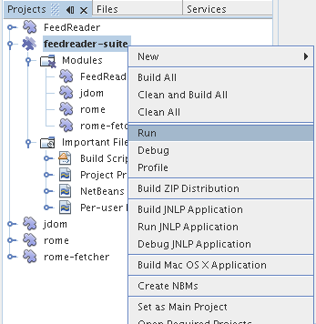

O aplicativo é iniciado. Você vê uma tela de abertura. Em seguida, o aplicativo é aberto e exibe a nova janela Feed, como uma janela do explorer, como mostrado abaixo:

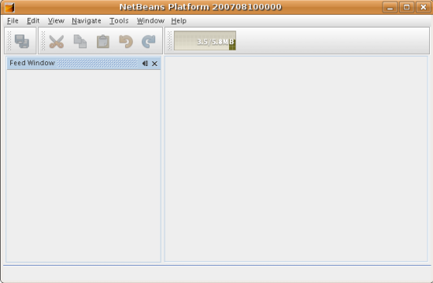

*Observação:* o que você possui agora é um aplicativo que consiste nos seguintes módulos:

* Os módulos fornecidos pela Plataforma NetBeans, para inicialização do aplicativo, gerenciamento do ciclo de vida e outros processos relacionados à infra-estrutura.
* Os três módulos de wrapper de bibliotecas criados neste tutorial.
* O módulo da funcionalidade FeedReader criado neste tutorial, para fornecer a janela Feed.

No menu Janela do aplicativo, você verá o novo item de menu, que pode ser usado para abrir a janela Feed, caso ela esteja fechada, conforme mostrado abaixo:

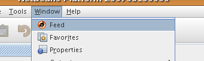

Como você pode ver, sem ter feito qualquer código, temos um aplicativo completo. Ainda não é muita coisa, mas a infra-estrutura já existe e funciona como esperado. Em seguida, começaremos a usar algumas das APIs do NetBeans para adicionar código ao aplicativo.

== Adicionando o código ao aplicativo

Agora que a base do aplicativo está pronta, é hora de começar a adicionar seu próprio código. Antes de fazer isso, especifique as dependências do aplicativo. As dependências são módulos que fornecem as APIs do NetBeans que você irá estender ou implementar. Em seguida, use o Assistente de novo arquivo e o Editor de código-fonte para criar e codificar as classes que compõem o aplicativo Feed Reader.

=== Especificando as dependências do aplicativo

Você precisa criar subclasses de várias classes que pertencem às APIs do NetBeans. As classes pertencem a módulos que precisam ser declarados como dependências do aplicativo Feed Reader. Use a caixa de diálogo Propriedades do projeto para isso, conforme explicado nas etapas abaixo.

[start=1]
1. Na janela Projetos, clique com o botão direito do mouse no projeto  `` FeedReader``  e escolha Propriedades. Na caixa de diálogo Propriedades do projeto, clique em Bibliotecas. Observe que algumas APIs já foram declaradas como Dependências do módulo, como mostrado abaixo:

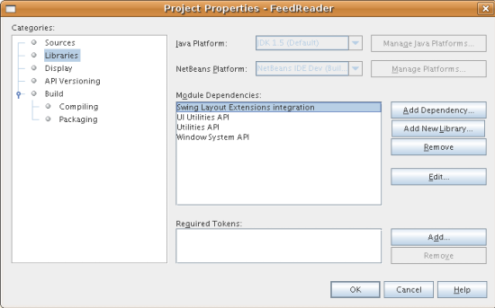

Os registros de biblioteca acima foram feitos por você pelo Assistente de componente de janela, anteriormente neste tutorial.

[start=2]
1. Clique em Adicionar dependência.

[start=3]
1. Adicione as seguintes APIs:

[source,java]
----

Actions API
Datasystems API
Dialogs API
Explorer and Property Sheet API
File System API
Nodes API
rome
rome-fetcher
----

Agora você deve ver o seguinte:

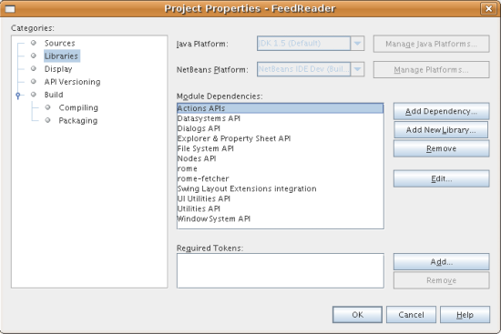

Clique em OK para sair da caixa de diálogo Propriedades do projeto.

[start=4]
1. Expanda o nó Bibliotecas do projeto  ``FeedReader``  e observe a lista de módulos que estão disponíveis para este projeto:

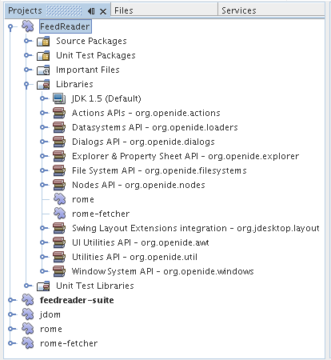

=== Definindo dependências entre módulos do wrapper de biblioteca

Agora que definimos as dependências nos módulos de APIs do NetBeans que iremos usar, vamos definir também as dependências entre os módulos de wrapper de bibliotecas. Por exemplo, o JAR de Rome utiliza as classes do JAR de JDom. Agora que eles estão dispostos em módulos de wrapper de biblioteca separados, é necessário especificar a relação entre os JARs através da caixa de diálogo Propriedades do projeto de módulo de wrapper de bibliotecas.

[start=1]
1. Primeiro, vamos tornar Rome dependente de JDom. Clique com o botão direito do mouse no projeto de módulo de wrapper da biblioteca Rome na janela Projetos e escolha Propriedades. Na caixa de diálogo Propriedades do projeto, clique em Bibliotecas e, em seguida, em Adicionar dependência. Adicionar  ``jdom`` . Agora você deve ver o seguinte:

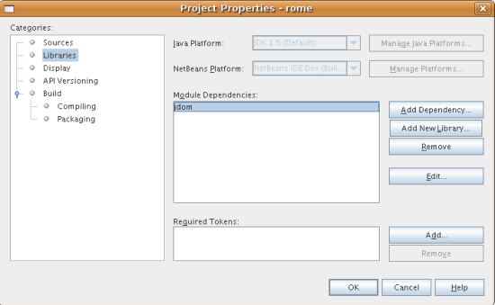

Clique em OK para sair da caixa de diálogo Propriedades do projeto.

[start=2]
1. Finalmente, como Rome Fetcher depende de Rome e JDom, você precisa tornar Rome Fetcher dependente de Rome, como mostrado abaixo:

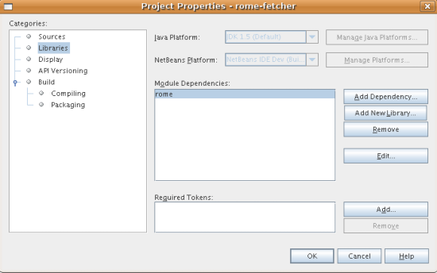

Como Rome já depende de JDom, não é necessário tornar Rome Fetcher dependente de JDom.

=== Criando a pasta RssFeeds

Você usará a interface do usuário do IDE para adicionar uma pasta ao arquivo  ``layer.xml`` . A pasta conterá os objetos RSS feed. Posteriormente, você adicionará código ao  `` FeedTopComponent.java`` , que foi criado por você pelo Assistente de componente de janela, para exibir o conteúdo desta pasta.

[start=1]
1. Na janela Projetos, expanda o nó do projeto  `` FeedReader`` , expanda o nó Arquivos importantes e expanda o nó Camada XML. Você deve ver o seguinte nós:

*  `` <this layer>.``  Expõe as pastas fornecidas pelo módulo atual. Por exemplo, como você pode ver abaixo, o módulo FeedReader fornece pastas denominadas Actions, Menu e Windows2, conforme discutido anteriormente neste tutorial:

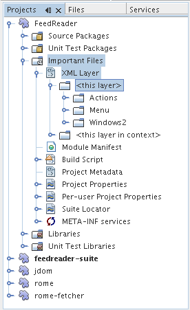

*  `` <this layer in context>. ``  Expõe todas as pastas disponíveis para o aplicativo inteiro. Examinaremos este nó posteriormente neste tutorial.

[start=2]
1. Clique com o botão direito do mouse no nó  ``<esta camada>``  e escolha Novo > Pasta, conforme mostrado abaixo:

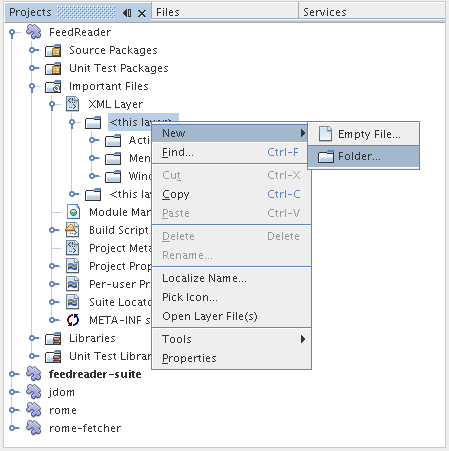

[start=3]
1. Digite  ``RssFeeds``  na caixa de diálogo Nova pasta. Clique em OK. Você agora tem uma nova pasta, como mostrado abaixo:

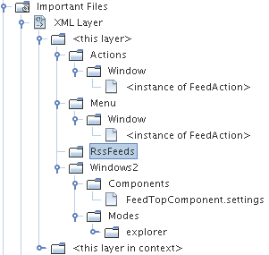

[start=4]
1. Clique duas vezes no nó do arquivo  ``layer.xml``  para que ele seja aberto no Editor de código-fonte. Observe que esta entrada foi adicionada: `` <folder name="RssFeeds"/>`` 

=== Criando o objeto Feed

Em seguida, você criará um POJO simples para encapsular uma URL e seu Rome feed associado.

[start=1]
1. Clique com o botão direito do mouse no nó do projeto  `` FeedReader``  e selecione Novo > Classe Java. Clique em Próximo.

[start=2]
1. Nomeie a classe como  ``Feed``  e selecione  ``org.myorg.feedreader``  na lista suspensa Pacote. Clique em Terminar.

[start=3]
1. No Editor de código-fonte, substitua a classe padrão  ``Feed``  pela seguinte:

[source,java]
----

public class Feed implements Serializable {

    private static FeedFetcher s_feedFetcher 
            = new HttpURLFeedFetcher(HashMapFeedInfoCache.getInstance());
    private transient SyndFeed m_syndFeed;
    private URL m_url;
    private String m_name;

    protected Feed() {
    }

    public Feed(String str) throws MalformedURLException {
        m_url = new URL(str);
        m_name = str;
    }

    public URL getURL() {
        return m_url;
    }

    public SyndFeed getSyndFeed() throws IOException {
        if (m_syndFeed == null) {
            try {
                m_syndFeed = s_feedFetcher.retrieveFeed(m_url);
                if (m_syndFeed.getTitle() != null) {
                    m_name = m_syndFeed.getTitle();
                }
            } catch (Exception ex) {
                throw new IOException(ex.getMessage());
            }
        }
        return m_syndFeed;
    }

    @Override
    public String toString() {
        return m_name;
    }
    
}
----

Uma grande parte do código é sublinhada, pois você não declarou seus pacotes. Você fará isso nas próximas etapas.

Utilize as etapas a seguir para reformatar o arquivo e declarar suas dependências:

[start=1]
1. Pressione Alt-Shift-F para reformatar o código.

[start=2]
1. Pressione Ctrl-Shift-I e certifique-se de que os seguintes comandos import sejam selecionados:

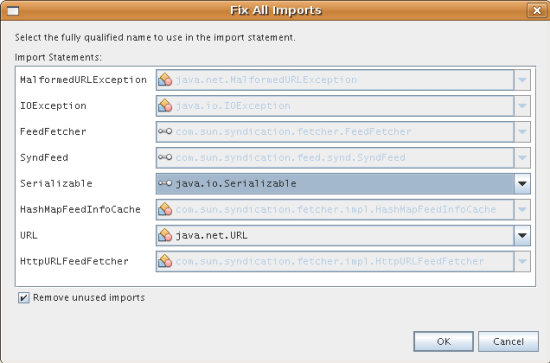

Clique em OK e o IDE adicionará os seguintes comandos import à classe:

[source,java]
----

import com.sun.syndication.feed.synd.SyndFeed;
import com.sun.syndication.fetcher.FeedFetcher;
import com.sun.syndication.fetcher.impl.HashMapFeedInfoCache;
import com.sun.syndication.fetcher.impl.HttpURLFeedFetcher;
import java.io.IOException;
import java.io.Serializable;
import java.net.MalformedURLException;
import java.net.URL;
----

Todo o sublinhado vermelho deve ter desaparecido. Caso não tenha, prossiga com este tutorial até que você tenha solucionado o problema.

=== Estendendo a janela Feed

[start=1]
1. Clique duas vezes em  `` FeedTopComponent.java``  para abri-lo no editor de código-fonte.

[start=2]
1. Digite  ``implements ExplorerManager.Provider``  no final da declaração da classe.

[start=3]
1. Pressione Alt-Enter na linha e clique na sugestão. O IDE adiciona um comando import para o pacote necessário  ``org.openide.explorer.ExplorerManager`` .

[start=4]
1. Pressione Alt-Enter novamente e clique na sugestão. O IDE implementa o método abstrato  ``getExplorerManager()`` .

[start=5]
1. Digite  ``return manager;``  no corpo do novo método  ``getExplorerManager()`` . Pressione Alt-Enter na linha e deixe que o IDE crie um campo chamado  ``manager``  para você. Substitua a definição padrão por esta:

[source,java]
----

private final ExplorerManager manager = new ExplorerManager();
----

[start=6]
1. Logo abaixo da declaração de campo na etapa anterior, declare este:

[source,java]
----

private final BeanTreeView view = new BeanTreeView();
----

[start=7]
1. Finalmente, adicione o seguinte código ao final do construtor:

[source,java]
----

setLayout(new BorderLayout());
add(view, BorderLayout.CENTER);
view.setRootVisible(true);
try {
    manager.setRootContext(new RssNode.RootRssNode());
} catch (DataObjectNotFoundException ex) {
    ErrorManager.getDefault().notify(ex);
}
ActionMap map = getActionMap();
map.put("delete", ExplorerUtils.actionDelete(manager, true));
associateLookup(ExplorerUtils.createLookup(manager, map));
----

Uma grande parte do código é sublinhada, pois você não declarou seus pacotes associados. Você fará isso nas próximas etapas.

Utilize as etapas a seguir para reformatar o arquivo e declarar suas dependências:

[start=1]
1. Pressione Alt-Shift-F para reformatar o código.

[start=2]
1. Pressione Ctrl-Shift-I, selecione  ``org.openide.ErrorManager`` , clique em OK, e o IDE adiciona vários comandos import abaixo do comando package. A lista completa de comandos import agora deve ser a seguinte:

[source,java]
----

import java.awt.BorderLayout;
import java.io.Serializable;
import javax.swing.ActionMap;
import org.openide.ErrorManager;
import org.openide.explorer.ExplorerManager;
import org.openide.explorer.ExplorerUtils;
import org.openide.explorer.view.BeanTreeView;
import org.openide.loaders.DataObjectNotFoundException;
import org.openide.util.NbBundle;
import org.openide.util.RequestProcessor;
import org.openide.util.Utilities;
import org.openide.windows.TopComponent;
----

[start=3]
1. Observe que a linha  ``manager.setRootContext(new RssNode.RootRssNode());``  ainda está sublinhada em vermelho, porque você ainda não criou  ``RssNode.java`` . Você fará isso na próxima subseção. Todo o sublinhado vermelho restante deve ter desaparecido. Caso não tenha, prossiga com este tutorial até que você tenha solucionado o problema.

=== Criando a classe RssNode

O nó de nível superior do Feed Reader é fornecido pela classe RssNode. A classe estende  `` link:http://bits.netbeans.org/dev/javadoc/org-openide-nodes/org/openide/nodes/FilterNode.html[FilterNode]`` , que representa o nó 'RssFeeds'. Aqui definimos um nome de exibição e declaramos dois itens de menu, 'Adicionar' e 'Adicionar pasta', conforme mostrado a seguir:

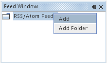

Realize as seguintes etapas para criar esta classe:

[start=1]
1. Crie  `` RssNode.java``  no pacote  `` org.myorg.feedreader`` .

[start=2]
1. Substitua a classe padrão pela seguinte:

[source,java]
----

public class RssNode extends FilterNode {

    public RssNode(Node folderNode) throws DataObjectNotFoundException {
        super(folderNode, new RssFolderChildren(folderNode));
    }

    @Override
    public Action[] getActions(boolean popup) {
    
        *//Declare our actions
        //and pass along the node's data folder:*
        DataFolder df = getLookup().lookup(DataFolder.class);
        return new Action[]{
            new AddRssAction(df), 
            new AddFolderAction(df)
        };
        
    }

    public static class RootRssNode extends RssNode {

        *//The filter node will serve as a proxy
        //for the 'RssFeeds' node, which we here
        //obtain from the NetBeans user directory:*
        public RootRssNode() throws DataObjectNotFoundException {
            super(DataObject.find(Repository.getDefault().getDefaultFileSystem().
                    getRoot().getFileObject("RssFeeds")).getNodeDelegate());
        }

        *//Set the display name of the node,
        //referring to the bundle file, and
        //a key, which we will define later:*
        @Override
        public String getDisplayName() {
            return NbBundle.getMessage(RssNode.class, "FN_title");
        }
        
    }

}
----

Várias marcas de sublinhado vermelho permanecem na classe porque ainda não criamos as ações e porque a classe que define os filhos do nó também não foi criada ainda.

=== Criando a classe RssFolderChildren

A seguir, nos preocuparemos com os filhos do nó "RSS/Atom Feeds". Os filhos são pastas ou feeds. Isso é tudo o que acontece no código abaixo.

Realize as seguintes etapas para criar esta classe:

[start=1]
1. Crie  `` RssFolderChildren.java``  no pacote  `` org.myorg.feedreader`` .

[start=2]
1. Substitua a classe padrão pela seguinte:

[source,java]
----

public class RssFolderChildren extends FilterNode.Children {

    RssFolderChildren(Node rssFolderNode) {
        super(rssFolderNode);
    }

    @Override
    protected Node[] createNodes(Node key) {
        Node n = key;
        
        *//If we can find a data folder, then we create an RssNode,
        //if not, we look for the feed and then create a OneFeedNode:*
        try {
            if (n.getLookup().lookup(DataFolder.class) != null) {
                return new Node[]{new RssNode(n)};
            } else {
                Feed feed = getFeed(n);
                if (feed != null) {
                    return new Node[]{
                        new OneFeedNode(n, feed.getSyndFeed())
                    };
                } else {
                    // best effort
                    return new Node[]{new FilterNode(n)};
                }
            }
        } catch (IOException ioe) {
            Exceptions.printStackTrace(ioe);
        } catch (IntrospectionException exc) {
            Exceptions.printStackTrace(exc);
        }
        // Some other type of Node (gotta do something)
        return new Node[]{new FilterNode(n)};
    }

    /** Looking up a feed */
    private static Feed getFeed(Node node) {
        InstanceCookie ck = node.getCookie(InstanceCookie.class);
        if (ck == null) {
            throw new IllegalStateException("Bogus file in feeds folder: " + node.getLookup().lookup(FileObject.class));
        }
        try {
            return (Feed) ck.instanceCreate();
        } catch (ClassNotFoundException ex) {
            Exceptions.printStackTrace(ex);
        } catch (IOException ex) {
            Exceptions.printStackTrace(ex);
        }
        return null;
    }
    
}
----

Várias marcações de sublinhado vermelho permanecem na classe, porque não criamos a classe  ``OneFeedNode``  ainda.

=== Criando a classe OneFeedNode

Aqui nós estamos interessados no contêiner dos nós de artigo, conforme mostrado abaixo para o nó 'Destaques do NetBeans':

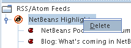

Como pode ser visto, cada um desses nós possui um nome de exibição, recuperado do feed, um ícone e um item de menu Excluir.

Realize as seguintes etapas para criar esta classe:

[start=1]
1. Crie  `` OneFeedNode.java``  no pacote  `` org.myorg.feedreader`` .

[start=2]
1. Substitua a classe padrão pela seguinte:

[source,java]
----

public class OneFeedNode extends FilterNode {

    OneFeedNode(Node feedFileNode, SyndFeed feed) throws IOException, IntrospectionException {
        super(feedFileNode, 
                new FeedChildren(feed), 
                new ProxyLookup(
                new Lookup[]{Lookups.fixed(
                        new Object[]{feed}), 
                        feedFileNode.getLookup()
        }));
    }

    @Override
    public String getDisplayName() {
        SyndFeed feed = getLookup().lookup(SyndFeed.class);
        return feed.getTitle();
    }

    @Override
    public Image getIcon(int type) {
        return Utilities.loadImage("org/myorg/feedreader/rss16.gif");
    }

    @Override
    public Image getOpenedIcon(int type) {
        return getIcon(0);
    }

    @Override
    public Action[] getActions(boolean context) {
        return new Action[]{SystemAction.get(DeleteAction.class)};
    }
    
}
----

Várias marcações de sublinhado vermelho permanecem na classe, pois não criamos a classe  ``FeedChildren``  ainda.

=== Criando a classe FeedChildren

Nesta seção, adicionaremos código que fornecerá nós para cada um dos artigos fornecidos pelo feed.

Realize as seguintes etapas para criar esta classe:

[start=1]
1. Crie  `` FeedChildren.java``  no pacote  `` org.myorg.feedreader`` .

[start=2]
1. Substitua a classe padrão pela seguinte:

[source,java]
----

public class FeedChildren extends Children.Keys {

    private final SyndFeed feed;

    public FeedChildren(SyndFeed feed) {
        this.feed = feed;
    }

    @SuppressWarnings(value = "unchecked")
    @Override
    protected void addNotify() {
        setKeys(feed.getEntries());
    }

    public Node[] createNodes(Object key) {
        
        *//Return new article-level nodes:*
        try {
            return new Node[]{
                new EntryBeanNode((SyndEntry) key)
            };
            
        } catch (final IntrospectionException ex) {
            Exceptions.printStackTrace(ex);
            *//Should never happen, no reason for it to fail above:*
            return new Node[]{new AbstractNode(Children.LEAF) {
                @Override
                public String getHtmlDisplayName() {
                    return "" + ex.getMessage() + "";
                }
            }};
        }
    }
}
----

Várias marcações de sublinhado vermelho permanecem na classe, pois não criamos nossa classe  ``EntryBeanNode``  ainda.

=== Criando a classe EntryBeanNode

Finalmente, lidaremos com os nós de nível mais inferior, aqueles que representam artigos fornecidos pelo feed.

Para criar esta classe, realize as seguintes etapas:

[start=1]
1. Crie  `` EntryBeanNode.java``  no pacote  `` org.myorg.feedreader`` .

[start=2]
1. Substitua a classe padrão pela seguinte:

[source,java]
----

public class EntryBeanNode extends FilterNode {

    private SyndEntry entry;

    @SuppressWarnings(value = "unchecked")
    public EntryBeanNode(SyndEntry entry) throws IntrospectionException {
        super(new BeanNode(entry), Children.LEAF, 
                Lookups.fixed(new Object[]{
            entry, 
            new EntryOpenCookie(entry)
        }));
        this.entry = entry;
    }

    */** Using HtmlDisplayName ensures any HTML in RSS entry titles are
     * /**properly handled, escaped, entities resolved, etc. */*
    @Override
    public String getHtmlDisplayName() {
        return entry.getTitle();
    }

    */** Making a tooltip out of the entry's description */*
    @Override
    public String getShortDescription() {
        return entry.getDescription().getValue();
    }

    */** Providing the Open action on a feed entry */*
    @Override
    public Action[] getActions(boolean popup) {
        return new Action[]{SystemAction.get(OpenAction.class)};
    }

    @Override
    public Action getPreferredAction() {
        return (SystemAction) getActions(false) [0];
    }

    */** Specifying what should happen when the user invokes the Open action */*
    private static class EntryOpenCookie implements OpenCookie {

        private final SyndEntry entry;

        EntryOpenCookie(SyndEntry entry) {
            this.entry = entry;
        }

        public void open() {
            try {
                URLDisplayer.getDefault().showURL(new URL(entry.getUri()));
            } catch (MalformedURLException mue) {
                Exceptions.printStackTrace(mue);
            }
        }
        
    }
    
}
----

=== Criando o item de menu Adicionar pasta

Agora criaremos o item de menu para criação de pastas, conforme declarado anteriormente.

Para criar esta classe, realize as seguintes etapas:

[start=1]
1. Crie  `` AddFolderAction.java``  no pacote  `` org.myorg.feedreader`` .

[start=2]
1. Substitua a classe padrão pela seguinte:

[source,java]
----

public class AddFolderAction extends AbstractAction {

    private DataFolder folder;

    public AddFolderAction(DataFolder df) {
        folder = df;
        putValue(Action.NAME, NbBundle.getMessage(RssNode.class, "FN_addfolderbutton"));
    }

    public void actionPerformed(ActionEvent ae) {
        NotifyDescriptor.InputLine nd = 
                new NotifyDescriptor.InputLine(
                NbBundle.getMessage(RssNode.class, "FN_askfolder_msg"), 
                NbBundle.getMessage(RssNode.class, "FN_askfolder_title"), 
                NotifyDescriptor.OK_CANCEL_OPTION, NotifyDescriptor.PLAIN_MESSAGE);
        Object result = DialogDisplayer.getDefault().notify(nd);
        if (result.equals(NotifyDescriptor.OK_OPTION)) {
            final String folderString = nd.getInputText();
            try {
                DataFolder.create(folder, folderString);
            } catch (IOException ex) {
                Exceptions.printStackTrace(ex);
            }
        }
    }
}
----

=== Criando o item de menu Adicionar RSS

Nesta seção, criaremos o item de menu que adiciona novos feeds.

Para criar esta classe, realize as seguintes etapas:

[start=1]
1. Crie  `` AddRssAction.java``  no pacote  `` org.myorg.feedreader`` .

[start=2]
1. Substitua a classe padrão pela seguinte:

[source,java]
----

public class AddRssAction extends AbstractAction {

    private DataFolder folder;

    public AddRssAction(DataFolder df) {
        folder = df;
        putValue(Action.NAME, NbBundle.getMessage(RssNode.class, "FN_addbutton"));
    }

    public void actionPerformed(ActionEvent ae) {
    
        NotifyDescriptor.InputLine nd = new NotifyDescriptor.InputLine(
                NbBundle.getMessage(RssNode.class, "FN_askurl_msg"),
                NbBundle.getMessage(RssNode.class, "FN_askurl_title"),
                NotifyDescriptor.OK_CANCEL_OPTION,
                NotifyDescriptor.PLAIN_MESSAGE);

        Object result = DialogDisplayer.getDefault().notify(nd);

        if (result.equals(NotifyDescriptor.OK_OPTION)) {
            String urlString = nd.getInputText();
            URL url;
            try {
                url = new URL(urlString);
            } catch (MalformedURLException e) {
                String message = NbBundle.getMessage(RssNode.class, "FN_askurl_err", urlString);
                Exceptions.attachLocalizedMessage(e, message);
                Exceptions.printStackTrace(e);
                return;
            }
            try {
                checkConnection(url);
            } catch (IOException e) {
                String message = NbBundle.getMessage(RssNode.class, "FN_cannotConnect_err", urlString);
                Exceptions.attachLocalizedMessage(e, message);
                Exceptions.printStackTrace(e);
                return;
            }
            Feed f = new Feed(url);
            FileObject fld = folder.getPrimaryFile();
            String baseName = "RssFeed";
            int ix = 1;
            while (fld.getFileObject(baseName + ix, "ser") != null) {
                ix++;
            }
            try {
                FileObject writeTo = fld.createData(baseName + ix, "ser");
                FileLock lock = writeTo.lock();
                try {
                    ObjectOutputStream str = new ObjectOutputStream(writeTo.getOutputStream(lock));
                    try {
                        str.writeObject(f);
                    } finally {
                        str.close();
                    }
                } finally {
                    lock.releaseLock();
                }
            } catch (IOException ioe) {
                Exceptions.printStackTrace(ioe);
            }
    }    
    
    private static void checkConnection(final URL url) throws IOException {
        InputStream is = url.openStream();
        is.close();
    }
    
}
----

=== Localizando a classe RssNode

[start=1]
1. Abra o arquivo  ``Bundle.properties``  do módulo  ``FeedReader`` .

[start=2]
1. Adicione os seguintes pares de valores de chave:

[source,java]
----

FN_title=RSS/Atom Feeds
FN_addbutton=Add
FN_askurl_title=New Feed
FN_askurl_msg=Enter the URL of an RSS/Atom Feed
FN_askurl_err=Invalid URL: {0}|
FN_addfolderbutton=Add Folder
FN_askfolder_msg=Enter the folder name
FN_askfolder_title=New Folder
----

Eis uma explicação dos novos pares de valores de chave, que localizam a strings definidas em  ``RssNode.java`` :

* * FN_title.* Localiza o rótulo do nó mais alto na janela Feed.

Localização da interface do usuário para adicionar um feed:

* * FN_addbutton.* Localiza o rótulo do menu Adicionar que aparece no pop-up do nó mais alto.
* * FN_askurl_title.* Localiza o título da caixa de diálogo Novo feed.
* * FN_askurl_msg.* Localiza a mensagem que aparece na caixa de diálogo Novo feed.
* * FN_askurl_err.* Localiza a string de erro que é exibida se a URL for inválida.

Localização da interface do usuário para adicionar uma pasta:

* * FN_addfolderbutton.* Localiza o rótulo do menu Adicionar pasta que aparece no pop-up do nó mais alto.
* * FN_askfolder_msg.* Localize a mensagem que aparece na caixa de diálogo Adicionar pasta.
* * FN_askfolder_title. * Localiza o título da caixa de diálogo Adicionar pasta.

==  Marcando o aplicativo

Agora que está no final do ciclo de desenvolvimento, ao empacotar o aplicativo, você tem as seguintes preocupações:

* Qual deve ser o nome do executável do aplicativo?
* O que o usuário deve ver ao iniciar o aplicativo? Uma barra de progresso? Uma tela de abertura? Ambos?
* Quando o aplicativo for iniciado, o que deve ser exibido na barra de título?
* Eu preciso de todos os menus e botões da barra de ferramentas que a Plataforma NetBeans fornece por padrão?

Estas questões são relacionadas à identificação de marca, a atividade de personalização de um aplicativo construído na Plataforma NetBeans. O IDE fornece um painel na caixa de diálogo Propriedades do projeto de projetos de suíte de módulos para ajudá-lo na identificação de marca.

[start=1]
1. Clique com o botão direito do mouse no nó do projeto  ``feedreader-suite``  (não no nó do projeto  `` FeedReader`` ) e escolha Propriedades. Na caixa de diálogo Propriedades do projeto, clique em Construir.

[start=2]
1. No painel Construir, digite  ``feedreader``  em Nome de marca. Digite  ``Aplicativo Feed Reader``  em Título do aplicativo. O valor no nome de marca define o nome do executável, enquanto o valor no título do aplicativo define a barra de título do aplicativo.

[start=3]
1. Clique em Procurar para ir para o ícone  ``rss16.gif``  (
image::images/feedreader_rss16.gif[]). Escolha o ícone que será exibido na caixa de diálogo Ajuda > Sobre.

Agora você deve ver o seguinte:

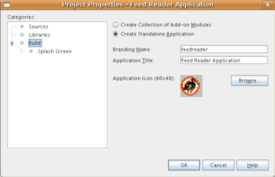

[start=4]
1. No painel Tela de splash, clique em Procurar para ir para  ``splash.gif``  . Opcionalmente, altere a cor e o tamanho do texto da barra de progresso. Ou, caso não deseje uma barra de progresso, desmarque Habilitado.

Agora você deve ver o seguinte:

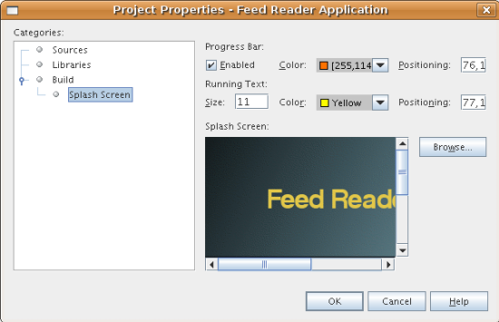

[start=5]
1. Clique em OK.A pasta  ``branding``  é criada no projeto  ``Aplicativo FeedReader`` . Ela é visível na janela Arquivos (Ctrl-2).

[start=6]
1. Na janela Arquivos, expanda o nó do projeto  ``Aplicativo FeedReader`` . Em seguida, continue expandindo nós até encontrar este: `` branding/modules/org-netbeans-core-window.jar/org/netbeans/core/windows`` 

[start=7]
1. Clique com o botão direito do mouse no nó, escolha Novo > Outro e selecione Pasta na categoria Outros. Clique em Próximo e nomeie a pasta como  ``resources``  . Clique em Terminar.

[start=8]
1. Clique com o botão direito do mouse no novo nó  ``resources`` , escolha Novo > Outro e selecione Documento XML na categoria XML. Clique em Próximo. Nomeie o arquivo como  ``layer``  . Clique em Próximo e, em seguida, em Terminar. Substitua o conteúdo do novo arquivo  ``layer.xml``  pelo seguinte:

[source,xml]
----

<?xml version="1.0" encoding="UTF-8"?>
<!DOCTYPE filesystem PUBLIC "-//NetBeans//DTD Filesystem 1.1//EN" "https://netbeans.org/dtds/filesystem-1_1.dtd">
<!--
This is a `branding' layer.  Ela é mesclada ao arquivo layer que ela está identificando.
Neste caso, está apenas ocultando itens de menu e barras de ferramentas que não queremos.
-->
<filesystem>

	<!-- hide unused toolbars -->
	<folder name="Toolbars">
		<folder name="File_hidden"/>
		<folder name="Edit_hidden"/>
	</folder>

	<folder name="Menu">
		<folder name="File">
			<file name="org-openide-actions-SaveAction.instance_hidden"/>
			<file name="org-openide-actions-SaveAllAction.instance_hidden"/>
			<file name="org-netbeans-core-actions-RefreshAllFilesystemsAction.instance_hidden"/>            
			<file name="org-openide-actions-PageSetupAction.instance_hidden"/>
			<file name="org-openide-actions-PrintAction.instance_hidden"/>
		</folder>
		<folder name="Edit_hidden"/>
		<folder name="Tools_hidden"/>
	</folder>

</filesystem>
----

== Distribuindo a aplicação

O IDE usa um script de construção Ant para criar uma distribuição do aplicativo. O script de construção é criado quando o projeto é criado.

[start=1]
1. Na janela Projetos, clique com o botão direito do mouse no nó do projeto  ``Aplicativo FeedReader``  e escolha Construir distribuição ZIP. A janela Saída mostra onde a distribuição ZIP é criada.

[start=2]
1. No sistema de arquivos, localize a distribuição  ``feedreader.zip``  na pasta  ``dist``  no diretório do projeto. Descompacte-a. Inicie o aplicativo, que é encontrado na pasta  ``bin`` . Durante a inicialização, uma tela de splash é exibida. Quando o aplicativo tiver sido iniciado, vá para a caixa de diálogo Ajuda > Sobre e observe o ícone e a tela de splash especificados na seção <<branding,Identificando a marca do aplicativo>>.

Quando estiver em funcionamento, o aplicativo Feed Reader exibe a janela RSS/Atom Feeds, que contém um nó chamado RSS/Atom Feeds.

Parabéns! Você concluiu o tutorial FeedReader.

link:http://netbeans.apache.org/community/mailing-lists.html[Envie-nos seus comentários]

