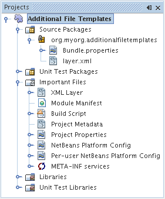
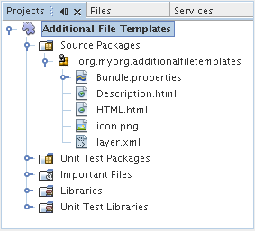
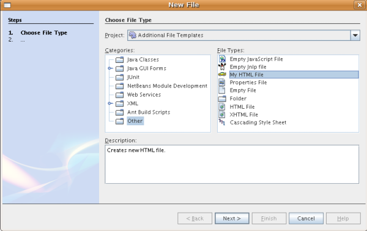
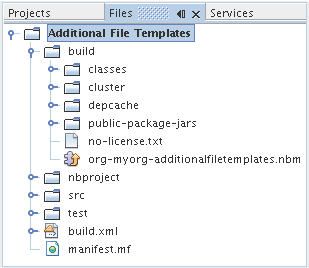

// 
//     Licensed to the Apache Software Foundation (ASF) under one
//     or more contributor license agreements.  See the NOTICE file
//     distributed with this work for additional information
//     regarding copyright ownership.  The ASF licenses this file
//     to you under the Apache License, Version 2.0 (the
//     "License"); you may not use this file except in compliance
//     with the License.  You may obtain a copy of the License at
// 
//       http://www.apache.org/licenses/LICENSE-2.0
// 
//     Unless required by applicable law or agreed to in writing,
//     software distributed under the License is distributed on an
//     "AS IS" BASIS, WITHOUT WARRANTIES OR CONDITIONS OF ANY
//     KIND, either express or implied.  See the License for the
//     specific language governing permissions and limitations
//     under the License.
//

= Tutorial Módulo do modelo de arquivo do NetBeans
:jbake-type: platform_tutorial
:jbake-tags: tutorials 
:jbake-status: published
:syntax: true
:source-highlighter: pygments
:toc: left
:toc-title:
:icons: font
:experimental:
:description: Tutorial Módulo do modelo de arquivo do NetBeans - Apache NetBeans
:keywords: Apache NetBeans Platform, Platform Tutorials, Tutorial Módulo do modelo de arquivo do NetBeans

Este tutorial demonstra como criar um módulo contendo modelos de arquivo. Depois que os usuários tiverem instalado o módulo no IDE, os modelos de arquivo estarão disponíveis no assistente para Novo arquivo. O compartilhamento de modelos de arquivo é fácil, desde que você tenha um módulo que os contenha: o IDE permite que você crie um binário que pode ser disponibilizado para outras pessoas, que podem instalá-lo através do Gerenciador de plug-ins.

Um modelo de arquivo consiste em um arquivo de modelo, um arquivo de descrição HTML e um ícone. O arquivo de descrição HTML exibe informações sobre o modelo no assistente para Novo arquivo. O ícone identifica o modelo e o distingue de outros modelos no assistente para Novo arquivo. Neste tutorial, você criará um novo modelo de arquivo copiando o conteúdo de um modelo de arquivo existente em um arquivo vazio. Em seguida, depois de ter definido um arquivo de descrição para o assistente para Novo arquivo e um ícone de distinção, registre o modelo, o arquivo de descrição HTML e o ícone no arquivo de configuração NetBeans, ou seja, no arquivo  ``layer.xml`` .

Opcionalmente, para fins de solução de problemas, você pode  link:http://plugins.netbeans.org/PluginPortal/faces/PluginDetailPage.jsp?pluginid=3755[baixar a amostra completa] e inspecionar os códigos-fonte.

== Introdução ao FreeMarker

A partir do NetBeans IDE 6.0, é possível usar opcionalmente a linguagem de modelo  link:http://freemarker.org/[FreeMarker] para definir os modelos de arquivo. Vários dos modelos incluídos no IDE são definidos dessa forma. Por exemplo, o modelo da classe Java é definido desta forma:

[source,xml]
----

<#assign licenseFirst = "/*">
<#assign licensePrefix = " * ">
<#assign licenseLast = " */">
<#include "../Licenses/license-${project.license}.txt">

<#if package?? &amp;&amp; package != "">
package ${package};

</#if>
/**
 *
 * @author ${user}
 */
public class ${name} {

}
----

O benefício do uso do FreeMarker pode ser visto no modelo acima, ou seja, você pode adicionar _lógica_ aos modelos, através de _diretivas_ como if/elseif/else e construções loop. Para obter uma descrição completa da linguagem de modelo FreeMarker, consulte o  link:http://freemarker.org/docs/index.html[Manual do FreeMarker], em particular, o capítulo  link:http://freemarker.org/docs/dgui_template_directives.html[Diretivas]. Neste tutorial, você verá, entre outras coisas, quais são as etapas necessárias para incorporar o FreeMarker nos modelos de arquivo.

== Criando o projeto do módulo

Começaremos percorrendo o assistente para Novo projeto de módulo, que criará uma estrutura de código-fonte, com todos os requisitos mínimos, para o novo módulo.

[start=1]
1. Escolha Arquivo > Novo projeto (Ctrl-Shift-N). Em Categorias, selecione Módulos do NetBeans. Em Projetos, selecione Projeto de módulo e clique em Próximo.

[start=2]
1. No painel Nome e localização, digite  ``AdditionalFileTemplates``  em Nome do projeto. Altere Local do projeto para qualquer diretório no computador. Deixe marcados o botão de opção Módulo independente e a caixa de verificação Definir como projeto principal. Clique em Próximo.

[start=3]
1. No painel Configuração básica de módulos, substitua  ``yourorghere``  em Nome base de código por  ``myorg`` , de maneira que o nome base de código inteiro seja  ``org.myorg.additionalfiletemplates`` . Adicione espaços ao Nome de exibição do módulo padrão, para que seja alterado para  ``Modelos de arquivo adicionais`` . Deixe o local do conjunto de localizações e a camada XML, de modo que serão armazenados em um pacote com o nome  ``org/myorg/additionalfiletemplates`` . Clique em Terminar.

O IDE cria o projeto  ``Modelos de arquivo adicionais`` . O projeto contém todos os metadados de projeto e fontes, como o script de construção Ant do projeto. O projeto se abre no IDE. Você pode ver a estrutura lógica na janela Projetos (Ctrl-1) e a estrutura de arquivos na janela Arquivos (Ctrl+2). Por exemplo, a janela Projetos agora deve ter esta aparência:

 

== Criando o modelo de arquivo

Um modelo de arquivo consiste em um arquivo de modelo, um arquivo de descrição HTML e um ícone. Uma maneira fácil de criar um novo modelo de arquivo é copiar o conteúdo de um modelo de arquivo existente para um arquivo vazio. Em seguida, após ter definido um arquivo de descrição para o assistente para Novo arquivo e um ícone de distinção, você está pronto para registrar o modelo no arquivo  ``layer.xml`` .

=== Criando o arquivo de modelo

[start=1]
1. Clique com o botão direito do mouse no nó  ``Modelos de arquivo adicionais``  e escolha Novo > Outro. No assistente para Novo arquivo, em Categorias, escolha Outra e em Tipos de arquivos, escolha HTML. Clique em Próximo.

[start=2]
1. Digite  ``Descrição``  em Nome do arquivo. Clique em Explorar e vá para  ``src/org/myorg/additionalfiletemplates`` . Clique em Selecionar pasta. Clique em Terminar.

Um novo arquivo HTML, chamado  ``HTML.html`` , se abre no editor de código-fonte, contendo o conteúdo padrão do arquivo HTML mostrado abaixo:

[source,html]
----

<!DOCTYPE HTML PUBLIC "-//W3C//DTD HTML 4.01 Transitional//EN">

<html>
  <head>
    <title></title>
  </head>
  <body>
  
  </body>
</html>
----

[start=3]
1. Altere o arquivo HTML de acordo com suas necessidades. Você pode adicionar as seguintes variáveis predefinidas, se necessário:

* ${date} insere a data atual, neste formato: Fevereiro, 16, 2008
* ${encoding} insere a codificação padrão, tal como: UTF-8
* ${name} insere o nome do arquivo.
* ${nameAndExt} insere o nome do arquivo, junto com sua extensão.
* ${package} insere o nome do pacote em que o arquivo é criado.
* ${time} insere a hora atual, neste formato: 7:37:58 PM
* ${user} insere o nome do usuário.

*Observação:* os usuários podem definir valores para estas variáveis no Gerenciador de modelos, que fica no menu Ferramentas. Lá, eles rolam para o final, para "Propriedades da configuração do usuário". O arquivo  ``user.properties``  nesse nó pode ser usado para definir os valores acima, para substituir os fornecidos pelo sistema. Entretanto, geralmente, os usuários não fazem isso porque os valores padrão das variáveis acima fazem um bom trabalho.

Além das variáveis predefinidas, você pode fornecer variáveis adicionais aos usuários, através do módulo. Isto será explicado posteriormente neste tutorial. A lista completa de diretivas do FreeMarker também pode ser usada para adicionar lógica ao modelo:

* #assign
* #else
* #elseif
* #end
* #foreach
* #if
* #include
* #list
* #macro
* #parse
* #set
* #stop

Como um exemplo, observe a definição do modelo da classe Java:

[source,xml]
----

<#assign licenseFirst = "/*">
<#assign licensePrefix = " * ">
<#assign licenseLast = " */">
<#include "../Licenses/license-${project.license}.txt">

<#if package?? &amp;&amp; package != "">
package ${package};

</#if>
/**
 *
 * @author ${user}
 */
public class ${name} {

}
----

Para obter informações sobre a diretiva #assign, consulte <<license,Fornecendo uma licença de projeto>>. Para obter uma descrição completa da linguagem de modelo FreeMarker, consulte o  link:http://freemarker.org/docs/index.html[Manual do FreeMarker], em particular, o capítulo  link:http://freemarker.org/docs/dgui_template_directives.html[Diretivas].

=== Criando o arquivo de descrição

[start=1]
1. Clique com o botão direito do mouse no nó  ``org.myorg.additionalfiletemplates``  e escolha Novo > Outro. Em Categorias, escolha Outro. Em Tipos de arquivo, escolha Arquivo HTML. Clique em Próximo. Digite  ``HTML``  em Nome do arquivo. Clique em Explorar e vá para  ``src/org/myorg/additionalfiletemplates`` . Clique em Selecionar pasta. Clique em Terminar.

Um arquivo HTML vazio é aberto no Editor de código-fonte e seu nó aparece na janela Projetos.

[start=2]
1. Digite " ``Creates new HTML file`` " (sem as aspas) entre as marcas  ``<body>`` , para que o arquivo tenha esta aparência:

[source,html]
----

<!DOCTYPE HTML PUBLIC "-//W3C//DTD HTML 4.01 Transitional//EN">
<html>
   <head>
      <title></title>
   </head>
   <body>
      Creates new HTML file.
   </body></html>
----

=== Obtendo um ícone

O ícone acompanha o modelo de arquivo no assistente para Novo arquivo. Ele o identifica e o distingue de outros modelos de arquivo. O ícone deve ter uma dimensão de 16x16 pixels.

Nomeie o ícone como  ``icon.png``  e adicione-o ao pacote  ``org.myorg.additionalfiletemplates`` .

A janela Projetos agora deve ter esta aparência:

== Registrando o modelo de arquivo

Depois de ter criado o modelo de arquivo, você deverá registrá-lo no sistema de arquivos do sistema NetBeans. Esta é a finalidade do arquivo  ``layer.xml`` .

[start=1]
1. Adicione a seguinte entrada entre as marcas  ``<filesystem>``  no arquivo  ``layer.xml`` :

[source,xml]
----

<folder name="Templates">
        
        <folder name="Other">
            
            <attr name="SystemFileSystem.localizingBundle" stringvalue="org.myorg.additionalfiletemplates.Bundle"/>
            <file name="MyHTML.html" url="HTML.html">
                <attr name="template" boolvalue="true"/>
                <attr name="SystemFileSystem.localizingBundle" stringvalue="org.myorg.additionalfiletemplates.Bundle"/>
                <attr name="SystemFileSystem.icon" urlvalue="nbresloc:/org/myorg/additionalfiletemplates/icon.png"/>
                <attr name="templateWizardURL" urlvalue="nbresloc:/org/myorg/additionalfiletemplates/Description.html"/>
                *<!--Use this line only if your template makes use of the FreeMarker template language:-->*
                <attr name="javax.script.ScriptEngine" stringvalue="freemarker"/>
            </file>
            
        </folder>
        
</folder>
----

[start=2]
1. Adicione o nome de exibição ao arquivo  ``Bundle.properties`` :

[source,java]
----

Templates/Other/MyHTML.html=Meu arquivo HTML
----

== Construindo e instalando o módulo

O IDE utiliza um script de construção Ant para construir e instalar seu módulo. O script de construção é criado quando o projeto de modulo é criado.

=== Instalando o módulo do NetBeans

Na janela Projetos, clique com o botão direito do mouse no projeto  ``Modelos de arquivo adicionais``  e escolha Instalar/recarregar na plataforma de destino.

O módulo é construído e instalado no IDE ou na plataforma de destino. A plataforma ou IDE de destino se abre, de modo que você possa experimentar o novo módulo. O IDE ou a plataforma de destino padrão é a instalação usada pela instância atual do IDE de desenvolvimento.

*Observação:* ao executar o módulo, você usará um diretório de usuário de teste temporário, não o diretório de usuário do IDE de desenvolvimento.

=== Usando o módulo do NetBeans

[start=1]
1. Escolha Arquivo > Novo projeto (Ctrl-Shift-N) e crie um novo projeto.

[start=2]
1. Clique com o botão direito no projeto e escolha Novo > Outro. O assistente para Novo arquivo é aberto e exibe a nova categoria com seu novo tipo de arquivo. Ele deve ter a aparência semelhante a esta, embora seu ícone provavelmente seja diferente:

[start=3]
1. Selecione o novo tipo de arquivo, clique em Próximo e crie um novo arquivo. Quando você clicar em Terminar, o Editor de código-fonte deverá exibir o modelo recém-criado.

=== Criando um binário de módulo compartilhável

[start=1]
1. Na janela Projetos, clique com o botão direito do mouse no projeto  ``Modelos de arquivo adicionais``  e escolha Criar NBM.

O arquivo NBM é criado e você pode visualizá-lo na janela Arquivos (Ctrl+-2):

[start=2]
1. Disponibilize-o a outras pessoas através de, por exemplo, email.

== Fornecendo variáveis adicionais

Como discutido anteriormente, é possível complementar as variáveis predefinidas, como ${user} e ${time}, com as suas próprias. Por exemplo, você pode definir o seu modelo da seguinte forma, se desejar passar uma variável representando uma lista de nomes:

[source,html]
----

<!DOCTYPE HTML PUBLIC "-//W3C//DTD HTML 4.01 Transitional//EN">

<html>
  <head>
    <title></title>
  </head>
  <body>
  
        <#list names as oneName>
            <b&amp;gt${oneName}</b&amp;gt
        </#list>

  </body>
</html>
----

Acima, a diretiva #list do FreeMarker itera por meio de uma variável chamada "names", com cada instância chamada "oneName". Cada valor da iteração é impresso no arquivo, entre marcas de negrito. O valor de "names" poderia vir de uma série de locais, geralmente do painel de um assistente, onde o usuário, neste caso, teria selecionado um conjunto de nomes de uma lista.

Para habilitar a variável acima, ou seja, para iterar através de uma nova variável, consulte  link:http://netbeans.dzone.com/news/freemarker-netbeans-ide-60-first-scenario[FreeMarker no NetBeans IDE 6.0: Primeiro cenário] e veja a discussão de  ``DataObject.createFromTemplate(df, targetName, hashMap)``  nesta  link:http://blogs.oracle.com/geertjan/entry/freemarker_baked_into_netbeans_ide1[entrada de blog]. 

== Fornecendo uma licença de projeto

Um ponto ainda não discutido está relacionado à diretiva #assign do FreeMarker, que só é relevante se você estiver interessado em permitir que o usuário gere uma licença de projeto quando o arquivo for criado. Para atender às necessidades de licenciamento do usuário, você pode fornecer diretivas de licenciamento no modelo de arquivo. Depois, todos os arquivos no projeto do usuário serão criados com as diretivas de licenciamento fornecidas.

Para compreender isto, realize as seguintes etapas:

[start=1]
1. Vá para o menu Ferramentas. Escolha Modelos. Abra o modelo Java | Classe Java no editor:

image::http://blogs.oracle.com/geertjan/resource/freemarker-in-nb-2.png[]

[start=2]
1. O modelo acima, e as ramificações de sua definição no FreeMarker, foram discutidos anteriormente. Entretanto, vamos analisar especificamente as quatro primeiras linhas:

[source,java]
----

<#assign licenseFirst = "/*">
<#assign licensePrefix = " * ">
<#assign licenseLast = " */">
<#include "../Licenses/license-${project.license}.txt">
----

Estas quatro linhas têm a ver com _licenciamento_. A última linha determina a licença que será usada, por projeto. As três primeiras determinam os caracteres na frente e atrás de cada linha da licença. Acima há quatro linhas para os arquivos de código-fonte Java. Aqui está o mesmo conjunto de definições que você encontrará no início do modelo de arquivo de propriedades:

[source,java]
----

<#assign licensePrefix = "# ">
<#include "../Licenses/license-${project.license}.txt">
----

A primeira linha informa que cada linha na licença terá como prefixo um "# ", em vez de um "*", que é o prefixo de arquivos de código-fonte Java (com "/*" para a primeira linha e " */" para a última linha). Para verificar isto, crie um arquivo de código-fonte Java e crie um arquivo de propriedades. Você verá uma licença em ambos os casos. Entretanto, os caracteres de prefixo e sufixo de cada linha são diferentes, devido às definições acima.

[start=3]
1. Agora, vamos analisar a própria licença. Observe esta linha nos modelos acima:

[source,java]
----

<#include "../Licenses/license-${project.license}.txt">
----

Em particular, observe esta parte:

[source,java]
----

${project.license}
----

Coloque-a, como uma chave, no arquivo  ``nbproject/project.properties``  do aplicativo. Agora adicione um valor. Por exemplo:

[source,java]
----

project.license=apache
----

Agora, observe o Gerenciador de modelos novamente, na pasta Licenças. Você verá alguns modelos nela. Crie um novo chamado " ``license-apache.txt`` ". Por enquanto, você só pode copiar um existente e colá-lo na mesma categoria no Gerenciador de modelos. Depois, na próxima vez que você criar um arquivo definido por um modelo do FreeMarker que inclua esta linha:

[source,java]
----

<#include "../Licenses/license-${project.license}.txt">
----

...você terá a licença especificada incorporada ao arquivo recém-criado.

Em resumo, o NetBeans IDE 6.0 permite que o usuário defina, por projeto, a licença que cada um dos arquivos deve exibir. Além disso, imagine se o usuário precisar criar um novo projeto com uma licença diferente. Supondo que o usuário tenha um conjunto de licenças definido no Gerenciador de modelos, o uso de uma nova licença é tão simples quanto adicionar uma chave ou um par de valores ao arquivo  ``nbproject/project.properties`` . Isso só é possível agora graças ao suporte a FreeMarker no NetBeans IDE 6.0. Para mais leituras sobre licenciamento, especialmente os comentários ao final dele, consulte  link:http://blogs.oracle.com/geertjan/date/20071126[esta entrada do blog].

link:http://netbeans.apache.org/community/mailing-lists.html[Envie-nos seus comentários]

== Próximas etapas

Para obter mais informações sobre a criação e o desenvolvimento de módulos do NetBeans, consulte os seguintes recursos:

*  link:https://netbeans.apache.org/kb/docs/platform.html[Outros tutoriais relacionados]

*  link:https://bits.netbeans.org/dev/javadoc/[Javadoc da API da NetBeans ]

== Versionamento

|===
|*Versão* |*Data* |*Alterações* 

|1 |26 de junho de 2005 |Versão inicial 

|2 |28 de junho de 2005 |

* Marcas de negrito adicionadas ao arquivo descritor para mostrar que a caixa Descrição exibe marcas HTML.
* Atributos de classificação adicionados.
* Nomes de exibição movidos para Bundle.properties.
* Captura de tela alterada em "Usando o plug-in do NetBeans".
* ".template" adicionado como extensão do arquivo "BrandedJavaClass" porque  ``layer.xml``  procura um arquivo chamado "BrandedJavaClass.template". Além disso, a captura de tela da janela Projetos foi alterada no final da seção "Criando o modelo de arquivo" para refletir a extensão ".template".
 

|3 |2 de outubro de 2005 |

* Tutorial percorrido por completo com a última compilação. Várias alterações feitas, especialmente porque Modelos substitui a janela Opções em modelos.
* Adição do 2o e 3o parágrafos à introdução, para explicar que este tutorial não é necessário se você estiver criando um novo tipo de arquivo.
 

|4 |3 de outubro de 2005 |

* templateWizard[Iterator|URL] alterado em layer.xml para instanciar [Iterator|WizardURL] porque templateWizard[Iterator|URL] ficará obsoleto.
 

|5 |16 de março de 2006 |

* Tutorial percorrido por completo, espaço entre linhas ajustado um pouco, tudo funcionando perfeitamente.
* É preciso substituir as capturas de tela porque os ícones estão um pouco diferentes.
* É preciso adicionar um ícone ao documento, não apenas fazer referência à localização.
* É preciso mostrar como vários modelos de arquivo podem ser criados ao mesmo tempo no assistente para Novo arquivo.
 

|6 |12 de setembro de 2006 |

* Tutorial percorrido por completo em NetBeans IDE 5.5 Beta 2.
* Sem problemas, funcionou exatamente como descrito.
* Algumas capturas de tela atualizadas.
* Recuos corrigidos no código.
 

|7 |9 de junho de 2007 |Início da atualização para o NetBeans 6. 

|8 |16 de fevereiro de 2008 |Início da migração das informações de  link:http://blogs.oracle.com/geertjan/entry/freemarker_baked_into_netbeans_ide1[esta entrada de blog],  link:http://blogs.oracle.com/geertjan/entry/freemarker_baked_into_netbeans_ide2[esta entrada de blog] e  link:http://blogs.oracle.com/geertjan/date/20071126[esta entrada de blog] e  link:http://netbeans.dzone.com/news/freemarker-netbeans-ide-60-first-scenario[este artigo] para este tutorial. 

|9 |15 de abril de 2008 |Estilos (emblema, índice analítico, tabela de software necessário) atualizados para o novo formato. 
|===

