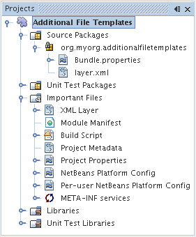
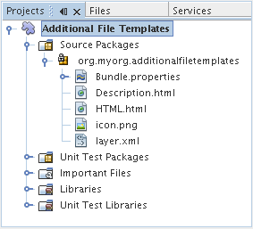
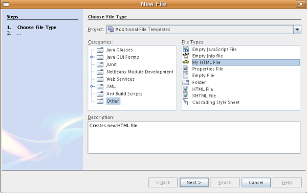
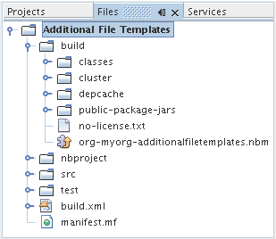

// 
//     Licensed to the Apache Software Foundation (ASF) under one
//     or more contributor license agreements.  See the NOTICE file
//     distributed with this work for additional information
//     regarding copyright ownership.  The ASF licenses this file
//     to you under the Apache License, Version 2.0 (the
//     "License"); you may not use this file except in compliance
//     with the License.  You may obtain a copy of the License at
// 
//       http://www.apache.org/licenses/LICENSE-2.0
// 
//     Unless required by applicable law or agreed to in writing,
//     software distributed under the License is distributed on an
//     "AS IS" BASIS, WITHOUT WARRANTIES OR CONDITIONS OF ANY
//     KIND, either express or implied.  See the License for the
//     specific language governing permissions and limitations
//     under the License.
//

= NetBeans 文件模板模块教程
:jbake-type: platform_tutorial
:jbake-tags: tutorials 
:jbake-status: published
:syntax: true
:source-highlighter: pygments
:toc: left
:toc-title:
:icons: font
:experimental:
:description: NetBeans 文件模板模块教程 - Apache NetBeans
:keywords: Apache NetBeans Platform, Platform Tutorials, NetBeans 文件模板模块教程

本教程将演示如何创建包含文件模板的模块。一旦用户在 IDE 中安装了此模块，他们便可在“新建文件”向导中使用其中包含的文件模板。获得包含文件模板的模块后，共享这些模板就变得很容易：您可以在 IDE 中创建一个可供他人使用的二进制文件，其他人可以通过插件管理器来安装此文件。

文件模板包含一个模板文件、一个 HTML 描述文件和一个图标。HTML 描述文件用于在“新建文件”向导中显示有关模板的信息。图标用于在“新建文件”向导中标识模板并将该模板与其他模板区分开。在本教程中，您将通过把现有文件模板的内容复制到一个空文件来创建一个新的文件模板。接下来，设置用于在“新建文件”向导中显示的描述文件以及一个区分图标，然后在 NetBeans 配置文件（即  ``layer.xml``  文件）中注册模板、HTML 描述文件以及图标。

（可选）要解决疑难问题，可以 link:http://plugins.netbeans.org/PluginPortal/faces/PluginDetailPage.jsp?pluginid=3755[下载完整的样例]并查看其源代码。

== FreeMarker 简介

从 NetBeans IDE 6.0 开始，可以选择使用  link:http://freemarker.org/[FreeMarker] 模板语言来定义文件模板。某些与 IDE 捆绑在一起的模板就是以这种方式定义的。例如，Java 类模板的定义如下：

[source,xml]
----

<#assign licenseFirst = "/*">
<#assign licensePrefix = " * ">
<#assign licenseLast = " */">
<#include "../Licenses/license-${project.license}.txt">

<#if package?? &amp;&amp; package != "">
package ${package};

</#if>
/**
 *
 * @author ${user}
 */
public class ${name} {

}
----

从上面的模板中可以看出使用 FreeMarker 的好处，即：可以通过 if/elseif/else 等_指令_以及循环结构向模板中添加_逻辑_。有关 FreeMarker 模板语言的完整描述，请参见《 link:http://freemarker.org/docs/index.html[FreeMarker Manual]》（《FreeMarker 手册》），尤其是 " link:http://freemarker.org/docs/dgui_template_directives.html[Directives]"（指令）一章。在本教程中，您将了解把 FreeMarker 纳入文件模板所需的步骤以及其他一些内容。

== 创建模块项目

我们将首先按照新建模块项目向导进行操作，为新模块创建一个符合所有最低要求的源代码结构。

[start=1]
1. 选择“文件”>“新建项目”(Ctrl-Shift-N)。在“类别”下选择“NetBeans 模块”。在“项目”下选择“模块”项目，然后单击“下一步”。

[start=2]
1. 在“名称和位置”面板的“项目名称”中键入  ``AdditionalFileTemplates`` 。将项目位置更改为计算机上的任意目录。将“独立模块”单选按钮和“设置为主项目”复选框保留为选中状态。单击“下一步”。

[start=3]
1. 在“基本模块配置”面板中，将“代码名称基”中的  ``yourorghere``  替换为  ``myorg`` ，以使整个代码名称基为  ``org.myorg.additionalfiletemplates`` 。在缺省模块显示名称中添加空格，以将其更改为  ``Additional File Templates`` 。保留本地化包和 XML 层的位置，以将其存储在名为  ``org/myorg/additionalfiletemplates``  的包中。单击“完成”。

IDE 将创建  ``Additional File Templates``  项目。此项目包含所有源代码和项目 meta 数据，例如项目的 Ant 生成脚本。此项目将会在 IDE 中打开。您可以在“项目”窗口 (Ctrl-1) 中查看其逻辑结构，在“文件”窗口 (Ctrl-2) 中查看其文件结构。例如，“项目”窗口现在应如下所示：

 

== 创建文件模板

文件模板包含一个模板文件、一个 HTML 描述文件和一个图标。创建新文件模板的一种简便方法是将现有文件模板的内容复制到一个空文件中。接下来，设置用于在“新建文件”向导中显示的描述文件以及一个区分图标，然后可以在  ``layer.xml``  文件中注册模板。

=== 创建模板文件

[start=1]
1. 右键单击 "Additional File Templates" 节点，选择“新建”>“其他”。在“新建文件”向导中的“类别”下选择“其他”，在“文件类型”下选择 "HTML"。单击“下一步”。

[start=2]
1. 在“文件名”中键入  ``Description`` 。单击“浏览”，然后找到  ``src/org/myorg/additionalfiletemplates`` 。单击“选择文件夹”。单击“完成”。

将在源代码编辑器中打开一个名为  ``HTML.html``  的新 HTML 文件，其中包含标准 HTML 文件的内容，如下所示：

[source,html]
----

<!DOCTYPE HTML PUBLIC "-//W3C//DTD HTML 4.01 Transitional//EN">

<html>
  <head>
    <title></title>
  </head>
  <body>
  
  </body>
</html>
----

[start=3]
1. 根据需要更改此 HTML 文件。如果需要，可以添加下面的预定义变量：

* ${date} 按以下格式插入当前日期：Feb 16, 2008
* ${encoding} 插入缺省编码，例如：UTF-8
* ${name} 插入文件的名称。
* ${nameAndExt} 插入文件的名称及其扩展名。
* ${package} 插入文件所在的包的名称。
* ${time} 按以下格式插入当前时间：7:37:58 PM
* ${user} 插入用户名。

*注意：*您的用户将能够在“工具”菜单下的“模板管理器”中设置这些变量的值。在该管理器中，用户可以一直滚动到最后面的“用户配置属性”。该节点内的  ``user.properties``  文件可用于设置上面的值，以覆盖由系统提供的值。但是，他们通常不会这样做，因为上述变量的缺省值完全能够满足工作需要。

除了预定义的变量外，您还可以通过模块向用户提供其他变量。关于这一点，将在本教程的后面部分进行说明。FreeMarker 指令的完整列表也可用于向模板中添加逻辑：

* #assign
* #else
* #elseif
* #end
* #foreach
* #if
* #include
* #list
* #macro
* #parse
* #set
* #stop

以 Java 类模板的定义为例：

[source,xml]
----

<#assign licenseFirst = "/*">
<#assign licensePrefix = " * ">
<#assign licenseLast = " */">
<#include "../Licenses/license-${project.license}.txt">

<#if package?? &amp;&amp; package != "">
package ${package};

</#if>
/**
 *
 * @author ${user}
 */
public class ${name} {

}
----

有关 #assign 指令的信息，请参见<<license,提供项目许可证>>。有关 FreeMarker 模板语言的完整描述，请参见《 link:http://freemarker.org/docs/index.html[FreeMarker Manual]》（《FreeMarker 手册》），尤其是 " link:http://freemarker.org/docs/dgui_template_directives.html[Directives]"（指令）一章。

=== 创建描述文件

[start=1]
1. 右键单击 "org.myorg.additionalfiletemplates" 节点，然后选择“新建”>“其他”。在“类别”下选择“其他”。在“文件类型”下选择“HTML 文件”。单击“下一步”。在“文件名”中键入  ``HTML`` 。单击“浏览”，然后找到  ``src/org/myorg/additionalfiletemplates`` 。单击“选择文件夹”。单击“完成”。

将在源代码编辑器中打开一个空的 HTML 文件，其节点显示在“项目”窗口中。

[start=2]
1. 在  ``<body>``  标记之间键入 " ``Creates new HTML file.`` "（不带引号），以使文件如下所示：

[source,html]
----

<!DOCTYPE HTML PUBLIC "-//W3C//DTD HTML 4.01 Transitional//EN">
<html>
   <head>
      <title></title>
   </head>
   <body>
      Creates new HTML file.
   </body>
</html>
----

=== 获取图标

图标随文件模板一起显示在“新建文件”向导中。它用于标识文件模板并将该模板与其他文件模板区分开。图标的尺寸必须为 16x16 像素。

请将图标命名为  ``icon.png``  并将其添加到  ``org.myorg.additionalfiletemplates``  包中。

“项目”窗口现在应如下所示：

== 注册文件模板

创建文件模板后，必须在 NetBeans 系统 Filesystem 中进行注册。 ``layer.xml``  文件就是为此目的而创建的。

[start=1]
1. 在  ``layer.xml``  文件中的  ``<filesystem>``  标记之间添加以下条目：

[source,xml]
----

<folder name="Templates">
        
        <folder name="Other">
            
            <attr name="SystemFileSystem.localizingBundle" stringvalue="org.myorg.additionalfiletemplates.Bundle"/>
            <file name="MyHTML.html" url="HTML.html">
                <attr name="template" boolvalue="true"/>
                <attr name="SystemFileSystem.localizingBundle" stringvalue="org.myorg.additionalfiletemplates.Bundle"/>
                <attr name="SystemFileSystem.icon" urlvalue="nbresloc:/org/myorg/additionalfiletemplates/icon.png"/>
                <attr name="templateWizardURL" urlvalue="nbresloc:/org/myorg/additionalfiletemplates/Description.html"/>
                *<!--Use this line only if your template makes use of the FreeMarker template language:-->*
                <attr name="javax.script.ScriptEngine" stringvalue="freemarker"/>
            </file>
            
        </folder>
        
</folder>
----

[start=2]
1. 将显示名称添加到  ``Bundle.properties``  文件中：

[source,java]
----

Templates/Other/MyHTML.html=My HTML File
----

== 生成和安装模块

IDE 使用 Ant 生成脚本来生成和安装模块。此生成脚本是在创建模块项目时创建的。

=== 安装 NetBeans 模块

在“项目”窗口中，右键单击 "Additional File Templates" 项目，然后选择“在目标平台中安装/重新装入”。

将生成此模块并将其安装在目标 IDE 或平台中。此时将打开目标 IDE 或平台，您可以在其中试用新模块。缺省目标 IDE 或平台是开发 IDE 的当前实例所使用的安装。

*注意：*运行模块时，使用的是临时测试用户目录，而不是开发 IDE 的用户目录。

=== 使用 NetBeans 模块

[start=1]
1. 选择“文件”>“新建项目”(Ctrl-Shift-N)，然后创建一个新项目。

[start=2]
1. 右键单击此项目，然后选择“新建”>“其他”。将打开“新建文件”向导，并显示新类别及其新文件类型。该向导应该与下图类似，但图标可能会有所不同：

[start=3]
1. 选择新文件类型，然后单击“下一步”以创建一个新文件。单击“完成”后，源代码编辑器中应显示新创建的模板。

=== 创建可共享的模块二进制文件

[start=1]
1. 在“项目”窗口中，右键单击 "Additional File Templates" 项目，然后选择“创建 NBM”。

将创建 NBM 文件，您可以在“文件”窗口 (Ctrl-2) 中查看它：

[start=2]
1. 通过发送电子邮件等方式将该文件提供给他人使用。

== 提供其他变量

正如前面所提到的，除了 ${user} 和 ${time} 等预定义变量外，您还可以附加自己的变量。例如，如果您要传入一个表示一系列名称的变量，则可以按如下所示定义模板：

[source,html]
----

<!DOCTYPE HTML PUBLIC "-//W3C//DTD HTML 4.01 Transitional//EN">

<html>
  <head>
    <title></title>
  </head>
  <body>
  
        <#list names as oneName>
            <b&amp;gt；${oneName}</b&amp;gt；
        </#list>

  </body>
</html>
----

在上面的代码中，FreeMarker #list 指令通过一个名为 "names" 的变量执行迭代，其中每个实例称为 "oneName"。然后，在文件中通过粗体标记对输出迭代的每个值。"names" 的值可以来自多个不同的位置，通常来自向导面板。在本例中，用户将从该面板的列表中选择一组名称。

要实现上述功能，即，要通过某个新变量执行迭代，请参见  link:http://netbeans.dzone.com/news/freemarker-netbeans-ide-60-first-scenario[FreeMarker in NetBeans IDE 6.0: First Scenario]（NetBeans IDE 6.0 中 FreeMarker：第一种方案），然后查看 link:http://blogs.oracle.com/geertjan/entry/freemarker_baked_into_netbeans_ide1[此博客条目]中关于  ``DataObject.createFromTemplate(df, targetName, hashMap)``  的讨论。 

== 提供项目许可证

目前还有一点尚未讨论，它与 FreeMarker #assign 指令有关，只有当您希望使用户能够在创建文件时生成项目许可证时，才需要用到该指令。为了满足用户的许可需求，您可以在文件模板中提供许可指令。之后，将以您提供的许可指令创建用户项目内的所有文件。

要实现上述功能，请执行以下步骤：

[start=1]
1. 转至“工具”菜单。选择“模板”。在编辑器中打开 "Java" 下面的“Java 类”模板：

image::http://blogs.oracle.com/geertjan/resource/freemarker-in-nb-2.png[]

[start=2]
1. 上述模板以及在 FreeMarker 中对其进行定义的相关问题已在前面讨论过。但是，我们需要特别关注一下前四行：

[source,java]
----

<#assign licenseFirst = "/*">
<#assign licensePrefix = " * ">
<#assign licenseLast = " */">
<#include "../Licenses/license-${project.license}.txt">
----

这四行与_许可_有着密切的关系。最后一行决定了将在每个项目中使用的许可证。前三行决定了许可证中每一行内容前后的字符。以上是 Java 源文件的前四行。下面是您将在 Properties 文件模板的开头看到的一组相同定义：

[source,java]
----

<#assign licensePrefix = "# ">
<#include "../Licenses/license-${project.license}.txt">
----

第一行告诉我们许可证中的每一行内容都将带有 "#" 前缀，而不是带有 "*" 前缀，"*" 是 Java 源文件使用的前缀（第一行的前缀为 "/*"，最后一行的前缀为 "*/"）。要对此进行验证，请创建一个 Java 源文件，然后再创建一个 Properties 文件。您将会看到两种情况下的不同许可证。但是，由于上面的定义，每一行的前缀字符和后缀字符是不同的。

[start=3]
1. 接下来，我们了解一下许可证本身。请注意上面模板中的以下行：

[source,java]
----

<#include "../Licenses/license-${project.license}.txt">
----

尤其要注意以下部分：

[source,java]
----

${project.license}
----

请将其作为一个键放在应用程序的  ``nbproject/project.properties``  文件中。接下来，添加一个值。例如：

[source,java]
----

project.license=apache
----

现在，再次查看“模板管理器”中的“许可证”文件夹。您会在该文件夹中看到一些模板。创建一个名为 "license-apache.txt" 的新模板。此时，可以只复制现有模板并将其粘贴到模板管理器的同一类别中。然后，创建一个由包含下面一行的 FreeMarker 模板定义的文件：

[source,java]
----

<#include "../Licenses/license-${project.license}.txt">
----

...您会将指定的许可证嵌入新创建的文件中。

简而言之，NetBeans IDE 6.0 使用户可以为每个项目定义一个许可证，项目的每个文件都应显示此许可证。另外，假定用户需要创建具有另一许可证的新项目。如果用户在“模板管理器”中定义了一组许可证，则使用新许可证如同在  ``nbproject/project.properties``  文件中添加一个键/值对一样简单。这在以前是不可能实现的，但是，由于 NetBeans IDE 6.0 中新增了 FreeMarker 支持，才使此操作变得可行。有关许可证的详细信息，尤其是其末尾处的注释，请参见 link:http://blogs.oracle.com/geertjan/date/20071126[此博客条目]。

link:http://netbeans.apache.org/community/mailing-lists.html[请将您的意见和建议发送给我们]

== 后续步骤

有关创建和开发 NetBeans 模块的详细信息，请参见以下资源：

*  link:https://netbeans.apache.org/kb/docs/platform.html[其他相关教程]

*  link:https://bits.netbeans.org/dev/javadoc/[NetBeans API Javadoc]

== 版本控制

|===
|*版本* |*日期* |*更改* 

|1 |2005 年 6 月 26 日 |初始版本 

|2 |2005 年 6 月 28 日 |

* 在描述符文件中添加了粗体标记，以指示“描述”框显示 HTML 标记
* 添加了排序属性
* 显示名称移至 Bundle.properties 中
* 更改了“使用 NetBeans 插件”中的屏幕快照
* 为 "BrandedJavaClass" 文件添加了 ".template" 扩展名，因为  ``layer.xml``  查找的是名为 "BrandedJavaClass.template" 的文件。此外，还更改了“创建文件模板”一节中末尾部分“项目”窗口的屏幕快照，以反映 ".template" 扩展名。
 

|3 |2005 年 10 月 2 日 |

* 使用最新的 build 完成整个教程。进行了几处更改，主要是因为“模板”取代了模板的“选项”窗口。
* 在简介部分新增加了第 2 段和第 3 段，以说明如果您要创建新的文件类型，则此教程不是必需的。
 

|4 |2005 年 10 月 3 日 |

* 将 layer.xml 中的 templateWizard[Iterator|URL] 更改为 instantiating[Iterator|WizardURL]，因为 templateWizard[Iterator|URL] 即将过时。
 

|5 |2006 年 3 月 16 日 |

* 完成了整个教程，并稍稍调整了行间距，所有操作保持正常。
* 需要更换屏幕快照，因为图标稍有不同。
* 需要在文档中添加图标，而不仅仅是指出位置。
* 需要指出如何从“新建文件”向导同时创建多个文件模板。
 

|6 |2006 年 9 月 12 日 |

* 在 NetBeans IDE 5.5 Beta 2 中完成整个教程。
* 没有任何问题，完全按照所述进行操作。
* 更新了一些屏幕快照。
* 修复了代码中的缩进。
 

|7 |2007 年 6 月 9 日 |开始更新为 NetBeans 6。 

|8 |2008 年 2 月 16 日 |开始将 link:http://blogs.oracle.com/geertjan/entry/freemarker_baked_into_netbeans_ide1[此博客条目]、 link:http://blogs.oracle.com/geertjan/entry/freemarker_baked_into_netbeans_ide2[此博客条目]、 link:http://blogs.oracle.com/geertjan/date/20071126[此博客条目]以及 link:http://netbeans.dzone.com/news/freemarker-netbeans-ide-60-first-scenario[此文章]中的信息迁移至本教程。 

|9 |2008 年 4 月 15 日 |将样式（标记、目录、所需软件表）更新为新格式。 
|===

