// 
//     Licensed to the Apache Software Foundation (ASF) under one
//     or more contributor license agreements.  See the NOTICE file
//     distributed with this work for additional information
//     regarding copyright ownership.  The ASF licenses this file
//     to you under the Apache License, Version 2.0 (the
//     "License"); you may not use this file except in compliance
//     with the License.  You may obtain a copy of the License at
// 
//       http://www.apache.org/licenses/LICENSE-2.0
// 
//     Unless required by applicable law or agreed to in writing,
//     software distributed under the License is distributed on an
//     "AS IS" BASIS, WITHOUT WARRANTIES OR CONDITIONS OF ANY
//     KIND, either express or implied.  See the License for the
//     specific language governing permissions and limitations
//     under the License.
//

= NetBeans プラットフォーム 6.0 クイックスタート�?ュートリアル
:jbake-type: platform_tutorial
:jbake-tags: tutorials 
:jbake-status: published
:syntax: true
:source-highlighter: pygments
:toc: left
:toc-title:
:icons: font
:experimental:
:description: NetBeans プラットフォーム 6.0 クイックスタート�?ュートリアル - Apache NetBeans
:keywords: Apache NetBeans Platform, Platform Tutorials, NetBeans プラットフォーム 6.0 クイックスタート�?ュートリアル

�?��?��?ュートリアル�?��?��?Java コーディングを一切行�?��?�?��?� HTML エディタを構築�?�る方法を説明�?��?��?�。�?��?��?ュートリアル�?�最後�?��?次�?�よ�?��?� HTML エディタ�?��?��??�?��?�。

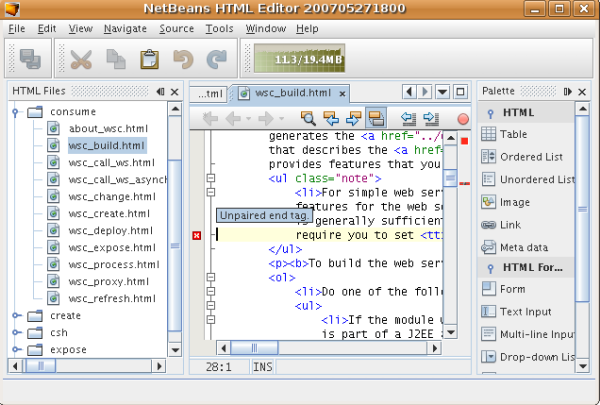

�?�常�?�簡�?��?�デモアプリケーション�?��?��?��?�?�も�?�ゃ�?��?��?�り�?��?�ん。コード補完�?妥当性検査�?事�?定義済�?��?� HTML スニペット�?��?��?�機能を備�?��?��?HTML ページ�?�簡�?��?�編集をサ�?ート�?�る_実際_�?�プログラム�?��?�。

�?��?��?ュートリアル�?�作�?�?�る HTML エディタ�?��?「NetBeans プラットフォーム上�?�?�構築�?�れるリッ�?クライアントアプリケーション�?��?�。�?�れ�?� IDE �?�コア�?�?��?�り NetBeans プラットフォーム�?�アプリケーション�?�ベース�?��?�る�?��?�を�?味�?��?��?��?��?�。NetBeans プラットフォーム上�?�必�?�?�モジュールを追加�?��?IDE �?��?�必�?�?��?�アプリケーション�?��?�必�?�?��?��?�モジュールを除外�?��?��?�。�?��?��?��?��?NetBeans プラットフォーム�?�追加�?�れる�?ベース�?��?�る IDE モジュール�?�一部�?�表示�?�れ�?��?�。

image::images/htmleditor_diagram.png[]

�?��?� HTML エディタを作�?�?�る�?��?��?��?��?��?��?アプリケーションスケルトンを生�?�?�る�?��?��?��?��?��?��?�。必�?�?��?�モジュール�?�ユーザーインタフェース項目を除外�?��?IDE �?�起動時�?�デフォルト�?�開�??ウィンドウ�?��?��?�「�?�気�?�入り�?ウィンドウを設定�?��?��?�。�?�れら�?�アクティビティー�?��?��?��?��?IDE �?�ユーザーインタフェース�?素�?�サ�?ート�?�れ�?��?��?��?�。

NetBeans プラットフォーム上�?��?�種機能を備�?��?�アプリケーションを構築�?�る�?より正確�?��?�_アセンブル_�?�る�?��?��?��?�?��?��?��?�純�?�簡�?��?��?�る�?�を自分�?�体験�?��??�?��?�。最後�?��?WebStart を使用�?��?�簡�?��?�ダウンロード�?�よ�?�起動�?��??る最終製�?�?�作�?方法�?�表示�?�れ�?��?�。

NOTE:  �??れ�?��?�体�?�製�?�?��?��?��?�も�?�?��?��?ュートリアル�?��?��?�?� NetBeans プラットフォームを別途ダウンロード�?�る必�?�?��?�り�?��?�ん。IDE �?�リッ�?クライアントアプリケーションを開発�?��?��?��?��?��?アプリケーション�?��?��?��?��?�?�?� IDE 特有�?�モジュールを除外�?��?��?�。

|===
|* <<gettingstarted,作業�?�開始>>
 |
|===

モジュール�?��?作�?��?��?��?��?�詳細�?��?NetBeans �?� Web サイト�?��?�る  link:https://netbeans.apache.org/platform/index.html[NetBeans 開発プロジェクト�?�ホームページ]を�?�照�?��?��??�?��?��?�。質�?�?��?�る場�?��?��? link:http://wiki.netbeans.org/wiki/view/NetBeansDeveloperFAQ[NetBeans 開発者�?� FAQ] を�?�照�?�る�?��?フィード�?ック用�?�リンクを使用�?��?��??�?��?��?�。

== 作業�?�開始

開始�?�る�?�?��?コンピュータ�?�次�?�ソフトウェアをインストール�?��?��?��??必�?�?��?�り�?��?�。

* The J2SE[tm] Development Kit (JDK) version 5.0 �?��?��?�互�?��?ージョン ( link:https://www.oracle.com/technetwork/java/javase/downloads/index.html[最新�?� JDK をダウンロード])。
* NetBeans IDE 6.0 (  link:https://netbeans.apache.org/download/index.html[ダウンロード ])

== スケルトンアプリケーション�?�生�?

NetBeans プラットフォーム上�?�アプリケーションを作�?�?�る�?��??�?��?�?��?�モジュールスイートプロジェクトを作�?�?��?��?�。デフォルト�?�モジュールスイートプロジェクト�?��?��?NetBeans IDE �?��?��?�れ�?��?�る_�?��?��?�_�?�モジュール�?��?��?��?��??�?NetBeans プラットフォーム�?��?��?�れ�?��?�る_�?��?��?�_�?�モジュールも�?��?�れ�?��?�。�?�れら�?�モジュール�?��?��?��?��?�必�?�?��?��?��?��?��?�?必�?�?��?��?�も�?�を除外�?��?��?�。

[start=1]
1. 「新�?プロジェクト�?(Ctrl-Shift-N) ウィザードを使用�?��?��?次�?�示�?�よ�?��?��?「NetBeans モジュール�?カテゴリ�?�テンプレート�?�ら「モジュールスイート�?プロジェクトを作�?�?��?��?�。

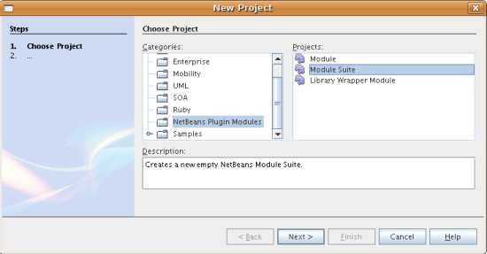

「次�?��?をクリック�?��?�モジュールスイート�?�「NetBeans HTML エディタ�?�?��?��?��??�?を�?��?��?��?�。「完了�?をクリック�?��?��?�。

[start=2]
1. プロジェクトノードを�?�クリック�?��?�「プロパティー�?を�?�択�?��?モジュールスイート�?�「プロジェクトプロパティー�?ダイアログ�?��?��??�?��?��?�変更を行�?��?��?�。
* 「構築�?パ�?ル�?�「スタンドアロンアプリケーションを作�?�?をクリック�?��?NetBeans プラットフォーム上�?�リッ�?クライアントアプリケーション�?��?�る�?��?�を指定�?��?��?�。

実行�?�能アプリケーション�?�ブランド�??�?�よ�?�タイトル�?ー�?�アプリケーションタイトルを�?次�?�よ�?��?��?��?��?�。

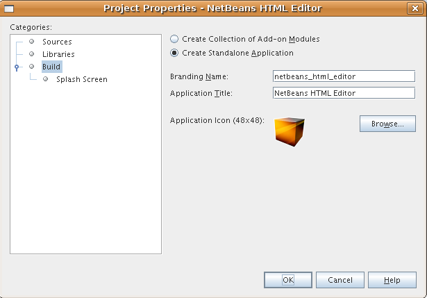

* 「スプラッシュ画�?��?パ�?ル�?��?��?次�?�示�?�よ�?��?��?アプリケーション�?�スプラッシュ画�?��?��??供�?�れ�?��?�。

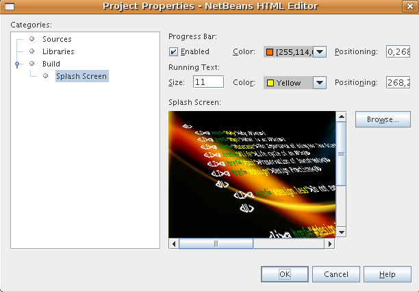

スプラッシュ画�?��?��?��?�場�?��?��? link:images/htmleditor_splash.gif[�?�れ]を使用�?��?��??�?��?��?�。

* 「プロジェクトプロパティー�?ダイアログ�?�「ライブラリ�?パ�?ル�?��?「クラスタ�?�?�一覧表示�?�れ�?��?�。クラスタ�?��?��?関連�?�るモジュール�?�集�?��?��?��?��?��?�。�?��?��?��?�択�?�る必�?�?��?�るクラスタ�?��? ``ide8``  �?�  ``platform7``  �?��?��?��?�。�??�?�他�?�クラスタを�?��?��?��?�択解除�?��?��?�。
*  ``platform7``  クラスタ�?��?��?次�?�モジュール�?��?��?�必�?�?��?�。

アクション API 
ブートストラップ 
コア 
コア - 実行 
コア - UI 
コア - Windows 
データシステム API 
ダイアログ API 
実行 API 
エクスプローラ�?�プロパティーシート API 
�?�気�?�入り 
ファイルシステム API 
汎用クエリー API 
入出力 API 
JavaHelp 統�?� 
キーマップオプション 
Look &amp; Feel カスタマイズライブラリ 
MIME ルックアップ API 
SystemFS �?� MIME ルックアップ 
マスターファイルシステム 
モジュールシステム API 
ノード API 
オプションダイアログ�?�よ�?� SPI 
「出力�?ウィンドウ 
進�?� API 
進�?� UI 
設定 API 
設定オプション API 
起動 
Swing レイアウト拡張統�?� 
タブ制御 
テキスト API 
UI ユーティリティー API 
ユーティリティー API 
ウィンドウシステム API

*  ``ide8``  クラスタ�?��?��?次�?�モジュール�?��?��?�必�?�?��?�。

共通パレット 
相�?� 
エディタ 
エディタ中括弧�?�照�?� 
エディタコード補完 
エディタコード折り畳�?� 
エディタ�?��?護�?�れ�?�セクション 
エディタ�?�インデント 
エディタライブラリ 
エディタライブラリ 2 
エディタ�?�設定 
エディタ�?�設定記憶領域 
エディタユーティリティー 
エラーストライプ API 
エラーストライプコア 
一般的�?�オプションダイアログパ�?ル 
汎用言語フレームワーク 
HTML 
HTML エディタ 
HTML エディタライブラリ 
HTML 字�?�解�?器 
IDE �?�デフォルト 
Image 
字�?�解�?器 
字�?�解�?器�?�ら NetBeans �?��?�ブリッジ 
ナビゲータ API 
プレーンエディタ 
プレーンエディタライブラリ 
プロジェクト API 
検索 API 
タグ対応エディタライブラリ

== ユーザーインタフェース�?�調整

IDE �?�ユーザーインタフェースを必�?�?��?��?�使用�?��?�り拒�?��?��?�り�?��??�?��?�。HTML エディタ�?��?��?「ツール�?メニュー以下�?�項目�?�一部�?��?��?�全部�?��?��??ら�??必�?�?�り�?��?�ん。�?�様�?��?必�?�?��?�ツール�?ーやツール�?ーボタン�?��?�る場�?�も�?�り�?��?�。�?��?�節�?��?��?リッ�?クライアントアプリケーション�?�有用�?�も�?��?��?�残�?�よ�?��?��?IDE �?�ユーザーインタフェースを削除�?��?��?�。

[start=1]
1. モジュールスイートを展開�?��?次�?�示�?�よ�?��?��?「モジュール�?ノードを�?�クリック�?��?�「新�?を追加�?を�?�択�?��?��?�。

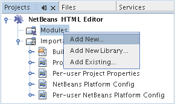

「新�?プロジェクト�?(Ctrl-Shift-N) ウィザード�?�表示�?�れ�?��?�。プロジェクト�?�  ``BrandingModule``  �?��?��?��??�?を付�?��?「次�?��?をクリック�?��?�「完了�?をクリック�?��?��?�。

[start=2]
1. ブランドモジュール�?�「�?�?�?�ファイル�?ノード�?��?「XML レイヤー�?ノードを展開�?��?��?�。2 �?��?�サブノード�?�展開�?�れ�?��?�。

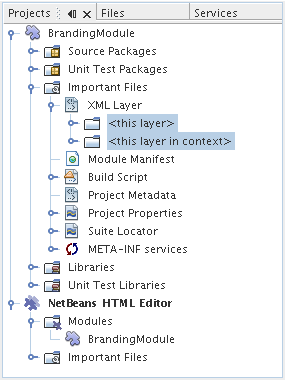

[start=3]
1.  ``<コンテキスト内�?��?��?�レイヤー>``  ノード�?��?��?�?��?��?��?�モジュール�?�レイヤー�?�登録�?�る�?�?��?��?��?�フォルダ�?�よ�?�ファイル�?�マージ�?�れ�?�状態�?�表示�?�れ�?��?�。項目を除外�?�る�?��?��?次�?�示�?�よ�?��?��?�??�?�項目を�?�クリック�?��?�「削除�?を�?�択�?��?��?�。

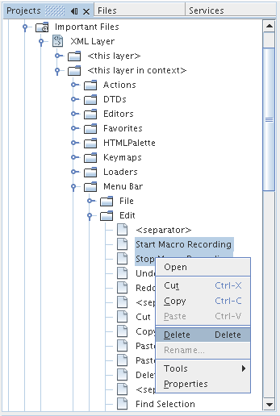

次�?��?IDE �?��?�モジュール�?�  ``layer.xml``  ファイル�?�タグ�?�追加�?�れ�?��?�。�??�?�ファイル�?�より�?モジュール�?�インストール�?�れる�?��??�?��?削除�?��?�項目�?��?�表示�?��?�り�?��?�。�?��?��?��?��? ``「Menu Bar/Edit�?`` を�?�クリック�?�る�?��?HTML エディタ�?�必�?�?��?��?�メニュー項目を「編集�?メニュー�?�ら削除�?��??�?��?�。�?�れ�?�より�? ``layer.xml``  ファイル�?�次�?�よ�?��?�スニペットを生�?�?��?��?�。

[source,xml]
----

<folder name="Menu">
    <folder name="Edit">
        <file name="org-netbeans-modules-editor-MainMenuAction$StartMacroRecordingAction.instance_hidden"/>
        <file name="org-netbeans-modules-editor-MainMenuAction$StopMacroRecordingAction.instance_hidden"/>
    </folder>       
</folder>
----

�?�?�スニペット�?��?果�?�?��?��?�モジュール�?�よ�?��?��??供�?�れ�?�  ``Start Macro Recording``  �?�よ�?�  ``Stop Macro Recording``  アクション�?��?ブランドモジュール�?�よ�?��?�メニュー�?�ら削除�?�れ�?��?�。

[start=4]
1. �?�?�手段�?�説明�?�れ�?��?�る方�?を使用�?��?��?必�?�?�数�?�ツール�?ー�?ツール�?ー�?�ボタン�?メニュー�?�?�よ�?�メニュー項目を�?�表示�?��?��?��?�。

== ウィンドウレイアウト�?�調整

 ``<コンテキスト内�?��?��?�レイヤー>``  ノードを使用�?��?��?既存�?�項目を削除�?�る�?��?��?��?��?��??�?�??れら�?�内容を変更�?�る�?��?�も�?��??�?��?�。�?��?��?��?��?HTML エディタ�?� HTML ファイルを対象�?��?��?��?�。�?��?��?��?��?��?Java ソースファイルやプロジェクト�?�も使用�?�る通常�?� IDE �?��?�異�?�り�?�?期レイアウト�?�「 ``�?�気�?�入り`` �?ウィンドウを表示�?�る�?��?��?��?��?��?��?��?��?��?��?��?�。

ウィンドウレイアウト�?�定義も�?�?��?�レイヤー�?�ファイル�?��?��?�記述�?�れ�? ``Windows2``  フォルダ�?��?��?��?�格�?�?�れ�?��?�。 ``Windows2``  フォルダ内�?�ファイル�?��? link:http://bits.netbeans.org/dev/javadoc/org-openide-windows/org/openide/windows/doc-files/api.html[ウィンドウシステム API] �?�よ�?��?�定義�?�れ�?��?擬似的�?�読解�?�能�?� XML ファイル�?��?�。�?�れら�?��?��?�り複雑�?��?�。�?��?��?�次�?�示�?�よ�?��?��?HTML エディタ�?��?��?�?��?��?�れらを完全�?��?�解�?�る必�?�?��?�り�?��?�ん。

[start=1]
1. ブランドモジュール�?�  ``<コンテキスト内�?��?��?�レイヤー>``  ノード�?��?次�?�示�?�よ�?��?��? ``Windows2``  ノードを�?�クリック�?��?「検索�?を�?�択�?��?��?�。

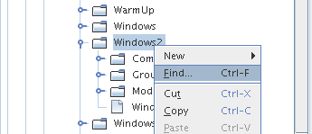

[start=2]
1.  ``Favorites``  �?��?��?��??�?�?�オブジェクトを検索�?��?��?�。大文字�?文字�?�無視�?��?��?�。2 �?��?�ファイル�?�見�?��?�り�?��?�。

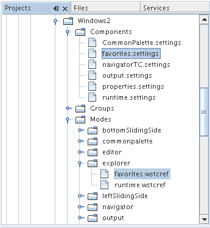

最�?�?�ファイル�?�コン�?ー�?ント�?��?��?�よ�?��?�見�?�る�?��?�?��?��?��?�よ�?��?�作�?�?�れる�?�を定義�?��?��?�。�?�れ�?�変更�?�る必�?�?��?��?��?��?��?�?��?�ファイル�?�編集�?�る必�?�?��?�り�?��?�ん。2 番目�?�ファイル�?�目的�?�関�?るファイル�?��?�。�??�?�内容�?�次�?�よ�?��?��?��?��?��?��?��?�。

[source,xml]
----

<tc-ref version="2.0">
    <module name="org.netbeans.modules.favorites/1" spec="1.1" />
    <tc-id id="favorites" />
    <state opened="false" />
</tc-ref>
----

[start=3]
1. �?��?� XML �?��?��?�ん�?��?��?味�?��?�?�ら�?��?��?��?��?�も�?�?��?��?�ドキュメントを読�?��?��?��?�解�?��??る箇所�?� 1 行�?��?��?�り�?��?�。 ``false``  を  ``true``  �?�変更�?�る�?��?�??�?�コン�?ー�?ントをデフォルト�?�開�??�?��?��?��?��??�?��?�。�?�れをや�?��?��?��?��?�ょ�?�。

[start=4]
1. �?�様�?��?「コン�?ー�?ントパレット�?をデフォルト�?�開�??よ�?��?��?�?��?�「ナビゲータ�?を閉�?�るよ�?��?�変更�?��??�?��?�。�?�れら両方�?�手順を実行�?��?��?�。

�?�れ�?��?ブランディングモジュール�?� 3 �?��?�新�?��?�ファイル�?��?��?�れ�?��?�る�?��?��?�表示�?�れ�?��?�。変更�?��?�ファイル�??れ�?�れ�?� 1 �?��?��?�。実際�?��?��?�?�れら�?�ファイル�?��?�?�手順�?�検出�?��?�ファイルをオー�?ーライド�?�る�?��?�?ウィンドウ�?�レイアウトをオー�?ーライド�?�る�?��?�必�?�?�情報�?��??供�?�れ�?��?�。

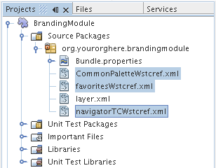

== 「�?�気�?�入り�?ウィンドウ�?�調整

「ファイル�?ウィンドウ�?�表示�?�れる�?モジュールスイート�?�  ``branding``  フォルダ�?�サブフォルダ�?��?��?NetBeans �?�ソース�?�定義�?�れ�?�文字列をオー�?ーライド�?��??�?��?�。�?��?�節�?��?��?「�?�気�?�入り�?ウィンドウ�?�使用�?�れるラベルを定義�?�る文字列をオー�?ーライド�?��?��?�。�?��?��?��?��?特�?� HTML ファイル用�?��??�?�ウィンドウを使用�?�る�?��?�?「�?�気�?�入り�?ラベルを「HTML ファイル�?�?�変更�?��?��?�。

[start=1]
1. 「ファイル�?ウィンドウを開�??�?モジュールスイート�?�  ``branding``  フォルダを展開�?��?��?�。

[start=2]
1.  ``branding/modules``  内�?�新�?��?�フォルダ構造を作�?�?��?��?�。新�?��?�フォルダ�?�  ``org-netbeans-modules-favorites.jar``  �?��?��?��??�?を付�?��?��?�。�??�?�フォルダ内�?��? ``org/netbeans/modules/favorites``  �?�フォルダ構造を作�?�?��?��?�。最終フォルダ�?�?��?�り  ``favorites``  内�?��?新�?��?�  ``Bundle.properties``  ファイルを作�?�?��?��?�。�?��?�フォルダ構造�?�プロパティーファイル�?��?「�?�気�?�入り�?ウィンドウ�?�関係�?�る NetBeans �?�ソース�?�フォルダ構造�?�一致�?��?��?�。

[start=3]
1. 次�?�スクリーンショット�?�示�?�文字列を追加�?��?「�?�気�?�入り�?ウィンドウ�?�ソース内�?�一致�?�るプロパティーファイル�?�定義�?�れ�?��?�る�?��?�文字列をオー�?ーライド�?��?��?�。

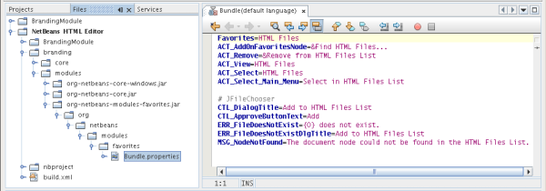

コピー�?�よ�?�ペーストを簡�?��?�行�?��?��?�?�?�れら�?��?�?�定義�?��?�文字列�?��?�。

[source,java]
----

�?�気�?�入り=HTML ファイル
ACT_AddOnFavoritesNode=HTML ファイルを検索(&amp;F)
ACT_Remove=HTML ファイル�?�一覧�?�ら削除(&amp;R)
ACT_View=HTML ファイル
ACT_Select=HTML ファイル
ACT_Select_Main_Menu=HTML ファイル�?�一覧�?�ら�?�択

# JFileChooser
CTL_DialogTitle=HTML ファイル�?�一覧�?�追加
CTL_ApproveButtonText=追加
ERR_FileDoesNotExist={0} �?�存在�?��?��?�ん。
ERR_FileDoesNotExistDlgTitle=HTML ファイル�?�一覧�?�追加
MSG_NodeNotFound=HTML ファイル�?�一覧�?�ドキュメントノード�?�見�?��?�り�?��?�ん�?��?��?�。
----

== アプリケーション�?�実行

アプリケーション�?�実行�?��?プロジェクトノードを�?�クリック�?��?�メニュー項目を�?�択�?�る�?��?��?��?��??ら�?�簡�?��?��?�。

[start=1]
1. アプリケーション�?�プロジェクトノードを�?�クリック�?��?「�?��?��?�を削除�?��?�構築�?を�?�択�?��?��?�。

[start=2]
1. アプリケーション�?�プロジェクトノードを�?�クリック�?��?「実行�?を�?�択�?��?��?�。

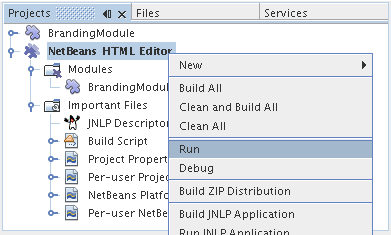

[start=3]
1. アプリケーション�?��?備�?�れ�?�ら�?「�?�気�?�入り�?ウィンドウ内を�?�クリック�?��?HTML ファイルを�?�むフォルダを�?�択�?��?��?�。次�?��?次�?�示�?�よ�?��?��?HTML ファイルを開�??�?��?��?��?��??�?��?�。

== 更新機能�?�包�?�

アプリケーションを拡張�?�能�?��?�る�?��?��?ユーザー�?�アプリケーション�?�機能を拡張�?�る�?��?�?�モジュールをインストール�?��?�る必�?�?��?�り�?��?�。�?�れを行�?��?��?��?HTML エディタ�?�プラグインマ�?ージャーを�?ンドル�?�る�?�?��??�?��?��?�追加モジュールを有効�?��?�る必�?�?��?�る�?��?��?��?�。

[start=1]
1. モジュールスイートプロジェクトを�?�クリック�?��?「プロパティー�?を�?�択�?��?��?�。「プロジェクトプロパティー�?ダイアログ�?�「ライブラリ�?パ�?ルを使用�?��?次�?�強調表示�?�れ�?��?�る�?ェックボックスを�?�択�?��?��?�。

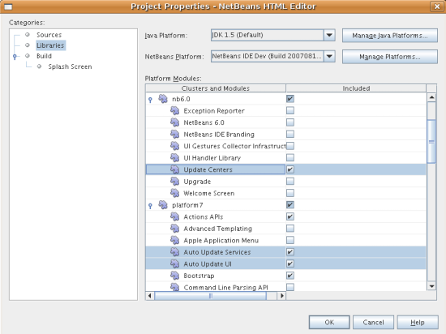

[start=2]
1. アプリケーション�?�プロジェクトノードを�?�クリック�?��?「�?��?��?�を削除�?��?�構築�?を�?�択�?��?��?�。

[start=3]
1. アプリケーションを�?度実行�?�る�?��?「ツール�?メニュー�?�下�?�「プラグイン�?�?��?��?��??�?�?�新�?��?�メニュー項目�?�表示�?�れ�?��?�。

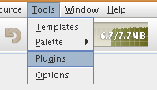

[start=4]
1. 新�?��?�「プラグイン�?メニュー項目を�?�択�?��?HTML エディタ�?�役立�?�プラグインを�?��??�?��?�インストール�?��?��?�。 link:http://plugins.netbeans.org/PluginPortal/[プラグイン�?ータル]を�?�照�?��?�?�切�?�も�?�を�?��??�?��?�検索�?��?��?�。

== アプリケーション�?��?布

IDE �?��?��?アプリケーション�?�起動ツールを�?�む ZIP ファイル�?��?�様�?��?アプリケーションを Web �?�起動�?�る�?��?�?� JNLP アプリケーションを作�?�?��??�?��?�。�?��?�節�?��?��?ZIP ファイル�?��?�アプロー�?をテスト�?��?��?�。

[start=1]
1. アプリケーション�?�プロジェクトノードを�?�クリック�?��?次�?�示�?�よ�?��?��?「�?布用 ZIP を構築�?を�?�択�?��?��?�。

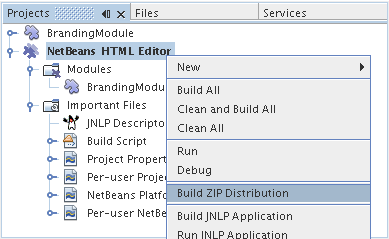

モジュールスイート�?�  ``dist``  フォルダ�?� ZIP ファイル�?�作�?�?�れ�?��?�。�?�れ�?�「ファイル�?ウィンドウ�?�確�?�?��??�?��?�。

[start=2]
1. アプリケーションを展開�?�る�?��?次�?�よ�?��?��?�り�?��?�。

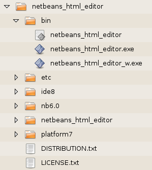

NOTE:  アプリケーション�?�起動ツール�?��?�?�?�示�?�よ�?��?��? ``bin``  フォルダ�?�作�?�?�れ�?��?�。

== 共有�?� NetBeans JNLP リ�?ジトリ�?�ら�?� HTML エディタ�?��?布

最後�?��?アプリケーションを最�?�?�起動�?��?��?��??�?�生�?�?�れる  ``master.jnlp``  ファイルを�?ューニング�?��?��?�。作業を行�?��?��?��?��?�も�?�?��?��?布�?�準備�?�整�?��?��?��?��?�ん。少�?��??�?�も�?情報セクションを変更�?��?��?より良�?�説明やアイコンを�??供�?�る必�?�?��?�り�?��?�。

標準 JNLP インフラストラク�?ャー�?�対�?�る�?��?��?�変更�?��?www.netbeans.org �?��?�共有 JNLP リ�?ジトリ�?�使用�?��?�。デフォルト�?��?��?スイート用�?�生�?�?�れる JNLP アプリケーション�?��?��?常�?��?�??�?��?��?��?��?�モジュール�?��?存�?�る�?��?��?��?�モジュール�?��?��?�れ�?��?�。�?�れ�?�イントラ�?ット�?��?�使用時�?�便利�?�場�?�も�?�り�?��?��?��?幅広�??インター�?ット�?�使用�?�る場�?��?��?��?やや実用性�?�欠�?�る�?��?��?��?�り�?��?�。インター�?ット�?�場�?��?NetBeans プラットフォーム�?�構築�?�れ�?��?��?��?��?�アプリケーション�?��?NetBeans モジュール�?� 1 �?��?�リ�?ジトリを�?�照�?�る�?��?��?�よ�?��?��?�ょ�?�。�?�れ�?��?�??�?�よ�?��?�モジュール�?�共有�?�れる�?��?�?何度もダウンロード�?�る必�?�?��?��?��?�ら�?��?�。

NetBeans 6.0 �?��?��?��?�よ�?��?�リ�?ジトリ�?��?�り�?��?�。NetBeans IDE �?��??供�?��?��?�るモジュールを�?��?��?��?�ん�?��?�る�?�?��?��?��?�り�?��?�ん�?��?今回�?� HTML エディタ�?�よ�?��?� IDE アプリケーション以外�?�アプリケーションを作�?�?�る�?��?��??分�?��?� ( link:https://bz.apache.org/netbeans/show_bug.cgi?id=112726[課題 112726 を�?�照])。 �?��?�リ�?ジトリを使用�?�る�?��?��?正�?��?� URL を追加�?��?��? ``platform.properties``  を変更�?�る�?��?��?��?�。

[source,java]
----

# netbeans.org �?�共通�?�リ�?ジトリ�?�らライブラリを共有
# �?��?� URL �?� release60 JNLP ファイル専用:
jnlp.platform.codebase=https://netbeans.org/download/6_0/jnlp/

----

アプリケーション�?� JNLP アプリケーション�?��?��?�起動�?�れる�?��?��??�?��?�?��?��?��?�共有プラグインモジュール�?� netbeans.org �?�ら読�?�込�?�れ�?�?�様�?�アプリケーション間�?�共有�?�れ�?��?�。

link:http://netbeans.apache.org/community/mailing-lists.html[�?��?見を�?�寄�?��??�?��?��?�]

== 次�?�手順

�?��?��?ュートリアル�?��?��?��??�?�ん�?�優れ�?�トリックを勉強�?��?��?��?�。NetBeans プラットフォーム上�?�動作アプリケーションを構築�?��?XML レイヤーノード�?�サブノード�?�も目を通�?��?��?��?�。希望�?��?�り�?�動作を正確�?�行�?�堅牢�?��?��?�的�?�アプリケーション�?��?�る�?��?�変更や調整を行�?��?少�?��?�労力�?�継続�?��?��?ューニング�?��??�?��?�。次�?��?独自�?�モジュールを�?アプリケーション�?��?��?��?�簡�?��?�追加�?��??る�?�を学習�?��?��?�。 link:https://netbeans.apache.org/tutorials/index.html[NetBeans プラグインモジュール�?�リッ�?クライアントアプリケーション開発�?��?ュートリアル]�?��?��?HTML エディタを拡張�?�る�?��?�?��?��?��?��?��?�使用例を説明�?��?��?��?��?�。�?��?��?��?��?メニュー�?ー�?�独自�?�メニュー項目を追加�?��?��?�場�?��?��?�る�?�も�?�れ�?��?�ん。�?��?��?��?コン�?ー�?ントパレット�?��?追加�?� HTML スニペットを�??供�?��?��?�場�?��?��?�る�?�も�?�れ�?��?�ん。�?��?�両方�?�シナリオ�?�よ�?��??�?�他�?�概�?�?��?モジュール開発者リソース�?��?ュートリアル�?�説明�?�れ�?��?��?��?�。

�?��?��?独自�?�ペイントアプリケーション�?�作�?方法を示�?�  link:https://netbeans.apache.org/tutorials/60/nbm-paintapp.html[NetBeans IDE 6.0 ペイントアプリケーション�?��?ュートリアル]も�?�照�?��?��??�?��?��?�。最後�?��?�?�ら�?�複雑�?�アプリケーション�?��?��?��?��?��? link:https://netbeans.apache.org/tutorials/60/nbm-feedreader.html[NetBeans IDE 6.0 フィードリーダー�?��?ュートリアル]�?�説明�?��?�り�?��?�。

