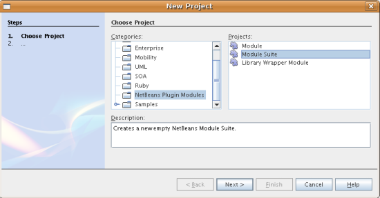
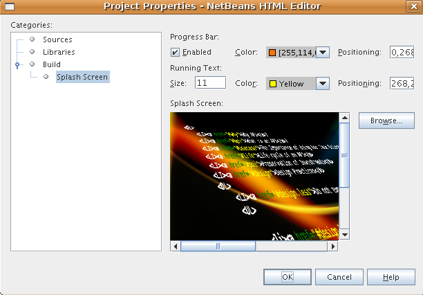
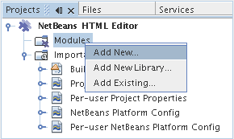
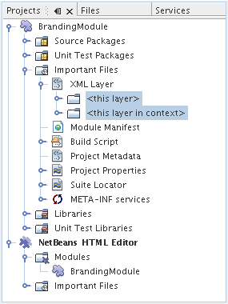
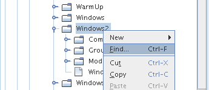
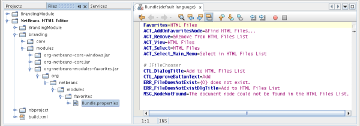
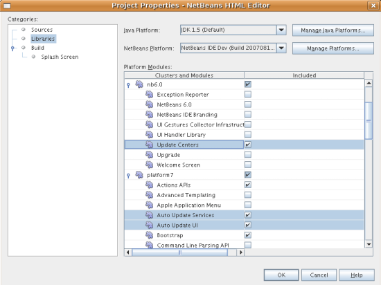
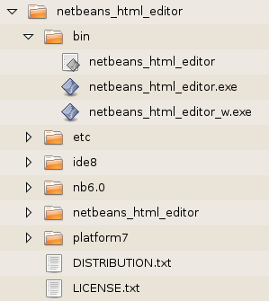

// 
//     Licensed to the Apache Software Foundation (ASF) under one
//     or more contributor license agreements.  See the NOTICE file
//     distributed with this work for additional information
//     regarding copyright ownership.  The ASF licenses this file
//     to you under the Apache License, Version 2.0 (the
//     "License"); you may not use this file except in compliance
//     with the License.  You may obtain a copy of the License at
// 
//       http://www.apache.org/licenses/LICENSE-2.0
// 
//     Unless required by applicable law or agreed to in writing,
//     software distributed under the License is distributed on an
//     "AS IS" BASIS, WITHOUT WARRANTIES OR CONDITIONS OF ANY
//     KIND, either express or implied.  See the License for the
//     specific language governing permissions and limitations
//     under the License.
//

= Tutorial de início rápido da Plataforma NetBeans 6.0
:jbake-type: platform_tutorial
:jbake-tags: tutorials 
:jbake-status: published
:syntax: true
:source-highlighter: pygments
:toc: left
:toc-title:
:icons: font
:experimental:
:description: Tutorial de início rápido da Plataforma NetBeans 6.0 - Apache NetBeans
:keywords: Apache NetBeans Platform, Platform Tutorials, Tutorial de início rápido da Plataforma NetBeans 6.0

Este tutorial demonstra como construir um Editor HTML, sem qualquer codificação Java. No fim deste tutorial, você terá um Editor HTML que se parece com este:

image::images/htmleditor_html_editor_60.png[]

Embora seja uma aplicação demonstrativa muito simples, ela não é um brinquedo! É um programa _real_ que dá suporte a edição fácil de páginas HTML, com recursos como auto-completar de código, validação e fragmentos de código HTML predefinidos.

O Editor HTML que você cria neste tutorial é uma aplicação rich-client concluída "sobre a Plataforma NetBeans". O que isso significa é que o núcleo do IDE, que _[.underline]#é#_ a Plataforma NetBeans, será a base da sua aplicação. Sobre a Plataforma NetBeans, você adiciona os módulos necessários e exclui aqueles de que o IDE precisa mas que a sua aplicação não. Aqui você vê alguns dos módulos do IDE, adicionados à Plataforma NetBeans, que é a sua base:

image::images/htmleditor_diagram.png[]

Criar esse Editor HTML significa gerar um esqueleto de aplicação, excluindo os módulos e os itens de interface do usuário de que você não precisa e, em seguida, definir a janela Favoritos como a janela que será aberta por padrão quando o IDE se iniciar. Todas essas atividades são suportadas pelos elementos de interface do usuário no IDE.

Você verá por si mesmo como é simples e fácil construir, ou para ser mais preciso, _montar_ uma aplicação completa sobre a Plataforma NetBeans. No fim, é mostrado como tornar o produto final facilmente baixável e iniciável usando o WebStart.

*Observação:* embora seja um produto separado, não é necessário baixar a Plataforma NetBeans separadamente por causa deste tutorial. Você desenvolverá a aplicação rich-client no IDE e, em seguida, excluirá os módulos que são específicos do IDE, mas que são supérfluos para a sua aplicação.

|===
|* <<gettingstarted,Guia de introdução>>
 |
|===

Para obter mais informações sobre como trabalhar com módulos, consulte a  link:https://netbeans.apache.org/platform/index.html[Home page do projeto de desenvolvimento do NetBeans] no site do NetBeans. Se você tiver dúvidas, visite as  link:http://wiki.netbeans.org/wiki/view/NetBeansDeveloperFAQ[Perguntas freqüentes do desenvolvedor do NetBeans] ou use o link de comentários na parte inferior desta página.

== Guia de introdução

Antes de começar, você deve instalar o seguinte software no seu computador:

* O J2SE(TM) Development Kit (JDK), versão 5.0 ou compatível ( link:https://www.oracle.com/technetwork/java/javase/downloads/index.html[baixe o JDK mais recente]).
* NetBeans IDE 6.0 ( link:https://netbeans.apache.org/download/index.html[download]).

== Gerando a aplicação de esqueleto

Ao criar uma aplicação na Plataforma NetBeans, o primeiro passo é criar um projeto de conjunto de módulos. O projeto de conjunto de módulos padrão inclui _todos_ os módulos incluídos na Plataforma NetBeans, assim como _todos_ os módulos incluídos no NetBeans IDE. Já que não precisamos de todos esses módulos, excluiremos os que não são necessários.

[start=1]
1. Usando o assistente para Novo projeto (Ctrl-Shift-N), crie um Projeto de conjunto de módulos a partir do modelo na categoria de módulos do NetBeans, como mostrado abaixo:

Clique em Próximo e chame o conjunto de módulos de "Editor HTML do NetBeans". Clique em Terminar.

[start=2]
1. Clique com o botão direito do mouse no nó do projeto, escolha Propriedades e, em seguida, faça algumas alterações na caixa de diálogo Propriedades do projeto do conjunto de módulos:
* No painel Construir, clique em "Criar aplicação independente" para especificar que vai ser uma aplicação rich-client sobre a Plataforma NetBeans.

Verifique se você gosta do nome da marca do executável e do título da aplicação da barra de título, como mostrado abaixo:

image::images/htmleditor_application_panel-60.png[]

* No painel Tela de abertura, forneça a tela de abertura da aplicação, como mostrado abaixo:

Se você não tiver uma tela de abertura, use  link:images/htmleditor_splash.gif[esta].

* No painel Bibliotecas da caixa de diálogo Propriedades do projeto, você vê uma lista de "clusters". Um cluster é uma coleção de módulos relacionados. Os únicos clusters que precisam ser selecionados são  ``ide8``  e  ``platform7`` . Desmarque todos os outros clusters.
* No cluster  ``platform7`` , você precisa somente dos seguintes módulos:

APIs de ação 
Bootstrap 
Núcleo 
Núcleo - Execução 
Núcleo - UI 
Núcleo - Janelas 
API de Sistema de dados 
API das caixas de diálogo 
API de Execução 
API do explorer e folha de propriedades 
Favoritos 
API do sistema de arquivos 
Consultas Gerais da API 
APIs de E/S 
Integração com o JavaHelp 
Opções do mapa de teclas 
Biblioteca de Personalização de Aparência &amp; Funcionalidade 
API de pesquisa MIME 
Pesquisa MIME em SystemFS 
Sistema de arquivos mestre 
API do módulo de sistema 
API de nós 
SPI e Diálogo de opções 
Janela de saída 
API de progresso 
UI de progresso 
API de configurações 
API das opções de configuração 
Inicialização 
Integração das extensões de layout do Swing 
Controle de Abas 
API de Texto 
API de utilitários da IU 
API de utilitários 
API do sistema de janelas

* No cluster  ``ide8`` , somente os módulos seguintes são necessários:

Paleta comum 
Comparar 
Editor 
Coincidência de colchetes do editor 
Auto-completar de código do editor 
Dobramento de código do editor 
Seções protegidas do editor 
Recuo do editor 
Biblioteca do editor 
Biblioteca2 do editor 
Configurações do editor 
Armazenamento de configurações do editor 
Utilitários do editor 
API da faixa de erros 
Núcleo da faixa de erros 
Painéis da caixa de diálogo de opções gerais 
Framework de linguagens genéricas 
HTML 
Editor HTML 
Biblioteca do editor HTML 
Analisador léxico HTML 
Padrões IDE 
Imagem 
Analisador léxico 
Analisador léxico para ponte NetBeans 
API do navegador 
Editor simples 
Biblioteca do editor simples 
API de projeto 
API de pesquisa 
Biblioteca de editores baseados em marcas

== Otimizando a interface de usuário

Você pode manter ou rejeitar o quanto quiser da interface de usuário do IDE. Seu Editor HTML provavelmente não precisa de um ou todos os itens do menu Ferramentas. Semelhantemente, talvez haja barras de ferramentas ou botões da barra de ferramentas que não sejam necessários. Nesta seção, você remove a interface de usuário do IDE até que haja um subconjunto que seja útil para a sua aplicação rich-client.

[start=1]
1. Expanda o conjunto de módulos, clique com o botão direito do mouse no nó Módulos e escolha Adicionar novo, como mostrado abaixo:

O assistente para Novo projeto (Ctrl-Shift-N) aparece. Nomeie o projeto de  ``BrandingModule`` , clique em Próximo e, em seguida, clique em Terminar.

[start=2]
1. No nó Arquivos importantes do módulo de marca, expanda o nó Camada XML. Dois subnós são expostos:

[start=3]
1. No nó  ``<esta camada em contexto>`` , o IDE mostra uma visualização mesclada de todas as pastas e arquivo que todos os módulos registram em suas camadas. Para excluir os itens, você pode clicar com o botão direito do mouse neles e escolher 'Excluir', como mostrado abaixo:

image::images/htmleditor_this-layer-in-context-60.png[]

O IDE adiciona marcas ao arquivo  ``layer.xml``  do módulo que, quando o módulo é instalado, oculta os itens que você excluiu. Por exemplo, clicando com o botão direito do mouse em  ``Barra de menus/Editar`` , você pode remover itens de menu do menu Editar que não são necessários para o Editor HTML. Fazendo isso, você gera trechos de código como o seguinte no arquivo  ``layer.xml`` :

[source,xml]
----

<folder name="Menu">
    <folder name="Edit">
        <file name="org-netbeans-modules-editor-MainMenuAction$StartMacroRecordingAction.instance_hidden"/>
        <file name="org-netbeans-modules-editor-MainMenuAction$StopMacroRecordingAction.instance_hidden"/>
    </folder>       
</folder>
----

O resultado do trecho de código acima é que as ações  ``Iniciar gravação de macro``  e  ``Parar gravação de macro``  fornecidas por outro módulo são removidas do menu por seu módulo de marca.

[start=4]
1. Use a abordagem descrita na etapa anterior para ocultar as barras de ferramentas, os botões da barra de ferramentas, os menus e os itens de menu que você desejar.

== Otimizando o layout da janela

Usando o nó  ``<esta camada em contexto>`` , você pode não somente excluir itens existentes, mas também pode alterar o conteúdo deles. Por exemplo, o Editor HTML trabalha em arquivos HTML, sendo assim, ao contrário do IDE regular, que trabalha com arquivos-fonte Java e projetos, faz sentido mostrar a janela  ``Favoritos``  no layout inicial.

A definição do layout da janela também é descrita como arquivos em camadas, tudo armazenado na pasta  ``Janelas2`` . Os arquivos na pasta  ``Janelas2``  são arquivos XML pseudo-legíveis por humanos definidos pelas  link:http://bits.netbeans.org/dev/javadoc/org-openide-windows/org/openide/windows/doc-files/api.html[APIs do sistema de janelas]. Eles são complexos mas a boa notícia é que, para fins do nosso Editor HTML, não é necessário compreendê-los completamente, como mostrado abaixo.

[start=1]
1. Em seu nó  ``<esta camada em contexto>``  do módulo de marca, clique com o botão direito do mouse no nó  ``Janelas2``  e escolha Localizar, como mostrado abaixo:

[start=2]
1. Procure por um objeto chamado  ``Favoritos`` , ignorando o uso de maiúsculas/minúsculas. Você encontrará dois arquivos:

image::images/htmleditor_find-favorites2-60.png[]

O primeiro arquivo define a aparência do componente e como ele é criado. Como o componente não precisa ser alterado, não é necessário modificar o arquivo. O segundo é mais interessante para os seus propósitos, ele contém o seguinte:

[source,xml]
----

<tc-ref version="2.0">
    <module name="org.netbeans.modules.favorites/1" spec="1.1" />
    <tc-id id="favorites" />
    <state opened="false" />
</tc-ref>
----

[start=3]
1. Embora a maior parte do XML seja criptografada, existe uma linha que parece promissora — sem precisar ler nenhum tipo de documentação, é provável que alterar  ``false``  para  ``true``  tornará o componente aberto por padrão. Faça isso agora.

[start=4]
1. De uma forma semelhante, você pode alterar a Paleta do componente para que ela abra por padrão, e o Navegador para que ele se feche. Realize estas etapas.

Agora você deve ver que o seu módulo de marca contém três novos arquivos, um para cada um dos arquivos que você alterou. Na verdade, esses arquivos substituem aqueles que você encontrou nas etapas anteriores, sendo que agora você forneceu as informações necessárias para substituir o layout da janela:

image::images/htmleditor_wstcrefs-overridden-60.png[]

== Otimizando a janela Favoritos

Nas subpastas de uma pasta de  ``marca``  do conjunto de módulos, que esteja visível na janela Arquivos, você pode substituir as strings definidas nos códigos-fonte do NetBeans. Nesta seção, você substituirá as strings que definem os rótulos usados na janela Favoritos. Por exemplo, alteraremos o rótulo "Favoritos" para "Arquivos HTML", pois usaremos essa janela especificamente para arquivos HTML.

[start=1]
1. Abra a janela Arquivos e expanda a pasta de  ``marca``  do conjunto de módulos.

[start=2]
1. Crie uma nova estrutura de pastas em  ``marca/módulos`` . A nova pasta deve se chamar  ``org-netbeans-modules-favorites.jar`` . Dentro dessa pasta, crie uma hierarquia de pastas  ``org/netbeans/módulos/favoritos`` . Dentro da pasta final, ou seja,  ``favoritos`` , crie um novo arquivo  ``Bundle.properties`` . Essa estrutura de pastas e arquivo de propriedades correspondem à estrutura de pastas nos códigos-fonte do NetBeans relacionados à janela Favoritos.

[start=3]
1. Adicione as strings mostradas na captura de tela abaixo para substituir as mesmas strings definidas no arquivo de propriedades correspondentes nos códigos-fonte da janela Favoritos:

Para facilitar a cópia e colagem, essas são as strings definidas acima:

[source,java]
----

Favorites=HTML Files
ACT_AddOnFavoritesNode=&amp;Find HTML Files...
ACT_Remove=&amp;Remove from HTML Files List
ACT_View=HTML Files
ACT_Select=HTML Files
ACT_Select_Main_Menu=Select in HTML Files List

# JFileChooser
CTL_DialogTitle=Add to HTML Files List
CTL_ApproveButtonText=Add
ERR_FileDoesNotExist={0} does not exist.
ERR_FileDoesNotExistDlgTitle=Add to HTML Files List
MSG_NodeNotFound=The document node could not be found in the HTML Files List.
----

== Executando o aplicativo

Executar a sua aplicação é tão simples quando clicar com o botão direito do mouse no nó do projeto e escolher um item de menu.

[start=1]
1. Clique com o botão direito do mouse no nó do projeto da aplicação e escolha Limpar e construir tudo.

[start=2]
1. Clique com o botão direito do mouse no nó do projeto da aplicação e escolha Executar:

image::images/htmleditor_run-app-60.png[]

[start=3]
1. Depois que a aplicação é implantada, você pode clicar com o botão direito do mouse dentro da janela Favoritos e escolher uma pasta contendo arquivos HTML e, em seguida, abrir um arquivo HTML, como mostrado abaixo:

image::images/htmleditor_html_editor_60.png[]

== Incluindo a funcionalidade de atualização

Para estender sua aplicação, você deve permitir que os usuários instalem módulos para aprimorar a funcionalidade da aplicação. Para fazer isso, você precisa simplesmente ativar alguns módulos extras, que empacotarão o gerenciador de plug-ins com o seu Editor HTML.

[start=1]
1. Clique com o botão direito do mouse no projeto de conjunto de módulos e escolha Propriedades. Na caixa de diálogo Propriedades do projeto, use o painel Bibliotecas e marque as caixas de verificação que são realçadas abaixo:

[start=2]
1. Clique com o botão direito do mouse no nó do projeto da aplicação e escolha Limpar e construir tudo.

[start=3]
1. Execute a aplicação e observe que agora você tem um novo item de menu, chamado "Plug-ins", no menu Ferramentas:

image::images/htmleditor_auto-update2-60.png[]

[start=4]
1. Escolha o nome item de menu Plug-ins e instale alguns plug-ins que sejam úteis para seu Editor HTML. Navegue no  link:http://plugins.netbeans.org/PluginPortal/[Portal Plug-in] para localizar alguns que sejam adequados.

== Distribuindo a aplicação

O IDE pode criar uma aplicação JNLP, para Web, iniciando a sua aplicação, assim como um arquivo ZIP, que inclui o iniciador da aplicação. Nesta seção, examinamos a última abordagem.

[start=1]
1. Clique com o botão direito do mouse no nó do projeto da aplicação e escolha Construir distribuição de ZIP, como mostrado abaixo:

image::images/htmleditor_zip-app-60.png[]

Um arquivo ZIP é criado na pasta  ``dist``  do conjunto de módulos, que você pode ver na janela Arquivos.

[start=2]
1. Depois de descompactar a aplicação, você deve ver o seguinte:

*Observação:* o iniciador da aplicação é criado na pasta  ``bin`` , como mostrado acima.

== Distribuindo o Editor HTML por meio do Repositório JNLP compartilhado do NetBeans

Finalmente, vamos ajustar o arquivo  ``master.jnlp``  que é gerado na primeira vez em que você inicia a aplicação. Embora ele faça o trabalho, ele não está pronto para distribuição. Pelo menos, você precisa alterar a seção de informações para fornecer melhores descrições e ícones.

Outra alteração na infra-estrutura JNLP padrão é o uso de um repositório JNLP compartilhado em www.netbeans.org. Por padrão, a aplicação JNLP gerada para um conjunto sempre contém todos os seus módulos, assim como os módulos do qual ela depende. Isso pode ser útil para uso de intranet, mas é um pouco menos prático para uso amplo na internet. Na internet, é muito melhor que todos as aplicações construídas na Plataforma NetBeans façam referência a um repositório de módulos do NetBeans, o que significa que tais módulos são compartilhados e não precisam ser baixados mais de uma vez.

Existe um repositório como tal para NetBeans 6.0. Ele não contém todos os módulos que o NetBeans IDE possui, mas ele contém o suficiente para criar aplicações não-IDE como o nosso Editor HTML. ( link:https://bz.apache.org/netbeans/show_bug.cgi?id=112726[Consulte o problema 112726.]) Para usar o repositório, você só precisa modificar  ``platform.properties`` , adicionando a URL correta:

[source,java]
----

# share the libraries from common repository on netbeans.org
# this URL is for release60 JNLP files:
jnlp.platform.codebase=https://netbeans.org/download/6_0/jnlp/

----

Assim que a aplicação é iniciada como uma aplicação JNLP, todos os seus módulos de plug-in compartilhados são carregados a partir de netbeans.org e compartilhados com as aplicações que fazem o mesmo.

link:http://netbeans.apache.org/community/mailing-lists.html[Envie-nos seus comentários]

== Próximas etapas

Agora que você aprendeu vários truques interessantes e possui uma aplicação funcional construída na Plataforma NetBeans, é possível observar ainda mais os subnós do nó Camada XML. Sem muito trabalho, você pode continuar ajustando a sua aplicação, removendo-a e otimizando-a até ter uma aplicação sólida, simplificada, que faz exatamente o que você deseja que ela faça. Em seguida, descubra como é fácil adicionar seus próprios módulos à sua aplicação. Os  link:https://netbeans.apache.org/tutorials/index.html[Tutoriais para módulo do NetBeans (Plug-in) e desenvolvimento de aplicação rich-client] mostram uma ampla variedade de casos de uso para estender o Editor HTML. Por exemplo, talvez você queira adicionar seus próprios itens de menu na barra de menus. Ou talvez você queira fornecer trechos de código HTML adicionais na paleta do componente. Ambos cenários, e muito mais, são destacados nos tutoriais nos Recursos do desenvolvedor de módulo.

Consulte também o  link:https://netbeans.apache.org/tutorials/60/nbm-paintapp.html[Tutorial da aplicação Paint da Plataforma NetBeans 6.0], que mostra como criar sua própria aplicação Paint. Finalmente, uma aplicação um pouco mais complexa é fornecida no  link:https://netbeans.apache.org/tutorials/60/nbm-feedreader.html[Tutorial do leitor de alimentação da Plataforma NetBeans 6.0].

