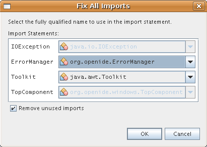
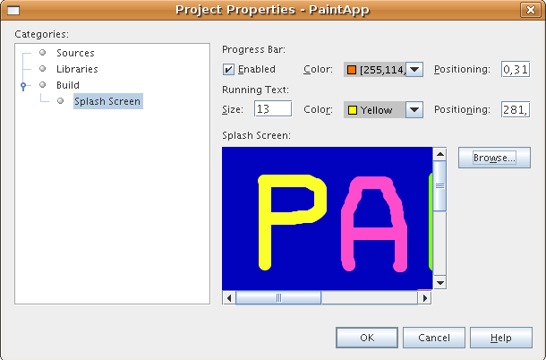

// 
//     Licensed to the Apache Software Foundation (ASF) under one
//     or more contributor license agreements.  See the NOTICE file
//     distributed with this work for additional information
//     regarding copyright ownership.  The ASF licenses this file
//     to you under the Apache License, Version 2.0 (the
//     "License"); you may not use this file except in compliance
//     with the License.  You may obtain a copy of the License at
// 
//       http://www.apache.org/licenses/LICENSE-2.0
// 
//     Unless required by applicable law or agreed to in writing,
//     software distributed under the License is distributed on an
//     "AS IS" BASIS, WITHOUT WARRANTIES OR CONDITIONS OF ANY
//     KIND, either express or implied.  See the License for the
//     specific language governing permissions and limitations
//     under the License.
//

= Руководство по разработке приложений для рисования на платформе NetBeans
:jbake-type: platform_tutorial
:jbake-tags: tutorials 
:jbake-status: published
:syntax: true
:source-highlighter: pygments
:toc: left
:toc-title:
:icons: font
:experimental:
:description: Руководство по разработке приложений для рисования на платформе NetBeans - Apache NetBeans
:keywords: Apache NetBeans Platform, Platform Tutorials, Руководство по разработке приложений для рисования на платформе NetBeans

В этом руководстве представлены базовые аспекты разработки функционально насыщенных клиентских приложений на платформе NetBeans. Разработка приложений на платформе NetBeans подразумевает использование при разработке возможностей ядра среды IDE NetBeans. Все модули среды IDE, которые не требуются для разрабатываемого приложения, будут исключены, тогда как необходимые модули будут использоваться. Использование уже готовых компонентов ядра среды IDE экономит значительное количество времени и сил.

== Введение в разработку приложения для рисования

Целью этого руководства является быстрая подготовка читателя к практической работе. Необходимо будет создать и установить простое приложение на платформе NetBeans. Это приложение позволит пользователю рисовать на экране и сохранять результаты:

image::images/paintapp_result-without-menus-60.png[]

Такая начальная версия далека от полнофункционального приложения для рисования, но, тем не менее, она иллюстрирует самый простой вариант создания приложения на базе платформы NetBeans.

*Примечание: Если необходимо получить дополнительные сведения о модулях NetBeans, а не о функционально насыщенных клиентских приложениях, рекомендуется обратиться к руководству *  link:nbm-google_ru.html[Быстрое начало работы с подключаемыми модулями в среде NetBeans].

В настоящем руководстве создается приложение на основе шаблона, поставляемого со средой IDE. Для просмотра готового приложения или разрешения проблем, возникающих при работе с этим руководством, в окне мастера создания проекта можно открыть шаблон по пути, указанному ниже:

image::images/paintapp_sample-in-new-project-60.png[]

== Создание приложения для рисования

В этом разделе необходимо будет создать структуру будущего приложения. Для начала потребуется создать проект пакета модулей, представляющий собой приложение. Приложение зависит от библиотеки, поэтому необходимо будет создать проект для модуля-обертки библиотеки, содержащего соответствующий файл JAR. В завершение будет создан проект модуля, содержащий код.

=== Создание пакета модулей

Пакет модулей является эквивалентом приложения и представляет собой ряд модулей, используемых совместно в целях достижения определенных результатов. Кроме того, он позволяет назначать собственный экран заставки (стиль), имя приложения, а также тип и количество необходимых модулей NetBeans. Можно также воспользоваться такими возможностями, как создание дистрибутива в формате ZIP и построение приложения на базе Java WebStart (JNLP), являющимися важными средствами распространения приложения среди других пользователей.

[start=1]
1. Выберите "File > New Project". В области "Categories" выберите "NetBeans Modules". В области "Projects" выберите "Module Suite Project" и нажмите кнопку "Next".

[start=2]
1. На экране "Name and Location" введите  ``PaintApp``  в поле "Project Name". В поле "Project Location" укажите любой каталог на компьютере. Не снимайте флажок "Set as Main Project":

Нажмите кнопку "Finish".

В среде IDE откроется новый проект пакета модулей. Он содержит один узел в окне "Project". Этот узел "Modules" предназначен для добавления проектов модуля и проектов для модуля-обертки библиотеки к проекту пакета модулей вручную. При помощи мастера создания проектов модулей или мастера создания модулей-оберток библиотек созданный модуль может быть автоматически добавлен к проекту пакета модулей.

=== Создание проекта модуля-обертки библиотеки

Модуль-обертка библиотеки – это модуль, файл JAR которого содержит не код, а только указатель на библиотеку. Благодаря этому библиотека становится модулем NetBeans; поэтому к ней применяются все защитные функции системы загрузчика классов NetBeans без изменения первоначального файла JAR. В дальнейшем создаваемое приложение зависит от библиотеки так же, как если бы библиотека была обычным модулем NetBeans. При появлении новых версий библиотеки в дистрибутиве изменяется только единственный файл модуля NetBeans (NBM) для библиотеки оберток.

NOTE:  К преимуществам построения приложений на платформе NetBeans относится интерфейс пользователя на базе стандартного инструментария для разработки интерфейса пользователя для Java – Swing. Так как Swing используется в течение долгого времени, существует множество компонентов, которые можно использовать в создаваемом приложении. В этом руководстве применяется существующий компонент JavaBean для выбора цветов (исходный код приведен в CVS NetBeans, в области  ``contrib/coloreditor`` ). Имя файла JAR –  ``ColorChooser.jar`` . Библиотеку можно загрузить  link:http://web.archive.org/web/20081119053233/http://colorchooser.dev.java.net/[здесь]. Сохраните ее в любом месте файловой системы. Для создания модуля-обертки библиотеки для файла  ``ColorChooser.jar``  выполните следующие действия:

[start=1]
1. Выберите "File > New Project". В области "Categories" выберите "NetBeans Modules". В области "Projects" выберите "Library Wrapper Module Project" и нажмите кнопку "Next".

[start=2]
1. На экране "Name and Location" в текстовом поле "Library" либо укажите путь к  ``ColorChooser.jar`` , либо перейдите к этому файлу путем поиска.

[start=3]
1. Текстовое поле "License" оставьте пустым. Если предполагается создание дистрибутива готового продукта, необходимо включить лицензионный файл внешней библиотеки.

[start=4]
1. Нажмите кнопку "Next", после чего на экране должно появиться следующее:

Снова нажмите кнопку "Next", а затем кнопку "Finish".

=== Создание проекта модуля

Теперь необходимо создать модуль для будущего фактического кода.

[start=1]
1. Выберите "File > New Project". В области "Categories" выберите "NetBeans Modules". В области "Projects" выберите "Module Project" и нажмите кнопку "Next".

[start=2]
1. На экране "Name and Location" введите  ``Paint``  в поле "Project Name". В поле "Project Location" укажите любой каталог на компьютере. Убедитесь, что выбран переключатель "Add to Module Suite", а в раскрывающемся списке "Module Suite" выбран пакет модулей  ``PaintApp`` . Установите флажок "Set as Main Project". Нажмите кнопку "Next".

[start=3]
1. На экране "Basic Module Configuration" замените  ``yourorghere``  в поле "Code Name Base" на  ``netbeans`` , чтобы получилось имя  ``org.netbeans.paint`` . В поле "Module Display Name" оставьте имя  ``Paint`` . Не изменяйте местоположение пакета локализации и файла layer.xml для их сохранения в пакете с именем  ``org.netbeans.paint`` . Эти файлы предназначены для следующего:
* *Пакет локализации.* Указывает строки на конкретном языке в целях интернационализации.
* *Файл "layer.xml".* Регистрирует элементы, такие как меню и кнопки панели инструментов, в системе NetBeans.

Нажмите кнопку "Finish".

Средой IDE будет создан проект  ``Paint`` . Проект содержит все исходные файлы и метаданные проекта, например, сценарий сборки Ant. Проект открывается в среде IDE. Логическую структуру проекта можно просмотреть в окне "Projects" (Ctrl-1), а структуру файлов – в окне "Files" (Ctrl-2). Например, окно "Projects" теперь должно выглядеть следующим образом:

Кроме пакета локализации и файла layer.xml, проект также содержит следующие важные файлы:

* *Манифест модуля.* Объявляет проект модулем. Кроме того, он определяет некоторые характерные для модуля параметры настройки, например, местоположение файла layer.xml, местоположение пакета локализации и версию модуля.
* *Сценарий сборки.* Предусматривает пространство для создания собственных параметров Ant и переопределения параметров, указанных в  ``nbproject/build-impl.xml`` .
* *Метаданные проекта.* Содержит такую информацию, как тип проекта, содержимое, платформа, путь к классам, зависимости и связи между командами проекта и параметрами в сценариях Ant.

В этом руководстве изменять эти файлы не придется.

=== Определение зависимостей проекта модуля

Необходимо будет создать подклассы для нескольких классов, принадлежащих  link:https://bits.netbeans.org/dev/javadoc/[ интерфейсам API NetBeans]. Кроме того, проект должен зависеть от файла  ``ColorChooser.jar`` . Все интерфейсы API NetBeans реализованы модулями, поэтому выполнение обеих задач подразумевает лишь добавление в список модулей некоторых необходимых для выполнения модулей.

[start=1]
1. В окне "Projects" щелкните правой кнопкой мыши узел проекта  ``Paint``  и выберите "Properties". Откроется диалоговое окно "Project Properties". В области "Categories" выберите "Libraries".

[start=2]
1. Для каждого указанного в приведенной ниже таблице интерфейса API выберите "Add Dependency...", а затем в текстовом поле "Filter" начинайте вводить имя класса, для которого требуется подкласс.

|===
|*Класс* |*Интерфейс API* |*Цель* 

| ``ColorChooser``  | ``ColorChooser``  |Модуль-обертка библиотеки для созданного элемента выбора цветов 

| ``DataObject``  | ``Datasystems API``  |Модуль NetBeans, содержащий класс "DataObject" 

| ``DialogDisplayer``  | ``Dialogs API``  |Позволяет создавать уведомления пользователя, описания диалогового окна и разрешает выводить их на экран. 

| ``AbstractFile``  | ``File System API``  |Позволяет общему интерфейсу API обращаться к файлам единообразным способом. 

| ``AbstractNode``  | ``Nodes API``  |Основное средство визуализации объектов в NetBeans. 

| ``StatusDisplayer``  | ``UI Utilities API``  |Класс "StatusDisplayer" используется для создания строки состояния в главном окне. 

| ``WeakListeners``  | ``Utilities API``  |Этот класс содержит класс "WeakListeners". 

| ``TopComponent``  | ``Window System API``  |Этот класс содержит класс "TopComponent JPanel". 
|===

В вышеприведенной таблице в первом столбце перечислены все классы, которым в этом руководстве потребуются подклассы. В каждом из этих случаев начинайте вводить имя класса в поле "Filter" и просматривайте сужающийся список в поле "Module". Второй столбец таблицы следует использовать для выбора подходящего интерфейса API (или, в случае  ``ColorChooser`` , библиотеки) из сокращенного списка "Module"; для подтверждения выбора нажмите кнопку "OK":

image::images/paintapp_libfilter-60.png[]

[start=3]
1. Нажмите кнопку "OK" для закрытия диалогового окна "Project Properties".

[start=4]
1. Если в окне "Projects" не развернут узел проекта модуля "Paint", разверните его. Затем разверните узел "Important Files" и дважды щелкните узел "Project Metadata". Обратите внимание, что выбранные интерфейсы API были объявлены как зависимости модулей.

== Создание и внедрение элемента "Paint Canvas"

=== Создание элемента "Canvas"

Следующим действием будет создание фактического элемента, на котором пользователь сможет рисовать. В этом случае необходимо использовать только элемент Swing, поэтому будут рассмотрены не подробности его реализации, а лишь окончательная версия. Для этой панели в исходном коде используется элемент выбора цветов, для которого был создан модуль-обертка библиотеки. При запуске готового приложения он отобразится на панели инструментов редактирования изображений.

[start=1]
1. В окне "Projects" разверните узел  ``Paint`` , затем узел "Source Packages", после этого щелкните правой кнопкой мыши узел  ``org.netbeans.paint`` . Выберите "Choose New > Java Class".

[start=2]
1. В поле "Class Name" введите имя класса  ``PaintCanvas`` . Убедитесь, что файл  ``org.netbeans.paint``  определен как "Package". Нажмите кнопку "Finish". В редакторе исходного кода откроется файл  ``PaintCanvas.java`` .

[start=3]
1. Замените стандартное содержимое файла содержимым, которое можно найти  link:https://netbeans.apache.org/platform/guide/tutorials/paintTutorial/PaintCanvas.java[здесь]. Если пакет имеет имя, отличное от  ``org.netbeans.paint`` , исправьте имя пакета в редакторе исходного кода.

=== Подготовка класса "TopComponent"

Теперь необходимо будет написать первый класс для  link:https://bits.netbeans.org/dev/javadoc/[ интерфейсов API среды NetBeans]. Это класс  `` link:https://bits.netbeans.org/dev/javadocorg-openide-windows/org/openide/windows/TopComponent.html[TopComponent]`` . Класс  ``TopComponent``  – это класс  ``JPanel`` , для которого у системы управления окнами NetBeans имеются методы взаимодействия, поэтому его можно будет разместить внутри контейнера с вкладками в главном окне.

[start=1]
1. В окне "Projects" разверните узел  ``Paint`` , затем узел "Source Packages", после этого щелкните правой кнопкой мыши узел  ``org.netbeans.paint`` . Выберите "Choose New > Java Class".
Введите имя класса ``PaintTopComponent`` в поле "Class Name". Убедитесь, что файл ``org.netbeans.paint`` определен как "Package". Нажмите кнопку "Finish". В редакторе исходного кода откроется файл ``PaintTopComponent.java`` .

[start=2]
1. В верхней части файла измените объявление класса на следующее:

[source,java]
----

    public class PaintTopComponent extends TopComponent implements ActionListener, ChangeListener {
----

[start=3]
1. Нажмите Ctrl-Shift-I для исправления операторов импорта и кнопку в диалоговом окне кнопку "OK". Среда IDE произведет необходимые объявления пакета импорта в верхней части файла.

Обратите внимание на красную линию под введенным объявлением класса. Установите курсор в строке и обратите внимание на лампочку, появившуюся в левом поле. Щелкните изображение лампочки (или нажмите Alt-Enter), как показано ниже:

image::images/paintapp_lightbulb-60.png[]

Выберите "Implement all abstract methods". Среда IDE создаст два скелетных метода:  ``actionPerformed()``  и  ``stateChanged()`` . Немного позднее их необходимо будет заполнить кодом.

[start=4]
1. Над классом  ``PaintTopComponent``  добавьте следующие три объявления переменных, а затем исправьте операторы импорта (Ctrl-Shift-I).

[source,java]
----

    private PaintCanvas canvas = new PaintCanvas(); //Элемент, предназначенный для рисования
    private JComponent preview; //Элемент на панели инструментов, обозначающий размер кисти
    private static int ct = 0; //Счетчик, который дает имена новым изображениям
----

[start=5]
1. Теперь необходимо реализовать два шаблонных метода. Первый сообщает системе управления окнами о необходимости игнорирования открытых окон, если приложение закрыто; второй предоставляет основную строку для уникального идентификатора строки создаваемого элемента. Каждый элемент  ``TopComponent``  имеет уникальный идентификатор строки, который используется при сохранении  ``TopComponent`` . Вставьте два следующих метода в класс  ``PaintTopComponent`` :

[source,java]
----

    public int getPersistenceType() {
        return PERSISTENCE_NEVER;
    }

    public String preferredID() {
        return "Image";
    }
----

После этого класс должен выглядеть следующим образом:

[source,java]
----

public class PaintTopComponent extends TopComponent implements ActionListener, ChangeListener {
    
    private PaintCanvas canvas = new PaintCanvas(); //Элемент, предназначенный для рисования
    private JComponent preview; //Элемент на панели инструментов, обозначающий размер кисти
    private static int ct = 0; //Счетчик, который дает имена новым изображениям
    
    public PaintTopComponent() {
    }
    
    public void actionPerformed(ActionEvent arg0) {
        throw new UnsupportedOperationException("Not supported yet.");
    }
    
    public void stateChanged(ChangeEvent arg0) {
        throw new UnsupportedOperationException("Not supported yet.");
    }
    
    public int getPersistenceType() {
        return PERSISTENCE_NEVER;
    }
    
    public String preferredID() {
        return "Image";
    }
    
}
----

=== Инициализация класса "TopComponent"

В этом разделе будет добавлен код, инициализирующий интерфейс пользователя.

[start=1]
1. Заполните конструктор, созданный средой IDE рядом с верхней частью класса, а затем исправьте операторы импорта (Ctrl-Shift-I):

[source,java]
----

    public PaintTopComponent() {

        initComponents();

        String displayName = NbBundle.getMessage(
                PaintTopComponent.class,
                "UnsavedImageNameFormat",
                new Object[] { new Integer(ct++) }
        );

        setDisplayName(displayName);

    }
----

Код в этом случае довольно прост. Первым вызывается еще не написанный метод  ``initComponents()`` , который добавит панель инструментов и элемент "PaintCanvas" к элементу  ``TopComponent`` . Так как этот метод еще не написан, он подчеркивается красной линией. Как и в предыдущем случае, щелкните изображение лампочки (или нажмите Alt-Enter) и примите предложение:

image::images/paintapp_lightbulb-initcomponents-60.png[]

Будет создан скелетный код метода  ``initComponents()`` .

[start=2]
1. Разверните пакет  ``org.netbeans.paint``  в окне "Projects". Дважды щелкните файл  ``Bundle.properties``  для его открытия в редакторе исходного кода. В конец добавьте следующую строку:

[source,java]
----

    UnsavedImageNameFormat=Image {0}
----

Она отвечает за текст, который будет использоваться для идентификации нового файла изображения перед его сохранением пользователем. Например, когда пользователь в первый раз выбирает "New Canvas" в готовом приложении, над редактором исходного кода появится вкладка с текстом "Image 0". Перед продолжением не забудьте сохранить файл.

=== Заполнение кодом скелетных методов

В этом разделе будет написан код интерфейса пользователя для создаваемого приложения. Для визуальной разработки формата можно также использовать GUI Builder среды IDE.

[start=1]
1. Метод  ``initComponents()``  устанавливает в панели элементы, благодаря которым пользователь получает возможность взаимодействия с приложением. Его скелетный код был создан в предыдущем разделе в классе  ``PaintTopComponent.java`` . Заполните его следующим образом:

[source,java]
----

    private void initComponents() {

        setLayout(new BorderLayout());
        JToolBar bar = new JToolBar();

        ColorChooser fg = new ColorChooser();
        preview = canvas.createBrushSizeView();

        //Теперь сформируйте панель инструментов:

        //Обеспечьте правильное размещение элементов:
        Dimension min = new Dimension(32, 32);
        preview.setMaximumSize(min);
        fg.setPreferredSize(new Dimension(16, 16));
        fg.setMinimumSize(min);
        fg.setMaximumSize(min);

        JButton clear = new JButton(
          	    NbBundle.getMessage(PaintTopComponent.class, "LBL_Clear"));

        JLabel fore = new JLabel(
         	    NbBundle.getMessage(PaintTopComponent.class, "LBL_Foreground"));

        fg.addActionListener(this);
        clear.addActionListener(this);

        JSlider js = new JSlider();
        js.setMinimum(1);
        js.setMaximum(24);
        js.setValue(canvas.getDiam());
        js.addChangeListener(this);

        fg.setColor(canvas.getColor());

        bar.add(clear);
        bar.add(fore);
        bar.add(fg);
        JLabel bsize = new JLabel(
     	    NbBundle.getMessage(PaintTopComponent.class, "LBL_BrushSize"));

        bar.add(bsize);
        bar.add(js);
        bar.add(preview);

        JLabel spacer = new JLabel("   "); //Выровняйте разделитель так, чтобы кисть в предварительном просмотре не была растянута до конца панели инструментов:

        spacer.setPreferredSize(new Dimension(400, 24));
        bar.add(spacer);

        //Установите панель инструментов и элемент для рисования:
        add(bar, BorderLayout.NORTH);
        add(canvas, BorderLayout.CENTER);
        
    }
----

Нажмите Ctrl-Shift-I для автоматического создания необходимых операторов импорта.

[start=2]
1. Заполните два других созданных метода. Они используются для прослушивания класса  ``PaintTopComponent`` :

[source,java]
----

    public void actionPerformed(ActionEvent e) {

        if (e.getSource() instanceof JButton) {
           canvas.clear();
        } else if (e.getSource() instanceof ColorChooser) {
           ColorChooser cc = (ColorChooser) e.getSource();
           canvas.setPaint (cc.getColor());
        }
        
        preview.paintImmediately(0, 0, preview.getWidth(), preview.getHeight());
        
    }
----

[source,java]
----

    public void stateChanged(ChangeEvent e) {

        JSlider js = (JSlider) e.getSource();
        canvas.setDiam (js.getValue());
        preview.paintImmediately(0, 0, preview.getWidth(), preview.getHeight());
        
    }
----

[start=3]
1. В конец файла  ``Bundle.properties``  добавьте следующие пары "ключ-значение":

[source,java]
----

    LBL_Clear = Clear
    LBL_Foreground = Foreground 
    LBL_BrushSize = Brush Size

----

Перед продолжением не забудьте сохранить файл.

=== Функция сохранения изображения на диске

В новом приложении необходимо реализовать возможность сохранения созданных изображений пользователем. Эта функциональная возможность активируется включением следующего кода в класс  ``PaintTopComponent`` .

[start=1]
1. Вставьте следующий код в класс  ``PaintTopComponent`` :

[source,java]
----

    public void save() throws IOException {

        if (getDisplayName().endsWith(".png")) {
	    doSave(new File(getDisplayName()));
        } else {
	    saveAs();
        }
        
    }
----

[source,java]
----

    public void saveAs() throws IOException {

        JFileChooser ch = new JFileChooser();
        if (ch.showSaveDialog(this) == JFileChooser.APPROVE_OPTION &amp;&amp; ch.getSelectedFile() != null) {

	    File f = ch.getSelectedFile();
            
	    if (!f.getPath().endsWith(".png")) {
	        f = new File(f.getPath() + ".png");
	    }
            
	    if (!f.exists()) {
            
	        if (!f.createNewFile()) {
		    String failMsg = NbBundle.getMessage(
		             PaintTopComponent.class,
			    "MSG_SaveFailed", new Object[] { f.getPath() }
	            );
		    JOptionPane.showMessageDialog(this, failMsg);
		    return;
	        }
                
	    } else {
	        String overwriteMsg = NbBundle.getMessage(
		    PaintTopComponent.class,
                    "MSG_Overwrite", new Object[] { f.getPath() }
	        );
                
	        if (JOptionPane.showConfirmDialog(this, overwriteMsg)
	        != JOptionPane.OK_OPTION) {
		    return;
	        }
                
	    }
            
	    doSave(f);
            
        }
        
    }
----

[source,java]
----

    private void doSave(File f) throws IOException {

        BufferedImage img = canvas.getImage();
        ImageIO.write(img, "png", f);
        String statusMsg = NbBundle.getMessage(PaintTopComponent.class,
            "MSG_Saved", new Object[] { f.getPath() });
        StatusDisplayer.getDefault().setStatusText(statusMsg);
        setDisplayName(f.getName());
        
    }
----

[start=2]
1. Добавьте следующие строки в файл  ``Bundle.properties`` :

[source,java]
----

    MSG_SaveFailed = Could not write to file {0}
    MSG_Overwrite = {0} exists.  Overwrite?
    MSG_Saved = Saved image to {0}
----

Перед продолжением не забудьте сохранить файл.

[start=3]
1. Нажмите Ctrl-Shift-I для исправления операторов импорта. Для класса  ``File``  будут отображены два полностью определенных имени. Выберите вариант  ``java.io.File`` .

== Создание пункта меню для создания нового холста "New Canvas"

Для создания основных функциональных возможностей модуля используются шаблоны файлов разработки модуля. При использовании шаблона файла среда IDE регистрирует созданный элемент в файле  ``layer.xml`` . После выполнения мастера для создания шаблона файла для дальнейшей разработки модуля используются  link:https://bits.netbeans.org/dev/javadoc/[ интерфейсы API NetBeans].

[start=1]
1. В окне "Projects" щелкните правой кнопкой мыши узел проекта модуля "Paint" и выберите "New > File/Folder". В мастере создания файла в области "Categories and Action" под полем "File Types" выберите "NetBeans Module Development". Нажмите кнопку "Next".

[start=2]
1. На экране "Action Type" примите значения по умолчанию. Нажмите кнопку "Next".

[start=3]
1. На экране "GUI Registration" выберите "Global Menu Item" и "Global Toolbar Button". Установите следующие значения:

* *Category:* Edit
* *Menu:* File
* *Position:* Любое местоположение!
* *Toolbar:* File
* *Position:* Любое местоположение!

NOTE:  Местоположение действия не имеет значения, однако оно должно находиться в меню "File" и на панели инструментов "File".

Экран должен выглядеть следующим образом:

image::images/paintapp_newcanvasaction-60.png[]

Нажмите кнопку "Next".

[start=4]
1. На экране "Name, Icon, and Location" в поле "Class Name" введите имя класса  ``NewCanvasAction``  и в поле "Display Name" укажите имя  ``New Canvas`` .

В поле "Icon" вставьте этот значок (щелкните здесь правой кнопкой мыши, а затем сохраните его в папке  ``org.netbeans.paint`` ): 
image::images/paintapp_new_icon.png[]

[start=5]
1. Нажмите кнопку "Finish".

Среда IDE создаст файл  ``NewCanvasAction.java``  в  ``org.netbeans.paint``  и откроет его в редакторе исходного кода. На экране должно отобразиться следующее (для просмотра соответствующей документации Javadoc для интерфейса API среды NetBeans перейдите по ссылкам):

[source,java]
----

    package org.netbeans.paint;

    import  link:https://bits.netbeans.org/dev/javadoc/org-openide-util/org/openide/util/HelpCtx.html[org.openide.util.HelpCtx];
    import  link:https://bits.netbeans.org/dev/javadoc/org-openide-util/org/openide/util/NbBundle.html[org.openide.util.NbBundle];
    import  link:https://bits.netbeans.org/dev/javadoc/org-openide-util/org/openide/util/actions/CallableSystemAction.html[org.openide.util.actions.CallableSystemAction];

    public final class NewCanvasAction extends CallableSystemAction {

       public void  link:https://bits.netbeans.org/dev/javadoc/org-openide-util/org/openide/util/actions/CallableSystemAction.html#performAction()[performAction()] {
   	// Добавить: тело действия
       }

       public String  link:https://bits.netbeans.org/dev/javadoc/org-openide-util/org/openide/util/actions/SystemAction.html#getName()[getName()] {
       	return NbBundle.getMessage(NewCanvasAction.class, "CTL_NewCanvasAction");
       }
    
       protected String  link:https://bits.netbeans.org/dev/javadoc/org-openide-util/org/openide/util/actions/SystemAction.html#iconResource()[iconResource()] {
        return "org/netbeans/paint/new_icon.png";
       }
    
       public HelpCtx  link:https://bits.netbeans.org/dev/javadoc/org-openide-util/org/openide/util/actions/SystemAction.html#getHelpCtx()[getHelpCtx()] {
        return HelpCtx.DEFAULT_HELP;
       }

       protected boolean  link:https://bits.netbeans.org/dev/javadoc/org-openide-util/org/openide/util/actions/CallableSystemAction.html#asynchronous()[asynchronous()] {
        return false;
       }
       
    }
----

Как указано на экране "GUI Registration", среда IDE регистрирует класс действия как пункт меню и как кнопку на панели инструментов в файле  ``layer.xml`` .

[start=6]
1. В редакторе исходного кода откройте  ``NewCanvasAction.java``  и заполните метод  ``performAction()``  следующим кодом:

[source,java]
----

    public void performAction() {

        PaintTopComponent tc = new PaintTopComponent();
	tc.open();
	tc.requestActive();       
        
    }
----

Этот код создает новый экземпляр элемента редактирования изображения; откройте его, в результате чего он появится в главном окне, а затем активируйте его путем установки курсора и выбора связанной с ним вкладки.

== Создание пункта меню для сохранения холста "Save Canvas"

Как и в предыдущем разделе, для создания элемента меню используется мастер создания действий, с помощью которого далее будет создана функция сохранения изображений.

[start=1]
1. В окне "Projects" щелкните правой кнопкой мыши узел проекта модуля "Paint" и выберите "New > File/Folder". В мастере создания файла в области "Categories and Action" под полем "File Types" выберите "NetBeans Module Development". Нажмите кнопку "Next".

[start=2]
1. На экране "Action Type" примите значения по умолчанию. Нажмите кнопку "Next".

[start=3]
1. На экране "GUI Registration" выберите "Global Menu Item" и "Global Toolbar Button". Установите следующие значения:

* *Category:* Edit
* *Menu:* File
* *Position:* Любое местоположение!
* *Toolbar:* File
* *Position:* Любое местоположение!

NOTE:  Местоположение действия не имеет значения, однако оно должно находиться в меню "File" и на панели инструментов "File".

Нажмите кнопку "Next".

[start=4]
1. На экране "Name, Icon, and Location" в поле "Class Name" введите имя класса  ``SaveCanvasAction``  и в поле "Display Name" укажите имя  ``Save Canvas`` .

В поле "Icon" вставьте этот значок (щелкните здесь правой кнопкой мыши, а затем сохраните его в папке  ``org.netbeans.paint`` ): 
image::images/paintapp_save_icon.png[]

[start=5]
1. Нажмите кнопку "Finish".

Среда IDE создаст файл  ``SaveCanvasAction.java``  в  ``org.netbeans.paint``  и откроет его в редакторе исходного кода.

[start=6]
1. В редакторе исходного кода убедитесь в том, что файл  ``SaveCanvasAction.java``  открыт, и заполните метод  ``performAction()``  следующим кодом:

[source,java]
----

    public void performAction() {

        TopComponent tc = TopComponent.getRegistry().getActivated();
        
        if (tc instanceof PaintTopComponent) {
        
	    try {
	       	((PaintTopComponent) tc).saveAs();
            } catch (IOException ioe) {
                ErrorManager.getDefault().notify (ioe);
            }
            
        } else {
        
            //Теоретически за промежуток времени между нажатием кнопки в меню или в панели инструментов и вызовом действия активный элемент мог измениться.  Вряд ли,
            //но теоретически возможно
            Toolkit.getDefaultToolkit().beep();
            
        }               
        
    }
----

Нажмите Ctrl-Shift-I для создания необходимых операторов импорта:

[start=7]
1. Путем изменения объявления класса добавьте прослушивающий процесс изменения свойств:

[source,java]
----

    public final class SaveCanvasAction extends CallableSystemAction implements PropertyChangeListener {
----

Снова появится красная линия. Нажмите Alt-Enter для вызова сообщения с лампочкой и выберите предложение:

Снова появится красная линия. Повторите процедуру и примите предложение:

Заполните созданный метод  ``propertyChange()``  следующим кодом:

[source,java]
----

    public void propertyChange(PropertyChangeEvent evt) {

        if (TopComponent.Registry.PROP_ACTIVATED.equals(evt.getPropertyName())){
	    updateEnablement();
        }
        
    }
----

При появлении красной линии нажмите Alt+Enter, и среда IDE создаст метод  ``updateEnablement()``  в классе  ``SaveCanvasAction`` .

Затем определите метод  ``updateEnablement()`` :

[source,java]
----

    private void updateEnablement() {

        setEnabled(TopComponent.getRegistry().getActivated()
        instanceof PaintTopComponent);

    }
----

После этого определите конструктор:

[source,java]
----

    public SaveCanvasAction() {  

        TopComponent.getRegistry().addPropertyChangeListener (
	    WeakListeners.propertyChange(this,
	    TopComponent.getRegistry()));
       
        updateEnablement();
        
    }
----

При появлении красной линии нажмите Alt+Enter для импорта средой IDE  ``org.openide.util.WeakListeners`` .

Важной частью кода является добавление прослушивающего процесса изменения свойств.  ``TopComponent.Registry``  – это реестр всех открытых  ``TopComponents``  в системе, т.е. всех открытых вкладок. Он должен прослушиваться на наличие изменений и предусматривать разрешение или запрет выполнения действия в зависимости от текущего фокуса.

NOTE:  Вместо непосредственного добавления прослушивающего процесса изменения свойств можно вызвать  ``WeakListeners.propertyChange()`` . В результате будет создан прослушивающий процесс изменения свойств, слабо связанный с рассматриваемым действием. Несмотря на то, что действие активно только при открытом приложении, если код ни при каких условиях не открепляет прослушивающий процесс, рекомендуется предусмотреть слабосвязанный прослушивающий процесс. В противном случае возможна потенциальная утечка памяти – действие никогда не сможет быть обработано сборщиком мусора, так как реестр будет ссылаться на него в своем списке прослушивающих процессов.

В окне "Projects" должно отображаться следующее:

== Заключительная подготовка

Безусловно, основной задачей является создание приложения, а не среды IDE, поэтому необходимо выполнить несколько заключительных операций для исключения лишних модулей IDE и элементов интерфейса пользователя. Во-первых, необходимо создать экран-заставку для приложения, во-вторых, удалить лишние модули и, наконец, создать дистрибутив в формате ZIP и приложение на базе JNLP.

[start=1]
1. Выполните проект  ``PaintApp`` . После запуска приложения установите небольшой размер основного экрана и нарисуйте экран-заставку. Для сохранения экрана используйте кнопку "Save".

[start=2]
1. В первоначальном проекте щелкните правой кнопкой мыши узел  ``PaintApp`` , выберите "Properties", а затем в диалоговом окне "Project Properties" нажмите кнопку "Build".

[start=3]
1. Выберите "Create Standalone Application". Теперь можно ввести название приложения (имя в средстве запуска, создаваемом средой IDE) и текст заголовка (который будет выводиться в строке заголовка). По умолчанию должно отображаться следующее:

image::images/paintapp_splashscreen1-60.png[]

[start=4]
1. Выберите "Splash Screen". Найдите собственный экран-заставку. Если такового не имеется, можно использовать  link:https://netbeans.apache.org/platform/images/tutorials/paintapp/splash.gif[этот]. Нажмите кнопку "OK" для его прикрепления к приложению:

[start=5]
1. Выберите "Libraries" и разверните узел  ``platform7`` . Это единственный кластер, содержащий модули, которые будут связаны с созданным приложением для рисования. Отмеченные модули включаются, неотмеченные – исключаются. Обратите внимание, что многие модули уже исключены. Один из модулей необходимо исключить вручную:  ``Core UI`` . Для этого отмените его выбор.

Затем в файле  ``layer.xml``  модуля Paint добавьте следующие теги в папку "Menu". Эти теги удаляют меню "GoTo" и "View", которые не должны быть представлены в приложении для рисования.

[source,java]
----

<file name="GoTo_hidden"/>
<file name="View_hidden"/>
----

В качестве альтернативы, вместо добавления вышеуказанных тегов вручную можно удалить папки в узле  ``<this layer in context>``  файла  ``layer.xml`` . Для этого разверните  ``<this layer in context>`` , а затем разверните узел "Menu Bar". Щелчком правой кнопки мыши вызовите меню для узлов "GoTo" и "View" и выберите "Delete".

[start=6]
1. После этого снова запустите приложение и проверьте появившийся экран-заставку. Обратите внимание, что в запущенном приложении в строке заголовка выводится указанный текст. Кроме того, сократилось количество пунктов меню, кнопок на панели инструментов и других элементов:

image::images/paintapp_result-without-menus-60.png[]

== Создание дистрибутива

Теперь необходимо выбрать тип дистрибутива. Щелкните правой кнопкой мыши узел  ``PaintApp``  и для сборки готового приложения со всеми необходимыми модулями и файлами в один файл ZIP выберите "Create ZIP Distribution". Кроме того, можно выбрать "Build JNLP Application" для создания версии приложения на базе JavaWebStart™, которое можно будет разместить на веб-сервере и переходить к нему по ссылке напрямую с веб-страницы (потребуется указать точный URL-адрес – созданный дескриптор будет использовать протокол "file:", поэтому можно будет тестировать созданный веб-дистрибутив на локальном компьютере).

Поздравляем! Создание первого приложения на базе платформы NetBeans завершено. Следующая тема:  link:https://netbeans.apache.org/tutorials/60/nbm-feedreader_ru.html[Руководство по созданию приложения для чтения каналов на платформе NetBeans 6.0]. 

link:http://netbeans.apache.org/community/mailing-lists.html[Мы ждем ваших отзывов]
