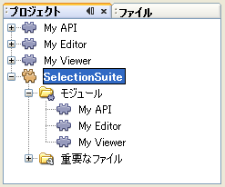
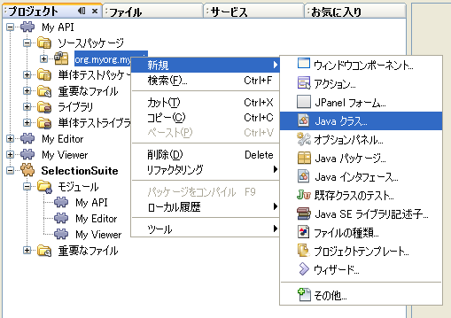
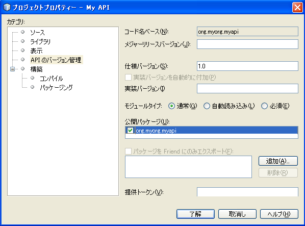
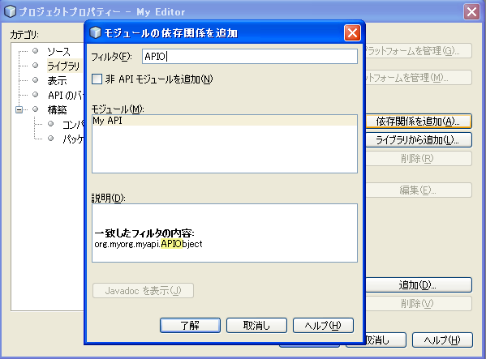
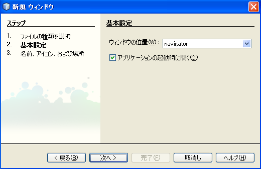
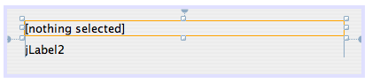
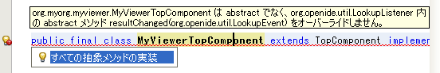
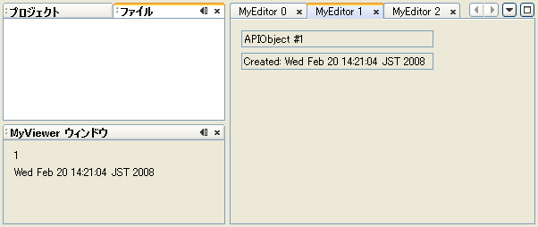
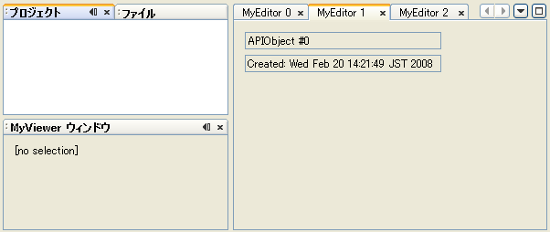
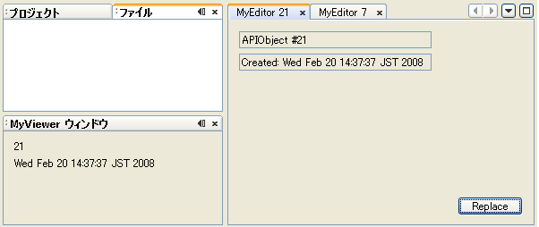

// 
//     Licensed to the Apache Software Foundation (ASF) under one
//     or more contributor license agreements.  See the NOTICE file
//     distributed with this work for additional information
//     regarding copyright ownership.  The ASF licenses this file
//     to you under the Apache License, Version 2.0 (the
//     "License"); you may not use this file except in compliance
//     with the License.  You may obtain a copy of the License at
// 
//       http://www.apache.org/licenses/LICENSE-2.0
// 
//     Unless required by applicable law or agreed to in writing,
//     software distributed under the License is distributed on an
//     "AS IS" BASIS, WITHOUT WARRANTIES OR CONDITIONS OF ANY
//     KIND, either express or implied.  See the License for the
//     specific language governing permissions and limitations
//     under the License.
//

= NetBeans セレクション管理のチュートリアル I—TopComponent の Lookup を使う方法
:jbake-type: platform_tutorial
:jbake-tags: tutorials 
:jbake-status: published
:syntax: true
:source-highlighter: pygments
:toc: left
:toc-title:
:icons: font
:experimental:
:description: NetBeans セレクション管理のチュートリアル I—TopComponent の Lookup を使う方法 - Apache NetBeans
:keywords: Apache NetBeans Platform, Platform Tutorials, NetBeans セレクション管理のチュートリアル I—TopComponent の Lookup を使う方法

このチュートリアルでは、セレクト可能なオブジェクトを提供するコンポーネントの実装方法や、セレクションの変更に応じて変化するコンポーネントの実装方法について学びます。

ある程度複雑なアプリケーションにとって、セレクションは重要なコンセプトです。NetBeans には主に、 ` link:https://netbeans.apache.org/wiki/devfaqwindowstopcomponent[TopComponent]` の ` link:https://netbeans.apache.org/wiki/devfaqlookup[Lookup]` を使う方法と ` link:https://netbeans.apache.org/wiki/devfaqwhatisanode[Node]` を使う方法があります。ここでは Lookup を用いた方法のみを扱い、より上級者向けの方法は後のチュートリアルで取り扱います。

セレクションを使用すると、表示内容に応じて有効または無効になる状況依存のアクションを可能にしたり、選択されている項目に関する情報を表示する、IDE のプロパティーシートコンポーネントやナビゲータコンポーネントのようなパレットウィンドウを作成したりできます。

基本的に、 `TopComponent` はオブジェクトを詰め込んだバッグを持っていて、外部より中に入っている物を問い合わせることができます。このバッグこそが _Lookup_であり、キーはクラスオブジェクトに、値はキークラスの派生または実装オブジェクトにマップされます。この方法が素晴らしく役に立つ理由は、提供するコンポーネントと消費するコンポーネントを分離するメカニズムにあります。そのため、提供側と消費側のコンポーネントはそれぞれ別のモジュールで実装することが可能ですし、既存のオブジェクトに対して新しいエディタが提供されても、残りのシステムは関係なく動き続けることができるでしょう。

サンプルをダウンロードするには link:http://plugins.netbeans.org/PluginPortal/faces/PluginDetailPage.jsp?pluginid=3146[ここ]をクリックしてください。

== モジュールスイートとプロジェクトの作成

このチュートリアルの例では、下の画像のように、１つのモジュールスイートに含まれた３つのモジュールを作成します:

まず３つのモジュールを格納するためのモジュールスイートを作成してください:

[start=1]
1. 「ファイル」>「新規プロジェクト」(Ctrl-Shift-N) を選択します。「カテゴリ」で「NetBeans モジュール」を選択します。「プロジェクト」で「モジュールスイート」を選択し、「次へ」をクリックします。

[start=2]
1. 「プロジェクト名」を  ``SelectionSuite``  にします。「プロジェクトの場所」を使用コンピュータ上の任意のフォルダに変更します。「完了」をクリックします。

[start=3]
1. 再び「ファイル」>「新規プロジェクト」(Ctrl-Shift-N) を選択します。「カテゴリ」で「NetBeans モジュール」を選択します。「プロジェクト」で「モジュール」を選択し、「次へ」をクリックします。

[start=4]
1. プロジェクト名を  ``MyAPI``  にします。デフォルトでは、「プロジェクトの場所」は、モジュールスイートが作成されたディレクトリの下になります。「次へ」をクリックします。

[start=5]
1. 「コード名ベース」の  ``yourorg``  を  ``myorg``  に変更し、  ``org.myorg.myapi``  とします。「モジュール表示名」でデフォルト値に空白を付け加えて、  ``My API``  とします。「ローカライズ版バンドル」と「XML レイヤー」はそのまま、 パッケージ  ``org/myorg/myapi``  に含まれるようにします。「完了」をクリックします。

[start=6]
1. 同じように、 MyEditor と MyViewer という名前のプロジェクトを作成します。なぜ３つのモジュールを作るのかは、チュートリアルを続けるうちにわかるでしょう。

== API の作成と依存関係の設定

これよりシンプルな API クラスを作成します。実際には、 API はファイルやその他のモデル化されたデータを表すことになるでしょう。しかしこのチュートリアルでは、いくつかのプロパティーを持つシンプルなオブジェクトで十分です。

[start=1]
1. `org.myorg.myapi` パッケージを右クリックし、「新規」>「Java クラス」を選択します:

[start=2]
1. クラス名を `APIObject` とします。

[start=3]
1. ソースコードを次のように書き換えます:

[source,java]
----

public final class APIObject {

   private final Date date = new Date();
   private static int count = 0;
   private final int index;

   public APIObject() {
      index = count++;
   }

   public Date getDate() {
      return date;
   }

   public int getIndex() {
      return index;
   }
   
   public String toString() {
       return index + " - " + date;
   }
   
}

----

このモジュールのコードは以上です。見てわかるように、 `APIObject` が生成されるたびにカウンタが増加します。つまり、それぞれのインスタンスはユニークな属性値を持つことになります。

[start=4]
1. 次に、他のモジュールから参照できるようにするため、 `org.myorg.myapi` パッケージをエクスポートします。My API プロジェクトを右クリックし、 「プロパティー」を選択します。

[start=5]
1. 
「API のバージョン管理」カテゴリの「公開パッケージ」で、以下のように `org.myorg.api` のチェックボックスにチェックを入れます:

[start=6]
1. さらに、モジュール間の依存関係を設定する必要があります。My Editor と My Viewer は `APIObject` クラスを使用する予定なので、これらのモジュールは API モジュールに_依存_するといえます。これらのプロジェクトのノードを順に右クリックし、「プロパティー」を選択します。

[start=7]
1. 
「ライブラリ」カテゴリの「依存関係を追加」をクリックします。ポップアップダイアログの「フィルタ」に `APIObject` と入力すると、作成した API モジュールだけが一致するはずです。これを選択して「了解」をクリックし、依存関係を追加します。

== ビューアコンポーネントの作成

これより、 `APIObject` がセレクト可能かどうか、つまりフォーカス中のトップコンポーネントの Lookup 内に `APIObject` があるか監視するシングルトンコンポーネントを作成します。もしあれば、そのオブジェクトに関するデータを表示します。同じような方法として、一般的なものの１つにマスター/詳細ビューの作成があります。

シングルトンコンポーネントとは、 NetBeans IDE のプロジェクトウィンドウやプロパティーシート、ナビゲータなどのように、システムにたった１つしか存在しないコンポーネントのことです。ウィンドウコンポーネントの作成ウィザードを使えば、シングルトンコンポーネントの作成に必要なコードが自動的に生成されるので、後はフォームデザイナーを使ったリ、中身のコードを付け加えるだけです。

[start=1]
1. `org.myorg.myviewer` パッケージを右クリックし、「新規」>「その他」を選択します。

[start=2]
1. 出てきたダイアログで「モジュールの開発」カテゴリの「ウィンドウコンポーネント」を選択し、「次へ」をクリックします (もしくは Enter キーを押す)。

[start=3]
1. 
「ウィンドウの位置」で、 `navigator` を選択し、「アプリケーションの起動時に開く」のチェックボックスにチェックを入れます:

[start=4]
1. 「次へ」をクリックし、「名前、アイコン、および場所」ページを開きます。

[start=5]
1. 「クラス名の接頭辞」を `MyViewer` とし、「完了」をクリックします (もしくは Enter キーを押す)。

これで、 `MyViewerTopComponent` という名前のシングルトントップコンポーネントのスケルトンコードが作成されました。`MyViewerTopComponent` の「デザイン」タブをクリックするとフォームエディタが表示されるはずです。フォーム上にラベルを２つ追加し、選択中の `APIObject` がある場合にその情報を表示させます。

[start=1]
1. 「パレット」ウィンドウの「Swing」カテゴリから JLabel を２つフォーム上にドラッグし、上下に配置します。

１つ目のラベルのテキストを [nothing selected] に変更します。

[start=2]
1. 「ソース」ボタンをクリックしてソースエディタに切り替えます。

[start=3]
1. `MyViewerTopComponent` が `LookupListener` を実装するように、クラスのシグネチャを変更します:

[source,java]
----

public class MyViewerTopComponent extends TopComponent implements LookupListener {

----

[start=4]
1. エディタ上で右クリックし、「インポートを修正」を選択して、 `LookupListener` をインポートします。

[start=5]
1. 
シグネチャの行にカーソルを移動してください。欄外に電球が見えているはずです。Alt-Enter キーを押すと「すべての抽象メソッドの実装」というメッセージがポップアップ表示されるので Enter キーを押します。これで LookupListerner のメソッドが追加されます。

[start=6]
1. `LookupListener` の実装クラスができました。何か監視 (listen) するものが必要です。`Utilities.actionsGlobalContext()` メソッドにより、いわば多様な Lookup のプロキシである、便利なグローバル Lookup オブジェクトを取得することができます。ですから、どのコンポーネントがフォーカス中であるかを監視するよりも、このグローバルなセレクション Lookup から通知を受け取れば良いのです。フォーカスが移動した時には、このグローバル Lookup が適当な変更通知を発行してくれるでしょう。ソースコードを以下のように変更します:

[source,java]
----

    private Lookup.Result result = null;
    public void componentOpened() {
        Lookup.Template tpl = new Lookup.Template (APIObject.class);
        result = Utilities.actionsGlobalContext().lookup(tpl);
        result.addLookupListener (this);
    }
    
    public void componentClosed() {
        result.removeLookupListener (this);
        result = null;
    }
    
    public void resultChanged(LookupEvent lookupEvent) {
        Lookup.Result r = (Lookup.Result) lookupEvent.getSource();
        Collection c = r.allInstances();
        if (!c.isEmpty()) {
            APIObject o = (APIObject) c.iterator().next();
            jLabel1.setText (Integer.toString(o.getIndex()));
            jLabel2.setText (o.getDate().toString());
        } else {
            jLabel1.setText("[no selection]");
            jLabel2.setText ("");
        }
    }

----

`componentOpened()` はコンポーネントが表示される度に呼ばれ、 `componentClosed()` はユーザーがウィンドウを閉じる度に呼ばれます。コンポーネントの表示中にセレクションの状態を知りたいので以上のようにコーディングします。

`resultChanged()` は `LookupListener` の実装メソッドです。このメソッドは、選択中の `APIObject` が変わる毎に、ビューアの `JLabel` を更新します。

== エディタコンポーネントの作成

このサンプルコードを使えるようにするには、何か `APIObject` を提供するものが必要です。幸いこれはとても簡単です。

エディタ位置にトップコンポーネントをもう１つ作り、その `Lookup` に `APIObject` のインスタンスを提供させます。もちろんウィンドウコンポーネント作成のテンプレートを使ってもいいのですが、このテンプレートはいくつも生成可能なコンポーネントよりも、むしろシングルトンコンポーネントを作るように考えられているのです。ですから、テンプレートは使わず、単純にトップコンポーネントのサブクラスと、これをオープンするためのアクションを作成します。

[start=1]
1. まず必要なクラスを参照できるように、 My Editor モジュールに３つの依存関係を追加します。My Editor プロジェクトを右クリックし、 「プロパティー」を選択します。「ライブラリ」ページで「依存関係を追加」をクリックし、`TopComponent` と入力します。ダイアログは自動的に「ウィンドウシステム API」を候補に挙げるはずです。同じように、 `Lookups` を入力して、「ユーティリティー API」を追加します。

[start=2]
1. My Editor プロジェクトの `org.myorg.myeditor` パッケージを右クリックし、「新規」>「JPanel フォーム」を選択します。

[start=3]
1. クラス名を "My Editor" とし、ウィザードを終了します。

[start=4]
1. フォームエディタを開いて、 ２つのJTextFiled を上下に配置します。それぞれ、プロパティーシートで「editable」プロパティのチェックを外し、値を false にします。

[start=5]
1. 「ソース」ボタンをクリックしてソースエディタに切り替えます。

[start=6]
1. `MyEditor` のシグネチャを変更して、 `javax.swing.JPanel` の代わりに `TopComponent` を継承するようにします:

[source,java]
----

public class MyEditor extends TopComponent {
----

[start=7]
1. 以下のコードを `MyEditor` のコンストラクタに追加します:

[source,java]
----

APIObject obj = new APIObject();
associateLookup (Lookups.singleton (obj));
jTextField1.setText ("APIObject #" + obj.getIndex());
jTextField2.setText ("Created: " + obj.getDate());
setDisplayName ("MyEditor " + obj.getIndex());

----

エディタ上で右クリックし、「インポートを修正」を選択します。

`associateLookup (Lookups.singleton (obj));` の行では、新しい `APIObject` のインスタンスだけを含む Lookup を作成します。これは、 `MyEditor.getLookup()` で取得することができます。これは例に過ぎませんから、 `APIObject` がファイルやデータベースのエンティティなど、実際に編集したり、表示したいと思うものを表すとどうなるか、思い浮かべてみると良いでしょう。もしかすると複数の `APIObject` のインスタンスを選択したいと思うかもしれません。この方法については次回のチュートリアルで扱います。

実際には何も編集しないにしろ、最低限エディタコンポーネントを見栄えのするものにするには、テキストフィールドに `APIObject` の値を表示させます。

== エディタコンポーネントを開く

何か表示させるためには、 `MyEditor` をエディタ位置に開くための手段が必要です。セレクションが意味を成すためには、少なくとも１つ以上の `APIObject` が必要で、結果１つ以上のエディタが必要です。複数のエディタが欲しいのですから、 `MyEditor` のインスタンスを作成して表示するアクションがメインメニューに必要です。これは、ウィンドウコンポーネント作成テンプレートが作成する、 IDE のナビゲータやプロパティーシートのようなシングルトンコンポーネントを開くアクションとは別のものです。

[start=1]
1. `org.myorg.myeditor` パッケージを右クリックし、「新規」>「その他」を選択します。

[start=2]
1. 出てきたダイアログで「モジュールの開発」カテゴリの「アクション」を選択し、「次へ」をクリックします。

[start=3]
1. そのまま「常に有効」を選択して「次へ」をクリックします。

[start=4]
1. 「GUI の登録」ページでは、そのままにして「次へ」をクリックします (そうすると、アクションは「ファイル」メニューの先頭に追加されるでしょう)。

[start=5]
1. ウィザードの最後のページで、クラス名を `OpenEditorAction` とし、表示名を Open Editor とします。

[start=6]
1. 「完了」をクリックしてアクションクラスを生成します。

[start=7]
1. すると、 `CallableSystemAction` のサブクラスである `OpenEditorAction` という名前のクラスのソースエディタが開くでしょう。 `CallableSystemAction` は、NetBeans API で定義されている、 `javax.swing.Action` のサブクラスで、状況依存のアクションを作成することができます。以下のコードをメソッド `performAction()` に追加します:

[source,java]
----

MyEditor editor = new MyEditor();
editor.open();
editor.requestActive();
----

上のコードは、単に `MyEditor` のインスタンスを作成し (同時に`APIObject` の新しいインスタンスを作成し、 `Lookup` の中にしまうことを意味します)、そして表示するという作業をしています。

== サンプルコードの実行

これでチュートリアルのサンプルコードを実行する準備が整いました。作成した３つのモジュールを格納する `SelectionSuite` を右クリックし、ポップアップメニューから「実行」を選択します。IDE が立ち上がったら、「ファイル」>「Open Editor」を選択してアクションを実行します。同じ作業を繰り返し、いくつかのエディタコンポーネントを開きます。シングルトンコンポーネントの `MyViewer` ウィンドウも開いているはずです。異なるエディタのタブをクリックする毎に `MyViewer` ウィンドウの内容が変わります:

プロジェクトウィンドウをクリックすると、ラベルのテキストは [No Selection] と表示されます:

もしも `MyViewer` ウィンドウが表示されていなかったら、多分ウィザードで「アプリケーションの起動時に開く」のチェックボックスをチェックしなかったためです。「ウィンドウ」メニューから「MyViewer ウィンドウを開く」を選択して表示することができます。

== つまり、ポイントは?

これらの作業のポイントは何だろうとあなたは思っているかもしれませんね。あなたはセレクション管理が可能であることを証明したのです。すごいことではありませんか！重要なポイントはモジュールを３つに分けた点です。 My Viewer モジュールは My Editor モジュールについて全く関知しておらず、それぞれ単独で実行することができます。これらのモジュールは My API を共有しているというだけです。これは２つの意味で重要です。 1. My Viewer と My Editor を別々に開発し、配布することができます、そして 2. 他のモジュールが My Editor とは異なったエディタを提供した場合でも、Lookup に `APIObject` のインスタンスを提供しさえすれば、ビューアコンポーネントは完璧に動作することができるでしょう。

この価値をわかりやすくするために、 `APIObject` がより複雑であると仮定して想像してみてください。例えば、 `MyEditor` がイメージエディタで、 ` APIObject` が編集中のイメージファイルであるといった具合です。`MyEditor` を SVG エディタに置き換えても良いでしょう。おそらく編集中のイメージの属性値を表示することになるでしょうが、ビューアは新しいエディタと透過的に動作するでしょう。これは、 NetBeans IDE に新しいツールを追加するためのモデルです。例えば Java ファイルを扱うそのツールは、 NetBeans の異なるバージョンで動作することができるでしょう。さらにフォームエディタのようなエディタを追加しても、ツールのすべてのコンポーネントとアクションは問題なく動作するでしょう。

これがまさに NetBeans が Java ファイルなどのソースファイルを扱うやり方なのです。そこではエディタの Lookup は ` link:https://netbeans.apache.org/wiki/devfaqdataobject[DataObject]` で、ナビゲータやプロパティシートは、フォーカス中のトップコンポーネントで何が選択可能か監視しているだけなのです。

このアプローチは、既存のアプリケーションを NetBeans プラットフォーム上に移行する上でも有効です。データモデルの一部であるオブジェクトに関するコードがきっとあるでしょうが、これは NetBeans へ移行する際に修正されるべきではない箇所です。データモデルの API を独立したモジュールに退避させることで、 NetBeans プラットフォームへの移行はコアのロジックには触れないで行うことができます。

== 現在選択中のオブジェクトを変更する

このアプローチがいかに強力であるかを証明するために、もう一仕事します。エディタに、選択中の `APIObject` を新しいものに変更するボタンを追加します。

[start=1]
1. フォームエディタで MyEditor を開き、 `JButton` を追加します。

[start=2]
1. 「`text`」プロパティを "Replace" とします。

[start=3]
1. `JButton` を右クリックして、「イベント」> 「Action」>「actionPerformed」を選択します。すると、ソースエディタでイベントハンドラメソッドの箇所に飛ぶはずです。

[start=4]
1. クラス定義の先頭に final フィールドを追加します:

[source,java]
----

public class MyEditor extends TopComponent {
    private final InstanceContent content = new InstanceContent();
----

InstanceContent は進行中の Lookup、特に`AbstractLookup` インスタンスの中身を変更するためのクラスです。

[start=5]
1. 先に追加したコンストラクタのコードを丸ごとクリップボードにコピーし、"associateLookup..." の行だけ残して削除します。その行を以下のように変更します:

[source,java]
----

associateLookup (new AbstractLookup (content)); 
----

[start=6]
1. クリップボードにコピーしたコードを JButton のアクションハンドラに使用するのですが、これをコンポーネントの初期化時に１度、実行する必要があります。上の行の後に、以下の行を追加します:

[source,java]
----

jButton1ActionPerformed (null);
----

[start=7]
1. イベントハンドラメソッドにクリップボードのコードをコピーし、最後に１行追加して、以下のように変更します:

[source,java]
----

private void jButton1ActionPerformed(java.awt.event.ActionEvent evt) {
    APIObject obj = new APIObject();
    jTextField1.setText ("APIObject #" + obj.getIndex());
    jTextField2.setText ("Created: " + obj.getDate());
    setDisplayName ("MyEditor " + obj.getIndex());
    content.set(Collections.singleton (obj), null);
}
----

[start=8]
1. エディタ上で右クリックし、「インポートを修正」を選択します。

これで再びスイートを実行する準備が整いました。SelectionSuite を右クリックし、「実行」を選択します。Replace ボタンをクリックすると、MyViewer のインスタンスを含めすべてのコンポーネントがどのように変更されるかに注目してください。

== 複数オブジェクトの提供

分離という点では十分な例ですが、１つのオブジェクトしか提供しないのでは、まるで１組のキーと値しか持っていない `Map` のようではありませんか?その通りです。複数の API から 複数のオブジェクトを提供してこそこのテクニックはより強力なものになるのです。

例えば NetBeans にも状況依存のアクションがあります。その一例は NetBeans のアクション API の提供する組み込み済の `SaveAction` です。このアクションがやっていることは、ビューアコンポーネントが `APIObject` を監視しているように、 `SaveCookie` と呼ばれるものを監視することです。表示中のファイルに未保存の編集がある場合など、 `SaveCookie` がある場合にはアクションは有効となり、「保存」のメニューとツールバーのボタンが有効となります。保存アクションが実行されると `SaveCookie.save()` が呼ばれ、 `SaveCookie` が消えるので、保存アクションは新たな `SaveCookie` が作成されるまで無効となります。

お気づきかもしれませんが、状況依存性は新規アクションウィザードのオプションの１つです。現在、ウィザードによって生成されるアクションは、実際には Lookup 以前の方法を使用しています。このような状況依存アクションを Lookup に基づいて行う方法は、 link:https://netbeans.apache.org/wiki/devfaqactioncontextsensitive[開発者 FAQ] に記述されています。

オブジェクトを様々な角度から編集するために、単一のオブジェクトを提供するよりは、異なる複数の補助コンポーネントやアクションを提供する方が現実的でしょう。オブジェクトの様々な側面は、それぞれ各補助コンポーネントや各アクションが依存し、監視可能なインターフェースに切り分けることができるでしょう。

== その他の注意点

このチュートリアルの主題とは直接関係ありませんが、３つの `MyEditor` インスタンスを開いたままアプリケーションを終了し、再起動すると、再び３つの `MyEditor` インスタンスがまるで魔法のように現れることに気付いたのではないでしょうか。エディタはデフォルトで終了時の状態を保存し、再起動時に復元します。

このような振る舞いを望まないのであれば、２つの方法があります。再起動時にエディタが二度と開かれることのないよう、`MyEditor` のメソッドを以下のように上書きします:

[source,java]
----

public int getPersistenceType() {
    return PERSISTENCE_NEVER;
}
----

もし、開いているコンポーネントだけ残したいときは、 `PERSISTENCE_ONLY_OPENED` を戻り値として返します。デフォルトではこの戻り値は `PERSISTENCE_ALWAYS` となっていますが、この設定ではクローズしたものまで保存され、永遠に再起動時に再ロードされるので、エディタ形式のコンポーネントには不適当です。

もっとも、保存される情報の中にはメインウィンドウ内の位置情報も含まれていることに注意してください。従って、プロパティシートやサンプルのビューアコンポーネントなどのシングルトンコンポーネントは、 `PERSISTENCE_ALWAYS` を戻り値にする必要があります。そうしなくては、再起動後はエディタ位置に表示されるようになってしまいます。

== おまけのお掃除

モジュール作成テンプレートは、デフォルトで layer.xml を作成します。My API モジュールの場合にはこれは使用しません。従って、起動時間を少しでも改善するために次のようにします:

[start=1]
1. My API プロジェクトの「重要なファイル」ノードを開きます。

[start=2]
1. 「モジュールのマニフェスト」ノードをダブルクリックします。

[start=3]
1. 以下の１文を削除します:

[source,java]
----

OpenIDE-Module-Layer: org/myorg/myapi/layer.xml
----

[start=4]
1. 該当する `org.myorg.myapi` の `layer.xml` ファイルを削除します。

link:http://netbeans.apache.org/community/mailing-lists.html[ご意見をお寄せください]

== 次の手順

あるコンポーネントはより詳細なセレクションロジックを持ち、複数のセレクションを必要とすることにお気づきでしょうか。 link:nbm-selection-2_ja.html[次のチュートリアル]では、これを可能にするために link:https://bits.netbeans.org/dev/javadoc/org-openide-nodes/overview-summary.html[ノード API] の使い方について学びます。

=== この翻訳は、nora さんに提供していただきました。

