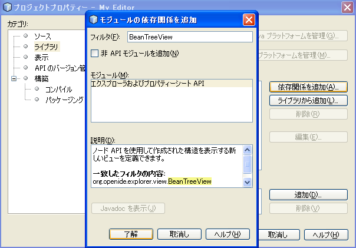
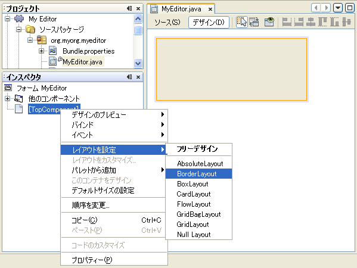
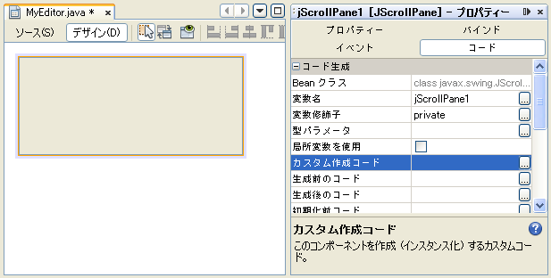
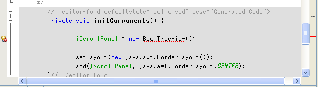
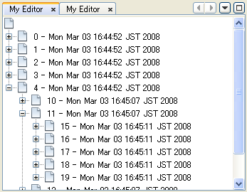
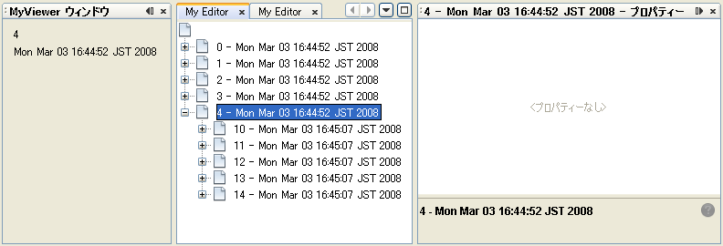
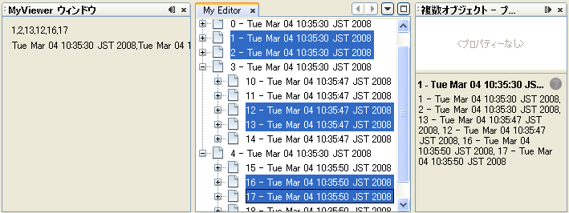

// 
//     Licensed to the Apache Software Foundation (ASF) under one
//     or more contributor license agreements.  See the NOTICE file
//     distributed with this work for additional information
//     regarding copyright ownership.  The ASF licenses this file
//     to you under the Apache License, Version 2.0 (the
//     "License"); you may not use this file except in compliance
//     with the License.  You may obtain a copy of the License at
// 
//       http://www.apache.org/licenses/LICENSE-2.0
// 
//     Unless required by applicable law or agreed to in writing,
//     software distributed under the License is distributed on an
//     "AS IS" BASIS, WITHOUT WARRANTIES OR CONDITIONS OF ANY
//     KIND, either express or implied.  See the License for the
//     specific language governing permissions and limitations
//     under the License.
//

= NetBeans セレクション管理のチュートリアル II—ノードを使う方法
:jbake-type: platform_tutorial
:jbake-tags: tutorials 
:jbake-status: published
:syntax: true
:source-highlighter: pygments
:toc: left
:toc-title:
:icons: font
:experimental:
:description: NetBeans セレクション管理のチュートリアル II—ノードを使う方法 - Apache NetBeans
:keywords: Apache NetBeans Platform, Platform Tutorials, NetBeans セレクション管理のチュートリアル II—ノードを使う方法

link:nbm-selection-1_ja.html[前回のチュートリアル]では、 ` link:https://netbeans.apache.org/wiki/devfaqwindowstopcomponent[TopComponent]` の ` link:https://netbeans.apache.org/wiki/devfaqlookup[Lookup]` からセレクト可能なオブジェクトを提供する方法や、フォーカス中のコンポーネントの `Lookup` に応じて変化するコンポーネントの実装方法など、コンポーネント間のセレクション管理の基礎について学びました。

今回は、より詳細なビューや、単にコンポーネントレベルにとどまらないセレクションを可能にするために、 link:https://bits.netbeans.org/dev/javadoc/org-openide-nodes/overview-summary.html[ノード API] について学びます。もちろん Lookup を読み書きするコンポーネントを書き、より詳細なセレクションロジックを持たせることもできないわけではありません。しかし、ノード API はそのようなことが簡単に実現できるだけでなく、多くの利点を持っています。

１つ目の利点はノード API が提供する_プレゼンテーションレイヤー_です。このレイヤーは何らかの形で編集中のデータモデルと、このデータモデルをユーザーに見せる UI コンポーネントの間にある層です。これは、あるモデルを様々な形で、もしくは様々な UI で表現する上で、とても便利で強力なのです。

２つ目の利点はエクスプローラ API です。`org.openide.explorer` モジュールは、ツリーやリスト、ツリーテーブルなどの、ノードや、その子ノードを扱うことのできるコンポーネントを数多く提供しています。

ノードは、階層的なオブジェクトです。ノードは以下のものを持っています。

* 子ノード—ツリーに表示することができる、階層的に配下にあるノード
* アクション—ポップアップメニューに表示することができるアクション
* 表示名—UI コンポーネントに表示することができる、判読可能 (human-readable) で、ローカライズされた名前
* アイコン—UI コンポーネントに表示することができるアイコン

ノードは上のどれに対しても変更通知を発行することができ、エクスプローラ UI コンポーネントの表示は自動的に更新されるでしょう。

決して前回のチュートリアルが無意味だというわけではありません。むしろ、ノード API が動作可能な理由がそこにあるのですから。お察しの通り、`org.openide.nodes.Node` の `getLookup()` というメソッドがその理由です。事実、 IDE のプロジェクトタブで選択を変更した時何が起きているかというと...例えば、プロジェクトタブはトップコンポーネントです。`Utilities.actionsGlobalContext()` で取得した `Lookup` がフォーカス中の様々なコンポーネントの代わり (proxy) になり、フォーカスが移動する際に変更通知を発行するように、ツリー内で選択中のオブジェクトの `Lookup` の代わりとして使えます。

エクスプローラ API のコンポーネントのおかげで非常に簡単にツリーノードの体裁を整え、とても少ないコードでこのような代用 (proxying) を行うことができます。前回のチュートリアルに出てきた MyViewer のようなビューアタイプのコンポーネントは、自動的に選択変更を通知されるので、 エクスプローラコンポーネントで起きた選択変更に対応するために特に何かする必要はありません。

== はじめに

あなたがその内容をよく知っているものとして、 link:nbm-selection-1_ja.html[前回のチュートリアル]のサンプルコードから始めます。

サンプルをダウンロードするには link:http://plugins.netbeans.org/PluginPortal/faces/PluginDetailPage.jsp?pluginid=3146[ここ]をクリックしてください。

== エクスプローラビューの作成

まず最初にすることは、エディタコンポーネント `MyEditor` の大幅な変更です。`MyEditor` をエディタで開きます。

[start=1]
1. まず My Editor プロジェクトのプロパティーダイアログを開きます。「ライブラリ」カテゴリの「依存関係を追加」をクリックし、ダイアログに "BeanTreeView" と入力します。以下のように「エクスプローラおよびプロパティーシート API」が表示されるのを確認して「了解」をクリックします。これでエクスプローラ API モジュールへの依存関係が追加され、モジュールのクラスを使用することができます。

[start=2]
1. 次にアクションハンドラメソッドの中身を削除します:

[source,java]
----

private void jButton1ActionPerformed(java.awt.event.ActionEvent evt) {                                         
}
----

さらにコンストラクタからこのメソッドの呼び出しを削除します。こうしておけば、このハンドラメソッドが関連付けされているボタンを削除した時、ハンドラメソッドも一緒に削除されるでしょう。

[start=3]
1. フォームデザイナーに切り替え、コンポーネントのすべての部品を選択し、削除します。

[start=4]
1. コンポーネントインスペクタで `TopComponent` のノードを右クリックし、「レイアウトを設定」>「BorderLayout」を選択します:

[start=5]
1. パレットウィンドウの Swing コンテナの「スクロール区画」をクリックし、フォーム上にスクロールペインをドロップします。すると、このスクロールペインはフォーム全体に配置されるでしょう。ここでの秘密は、すべてのエクスプローラ UI コンポーネントは `JScrollPane` のサブクラスであるということです。そのため、その生成コードを変更するだけでエクスプローラビューを作成することができます。

[start=6]
1. 追加した `JScrollPane` を右クリックし、「コードのカスタマイズ」を選択します。コードカスタマイザで、 `new BeanTreeView()` を追加して、最初の行を変更します:

`BeanTreeView` はエクスプローラ API のコンポーネントで、ポップアップメニューや検索機能などが内臓された、ノードとその子ノードを表示する基本的な `JTree` ベースのビューです。

[start=7]
1. 下のようにインポート文の追加が必要になるので、ソースエディタに切り替え、 Ctrl-Shift-I キーを押して BeanTreeView をインポートします:

[start=8]
1. 次にツリーに何か表示するものを追加します。エクスプローラ UI コンポーネントは、コンテナに追加されると、コンテナやそのスーパークラスが `ExplorerManager.Provider` を実装していないか探します。ですから直接コンポーネントに表示するノードを追加するのではなくて、コンポーネントマネージャーに追加します。こうすることでマスター/詳細ビューなど、１つのマネージャーが管理する複数のビューに表示することが可能になります。MyEditor のシグネチャに以下のように追加します:

[source,java]
----

public class MyEditor extends TopComponent implements ExplorerManager.Provider {
----

Ctrl-Shift-I キーを押してインポートを修正します。シグネチャの行にカーソルを置いたままにしていると、欄外に電球が現れるはずです。Alt-Enter キーを押して、「すべての抽象メソッドの実装」を実行します。すると、 `getExplorerManager()` というメソッドが追加されるでしょう。これを以下のように実装します:

[source,java]
----

private final ExplorerManager mgr = new ExplorerManager();
public ExplorerManager getExplorerManager() {
    return mgr;
}
----

[start=9]
1. ゴールは複数の `APIObject` を表示できるコンポーネントなのですから、１つか２つのノードが必要です。それぞれ `APIObject` インスタンスを所有することになるでしょう。まずはツリービューにルートノードを作成するコードを追加します。コンストラクタに以下の行を追加します:

[source,java]
----

mgr.setRootContext(new AbstractNode(new MyChildren()));
----

このコードでは `MyEditor` のすべてのエクスプローラビューのルートノードを設定しています。

[start=10]
1. インポートを修正しようとすると、 `AbstractNode` も `MyChildren` も見つけられないとのエラーダイアログが表示されるでしょう。`AbstractNode` を解決するためには、ノード API への依存関係を追加する必要があります。My Editor プロジェクトを右クリックし、 「プロパティー」を選択して、「ライブラリ」カテゴリの「依存関係を追加」をクリックします。追加ダイアログで "AbstractNode" と入力し、リスト中で「ノード API」を選択して、「了解」をクリックするか Enter キーを押します 。

[start=11]
1. ソースエディタに戻り、 Ctrl-Shift-I キーを押してインポートを修正します。依然 `MyChildren` が見つからないとのエラーが出るでしょう。このクラスは今から作成しますから問題ありません。

== ノードと子ノードの実装

上で `AbstractNode` というクラスを使っていますね。これは名前の通りの抽象クラスではありません！これはいくらかの時間と手間を省くための `org.openide.nodes.Node` のユーティリティー実装クラスです。１から Node を実装するのではなく、ただ AbstractNode を作成して子ノードを提供する `Children` オブジェクトを渡し、必要に応じてアイコンと表示名を設定するだけでよいのです。これが `Node` そのもののサブクラスを作成することなく、何かを表す `Node` オブジェクトを作成するための簡単な方法です。

これより、 `MyChildren` を実装して、先頭ノードの下に子ノードを作成します。

[start=1]
1. My Editor プロジェクトの `org.myorg.myeditor` パッケージを右クリックし、ポップアップメニューから「新規」>「Java クラス」を選択します。

[start=2]
1. 「新規 Java クラス 」ウィザードで、「クラス名」を "MyChildren" とし、「完了」をクリックするか Enter キーを押します。

[start=3]
1. `Children.Keys` を拡張するようにクラスのシグネチャを変更します:

[source,java]
----

class MyChildren extends Children.Keys {
----

[start=4]
1. Ctrl-Shift-I キーを押してインポートを修正します。

[start=5]
1. シグネチャの行にカーソルを移動します。欄外に電球が表示されたら、Alt-Enter キーを押して、「すべての抽象メソッドの実装」を実行します。これで `createNodes (Object key)` メソッドが追加されます。ここでルートノードの子ノードを作成します。

[start=6]
1. まずは先に、 `addNotify` をオーバーライドします。Swing コンポーネントの `addNotify()` と同じで、 `Children.Keys.addNotify()` は子ノードへの注意が最初に向けられた時、つまり子ノードについて最初に尋ねられた時に呼ばれます。ですから、ユーザーが親ノードを展開し表示が必要になる瞬間まで、子ノードの作成を遅らせることができます。ソースコード上にカーソルを置いて、 Alt-Insert キーを押します。そして「メソッドをオーバーライド...」を選択します。 出てきたダイアログで「Children」を展開し、 `addNotify()` メソッドを選択して、「生成」をクリックするか Enter キーを押します。

[start=7]
1. `addNotify()` メソッドを以下のように実装します:

[source,java]
----

protected void addNotify() {
    APIObject[] objs = new APIObject[5];
    for (int i = 0; i < objs.length; i++) {
        objs[i] = new APIObject();
    }
    setKeys (objs);
}
----

`Children.Keys` という名前から想像したかもしれませんが、親ノードはキーオブジェクトの配列または `Collection` を持ち、それらに対する `Node` を生成するファクトリのように振る舞います。`addNotify()` は何かが子ノードを必要としていることを知らせているので、 `setKeys()` を呼びます。`setKeys()` に渡す配列またはコレクションの各要素に対して、 `createNodes()` を１度呼びます (あなたが望むなら１つのオブジェクトに対して複数のノードを割り当てることもできます) 。

[start=8]
1. 実際にノードを作成するためのコードを実装する必要があります。`createNodes()` を以下のように実装します:

[source,java]
----

protected Node[] createNodes(Object o) {
    APIObject obj = (APIObject) o;
    AbstractNode result = new AbstractNode (new MyChildren(), Lookups.singleton(obj));
    result.setDisplayName (obj.toString());
    return new Node[] { result };
}
----

[start=9]
1. Ctrl-Shift-I キーを押してインポートを修正します。

[start=10]
1. 最後に、エクスプローラマネージャーを TopComponent の Lookup につなぐための配線コードを少し追加します。まずクラス定義の先頭から以下の行を削除します。

[source,java]
----

private final InstanceContent content = new InstanceContent();
----

そして、選択されたノードの Lookup を TopComponent の Lookup につなぐために、ユーティリティを使用します。

[start=11]
1. `MyEditor` のコンストラクタを以下のように修正します:

[source,java]
----

public MyEditor() {
    initComponents();
    associateLookup (ExplorerUtils.createLookup(mgr, getActionMap()));
    mgr.setRootContext(new AbstractNode(new MyChildren()));
    setDisplayName ("My Editor");
}
----

== サンプルの実行

お気づきでしょうが、それぞれの `AbstractNode` に対し `MyChildren` のインスタンスを生成するので、無限に `APIObjects` が作られ、それぞれのノードは `APIObject` を持つ５つの子ノードを持つことになります。

準備が整ったので、 `SelectionSuite` を右クリックしてポップアップメニューから「生成物を削除してすべてを構築」を選択し、再度右クリックして「実行」を選択します。NetBeans が起動したら、ファイルメニューの「Open Editor」アクションで `MyEditor` インスタンスを開きます。

ノードをクリックまたは展開すると、ビューアとプロパティーシートの内容が、以下のように選択したノードの `APIObject` の情報に更新されることに注目してください:

== エクスプローラの探検

以上のサンプルコードを使って、ノードと子ノードを表示するために NetBeans で使用可能な他のコンポーネントを探検したらおもしろいでしょう。探検するには、 `MyEditor` をフォームエディタで開き、「カスタム作成コード」プロパティーのコードを他のコンポーネントを使うように変更します。あるコンポーネントに対しては、 `JScrollPane` を他のコンポーネントに変更する必要があるでしょう。(単に `JScrollPane` をフォームエディタで削除してしまって、コンストラクタに `(new BeanTreeView(), BorderLayout.CENTER)` と追加してしまってもよいでしょう。) 例えば以下のようなオプションがあります:

* *ListView*—ノードを JList に表示する (階層の深さを設定することができる)
* *TreeTableView*—一番左の列がツリーになっているツリーテーブル
* *ChoiceView*—ノードとその子ノードのコンボボックスビュー
* *MenuView*—ノードとその子ノードのポップアップメニューを表示する `JButton`
* *IconView*—Windows エクスプローラのように子ノードをアイコン表示するコンポーネント

== 複数オブジェクトの選択

基本的なツリービューである `BeanTreeView` では、同時に複数のノードを選択できることに気づいたかもしれません。ですから、選択中のすべてのノードの情報が表示できるようにビューアコンポーネントを修正したほうが望ましいでしょう:

[start=1]
1. My Viewer プロジェクトの `org.myorg.myviewer.MyViewerTopComponent` をエディタで開きます。

[start=2]
1. リスナーメソッドの `resultChanged()` を次のコードに置き換えます:

[source,java]
----

public void resultChanged(LookupEvent lookupEvent) {
    Lookup.Result r = (Lookup.Result) lookupEvent.getSource();
    Collection c = r.allInstances();
    if (!c.isEmpty()) {
        StringBuffer text1 = new StringBuffer();
        StringBuffer text2 = new StringBuffer();
        for (Iterator i = c.iterator(); i.hasNext();) {
            APIObject o = (APIObject) i.next();
            text1.append (o.getIndex());
            text2.append (o.getDate().toString());
            if (i.hasNext()) {
                text1.append (',');
                text2.append (',');
            }
        }
        jLabel1.setText (text1.toString());
        jLabel2.setText (text2.toString());
    } else {
        jLabel1.setText("[no selection]");
        jLabel2.setText ("");
    }
}
----

これで、`ExplorerUtils` によって作成された `Lookup` が様々なノードの `Lookup` のプロキシとして使用できるだけでなく、複数のノードの `Lookup` をも正確にプロキシすることがわかるでしょう。

== コンセプトのおさらい

ここで学んだコンセプトをいくつかおさらいします:

* `Lookup` はキーはクラスで値はクラスインスタンスである `Map` のようなものでした。`Lookup` は オブジェクトが出入りする_場所_であり、特定の型のオブジェクトが出入りした時に通知してもらうように設定できると考えてもよいでしょう。
* `Utilities.actionsGlobalContext()` により、フォーカス中の多様な `TopComponent` の `Lookup` のプロキシ `Lookup` を取得できます。この `Lookup` は、フォーカスが別のコンポーネントに移動すると変更通知を発行します。
* ノードは、ツリーやリストなどのエクスプローラ API のコンポーネントで表示することができるプレゼンテーションオブジェクトです。それぞれのノードは自身の `Lookup` を持っています。
* `Utilities.actionsGlobalContext()` で取得した `Lookup` が TopComponent の `Lookup` のプロキシとして使用できるように、 `ExplorerUtils.createLookup(ExplorerManager, ActionMap)` によって作成される `Lookup` は エクスプローラ内で選択された様々な `Node` の `Lookup` のプロキシとして使用できます。

link:http://netbeans.apache.org/community/mailing-lists.html[ご意見をお寄せください]

== 次の手順

これで、配下にモデルオブジェクト (`APIObject`) を持つノードを表示するビューができました。 link:nbm-nodesapi2_ja.html[次のチュートリアル]では、これまでに作成したノードにアクションやプロパティー、そしてカラフルな表示名などを付け足していきます。 

=== この翻訳は、nora さんに提供していただきました。

