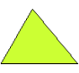
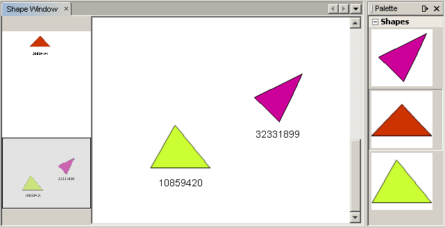

// 
//     Licensed to the Apache Software Foundation (ASF) under one
//     or more contributor license agreements.  See the NOTICE file
//     distributed with this work for additional information
//     regarding copyright ownership.  The ASF licenses this file
//     to you under the Apache License, Version 2.0 (the
//     "License"); you may not use this file except in compliance
//     with the License.  You may obtain a copy of the License at
// 
//       http://www.apache.org/licenses/LICENSE-2.0
// 
//     Unless required by applicable law or agreed to in writing,
//     software distributed under the License is distributed on an
//     "AS IS" BASIS, WITHOUT WARRANTIES OR CONDITIONS OF ANY
//     KIND, either express or implied.  See the License for the
//     specific language governing permissions and limitations
//     under the License.
//

= NetBeans ビジュアルライブラリのチュートリアル
:jbake-type: platform_tutorial
:jbake-tags: tutorials 
:jbake-status: published
:syntax: true
:source-highlighter: pygments
:toc: left
:toc-title:
:icons: font
:experimental:
:description: NetBeans ビジュアルライブラリのチュートリアル - Apache NetBeans
:keywords: Apache NetBeans Platform, Platform Tutorials, NetBeans ビジュアルライブラリのチュートリアル

このチュートリアルでは、NetBeans ビジュアルライブラリ API の主な機能の使い方について学習します。ビジュアルライブラリ API は、視覚化のための API で、たとえばモデリングやグラフ化などを行う場合に役立ちます。

トラブルシューティングのために、 link:http://plugins.netbeans.org/PluginPortal/faces/PluginDetailPage.jsp?pluginid=2701[完了したサンプルをダウンロード]してソースを調べることもできます (任意)。

また、このチュートリアルでは、3 つのアイコンを使用します。ここでそれらのアイコンを右クリックしてローカルに保存し、このチュートリアルでモジュールプロジェクトを作成したあとで、そのモジュールプロジェクトの場所にこれらのアイコンをコピーして使用してもかまいません。その 3 つのアイコンを次に示します。

image::images/vislib_image1.png[] 
image::images/vislib_image2.png[] 

ビジュアルライブラリ API を使用するために必要な情報は、すべて次の 2 つの場所にまとめられています。

*  link:https://netbeans.apache.org/graph/[ビジュアルライブラリプロジェクトページ]
*  link:https://netbeans.apache.org/graph/documentation.html[ビジュアルライブラリ 2.0 - ドキュメント]

また、Javalobby の  link:http://www.javalobby.org/eps/netbeans_visual_library/[Roman Strobl's Visual Library Screencast] も参照してください。

== モジュールの設定

この節では、ウィザードを使用して、モジュールプロジェクトおよびカスタムウィンドウコンポーネントを作成します。

[start=1]
1. 「ファイル」>「新規プロジェクト」を選択します。「新規プロジェクト」ウィザードで、「カテゴリ」の下にある「NetBeans モジュール」と「プロジェクト」の下にある「モジュール」を選択します。「次へ」をクリックします。「プロジェクト名」に「 ``ShapeSample`` 」と入力し、「プロジェクトの場所」をディスク上の適切なフォルダに設定します。「スタンドアロンモジュール」および「主プロジェクトとして設定」が選択されていない場合は、それらを選択します。「次へ」をクリックします。

[start=2]
1. 「コード名ベース」に「 ``org.netbeans.shapesample`` 」、「モジュール表示名」に「 ``Shape Sample`` 」と入力します。「完了」をクリックします。

[start=3]
1. プロジェクトを右クリックして「プロパティー」を選択し、「プロジェクトプロパティー」ダイアログで「ライブラリ」をクリックして次の API との依存関係を宣言します。

* ビジュアルライブラリ API
* ユーティリティー API

「了解」をクリックします。

[start=4]
1. モジュールプロジェクトを右クリックし、「新規」>「ファイル/フォルダ」を選択して「NetBeans モジュールの開発」カテゴリから「ウィンドウコンポーネント」を選択します。「次へ」をクリックします。ドロップダウンリストから  ``editor``  を選択し、「アプリケーションの起動時に開く」を選択します。「次へ」をクリックします。

[start=5]
1. 「クラス名の接頭辞」に「 ``Shape`` 」と入力します。任意で 16 × 16 ピクセルのアイコンを追加します。「完了」をクリックします。

複数のファイルが生成されます。そのうちの 1 つは  ``ShapeTopComponent``  です。このファイルをデザインモードで開きます。次のような表示になります。

image::images/vislib_shapetopcomponent.png[]

[start=6]
1. デザインモードの TopComponent を右クリックし、「レイアウトを設定」を選択して「BorderLayout」を選択します。

== シーンの作成

ビジュアルライブラリ API を使用して行うプログラミングは、Swing でのプログラミングに似ています。ウィジェットと呼ばれる可視の要素のツリーを構築、変更します。ツリーの元はシーンクラスによって表され、シーンの可視データをすべて保持します。シーンはウィジェットです。シーンのビューを作成する必要があり、それは JComponent です。そして、この JComponent を JScrollPane に追加します。

この節では、TopComponent に JScrollPane を追加します。そのあとで、新しいシーンを作成します。次に、シーンビューを TopComponent に渡し、TopComponent の JScrollPane に表示されるようにします。そうしたら、モジュールプロジェクトをインストールし、最初のシーンを表示します。

[start=1]
1. パレット (Ctrl-Shift-8) を使用して、TopComponent に  ``JScrollPane``  をドロップします。インスペクタで、 ``JScrollPane``  を右クリックし、「変数名を変更」を選択して「 ``shapePane`` 」と入力します。

[start=2]
1.  ``org.netbeans.shapesample``  パッケージに、 ``GraphSceneImpl``  と呼ばれる Java クラスを作成します。クラスで  ``GraphScene``  を拡張します。

エラーを示す赤い下線と電球が表示されます。IDE でインポート文を生成します。

エラーを示す赤い下線と電球がふたたび表示されます。IDE でクラスの抽象メソッドを生成します。

[start=3]
1. 有効な識別子を追加して、必要に応じて  ``null``  が返されるように設定することによって、クラスの模擬的な実装を作成します。これによって、すべてのクラスの必要条件が満たされます。

[source,java]
----

public class GraphSceneImpl extends GraphScene {
    
    public GraphSceneImpl() {
    }
    
    protected Widget attachNodeWidget(Object node) {
        return null;
    }
    
    protected Widget attachEdgeWidget(Object edge) {
        return null;
    }
    
    protected void attachEdgeSourceAnchor(Object edge, Object oldSourceNode, Object newSourceNode) {
    
    }
    
    protected void attachEdgeTargetAnchor(Object edge, Object oldTargetNode, Object newTargetNode) {
            
    }
    
}
----

[start=4]
1. ここで、TopComponent のコンストラクタを使用して、 ``GraphSceneImpl``  クラスのインスタンスを保持します。そのために、 ``ShapeTopComponent``  クラスのコンストラクタの最後に次の内容を追加します。

[source,java]
----

GraphSceneImpl scene = new GraphSceneImpl();
myView = scene.createView();

shapePane.setViewportView(myView);
add(scene.createSatelliteView(), BorderLayout.WEST);
----

ここでは 2 つのビューを作成しています。1 つ目は、グラフやモデルなどを視覚化するための大きなビューです。2 つ目はサテライトビューで、TopComponent の WEST (左側) に置いています。これによって、ユーザーはビュー間ですばやくナビゲートできるようになり、また、シーン全体の概要を確認できます。

次のように、ビューの JComponent を宣言します。

[source,java]
----

private JComponent myView;
----

[start=5]
1. IDE が再起動するときに、TopComponent を持続する必要はありません。実際に、この場合そうするとエラーが発生します。したがって、次に示すように PERSISTENCE_ALWAYS を PERSISTENCE_NEVER に変更します。

[source,java]
----

public int getPersistenceType() {
   return TopComponent.PERSISTENCE_NEVER;
}
----

[start=6]
1. プロジェクトノードを右クリックし、「開発中 IDE でのインストール/再読み込み」を選択します。警告のメッセージが表示された場合は、「了解」をクリックします。

モジュールのインストール時に「ウィンドウ」メニューの下を見ると、メニュー項目のリストの一番上に、「shape」という新しいメニュー項目があります。それを選択すると、ビジュアルライブラリ API 実装が起動することがわかります。

image::images/vislib_firstscene.png[]

== シーン用のコンポーネントパレットの作成

ビジュアルライブラリ API を便利に使用するには、 link:https://bits.netbeans.org/dev/javadoc/org-netbeans-spi-palette/overview-summary.html[パレット API] を実装して、このチュートリアルの冒頭に示した形状を含むコンポーネントパレットにします。あとで、ビジュアルライブラリ API のドラッグ＆ドロップ機能を追加して、シーンに形状をドラッグ＆ドロップできるようにします。そのあとで、シーンに拡大/縮小機能や手のひらツール機能などを追加してシーンを充実させることができます。

[start=1]
1. このチュートリアルは、パレット API ではなくビジュアルライブラリ API に主眼を置いているため、ここではパレット API の機能については説明していません。この題材については多くのチュートリアルがほかにあります ( link:https://netbeans.apache.org/kb/docs/platform.html[ここを参照])。したがって、単に、 ``org.netbeans.shapesample.palette``  と呼ばれる新しいパッケージに次のファイルをコピー＆ペーストします。
*  link:images/vislib_Category.java[Category.java]
*  link:images/vislib_CategoryChildren.java[CategoryChildren.java]
*  link:images/vislib_CategoryNode.java[CategoryNode.java]
*  link:images/vislib_PaletteSupport.java[PaletteSupport.java]
*  link:images/vislib_Shape.java[Shape.java]
*  link:images/vislib_ShapeChildren.java[ShapeChildren.java]
*  link:images/vislib_ShapeNode.java[ShapeNode.java]

[start=2]
1. このチュートリアルの「モジュールの設定」節の手順 3 で説明されているのと同じ手順で、アクション API、ノード API、および共通パレット API との依存関係を追加します。

[start=3]
1. 次に、この行を TopComponent のコンストラクタの最後に追加して、TopComponent のルックアップにパレットを追加します。

[source,java]
----

associateLookup( Lookups.fixed( new Object[] { PaletteSupport.createPalette() } ) );
----

[start=4]
1. IDE によって  ``org.openide.util.lookup.Lookups``  および  ``org.netbeans.shapesample.palette.PaletteSupport``  用のインポート文を挿入するよう求められます。要求を受け入れて、IDE にインポート文を生成させます。

[start=5]
1. このチュートリアルの冒頭にある画像を  ``org.netbeans.shapesample.palette``  に置きます。

「プロジェクト」ウィンドウは次のようになります。

image::images/vislib_proj-window.png[]

[start=6]
1. モジュールをもう一度インストールします。メニュー項目から TopComponent を開くと、シーンの右に新しいコンポーネントパレットが表示されます。

image::images/vislib_firstpalette.png[]

== LayerWidget の追加

link:https://netbeans.apache.org/graph/documentation.html#LayerWidget[LayerWidget] は、Swing の JGlassPane に似たガラス区画として表されます。これはデフォルトで透過です。したがって、先へ進む前に、シーンに LayerWidget を追加して、シーン上の任意の場所に可視ウィジェットをドラッグ＆ドロップして配置できるようにします。

[start=1]
1. 次のように、 ``GraphSceneImpl``  クラスで LayerWidget を宣言します。

[source,java]
----

private LayerWidget mainLayer;
----

[start=2]
1.  ``GraphSceneImpl``  クラスのコンストラクタで、次のようにシーンの子として LayerWidget を追加します。

[source,java]
----

mainLayer = new LayerWidget (this);
addChild (mainLayer);
----

これで、シーンにウィジェットとしてパレットから項目をドラッグ＆ドロップするときに、LayerWidget の子としてそれらを追加することになります。LayerWidget はデフォルトで透過であるため、LayerWidget を透過的に重ね合わせることで、たとえばシーンに背景画像を追加するなどが可能です。

詳細は、Javadoc の  link:https://netbeans.apache.org/graph/documentation.html#LayerWidget[LayerWidget] を参照してください。

== ドラッグ＆ドロップ機能による IconNodeWidget の追加

前に、TopComponent の JScrollPane にシーンを渡すために  ``GraphSceneImpl``  クラスのコンストラクタを使用しました。今のところ、シーンは存在しますが動作は何もありません。動作は、アクションを通じて追加されます。この節で確認するアクションは、 `` link:https://netbeans.apache.org/graph/documentation.html#AcceptAction[AcceptAction]``  と呼ばれます。このアクションによってドラッグ＆ドロップ機能が可能になります。ドラッグ＆ドロップ機能はウィジェットにも適用できますが、ここではシーンそのものに適用します。

 ``createAcceptAction``  を使用して、パレットからシーンに項目をドラッグしたときの動作を指定します。ここでは、2 つのメソッドが必要になります。1 つめは  ``isAcceptable()``  で、項目をシーンに配置できるかどうかを決定します。ここで transferrable を使用して項目をテストできます。ドラッグの画像を設定することもできます。これは、あとに示す実装で実行します。 ``true``  が返された場合は、 ``accept``  メソッドが呼び出されます。前と同じヘルパーメソッドを使用して、transferrable から画像を取得します。それから  ``addNode``  メソッドを呼び出して、新しい  link:https://netbeans.apache.org/graph/documentation.html#IconNodeWidget[IconNodeWidget] をインスタンス化し、transferable から取得した画像を渡します。

このセクションのコードはすべて相互に関係があります。そのため、このあとのメソッドをすべて追加し終えるまでは、エラーを示す赤い下線が表示されますが、とにかく論理的な順序ですべてを追加していきます。

[start=1]
1. まず、 ``createAcceptAction``  を、その 2 つのメソッドとともに  ``GraphSceneImpl``  クラスのコンストラクタに追加します。

[source,java]
----

getActions().addAction(ActionFactory.createAcceptAction(new AcceptProvider() {

    public ConnectorState isAcceptable(Widget widget, Point point, Transferable transferable) {
        Image dragImage = getImageFromTransferable(transferable);
        JComponent view = getView();
        Graphics2D g2 = (Graphics2D) view.getGraphics();
        Rectangle visRect = view.getVisibleRect();
        view.paintImmediately(visRect.x, visRect.y, visRect.width, visRect.height);
        g2.drawImage(dragImage,
                AffineTransform.getTranslateInstance(point.getLocation().getX(),
                point.getLocation().getY()),
                null);
        return ConnectorState.ACCEPT;
    }

    public void accept(Widget widget, Point point, Transferable transferable) {
        Image image = getImageFromTransferable(transferable);
        Widget w = GraphSceneImpl.this.addNode(new MyNode(image));
        w.setPreferredLocation(widget.convertLocalToScene(point));
    }

}));
----

NOTE: 先のコードを追加したあとは、赤い下線の一部はまだ残っています。これらはエラーを示しています。これらのエラーは、このコードが、まだ作成していないメソッドおよびクラスを参照しているために発生します。それらは次の手順で作成します。

[start=2]
1. 次に、 ``GraphSceneImpl``  クラスで、transferable から画像を取得するために、次に示すヘルパーメソッドを追加します。

[source,java]
----

private Image getImageFromTransferable(Transferable transferable) {
    Object o = null;
    try {
        o = transferable.getTransferData(DataFlavor.imageFlavor);
    } catch (IOException ex) {
        ex.printStackTrace();
    } catch (UnsupportedFlavorException ex) {
        ex.printStackTrace();
    }
    return o instanceof Image ? (Image) o : Utilities.loadImage("org/netbeans/shapesample/palette/shape1.png");
}
----

このヘルパーメソッドから画像が正常に返されない場合は、画像の種類を定義できます。ここでは、代わりに画像  ``shape1.png``  を使用します。

[start=3]
1.  ``MyNode``  という名前の新しいクラスを作成します。このクラスは、グラフ指向のモデルにあるノードを表します。各ノードはモデル内で一意 (「equals」メソッドでチェックされる) でなければならないため、これは直接の画像ではありません。画像を直接使用する場合は、シーンに 3 つのノード (1 つの画像ごとに 1 つ) しか持つことができません。MyNode クラスを使用すると、複数のノードを持つことが可能になり、各ノードは画像のインスタンスを占有または共有できます。

[source,java]
----

public class MyNode {
    
    private Image image;
    
    public MyNode(Image image) {
        this.image = image;
    }
    
    public Image getImage() {
        return image;
    }
}
----

[start=4]
1.  ``GraphSceneImpl``  クラスの署名を次のように変更し、ビジュアルライブラリの実装クラスがノードを受け取るようにします。

[source,java]
----

extends GraphScene<MyNode, String>
----

IDE に抽象クラス用の新しいスタブを生成させてください。

また、ここでは総称を使用しているため、IDE が JDK 1.5 を使用するようにします。1.6 を使用しているかどうかわからないときは、プロジェクトを右クリックして「プロパティー」を選択し、「ソース」ページに移動します。「ソースレベル」ドロップダウンで 1.5 に変更します。

[start=5]
1. 最後に、 ``GraphSceneImpl``  クラスの新しいウィジェットを定義します。このメソッドは、 ``accept``  メソッドによって自動的に呼び出されます。パレットの項目がドロップされたときにビジュアルライブラリウィジェットを定義するために使用します。

[source,java]
----

protected Widget attachNodeWidget(MyNode node) {
    IconNodeWidget widget = new IconNodeWidget(this);
    widget.setImage(node.getImage());
    widget.setLabel(Long.toString(node.hashCode()));
    widget.getActions().addAction(ActionFactory.createMoveAction());
    mainLayer.addChild(widget);
    return widget;
}
----

画像をノードから取得するように設定しています。また、ラベル用の乱数も生成するようにしています。デフォルトでは、ウィジェットは存在しますが動作は何もありません。ここで、移動アクションを作成し、シーンでウィジェットを移動できるようにしています。最後に、シーンにウィジェットを返す前に、前の節で作成した LayerWidget に、それを子として追加しています。

[start=6]
1. モジュールを再読み込みして「shape」ウィンドウをふたたび開きます。

これで、パレットの項目をドラッグ＆ドロップできるようになりました。シーンに項目をドラッグすると、ドラッグ画像を確認できます。項目をドロップするときに、それはウィジェットとなり、サテライトビュー内と同じようにシーン内に次のように表示されます。

== シーンへの機能の追加

前の節では、シーンに  `` link:https://netbeans.apache.org/graph/documentation.html#AcceptAction[AcceptAction]``  を追加しました。その項目をドロップするかどうかを指定し、その項目を変換するために 2 つのメソッドを定義しなければなりませんでした。この節では、 `` link:https://netbeans.apache.org/graph/documentation.html#ZoomAction[ZoomAction]``  を使用して、シーンに拡大/縮小機能を追加します。

[start=1]
1.  ``GraphSceneImpl``  クラスのコンストラクタの最後に次の行を追加します。

[source,java]
----

getActions().addAction(ActionFactory.createZoomAction());
----

[start=2]
1. モジュールをもう一度インストールします。

[start=3]
1. CTRL キーを押しながら、マウスのホイールを使用してシーンを拡大、縮小します。

image::images/vislib_zoom.png[]

image::images/vislib_unzoom.png[]

NOTE: 形状は画像として描画されます。現在のところ SVG はサポートされていません。

前述の説明と同じように、次の行を使用して、シーンに手のひらツールの機能を追加できます。

[source,java]
----

getActions().addAction(ActionFactory.createPanAction());
----

この行を追加すると、ユーザーはマウスホイールを押してシーン内のどの方向にもスクロールできるようになります。

== IconNodeWidget への機能の追加

前に IconNodeWidget に  `` link:https://netbeans.apache.org/graph/documentation.html#MoveAction[MoveAction]``  を追加し、ウィジェットの移動動作を使用可能にしました。これと同じ方法で、ほかの多くの動作をウィジェットに追加できます。この節では、 `` link:https://netbeans.apache.org/graph/documentation.html#HoverAction[HoverAction]`` 、 `` link:https://netbeans.apache.org/graph/documentation.html#SelectAction[SelectAction]`` 、および  `` link:https://netbeans.apache.org/graph/documentation.html#InplaceEditorAction[InplaceEditorAction]``  を追加します。

 ``InplaceEditorAction``  は、ユーザーがラベルを変更できるようにします。

image::images/vislib_editable.png[]

 ``SelectAction``  はウィジェットが選択されたときに、 ``HoverAction``  はウィジェット上にマウスを置いているときに、ラベルの色を変更します。

image::images/vislib_selectable-hoverable.png[]

[start=1]
1. まず、次のように IconNodeWidget に追加するエディタアクションを定義します。

[source,java]
----

private WidgetAction editorAction = ActionFactory.createInplaceEditorAction(new LabelTextFieldEditor());
----

[start=2]
1. ここで、次のように  ``LabelTextFieldEditor``  を定義します。

[source,java]
----

private class LabelTextFieldEditor implements TextFieldInplaceEditor {

    public boolean isEnabled(Widget widget) {
        return true;
    }

    public String getText(Widget widget) {
        return ((LabelWidget) widget).getLabel();
    }

    public void setText(Widget widget, String text) {
        ((LabelWidget) widget).setLabel(text);
    }

}
----

[start=3]
1. 最後に、IconNodeWidget にエディタアクションを割り当てます。方法は、前に行なった移動アクションと同じです。

[source,java]
----

widget.getLabelWidget().getActions().addAction(editorAction);
----

これで、まず IconNodeWidget の LabelWidget を取得します。それから LabelWidget にエディタアクションを追加します。

[start=4]
1. IDE によっていくつかのインポート文を追加するよう求められます。それぞれについて、IDE の提案を受け入れます。

[start=5]
1. 次に、 ``SelectAction``  および  ``HoverAction``  の場合、次に示すように、IconNodeWidget にこれらのアクションを割り当てるだけです。

[source,java]
----

widget.getActions().addAction(createSelectAction());
widget.getActions().addAction(createObjectHoverAction());
----

[start=6]
1. 次に、作成したアクションの順序について検討する必要があります。詳細は、ドキュメントの link:https://netbeans.apache.org/graph/documentation.html#OrderOfActions[アクションの順序]の節を参照してください。アクションの順序を変更すると、 ``attachNodeWidget``  は次のようになります。

[source,java]
----

protected Widget attachNodeWidget(MyNode node) {
    IconNodeWidget widget = new IconNodeWidget(this);
    widget.setImage(node.getImage());
    widget.setLabel(Long.toString(node.hashCode()));

    //ダブルクリック、ダブルクリック時にのみイベントが使用される:
    widget.getLabelWidget().getActions().addAction(editorAction);

    //シングルクリック、イベントは使用されない:
    widget.getActions().addAction(createSelectAction()); 

    //マウスをドラッグ、マウスのドラッグ時にイベントが使用される:
    widget.getActions().addAction(ActionFactory.createMoveAction()); 

    //マウスを置く、マウスをウィジェットに置くときにイベントが使用される:
    widget.getActions().addAction(createObjectHoverAction()); 

    mainLayer.addChild(widget);
    return widget;
}
----

[start=7]
1. モジュールをふたたびインストールして実際に使用してみます。この節の最初に説明したように、ウィジェットのラベルにマウスを置いたときや選択したときに、その色が変わります。また、ラベルをクリックするとその内容を編集できます。

これで NetBeans 6.0 のビジュアルライブラリ 2.0 のチュートリアルは終了です。

link:http://netbeans.apache.org/community/mailing-lists.html[ご意見をお寄せください]

== 次の手順

ビジュアルライブラリ API の使用方法の詳細については、次のドキュメントを参照してください。

* Javalobby の  link:http://www.javalobby.org/eps/netbeans_visual_library/[Roman Strobl's Visual Library Screencast]
*  link:https://netbeans.apache.org/graph/[ビジュアルライブラリプロジェクトページ]
*  link:https://netbeans.apache.org/graph/documentation.html[ビジュアルライブラリ 2.0 - ドキュメント]
