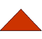
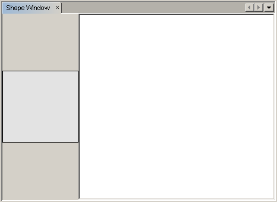

// 
//     Licensed to the Apache Software Foundation (ASF) under one
//     or more contributor license agreements.  See the NOTICE file
//     distributed with this work for additional information
//     regarding copyright ownership.  The ASF licenses this file
//     to you under the Apache License, Version 2.0 (the
//     "License"); you may not use this file except in compliance
//     with the License.  You may obtain a copy of the License at
// 
//       http://www.apache.org/licenses/LICENSE-2.0
// 
//     Unless required by applicable law or agreed to in writing,
//     software distributed under the License is distributed on an
//     "AS IS" BASIS, WITHOUT WARRANTIES OR CONDITIONS OF ANY
//     KIND, either express or implied.  See the License for the
//     specific language governing permissions and limitations
//     under the License.
//

= Tutorial Visual Library do NetBeans
:jbake-type: platform_tutorial
:jbake-tags: tutorials 
:jbake-status: published
:syntax: true
:source-highlighter: pygments
:toc: left
:toc-title:
:icons: font
:experimental:
:description: Tutorial Visual Library do NetBeans - Apache NetBeans
:keywords: Apache NetBeans Platform, Platform Tutorials, Tutorial Visual Library do NetBeans

Neste tutorial, você aprenderá como usar os recursos principais fornecidos pela API Visual Library do NetBeans. A API Visual Library é uma API de visualização, útil no contexto de, por exemplo, modelagem e gráficos.

Opcionalmente, para fins de solução de problemas, você pode  link:http://plugins.netbeans.org/PluginPortal/faces/PluginDetailPage.jsp?pluginid=2701[baixar a amostra completa] e inspecionar os códigos-fonte.

Além disso, você usará 3 ícones no tutorial. Você pode clicar com o botão direito do mouse neles e salvá-los localmente, em seguida, copie-os para a localização do projeto do módulo, depois de criar o projeto do módulo mias tarde neste tutorial. Aqui estão os 3 ícones:

image::images/vislib_image1.png[] 
 
image::images/vislib_image3.png[]

Todas as informações que você precisa saber para trabalhar com a API do Visual Library são coletadas nestes dois locais:

*  link:https://netbeans.apache.org/graph/[Página do projeto do Visual Library]
*  link:https://netbeans.apache.org/graph/documentation.html[Visual Library 2.0 - Documentação]

Além disso, consulte o  link:http://www.javalobby.org/eps/netbeans_visual_library/[Screencast sobre o Visual Library de Roman Strobl] em Javalobby.

== Configurando o módulo

Nesta seção, usamos assistentes para criar um projeto do módulo e um componente de janela personalizado.

[start=1]
1. Escolha Arquivo > Novo projeto. No assistente para Novo projeto. escolha Módulos do NetBeans em Categorias e Módulos em Projetos. Clique em Próximo. Digite  ``ShapeSample``  em Nome do projeto e defina Localização do projeto como uma pasta apropriada no disco. Se não estiverem selecionadas, selecione Módulo independente e Definir como projeto principal. Clique em Próximo.

[start=2]
1. Digite  ``org.netbeans.shapesample``  em Nome de base de código e  ``Amostra de forma``  em Nome de exibição do módulo. Clique em Terminar.

[start=3]
1. Clique com o botão direito do mouse no projeto, escolha Propriedades, clique em Bibliotecas na caixa de diálogo Propriedades do projeto e declare uma dependência nas seguintes APIs:

* API do Visual Library
* API de utilitários

Clique em OK.

[start=4]
1. Clique com o botão direito do mouse no projeto do módulo, escolha Novo > Arquivo/pasta e escolha Componente da janela na categoria Desenvolvimento de módulo do NetBeans. Clique em Próximo. Escolha  ``editor``  na lista suspensa e selecione Abrir ao iniciar aplicativo. Clique em Próximo.

[start=5]
1. Digite  ``Shape``  no Prefixo do nome da classe. Opcionalmente, adicione um ícone com uma dimensão de 16x16 pixels. Clique em Terminar.

Vários arquivos são gerados, um deles é  ``ShapeTopComponent`` . Abra este arquivo no modo Design. O seguinte deverá ser exibido:

[start=6]
1. Clique com o botão direito do mouse em TopComponent no modo Design, escolha Definir layout e selecione BorderLayout.

== Criando a cena

A programação com a API do Visual Library é semelhante à programação em Swing. Você constrói e modifica uma árvore de elementos visuais que são chamados de "widgets". A raiz da árvore é representada por uma classe Cena que mantém todos os dados visuais da cena. A cena é um widget. Você tem que criar uma visualização de cena, que é um JComponent. Em seguida, você deve adicionar o JComponent a um JScrollPane.

Nesta seção, adicionamos um JScrollPane ao nosso TopComponent. Em seguida, crie uma nova cena. Em seguida, passamos a visualização Cena para o TopComponent, de forma que ele possa ser exibido no JScrollPane do TopComponent. Em seguida, instalamos o projeto do módulo e exibimos nossa primeira cena.

[start=1]
1. Use a paleta (Ctrl-Shift-8) para soltar um  ``JScrollPane``  no TopComponent. No Inspetor, clique com o botão direito do mouse em  ``JScrollPane`` , escolha Alterar nome da variável e digite  ``shapePane`` .

[start=2]
1. No pacote  ``org.netbeans.shapesample`` , crie uma classe Java chamada  ``GraphSceneImpl`` . Deixe a classe estender  ``GraphScene`` .

Um sublinhado de erro vermelho e uma lâmpada aparecem. Deixe o IDE gerar a instrução de importação.

Um sublinhado de erro vermelho e uma lâmpada aparecem novamente. Deixe o IDE gerar os métodos abstratos da classe.

[start=3]
1. Crie uma implementação fictícia da classe, adicionando identificadores significativos e configurando  ``leftnull``  para ser retornado quando necessário, de forma que todos os requisitos da classe sejam atendidos:

[source,java]
----

public class GraphSceneImpl extends GraphScene {
    
    public GraphSceneImpl() {
    }
    
    protected Widget attachNodeWidget(Object node) {
        return null;
    }
    
    protected Widget attachEdgeWidget(Object edge) {
        return null;
    }
    
    protected void attachEdgeSourceAnchor(Object edge, Object oldSourceNode, Object newSourceNode) {
    
    }
    
    protected void attachEdgeTargetAnchor(Object edge, Object oldTargetNode, Object newTargetNode) {
            
    }
    
}
----

[start=4]
1. Agora use o construtor do TopComponent para manter uma instância da classe  ``GraphSceneImpl`` . Para fazer isso, adicione o seguinte no fim do construtor da classe  ``ShapeTopComponent`` :

[source,java]
----

GraphSceneImpl scene = new GraphSceneImpl();
myView = scene.createView();

shapePane.setViewportView(myView);
add(scene.createSatelliteView(), BorderLayout.WEST);
----

Observe que estamos criando duas visualizações. A primeira será uma visualização grande para ver seus gráficos ou modelos, etc. A segunda é uma visualização satélite, que colocamos no WEST (ou seja, o lado esquerdo) do TopComponent. Isso permitirá que o usuário navegue rapidamente pela visualização e oferece uma visão geral da cena inteira.

Declare a visualização JComponent:

[source,java]
----

private JComponent myView;
----

[start=5]
1. Quando o IDE é reinicializado, não é necessário persistir o TopComponent. Na verdade, fazer isso causará um erro nesse caso. Portanto, altere PERSISTENCE_ALWAYS para PERSISTENCE_NEVER, como mostrado abaixo:

[source,java]
----

public int getPersistenceType() {
   return TopComponent.PERSISTENCE_NEVER;
}
----

[start=6]
1. Clique com o botão direito do mouse no nó do projeto e escolha "Instalar/recarregar no IDE de desenvolvimento". Se uma mensagem de aviso aparecer, clique em OK.

Quando o módulo é instalado, observe o menu Janela e você encontrará um nome item de menu chamado "Forma", no início da lista de itens de menu. Escolha-o e você verá o início da sua implementação da API do Visual Library:

== Criando uma paleta de componentes da cena

Para fazer algo útil com a API do Visual Library, implementaremos a  link:https://bits.netbeans.org/dev/javadoc/org-netbeans-spi-palette/overview-summary.html[API da paleta] de forma que terminemos com uma paleta de componentes contendo as formas mostradas no início deste tutorial. Mais tarde, adicionaremos a funcionalidade arrastar e soltar da API do Visual Library de forma que possamos arrastar e soltar as formas na cena. Depois disso, podermos enriquecer a cena com recursos adicionais, tais como a habilidade de colocar zoom e panorâmica na cena.

[start=1]
1. Já que o foco deste tutorial é a API do Visual Library, e não a API da paleta, não perderemos tempo explicando como a API da paleta funciona. Existem muitos tutoriais sobre esse assunto ( link:https://netbeans.apache.org/kb/docs/platform.html[aqui]). Portanto, você pode simplesmente copiar e colar os arquivos seguintes em um novo pacote chamado  ``org.netbeans.shapesample.palette`` :
*  link:images/vislib_Category.java[Category.java]
*  link:images/vislib_CategoryChildren.java[CategoryChildren.java]
*  link:images/vislib_CategoryNode.java[CategoryNode.java]
*  link:images/vislib_PaletteSupport.java[PaletteSupport.java]
*  link:images/vislib_Shape.java[Shape.java]
*  link:images/vislib_ShapeChildren.java[ShapeChildren.java]
*  link:images/vislib_ShapeNode.java[ShapeNode.java]

[start=2]
1. Da mesma forma explicada na etapa 3 da seção chamada "Introdução", anteriormente neste tutorial, adicionamos dependências sobre a API de ações, a API de nós e a API de paleta comum.

[start=3]
1. Em seguida, adicionamos a paleta à pesquisa do TopComponent, adicionando esta linha no fim do construtor do TopComponent:

[source,java]
----

associateLookup( Lookups.fixed( new Object[] { PaletteSupport.createPalette() } ) );
----

[start=4]
1. O IDE solicitará que você insira instruções de importação para  ``org.openide.util.lookup.Lookups``  e  ``org.netbeans.shapesample.palette.PaletteSupport`` . Aceite os avisos e permita que o IDE gere as instruções de importação.

[start=5]
1. Coloque as imagens encontradas no início deste tutorial no pacote  ``org.netbeans.shapesample.palette`` .

A janela Projetos agora deve ter esta aparência:

[start=6]
1. Instale o módulo novamente. Quando você abre o TopComponent no item de menu, a nova paleta de componentes e mostrada à direita da cena:

image::images/vislib_firstpalette.png[]

== Adicionando um LayerWidget

Um  link:https://netbeans.apache.org/graph/documentation.html#LayerWidget[LayerWidget] representa um painel de vidro, semelhante a JGlassPane em Swing. Ele é transparente por padrão. Portanto, antes de prosseguir, adicionaremos um LayerWidget à cena, portanto, temos algum lugar para colocar os widgets visíveis que arrastar e soltar na cena.

[start=1]
1. Na classe  ``GraphSceneImpl`` , declare a LayerWidget:

[source,java]
----

private LayerWidget mainLayer;
----

[start=2]
1. No construtor da classe  ``GraphSceneImpl`` , adicione a LayerWidget como uma filha da cena:

[source,java]
----

mainLayer = new LayerWidget (this);
addChild (mainLayer);
----

Agora, quando arrastamos e soltamos itens da paleta como widgets na cena, os adicionaremos como filhos de LayerWidget. Como LayerWidgets são transparentes por padrão, você poderia ter vários LayerWidgets transparentemente um em cima do outro, de forma que, por exemplo, possa adicionar uma imagem de segundo plano à cena.

Para obter detalhes, consulte  link:https://netbeans.apache.org/graph/documentation.html#LayerWidget[LayerWidget] no Javadoc.

== Adicionando um IconNodeWidget por meio da funcionalidade arrastar e soltar

Anteriormente, usamos o construtor da classe  ``GraphSceneImpl``  para passar uma cena para o JScrollPane do TopComponent. Até aqui, a cena existe mas não tem comportamento. O comportamento é adicionado através de ações. A ação que examinaremos nesta seção se chama  `` link:https://netbeans.apache.org/graph/documentation.html#AcceptAction[AcceptAction]`` . Essa ação ativa a funcionalidade arrastar e soltar. A funcionalidade arrastar e soltar poderia ser aplicada a um widget, mas aqui a aplicamos à cena em si.

Usamos  ``createAcceptAction``  para especificar o que deve acontecer quando um item da paleta é arrastado sobre a cena. Dois métodos são envolvidos aqui. A primeira,  ``isAcceptable()`` , é usada para determinar se o item pode ser aceito na cena. Aqui você pode testar o item, usando a transferência. Você também pode definir a imagem arrastada, que é tudo o que fazemos na implementação abaixo. Se  ``true``  for retornado, o método  ``accept``  é chamado. Aqui obtemos a imagem da transferência, usando o mesmo método de ajuda anterior. Em seguida, chamamos o método  ``addNode`` , instanciando um novo  link:https://netbeans.apache.org/graph/documentation.html#IconNodeWidget[IconNodeWidget] e passando a imagem recuperada da transferência.

Todo código desta seção é inter-relacionado, e você receberá sublinhados de erro vermelhos em seu código até que todos os métodos abaixo tenham sido adicionados, mas tentaremos adicionar tudo de uma forma lógica!

[start=1]
1. Primeiro, adicione  ``createAcceptAction`` , com seus dois métodos, ao construtor da classe  ``GraphSceneImpl`` :

[source,java]
----

getActions().addAction(ActionFactory.createAcceptAction(new AcceptProvider() {

    public ConnectorState isAcceptable(Widget widget, Point point, Transferable transferable) {
        Image dragImage = getImageFromTransferable(transferable);
        JComponent view = getView();
        Graphics2D g2 = (Graphics2D) view.getGraphics();
        Rectangle visRect = view.getVisibleRect();
        view.paintImmediately(visRect.x, visRect.y, visRect.width, visRect.height);
        g2.drawImage(dragImage,
                AffineTransform.getTranslateInstance(point.getLocation().getX(),
                point.getLocation().getY()),
                null);
        return ConnectorState.ACCEPT;
    }

    public void accept(Widget widget, Point point, Transferable transferable) {
        Image image = getImageFromTransferable(transferable);
        Widget w = GraphSceneImpl.this.addNode(new MyNode(image));
        w.setPreferredLocation(widget.convertLocalToScene(point));
    }

}));
----

*Observação:* depois de adicionar o código acima, alguns sublinhados vermelhos permanecerão, indique que há erros. Esses erros acontecem porque o código acima se refere a um método e a uma classe que ainda não foram criados. Você irá criá-los nas próximas etapas.

[start=2]
1. Em seguida, na classe  ``GraphSceneImpl`` , adicione um método de ajuda para recuperar a imagem da transferência:

[source,java]
----

private Image getImageFromTransferable(Transferable transferable) {
    Object o = null;
    try {
        o = transferable.getTransferData(DataFlavor.imageFlavor);
    } catch (IOException ex) {
        ex.printStackTrace();
    } catch (UnsupportedFlavorException ex) {
        ex.printStackTrace();
    }
    return o instanceof Image ? (Imagem) o : Utilities.loadImage("org/netbeans/shapesample/palette/shape1.png");
}
----

Observe que você pode definir qualquer tipo de imagem quando uma imagem não é retornada com êxito desse método de ajuda. Por enquanto, usaremos a imagem " ``shape1.png`` " em vez disso.

[start=3]
1. Crie uma nova classe chamada  ``MyNode`` . Essa classe representa um nó em um modelo orientado a gráfico. Ela não pode ser uma imagem diretamente, já que cada nó deve ser único (verificado pelo método "equals") no modelo. Se você quisesse usar as imagens diretamente, então, poderia ter somente 3 nós (um para cada imagem) na cena. Usando a classe MyNode, você pode ter vários nós e cada nó pode ter sua própria instância de imagem ou uma compartilhada.

[source,java]
----

public class MyNode {
    
    private Image image;
    
    public MyNode(Image image) {
        this.image = image;
    }
    
    public Image getImage() {
        return image;
    }
}
----

[start=4]
1. Altere a assinatura da classe  ``GraphSceneImpl``  para o seguinte, de forma que o nó seja recebido pela classe de implementação do Visual Library:

[source,java]
----

extends GraphScene<MyNode, String>
----

Você deve deixar o IDE gerar novos stubs para os métodos abstratos.

Além disso, já que agora estamos usando genéricos, certifique-se de que o IDE esteja usando o JDK 1.5. Se você não tem certeza se o 1.6 está sendo usado, clique com o botão direito do mouse no projeto, escolha Propriedades e vá para a página Códigos-fonte. Altere a lista suspensa Nível do código-fonte para 1.5.

[start=5]
1. Finalmente, defina o novo widget na classe  ``GraphSceneImpl`` . Esse método é chamado automaticamente pelo método  ``accept`` . Use-o para definir o widget do Visual Library quando o item da paleta for solto.

[source,java]
----

protected Widget attachNodeWidget(MyNode node) {
    IconNodeWidget widget = new IconNodeWidget(this);
    widget.setImage(node.getImage());
    widget.setLabel(Long.toString(node.hashCode()));
    widget.getActions().addAction(ActionFactory.createMoveAction());
    mainLayer.addChild(widget);
    return widget;
}
----

Observe que definimos a imagem recuperada do no. Também geramos um número aleatório para que tenhamos um rótulo. Por padrão, o widget existe mas não tem comportamento. Aqui, criamos uma ação de movimento, de forma que o widget possa ser movido na cena. Finalmente, antes de retornar o widget para a cena, o adicionamos como um filho ao LayerWidget que criamos na seção anterior.

[start=6]
1. Recarregue o módulo e abra-o na janela Forma novamente.

Agora você pode arrastar e saltar itens da paleta. Conforme você arrastar um item sobre a cena, você verá a imagem arrastada. Quando você solta um item, ele se torna um widget e fica visível na cena, assim como na visualização satélite, como você pode ver aqui:

image::images/vislib_finishedscene.png[]

== Adicionando funcionalidade à cena

Na cena anterior, adicionamos  `` link:https://netbeans.apache.org/graph/documentation.html#AcceptAction[AcceptAction]``  à cena. Tínhamos que definir dois métodos para especificar se o item deve ser solto e para resolver o item. Nesta seção, usamos  `` link:https://netbeans.apache.org/graph/documentation.html#ZoomAction[ZoomAction]`` , para adicionar a funcionalidade mais zoom/menos zoom à cena.

[start=1]
1. No fim do construtor da classe  ``GraphSceneImpl`` , adicione esta linha:

[source,java]
----

getActions().addAction(ActionFactory.createZoomAction());
----

[start=2]
1. Instale o módulo novamente.

[start=3]
1. Enquanto mantém a tecla CTRL pressionada, use a roda do mouse para colocar mais zoom e menos zoom na cena:

image::images/vislib_zoom.png[]

image::images/vislib_unzoom.png[]

*Observação:* As formas são renderizadas como imagens. SVG não tem suporte no momento.

Da mesma forma descrita acima, você pode adicionar a funcionalidade Panorâmica à cena, por meio desta linha:

[source,java]
----

getActions().addAction(ActionFactory.createPanAction());
----

Quando você adicionar essa linha, o usuário poderá manter a roda do mouse pressionada e rolar em qualquer direção na cena.

== Adicionando funcionalidade ao IconNodeWidget

Anteriormente, adicionamos  `` link:https://netbeans.apache.org/graph/documentation.html#MoveAction[MoveAction]``  ao IconNodeWidget, para ativar o comportamento de movimentação do widget. Dessa forma, muitos outros comportamentos podem ser adicionados ao widget. Nesta seção, adicionamos  `` link:https://netbeans.apache.org/graph/documentation.html#HoverAction[HoverAction]`` ,  `` link:https://netbeans.apache.org/graph/documentation.html#SelectAction[SelectAction]``  e  `` link:https://netbeans.apache.org/graph/documentation.html#InplaceEditorAction[InplaceEditorAction]`` .

O  ``InplaceEditorAction``  permitirá que o usuário altere o rótulo:

image::images/vislib_editable.png[]

O  ``SelectAction``  irá alterar a cor do rótulo quando o widget for selecionado, enquanto o  ``HoverAction``  irá alterar a cor do rótulo quando o mouse passar sobre o widget:

image::images/vislib_selectable-hoverable.png[]

[start=1]
1. Primeiro, defina a ação do editor que adicionaremos ao IconNodeWidget:

[source,java]
----

private WidgetAction editorAction = ActionFactory.createInplaceEditorAction(new LabelTextFieldEditor());
----

[start=2]
1. Agora, defina o  ``LabelTextFieldEditor`` , da seguinte forma:

[source,java]
----

private class LabelTextFieldEditor implements TextFieldInplaceEditor {

    public boolean isEnabled(Widget widget) {
        return true;
    }

    public String getText(Widget widget) {
        return ((LabelWidget) widget).getLabel();
    }

    public void setText(Widget widget, String text) {
        ((LabelWidget) widget).setLabel(text);
    }

}
----

[start=3]
1. Finalmente, atribua a ação do editor ao IconNodeWidget, na mesma forma feita com a ação de movimento anteriormente:

[source,java]
----

widget.getLabelWidget().getActions().addAction(editorAction);
----

Aqui, primeiro obtemos o LabelWidget do IconNodeWidget. Em seguida, adicionamos a ação do editor ao LabelWidget.

[start=4]
1. O IDE solicita que você adicione várias instruções de importação. Em cada caso, aceite a sugestão oferecida pelo IDE.

[start=5]
1. Em seguida, no caso de  ``SelectAction``  e  ``HoverAction`` , você não precisa fazer nada além de atribuir essas ações ao IconNodeWidget:

[source,java]
----

widget.getActions().addAction(createSelectAction());
widget.getActions().addAction(createObjectHoverAction());
----

[start=6]
1. Em seguida, você precisa pensar sobre a ordem das ações criadas. Para obter detalhes, consulte a seção  link:https://netbeans.apache.org/graph/documentation.html#OrderOfActions[Ordem de ações] na documentação. Depois de reordenar as ações, o  ``attachNodeWidget``  deve ter a seguinte aparência:

[source,java]
----

protected Widget attachNodeWidget(MyNode node) {
    IconNodeWidget widget = new IconNodeWidget(this);
    widget.setImage(node.getImage());
    widget.setLabel(Long.toString(node.hashCode()));

    //double-click, the event is consumed while double-clicking only:
    widget.getLabelWidget().getActions().addAction(editorAction);

    //single-click, the event is not consumed:
    widget.getActions().addAction(createSelectAction()); 

    //mouse-dragged, the event is consumed while mouse is dragged:
    widget.getActions().addAction(ActionFactory.createMoveAction()); 

    //mouse-over, the event is consumed while the mouse is over the widget:
    widget.getActions().addAction(createObjectHoverAction()); 

    mainLayer.addChild(widget);
    return widget;
}
----

[start=7]
1. Instale e experimente o módulo novamente. Como mostrado no início desta seção, quando você passar o mouse sobre o rótulo do widget, ou quando você o selecionar, sua cor mudará. Além disso, quando você clica em um rótulo, é possível editar seu conteúdo.

Parabéns, você concluiu o Tutorial do Visual Library 2.0 para NetBeans 6.0.

link:http://netbeans.apache.org/community/mailing-lists.html[Envie-nos seus comentários]

== Próximas etapas

Para obter mais informações sobre como trabalhar com a API do Visual Library, consulte:

*  link:http://www.javalobby.org/eps/netbeans_visual_library/[Screencast sobre o Visual Library de Roman Strobl] em Javalobby.
*  link:https://netbeans.apache.org/graph/[Página do projeto do Visual Library]
*  link:https://netbeans.apache.org/graph/documentation.html[Visual Library 2.0 - Documentação]
