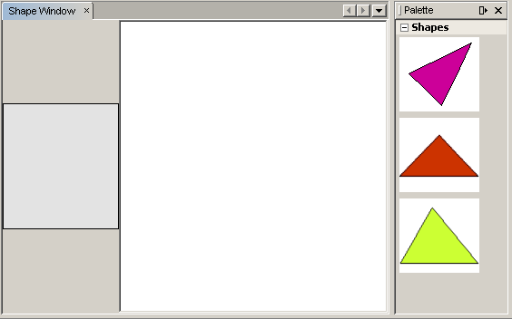
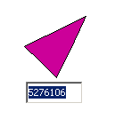

// 
//     Licensed to the Apache Software Foundation (ASF) under one
//     or more contributor license agreements.  See the NOTICE file
//     distributed with this work for additional information
//     regarding copyright ownership.  The ASF licenses this file
//     to you under the Apache License, Version 2.0 (the
//     "License"); you may not use this file except in compliance
//     with the License.  You may obtain a copy of the License at
// 
//       http://www.apache.org/licenses/LICENSE-2.0
// 
//     Unless required by applicable law or agreed to in writing,
//     software distributed under the License is distributed on an
//     "AS IS" BASIS, WITHOUT WARRANTIES OR CONDITIONS OF ANY
//     KIND, either express or implied.  See the License for the
//     specific language governing permissions and limitations
//     under the License.
//

= Руководство по работе с Visual Library в среде NetBeans
:jbake-type: platform_tutorial
:jbake-tags: tutorials 
:jbake-status: published
:syntax: true
:source-highlighter: pygments
:toc: left
:toc-title:
:icons: font
:experimental:
:description: Руководство по работе с Visual Library в среде NetBeans - Apache NetBeans
:keywords: Apache NetBeans Platform, Platform Tutorials, Руководство по работе с Visual Library в среде NetBeans

Это руководство посвящено работе с основными возможностями, предусмотренными в интерфейсе API для Visual Library в среде NetBeans. Интерфейс API для Visual Library – это интерфейс визуализации, который удобно использовать в контексте, например, моделирования и построения графов.

Дополнительно, в целях поиска и устранения ошибок, можно  link:http://plugins.netbeans.org/PluginPortal/faces/PluginDetailPage.jsp?pluginid=2701[загрузить готовые примеры] и изучить исходный код.

В этом руководстве также будут использоваться 3 значка. Здесь можно щелкнуть каждый из них правой кнопкой мыши и сохранить его локально, либо скопировать в местоположение проекта модуля после его создания в соответствии с указаниями, приведенными в данном руководстве. Это следующие значки:

image::images/vislib_image1.png[] 
image::images/vislib_image2.png[] 
image::images/vislib_image3.png[]

Вся информация, которая потребуется для работы с интерфейсом API для Visual Library, собрана в следующих двух источниках:

*  link:https://netbeans.apache.org/graph/[Страница проекта Visual Library]
*  link:https://netbeans.apache.org/graph/documentation.html[Документация по Visual Library 2.0]

Также см.  link:http://www.javalobby.org/eps/netbeans_visual_library/[демонстрацию по Visual Library, подготовленную Романом Штроблем (Roman Strobl),] на сайте Javalobby.

== Настройка модуля

В этом разделе демонстрируется использование программ-мастеров для создания проекта модуля и собственного оконного элемента.

[start=1]
1. Выберите "File > New Project". В мастере создания проекта выберите "NetBeans Modules" в области "Categories" и "Module" в области "Projects". Нажмите кнопку "Next". Введите  ``ShapeSample``  в поле "Project Name" и укажите соответствующую папку на диске в поле "Project Location". Выберите "Standalone Module" и "Set as Main Project", если эти параметры не выбраны. Нажмите кнопку "Next".

[start=2]
1. Введите  ``org.netbeans.shapesample``  в поле "Code Name Base" и  ``Shape Sample``  в поле "Module Display Name". Нажмите кнопку "Finish".

[start=3]
1. Щелкните проект правой кнопкой мыши, выберите "Properties", щелкните "Libraries" в диалоговом окне "Project Properties" и установите зависимость от следующих интерфейсов API:

* Visual Library API
* Utilities API

Нажмите кнопку "OK".

[start=4]
1. Щелкните проект модуля правой кнопкой мыши, выберите "New > File/Folder", затем выберите "Window Component" из категории "NetBeans Module Development". Нажмите кнопку "Next". Выберите  ``editor``  в раскрывающемся списке и затем выберите "Open on Application Start". Нажмите кнопку "Next".

[start=5]
1. Введите  ``Shape``  в поле "Class Name Prefix". При необходимости можно добавить значок размером 16x16 пикселей. Нажмите кнопку "Finish".

Создается несколько файлов, один из которых –  ``ShapeTopComponent`` . Откройте этот файл в режиме проектирования. Экран должен выглядеть следующим образом:

image::images/vislib_shapetopcomponent.png[]

[start=6]
1. Щелкните правой кнопкой мыши элемент "TopComponent" в режиме проектирования, выберите "Set Layout" и затем выберите "BorderLayout".

== Создание рабочего пространства

Программирование с использованием интерфейса API для Visual Library аналогично программированию в Swing. При этом составляется и изменяется дерево визуальных элементов, именуемых элементами оформления окон (widgets). Корень дерева представлен классом "Scene", содержащим все визуальные характеристики рабочего пространства. Само рабочее пространство также представляет собой элемент оформления окон. Необходимо создать представление рабочего пространства, которое является элементом "JComponent". Затем следует добавить "JComponent" к элементу "JScrollPane".

В этом разделе представлена процедура добавления элемента "JScrollPane" к "TopComponent". Затем создается новое рабочее пространство. Представление рабочего пространства передается в элемент "TopComponent", что позволяет вывести его в элементе "JScrollPane" элемента "TopComponent". После этого осуществляется установка проекта модуля и вывод на экран первого рабочего пространства.

[start=1]
1. При помощи окна "Palette" (Ctrl-Shift-8) перетащите  ``JScrollPane``  к элементу "TopComponent". В окне "Inspector" щелкните правой кнопкой мыши  ``JScrollPane`` , выберите "Change Variable Name" и введите  ``shapePane`` .

[start=2]
1. В пакете  ``org.netbeans.shapesample``  создайте класс Java с именем  ``GraphSceneImpl`` . Этот класс должен расширять  ``GraphScene`` .

Появляется красное подчеркивание, указывающее на ошибку, и изображение лампочки. Подтвердите создание оператора импорта средой IDE.

Снова появляется красное подчеркивание, указывающее на ошибку, и изображение лампочки. Подтвердите создание абстрактных методов класса средой IDE.

[start=3]
1. Создайте фиктивную реализацию класса путем добавления значимых идентификаторов и настройки возврата  ``null``  там, где это необходимо, для удовлетворения всех требований класса:

[source,java]
----

public class GraphSceneImpl extends GraphScene {
    
    public GraphSceneImpl() {
    }
    
    protected Widget attachNodeWidget(Object node) {
        return null;
    }
    
    protected Widget attachEdgeWidget(Object edge) {
        return null;
    }
    
    protected void attachEdgeSourceAnchor(Object edge, Object oldSourceNode, Object newSourceNode) {
    
    }
    
    protected void attachEdgeTargetAnchor(Object edge, Object oldTargetNode, Object newTargetNode) {
            
    }
    
}
----

[start=4]
1. Теперь вставьте в конструктор элемента "TopComponent" экземпляр класса  ``GraphSceneImpl`` . Для этого добавьте в конец конструктора класса  ``ShapeTopComponent``  следующее:

[source,java]
----

GraphSceneImpl scene = new GraphSceneImpl();
myView = scene.createView();

shapePane.setViewportView(myView);
add(scene.createSatelliteView(), BorderLayout.WEST);
----

Обратите внимание, что создается два представления. Первое – это развернутое представление для визуализации графов, моделей и т.д. Второе – вспомогательное представление с левой стороны элемента "TopComponent". Наличие двух представлений позволит пользователю быстро перемещаться по основному представлению с одновременным обзором всего рабочего пространства.

Объявите представление "JComponent":

[source,java]
----

private JComponent myView;
----

[start=5]
1. Обеспечивать сохранение состояния элемента "TopComponent" при перезапуске среды IDE не требуется. Напротив, в нашем случае это будет ошибкой. Поэтому замените PERSISTENCE_ALWAYS на PERSISTENCE_NEVER, как показано ниже:

[source,java]
----

public int getPersistenceType() {
   return TopComponent.PERSISTENCE_NEVER;
}
----

[start=6]
1. Щелкните правой кнопкой мыши узел проекта и выберите "Install/Reload in Development IDE". Если появляется предупреждающее сообщение, нажмите кнопку "OK".

В процессе установки модуля в списке пунктов меню "Window" появляется новый пункт "Shape". При выборе этого пункта запускается подготовленная реализация интерфейса API для Visual Library:

image::images/vislib_firstscene.png[]

== Создание палитры элементов для рабочего пространства

Для практического применения интерфейса API для Visual Library будет реализован  link:https://bits.netbeans.org/dev/javadoc/org-netbeans-spi-palette/overview-summary.html[интерфейс API "Palette"], что позволит создать палитру элементов с фигурами, показанными в начале данного руководства. Затем добавим функциональность перетаскивания, предусмотренную в интерфейсе API для Visual Library, при помощи которой можно будет размещать фигуры в рабочем пространстве путем перетаскивания. После этого расширим рабочее пространство путем добавления дополнительных возможностей, например, масштабирования и перемещения по рабочему пространству.

[start=1]
1. Поскольку это руководство посвящено интерфейсу API для Visual Library, а не интерфейсу "Palette", подробное описание принципов работы последнего здесь не приводится. По этой теме существует достаточно много других руководств ( link:https://netbeans.apache.org/kb/docs/platform.html[например, здесь]). Поэтому просто скопируйте и вставьте в новый пакет с именем  ``org.netbeans.shapesample.palette``  следующие файлы:
*  link:images/vislib_Category.java[Category.java]
*  link:images/vislib_CategoryChildren.java[CategoryChildren.java]
*  link:images/vislib_CategoryNode.java[CategoryNode.java]
*  link:images/vislib_PaletteSupport.java[PaletteSupport.java]
*  link:images/vislib_Shape.java[Shape.java]
*  link:images/vislib_ShapeChildren.java[ShapeChildren.java]
*  link:images/vislib_ShapeNode.java[ShapeNode.java]

[start=2]
1. Добавьте зависимости от интерфейсов API Actions, Nodes и Common Palette аналогично способу, описанному в действии 3 раздела "Начало работы".

[start=3]
1. Затем добавьте палитру к элементу "Lookup" элемента "TopComponent" путем вставки следующей строки в конец конструктора "TopComponent":

[source,java]
----

associateLookup( Lookups.fixed( new Object[] { PaletteSupport.createPalette() } ) );
----

[start=4]
1. Среда IDE предложит вставить операторы импорта для  ``org.openide.util.lookup.Lookups``  и  ``org.netbeans.shapesample.palette.PaletteSupport`` . Подтвердите предложение, после чего средой IDE будут автоматически созданы операторы импорта.

[start=5]
1. Поместите изображения, приведенные в начале этого руководства, в пакет  ``org.netbeans.shapesample.palette`` .

Окно "Projects" теперь должно выглядеть следующим образом:

image::images/vislib_proj-window.png[]

[start=6]
1. Установите модуль еще раз. При вызове элемента "TopComponent" при помощи соответствующего пункта меню справа от рабочего пространства отображается палитра элементов:

== Добавление элемента "LayerWidget"

Элемент  link:https://netbeans.apache.org/graph/documentation.html#LayerWidget[LayerWidget] представляет собой "прозрачный слой" (glasspane), похожий на элемент "JGlassPane" в Swing. Этот элемент прозрачен по умолчанию. Прежде, чем двигаться дальше, добавим элемент "LayerWidget" к рабочему пространству, что позволит в дальнейшем размешать видимые элементы оформления окон путем их перетаскивания в это пространство.

[start=1]
1. Объявите элемент "LayerWidget" в классе  ``GraphSceneImpl`` :

[source,java]
----

private LayerWidget mainLayer;
----

[start=2]
1. В конструкторе класса  ``GraphSceneImpl``  добавьте элемент "LayerWidget" как подчиненный элемент рабочего пространства:

[source,java]
----

mainLayer = new LayerWidget (this);
addChild (mainLayer);
----

Теперь при перетаскивании элементов из палитры в рабочее пространство в качестве элементов оформления окон они будут добавляться как подчиненные элементу "LayerWidget". Поскольку элементы "LayerWidget" по умолчанию являются прозрачными, можно добавить множество таких элементов, один над другим, и таким образом вставить в рабочее пространство, например, фоновое изображение.

Для получения более подробной информации см. описание элемента  link:https://netbeans.apache.org/graph/documentation.html#LayerWidget[LayerWidget] в документации Javadoc.

== Добавление элемента "IconNodeWidget" с функциональностью перетаскивания

Ранее конструктор класса  ``GraphSceneImpl``  использовался для передачи рабочего пространства в элемент "JScrollPane" элемента "TopComponent". Рабочее пространство существует, однако для него еще не настроено поведение. Для настройки поведения нами будут использоваться действия. В этом разделе будет рассмотрено действие  `` link:https://netbeans.apache.org/graph/documentation.html#AcceptAction[AcceptAction]`` . Это действие предоставляет функциональность перетаскивания. Функциональность перетаскивания может применяться в отношении элемента оформления окон, однако в нашем случае она будет применена к самому рабочему пространству.

Для определения того, что должно происходить при перетаскивании элемента из палитры в пределах рабочего пространства, будет использоваться действие  ``createAcceptAction`` . Здесь задействованы два метода. Первый метод –  ``isAcceptable()``  – позволяет определить приемлемость элемента для рабочего пространства. Таким образом можно протестировать перемещаемый элемент. Также можно определить изображение, которое будет появляться при перетаскивании. Это демонстрируется в примере ниже. Если возвращается  ``true`` , вызывается метод  ``accept`` . Получение изображения от перемещаемого элемента производится с использованием того же вспомогательного метода, что и ранее. Затем вызывается метод  ``addNode`` , создающий новый экземпляр  link:https://netbeans.apache.org/graph/documentation.html#IconNodeWidget[IconNodeWidget] и передающий изображение, полученное от перемещаемого элемента.

Весь код в этом разделе взаимосвязан, и пока не будут добавлены все названные ниже методы, в коде будут появляться ошибки, обозначенные красным подчеркиванием. Тем не менее, мы попробуем добавить все методы в некоторой логической последовательности.

[start=1]
1. Прежде всего, добавьте к конструктору класса  ``GraphSceneImpl``   ``createAcceptAction``  и два связанных метода:

[source,java]
----

getActions().addAction(ActionFactory.createAcceptAction(new AcceptProvider() {

    public ConnectorState isAcceptable(Widget widget, Point point, Transferable transferable) {
        Image dragImage = getImageFromTransferable(transferable);
        JComponent view = getView();
        Graphics2D g2 = (Graphics2D) view.getGraphics();
        Rectangle visRect = view.getVisibleRect();
        view.paintImmediately(visRect.x, visRect.y, visRect.width, visRect.height);
        g2.drawImage(dragImage,
                AffineTransform.getTranslateInstance(point.getLocation().getX(),
                point.getLocation().getY()),
                null);
        return ConnectorState.ACCEPT;
    }

    public void accept(Widget widget, Point point, Transferable transferable) {
        Image image = getImageFromTransferable(transferable);
        Widget w = GraphSceneImpl.this.addNode(new MyNode(image));
        w.setPreferredLocation(widget.convertLocalToScene(point));
    }

}));
----

NOTE:  После добавления вышеприведенного кода некоторые красные подчеркивания не исчезнут, свидетельствуя о наличии ошибки. Причина появления ошибок состоит в том, что этот код содержит ссылки на метод и класс, которые еще не созданы. Они будут созданы на одном из следующих этапов.

[start=2]
1. Затем в классе  ``GraphSceneImpl``  добавьте вспомогательный метод для получения изображения из перемещаемого элемента:

[source,java]
----

private Image getImageFromTransferable(Transferable transferable) {
    Object o = null;
    try {
        o = transferable.getTransferData(DataFlavor.imageFlavor);
    } catch (IOException ex) {
        ex.printStackTrace();
    } catch (UnsupportedFlavorException ex) {
        ex.printStackTrace();
    }
    return o instanceof Image ? (Image) o : Utilities.loadImage("org/netbeans/shapesample/palette/shape1.png");
}
----

Обратите внимание, что можно указать любое произвольное изображение на случай, если вспомогательный метод не возвращает какое-либо изображение. В примере для этого будет использоваться изображение " ``shape1.png`` ".

[start=3]
1. Создайте новый класс с именем  ``MyNode`` . Этот класс представляет узел в графо-ориентированной модели. Он не может быть непосредственно изображением, так как каждый узел в модели должен быть уникальным (это проверяется методом "equals"). Если бы использовались непосредственно изображения, то можно было бы получить только 3 узла в рабочем пространстве (по одному для каждого изображения). При помощи класса "MyNode" можно получить несколько узлов, каждый из которых может иметь свой собственный или совместно используемый экземпляр изображения.

[source,java]
----

public class MyNode {
    
    private Image image;
    
    public MyNode(Image image) {
        this.image = image;
    }
    
    public Image getImage() {
        return image;
    }
}
----

[start=4]
1. Измените подпись класса  ``GraphSceneImpl`` , как показано ниже, для получения узла классом реализации "Visual Library":

[source,java]
----

extends GraphScene<MyNode, String>
----

Подтвердите автоматическое создание средой IDE новых заглушек для абстрактных методов.

Кроме того, поскольку в нашем примере используются общие объекты, в среде IDE должен присутствовать инструментарий JDK 1.5. Если точная версия неизвестна, щелкните правой кнопкой мыши проект, выберите "Properties" и перейдите на страницу "Sources". В раскрывающемся списке "Source Level" выберите "1.5".

[start=5]
1. Наконец, определите новый элемент оформления окон в классе  ``GraphSceneImpl`` . Этот метод автоматически вызывается методом  ``accept`` . Он используется для определения элемента оформления окон Visual Library при перетаскивании элемента палитры.

[source,java]
----

protected Widget attachNodeWidget(MyNode node) {
    IconNodeWidget widget = new IconNodeWidget(this);
    widget.setImage(node.getImage());
    widget.setLabel(Long.toString(node.hashCode()));
    widget.getActions().addAction(ActionFactory.createMoveAction());
    mainLayer.addChild(widget);
    return widget;
}
----

Обратите внимание на установку изображения, получаемого от узла. В качестве идентифицирующей метки будет использоваться генерируемое случайное число. По умолчанию элемент оформления окон существует, но его поведение не определено. Для получения возможности перемещения элемента оформления окон в рабочем пространстве необходимо создать действие по перемещению. Перед возвратом элемента оформления окон в рабочее пространство его следует добавить в качестве подчиненного элементу "LayerWidget", который был создан в предыдущем разделе.

[start=6]
1. Перезагрузите модуль и снова откройте окно "Shape".

Теперь имеется возможность перетаскивания элементов из палитры. При перемещении элемента в рабочем пространстве отображается изображение, которое было определено как изображение при перетаскивании. По завершении перемещения оно заменяется элементом оформления окон, отображаемым в рабочем пространстве, а также во вспомогательном представлении, как показано на следующем рисунке:

image::images/vislib_finishedscene.png[]

== Добавление функциональности в рабочее пространство

В предыдущем разделе мы добавили к рабочему пространству  `` link:https://netbeans.apache.org/graph/documentation.html#AcceptAction[AcceptAction]`` . Необходимо было определить два метода, которые проверяли возможность перетаскивания элемента и способ его обработки. В этом разделе при помощи  `` link:https://netbeans.apache.org/graph/documentation.html#ZoomAction[ZoomAction]``  к рабочему пространству будет добавлена функциональность для изменения масштаба.

[start=1]
1. Добавьте следующую строку в конструктор класса  ``GraphSceneImpl`` :

[source,java]
----

getActions().addAction(ActionFactory.createZoomAction());
----

[start=2]
1. Установите модуль еще раз.

[start=3]
1. Удерживая нажатой клавишу CTRL, попробуйте изменить масштаб в рабочем пространстве при помощи колеса мыши:

image::images/vislib_zoom.png[]

image::images/vislib_unzoom.png[]

NOTE:  Фигуры визуализируются как изображения. SVG в настоящее время не поддерживается.

Как и ранее, для добавления возможности перемещения по рабочему пространству вставьте следующую строку:

[source,java]
----

getActions().addAction(ActionFactory.createPanAction());
----

После добавления этой строки пользователь сможет перемещаться по рабочему пространству в любом направлении путем нажатия и поворота колеса мыши.

== Добавление функциональности к элементу "IconNodeWidget"

Ранее для добавления возможности перемещения элемента оформления окон "IconNodeWidget" к нему было добавлено действие  `` link:https://netbeans.apache.org/graph/documentation.html#MoveAction[MoveAction]`` . Аналогичным образом для этого элемента оформления окон можно настроить и другие возможности поведения. В этом разделе мы добавим действия  `` link:https://netbeans.apache.org/graph/documentation.html#HoverAction[HoverAction]`` ,  `` link:https://netbeans.apache.org/graph/documentation.html#SelectAction[SelectAction]``  и  `` link:https://netbeans.apache.org/graph/documentation.html#InplaceEditorAction[InplaceEditorAction]`` .

Действие  ``InplaceEditorAction``  позволит пользователю изменять подпись (метку) элемента:

Действие  ``SelectAction``  используется для изменения цвета подписи при выделении элемента оформления окон, а действие  ``HoverAction``  изменяет цвет подписи при наведении на элемент указателя мыши:

image::images/vislib_selectable-hoverable.png[]

[start=1]
1. Сначала определим действие "Editor", которое будет добавлено к элементу "IconNodeWidget":

[source,java]
----

private WidgetAction editorAction = ActionFactory.createInplaceEditorAction(new LabelTextFieldEditor());
----

[start=2]
1. Затем определим  ``LabelTextFieldEditor`` :

[source,java]
----

private class LabelTextFieldEditor implements TextFieldInplaceEditor {

    public boolean isEnabled(Widget widget) {
        return true;
    }

    public String getText(Widget widget) {
        return ((LabelWidget) widget).getLabel();
    }

    public void setText(Widget widget, String text) {
        ((LabelWidget) widget).setLabel(text);
    }

}
----

[start=3]
1. Наконец, присвоим действие "Editor" элементу "IconNodeWidget" способом, аналогичным вышеописанной настройке действия "Move":

[source,java]
----

widget.getLabelWidget().getActions().addAction(editorAction);
----

Здесь сначала получаем элемент "LabelWidget" элемента оформления окон "IconNodeWidget". Затем к "LabelWidget" добавляется действие "Editor".

[start=4]
1. Среда IDE предложит добавить несколько операторов импорта. В каждом случае следует подтвердить предложенный средой IDE оператор.

[start=5]
1. Затем, в случаях  ``SelectAction``  и  ``HoverAction`` , потребуется лишь присвоить эти действия элементу "IconNodeWidget":

[source,java]
----

widget.getActions().addAction(createSelectAction());
widget.getActions().addAction(createObjectHoverAction());
----

[start=6]
1. Теперь необходимо определить порядок выполнения созданных действий. Для получения более подробной информации см. раздел  link:https://netbeans.apache.org/graph/documentation.html#OrderOfActions[Определение порядка действий] в документации. После изменения порядка действий код  ``attachNodeWidget``  должен выглядеть следующим образом:

[source,java]
----

protected Widget attachNodeWidget(MyNode node) {
    IconNodeWidget widget = new IconNodeWidget(this);
    widget.setImage(node.getImage());
    widget.setLabel(Long.toString(node.hashCode()));

    //Двойной щелчок, событие используется только при двойном щелчке:
    widget.getLabelWidget().getActions().addAction(editorAction);

    //Однократный щелчок, событие не используется:
    widget.getActions().addAction(createSelectAction()); 

    //Перетаскивание мышью, событие используется во время перемещения указателя мыши:
    widget.getActions().addAction(ActionFactory.createMoveAction()); 

    //Наведение мыши; событие используется при перемещении указателя мыши по элементу оформления окон :
    widget.getActions().addAction(createObjectHoverAction()); 

    mainLayer.addChild(widget);
    return widget;
}
----

[start=7]
1. Установите и снова протестируйте модуль. Как было показано в начале этого раздела, при наведении указателя мыши на подпись к элементу оформления окон или при выделении этого элемента его цвет изменяется. Кроме того, после щелчка подписи ее текст можно изменить.

Поздравляем! Руководство по работе с Visual Library 2.0 в среде NetBeans 6.0 завершено.

link:http://netbeans.apache.org/community/mailing-lists.html[Мы ждем ваших отзывов]

== Что дальше?

Для получения дополнительной информации о работе с интерфейсом API для "Visual Library" см.:

*  link:http://www.javalobby.org/eps/netbeans_visual_library/[Демонстрация по Visual Library, подготовленная Романом Штроблем (Roman Strobl),] на сайте Javalobby.
*  link:https://netbeans.apache.org/graph/[Страница проекта Visual Library]
*  link:https://netbeans.apache.org/graph/documentation.html[Документация по Visual Library 2.0]
