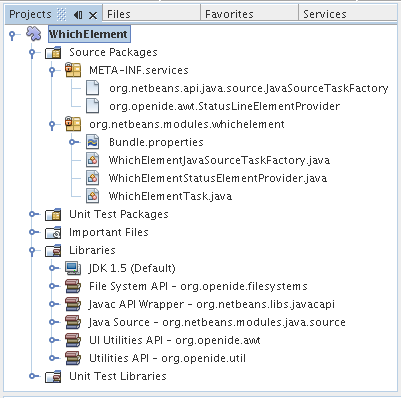
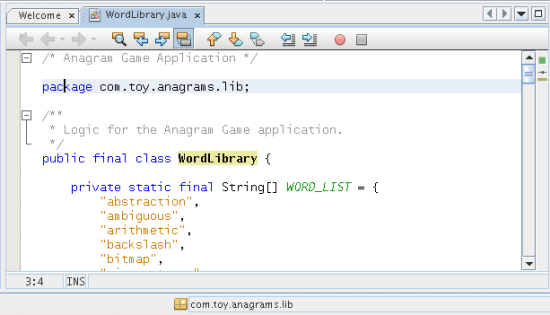
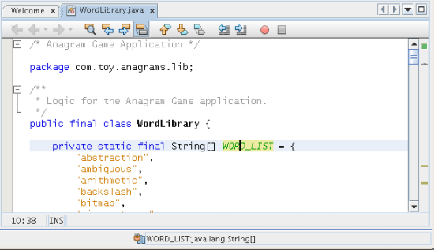
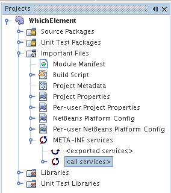
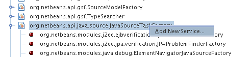
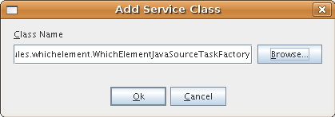
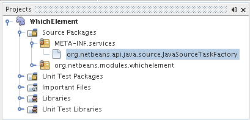
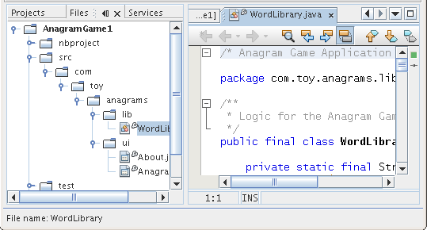
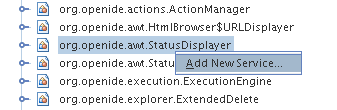

// 
//     Licensed to the Apache Software Foundation (ASF) under one
//     or more contributor license agreements.  See the NOTICE file
//     distributed with this work for additional information
//     regarding copyright ownership.  The ASF licenses this file
//     to you under the Apache License, Version 2.0 (the
//     "License"); you may not use this file except in compliance
//     with the License.  You may obtain a copy of the License at
// 
//       http://www.apache.org/licenses/LICENSE-2.0
// 
//     Unless required by applicable law or agreed to in writing,
//     software distributed under the License is distributed on an
//     "AS IS" BASIS, WITHOUT WARRANTIES OR CONDITIONS OF ANY
//     KIND, either express or implied.  See the License for the
//     specific language governing permissions and limitations
//     under the License.
//

= NetBeans Java Language Infrastructure Tutorial (Part 2)
:jbake-type: platform_tutorial
:jbake-tags: tutorials 
:jbake-status: published
:syntax: true
:source-highlighter: pygments
:toc: left
:toc-title:
:icons: font
:experimental:
:description: NetBeans Java Language Infrastructure Tutorial (Part 2) - Apache NetBeans
:keywords: Apache NetBeans Platform, Platform Tutorials, NetBeans Java Language Infrastructure Tutorial (Part 2)

In the  link:nbm-copyfqn.html[previous tutorial], you created a button in the toolbar which, when clicked, explicitly invoked the underlying Java language infrastructure. In this tutorial, you will make implicit calls to the same infrastructure, by registering factory classes in the META-INF/services folder. At the end of this tutorial, the Projects window will look as follows:

After installation of the module, information about the  ``Element``  under the caret is displayed in a read-only textfield in the IDE's status bar. For example, if a package is identified under the caret, the textfield shows the following information (look in the status bar at the bottom of the screenshot below):

However, if a field is under the caret, the textfield shows different content:

Similarly, if the caret is placed on a class declaration or a method, the underlying Java language infrastructure is called implicitly, i.e., without the user needing to do anything explicit, and the status bar displays information relevant to the current  ``Element`` .

== Contents

|===
|* <<installing-the-software,Installing the Software>>
* <<setting-up-the-module,Setting Up the Module>>
* <<creating-a-caret-aware-java-source-task-factory,Creating a Caret-Aware Java Source Task Factory>>
* <<identifying-java-source-files,Identifying Java Source Files>>
* <<determining-open-state,Determining Open State>>
* <<detecting-the-element-under-the-caret,Detecting the Element Under the Cursor>>
* <<doing-something-useful,Doing Something Useful>>
 |
|===

The following resources have been provided specifically to help you get acquainted with the Retouche APIs:

*  link:http://wiki.netbeans.org/wiki/view/Java_DevelopersGuide[Java Infrastructure Developer's Guide]
*  link:http://wiki.netbeans.org/wiki/view/RetoucheDeveloperFAQ[Retouche Developer FAQ]

For more information on creating NetBeans modules, see the  link:https://netbeans.apache.org/platform/index.html[ NetBeans Development Project home] on the NetBeans website. If you have questions, visit the  link:http://wiki.netbeans.org/wiki/view/NetBeansDeveloperFAQ[NetBeans Developer FAQ] or use the feedback link at the bottom of this page.

== Installing the Software

Before you begin, you need to install the following software on your computer:

* The J2SE(TM) Development Kit (JDK), version 5.0 or compatible ( link:https://www.oracle.com/technetwork/java/javase/downloads/index.html[download the most recent JDK]).
* NetBeans IDE 6.0 ( link:https://netbeans.apache.org/download/index.html[download]).

== Setting Up the Module

In this section, we use wizards to create a module project and to set dependencies on relevant NetBeans modules.

[start=1]
1. Choose File > New Project. In the New Project wizard, choose NetBeans Modules under Categories and Module under Projects. Click Next.

[start=2]
1. Type  ``WhichElement``  in Project Name and set Project Location to an appropriate folder on your disk. If they are not selected, select Standalone Module and Set as Main Project. Click Next.

[start=3]
1. Type  ``org.netbeans.modules.whichelement``  in Code Name Base and  ``WhichElement``  in Module Display Name. Click Finish.

[start=4]
1. Right-click the project, choose Properties, click Libraries in the Project Properties dialog box and declare a dependency on the following APIs:

* File System API
* Javac API Wrapper
* Java Source
* UI Utilities API
* Utilities API

Click OK.

== Creating a Caret-Aware Java Source Task Factory

In this section, we create a task factory for Java source files that is caret-aware. We then register it in the META-INF/services folder.

[start=1]
1. Right-click the module project, choose New > Java Class. Click Next.

[start=2]
1. Type  ``WhichElementJavaSourceTaskFactory``  in Class Name. Click Finish.

[start=3]
1. Change the default code to the following:

[source,java]
----

public class WhichElementJavaSourceTaskFactory extends CaretAwareJavaSourceTaskFactory {
    
    public WhichElementJavaSourceTaskFactory() {
        super(Phase.RESOLVED, Priority.LOW);
    }

    public CancellableTask<CompilationInfo> createTask(FileObject fileObject) {
        return new WhichElementTask(this, fileObject);
    }
    
}
----

[start=4]
1. Create a skeleton implementation of CancellableTask, which we will fill out later:

[source,java]
----

public class WhichElementTask implements CancellableTask<CompilationInfo> {

    private WhichElementJavaSourceTaskFactory whichElementJavaSourceTaskFactory;
    private FileObject fileObject;

    WhichElementTask(WhichElementJavaSourceTaskFactory whichElementJavaSourceTaskFactory, FileObject fileObject) {
        this.whichElementJavaSourceTaskFactory = whichElementJavaSourceTaskFactory;
        this.fileObject = fileObject;
    }

    public void cancel() {
        throw new UnsupportedOperationException("Not supported yet.");
    }

    public void run(CompilationInfo compilationInfo) {
        String fileName = compilationInfo.getFileObject().getName();
        StatusDisplayer.getDefault().setStatusText("File name: " + fileName);
    }
    
}
----

[start=5]
1. Register the factory in the META-INF/services folder. To do so, first find the "all services" node, in the Important Files node, shown below:

Expand it and look for the  ``org.netbeans.api.java.source.JavaSourceTaskFactory`` . Then right-click it, as shown here:

Now you can browse to your factory class...

...and once you click OK, new nodes are added to your project:

[start=6]
1. Right-click the module and choose Install.

Once the module is installed, open a Java file and notice that, automatically, the file name appears in the status bar, as shown below:

== Creating a Status Element Provider

In this section...

[start=1]
1. Create a Java class called  ``WhichElementStatusElementProvider`` , and fill it out as follows:

[source,java]
----

public class WhichElementStatusElementProvider implements StatusLineElementProvider {
    
    private WhichElementPanel whichElementPanel;
    public WhichElementStatusElementProvider() {
        whichElementPanel = new WhichElementPanel();
    }
    
    public Component getStatusLineElement() {
        return whichElementPanel;
    }
    
    static class WhichElementPanel extends JPanel {
        private JLabel iconLabel;
        
        private JTextField whichElementTextField;
        
        WhichElementPanel() {
            super(new FlowLayout(FlowLayout.LEADING, 0,0));
            
            iconLabel = new JLabel(){
                Point tooltipLocation;
                
                *// Consider the font's size to compute the location of the
                // tooltip:*
                public void addNotify() {
                    super.addNotify();
                    tooltipLocation = new Point(0, -2 * getFont().getSize());
                }
                
                public Point getToolTipLocation(MouseEvent event) {
                    return tooltipLocation;
                }
            };
            
            add(iconLabel, BorderLayout.WEST);
            
            *// Create the text field:*
            whichElementTextField = new JTextField(40) {
                Point tooltipLocation;
                
                *// Consider the font's size to compute the location of the
                // tooltip:*
                public void addNotify() {
                    super.addNotify();
                    tooltipLocation = new Point(0, -2 * getFont().getSize());
                }
                
                public Point getToolTipLocation(MouseEvent event) {
                    return tooltipLocation;
                }
            };
            
            *// Set the text field to read-only:*
            whichElementTextField.setEditable(false);
            
            add(whichElementTextField, BorderLayout.CENTER);
        }
        
        void setIcon(Icon icon) {
            iconLabel.setIcon(icon);
        }
        
        void setIconToolTip(String text) {
            iconLabel.setToolTipText(text);
        }
        
        void setText(String text) {
            whichElementTextField.setText(text);
        }
        
        public void setToolTipText(String text) {
            whichElementTextField.setToolTipText(text);
        }
    }
}
----

[start=2]
1. Check that your import statements are as follows:

[source,java]
----

import java.awt.BorderLayout;
import java.awt.Component;
import java.awt.FlowLayout;
import java.awt.Point;
import java.awt.event.MouseEvent;
import javax.swing.Icon;
import javax.swing.JLabel;
import javax.swing.JPanel;
import javax.swing.JTextField;
import org.openide.awt.StatusLineElementProvider;
----

[start=3]
1. As in the previous section, register your new class in the META-INF/services folder, this time in  ``org.openide.awt.StatusDisplayer`` , as shown below:

[start=4]
1. Finally...

[source,java]
----

public class WhichElementTask implements CancellableTask<CompilationInfo> {
    
    private WhichElementJavaSourceTaskFactory whichElementJavaSourceTaskFactory;
    private FileObject fileObject;
    private boolean canceled;
    WhichElementStatusElementProvider.WhichElementPanel whichElementPanel;
    
    WhichElementTask(WhichElementJavaSourceTaskFactory whichElementJavaSourceTaskFactory,FileObject fileObject) {
        this.whichElementJavaSourceTaskFactory = whichElementJavaSourceTaskFactory;
        this.fileObject = fileObject;
    }
    
    private static final Collection NO_MODIFIERS = Collections.emptySet();
    
    public void run(CompilationInfo compilationInfo) {
        *// Find the TreePath for the caret position:*
        TreePath tp =
                compilationInfo.getTreeUtilities().pathFor(whichElementJavaSourceTaskFactory.getLastPosition(fileObject));
        
        *// if cancelled, return:*
        if (isCancelled()) {
            return;
        }
        
        *// Get Element:*
        Element element = compilationInfo.getTrees().getElement(tp);
        
        *// if cancelled, return:*
        if (isCancelled()) {
            return;
        }
        
        String status = "";
        String iconToolTip = "";
        Icon icon = UiUtils.getElementIcon(ElementKind.PARAMETER, NO_MODIFIERS);
        
        if (element != null) {
            String modifiers = element.getModifiers().toString();
            if (modifiers.startsWith("[") &amp;&amp; modifiers.endsWith("]")) {
                modifiers = modifiers.substring(1, modifiers.length() -1).replaceAll(",", "").trim();
            }
            iconToolTip =  modifiers + (modifiers.length() > 0 ? " " : "");            
            icon = UiUtils.getElementIcon(element.getKind(), element.getModifiers());
            
            if (element instanceof PackageElement) {
                PackageElement packageElement = (PackageElement) element;
                status = packageElement.toString();
                iconToolTip += element.getKind().name().toLowerCase();
            } else if (element instanceof TypeElement) {
                TypeElement typeElement = (TypeElement) element;
                status = typeElement.getQualifiedName().toString();
                iconToolTip += element.getKind().name().toLowerCase();
            } else if (element instanceof VariableElement) {
                VariableElement variableElement = (VariableElement) element;
                status = variableElement.toString() + ":" + variableElement.asType().toString();
                iconToolTip += element.getKind().name().toLowerCase();
            } else if (element instanceof ExecutableElement) {
                ExecutableElement executableElement = (ExecutableElement) element;
                // Method
                if (element.getKind() == ElementKind.METHOD) {
                    status = executableElement.getEnclosingElement().toString()
                            + "."
                            + executableElement.toString()
                            + ":"
                            + executableElement.getReturnType().toString();
                    iconToolTip += element.getKind().name().toLowerCase();
                } else if (element.getKind() == ElementKind.CONSTRUCTOR) { // CTOR - use enclosing class name
                    status = executableElement.getEnclosingElement().toString()
                            + "."
                            + executableElement.toString();
                    iconToolTip += element.getKind().name().toLowerCase();
                }
            }
        }
        
        WhichElementStatusElementProvider.WhichElementPanel localWhichElementPanel = getWhichElementPanel();
        
        *// Set the info:*
        if (localWhichElementPanel != null) {
            localWhichElementPanel.setIcon(icon);
            localWhichElementPanel.setIconToolTip(iconToolTip);
            localWhichElementPanel.setText(status);
            localWhichElementPanel.setToolTipText(status);
        }
    }
    
    private WhichElementStatusElementProvider.WhichElementPanel getWhichElementPanel() {
        if (whichElementPanel == null) {
            StatusLineElementProvider statusLineElementProvider = (StatusLineElementProvider) Lookup.getDefault().lookup(WhichElementStatusElementProvider.class);
            if (statusLineElementProvider != null) {
                whichElementPanel = (WhichElementStatusElementProvider.WhichElementPanel) statusLineElementProvider.getStatusLineElement();
            }
        }
        return whichElementPanel;
    }
    
    */**
     * After this method is called the task if running should exit the run
     * method immediately.
     */*
    public final synchronized void cancel() {
        canceled = true;
    }
    
    protected final synchronized boolean isCancelled() {
        return canceled;
    }
}
----

[start=5]
1. Install the module again.

link:http://netbeans.apache.org/community/mailing-lists.html[Send Us Your Feedback]

== Next Steps

For more information about creating and developing NetBeans Module, see the following resources:

*  link:https://netbeans.apache.org/kb/docs/platform.html[Other Related Tutorials]
*  link:https://bits.netbeans.org/dev/javadoc/[NetBeans API Javadoc]
