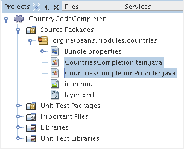
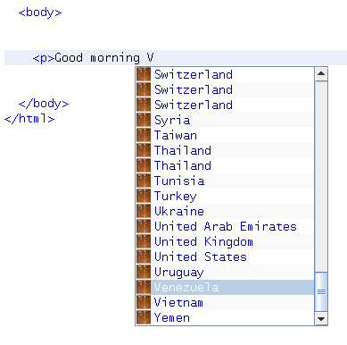
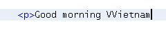
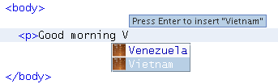
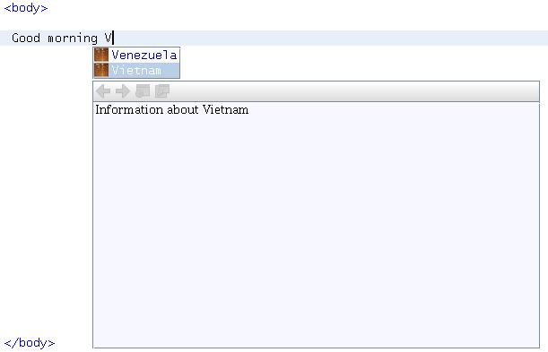

// 
//     Licensed to the Apache Software Foundation (ASF) under one
//     or more contributor license agreements.  See the NOTICE file
//     distributed with this work for additional information
//     regarding copyright ownership.  The ASF licenses this file
//     to you under the Apache License, Version 2.0 (the
//     "License"); you may not use this file except in compliance
//     with the License.  You may obtain a copy of the License at
// 
//       http://www.apache.org/licenses/LICENSE-2.0
// 
//     Unless required by applicable law or agreed to in writing,
//     software distributed under the License is distributed on an
//     "AS IS" BASIS, WITHOUT WARRANTIES OR CONDITIONS OF ANY
//     KIND, either express or implied.  See the License for the
//     specific language governing permissions and limitations
//     under the License.
//

= NetBeans Code Completion Tutorial
:jbake-type: platform_tutorial
:jbake-tags: tutorials 
:jbake-status: published
:syntax: true
:source-highlighter: pygments
:toc: left
:toc-title:
:icons: font
:experimental:
:description: NetBeans Code Completion Tutorial - Apache NetBeans
:keywords: Apache NetBeans Platform, Platform Tutorials, NetBeans Code Completion Tutorial

This tutorial shows you how to implement the  link:https://bits.netbeans.org/dev/javadoc/org-netbeans-modules-editor-completion/overview-summary.html[Editor Code Completion API]. You will be shown how to implement the API in the context of HTML files. When the user invokes the code completion feature, a code completion box will appear, displaying words that can complete the text typed in the editor. At the end of this tutorial, HTML files will have a code completion box as follows:

image::images/cc_65-result-of-cc.png[]

The content of the code completion box will come from country names retrieved from the JDK's  ``java.util.Locale``  package.

Optionally, for troubleshooting purposes, you can  link:http://plugins.netbeans.org/PluginPortal/faces/PluginDetailPage.jsp?pluginid=11981[download the completed sample] and inspect the sources.

== Introduction to Code Completion Integration

Two classes apply to code completion and these will be developed in this tutorial:  link:https://bits.netbeans.org/dev/javadoc/org-netbeans-modules-editor-completion/org/netbeans/spi/editor/completion/CompletionItem.html[CompletionItem] and  link:https://bits.netbeans.org/dev/javadoc/org-netbeans-modules-editor-completion/org/netbeans/spi/editor/completion/CompletionProvider.html[CompletionProvider]. Both of these come from the  link:https://bits.netbeans.org/dev/javadoc/org-netbeans-modules-editor-completion/overview-summary.html[Editor Code Completion API] and are implemented in this tutorial's module as CountriesCompletionItem and CountriesCompletionProvider.

When this tutorial is complete, the Projects window will contain the files shown in the illustration below:

 

== Creating the Module Project

In this section, we use a wizard to create the source structure that every NetBeans module requires. The source structure consists of certain folders in specific places and a set of files that are always needed. For example, every NetBeans module requires a  ``nbproject``  folder, which holds the project's metadata, and a  ``layer.xml``  file, for declarative registration of items such as toolbar buttons and windows.

[start=1]
1. Choose File > New Project (Ctrl-Shift-N). Under Categories, select NetBeans Modules. Under Projects, select Module and click Next.

[start=2]
1. In the Name and Location panel, type  ``CountryCodeCompleter``  in Project Name. Change the Project Location to any directory on your computer, such as  ``c:\mymodules`` . Leave the Standalone Module radiobutton selected. Click Next.

[start=3]
1. In the Basic Module Configuration panel, type  ``org.netbeans.modules.countries``  as the Code Name Base. Select the "Generate XML Layer" checkbox and leave the location of the localizing bundle and XML layer as they are, so that they will be stored in a package with the name  ``org/netbeans/modules/countries`` . Click Finish.

The IDE creates the  ``CountriesCodeCompleter``  project. The project contains all of your sources and project metadata, such as the project's Ant build script. The project opens in the IDE. You can view its logical structure in the Projects window (Ctrl-1) and its file structure in the Files window (Ctrl-2). 

== Implementing the Completion Provider Class

The first class we will deal with when creating a code completion feature for HTML files is the  link:https://bits.netbeans.org/dev/javadoc/org-netbeans-modules-editor-completion/org/netbeans/spi/editor/completion/CompletionProvider.html[CompletionProvider]. As the user types in an editor, the code completion infrastructure asks all code completion providers registered in the XML layer file to create  link:https://bits.netbeans.org/dev/javadoc/org-netbeans-modules-editor-completion/org/netbeans/spi/editor/completion/CompletionTask.html[CompletionTasks]. The tasks are created by the  link:https://bits.netbeans.org/dev/javadoc/org-netbeans-modules-editor-completion/org/netbeans/spi/editor/completion/CompletionProvider.html#createTask(int,%20javax.swing.text.JTextComponent)[CompletionProvider.createTask] method. What _happens_ when the method is invoked is up to the implementation. In _our_ implementation, we will create a  link:https://bits.netbeans.org/dev/javadoc/org-netbeans-modules-editor-completion/org/netbeans/spi/editor/completion/CompletionItem.html[CompletionItem] for a list of countries.

[start=1]
1. Right-click the  ``CountryCodeCompleter``  project and choose New > Java Class.

[start=2]
1. In Class Name, type CountriesCompletionProvider. In Package, choose  ``org.netbeans.modules.countries`` . Click Finish.

[start=3]
1. Before coding the CompletionProvider class, let's register it in the XML layer file. Open the XML layer file, and right below the opening  ``<filesystem>``  tag, add the following tags:

[source,xml]
----

<folder name="Editors">
    <folder name="text">
        <folder name="html">
            <folder name="CompletionProviders">
                <file name="org-netbeans-modules-countries-CountriesCompletionProvider.instance"/>
            </folder>
        </folder>
    </folder>
</folder>
----

NOTE:  As explained earlier, because of the entries specified above, whenever the user types a character of any kind in a file with a MIME type of  ``text/html`` , the code completion infrastructure will ask the CountriesCompletionProvider to create its CompletionTask. In the next steps we will define our CompletionTask.

[start=4]
1. Right-click the  ``CountryCodeCompleter``  project and choose Properties. In the Project Properties dialog box, click Libraries. Click Add next to the Module Dependencies list. Scroll to "Editor Code Completion" and click OK. Click OK again to exit the Project Properties dialog box.

[start=5]
1. In the CountriesCompletionProvider class, change the signature so that the class  ``implements CompletionProvider`` . Place the cursor on the line that defines the signature. A lightbulb appears. Click it and the IDE adds an import statement for  ``org.netbeans.spi.editor.completion.CompletionProvider`` . The lightbulb appears again. Click it again and the IDE creates skeleton methods for the two methods required by the CompletionProvider class.

You should now see this:

[source,java]
----

package org.netbeans.modules.CountryCodeCompleter;

import javax.swing.text.JTextComponent;
import org.netbeans.spi.editor.completion.CompletionProvider;
import org.netbeans.spi.editor.completion.CompletionTask;

public class CountriesCompletionProvider implements  link:https://bits.netbeans.org/dev/javadoc/org-netbeans-modules-editor-completion/org/netbeans/spi/editor/completion/CompletionProvider.html[CompletionProvider] {
    
    public CountriesCompletionProvider() {
    }

    public  link:https://bits.netbeans.org/dev/javadoc/org-netbeans-modules-editor-completion/org/netbeans/spi/editor/completion/CompletionTask.html[CompletionTask]  link:https://bits.netbeans.org/dev/javadocorg-netbeans-modules-editor-completion/org/netbeans/spi/editor/completion/CompletionProvider.html#createTask(int,%20javax.swing.text.JTextComponent)[createTask(int i,at JTextComponent jTextComponent)] {
    }

    public int  link:https://bits.netbeans.org/dev/javadoc/org-netbeans-modules-editor-completion/org/netbeans/spi/editor/completion/CompletionProvider.html#getAutoQueryTypes(javax.swing.text.JTextComponent,%20java.lang.String)[getAutoQueryTypes(JTextComponent jTextComponent, String string)] {
    }
    
}

----

Click the links above to find out more about the classes and methods. Note that you will see a few red error markings. Don't worry about these yet, they're just there to tell you that the methods need to return something. We will work on this in the following steps.

=== Implementing the createTask Method

In this section we create a skeleton implementation of  link:https://bits.netbeans.org/dev/javadoc/org-netbeans-modules-editor-completion/org/netbeans/spi/editor/completion/support/AsyncCompletionTask.html[AsyncCompletionTask]. In the next sections, we will fill this skeleton method out.

[start=1]
1. In the createTask method, below the code from the previous section, add the following lines:

[source,java]
----

return new AsyncCompletionTask(new AsyncCompletionQuery() {
});

----

Here, we're returning  link:https://bits.netbeans.org/dev/javadoc/org-netbeans-modules-editor-completion/org/netbeans/spi/editor/completion/support/AsyncCompletionTask.html[AsyncCompletionTask], which will allow for the asynchronous creation of our task. The class comes from the  link:https://bits.netbeans.org/dev/javadoc/org-netbeans-modules-editor-completion/org/netbeans/spi/editor/completion/support/package-summary.html[org.netbeans.spi.editor.completion.support] package, which provides several useful supporting classes for code completion implementations. We will use several of them in this tutorial.

[start=2]
1. Place the cursor on the line. Click the lightbulb that appears and let the IDE add import statements. Also let it create a skeleton method for the  link:https://bits.netbeans.org/dev/javadoc/org-netbeans-modules-editor-completion/org/netbeans/spi/editor/completion/support/AsyncCompletionTask.html#query(org.netbeans.spi.editor.completion.CompletionResultSet)[query] method.

[start=3]
1. Next, we need to specify which code completion type we are working with. When the user clicks Ctrl-Space, or an alternative key combination defined by the user, our code completion entries should appear. This is the COMPLETION_QUERY_TYPE. Alternative query types exist, such as DOCUMENTATION_QUERY_TYPE and TOOLTIP_QUERY_TYPE. We need to test whether the user pressed the keys applicable to the COMPLETION_QUERY_TYPE. Therefore add the following test to the start of the  ``createTask``  method:

[source,java]
----

if (i != CompletionProvider.COMPLETION_QUERY_TYPE)
   return null;
----

At this stage, the  ``createTask``  method should look as follows:

[source,java]
----

public CompletionTask createTask(int i, JTextComponent jTextComponent) {
    
    if (i != CompletionProvider.COMPLETION_QUERY_TYPE)
        return null;
    
    return new AsyncCompletionTask(new AsyncCompletionQuery() {
        protected void query(CompletionResultSet completionResultSet, Document document, int caretOffset) {
        }
    });

}

----

=== Implementing the getAutoQueryTypes Method

In this section we return 0 as our AutoQueryType, so that the code completion box does not appear automatically, but only when requested by the user.

[start=1]
1. Change the name "i" in the createTask method signature to "type". Do this to make your code more readable. The name "i" does not mean anything. By changing it to "type" you will later be able to see more clearly that the AutoQueryType is being referred to here.

[start=2]
1. Before filling out the query method, let's look at the  link:https://bits.netbeans.org/dev/javadoc/org-netbeans-modules-editor-completion/org/netbeans/spi/editor/completion/CompletionProvider.html#getAutoQueryTypes(javax.swing.text.JTextComponent,%20java.lang.String)[getAutoQueryTypes(JTextComponent jTextComponent, String string)] method. This method determines whether the code completion box appears _automatically_ or not. For now, let's return 0. This means that the code completion box will never appear unless the user explicitly asks for it. So, this method should now look as follows:

[source,java]
----

public int getAutoQueryTypes(JTextComponent jTextComponent, String string) {
    return 0;
}
                   
----

By default, the user would press Ctrl-Space to make the code completion box appear. Later, we can add a new option to our Options window extension, such as a checkbox which will change the int returned in this method from 0 to 1, so that the code completion box appears automatically. (There are also other types of queries, as shown  link:https://bits.netbeans.org/dev/javadoc/org-netbeans-modules-editor-completion/constant-values.html#org.netbeans.spi.editor.completion.CompletionProvider.COMPLETION_QUERY_TYPE[here].)

== Implementing the Completion Item Class

In this section we will create a class that implements  link:https://bits.netbeans.org/dev/javadoc/org-netbeans-modules-editor-completion/org/netbeans/spi/editor/completion/CompletionItem.html[CompletionItem]. Once we have defined this class, we will fill out the query method in the CompletionProvider class. The CompletionProvider will create instances of our CompletionItem.

[start=1]
1. Right-click the  ``CountryCodeCompleter``  project and choose New > Java Class. In Class Name, type CountriesCompletionItem. In Package, choose  ``org.netbeans.modules.countries`` . Click Finish.

[start=2]
1. We will return to this class in later steps. For now, we will fill out the query method that we defined in the CompletionProvider class. Fill out the AsyncCompletionTask as follows, and note the explanatory comments in the code:

[source,java]
----

return new AsyncCompletionTask(new AsyncCompletionQuery() {

    @Override
    protected void query(CompletionResultSet completionResultSet, Document document, int caretOffset) {

        //Iterate through the available locales
        //and assign each country display name
        //to a CompletionResultSet:
        Locale[] locales = Locale.getAvailableLocales();
        for (int i = 0; i < locales.length; i++) {
            final Locale locale = locales[i];
            final String country = locale.getDisplayCountry();
            if (!country.equals("")) {
                completionResultSet.addItem(new CountriesCompletionItem(country, caretOffset));
            }
        }

        completionResultSet.finish();
    }

}, jTextComponent);
----

NOTE:  A red underline remains, after you let the IDE add various import statements. The error underline tells you that the CompletionItem's constructor does not expect the values that you are passing to it. In the next step, we will fill out the CompletionItem so that it meets the requirements of the CompletionProvider.

[start=3]
1. In the CountriesCompletionItem class, change the signature so that the class  ``implements CompletionItem`` . Let the IDE create import statements and skeleton implementations for the class's required methods. Read the entry in the NetBeans Javadoc for  link:https://bits.netbeans.org/dev/javadoc/org-netbeans-modules-editor-completion/org/netbeans/spi/editor/completion/CompletionItem.html[CompletionItem] to begin to understand what each of the methods is for. For now, we will implement a minimal completion item, just enough to be able to compile the module and see the code completion box.

[start=4]
1. In the CountriesCompletionItem class, define the constructor as follows:

[source,java]
----

private String text;
private static ImageIcon fieldIcon =
        new ImageIcon(Utilities.loadImage("org/netbeans/modules/countries/icon.png"));
private static Color fieldColor = Color.decode("0x0000B2");
private int caretOffset;

public CountriesCompletionItem(String text, int caretOffset) {
    this.text = text;
    this.caretOffset = caretOffset;
}
----

Note that here we're referencing an icon. This is the icon that will appear next to each entry represented by the CompletionItem in the code completion box. The icon can be any icon with a dimension of 16x16 pixels. For example, you could make use of this icon:

If you like, you can right-click the image above and save it to the location specified in the ImageIcon definition above.

[start=5]
1. Next define the  link:https://bits.netbeans.org/dev/javadoc/org-netbeans-modules-editor-completion/org/netbeans/spi/editor/completion/CompletionItem.html#getPreferredWidth(java.awt.Graphics,%20java.awt.Font)[getPreferredWidth()] and  link:https://bits.netbeans.org/dev/javadoc/org-netbeans-modules-editor-completion/org/netbeans/spi/editor/completion/CompletionItem.html#render(java.awt.Graphics,%20java.awt.Font,%20java.awt.Color,%20java.awt.Color,%20int,%20int,%20boolean)[render()] methods as follows:

[source,java]
----

public int getPreferredWidth(Graphics graphics, Font font) {
    return CompletionUtilities.getPreferredWidth(text, null, graphics, font);
}

public void render(Graphics g, Font defaultFont, Color defaultColor,
        Color backgroundColor, int width, int height, boolean selected) {
    CompletionUtilities.renderHtml(fieldIcon, text, null, g, defaultFont,
            (selected ? Color.white : fieldColor), width, height, selected);
}

----

Define the  `` link:https://bits.netbeans.org/dev/javadoc/org-netbeans-modules-editor-completion/org/netbeans/spi/editor/completion/CompletionItem.html#getSortText()[getSortText()]``  method as follows:

[source,java]
----

public CharSequence getSortText() {
    return text;
}

----

Next, define the  `` link:https://bits.netbeans.org/dev/javadoc/org-netbeans-modules-editor-completion/org/netbeans/spi/editor/completion/CompletionItem.html#getInsertPrefix()[getInsertPrefix()]``  method:

[source,java]
----

public CharSequence getInsertPrefix() {
    return text;
}
----

Finally, create dummy implementations of the remaining methods. So, return  ``null``  for  ``createDocumentationTask()`` ,  ``createToolTipTask()`` , and  ``getInsertPrefix()`` . Then return  ``false``  for  ``instantSubstitution()``  and return  ``0``  for  ``getSortPriority()`` .

[start=6]
1. Right-click the module and choose Run. A new instance of the IDE starts up and installs your module. Open an HTML file in the IDE. Type something and press Ctrl-Space.

You should now see the following:

NOTE:  When you press Enter, nothing happens. That is because we have not defined the  link:https://bits.netbeans.org/dev/javadoc/org-netbeans-modules-editor-completion/org/netbeans/spi/editor/completion/CompletionItem.html#defaultAction(javax.swing.text.JTextComponent)[defaultAction()] method yet. We will do so in the next section. Also note that the list does not narrow while you are typing. That is because we have not created a filter yet. The filter will detect what we are typing and adjust the entries in the list accordingly. We will create a filter in a later section.

=== Implementing the Action

In this section we specify what happens when the user presses the Enter key or clicks the mouse over an entry in the code completion box.

[start=1]
1. Fill out the  ``defaultAction()``  method as follows:

[source,java]
----

public void defaultAction(JTextComponent jTextComponent) {
    StyledDocument doc = (StyledDocument) jTextComponent.getDocument();
    doc.insertString(caretOffset, text, null);
    //This statement will close the code completion box:
    Completion.get().hideAll();
}

----

[start=2]
1. Install the module again. Notice that when you press Enter or click the mouse over an entry in the code completion box, the selected text is added at the cursor in your HTML file. However, the text that you typed prior to calling up the code completion box is not removed. Below, the "V" should be removed, because "Vietnam" was selected from the code completion box:

In the next section, we will add functionality to detect the number of characters that have been typed and remove them when the selected country is inserted into the document.

=== Implementing the Filter

In this section we enable the code completion box to narrow while the user is typing. In this way, when the user types 'hel', only words that begin with those letters are shown in the code completion box. The filter is defined in the CountriesCompletionProvider class.

[start=1]
1. In the CountriesCompletionProvider class, rewrite the  ``AsyncCompletionTask()``  method by adding the statements highlighted in bold below:

[source,java]
----

return new AsyncCompletionTask(new AsyncCompletionQuery() {

    @Override
    protected void query(CompletionResultSet completionResultSet, Document document, int caretOffset) {

        *String filter = null;
        int startOffset = caretOffset - 1;

        try {
            final StyledDocument bDoc = (StyledDocument) document;
            final int lineStartOffset = getRowFirstNonWhite(bDoc, caretOffset);
            final char[] line = bDoc.getText(lineStartOffset, caretOffset - lineStartOffset).toCharArray();
            final int whiteOffset = indexOfWhite(line);
            filter = new String(line, whiteOffset + 1, line.length - whiteOffset - 1);
            if (whiteOffset > 0) {
                startOffset = lineStartOffset + whiteOffset + 1;
            } else {
                startOffset = lineStartOffset;
            }
        } catch (BadLocationException ex) {
            Exceptions.printStackTrace(ex);
        }*

        //Iterate through the available locales
        //and assign each country display name
        //to a CompletionResultSet:
        Locale[] locales = Locale.getAvailableLocales();
        for (int i = 0; i < locales.length; i++) {
            final Locale locale = locales[i];
            final String country = locale.getDisplayCountry();
            *//Here we test whether the country starts with the filter defined above:*
            if (!country.equals("") *&amp;&amp; country.startsWith(filter)*) {
                *//Here we include the start offset, so that we'll be able to figure out
                //the number of characters that we'll need to remove:*
                completionResultSet.addItem(new CountriesCompletionItem(country, *startOffset,* caretOffset));
            }
        }
        completionResultSet.finish();

    }

}, jTextComponent);
----

[start=2]
1. Right at the end of the CountriesCompletionProvider, add the following two methods:

[source,java]
----

static int getRowFirstNonWhite(StyledDocument doc, int offset)
throws BadLocationException {
    Element lineElement = doc.getParagraphElement(offset);
    int start = lineElement.getStartOffset();
    while (start + 1 < lineElement.getEndOffset()) {
        try {
            if (doc.getText(start, 1).charAt(0) != ' ') {
                break;
            }
        } catch (BadLocationException ex) {
            throw (BadLocationException)new BadLocationException(
                    "calling getText(" + start + ", " + (start + 1) +
                    ") on doc of length: " + doc.getLength(), start
                    ).initCause(ex);
        }
        start++;
    }
    return start;
}
----

[source,java]
----

static int indexOfWhite(char[] line){
    int i = line.length;
    while(--i > -1){
        final char c = line[i];
        if(Character.isWhitespace(c)){
            return i;
        }
    }
    return -1;
}

----

[start=3]
1. Change the constructor of the CountriesCompletionItem to receive the start offset. Then change the  ``defaultAction``  so that the start offset will be used in determining the characters that will be removed when the selected country is inserted. Below, the statements highlighted in bold are those that should be added:*private int dotOffset;*

[source,java]
----

public CountriesCompletionItem(String text, *int dotOffset,* int caretOffset) {
    this.text = text;
    *this.dotOffset = dotOffset;*
    this.caretOffset = caretOffset;
}

    public void defaultAction(JTextComponent jTextComponent) {
        try {
            StyledDocument doc = (StyledDocument) jTextComponent.getDocument();
            *//Here we remove the characters starting at the start offset
            //and ending at the point where the caret is currently found:
            doc.remove(dotOffset, caretOffset-dotOffset);*
            doc.insertString(*dotOffset,* text, null);
            Completion.get().hideAll();
        } catch (BadLocationException ex) {
            Exceptions.printStackTrace(ex);
        }
    }
    
    ...
    ...
    ...
----

[start=4]
1. Install the module again and notice that this time the list of words narrows while you are typing:

image::images/cc_65-result-of-cc.png[]

When you press Enter, the characters that you typed are removed and replaced by the country selected from the code completion box.

=== Implementing the Tooltip and Documentation Task

Some optional features can also be added, as described below.

[start=1]
1. Optionally, you can implement the createToolTipTask method in the CountriesCompletionItem, with this result when Ctrl-P is pressed:

Here is the code that will achieve the result shown in the screenshot above:

[source,java]
----

public CompletionTask createToolTipTask() {
    return new AsyncCompletionTask(new AsyncCompletionQuery() {
        protected void query(CompletionResultSet completionResultSet, Document document, int i) {
            JToolTip toolTip = new JToolTip();
            toolTip.setTipText("Press Enter to insert \"" + text + "\"");
            completionResultSet.setToolTip(toolTip);
            completionResultSet.finish();
        }
    });
}
----

[start=2]
1. Optionally, you can provide documentation for the entries in the code completion box:

Make use of the documentation box like this, by implementing the createDocumentationTask method in the CountriesCompletionItem class:

[source,java]
----

public CompletionTask createDocumentationTask() {
    return new AsyncCompletionTask(new AsyncCompletionQuery() {
        protected void query(CompletionResultSet completionResultSet, Document document, int i) {
            completionResultSet.setDocumentation(new CountriesCompletionDocumentation(CountriesCompletionItem.this));
            completionResultSet.finish();
        }
    });
}
----

In the code above, the reference to the CountriesCompletionDocumentation class could be implemented as follows:

[source,java]
----

public class CountriesCompletionDocumentation implements CompletionDocumentation {

    private CountriesCompletionItem item;

    public CountriesCompletionDocumentation(CountriesCompletionItem item) {
        this.item = item;
    }

    public String getText() {
        return "Information about " + item.getText();
    }

    public URL getURL() {
       return null;
    }

    public CompletionDocumentation resolveLink(String string) {
        return null;
    }

    public Action getGotoSourceAction() {
        return null;
    }
    
}
----

By implementing the  ``getURL()``  in the code above, you can enable the URL button, as shown below:

image::images/cc_65-result-of-cc5.png[]

When the user clicks the URL button, the browser set in the IDE will open, displaying the content provided by the specified URL.

Congratulations, you have now completed a simple implementation of a code completion integration module.

