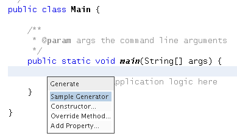
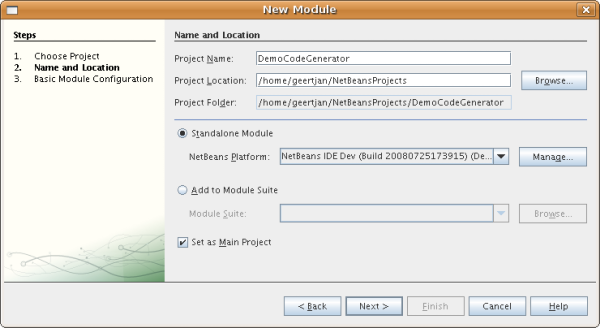
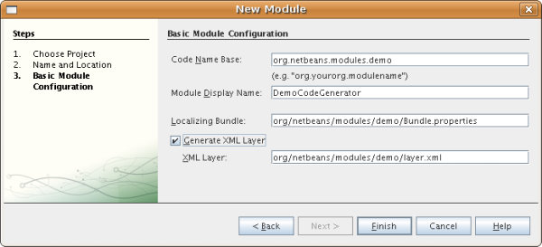
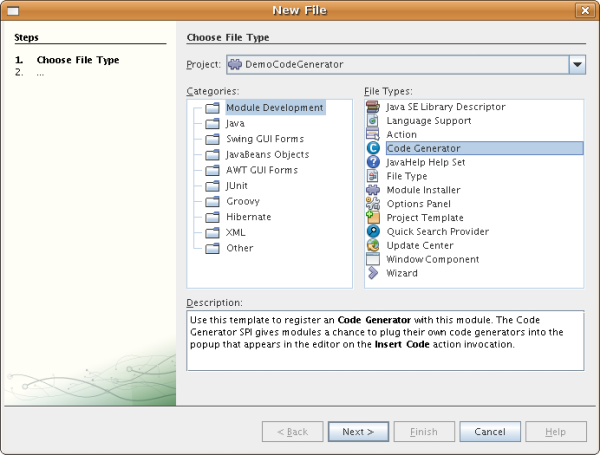
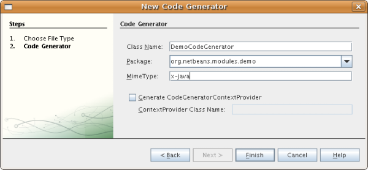
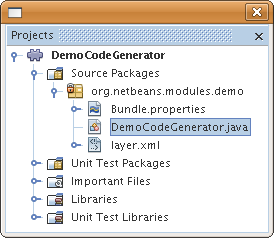
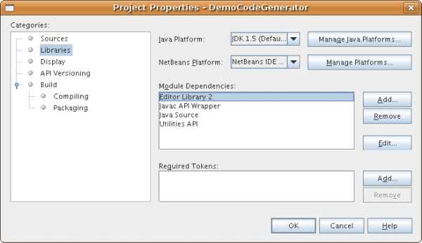

// 
//     Licensed to the Apache Software Foundation (ASF) under one
//     or more contributor license agreements.  See the NOTICE file
//     distributed with this work for additional information
//     regarding copyright ownership.  The ASF licenses this file
//     to you under the Apache License, Version 2.0 (the
//     "License"); you may not use this file except in compliance
//     with the License.  You may obtain a copy of the License at
// 
//       http://www.apache.org/licenses/LICENSE-2.0
// 
//     Unless required by applicable law or agreed to in writing,
//     software distributed under the License is distributed on an
//     "AS IS" BASIS, WITHOUT WARRANTIES OR CONDITIONS OF ANY
//     KIND, either express or implied.  See the License for the
//     specific language governing permissions and limitations
//     under the License.
//

= Tutorial de integração do gerador de código
:jbake-type: platform_tutorial
:jbake-tags: tutorials 
:jbake-status: published
:syntax: true
:source-highlighter: pygments
:toc: left
:toc-title:
:icons: font
:experimental:
:description: Tutorial de integração do gerador de código - Apache NetBeans
:keywords: Apache NetBeans Platform, Platform Tutorials, Tutorial de integração do gerador de código

Este tutorial mostra como escrever um módulo que integre novos itens no recurso de geração de código do NetBeans, que é exibido quando você clica em Alt-Insert em um editor.

*Para seguir este tutorial, você precisa do software e dos recursos listados nesta tabela.*

Opcionalmente, para fins de solução de problemas, você pode  link:http://plugins.netbeans.org/PluginPortal/faces/PluginDetailPage.jsp?pluginid=11179[baixar a amostra completa] e inspecionar os códigos-fonte.

== Introdução à integração do gerador de código

O recurso Gerador de código, introduzido no NetBeans IDE 6.5, consiste em uma lista de itens que aparece quando você pressiona Alt-Insert. Cada item gera código no editor.

== Criando o projeto do módulo

Nesta seção, usaremos um assistente para criar a estrutura de código-fonte que todo módulo NetBeans precisa. A estrutura do código-fonte consiste em determinadas pastas em locais específicos e em um conjunto de arquivos que sempre são necessários. Por exemplo, cada módulo NetBeans requer uma pasta  ``nbproject`` , que contém os metadados do projeto, e um arquivo  ``layer.xml`` , para registro de declaração de itens como janelas e botões da barra de ferramentas.

[start=1]
1. Escolha Arquivo > Novo projeto (Ctrl-Shift-N). Em Categorias, selecione Módulos do NetBeans. Em Projetos, selecione Módulo e clique em Próximo.

[start=2]
1. No painel Nome e localização, digite  ``DemoCodeGenerator``  em Nome do projeto. Altere a Localização do projeto para qualquer diretório no computador, como  ``c:\meusmodulos`` . Deixe o botão de opção Módulo independente selecionado. O painel agora deve ter esta aparência:

Clique em Próximo.

[start=3]
1. No painel Configuração básica de módulos, digite  ``org.netbeans.modules.demo``  como o Nome base de código. Marque a caixa de verificação "Gerar camada XML" e deixe o pacote de localização e a camada XML onde estão, para que eles sejam armazenados em um pacote com o nome  ``org/netbeans/modules/demo`` . O painel agora deve ter esta aparência:

[start=4]
1. Clique em Terminar.

O IDE cria o projeto  ``DemoCodeGenerator`` . O projeto contém todos os metadados de projeto e fontes, como o script de construção Ant do projeto. O projeto se abre no IDE. Você pode ver a estrutura lógica na janela Projetos (Ctrl-1) e a estrutura de arquivos na janela Arquivos (Ctrl+2). 

== Usando o assistente do Provedor de gerador de código

Nesta seção, usaremos um assistente para criar a classe stub e entradas de camada necessárias para começar a integração com o recurso Gerador de código.

[start=1]
1. Clique com o botão direito do mouse no nó do projeto e escolha Novo > Outro. Na caixa de diálogo Novo arquivo, escolha Desenvolvimento de módulo > Gerador de código, como mostrado abaixo:

[start=2]
1. No painel Gerador do novo código, defina o seguinte:

* *Nome da classe.* Especifica o nome da classe do stub que o assistente irá gerar. Digite "DemoCodeGenerator" neste campo.
* *Pacote.* Especifica o pacote em que a classe do stub será gerada. Selecione "org.netbeans.modules.demo" da lista suspensa.
* *Tipo MIME.* Especifica o tipo MIME ao qual a integração do gerador de código será aplicada. Digite "x-java" neste campo.
* *Gerar CodeGeneratorContextProvider.* Adiciona outros objetos à pesquisa do gerador de código. Deixe esta caixa de verificação desmarcada.

Agora você deve ver o seguinte:

[start=3]
1. Clique em Terminar.

A janela Projetos agora deve ter esta aparência:

No arquivo  ``layer.xml`` , você deve ver o seguinte:

[source,xml]
----

<filesystem>
    <folder name="Editors">
        <folder name="text">
            <folder name="x-java">
                <folder name="CodeGenerators">
                    <file name="org-netbeans-modules-demo-DemoCodeGenerator$Factory.instance"/>
                </folder>
            </folder>
        </folder>
    </folder>
</filesystem>
----

A classe gerada deve ter a seguinte aparência:

[source,java]
----

public class DemoCodeGenerator implements CodeGenerator {

    JTextComponent textComp;

    /**
     * 
     * @param context containing JTextComponent and possibly other items 
     * registered by {@link CodeGeneratorContextProvider}
     */
    private DemoCodeGenerator(Lookup context) { 
    // Good practice is not to save Lookup outside ctor
        textComp = context.lookup(JTextComponent.class);
    }

    public static class Factory implements CodeGenerator.Factory {

        public List create(Lookup context) {
            return Collections.singletonList(new DemoCodeGenerator(context));
        }
    }

    /**
     * The name which will be inserted inside Insert Code dialog
     */
    public String getDisplayName() {
        return "Sample Generator";
    }

    /**
     * This will be invoked when user chooses this Generator from Insert Code
     * dialog
     */
    public void invoke() {
    }
    
}
----

== Codificando a integração do gerador de código

Em seguida, implementaremos a API. As classes da API são as seguintes:

|===
|Classe |Descrição 

|JavaSource |Para ser feita... 

|CancellableTask |Para ser feita... 

|WorkingCopy |Para ser feita... 

|CompilationUnitTree |Para ser feita... 

|TreeMaker |Para ser feita... 

|ClassTree |Para ser feita... 

|ModifiersTree |Para ser feita... 

|VariableTree |Para ser feita... 

|TypeElement |Para ser feita... 

|ExpressionTree |Para ser feita... 

|MethodTree |Para ser feita... 
|===

Abaixo, definiremos dependências nos módulos necessários e depois as implementaremos no seu próprio módulo.

[start=1]
1. Clique com o botão direito do mouse no projeto, escolha Propriedades e defina as 4 dependências a seguir no painel Bibliotecas:

*Observação:* você irá notar que "Biblioteca do editor 2" e "API de utilitários" foram definidas automaticamente pelo Assistente do gerador de código. Nas outras duas dependências, "Wrapper da API Javac" e "Código-fonte Java", você precisará ser capaz de gerar novos trechos de código Java através da nova integração do Gerador de código.

[start=2]
1. Abra a classe gerada.

[start=3]
1. Modifique o método  ``invoke()``  da seguinte maneira:

[source,java]
----

public void invoke() {
    try {
        Document doc = textComp.getDocument();
        JavaSource javaSource = JavaSource.forDocument(doc);
        CancellableTask task = new CancellableTask<WorkingCopy>() {
            public void run(WorkingCopy workingCopy) throws IOException {
                workingCopy.toPhase(Phase.RESOLVED);
                CompilationUnitTree cut = workingCopy.getCompilationUnit();
                TreeMaker make = workingCopy.getTreeMaker();
                for (Tree typeDecl : cut.getTypeDecls()) {
                    if (Tree.Kind.CLASS == typeDecl.getKind()) {
                        ClassTree clazz = (ClassTree) typeDecl;
                        ModifiersTree methodModifiers = 
                                make.Modifiers(Collections.<Modifier>singleton(Modifier.PUBLIC), 
                                Collections.<AnnotationTree>emptyList());
                        VariableTree parameter = 
                                make.Variable(make.Modifiers(Collections.<Modifier>singleton(Modifier.FINAL), 
                                Collections.<AnnotationTree>emptyList()), 
                                "arg0", 
                                make.Identifier("Object"), 
                                null);
                        TypeElement element = workingCopy.getElements().getTypeElement("java.io.IOException");
                        ExpressionTree throwsClause = make.QualIdent(element);
                        MethodTree newMethod = 
                                make.Method(methodModifiers, 
                                "writeExternal", 
                                make.PrimitiveType(TypeKind.VOID), 
                                Collections.<TypeParameterTree>emptyList(), 
                                Collections.singletonList(parameter), 
                                Collections.<ExpressionTree>singletonList(throwsClause), 
                                "{ throw new UnsupportedOperationException(\"Not supported yet.\") }", 
                                null);
                        ClassTree modifiedClazz = make.addClassMember(clazz, newMethod);
                        workingCopy.rewrite(clazz, modifiedClazz);
                    }
                }
            }
            public void cancel() {
            }
        };
        ModificationResult result = javaSource.runModificationTask(task);
        result.commit();
    } catch (Exception ex) {
        Exceptions.printStackTrace(ex);
    }
}
----

[start=4]
1. Certifique-se de que as seguintes sentenças import sejam declaradas:

[source,java]
----

import com.sun.source.tree.AnnotationTree;
import com.sun.source.tree.ClassTree;
import com.sun.source.tree.CompilationUnitTree;
import com.sun.source.tree.ExpressionTree;
import com.sun.source.tree.MethodTree;
import com.sun.source.tree.ModifiersTree;
import com.sun.source.tree.Tree;
import com.sun.source.tree.TypeParameterTree;
import com.sun.source.tree.VariableTree;
import java.io.IOException;
import java.util.Collections;
import java.util.List;
import javax.lang.model.element.Modifier;
import javax.lang.model.element.TypeElement;
import javax.lang.model.type.TypeKind;
import javax.swing.text.Document;
import javax.swing.text.JTextComponent;
import org.netbeans.api.java.source.CancellableTask;
import org.netbeans.api.java.source.JavaSource;
import org.netbeans.api.java.source.JavaSource.Phase;
import org.netbeans.api.java.source.ModificationResult;
import org.netbeans.api.java.source.TreeMaker;
import org.netbeans.api.java.source.WorkingCopy;
import org.netbeans.spi.editor.codegen.CodeGenerator;
import org.netbeans.spi.editor.codegen.CodeGeneratorContextProvider;
import org.openide.util.Exceptions;
import org.openide.util.Lookup;
----

== Instalando e testando a funcionalidade

Agora vamos instalar o módulo e usar a integração do recurso gerador de código. O IDE utiliza um script de construção Ant para construir e instalar seu módulo. O script de construção é criado quando o projeto é criado.

[start=1]
1. Na janela Projetos, clique com o botão direito do mouse no projeto e escolha Executar.

Uma nova instância do IDE é iniciada e instala o módulo de integração do gerador de código.

[start=2]
1. Pressione Alt-Insert e você verá o novo item incluído:

[start=3]
1. Clique em um item e o código será inserido.

== Criando um binário de módulo que pode ser compartilhado

Agora que o módulo está concluído, você pode permitir que ele seja utilizado por outras pessoas. Para isso, você precisa criar um arquivo "NBM" (módulo NetBeans) binário e distribui-lo.

[start=1]
1. Na janela Projetos, clique com o botão direito do mouse no projeto e escolha Criar NBM.

O arquivo NBM é criado e você pode visualizá-lo na janela Arquivos (Ctrl+-2):

[start=2]
1. Disponibilize-o para outras pessoas, por exemplo, através do  link:http://plugins.netbeans.org/PluginPortal/[Portal de plug-in do NetBeans]. O destinatário deve usar o Gerenciador de plug-ins (Ferramentas > Plug-ins) para instalá-lo.

link:http://netbeans.apache.org/community/mailing-lists.html[Envie-nos seus comentários]

== Próximas etapas

Para obter mais informações sobre a criação e o desenvolvimento de módulos do NetBeans, consulte os seguintes recursos:

*  link:https://netbeans.apache.org/platform/index.html[Página inicial da Plataforma NetBeans ]
*  link:https://bits.netbeans.org/dev/javadoc/[Lista de APIs do NetBeans (Versão de desenvolvimento atual)]
*  link:https://netbeans.apache.org/tutorials[Outros tutoriais relacionados]

