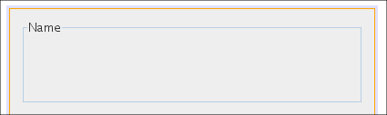
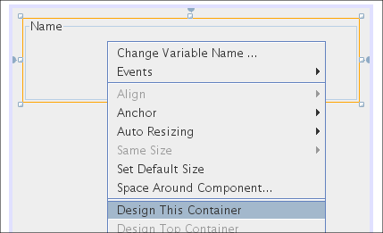
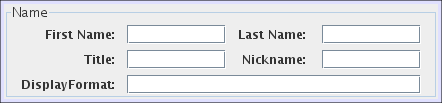
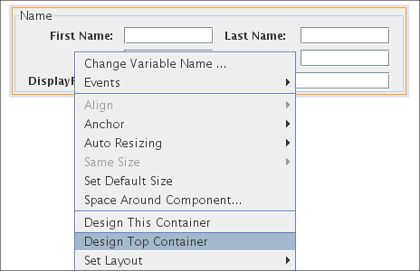
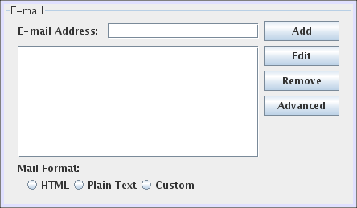
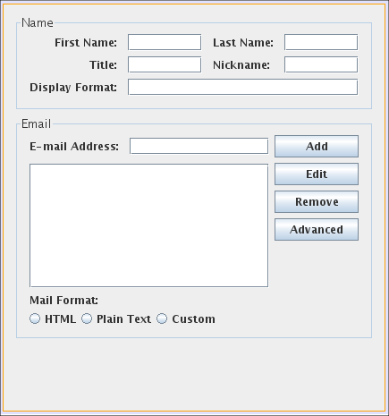
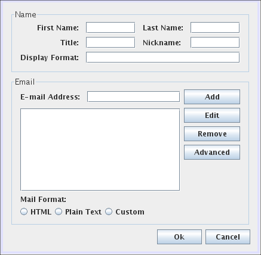

// 
//     Licensed to the Apache Software Foundation (ASF) under one
//     or more contributor license agreements.  See the NOTICE file
//     distributed with this work for additional information
//     regarding copyright ownership.  The ASF licenses this file
//     to you under the Apache License, Version 2.0 (the
//     "License"); you may not use this file except in compliance
//     with the License.  You may obtain a copy of the License at
// 
//       http://www.apache.org/licenses/LICENSE-2.0
// 
//     Unless required by applicable law or agreed to in writing,
//     software distributed under the License is distributed on an
//     "AS IS" BASIS, WITHOUT WARRANTIES OR CONDITIONS OF ANY
//     KIND, either express or implied.  See the License for the
//     specific language governing permissions and limitations
//     under the License.
//

= Database Tutorial for NetBeans Platform Applications
:jbake-type: platform_tutorial
:jbake-tags: tutorials 
:jbake-status: published
:syntax: true
:source-highlighter: pygments
:toc: left
:toc-title:
:icons: font
:experimental:
:description: Database Tutorial for NetBeans Platform Applications - Apache NetBeans
:keywords: Apache NetBeans Platform, Platform Tutorials, Database Tutorial for NetBeans Platform Applications

link:mailto:dev@netbeans.apache.org?subject=Feedback:%20NetBeans%20IDE%205.0%20Integration%20of%20Matisse%20into%20NetBeans%20Platform[Feedback]

This tutorial describes how to use the GUI Builder (also known as Matisse) to design a user interface for a rich-client application based on the NetBeans Platform. After you have created the user interface, you are shown how to hook it up to a database.

The following topics are covered below:

* <<1,Setting up the Rich-Client Application Project>>
* <<2,Creating a Window Component>>
* <<3,Designing the Window Component>>
* <<4,Running the Project>>
* <<8,Distributing the Contact Form Application>>
* <<6,Distributing the Form as NetBeans Module (NBM)>>
* <<5,Distributing the Form as Rich-Client Application>>
* <<7,Related Documents and Next Steps>>

== Setting up the Rich-Client Application Project

As a first step, you set up a new skeleton rich-client application.

[start=1]
1. Choose File > New Project (Ctrl-Shift-N). Under Categories, select NetBeans Plug-in Modules. Under projects, select Module Suite Project. Click Next.

The New Module Suite Project wizard appears.

[start=2]
1. In the Name and Location panel, type  ``ContactEditor``  in Project Name. Change the Project Location to any directory on your computer. Click Finish.

You have now set up a skeleton for your rich-client application. Now you need a module project to hold the application's functionality.

[start=3]
1. Expand the  ``ContactEditor``  application project, right-click the Modules node, and click Add New...

The New Module Project wizard appears.

[start=4]
1. In the Name and Location panel, type  ``ContactEditorUI``  in Project Name. Change the Project Location to any directory on your computer. Select Set as Main Project. Click Next.

[start=5]
1. In the Basic Module Configuration panel, type  ``org.netbeans.modules.contacteditorui``  in Code Name Base. Click Finish.

You have now created a skeleton  ``ContactEditor``  application project that contains a skeleton module that will contain your functionality. The project contains all of your sources and project metadata, such as the application's Ant build script. The application opens in the IDE. You can view its logical structure in the Projects window (Ctrl-1) and its file structure in the Files window (Ctrl-2). 

== Creating a Window Component

In the  link:https://bits.netbeans.org/dev/javadoc/[NetBeans APIs], a window component is called a  link:https://bits.netbeans.org/dev/javadoc/org-openide-windows/org/openide/windows/TopComponent.html[TopComponent]. A TopComponent can be placed in a variety of different locations in the IDE or in your own application built on the NetBeans Platform. You can use a wizard to create a window component. When you use the wizard, you choose the window component's location when you create the window component.

[start=1]
1. In the Projects window, right-click the  ``ContactEditorUI``  project node and select New > Window Component.

The New Window Component wizard appears.

[start=2]
1. In the Basic Settings panel, select  ``editor``  in the Window Position drop-down list. Select Open on Application Start to make the new window automatically open when the application starts. Click Next.

[start=3]
1. In the Name, Icon and Location panel, enter  ``ContactEditor``  in Class Name Prefix, to specify the prefix for the files that the wizard will generate. You could specify an icon to use with you window component. Leave this field empty for now. Accept the default for the package name. Click Finish.

The wizard creates several files in the  ``ContactEditorUI``  project. You see these files when you expand the  ``ContactEditorUI``  project node in the IDE's Projects window. The two most significant files are  ``ContactEditorAction.java``  and  ``ContactEditorTopComponent.java`` . The first defines the menu item that will be displayed in the Window menu and the second defines the window component itself.

== Designing the Window Component

Next, you will design the newly created Window Component. The file opens in the GUI Builder when you complete the wizard. It displays an empty GUI form. You will now add components to this form.

You will create the same contact editor that you create if you follow the  link:https://netbeans.org/kb/50/quickstart-gui.html[GUI Building in NetBeans IDE 5.0 Tutorial]. There are a couple subtle differences, though. The first is that, unlike in the  link:https://netbeans.org/kb/50/quickstart-gui.html[GUI Building in NetBeans IDE 5.0 Tutorial], the  ``ContactEditorTopComponent``  class is a JPanel, instead of a JFrame. Later, you will add additional JPanels to this TopComponent and add other Swing components to those additional JPanels.

[start=1]
1. If you do not see the Palette or the Properties Window, first choose Window > Palette and Window > Properties from the main menu.

[start=2]
1. Drag a JPanel item from the Palette onto the form designer.

[start=3]
1. Use the Matisse look and feel guidelines to place the JPanel at the proper spacing to make it fill the upper half of the box.

[start=4]
1. In the Properties Window, click the "..." button next to the  ``border``  property. A Property Editor opens. Set the JPanel's border to  ``TitledBorder`` . In the  ``Title``  field, enter the word  ``Name`` .

[start=5]
1. Click OK to save your changes to the JPanel.

Here's what you should have:

Next, you add Swing components to the  ``Name``  panel. Since it is an embedded JPanel, click on the  ``Name``  panel to select it, then right-click inside the  ``Name``  panel and select Design This Container as shown below:

Now the form designer's focus will be limited to the  ``Name``  panel.

Add the Swing components to the  ``Name``  panel to complete the contact editor portion needed for the  ``Name``  panel, as depicted below. Look at the  link:https://netbeans.org/kb/50/quickstart-gui.html[GUI Building in NetBeans IDE 5.0 Tutorial] again if you need assistance in creating the  ``Name``  panel. When you have finished, your  ``Name``  panel should look like the following:

You can preview the  ``Name``  panel, by clicking the preview button 
. Notice the preview shows the entire  ``TopComponent``  panel. Close the preview window by clicking the Close button.

In the form designer, right-click on the  ``Name``  panel and select Design Top Container to go back to the TopComponent panel:

The complete TopComponent panel is visible again. Next, you add the lower  ``E-mail``  panel to the form.

[start=1]
1. Drag another JPanel from the GUI palette onto the form designer just below the  ``Name``  panel. Again, use the Matisse look and feel guidelines to place the JPanel at the proper spacing below the  ``Name``  panel.

[start=2]
1. Follow the same steps as above for the  ``Name``  panel to set the JPanel's border to a Titled Border, this time with a title of  ``E-mail`` .

[start=3]
1. Stretch the panel to occupy the width of the TopComponent panel. Stop when the look and feel guidelines advise you of the correct spacing at the left and right edge of the TopComponent panel.

[start=4]
1. As you did with the  ``Name``  panel, select the  ``E-mail``  panel, right-click on it and select Design this Container from the context menu.

[start=5]
1. Add the Swing components to the  ``E-mail``  panel. Again, feel free to look at the  link:https://netbeans.org/kb/50/quickstart-gui.html[GUI Building in NetBeans IDE 5.0 Tutorial] for more detailed instructions.

[start=6]
1. Once you have finished adding the Swing components for the  ``E-mail``  panel, you should have an  ``E-mail``  panel that looks like this:

[start=7]
1. Right click on the  ``Email``  panel and select Design Top Container to return to the TopComponent. The TopComponent should look like the following in the form designer:

[start=8]
1. There's just a couple more Swing components to add: the OK and Cancel buttons. Refer back to the  link:https://netbeans.org/kb/50/quickstart-gui.html[GUI Building in NetBeans IDE 5.0 Tutorial] if you need a little help remember how to do it.

The TopComponent should now look like the following:

That's it. It's time to see how this form looks in action.

== Running the Project

Right-click on the  ``ContactEditorPlugin``  project name in the Projects window and select Run Project. This will launch a new NetBeans Platform with the contact editor you just created placed in the main editor window. Notice under the NetBeans Platform's Window menu, there's an option to open the Contact Editor window, too.

Here's what the end result looks like (click to enlarge):

[.feature]
--
imagee::images/topcomponent-tutorial_ContactEditorTopComponent_small.png[role="left", link="images/topcomponent-tutorial_ContactEditorTopComponent151badbf.png"]
--

This tutorial demonstrated how quickly you integrate a Matisse created UI into the NetBeans Platform as a window component. In a real world application, you now implement the back services of the contact editor. In the file  ``ContactEditorTopComponent.java`` , switch to Source View. Click between two classes and hit the control-space key combination: The IDE assists you in creating getters and setters for your contact form. In  ``ContactEditorTopComponent.java`` , you implement the response to events generated by the GUI.

== Distributing the Contact Form Application

To distribute your new application, you can publish the Contact Editor app either as a NetBeans plug-in module or as a NetBeans rich-client application.

=== Distributing the Form as a NetBeans Module

You can generate a standalone plug-in module, also know as an NBM, which can be loaded directly into the NetBeans IDE.

[start=1]
1. In the IDE's Projects window, right-click on the  ``ContactEditorPlugin``  project and select Create NBM. The IDE's Output window will tell you the location where the NBM file was created.

[start=2]
1. Select Tools > Update Center from the main menu. In the Update Center Wizard, select the option to Install Manually Downloaded Modules. Click Next.

[start=3]
1. Click Add and browse to the directory where the contact editor NBM file was generated, and select the NBM file. Click OK and Next.

[start=4]
1. On the wizard's overview page, click Next and accept the (empty) license.

[start=5]
1. When the Update Center wizards says done, again click Next to continue.

[start=6]
1. Select include and answer Yes to install your module.

[start=7]
1. Click Finish to close the Update Center wizard.

Look at the Window menu: It now has a Open ContactEditor Window menu item. Your contact form is now installed in this copy of the NetBeans IDE.

Note that it does not play any role where the NBM was created: it will load into a NetBeans Platform running on Windows, Linux, MacOS, Solaris or anywhere else you like to run the NetBeans Platform. In addition, you'll see the unser interface that you created with Matisse will automatically adjust to your target operating system's look and feel! One of the advantages of Matisse is that one distribution fits all.

To uninstall a plug-in module, choose Tools > Module Manager from the IDE's main menu and deselect the box next to the module you want removed.

=== Distributing the Form as Part of a Rich-Client Application

You can wrap your plug-in project in a Module Suite Project and let NetBeans IDE create a stand-alone executable. The executable will be built on the NetBeans Platform, but it will have its own splashscreen and menubar.

[start=1]
1. Choose File > New Project from the IDE's menu to open the New Project wizard. To create a new plug-in module suite, select NetBeans Plug-In Module > Module Suite Project. Click Next to continue.

[start=2]
1. In the Project Name field, enter  ``ContactEditor`` .

[start=3]
1. Select a project location where you want to save your project.

[start=4]
1. Make sure Set as Main Project is selected.

[start=5]
1. Click Finish. The Module Suite project appears in the IDE's Project window.

[start=6]
1. Open the  ``ContactEditor``  project tree. You see a  ``Module``  node. Right-click the  ``Module``  node and choose Add.... In the File browser, select your  ``ContactEditorPlugin``  project and click Open Project Folder to add it to the module suite.

You have now wrapped your plug-in into a module suite. Next you will brand your application and let NetBeans IDE create the executable. The executable will be ZIP compressed and will be ready for distribution.

[start=1]
1. Right-click the  ``ContactEditor``  node, choose Properties, and then click Application in the Project Properties dialog box.

[start=2]
1. Select Create Standalone Application and click Exclude. When you do this, IDE-related modules are removed from the application. If, for example, you wanted your application to include the libraries that provide the IDE with its editor functionalities, you would click Skip instead.

[start=3]
1. Type  ``contacteditor``  in the Branding Name field. This sets the name of the executable launcher that the IDE creates for ZIP distributions.

[start=4]
1. Type  ``Contact Editor``  in the Application Title field. This sets the name that is displayed in the new application's title bar.

[start=5]
1. Click Splash Screen. Browse to an image file. Click OK to attach it to your project.

[start=6]
1. Run the application again and notice the splash screen. Once the application has started up, notice that the title bar displays the title that you specified. Also, there are a lot less menu items, toolbar buttons, and other features.

[start=7]
1. Right-click the  ``ContactEditor``  node, choose Build Zip-Distribution. Look into the Output window and note the path where the zip file has been created. The relevant line looks similar to this example:

[source,java]
----

Building zip: /home/joesmith/Applications/ContactEditor/dist/contacteditor.zip
----

By following these steps, you have created a NetBeans Rich-client Application featuring the contact form user interface. It is branded to display your custom splashscreen and is ready for distribution as a ZIP file. To use the application, unzip the archive and run the file  ``bin/contacteditor`` .

== Related Documents

* The <<,ContactEditorPlugin project zip file>> (Download and extract it, and load the ContactEditorPlugin project into your NetBeans IDE.)
*  link:https://bits.netbeans.org/dev/javadoc/org-openide-windows/org/openide/windows/TopComponent.html[TopComponent JavaDoc].
*  link:https://netbeans.apache.org/tutorials/nbm-paintapp.html[Introduction to Rich-Client Application Development]
*  link:https://netbeans.apache.org/tutorials/nbm-windowsapi.html[Anagram Game Module Tutorial]
*  link:https://netbeans.org/kb/50/quickstart-gui.html[GUI Building in NetBeans IDE 5.0 Tutorial]

== Next Steps

*  link:https://netbeans.apache.org/kb/docs/platform.html[More NetBeans 5.0 Platform Tutorials]
*  link:http://wiki.netbeans.org/wiki/view/NetBeansDeveloperFAQ[NetBeans Developer FAQ]
