// 
//     Licensed to the Apache Software Foundation (ASF) under one
//     or more contributor license agreements.  See the NOTICE file
//     distributed with this work for additional information
//     regarding copyright ownership.  The ASF licenses this file
//     to you under the Apache License, Version 2.0 (the
//     "License"); you may not use this file except in compliance
//     with the License.  You may obtain a copy of the License at
// 
//       http://www.apache.org/licenses/LICENSE-2.0
// 
//     Unless required by applicable law or agreed to in writing,
//     software distributed under the License is distributed on an
//     "AS IS" BASIS, WITHOUT WARRANTIES OR CONDITIONS OF ANY
//     KIND, either express or implied.  See the License for the
//     specific language governing permissions and limitations
//     under the License.
//

= 文件类型集�?教程
:jbake-type: platform_tutorial
:jbake-tags: tutorials 
:jbake-status: published
:syntax: true
:source-highlighter: pygments
:toc: left
:toc-title:
:icons: font
:experimental:
:description: 文件类型集�?教程 - Apache NetBeans
:keywords: Apache NetBeans Platform, Platform Tutorials, 文件类型集�?教程

本教程将�?�您演示如何编写一个模�?�，以便使 IDE 或构建于 NetBeans 平�?�之上的任何其他应用程�?能够识别新的文件类型。

*注�?：*本文档针对的是 NetBeans IDE 6.5 �?�行版。如果使用的是 NetBeans IDE 6.x，请�?��? link:60/nbm-filetype.html[本文档的 6.1 版]。

*�?学习本教程，您需�?具备下表中列出的软件和资�?。*

|===
|软件或资�? |�?求的版本 

| link:https://netbeans.apache.org/download/index.html[NetBeans IDE] |版本 6.5 

| link:https://www.oracle.com/technetwork/java/javase/downloads/index.html[Java Developer Kit (JDK)] |版本 6 或
版本 5 
|===

== 文件类型集�?简介

在 IDE 中�?�识别的文件类型有它们自己的图标�?�?��?�项以�?�行为。所显示的“文件�?是  ``FileObject`` ，�?�  ``java.io.File``  的包装器；对于�?置文件，则为以�?�?其他方�?存储（例如存储在模�?�的 XML 文件内）的数�?�的包装器。您实际_看到_的是  ``Node`` ，它们�?�诸如文件之类的对象�??供�?作和本地化�??称等功能。�?于  ``Node``  和  ``FileObject``  之间的是  ``DataObject`` 。 ``DataObject``  与  ``FileObject``  类似，�?�?�之处在于它了解显示的是哪�?类型的文件，并且对于具有�?�?�扩展�??的文件以�?�具有�?�?��??称空间的 XML 文件，通常存在�?�?�类型的  ``DataObject`` 。�?个  ``DataObject``  都是由一个�?�?�的模�?��??供的，�?个模�?�支�?一�?或多�?文件类型，例如，通过图�?模�?��?�以识别和打开  ``.gif``  和  ``.png``  文件。

用于识别文件类型的模�?�会安装一个  ``DataLoader`` ，这是特定于文件类型的  ``DataObject``  工厂。当展开�?个文件夹时，IDE 会询问�?个已知的  ``DataLoader``  是�?�了解此文件夹的内容。第一个回答“是�?的 DataLoader 将为其中的文件创建  ``DataObject`` 。为了实际显示�?个文件的�?些内容，系统会对�?个  ``DataObject``  调用  ``DataObject.getNodeDelegate()`` ，而  ``Node``  便是您在 IDE 中实际看到的内容。

下图（居左）显示了上�?��??到的�?一项所�??供的内容：

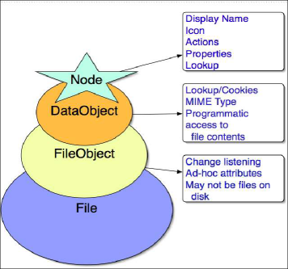

在本教程中，您将创建一个模�?�，用于为�?�定的 "Abc" 文件（扩展�??为  ``.abc`` ）安装  ``DataLoader`` 。缺�?情况下，扩展�??为 "abc" 的文件会被视为 IDE 无法识别的任何其他文件；在本教程中，我们将其视为文本文件，因此，IDE 应为 Abc 文件�??供与文本文件相�?�的功能。创建此模�?��?�，我们将�?�您演示如何用仅供 Abc 文件使用的功能�?�增强此模�?�。开�?�周期完�?�?�，您�?�以通过以下方法轻�?�地让其他人使用您的模�?�：在 IDE 中创建一个二进制文件并将此文件�?��?给其他人，�?�者�?�以通过更新中心�?�安装此文件。

== 创建模�?�项目

在本节中，我们将利用�?�导创建�?个 NetBeans 模�?�所需的�?代�?结构。�?代�?结构包�?��?于特定�?置的�?些文件夹以�?�一组始终需�?的文件。例如，�?个 NetBeans 模�?�都需�?一个  ``nbproject``  文件夹和一个  ``layer.xml``  文件，�?者用于存放项目的 meta 数�?�，�?�者用于工具�?按钮和窗�?�等项的声明性注册。

[start=1]
1. 选择“文件�?>“新建项目�?(Ctrl-Shift-N)。在“类别�?下选择“NetBeans 模�?��?。在“项目�?下选择“模�?��?，然�?��?�击“下一步�?。

[start=2]
1. 在“�??称和�?置�?�?��?�的“项目�??称�?中键入  ``AbcFileType`` 。将项目�?置更改为计算机上的任�?目录，例如  ``c:\mymodules`` 。将“独立模�?��?�?�选按钮�?留为选中状�?。此�?��?�现在应如下所示：

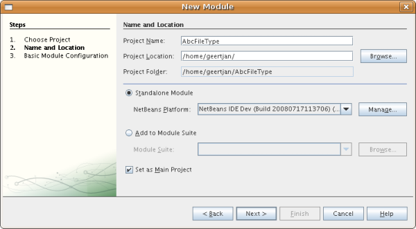

�?�击“下一步�?。

[start=3]
1. 在“基本模�?��?置�?�?��?�的“代�?�??称基�?中键入  ``org.myorg.abcfiletype`` 。在建议的模�?�显示�??称中添加空格，以将其更改为  ``Abc File Type`` 。选中“生�? XML 层�?�?选框并�?留本地化包和 XML 层的�?置，以将其存储在�??为  ``org/myorg/abcfiletype``  的包中。此�?��?�现在应如下所示：

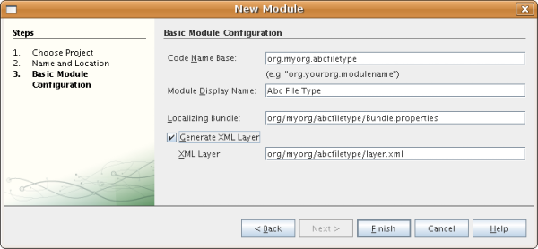

[start=4]
1. �?�击“完�?�?。

IDE 将创建  ``Abc File Type``  项目。此项目包�?�所有�?代�?和项目 meta 数�?�，例如项目的 Ant 生�?脚本。此项目将会在 IDE 中打开。您�?�以在“项目�?窗�?� (Ctrl-1) 中查看其逻辑结构，在“文件�?窗�?� (Ctrl-2) 中查看其文件结构。例如，“项目�?窗�?�现在应如下所示：

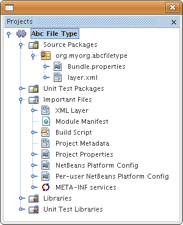 

== 识别 Abc 文件

在本节中，我们将利用�?�导创建区分 Abc 文件和所有其他文件所需的类。在本教程的开头已�??到，�?实现此目的，我们需�?一个数�?�对象�?一个数�?�加载器�?一个 MIME 类型解�?器以�?�  ``layer.xml``  文件中的注册�?�目。“新建文件类型�?�?�导将自动为我们创建所有这些内容。

[start=1]
1. �?�键�?�击项目节点，然�?�选择“新建�?>“文件类型�?。

[start=2]
1. 在“文件识别�?�?��?�中，执行以下�?作：

* 在“MIME 类型�?编辑框中键入  ``text/x-abc`` 。
* 在“按文件扩展�??�?编辑框中键入  ``.abc .ABC`` 。

“文件识别�?�?��?�现在应如下所示：

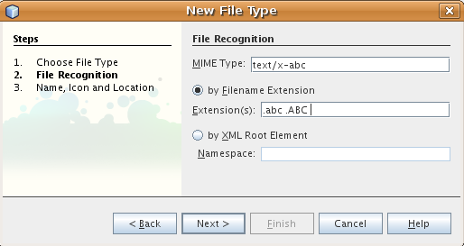

请注�?下�?��??供的有关“文件识别�?�?��?�中的字段的说明：

* *MIME 类型。*指定数�?�对象的唯一 MIME 类型。
* 按
* *文件扩展�??。*指定一个或多个文件扩展�??，IDE 将这些扩展�??识别为属于指定的 MIME 类型。�?�以选择在文件扩展�??�?�?�加一个圆点。分隔符为逗�?�和/或空格。因此，所有以下内容都是有效的：

*  ``.abc,.def`` 
*  ``.abc .def`` 
*  ``abc def`` 
*  ``abc,.def ghi, .wow`` 

我们�?�定 Abc 文件区分大�?写。为此，在本教程中指定了_两�?_ MIME 类型： ``.abc``  和  ``.ABC`` 。

* *XML 根元素。*指定唯一的�??称空间，以将该 XML 文件类型与所有其他 XML 文件类型区分开。由于许多 XML 文件具有相�?�的扩展�?? ( ``xml`` )，因此 IDE 通过 XML 根元素�?�区分�?�个 XML 文件。更确切地说，就是 IDE �?�以区分�??称空间以�?� XML 文件中的第一个 XML 元素。例如，您�?�以利用这一点�?�区分 JBoss 部署�??述符和 WebLogic 部署�??述符。区分开这两�?部署�??述符�?�，便�?�以确�?添加到 JBoss 部署�??述符上下文�?��?�中的�?��?�项对于 WebLogic 部署�??述符�?�?�用。有关示例，请�?��?  link:nbm-palette-api2.html[NetBeans 组件�?��?�模�?�教程]。

�?�击“下一步�?。

[start=3]
1. 在“�??称和�?置�?�?��?�的“类�??�?缀�?中键入  ``Abc`` ，然�?��?览到任�? 16x16 �?素的图�?文件作为新文件类型的图标，如下所示。

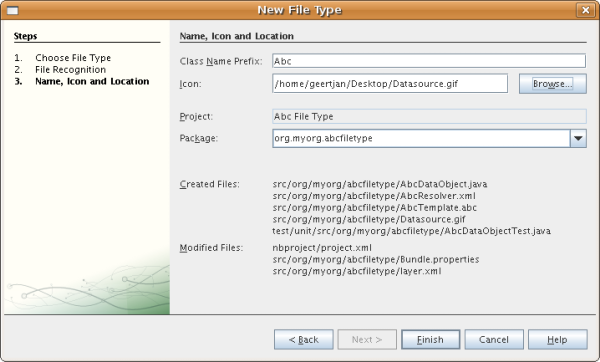

*注�?：*�?�以使用任�?图标。如果愿�?，�?�以�?�击以下图标并将其�?存在本地，然�?�在上�?�的�?�导步骤中指定该图标：

[start=4]
1. �?�击“完�?�?。

“项目�?窗�?�现在应如下所示：

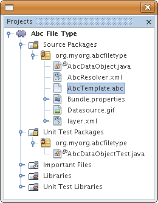

下�?�简�?介�?了�?个新生�?的文件：

* *AbcDataObject.java。*包装  ``FileObject`` 。DataObject 是由 DataLoader 生�?的。有关详细信�?�，请�?��?  link:https://netbeans.apache.org/wiki/devfaqdataobject[What is a DataObject?]（什么是 DataObject？）。
* *AbcResolver.xml。*将  ``.abc``  和  ``.ABC``  扩展�??映射到 MIME 类型。 ``AbcDataLoader``  仅识别 MIME 类型，而�?了解有关文件扩展�??的信�?�。
* *AbcTemplate.abc。*为  ``layer.xml``  中注册的文件模�?��??供了基础，以便将其作为新模�?�安装在“新建文件�?对�?框中。
* *AbcDataObjectTest.java。* ``DataObject``  的 JUnit 测试类。

在  ``layer.xml``  文件中，将会看到以下内容：

[source,xml]
----

<folder name="Loaders">
    <folder name="text">
        <folder name="x-abc">
            <folder name="Actions">
                <file name="org-myorg-abcfiletype-MyAction.shadow">
                    <attr name="originalFile" stringvalue="Actions/Edit/org-myorg-abcfiletype-MyAction.instance"/>
                    <attr name="position" intvalue="600"/>
                </file>
                <file name="org-openide-actions-CopyAction.instance">
                    <attr name="position" intvalue="100"/>
                </file>
                <file name="org-openide-actions-CutAction.instance">
                    <attr name="position" intvalue="200"/>
                </file>
                <file name="org-openide-actions-DeleteAction.instance">
                    <attr name="position" intvalue="300"/>
                </file>
                <file name="org-openide-actions-FileSystemAction.instance">
                    <attr name="position" intvalue="400"/>
                </file>
                <file name="org-openide-actions-OpenAction.instance">
                    <attr name="position" intvalue="500"/>
                </file>
                <file name="org-openide-actions-PropertiesAction.instance">
                    <attr name="position" intvalue="700"/>
                </file>
                <file name="org-openide-actions-RenameAction.instance">
                    <attr name="position" intvalue="800"/>
                </file>
                <file name="org-openide-actions-SaveAsTemplateAction.instance">
                    <attr name="position" intvalue="900"/>
                </file>
                <file name="org-openide-actions-ToolsAction.instance">
                    <attr name="position" intvalue="1000"/>
                </file>
                <file name="sep-1.instance">
                    <attr name="instanceClass" stringvalue="javax.swing.JSeparator"/>
                    <attr name="position" intvalue="1100"/>
                </file>
                <file name="sep-2.instance">
                    <attr name="instanceClass" stringvalue="javax.swing.JSeparator"/>
                    <attr name="position" intvalue="1200"/>
                </file>
                <file name="sep-3.instance">
                    <attr name="instanceClass" stringvalue="javax.swing.JSeparator"/>
                    <attr name="position" intvalue="1300"/>
                </file>
                <file name="sep-4.instance">
                    <attr name="instanceClass" stringvalue="javax.swing.JSeparator"/>
                    <attr name="position" intvalue="1400"/>
                </file>
            </folder>
            <folder name="Factories">
                <file name="AbcDataLoader.instance">
                    <attr name="SystemFileSystem.icon" urlvalue="nbresloc:/org/myorg/abcfiletype/Datasource.gif"/>
                    <attr name="dataObjectClass" stringvalue="org.myorg.abcfiletype.AbcDataObject"/>
                    <attr name="instanceCreate" methodvalue="org.openide.loaders.DataLoaderPool.factory"/>
                    <attr name="mimeType" stringvalue="text/x-abc"/>
                </file>
            </folder>
        </folder>
    </folder>
</folder>
----

== 安装和试用功能

现在，让我们安装该模�?�，然�?�使用此�?创建的基本功能。IDE 使用 Ant 生�?脚本�?�生�?和安装模�?�。此生�?脚本是在创建项目时创建的。

[start=1]
1. 在“项目�?窗�?�中，�?�键�?�击  ``Abc File Type``  项目，然�?�选择“在开�?� IDE 中安装/�?新装入�?。

将在当�?�?行的 IDE 中生�?并安装该模�?�。

[start=2]
1. 在 IDE 中创建任何类型的应用程�?。

[start=3]
1. �?�键�?�击该应用程�?节点，然�?�选择“新建�?>“其他�?。在“其他�?类别中，有一个用于创建新文件类型的虚拟模�?�：

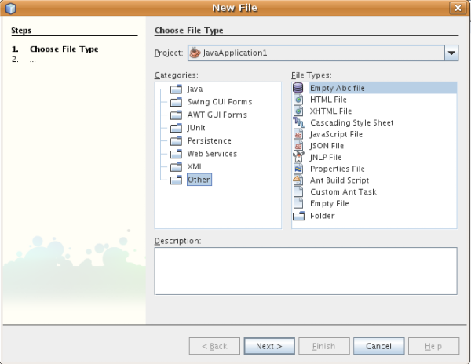

[start=4]
1. 如果�?通过该虚拟模�?��??供缺�?代�?，请将这些代�?添加到“新建文件类型�?�?�导所创建的  ``AbcTemplate.abc``  文件中。

== 为 Abc 文件创建功能

现在 NetBeans 平�?�能够将 Abc 文件与所有其他类型的文件区分开，接下�?�应添加特定于该文件类型的功能。在本节中，我们将在从资�?管�?�器窗�?�（例如，“项目�?窗�?�）�?�键�?�击该文件节点所显示的上下文�?��?�中添加一个�?��?�项，并使该文件能够在一个窗�?�中打开，而�?是在编辑器中打开。

=== 添加�?作

在本�?节中，我们将使用“新建�?作�?�?�导创建一个 Java 类，用于为我们的文件类型执行�?作。此�?�导还将在  ``layer.xml``  文件中注册该类，以使用户能够在从资�?管�?�器窗�?��?�键�?�击该文件类型节点所显示的上下文�?��?�中调用此�?作。

[start=1]
1. �?�键�?�击项目节点，然�?�选择“新建�?>“�?作�?。

[start=2]
1. 在“�?作类型�?�?��?�中，�?�击“有�?�件地�?�用�?。键入  ``AbcDataObject`` ，这是之�?由“新建文件类型�?�?�导生�?的数�?�对象的�??称，如下所示：

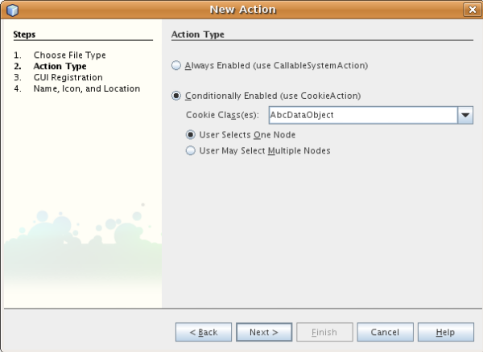

�?�击“下一步�?。

[start=3]
1. 在“GUI 注册�?�?��?�中，从“类别�?下拉列表中选择“编辑�?类别。“类别�?下拉列表用于控制�?作在 IDE 的快�?�键编辑器中的显示�?置。

接下�?�，�?�消选中“全局�?��?�项�?，然�?�选中“文件类型上下文�?��?�项�?。在“内容类型�?下拉列表中，选择您之�?在“新建文件类型�?�?�导中指定的 MIME 类型，如下所示：

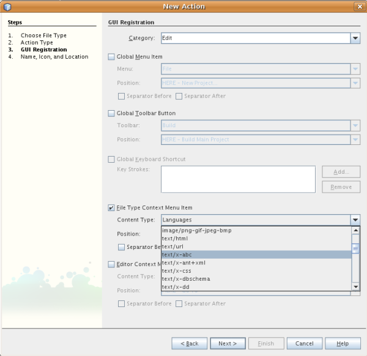

请注�?，您�?�以设置�?��?�项的�?置，并将此�?��?�项与其�?�?�和�?��?�的�?��?�项隔开。�?�击“下一步�?。

[start=4]
1. 在“�??称和�?置�?�?��?�的“类�??�?中键入  ``MyAction`` ，在“显示�??称�?中键入  ``My Action`` 。上下文�?��?��??供的�?��?�项�?显示图标。因此，请�?�击“完�?�?，此时  ``MyAction.java``  将被添加到  ``org.myorg.abcfiletype``  包中。

[start=5]
1. 在�?代�?编辑器中，将下�?�的代�?添加到此�?作的  ``performAction``  方法中：

[source,java]
----

protected void performAction(Node[] activatedNodes) {
	AbcDataObject d = (AbcDataObject) activatedNodes[0].getCookie(AbcDataObject.class);
	FileObject f = d.getPrimaryFile();
	String displayName = FileUtil.getFileDisplayName(f);
	String msg = "I am " + displayName + ". Hear me roar!"; 
        NotifyDescriptor nd = new NotifyDescriptor.Message(msg);
        DialogDisplayer.getDefault().notify(nd);
}
----

按 Ctrl-Shift-I 组�?�键。IDE 会自动将 import 语�?�添加到该类的顶部。�?些代�?�?带有红色下划线，这表示类路径中并未包括所有需�?的包。�?�键�?�击项目节点，选择“属性�?，然�?��?�击“项目属性�?对�?框中的“库�?。�?�击“库�?窗格顶部的“添加�?�?�添加“对�?框 API�?。

在  ``MyAction.java``  类中�?次按 Ctrl-Shift-I 组�?�键。红色下划线将会消失，因为 IDE 在对�?框 API 中找到了所需的包。

[start=6]
1. 在“�?�?文件�?节点中，展开“XML 层�?。"<此层>" 和 "<上下文中的此层>" 这两个节点以�?�它们的�?节点共�?�组�?了 link:https://netbeans.apache.org/tutorials/nbm-glossary.html[系统 Filesystem] �?览器。展开 "<此层>"，�?展开 "Loaders"，继续展开节点，直到显示您之�?所创建的�?作。

[start=7]
1. 将  ``My Action``  拖放到“打开�?�?作下方，如下所示：

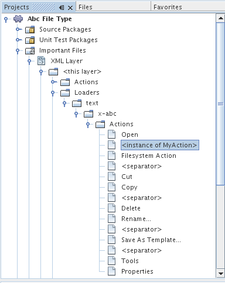

从最�?�两步�?�以看出，系统 Filesystem �?览器�?�用于快速�?组在系统 Filesystem 中注册的�?�项的顺�?。

[start=8]
1. 与上一节一样，�?次安装该模�?�。

[start=9]
1. 创建一个 ABC 文件，然�?�在�?个资�?管�?�器视图中�?�键�?�击该文件的节点，如“项目�?窗�?�或“收�?夹�?窗�?�。

请注�?，Abc 文件具有您在其模�?�中所指定的图标，并且�?�以从�?�键�?�击�?作所显示的上下文�?��?�中使用在其  ``layer.xml``  文件中定义的一系列�?作：

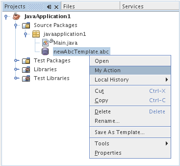

[start=10]
1. 选择新�?��?�项，将显示 Abc 文件的�??称和�?置：

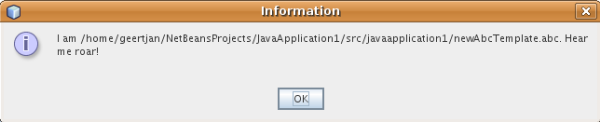

=== 在窗�?�中打开文件

缺�?情况下，当用户打开在本教程中定义的类型的文件时，该文件将在基本编辑器中打开。但是，有时您�?�能需�?创建文件的�?�视表示，以使用户能够将�?部件拖放到该�?�视表示上。创建此类用户界�?�的第一步是，使用户�?�以在窗�?�中打开文件。本�?节将�?�您演示如何执行此�?作。

[start=1]
1. �?�键�?�击项目节点，然�?�选择“新建�?>“窗�?�组件�?。请使用以下设置：

image::images/filetype_65-topc-1.png[]

[start=2]
1. �?�击“下一步�?，然�?�在“类�??�?缀�?中键入 "Abc"：

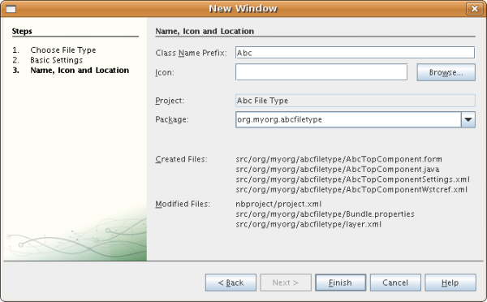

[start=3]
1. 按如下所�?更改  ``DataObject``  的构造函数，以将  ``DataObject``  更改为使用 OpenSupport 而�?是 DataEditorSupport：

[source,java]
----

public AbcDataObject(FileObject pf, AbcDataLoader loader) 
        throws DataObjectExistsException, IOException {

    super(pf, loader);
    CookieSet cookies = getCookieSet();
    //cookies.add((Node.Cookie) DataEditorSupport.create(this, getPrimaryEntry(), cookies));
    cookies.add((Node.Cookie) new AbcOpenSupport(getPrimaryEntry()));
              
}
----

[start=4]
1. 创建  ``OpenSupport``  类：

[source,java]
----

class AbcOpenSupport extends OpenSupport implements OpenCookie, CloseCookie {

    public AbcOpenSupport(AbcDataObject.Entry entry) {
        super(entry);
    }

    protected CloneableTopComponent createCloneableTopComponent() {
        AbcDataObject dobj = (AbcDataObject) entry.getDataObject();
        AbcTopComponent tc = new AbcTopComponent();
        tc.setDisplayName(dobj.getName());
        return tc;
    }
 
}
----

[start=5]
1. 调整 TopComponent 以扩展 CloneableTopComponent，而�?是 TopComponent。将 TopComponent 的类修饰符�?�其构造函数的修饰符设置为 public 而�?是 private。

�?次安装该模�?�，当打开 Abc 文件时，OpenSupport 类便会处�?�此打开�?作，以便在 TopComponent 中打开该文件，而�?是在 DataEditorSupport 所�??供的基本编辑器中打开：

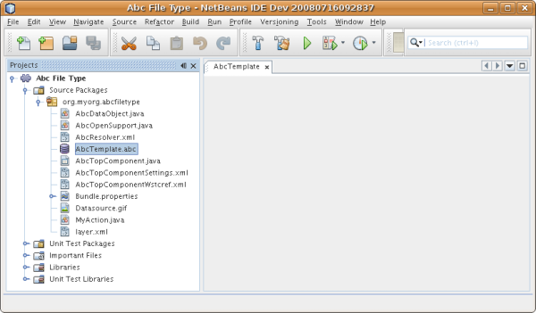

link:https://netbeans.apache.org/tutorials/60/nbm-visual_library.html[NetBeans �?�视库 6.0 教程]�??供了一个进一步开�?� TopComponent 的示例，以便以�?�视方�?显示文件内容（与本教程中定义的文件类型对应）。

== 创建�?�共享的模�?�二进制文件

该模�?�现已完�?，您�?�以将其交给其他用户使用了。为此，您需�?创建并分�?�一个二进制 "NBM"（NetBeans 模�?�）文件。

[start=1]
1. 在“项目�?窗�?�中，�?�键�?�击 "Abc File Type" 项目，然�?�选择“创建 NBM�?。

将创建 NBM 文件，您�?�以在“文件�?窗�?� (Ctrl-2) 中查看它：

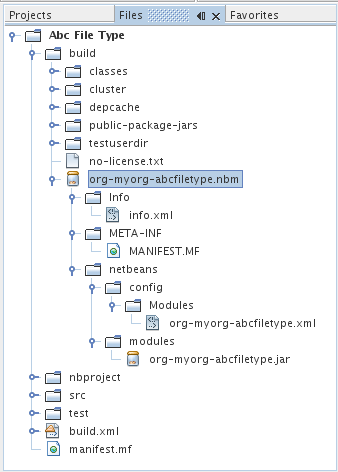

[start=2]
1. 例如，通过  link:http://plugins.netbeans.org/PluginPortal/[NetBeans �?�件门户]�?�其他人�??供该文件。接收者应使用�?�件管�?�器（“工具�?>“�?�件�?）�?�安装它。

link:http://netbeans.apache.org/community/mailing-lists.html[请将您的�?�?和建议�?��?给我们]

== �?�续步骤

有关创建和开�?� NetBeans 模�?�的详细信�?�，请�?��?以下资�?：

*  link:https://netbeans.apache.org/platform/index.html[NetBeans 平�?�主页]
*  link:https://bits.netbeans.org/dev/javadoc/[NetBeans API 列表（当�?开�?�版本）]
*  link:https://netbeans.apache.org/tutorials[其他相关教程]

